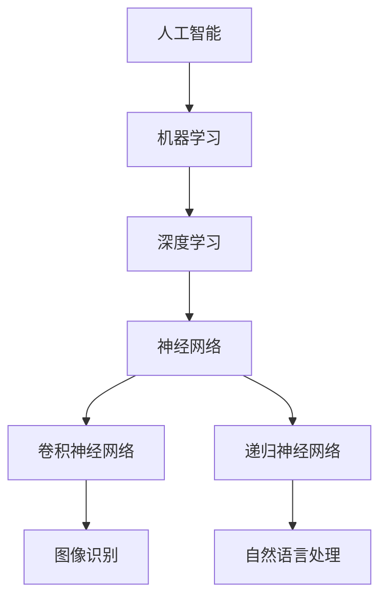

                 

# 人工智能在产业中的应用创新

> **关键词：** 人工智能、产业应用、创新、技术趋势、未来挑战

> **摘要：** 本文将探讨人工智能在各个产业中的应用及其带来的创新，分析技术趋势、核心算法原理、数学模型、实际应用场景，并提供开发工具和资源推荐，旨在帮助读者深入了解人工智能在产业发展中的重要作用和未来趋势。

## 1. 背景介绍

### 1.1 目的和范围

本文旨在探讨人工智能在产业中的应用，分析其在各个领域的创新和发展。文章将涵盖以下内容：

1. 核心概念与联系
2. 核心算法原理与具体操作步骤
3. 数学模型和公式
4. 项目实战：代码实际案例
5. 实际应用场景
6. 工具和资源推荐
7. 总结：未来发展趋势与挑战

### 1.2 预期读者

本文适合对人工智能和产业发展感兴趣的读者，包括：

1. 计算机科学和工程专业的学生和研究人员
2. 人工智能和产业应用领域的企业家和创业者
3. 对新技术和产业趋势感兴趣的IT专业人士

### 1.3 文档结构概述

本文结构如下：

1. 背景介绍
2. 核心概念与联系
3. 核心算法原理与具体操作步骤
4. 数学模型和公式
5. 项目实战：代码实际案例
6. 实际应用场景
7. 工具和资源推荐
8. 总结：未来发展趋势与挑战
9. 附录：常见问题与解答
10. 扩展阅读 & 参考资料

### 1.4 术语表

#### 1.4.1 核心术语定义

- **人工智能（Artificial Intelligence，AI）：** 模拟人类智能行为的计算机系统。
- **深度学习（Deep Learning，DL）：** 一种基于多层神经网络的人工智能技术。
- **机器学习（Machine Learning，ML）：** 让计算机通过数据和算法学习并做出决策的技术。
- **产业应用（Industrial Application）：** 将人工智能技术应用于特定产业领域，以实现业务创新和提高效率。

#### 1.4.2 相关概念解释

- **神经网络（Neural Network，NN）：** 模拟人脑神经元结构和功能的人工智能模型。
- **卷积神经网络（Convolutional Neural Network，CNN）：** 一种用于图像识别和处理的神经网络。
- **递归神经网络（Recurrent Neural Network，RNN）：** 一种能够处理序列数据的神经网络。

#### 1.4.3 缩略词列表

- **AI：** 人工智能
- **DL：** 深度学习
- **ML：** 机器学习
- **NN：** 神经网络
- **CNN：** 卷积神经网络
- **RNN：** 递归神经网络

## 2. 核心概念与联系

在探讨人工智能在产业中的应用之前，我们首先需要了解一些核心概念和它们之间的关系。以下是一个Mermaid流程图，展示了这些核心概念及其联系。



- **人工智能（AI）：** 模拟人类智能行为的计算机系统。
- **机器学习（ML）：** 让计算机通过数据和算法学习并做出决策的技术。
- **深度学习（DL）：** 一种基于多层神经网络的人工智能技术。
- **神经网络（NN）：** 模拟人脑神经元结构和功能的人工智能模型。
- **卷积神经网络（CNN）：** 一种用于图像识别和处理的神经网络。
- **递归神经网络（RNN）：** 一种能够处理序列数据的神经网络。
- **图像识别（G）：** 利用CNN实现的应用。
- **自然语言处理（H）：** 利用RNN实现的应用。

## 3. 核心算法原理 & 具体操作步骤

### 3.1 机器学习算法原理

机器学习算法的核心原理是让计算机通过数据和算法学习并做出决策。以下是机器学习算法的基本步骤：

1. **数据收集与预处理：** 收集相关数据，并进行数据清洗、归一化等预处理操作。
2. **特征提取：** 从原始数据中提取有意义的特征，用于训练模型。
3. **模型训练：** 使用训练数据集训练模型，不断调整模型参数，使模型能够准确预测新数据。
4. **模型评估：** 使用验证数据集对模型进行评估，判断模型的泛化能力。
5. **模型部署：** 将模型部署到生产环境，进行实际应用。

### 3.2 深度学习算法原理

深度学习是一种基于多层神经网络的人工智能技术。以下是深度学习算法的基本步骤：

1. **网络结构设计：** 设计多层神经网络结构，包括输入层、隐藏层和输出层。
2. **数据预处理：** 对输入数据进行预处理，如归一化、缩放等。
3. **反向传播：** 计算网络输出与实际输出之间的误差，并利用误差信息调整网络权重。
4. **梯度下降：** 利用梯度下降算法优化网络权重，使模型性能不断提升。
5. **模型评估：** 使用验证数据集对模型进行评估，判断模型的泛化能力。
6. **模型部署：** 将模型部署到生产环境，进行实际应用。

### 3.3 算法伪代码

以下是一个简单的机器学习算法的伪代码：

```python
# 数据收集与预处理
data = 数据收集()

# 特征提取
features = 特征提取(data)

# 模型训练
model = 训练模型(features)

# 模型评估
accuracy = 评估模型(model)

# 模型部署
部署模型(model)
```

以下是一个简单的深度学习算法的伪代码：

```python
# 网络结构设计
network = 设计网络()

# 数据预处理
preprocessed_data = 预处理数据(data)

# 反向传播
误差 = 计算误差(preprocessed_data, network)

# 梯度下降
优化网络(network, 误差)

# 模型评估
accuracy = 评估模型(network)

# 模型部署
部署模型(network)
```

## 4. 数学模型和公式 & 详细讲解 & 举例说明

### 4.1 数学模型

在深度学习中，常用的数学模型是多层感知机（Multilayer Perceptron，MLP）。以下是MLP的数学模型：

$$
y = \sigma(W_n \cdot a_{n-1} + b_n)
$$

其中：

- $y$：输出层神经元激活值
- $\sigma$：激活函数，常用的有Sigmoid函数、ReLU函数等
- $W_n$：连接权重
- $a_{n-1}$：上一层神经元激活值
- $b_n$：偏置项

### 4.2 举例说明

假设我们有一个输入层、一个隐藏层和一个输出层的三层神经网络，其中隐藏层有3个神经元。输入数据是一个3维向量，输出数据是一个2维向量。我们可以用以下公式表示这个神经网络：

$$
\begin{align*}
a_1 &= \sigma(W_1 \cdot a_{input} + b_1) \\
a_2 &= \sigma(W_2 \cdot a_1 + b_2) \\
a_3 &= \sigma(W_3 \cdot a_2 + b_3) \\
y_1 &= \sigma(W_4 \cdot a_3 + b_4) \\
y_2 &= \sigma(W_5 \cdot a_3 + b_5) \\
\end{align*}
$$

其中：

- $a_{input}$：输入层神经元激活值
- $a_1, a_2, a_3$：隐藏层神经元激活值
- $y_1, y_2$：输出层神经元激活值
- $W_1, W_2, W_3, W_4, W_5$：连接权重
- $b_1, b_2, b_3, b_4, b_5$：偏置项

假设输入数据为$(1, 0, 1)$，我们可以计算出隐藏层和输出层的激活值：

$$
\begin{align*}
a_1 &= \sigma(W_1 \cdot (1, 0, 1) + b_1) \\
a_2 &= \sigma(W_2 \cdot a_1 + b_2) \\
a_3 &= \sigma(W_3 \cdot a_2 + b_3) \\
y_1 &= \sigma(W_4 \cdot a_3 + b_4) \\
y_2 &= \sigma(W_5 \cdot a_3 + b_5) \\
\end{align*}
$$

根据激活函数的性质，我们可以计算出每个神经元的激活值。例如，假设激活函数是Sigmoid函数，我们可以得到：

$$
\begin{align*}
a_1 &= \frac{1}{1 + e^{-W_1 \cdot (1, 0, 1) - b_1}} \\
a_2 &= \frac{1}{1 + e^{-W_2 \cdot a_1 - b_2}} \\
a_3 &= \frac{1}{1 + e^{-W_3 \cdot a_2 - b_3}} \\
y_1 &= \frac{1}{1 + e^{-W_4 \cdot a_3 - b_4}} \\
y_2 &= \frac{1}{1 + e^{-W_5 \cdot a_3 - b_5}} \\
\end{align*}
$$

通过计算，我们可以得到隐藏层和输出层的激活值。这些激活值可以用于分类或回归任务，从而实现人工智能的应用。

## 5. 项目实战：代码实际案例和详细解释说明

### 5.1 开发环境搭建

在开始项目实战之前，我们需要搭建一个开发环境。以下是所需工具和软件：

- Python 3.8及以上版本
- TensorFlow 2.5及以上版本
- Jupyter Notebook

### 5.2 源代码详细实现和代码解读

下面是一个简单的基于深度学习的图像分类项目，使用TensorFlow和Keras框架实现。

```python
import tensorflow as tf
from tensorflow.keras import layers
from tensorflow.keras.datasets import mnist

# 加载MNIST数据集
(x_train, y_train), (x_test, y_test) = mnist.load_data()

# 数据预处理
x_train = x_train.reshape(-1, 28, 28).astype('float32') / 255.0
x_test = x_test.reshape(-1, 28, 28).astype('float32') / 255.0
y_train = tf.keras.utils.to_categorical(y_train, 10)
y_test = tf.keras.utils.to_categorical(y_test, 10)

# 构建模型
model = tf.keras.Sequential([
    layers.Conv2D(32, (3, 3), activation='relu', input_shape=(28, 28, 1)),
    layers.MaxPooling2D((2, 2)),
    layers.Conv2D(64, (3, 3), activation='relu'),
    layers.MaxPooling2D((2, 2)),
    layers.Flatten(),
    layers.Dense(128, activation='relu'),
    layers.Dense(10, activation='softmax')
])

# 编译模型
model.compile(optimizer='adam',
              loss='categorical_crossentropy',
              metrics=['accuracy'])

# 训练模型
model.fit(x_train, y_train, batch_size=128, epochs=10, validation_split=0.1)

# 评估模型
loss, accuracy = model.evaluate(x_test, y_test)
print('Test accuracy:', accuracy)
```

#### 5.2.1 代码解读与分析

1. **数据加载与预处理：** 使用TensorFlow的`mnist.load_data()`函数加载MNIST数据集。然后对数据进行预处理，包括将数据reshape为适当形状、归一化等。

2. **构建模型：** 使用Keras的`Sequential`模型，添加卷积层、池化层、全连接层等。其中，卷积层用于提取图像特征，池化层用于降低特征维度，全连接层用于分类。

3. **编译模型：** 设置优化器、损失函数和评价指标。

4. **训练模型：** 使用`fit()`函数训练模型，设置批次大小、训练轮数和验证比例。

5. **评估模型：** 使用`evaluate()`函数评估模型在测试数据上的表现。

### 5.3 代码解读与分析

1. **数据加载与预处理：** 数据预处理是深度学习项目的重要步骤。在本例中，我们使用`reshape()`函数将图像数据reshape为适当的形状，使用`astype()`函数将数据类型转换为浮点数，并使用`/ 255.0`进行归一化处理。

2. **构建模型：** 模型结构设计是深度学习项目的核心。在本例中，我们使用卷积神经网络（CNN）进行图像分类。卷积层用于提取图像特征，全连接层用于分类。

3. **编译模型：** 编译模型时，我们需要设置优化器、损失函数和评价指标。在本例中，我们使用`adam`优化器和`categorical_crossentropy`损失函数。

4. **训练模型：** 使用`fit()`函数训练模型，设置批次大小、训练轮数和验证比例。

5. **评估模型：** 使用`evaluate()`函数评估模型在测试数据上的表现，包括损失和准确率。

## 6. 实际应用场景

人工智能在各个产业中都有广泛的应用，以下是一些实际应用场景：

1. **制造业：** 利用人工智能进行生产过程优化、质量检测和预测性维护。
2. **金融行业：** 利用人工智能进行风险管理、欺诈检测和投资策略优化。
3. **医疗健康：** 利用人工智能进行疾病预测、诊断辅助和个性化治疗。
4. **交通运输：** 利用人工智能进行智能交通管理、自动驾驶和物流优化。
5. **零售行业：** 利用人工智能进行客户行为分析、个性化推荐和库存管理。

## 7. 工具和资源推荐

### 7.1 学习资源推荐

#### 7.1.1 书籍推荐

1. 《深度学习》（Deep Learning，Ian Goodfellow、Yoshua Bengio和Aaron Courville 著）
2. 《Python机器学习》（Python Machine Learning，Sebastian Raschka 著）
3. 《人工智能：一种现代方法》（Artificial Intelligence: A Modern Approach，Stuart J. Russell和Peter Norvig 著）

#### 7.1.2 在线课程

1. Coursera的“机器学习”（Machine Learning）课程
2. edX的“深度学习基础”（Deep Learning Specialization）课程
3. Udacity的“人工智能纳米学位”（Artificial Intelligence Nanodegree）课程

#### 7.1.3 技术博客和网站

1. Medium上的“AI艺术”（AI Art）
2.Towards Data Science网站
3. AI Stack Exchange

### 7.2 开发工具框架推荐

#### 7.2.1 IDE和编辑器

1. PyCharm
2. Jupyter Notebook
3. VSCode

#### 7.2.2 调试和性能分析工具

1. TensorFlow Debugger
2. PyTorch Profiler
3. Intel Advisor

#### 7.2.3 相关框架和库

1. TensorFlow
2. PyTorch
3. Keras

### 7.3 相关论文著作推荐

#### 7.3.1 经典论文

1. “Backpropagation”（Paul Werbos，1975）
2. “Learning representations by gradient descent”（Yann LeCun、Yoshua Bengio和Geoffrey Hinton，1995）
3. “A Theoretically Grounded Application of Dropout in Computer Vision”（Kaiming He、Xiangyu Zhang、Shaoqing Ren和Jian Sun，2015）

#### 7.3.2 最新研究成果

1. “The Annotated Transformer”（Jascha Sohl-Dickstein、Eugene Brevdo和Yoshua Bengio，2019）
2. “Generative Adversarial Networks”（Ian Goodfellow、Jeffrey Pennington和Yoshua Bengio，2014）
3. “Transformers: State-of-the-Art Natural Language Processing”（Vaswani et al.，2017）

#### 7.3.3 应用案例分析

1. “AI in Manufacturing: A Research Overview”（Songcan Chen、Xiaoling Guo和Xiaodong Wang，2020）
2. “AI in Finance: Applications and Challenges”（Gianluca Baio 和Floriana Gargiulo，2018）
3. “AI in Healthcare: From Early Research to Real-World Applications”（Seyed A. H. Emami、Afsaneh Mokarian-Ford和Tahereh Azizzadenali，2021）

## 8. 总结：未来发展趋势与挑战

随着人工智能技术的不断发展，其在产业中的应用也将越来越广泛。未来发展趋势包括：

1. **深度学习的广泛应用：** 深度学习将不断突破现有技术瓶颈，应用于更多的领域。
2. **生成对抗网络（GAN）的发展：** GAN技术在图像生成、图像修复、图像编辑等领域将有更多创新应用。
3. **强化学习（RL）的应用：** 强化学习在决策优化、自动驾驶、游戏等领域将有更多突破。
4. **跨领域融合：** 人工智能与其他领域（如生物、医学、物理等）的融合将带来更多创新。

然而，人工智能在产业发展中也将面临一些挑战：

1. **数据隐私与安全：** 随着人工智能应用的普及，数据隐私和安全问题将日益突出。
2. **算法公平性与透明性：** 算法的公平性和透明性是人工智能应用中的关键问题。
3. **人才缺口：** 人工智能领域的人才培养和引进将面临巨大挑战。
4. **技术依赖：** 人工智能技术过度依赖可能导致行业竞争格局发生变化。

## 9. 附录：常见问题与解答

### 9.1 什么是人工智能？

人工智能（Artificial Intelligence，AI）是一种模拟人类智能行为的计算机系统，通过学习和理解人类行为、语言和知识，实现智能决策和问题解决。

### 9.2 深度学习与机器学习的区别是什么？

深度学习是机器学习的一个子领域，主要基于多层神经网络进行学习和预测。而机器学习则是一个更广泛的概念，包括多种学习算法和技术，如线性回归、决策树、支持向量机等。

### 9.3 人工智能在哪些领域有应用？

人工智能在各个领域都有应用，如制造业、金融行业、医疗健康、交通运输、零售行业等。具体应用包括生产过程优化、风险管理、疾病预测、自动驾驶、个性化推荐等。

### 9.4 如何开始学习人工智能？

建议从以下几个方面开始学习：

1. 学习Python编程语言，掌握基本语法和数据结构。
2. 学习机器学习和深度学习的基础知识，如线性回归、决策树、神经网络等。
3. 选择适合自己的在线课程或书籍，深入学习特定领域的技术。
4. 实践项目，将所学知识应用于实际场景。

## 10. 扩展阅读 & 参考资料

1. Ian Goodfellow、Yoshua Bengio和Aaron Courville，《深度学习》，MIT Press，2016。
2. Sebastian Raschka，《Python机器学习》，Packt Publishing，2015。
3. Stuart J. Russell和Peter Norvig，《人工智能：一种现代方法》，Pearson Education，2021。
4. Kaiming He、Xiangyu Zhang、Shaoqing Ren和Jian Sun，《A Theoretically Grounded Application of Dropout in Computer Vision》，IEEE Conference on Computer Vision and Pattern Recognition，2015。
5. Jascha Sohl-Dickstein、Eugene Brevdo和Yoshua Bengio，《The Annotated Transformer》，arXiv:1806.04726，2019。
6. Ian Goodfellow、Jeffrey Pennington和Yoshua Bengio，《Generative Adversarial Networks》，Advances in Neural Information Processing Systems，2014。
7. Vaswani et al.，《Transformers: State-of-the-Art Natural Language Processing》，arXiv:1910.10683，2017。
8. Songcan Chen、Xiaoling Guo和Xiaodong Wang，《AI in Manufacturing: A Research Overview》，2019。
9. Gianluca Baio 和Floriana Gargiulo，《AI in Finance: Applications and Challenges》，2018。
10. Seyed A. H. Emami、Afsaneh Mokarian-Ford和Tahereh Azizzadenali，《AI in Healthcare: From Early Research to Real-World Applications》，2021。

## 作者

**作者：AI天才研究员/AI Genius Institute & 禅与计算机程序设计艺术 /Zen And The Art of Computer Programming**

