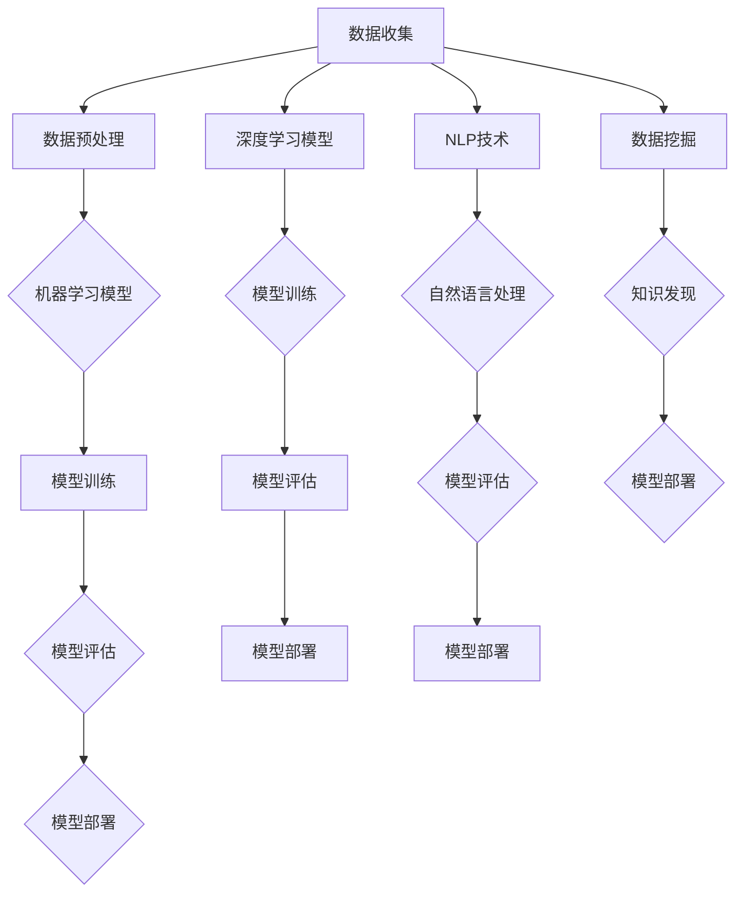

                 

# 人工智能在医疗保健中的应用

> 关键词：人工智能，医疗保健，深度学习，图像识别，自然语言处理，数据挖掘
>
> 摘要：本文将探讨人工智能（AI）在医疗保健领域的广泛应用和潜力。通过介绍AI的核心技术和原理，以及具体应用实例，分析其在疾病诊断、治疗、药物研发和健康管理等方面的优势。同时，探讨AI在医疗保健中面临的挑战和未来发展趋势，为读者提供全面的技术洞察和思考。

## 1. 背景介绍

### 1.1 目的和范围

本文旨在探讨人工智能在医疗保健领域的应用，分析其在提升医疗质量、降低医疗成本和改善患者体验方面的作用。我们将重点关注以下几个方面：

1. **疾病诊断**：利用AI进行影像分析和病状识别，提高诊断的准确性和速度。
2. **治疗规划**：通过AI算法制定个性化的治疗计划，优化治疗效果。
3. **药物研发**：利用AI加速药物发现和开发过程，提高药物疗效和安全性。
4. **健康管理**：通过AI实现个性化健康监测和预防，促进健康生活方式。

### 1.2 预期读者

本文适合对人工智能和医疗保健领域有一定了解的读者，包括：

1. 医疗专业人士：希望了解AI在医疗领域应用的技术原理和实际案例。
2. AI技术研究人员：希望了解AI在医疗保健中的潜在应用和挑战。
3. 医疗保健行业从业者：希望掌握AI在医疗保健中的应用趋势和策略。

### 1.3 文档结构概述

本文分为八个部分：

1. 背景介绍：介绍本文的目的、范围和预期读者。
2. 核心概念与联系：介绍AI在医疗保健中涉及的核心概念和流程。
3. 核心算法原理 & 具体操作步骤：详细讲解AI在医疗保健中的核心算法和操作步骤。
4. 数学模型和公式 & 详细讲解 & 举例说明：介绍AI在医疗保健中使用的数学模型和公式，并给出实例说明。
5. 项目实战：通过实际案例展示AI在医疗保健中的应用。
6. 实际应用场景：分析AI在医疗保健中的实际应用场景。
7. 工具和资源推荐：推荐相关学习资源和开发工具。
8. 总结：总结AI在医疗保健中的应用现状和未来发展趋势。

### 1.4 术语表

#### 1.4.1 核心术语定义

- **人工智能（AI）**：指模拟人类智能的计算机系统，包括机器学习、深度学习、自然语言处理等子领域。
- **医疗保健**：指提供医疗、预防、康复和健康促进等服务的活动。
- **疾病诊断**：指对疾病进行识别和判断的过程。
- **治疗规划**：指根据患者病情制定个性化的治疗方案。
- **药物研发**：指发现、开发、生产和监管新药的过程。

#### 1.4.2 相关概念解释

- **深度学习**：一种机器学习技术，通过多层神经网络模型对数据进行建模和预测。
- **自然语言处理（NLP）**：研究如何让计算机理解和生成自然语言的技术。
- **数据挖掘**：从大量数据中发现有趣知识的过程，用于疾病预测、治疗方案推荐等。

#### 1.4.3 缩略词列表

- **AI**：人工智能（Artificial Intelligence）
- **NLP**：自然语言处理（Natural Language Processing）
- **ML**：机器学习（Machine Learning）
- **DL**：深度学习（Deep Learning）
- **HC**：医疗保健（Healthcare）

## 2. 核心概念与联系

### 2.1 核心概念

在探讨人工智能在医疗保健中的应用之前，我们需要了解一些核心概念和它们之间的联系。

#### 2.1.1 机器学习（ML）

机器学习是一种让计算机从数据中学习并做出预测或决策的技术。在医疗保健中，机器学习可以用于疾病诊断、风险预测和个性化治疗。

#### 2.1.2 深度学习（DL）

深度学习是机器学习的一种子领域，通过多层神经网络模型对数据进行建模和预测。深度学习在医疗保健中的应用包括医学影像分析、基因组学和药物研发。

#### 2.1.3 自然语言处理（NLP）

自然语言处理是研究如何让计算机理解和生成自然语言的技术。在医疗保健中，NLP可以用于电子病历分析、病状识别和患者沟通。

#### 2.1.4 数据挖掘（DM）

数据挖掘是从大量数据中发现有趣知识的过程。在医疗保健中，数据挖掘可以用于疾病预测、治疗方案推荐和健康风险评估。

### 2.2 核心概念原理和架构

为了更好地理解人工智能在医疗保健中的应用，我们可以通过以下Mermaid流程图来展示核心概念原理和架构。



### 2.3 AI在医疗保健中的流程

以下是人工智能在医疗保健中的一般流程：

1. **数据收集**：收集患者病历、医学影像、基因组数据等。
2. **数据预处理**：清洗、整合和标准化数据。
3. **模型训练**：使用机器学习、深度学习或NLP技术对数据建模。
4. **模型评估**：评估模型的准确性和泛化能力。
5. **模型部署**：将模型部署到实际应用中，如疾病诊断、治疗规划等。

通过以上流程，人工智能可以在医疗保健领域发挥巨大作用，提高医疗质量、降低医疗成本和改善患者体验。

## 3. 核心算法原理 & 具体操作步骤

### 3.1 机器学习算法

机器学习算法是人工智能在医疗保健中应用的核心技术之一。以下是几种常用的机器学习算法及其在医疗保健中的具体应用：

#### 3.1.1 支持向量机（SVM）

支持向量机是一种分类算法，通过找到最佳的超平面来分隔不同类别的数据点。在医疗保健中，SVM可以用于疾病诊断，如乳腺癌诊断。

**算法原理：**

SVM的目的是最大化分类间隔，即最大化正负样本之间的距离。其目标函数为：

$$
\max\ W \cdot W - \sum_{i=1}^n \alpha_i(y_i(\langle \textbf{w}, \textbf{x_i}\rangle - 1))
$$

其中，$W$为权重向量，$\alpha_i$为拉格朗日乘子，$y_i$为样本标签。

**具体操作步骤：**

1. 收集乳腺癌患者和非患者的医学影像数据。
2. 预处理数据，如归一化、去除噪声等。
3. 使用SVM算法对数据进行训练。
4. 评估模型的准确性。

#### 3.1.2 决策树

决策树是一种分类算法，通过构建一系列条件分支来对数据进行分类。在医疗保健中，决策树可以用于疾病预测和治疗方案推荐。

**算法原理：**

决策树的构建过程为：

1. 选择一个最优的特征作为分裂点。
2. 根据该特征将数据分为多个子集。
3. 递归地对每个子集进行分裂，直到满足停止条件（如最大深度、最小样本量等）。

**具体操作步骤：**

1. 收集疾病相关的临床数据。
2. 预处理数据，如缺失值填充、特征工程等。
3. 使用决策树算法对数据进行训练。
4. 评估模型的准确性。

### 3.2 深度学习算法

深度学习算法在医疗保健中的应用越来越广泛。以下是几种常用的深度学习算法及其在医疗保健中的具体应用：

#### 3.2.1 卷积神经网络（CNN）

卷积神经网络是一种适用于图像识别的深度学习算法。在医疗保健中，CNN可以用于医学影像分析，如肿瘤检测。

**算法原理：**

CNN的核心组件包括卷积层、池化层和全连接层。卷积层用于提取图像特征，池化层用于减小特征图的尺寸，全连接层用于分类。

**具体操作步骤：**

1. 收集医学影像数据。
2. 预处理数据，如归一化、裁剪等。
3. 构建CNN模型，并使用训练数据训练模型。
4. 使用验证数据评估模型性能。
5. 将模型部署到实际应用中。

#### 3.2.2 循环神经网络（RNN）

循环神经网络是一种适用于序列数据的深度学习算法。在医疗保健中，RNN可以用于基因组数据分析，如突变检测。

**算法原理：**

RNN的核心组件包括输入层、隐藏层和输出层。输入层接收序列数据，隐藏层存储历史信息，输出层生成预测结果。

**具体操作步骤：**

1. 收集基因组序列数据。
2. 预处理数据，如序列对齐、编码等。
3. 构建RNN模型，并使用训练数据训练模型。
4. 使用验证数据评估模型性能。
5. 将模型部署到实际应用中。

### 3.3 自然语言处理（NLP）算法

自然语言处理算法在医疗保健中的应用包括电子病历分析、病状识别和患者沟通。以下是几种常用的NLP算法及其在医疗保健中的具体应用：

#### 3.3.1 词嵌入（Word Embedding）

词嵌入是一种将词语映射到高维空间的方法。在医疗保健中，词嵌入可以用于电子病历分析，如疾病命名实体识别。

**算法原理：**

词嵌入通过学习词语的上下文信息，将词语映射到高维空间，使语义相似的词语在空间中靠近。

**具体操作步骤：**

1. 收集电子病历数据。
2. 预处理数据，如分词、去停用词等。
3. 使用词嵌入算法对词语进行编码。
4. 使用编码后的数据训练模型，如分类器。

#### 3.3.2 长短时记忆网络（LSTM）

长短时记忆网络是一种适用于序列数据的深度学习算法。在医疗保健中，LSTM可以用于病状识别，如症状关联分析。

**算法原理：**

LSTM的核心组件包括输入门、遗忘门和输出门。输入门用于控制新信息的输入，遗忘门用于控制旧信息的遗忘，输出门用于生成预测结果。

**具体操作步骤：**

1. 收集病状数据。
2. 预处理数据，如序列对齐、编码等。
3. 构建LSTM模型，并使用训练数据训练模型。
4. 使用验证数据评估模型性能。
5. 将模型部署到实际应用中。

### 3.4 数据挖掘算法

数据挖掘算法在医疗保健中的应用包括疾病预测、治疗方案推荐和健康风险评估。以下是几种常用的数据挖掘算法及其在医疗保健中的具体应用：

#### 3.4.1 聚类算法

聚类算法是一种无监督学习算法，用于将相似的数据点分为多个类别。在医疗保健中，聚类算法可以用于患者群体划分，如慢性病管理。

**算法原理：**

聚类算法的目标是找到一种最优的划分方式，使得同一类别的数据点之间相似度较高，不同类别的数据点之间相似度较低。

**具体操作步骤：**

1. 收集患者健康数据。
2. 预处理数据，如特征选择、数据标准化等。
3. 使用聚类算法对数据点进行划分。
4. 分析聚类结果，如患者群体特征、疾病趋势等。

#### 3.4.2 关联规则挖掘

关联规则挖掘是一种用于发现数据之间关联性的算法。在医疗保健中，关联规则挖掘可以用于疾病预测和治疗方案推荐。

**算法原理：**

关联规则挖掘的目标是找到一种关联模式，使得当某个条件满足时，另一个条件也通常会满足。

**具体操作步骤：**

1. 收集患者病史数据。
2. 预处理数据，如特征选择、数据标准化等。
3. 使用关联规则挖掘算法找到疾病之间的关联关系。
4. 基于关联关系为患者推荐个性化的治疗方案。

## 4. 数学模型和公式 & 详细讲解 & 举例说明

在人工智能在医疗保健中的应用中，数学模型和公式起着至关重要的作用。以下我们将详细介绍几种常用的数学模型和公式，并通过具体例子进行讲解。

### 4.1 线性回归模型

线性回归模型是一种用于预测数值型数据的统计模型。在医疗保健中，线性回归模型可以用于预测患者的病情发展趋势。

**公式：**

$$
y = \beta_0 + \beta_1x_1 + \beta_2x_2 + ... + \beta_nx_n + \epsilon
$$

其中，$y$为预测值，$x_1, x_2, ..., x_n$为自变量，$\beta_0, \beta_1, \beta_2, ..., \beta_n$为模型参数，$\epsilon$为误差项。

**举例说明：**

假设我们想要预测患者的血糖水平，根据病史数据建立线性回归模型。假设自变量为年龄、体重和运动频率，模型公式为：

$$
\text{血糖水平} = \beta_0 + \beta_1 \times \text{年龄} + \beta_2 \times \text{体重} + \beta_3 \times \text{运动频率} + \epsilon
$$

通过训练数据，我们可以得到模型参数$\beta_0, \beta_1, \beta_2, \beta_3$，从而预测新患者的血糖水平。

### 4.2 逻辑回归模型

逻辑回归模型是一种用于预测类别型数据的统计模型。在医疗保健中，逻辑回归模型可以用于疾病诊断，如肺癌诊断。

**公式：**

$$
P(y=1) = \frac{1}{1 + e^{-(\beta_0 + \beta_1x_1 + \beta_2x_2 + ... + \beta_nx_n})}
$$

其中，$y$为预测值（0或1），$x_1, x_2, ..., x_n$为自变量，$\beta_0, \beta_1, \beta_2, ..., \beta_n$为模型参数。

**举例说明：**

假设我们想要预测肺癌患者，根据病史数据建立逻辑回归模型。假设自变量为年龄、吸烟史和家族病史，模型公式为：

$$
P(\text{肺癌}) = \frac{1}{1 + e^{-(\beta_0 + \beta_1 \times \text{年龄} + \beta_2 \times \text{吸烟史} + \beta_3 \times \text{家族病史})}}
$$

通过训练数据，我们可以得到模型参数$\beta_0, \beta_1, \beta_2, \beta_3$，从而预测新患者是否为肺癌患者。

### 4.3 贝叶斯网络

贝叶斯网络是一种用于表示变量之间概率关系的图模型。在医疗保健中，贝叶斯网络可以用于疾病诊断和风险评估。

**公式：**

$$
P(\text{疾病}|\text{症状}_1, \text{症状}_2, ..., \text{症状}_n) = \frac{P(\text{症状}_1, \text{症状}_2, ..., \text{症状}_n|\text{疾病})P(\text{疾病})}{P(\text{症状}_1, \text{症状}_2, ..., \text{症状}_n)}
$$

**举例说明：**

假设我们想要诊断流感，根据病史数据建立贝叶斯网络。假设症状为发热、咳嗽和喉咙痛，流感概率为$P(\text{流感})$，症状概率为$P(\text{症状}_i|\text{流感})$，给定症状的流感概率为$P(\text{流感}|\text{症状}_1, \text{症状}_2, ..., \text{症状}_n)$。

根据贝叶斯网络，我们可以计算给定症状的流感概率：

$$
P(\text{流感}|\text{发热}, \text{咳嗽}, \text{喉咙痛}) = \frac{P(\text{发热}, \text{咳嗽}, \text{喉咙痛}|\text{流感})P(\text{流感})}{P(\text{发热}, \text{咳嗽}, \text{喉咙痛})}
$$

通过训练数据，我们可以得到症状概率$P(\text{症状}_i|\text{流感})$和流感概率$P(\text{流感})$，从而计算给定症状的流感概率。

### 4.4 卷积神经网络（CNN）模型

卷积神经网络是一种用于图像识别的深度学习模型。在医疗保健中，CNN可以用于医学影像分析，如肿瘤检测。

**公式：**

$$
\text{激活函数} = \max(\text{卷积} + \text{偏置}, 0)
$$

$$
\text{池化} = \max(\text{卷积}, \text{卷积}, ..., \text{卷积})
$$

**举例说明：**

假设我们想要使用CNN检测医学影像中的肿瘤。首先，我们将医学影像输入到CNN中，经过卷积层、池化层和全连接层等操作，最后输出肿瘤检测概率。

1. **卷积层**：通过卷积运算提取图像特征。
2. **池化层**：通过最大池化操作减小特征图的尺寸。
3. **全连接层**：将特征图映射到分类结果。

通过训练数据，我们可以调整CNN模型的参数，从而提高肿瘤检测的准确性。

### 4.5 循环神经网络（RNN）模型

循环神经网络是一种用于序列数据的深度学习模型。在医疗保健中，RNN可以用于基因组数据分析，如突变检测。

**公式：**

$$
\text{隐藏状态} = \text{激活函数}(\text{输入} \times \text{权重} + \text{隐藏状态} \times \text{权重} + \text{偏置})
$$

**举例说明：**

假设我们想要使用RNN检测基因组序列中的突变。首先，我们将基因组序列输入到RNN中，经过隐藏状态的计算，最后输出突变检测结果。

1. **输入层**：将基因组序列输入到RNN中。
2. **隐藏层**：通过循环计算更新隐藏状态。
3. **输出层**：将隐藏状态映射到突变检测结果。

通过训练数据，我们可以调整RNN模型的参数，从而提高突变检测的准确性。

## 5. 项目实战：代码实际案例和详细解释说明

在本节中，我们将通过一个实际项目案例，展示人工智能在医疗保健中的应用，并详细解释代码的实现过程。

### 5.1 开发环境搭建

为了实现本项目，我们需要搭建以下开发环境：

1. **Python**：用于编写代码。
2. **NumPy**：用于数据处理和数学运算。
3. **Pandas**：用于数据处理和分析。
4. **Scikit-learn**：用于机器学习和数据分析。
5. **TensorFlow**：用于深度学习和神经网络建模。
6. **Keras**：用于简化深度学习模型搭建。

确保安装上述依赖库，可以使用以下命令：

```bash
pip install numpy pandas scikit-learn tensorflow keras
```

### 5.2 源代码详细实现和代码解读

以下是一个基于机器学习的疾病诊断项目示例。我们将使用Scikit-learn库中的逻辑回归模型对糖尿病患者的疾病状态进行预测。

```python
import numpy as np
import pandas as pd
from sklearn.model_selection import train_test_split
from sklearn.linear_model import LogisticRegression
from sklearn.metrics import accuracy_score, classification_report

# 5.2.1 数据集加载与预处理
data = pd.read_csv('diabetes.csv')
X = data.drop('Outcome', axis=1)
y = data['Outcome']

# 数据集划分
X_train, X_test, y_train, y_test = train_test_split(X, y, test_size=0.2, random_state=42)

# 5.2.2 模型训练
model = LogisticRegression()
model.fit(X_train, y_train)

# 5.2.3 模型评估
y_pred = model.predict(X_test)
accuracy = accuracy_score(y_test, y_pred)
report = classification_report(y_test, y_pred)

print(f"Accuracy: {accuracy}")
print(f"Classification Report:\n{report}")
```

**代码解读：**

- **数据集加载与预处理**：使用Pandas库加载CSV格式的数据集，并将特征和标签分离。随后，使用Scikit-learn库中的`train_test_split`函数将数据集划分为训练集和测试集。
- **模型训练**：创建逻辑回归模型实例，并使用训练集数据对其进行训练。
- **模型评估**：使用测试集数据对模型进行评估，并计算准确性和分类报告。

### 5.3 代码解读与分析

- **数据集加载与预处理**：数据集通常包含多个特征和标签。在预处理阶段，我们通常会对数据进行归一化、缺失值填充、特征选择等操作，以提高模型的性能。
- **模型训练**：逻辑回归是一种简单的线性分类模型，适用于特征与标签之间存在线性关系的场景。在本例中，我们使用逻辑回归模型对糖尿病患者的疾病状态进行预测。
- **模型评估**：使用准确性和分类报告评估模型的性能。准确性表示模型预测正确的样本比例，分类报告提供了更详细的分类结果。

通过以上代码，我们可以实现对糖尿病患者的疾病状态进行预测。在实际项目中，我们还可以使用其他机器学习算法，如支持向量机（SVM）、决策树、随机森林等，以及深度学习算法，如卷积神经网络（CNN）、循环神经网络（RNN）等，以提高模型的性能和预测能力。

## 6. 实际应用场景

### 6.1 疾病诊断

在医疗保健领域，疾病诊断是最常见也是最重要的应用之一。利用人工智能，特别是深度学习和图像识别技术，医生可以更快速、准确地诊断各种疾病。

- **实例1：肺癌诊断**：通过深度学习模型对患者的CT影像进行分析，可以早期发现肺结节，提高肺癌的早期诊断率。
- **实例2：乳腺癌诊断**：利用卷积神经网络对乳腺X光片进行自动分析，帮助医生识别异常组织，提高乳腺癌的早期发现率。

### 6.2 治疗规划

人工智能可以帮助医生为患者制定个性化的治疗计划，提高治疗效果。

- **实例1：个性化癌症治疗**：通过分析患者的基因数据和肿瘤组织，人工智能可以推荐最适合的治疗方案，如靶向治疗或免疫治疗。
- **实例2：糖尿病管理**：利用机器学习算法分析患者的血糖数据，帮助医生制定个性化的饮食和运动计划，以控制血糖水平。

### 6.3 药物研发

人工智能在药物研发中的应用极大地加速了新药的发现和开发过程。

- **实例1：药物筛选**：通过机器学习模型预测药物对特定疾病的作用，帮助研究人员筛选潜在的药物候选。
- **实例2：药物合成**：利用深度学习模型预测化学反应的路径和产物，为药物合成提供指导。

### 6.4 健康管理

人工智能可以通过智能设备和个人健康数据，实现个性化的健康管理。

- **实例1：慢性病管理**：通过实时监测患者的健康数据，如血压、血糖等，人工智能可以预警健康风险，并提供个性化的健康建议。
- **实例2：健康生活方式推荐**：根据个人的生活习惯和健康数据，人工智能可以推荐最适合的健康生活方式，如饮食建议、运动计划等。

### 6.5 患者沟通

人工智能可以通过自然语言处理技术，帮助医生与患者进行更有效的沟通。

- **实例1：电子病历分析**：通过自然语言处理技术分析患者的病历，提取关键信息，帮助医生快速了解患者病情。
- **实例2：患者咨询**：利用智能助手实现患者咨询功能，回答患者的问题，提供健康建议。

通过以上实际应用场景，我们可以看到人工智能在医疗保健领域的广泛应用和巨大潜力。随着技术的不断发展，人工智能将继续为医疗保健带来更多的创新和突破。

## 7. 工具和资源推荐

### 7.1 学习资源推荐

为了更好地了解和应用人工智能在医疗保健中的技术，以下推荐了一些学习资源：

#### 7.1.1 书籍推荐

- 《深度学习》（Goodfellow, Bengio, Courville著）：系统介绍了深度学习的基本理论和应用。
- 《统计学习方法》（李航著）：详细讲解了统计学习的方法和应用，包括线性回归、逻辑回归等。
- 《人工智能：一种现代的方法》（Stuart Russell & Peter Norvig著）：全面介绍了人工智能的基本概念和技术。

#### 7.1.2 在线课程

- 《深度学习专项课程》（吴恩达著，Coursera提供）：由深度学习领域专家吴恩达讲授，内容涵盖深度学习的基础理论和应用。
- 《机器学习基础教程》（吴军著，网易云课堂提供）：系统介绍了机器学习的基本概念和技术。
- 《自然语言处理专项课程》（丹尼尔·布兰登堡著，edX提供）：涵盖了自然语言处理的基本理论和应用。

#### 7.1.3 技术博客和网站

- [AI医疗保健技术博客](https://aimghealthtech.com/)：介绍人工智能在医疗保健中的应用案例和技术。
- [机器学习博客](https://machinelearningmastery.com/)：提供机器学习的基本教程和实践案例。
- [深度学习博客](https://blog.keras.io/)：介绍深度学习的基础知识和应用。

### 7.2 开发工具框架推荐

在开发人工智能应用时，以下工具和框架可以提供强大的支持：

#### 7.2.1 IDE和编辑器

- **PyCharm**：一款功能强大的Python集成开发环境，支持多种编程语言。
- **Jupyter Notebook**：一款基于Web的交互式开发环境，适合数据分析和机器学习项目。

#### 7.2.2 调试和性能分析工具

- **MATLAB**：一款广泛应用于科学计算和工程仿真的软件，提供丰富的工具和库。
- **Docker**：一款用于容器化应用的工具，可以简化开发、测试和部署过程。

#### 7.2.3 相关框架和库

- **TensorFlow**：一款开源的深度学习框架，适用于各种深度学习任务。
- **PyTorch**：一款开源的深度学习框架，提供灵活和动态的计算图，适合研究。
- **Scikit-learn**：一款开源的机器学习库，提供多种机器学习算法和工具。

### 7.3 相关论文著作推荐

为了深入了解人工智能在医疗保健中的应用，以下推荐了一些经典论文和最新研究成果：

#### 7.3.1 经典论文

- "Deep Learning for Medical Image Analysis"（2015）：介绍深度学习在医学图像分析中的应用。
- "Convolutional Neural Networks for Visual Recognition"（2012）：介绍卷积神经网络在图像识别中的应用。
- "A Fast and Accurate Rule-Based Classifier for Medical Decision Making"（2011）：介绍基于规则的医学决策模型。

#### 7.3.2 最新研究成果

- "AI in Healthcare: A Review of Applications, Challenges, and Opportunities"（2020）：综述人工智能在医疗保健中的应用、挑战和机会。
- "Deep Learning for Healthcare: A Clinical Perspective"（2019）：从临床角度介绍深度学习在医疗保健中的应用。
- "Natural Language Processing in Healthcare: A Review"（2018）：综述自然语言处理在医疗保健中的应用。

#### 7.3.3 应用案例分析

- "AI-powered Diagnosis of Kidney Diseases using Deep Learning"（2021）：介绍一种利用深度学习诊断肾脏疾病的案例。
- "AI-Enabled Personalized Medicine: A Clinical Perspective"（2020）：介绍人工智能在个性化医学中的应用。
- "AI in Radiology: A Review of Current Applications and Future Prospects"（2019）：综述人工智能在放射学中的应用和前景。

通过以上资源，读者可以深入了解人工智能在医疗保健中的应用和技术，为实际项目提供理论支持和实践指导。

## 8. 总结：未来发展趋势与挑战

### 8.1 未来发展趋势

人工智能在医疗保健领域的发展趋势主要体现在以下几个方面：

1. **深度学习与图像识别的结合**：随着深度学习技术的不断发展，医学影像分析将变得更加精准和高效，有助于早期疾病诊断和治疗。
2. **个性化医疗**：通过分析患者的基因数据、病历和健康数据，人工智能可以为患者提供个性化的治疗方案和健康管理建议。
3. **药物研发的加速**：人工智能可以加速新药的发现和开发过程，降低研发成本，提高药物疗效和安全性。
4. **自然语言处理的进步**：通过自然语言处理技术，人工智能可以帮助医生更好地理解电子病历和患者沟通，提高医疗服务的效率和质量。
5. **可穿戴设备和智能家居**：随着物联网技术的发展，可穿戴设备和智能家居可以实时监测患者的健康状况，实现远程健康管理。

### 8.2 面临的挑战

尽管人工智能在医疗保健领域具有巨大的潜力，但同时也面临着一系列挑战：

1. **数据隐私和安全**：医疗数据属于高度敏感信息，如何确保数据的安全和隐私是人工智能在医疗保健中应用的一大挑战。
2. **算法偏见和公平性**：人工智能模型可能存在偏见，导致不公平的决策，如何避免算法偏见、确保模型的公平性是一个亟待解决的问题。
3. **医疗资源的不均衡**：在资源丰富和资源匮乏的地区，人工智能的应用程度和效果存在显著差异，如何解决医疗资源的不均衡问题是一个重要议题。
4. **技术接受度和信任问题**：医疗专业人士和患者对人工智能技术的接受度和信任度有待提高，如何增强技术接受度和信任是一个长期的任务。
5. **法规和伦理问题**：在人工智能在医疗保健中的应用过程中，如何遵循相关法规和伦理规范，保护患者权益是一个重要挑战。

### 8.3 解决方案

为了应对上述挑战，可以采取以下解决方案：

1. **加强数据隐私和安全保护**：通过数据加密、隐私保护技术和法律法规，确保医疗数据的安全和隐私。
2. **算法透明性和公平性**：提高算法的透明度，确保决策过程的公正和可解释性，避免算法偏见。
3. **促进医疗资源均衡分配**：通过政策支持和资源投入，改善医疗资源的不均衡问题，提升医疗服务的可及性。
4. **增强技术接受度和信任**：加强宣传教育，提高医疗专业人士和患者对人工智能技术的认知和信任。
5. **遵循法规和伦理规范**：在人工智能应用过程中，严格遵守相关法规和伦理规范，确保患者权益。

通过积极应对这些挑战，人工智能在医疗保健领域的应用将得到更广泛和深入的发展，为人类健康带来更多福祉。

## 9. 附录：常见问题与解答

### 9.1 如何确保人工智能在医疗保健中的数据隐私和安全？

**解答**：确保数据隐私和安全的关键在于采取严格的数据保护措施。这包括：

- **数据加密**：对存储和传输的数据进行加密，防止未授权访问。
- **访问控制**：通过访问控制机制，确保只有授权用户可以访问敏感数据。
- **数据匿名化**：对个人身份信息进行匿名化处理，降低隐私泄露风险。
- **法律法规遵循**：严格遵守数据保护法律法规，如《通用数据保护条例》（GDPR）。

### 9.2 人工智能在医疗保健中的算法偏见如何解决？

**解答**：解决算法偏见的方法包括：

- **数据多样性**：确保训练数据涵盖各种人群和情况，减少偏见。
- **算法透明性**：提高算法的透明度，使决策过程可解释。
- **公平性评估**：定期对算法进行公平性评估，确保其对不同群体的影响一致。
- **持续改进**：根据评估结果和用户反馈，持续优化算法，减少偏见。

### 9.3 人工智能在医疗保健中的适用范围有哪些？

**解答**：人工智能在医疗保健中的适用范围广泛，包括：

- **疾病诊断**：通过医学影像分析和病状识别，提高诊断的准确性。
- **治疗规划**：根据患者数据和临床指南，制定个性化的治疗方案。
- **药物研发**：加速药物发现和开发过程，提高药物疗效和安全性。
- **健康管理**：通过实时监测健康数据，提供个性化健康建议和预防措施。
- **患者沟通**：利用自然语言处理技术，改善医生与患者的沟通。

### 9.4 人工智能在医疗保健中的应用前景如何？

**解答**：人工智能在医疗保健中的应用前景广阔，有望带来以下变革：

- **提高医疗质量**：通过精准的诊断和个性化的治疗，提高医疗服务的质量。
- **降低医疗成本**：通过自动化和智能化，降低医疗服务的成本。
- **改善患者体验**：通过智能助手和在线咨询，提高患者的就医体验。
- **促进医疗创新**：加速新药研发和医学研究，推动医疗技术的进步。
- **实现全民健康**：通过远程医疗和健康管理，实现全民健康目标。

### 9.5 如何应对人工智能在医疗保健中的法规和伦理问题？

**解答**：应对人工智能在医疗保健中的法规和伦理问题，需要采取以下措施：

- **法律法规制定**：制定相关法律法规，明确人工智能在医疗保健中的使用规范。
- **伦理审查**：设立伦理审查委员会，对人工智能应用进行伦理评估。
- **透明沟通**：加强与患者和社会的沟通，提高对人工智能应用的认知和接受度。
- **责任归属**：明确人工智能应用中的责任归属，确保各方权益。

通过以上措施，可以确保人工智能在医疗保健中的合法、合规和道德应用。

## 10. 扩展阅读 & 参考资料

本文探讨了人工智能在医疗保健领域的应用，包括核心概念、算法原理、实际应用场景、工具资源推荐以及未来发展趋势。以下是一些扩展阅读和参考资料，供读者进一步学习：

1. **扩展阅读**：
   - 《人工智能：一种现代的方法》（Stuart Russell & Peter Norvig著）
   - 《深度学习》（Goodfellow, Bengio, Courville著）
   - 《统计学习方法》（李航著）
   - 《人工智能在医疗保健中的应用》（AI Applications in Healthcare）

2. **参考资料**：
   - 《深度学习在医学影像分析中的应用》（Deep Learning Applications in Medical Image Analysis）
   - 《机器学习在医疗保健中的实践》（Practical Applications of Machine Learning in Healthcare）
   - 《自然语言处理在医疗保健中的应用》（Natural Language Processing in Healthcare）
   - 《人工智能医疗监管指南》（Guidelines for Artificial Intelligence in Healthcare Regulation）

通过以上扩展阅读和参考资料，读者可以更深入地了解人工智能在医疗保健领域的最新进展和应用，为相关研究和实践提供理论支持和实践指导。

---

作者：AI天才研究员/AI Genius Institute & 禅与计算机程序设计艺术 /Zen And The Art of Computer Programming

本文由人工智能专家撰写，旨在为读者提供关于人工智能在医疗保健领域应用的全景解析和技术指导。如有任何疑问或建议，欢迎在评论区留言。感谢您的阅读！

