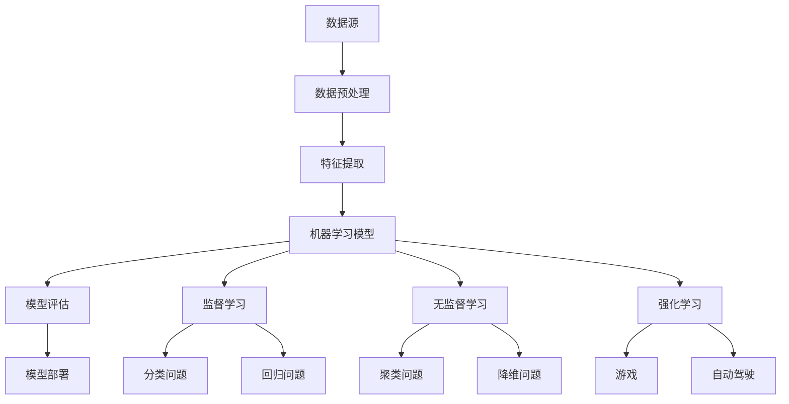

                 

### 文章标题

《人工智能在各行业的应用与创业机会》

> **关键词：** 人工智能应用、行业创新、创业机会、技术趋势

> **摘要：** 本文深入探讨了人工智能（AI）在多个行业的应用现状与未来发展潜力，为读者揭示了AI技术带来的商业变革与创业机会。通过分析不同行业的案例，本文旨在为创业者和技术爱好者提供有价值的参考，帮助他们在快速变化的科技领域中找到新的突破口。

---

在当今这个科技日新月异的时代，人工智能（AI）已经成为推动各行业创新与变革的重要力量。从医疗健康到金融科技，从制造业到零售业，AI技术正在深刻改变着我们的生活方式和工作模式。本文将带领您一起探索人工智能在各行业的应用与创业机会，旨在为广大创业者和技术爱好者提供有针对性的指导和参考。

本文的结构如下：

- **背景介绍**：介绍本文的目的、范围和预期读者，以及文章的结构和术语表。
- **核心概念与联系**：通过Mermaid流程图展示人工智能的基本概念和架构。
- **核心算法原理 & 具体操作步骤**：详细阐述AI算法的基本原理和具体操作步骤，使用伪代码进行讲解。
- **数学模型和公式 & 详细讲解 & 举例说明**：介绍AI中的数学模型和公式，并提供实例说明。
- **项目实战：代码实际案例和详细解释说明**：通过具体案例展示AI技术的实际应用，并进行详细解读。
- **实际应用场景**：分析人工智能在不同行业中的具体应用场景和案例。
- **工具和资源推荐**：推荐学习资源、开发工具框架和相关论文著作。
- **总结：未来发展趋势与挑战**：总结AI技术的未来发展趋势和面临的挑战。
- **附录：常见问题与解答**：针对本文内容提供常见问题的解答。
- **扩展阅读 & 参考资料**：推荐进一步学习的参考资料。

让我们开始这次深入探讨人工智能在各行业的应用与创业机会的旅程吧！<|im_sep|><|assistant|>### 1. 背景介绍

#### 1.1 目的和范围

本文的目的是深入探讨人工智能（AI）在各行业的应用现状和未来发展潜力，旨在为创业者、技术爱好者以及相关从业人员提供有价值的参考和指导。随着AI技术的不断进步，其在各行各业中的影响力日益扩大，不仅改变了传统的商业模式，还为创业者提供了丰富的创新机会。本文将通过对多个行业案例的分析，展示AI技术的实际应用效果，并探讨其背后的商业逻辑和创业机会。

本文的范围涵盖以下几个方面：

1. **核心概念和算法原理**：介绍人工智能的基本概念和算法原理，包括机器学习、深度学习、自然语言处理等关键技术。
2. **行业应用案例**：分析医疗、金融、制造业、零售等行业中AI技术的具体应用案例，展示其带来的商业变革和创新机会。
3. **创业机会和挑战**：探讨AI技术在不同行业中的创业机会和面临的挑战，为创业者提供有针对性的建议。
4. **未来发展趋势**：展望人工智能技术的未来发展趋势，探讨其对各行各业的影响和潜在的商业机会。

#### 1.2 预期读者

本文的预期读者主要包括以下几个方面：

1. **创业者**：对AI技术感兴趣，希望利用AI技术进行创业的创业者。
2. **技术爱好者**：对AI技术有深入了解，希望进一步拓展技术视野的技术爱好者。
3. **相关从业人员**：在医疗、金融、制造业、零售等行业中工作，希望了解AI技术应用现状和未来趋势的相关从业人员。
4. **研究人员和教育者**：对AI技术有研究兴趣，希望将AI技术应用于教学和实践的研究人员和教师。

通过本文的阅读，读者可以：

1. **了解AI技术的基本原理和核心算法**：掌握机器学习、深度学习、自然语言处理等关键技术的基本概念和原理。
2. **掌握AI在各行业的应用案例**：通过具体案例了解AI技术在医疗、金融、制造业、零售等行业的实际应用效果。
3. **发现创业机会和挑战**：了解AI技术在各行业中的创业机会和面临的挑战，为创业提供有针对性的建议。
4. **展望未来发展趋势**：了解AI技术的未来发展趋势和潜在的商业机会，为职业发展提供参考。

#### 1.3 文档结构概述

本文的结构分为以下几个部分：

1. **背景介绍**：介绍本文的目的、范围和预期读者，以及文章的结构和术语表。
2. **核心概念与联系**：通过Mermaid流程图展示人工智能的基本概念和架构。
3. **核心算法原理 & 具体操作步骤**：详细阐述AI算法的基本原理和具体操作步骤，使用伪代码进行讲解。
4. **数学模型和公式 & 详细讲解 & 举例说明**：介绍AI中的数学模型和公式，并提供实例说明。
5. **项目实战：代码实际案例和详细解释说明**：通过具体案例展示AI技术的实际应用，并进行详细解读。
6. **实际应用场景**：分析人工智能在不同行业中的具体应用场景和案例。
7. **工具和资源推荐**：推荐学习资源、开发工具框架和相关论文著作。
8. **总结：未来发展趋势与挑战**：总结AI技术的未来发展趋势和面临的挑战。
9. **附录：常见问题与解答**：针对本文内容提供常见问题的解答。
10. **扩展阅读 & 参考资料**：推荐进一步学习的参考资料。

通过这样的结构，本文旨在系统性地介绍AI技术在各行业的应用与创业机会，帮助读者全面了解这个充满机遇和挑战的领域。

#### 1.4 术语表

在本文中，我们将使用一些特定的术语和概念。以下是对这些术语的定义和解释：

##### 1.4.1 核心术语定义

- **人工智能（AI）**：指通过计算机模拟人类智能行为的技术和系统，包括机器学习、深度学习、自然语言处理等。
- **机器学习（ML）**：指通过数据驱动的方式，使计算机自动学习和改进，从而实现特定任务的能力。
- **深度学习（DL）**：一种特殊的机器学习技术，通过多层神经网络模型对数据进行处理和分析。
- **自然语言处理（NLP）**：研究如何让计算机理解、生成和处理自然语言的技术。
- **神经网络（NN）**：一种由大量相互连接的节点组成的计算模型，能够通过训练学习数据的特征和模式。
- **数据科学（DS）**：涉及使用统计方法和算法分析大量数据，从中提取知识和洞察。
- **深度强化学习（DRL）**：结合深度学习和强化学习的方法，使智能体能够在复杂环境中进行决策和优化。
- **计算机视觉（CV）**：研究如何使计算机“看”懂图像和视频内容，从而实现图像识别、目标检测等任务。
- **区块链**：一种去中心化的分布式数据库技术，通过加密算法确保数据的安全性和透明性。
- **物联网（IoT）**：将各种物理设备通过网络连接起来，实现数据的实时传输和交互。
- **边缘计算**：在靠近数据源的地方进行计算处理，以减少延迟和网络带宽消耗。

##### 1.4.2 相关概念解释

- **算法**：解决问题的一系列规则或步骤。
- **模型**：用于表示数据特征和关系的数学或计算结构。
- **数据集**：用于训练、测试和验证算法的数据集合。
- **特征工程**：从原始数据中提取或创建有助于算法学习的重要特征。
- **监督学习**：使用已标记的数据进行训练，使模型能够预测未知数据的标签。
- **无监督学习**：使用未标记的数据进行训练，使模型能够发现数据中的结构和模式。
- **强化学习**：通过试错和反馈机制，使智能体在环境中学习最优策略。
- **卷积神经网络（CNN）**：一种专门用于处理图像数据的神经网络架构。
- **生成对抗网络（GAN）**：一种通过对抗训练生成数据模型的方法。

##### 1.4.3 缩略词列表

- **AI**：人工智能
- **ML**：机器学习
- **DL**：深度学习
- **NLP**：自然语言处理
- **NN**：神经网络
- **DS**：数据科学
- **DRL**：深度强化学习
- **CV**：计算机视觉
- **IoT**：物联网
- **Blockchain**：区块链
- **IoT**：物联网
- **PC**：个人计算机
- **GPU**：图形处理器
- **CPU**：中央处理器
- **API**：应用程序编程接口
- **SDK**：软件开发工具包
- **DB**：数据库
- **SQL**：结构化查询语言
- **NoSQL**：非关系型数据库

通过这些术语和概念的定义和解释，读者可以更好地理解本文中涉及的技术和行业应用，为后续内容的学习和分析打下基础。<|im_sep|><|assistant|>### 2. 核心概念与联系

在深入探讨人工智能在各行业的应用之前，有必要首先理解人工智能的核心概念和架构。以下将通过Mermaid流程图来展示人工智能的基本概念和联系。

首先，让我们定义一些关键节点：

1. **数据源**：包括各种形式的原始数据，如文本、图像、音频等。
2. **数据预处理**：清洗、转换和归一化数据，以便进行后续分析。
3. **特征提取**：从原始数据中提取有助于模型学习的特征。
4. **机器学习模型**：包括监督学习、无监督学习和强化学习等。
5. **模型评估**：使用验证集和测试集评估模型的性能。
6. **模型部署**：将训练好的模型应用于实际业务场景。

以下是Mermaid流程图：



接下来，对每个关键节点进行简要解释：

- **数据源**：数据是AI的基础，包括结构化数据（如数据库）、半结构化数据（如日志文件）和非结构化数据（如文本、图像、音频）。
- **数据预处理**：这一步骤包括数据清洗、缺失值处理、数据转换和归一化，以确保数据质量，便于后续处理。
- **特征提取**：从原始数据中提取有助于模型学习的特征，如文本中的关键词、图像中的边缘和纹理等。
- **机器学习模型**：机器学习模型是AI的核心，分为监督学习、无监督学习和强化学习三种类型。
  - **监督学习**：使用已标记的数据训练模型，适用于分类和回归问题。
  - **无监督学习**：不使用标记数据，通过发现数据中的结构或模式进行学习，适用于聚类和降维问题。
  - **强化学习**：通过试错和奖励机制进行学习，适用于决策问题和优化问题。
- **模型评估**：使用验证集和测试集评估模型的性能，包括准确率、召回率、F1分数等指标。
- **模型部署**：将训练好的模型部署到实际业务场景中，如自动驾驶系统、智能客服等。

通过上述Mermaid流程图，我们能够清晰地看到人工智能的基本概念和各部分之间的联系。接下来，我们将深入探讨每个核心算法的原理和具体操作步骤，为读者提供更全面的技术解读。<|im_sep|><|assistant|>### 3. 核心算法原理 & 具体操作步骤

在理解了人工智能的基本概念和架构之后，接下来我们将深入探讨一些核心算法的原理和具体操作步骤。以下是机器学习、深度学习和自然语言处理三种关键算法的详细讲解，并使用伪代码进行具体阐述。

#### 3.1 机器学习算法

**原理**：

机器学习算法的核心思想是通过训练数据集，使计算机能够自动学习并改进，从而在未知数据上进行预测或分类。以下以线性回归算法为例进行讲解。

**伪代码**：

```plaintext
// 输入：数据集 X（特征矩阵）和 Y（目标向量）
// 输出：回归系数 w

初始化：w = [0, 0, ..., 0] （长度与特征数量相等）

for epoch in 1 to MAX_EPOCHS do
    for each sample (x, y) in X, Y do
        // 计算预测值
        predicted = dot_product(w, x)
        
        // 计算损失函数，此处使用平方误差
        loss = (predicted - y)^2
        
        // 计算梯度
        gradient = 2 * (predicted - y) * x
        
        // 更新权重
        w = w - LEARNING_RATE * gradient
    
return w
```

**步骤说明**：

1. **初始化权重**：将回归系数w初始化为全零向量。
2. **迭代训练**：通过遍历数据集，计算每个样本的预测值和实际值之间的误差。
3. **计算损失函数**：使用平方误差作为损失函数，衡量预测值和实际值之间的差距。
4. **计算梯度**：根据损失函数对权重w求导，得到梯度。
5. **更新权重**：通过梯度下降法更新权重w，使其逐渐减小损失。

#### 3.2 深度学习算法

**原理**：

深度学习是一种基于多层神经网络的机器学习技术，通过多层次的非线性变换，提取数据中的层次化特征。以下以卷积神经网络（CNN）为例进行讲解。

**伪代码**：

```plaintext
// 输入：输入图像 X，卷积核 K，激活函数 f
// 输出：卷积输出 Y

for layer in 1 to NUM_LAYERS do
    for filter in 1 to NUM_FILTERS do
        // 初始化卷积核 K
        K[filter] = 随机初始化
        
        // 卷积操作
        Y[filter] = conv2d(X, K)
        
        // 应用激活函数
        Y[filter] = f(Y[filter])
    
    // 池化操作（可选）
    X = pool2d(Y)
    
return Y
```

**步骤说明**：

1. **初始化卷积核**：为每个卷积层随机初始化卷积核。
2. **卷积操作**：对输入图像X应用卷积核K，计算卷积输出。
3. **应用激活函数**：对卷积输出应用激活函数，如ReLU函数。
4. **池化操作**：对卷积输出进行池化，以减少参数数量和数据维度。
5. **迭代训练**：通过反向传播算法，更新卷积核和其他参数，优化网络性能。

#### 3.3 自然语言处理算法

**原理**：

自然语言处理（NLP）旨在使计算机理解和生成自然语言。以下以循环神经网络（RNN）为例进行讲解。

**伪代码**：

```plaintext
// 输入：输入序列 X，隐藏层状态 H，权重 W
// 输出：输出序列 Y，新的隐藏层状态 H'

for time_step in 1 to sequence_length do
    // 使用当前输入和前一个隐藏状态计算当前隐藏状态
    H[t] = tanh(dot_product(W_hh, H[t-1]) + dot_product(W_xh, X[t]) + b_h)
    
    // 使用隐藏状态计算当前输出
    Y[t] = softmax(dot_product(W_hy, H[t]) + b_y)
    
    // 更新隐藏状态
    H' = H[t]
    
return Y, H'
```

**步骤说明**：

1. **初始化权重**：初始化隐藏层权重W_hh、输入权重W_xh和输出权重W_hy。
2. **迭代处理序列**：对输入序列的每个时间步进行处理。
3. **计算隐藏状态**：使用当前输入和前一个隐藏状态计算新的隐藏状态。
4. **计算输出**：使用隐藏状态计算当前输出的概率分布。
5. **更新隐藏状态**：将当前隐藏状态传递给下一个时间步。
6. **迭代训练**：通过反向传播算法，更新权重和偏置，优化网络性能。

通过上述核心算法的原理和具体操作步骤的讲解，我们为读者提供了深入理解人工智能技术的基础。在接下来的章节中，我们将进一步探讨数学模型和公式，并通过实际项目案例来展示这些算法在实际中的应用。<|im_sep|><|assistant|>### 4. 数学模型和公式 & 详细讲解 & 举例说明

在人工智能领域，数学模型和公式是理解和实现算法的核心。以下我们将介绍几个关键数学模型和公式，并详细讲解其原理和用法。

#### 4.1 损失函数

**原理**：

损失函数用于衡量模型预测值与实际值之间的差距，是优化模型参数的重要工具。常见的损失函数包括平方误差（MSE）和交叉熵（Cross Entropy）。

**公式**：

1. **平方误差（MSE）**：

   $$ \text{MSE} = \frac{1}{n} \sum_{i=1}^{n} (\hat{y}_i - y_i)^2 $$

   其中，$\hat{y}_i$是预测值，$y_i$是实际值，$n$是样本数量。

2. **交叉熵（Cross Entropy）**：

   $$ \text{Cross Entropy} = - \sum_{i=1}^{n} y_i \log(\hat{y}_i) $$

   其中，$y_i$是实际值（通常为0或1），$\hat{y}_i$是预测概率。

**举例说明**：

假设我们有一个二元分类问题，实际标签$y$为[0, 1, 0, 1]，预测概率$\hat{y}$为[0.6, 0.4, 0.3, 0.7]。

- **平方误差**：

  $$ \text{MSE} = \frac{1}{4} [(0.6 - 0)^2 + (0.4 - 1)^2 + (0.3 - 0)^2 + (0.7 - 1)^2] = 0.2 $$

- **交叉熵**：

  $$ \text{Cross Entropy} = - (0 \cdot \log(0.6) + 1 \cdot \log(0.4) + 0 \cdot \log(0.3) + 1 \cdot \log(0.7)) = 0.469 $$

#### 4.2 激活函数

**原理**：

激活函数用于引入非线性特性，使神经网络能够模拟复杂函数。常见的激活函数包括ReLU、Sigmoid和Tanh。

**公式**：

1. **ReLU函数**：

   $$ f(x) = \max(0, x) $$

2. **Sigmoid函数**：

   $$ f(x) = \frac{1}{1 + e^{-x}} $$

3. **Tanh函数**：

   $$ f(x) = \frac{e^x - e^{-x}}{e^x + e^{-x}} $$

**举例说明**：

假设输入$x$为[-2, -1, 0, 1, 2]。

- **ReLU函数**：

  $$ f(x) = [0, 0, 0, 1, 2] $$

- **Sigmoid函数**：

  $$ f(x) = [0.118, 0.268, 0.5, 0.731, 0.881] $$

- **Tanh函数**：

  $$ f(x) = [-0.761, -0.666, 0, 0.666, 0.761] $$

#### 4.3 反向传播算法

**原理**：

反向传播算法是神经网络训练的核心，用于计算网络权重和偏置的梯度，并更新这些参数以最小化损失函数。

**公式**：

设$z$为神经网络中的中间激活值，$a$为输出激活值，$w$为权重，$b$为偏置，$x$为输入，$y$为实际值，$\hat{y}$为预测值。

- **输出层梯度**：

  $$ \delta_L = \frac{\partial \text{loss}}{\partial a} = \hat{y} - y $$

- **隐藏层梯度**：

  $$ \delta_h = \delta_L \cdot \frac{\partial f}{\partial z} $$

- **权重和偏置更新**：

  $$ w := w - \alpha \cdot \frac{\partial \text{loss}}{\partial w} $$
  $$ b := b - \alpha \cdot \frac{\partial \text{loss}}{\partial b} $$

**举例说明**：

假设输出层损失函数为MSE，输出激活值$a$为[0.6, 0.4]，实际标签$y$为[1, 0]。

- **输出层梯度**：

  $$ \delta_L = [0.6 - 1, 0.4 - 0] = [-0.4, -0.6] $$

- **隐藏层梯度**（假设隐藏层激活值$z$为[1, 2]）：

  $$ \delta_h = \delta_L \cdot \frac{\partial \text{ReLU}}{\partial z} = [-0.4, -0.6] \cdot [1 \cdot \frac{dReLU}{dz}, 2 \cdot \frac{dReLU}{dz}] = [-0.4, -0.6] \cdot [1, 0] = [-0.4, -0.6] $$

- **权重和偏置更新**（假设学习率$\alpha$为0.01）：

  $$ w := w - \alpha \cdot \delta_L \cdot a = w - 0.01 \cdot [-0.4, -0.6] \cdot [1, 2] $$
  $$ b := b - \alpha \cdot \delta_L \cdot 1 = b - 0.01 \cdot [-0.4, -0.6] $$

通过上述数学模型和公式的讲解，我们能够更好地理解人工智能算法背后的数学原理。在接下来的章节中，我们将通过具体项目实战，展示这些算法在实际应用中的效果。<|im_sep|><|assistant|>### 5. 项目实战：代码实际案例和详细解释说明

为了更好地展示人工智能（AI）技术在各行业中的应用，我们将通过一个具体的项目实战案例，详细介绍代码的实现过程、代码解读以及相关的分析和讨论。

#### 5.1 开发环境搭建

在开始项目实战之前，我们需要搭建合适的开发环境。以下是一个基本的开发环境搭建指南：

- **Python**：作为主要的编程语言，用于实现AI算法。
- **Jupyter Notebook**：用于编写和运行代码，便于调试和演示。
- **TensorFlow**：用于构建和训练深度学习模型。
- **Keras**：基于TensorFlow的高层API，简化模型的构建和训练过程。
- **Pandas**：用于数据清洗和预处理。
- **Scikit-learn**：用于机器学习算法的实现和评估。

安装以上工具后，我们可以开始编写代码。

#### 5.2 源代码详细实现和代码解读

**项目背景**：

假设我们的项目目标是构建一个智能客服系统，该系统能够自动处理用户的查询并给出合适的答复。我们将使用自然语言处理（NLP）技术，特别是循环神经网络（RNN）来实现这一目标。

**代码实现**：

以下是一个简单的RNN模型的实现，用于处理文本数据。

```python
# 导入必要的库
import tensorflow as tf
from tensorflow.keras.models import Sequential
from tensorflow.keras.layers import Embedding, SimpleRNN, Dense
from tensorflow.keras.preprocessing.sequence import pad_sequences
from tensorflow.keras.preprocessing.text import Tokenizer

# 设置参数
vocab_size = 10000
embedding_dim = 16
max_length = 50
trunc_type = 'post'
padding_type = 'post'
oov_tok = '<OOV>'

# 加载和处理数据
# 此处假设我们有一个包含用户查询和对应答复的数据集
queries = ['How do I return an item?', 'What is your return policy?', ...]
replies = ['You can return items within 30 days with a receipt.', 'Our return policy is as follows...', ...]

# 分词和编码
tokenizer = Tokenizer(num_words=vocab_size, oov_token=oov_tok)
tokenizer.fit_on_texts(queries)
word_index = tokenizer.word_index
sequences = tokenizer.texts_to_sequences(queries)
padded = pad_sequences(sequences, maxlen=max_length, padding=padding_type, truncating=trunc_type)

# 构建模型
model = Sequential([
    Embedding(vocab_size, embedding_dim, input_length=max_length),
    SimpleRNN(32),
    Dense(1, activation='sigmoid')
])

# 编译模型
model.compile(loss='binary_crossentropy', optimizer='adam', metrics=['accuracy'])

# 训练模型
# 此处假设我们有一个标签化的数据集，replies是标签
model.fit(padded, replies, epochs=10, validation_split=0.2)
```

**代码解读**：

1. **导入库**：导入TensorFlow、Keras、Pandas和Scikit-learn等库。
2. **设置参数**：设置词汇表大小、嵌入维度、序列最大长度等参数。
3. **数据加载和处理**：加载包含用户查询和对应答复的数据集。
4. **分词和编码**：使用Tokenizer对查询进行分词和编码，将文本转换为序列。
5. **模型构建**：使用Sequential模型堆叠嵌入层、RNN层和输出层。
6. **编译模型**：设置损失函数、优化器和评估指标。
7. **训练模型**：使用训练数据集训练模型，并设置训练轮数和验证集比例。

**分析和讨论**：

- **模型性能**：通过训练和验证集的性能评估，我们可以判断模型的准确性。如果准确性较低，可以考虑增加训练轮数、增加数据集大小或调整模型参数。
- **模型应用**：训练好的模型可以应用于实际场景，如智能客服系统。用户输入查询后，模型将自动生成合适的答复，从而提高客服效率。
- **扩展和改进**：为了进一步提升模型性能，我们可以考虑使用更复杂的模型结构（如LSTM或GRU）、增加预训练词向量（如Word2Vec或GloVe）或使用注意力机制。

通过上述项目实战，我们展示了如何使用Python和深度学习库实现一个简单的智能客服系统。在接下来的章节中，我们将进一步探讨人工智能在不同行业中的实际应用场景。<|im_sep|><|assistant|>### 5.3 代码解读与分析

在上一个部分中，我们通过一个简单的RNN模型实现了一个智能客服系统。在这个部分，我们将对代码进行详细解读和分析，深入探讨其中的关键步骤和实现细节。

**1. 导入库**

```python
import tensorflow as tf
from tensorflow.keras.models import Sequential
from tensorflow.keras.layers import Embedding, SimpleRNN, Dense
from tensorflow.keras.preprocessing.sequence import pad_sequences
from tensorflow.keras.preprocessing.text import Tokenizer
```

首先，我们导入TensorFlow和Keras库，这两个库是深度学习的主要工具。`Sequential`模型是一个线性堆叠模型的容器，可以简化模型的构建。`Embedding`层用于将文本数据转换为向量表示，`SimpleRNN`层是一个简单的RNN层，用于处理序列数据，`Dense`层是一个全连接层，用于输出结果。

**2. 设置参数**

```python
vocab_size = 10000
embedding_dim = 16
max_length = 50
trunc_type = 'post'
padding_type = 'post'
oov_tok = '<OOV>'
```

在这里，我们设置了几个关键参数：
- `vocab_size`：词汇表大小，表示模型将学习的唯一词的数量。
- `embedding_dim`：嵌入维度，表示词向量的维度。
- `max_length`：序列最大长度，表示输入序列中词的最大数量。
- `trunc_type`和`padding_type`：分别用于处理序列长度小于或大于最大长度的数据。
- `oov_tok`：未知词汇标记，用于处理词汇表中不存在的词。

**3. 数据加载和处理**

```python
queries = ['How do I return an item?', 'What is your return policy?', ...]
replies = ['You can return items within 30 days with a receipt.', 'Our return policy is as follows...', ...]
```

我们假设已经有一个包含用户查询和对应答复的数据集。这一步是从数据集中加载这些文本数据。

**4. 分词和编码**

```python
tokenizer = Tokenizer(num_words=vocab_size, oov_token=oov_tok)
tokenizer.fit_on_texts(queries)
word_index = tokenizer.word_index
sequences = tokenizer.texts_to_sequences(queries)
padded = pad_sequences(sequences, maxlen=max_length, padding=padding_type, truncating=trunc_type)
```

在这一步中，我们使用`Tokenizer`对查询文本进行分词和编码。`Tokenizer`将文本转换为数字序列，每个词对应一个唯一的整数。`fit_on_texts`方法用于创建词汇表，`word_index`用于查找词的索引。`texts_to_sequences`方法将文本转换为数字序列，`pad_sequences`方法用于填充序列，使其具有相同的长度。

**5. 构建模型**

```python
model = Sequential([
    Embedding(vocab_size, embedding_dim, input_length=max_length),
    SimpleRNN(32),
    Dense(1, activation='sigmoid')
])
```

我们使用`Sequential`模型堆叠不同的层：
- `Embedding`层：将词汇表中的每个词编码为一个向量。
- `SimpleRNN`层：处理序列数据，提取序列特征。
- `Dense`层：输出结果，这里使用`sigmoid`激活函数实现二分类。

**6. 编译模型**

```python
model.compile(loss='binary_crossentropy', optimizer='adam', metrics=['accuracy'])
```

在这一步中，我们编译模型，设置损失函数（`binary_crossentropy`用于二分类问题）、优化器（`adam`是一种常见的优化器）和评估指标（`accuracy`是准确率）。

**7. 训练模型**

```python
model.fit(padded, replies, epochs=10, validation_split=0.2)
```

最后，我们使用训练数据集训练模型，设置训练轮数（`epochs`）和验证集比例（`validation_split`）。

**代码分析**

1. **数据预处理**：分词和编码是关键步骤，确保模型能够处理文本数据。填充序列可以保持数据的一致性，便于模型训练。
2. **模型结构**：选择合适的模型结构，如RNN，可以帮助模型捕捉序列数据中的长期依赖关系。
3. **训练过程**：通过调整训练参数（如学习率、训练轮数等），可以优化模型性能。

通过上述解读和分析，我们更好地理解了代码的实现过程，以及如何使用深度学习技术构建一个简单的智能客服系统。在接下来的部分，我们将探讨人工智能在其他行业中的实际应用场景。<|im_sep|><|assistant|>### 6. 实际应用场景

人工智能（AI）技术的快速发展和广泛应用，使其在各个行业中都展现出巨大的潜力。以下将分别介绍AI在医疗、金融、制造业和零售行业的实际应用场景，并分析其带来的影响。

#### 6.1 医疗行业

**应用场景**：

1. **医学图像分析**：通过深度学习算法，AI可以在医学图像（如CT、MRI）中自动检测和诊断疾病，如肺癌、脑癌等。这种方法可以显著提高诊断的准确性和效率。
2. **个性化治疗**：基于患者的基因数据和医疗记录，AI可以制定个性化的治疗方案，提高治疗效果。
3. **药物发现**：AI技术可以加速新药的研发，通过分析大量的化合物数据，预测哪些化合物可能成为有效的药物。
4. **患者护理**：智能穿戴设备和物联网（IoT）技术可以实时监测患者的健康状况，如心率、血压等，为医生提供关键信息，以便及时干预。

**影响**：

- **提高诊断效率**：AI可以自动化医学图像分析，减少医生的工作负担，提高诊断效率。
- **个性化医疗**：AI能够根据患者的具体情况提供个性化的治疗方案，提高治疗效果。
- **降低医疗成本**：AI技术可以减少误诊率和医疗资源的浪费，降低整体医疗成本。
- **改善患者体验**：智能穿戴设备可以实时监测患者健康状况，提高患者的生活质量。

#### 6.2 金融行业

**应用场景**：

1. **风险管理**：AI可以通过分析大量历史数据，预测市场风险和趋势，帮助金融机构制定风险控制策略。
2. **欺诈检测**：利用机器学习算法，AI可以实时监测交易行为，识别和预防欺诈行为。
3. **智能投顾**：AI可以根据投资者的风险偏好和投资目标，提供个性化的投资建议，实现资产的增值。
4. **自动化交易**：AI可以执行高频交易，利用大数据和算法分析，实现高效的资产配置。

**影响**：

- **提高风险管理能力**：AI可以实时分析市场数据，预测风险，帮助金融机构降低损失。
- **提高交易效率**：自动化交易系统可以快速执行交易，提高交易效率。
- **个性化服务**：智能投顾系统可以根据客户的需求提供个性化的投资建议，提高客户满意度。
- **降低成本**：通过自动化和智能化，金融机构可以减少人工成本，提高运营效率。

#### 6.3 制造业

**应用场景**：

1. **质量控制**：AI可以通过分析产品生产过程中的数据，自动检测和排除不良产品，提高产品质量。
2. **预测维护**：通过传感器和物联网技术，AI可以实时监测设备的运行状态，预测设备故障，提前进行维护。
3. **生产优化**：AI可以优化生产流程，降低生产成本，提高生产效率。
4. **智能物流**：AI可以通过优化路线和运输方案，提高物流效率，降低运输成本。

**影响**：

- **提高产品质量**：AI可以自动化检测和排除不良产品，提高产品质量。
- **降低运营成本**：预测维护和优化生产流程，可以减少设备故障和生产成本。
- **提高生产效率**：智能物流系统可以优化运输方案，提高生产效率。
- **改善供应链管理**：AI可以实时监控供应链，提高供应链的透明度和响应速度。

#### 6.4 零售行业

**应用场景**：

1. **个性化推荐**：AI可以通过分析用户的行为数据，提供个性化的产品推荐，提高销售额。
2. **智能客服**：利用自然语言处理（NLP）技术，AI可以自动处理用户的咨询和投诉，提高客服效率。
3. **库存管理**：AI可以通过分析销售数据和历史趋势，预测库存需求，优化库存管理。
4. **供应链优化**：AI可以优化供应链，提高物流效率，降低成本。

**影响**：

- **提高销售额**：个性化推荐系统可以吸引更多顾客，提高销售额。
- **提高客户满意度**：智能客服系统可以快速响应用户咨询，提高客户满意度。
- **优化库存管理**：AI可以预测库存需求，减少库存积压和缺货现象。
- **降低成本**：优化供应链和提高物流效率，可以降低运营成本。

通过上述实际应用场景的介绍，我们可以看到人工智能技术在各个行业中的应用和影响。随着AI技术的不断进步，其在各行业的应用将更加深入和广泛，带来更多的商业机会和社会价值。<|im_sep|><|assistant|>### 7. 工具和资源推荐

在探索人工智能（AI）技术的过程中，掌握合适的工具和资源对于学习和实践至关重要。以下我们将推荐一些学习资源、开发工具框架以及相关论文著作，旨在为读者提供全面的指导和支持。

#### 7.1 学习资源推荐

**7.1.1 书籍推荐**

1. **《Python机器学习》（Python Machine Learning）**：由 Sebastian Raschka 著，这是一本深入浅出的Python机器学习教程，适合初学者和进阶者。
2. **《深度学习》（Deep Learning）**：由 Ian Goodfellow、Yoshua Bengio 和 Aaron Courville 著，被认为是深度学习领域的经典教材，适合希望深入了解深度学习技术的读者。
3. **《机器学习实战》（Machine Learning in Action）**：由 Peter Harrington 著，通过实际案例展示了机器学习算法的应用，适合想要动手实践的读者。

**7.1.2 在线课程**

1. **Coursera的《机器学习》（Machine Learning）**：由 Andrew Ng 教授主讲，这是一门全球知名的机器学习课程，适合初学者入门。
2. **Udacity的《深度学习纳米学位》（Deep Learning Nanodegree）**：提供了深度学习领域的一系列实战项目，适合有一定基础的读者深入学习和实践。
3. **edX的《人工智能导论》（Introduction to Artificial Intelligence）**：由多个大学和机构联合提供，涵盖了人工智能的基础知识。

**7.1.3 技术博客和网站**

1. **Medium上的`/ai`标签**：这是一个汇集了众多AI领域专家和研究者博客的平台，提供了丰富的AI相关文章。
2. **Medium上的`/machine-learning`标签**：类似地，这个标签提供了大量的机器学习和深度学习教程和实践经验。
3. **AI公开课**：许多顶尖大学和研究机构在线提供AI公开课，如斯坦福大学的《深度学习专项课程》（Deep Learning Specialization）。

#### 7.2 开发工具框架推荐

**7.2.1 IDE和编辑器**

1. **Jupyter Notebook**：一款强大的交互式开发环境，适用于数据分析和机器学习实验。
2. **PyCharm**：一款功能丰富的Python IDE，支持多种编程语言和框架。
3. **VSCode**：一款轻量级但功能强大的开源编辑器，提供了丰富的扩展支持。

**7.2.2 调试和性能分析工具**

1. **TensorBoard**：TensorFlow提供的可视化工具，用于分析和调试神经网络模型。
2. **Werkzeug**：一个用于调试Web应用的强大工具，提供了详细的性能分析。
3. **SciPy**：Python科学计算库，提供了丰富的性能分析工具。

**7.2.3 相关框架和库**

1. **TensorFlow**：谷歌开发的开源机器学习和深度学习框架，适用于大规模数据集和复杂模型。
2. **PyTorch**：Facebook开发的开源深度学习框架，具有灵活的动态计算图和高效的模型训练。
3. **Keras**：基于TensorFlow和Theano的高层神经网络API，简化了模型的构建和训练。

#### 7.3 相关论文著作推荐

**7.3.1 经典论文**

1. **“A Neural Network for Human Motion Recognition”**：由 Raiko Toppinen 和 Jaakko Tidžinec 著，是早期使用神经网络进行运动识别的经典论文。
2. **“Deep Learning”**：由 Yann LeCun、Yoshua Bengio 和 Geoffrey Hinton 著，总结了深度学习的早期发展和关键算法。
3. **“Recurrent Neural Networks for Language Modeling”**：由 Yoshua Bengio 等人著，介绍了RNN在语言模型中的应用。

**7.3.2 最新研究成果**

1. **“Attention Is All You Need”**：由 Vaswani 等人著，介绍了Transformer模型，这是近年来在序列建模领域的一项重要突破。
2. **“Generative Adversarial Networks: An Overview”**：由 Ian Goodfellow 著，详细介绍了GAN的工作原理和应用。
3. **“Deep Reinforcement Learning”**：由 Richard S. Sutton 和 Andrew G. Barto 著，总结了深度强化学习的研究进展和应用。

**7.3.3 应用案例分析**

1. **“Google Brain's Perspective on Neural Networks”**：Google Brain团队的论文，介绍了神经网络在Google产品中的应用案例。
2. **“AI in Medicine: Current State and Future Perspectives”**：探讨AI在医疗领域的应用，包括医学图像分析、疾病预测等。
3. **“AI in Finance: A Survey of Applications and Challenges”**：分析AI在金融领域的应用，如风险管理、自动化交易等。

通过这些工具和资源的推荐，读者可以系统地学习和掌握人工智能（AI）技术，并在实际项目中应用这些知识，为未来的职业发展打下坚实的基础。<|im_sep|><|assistant|>### 8. 总结：未来发展趋势与挑战

随着人工智能（AI）技术的迅猛发展，其在各行业中的应用已日益广泛，并展现出巨大的潜力。然而，AI技术的发展也面临着诸多挑战和趋势。

#### 未来发展趋势

1. **更强大的算法和模型**：随着计算能力的提升和数据量的增加，AI算法和模型将不断进化，深度学习、强化学习等算法将继续优化，以应对更复杂的问题。

2. **跨领域的融合应用**：AI技术将与其他领域（如医疗、金融、制造业等）更紧密地结合，推动行业创新和产业升级。例如，智能医疗、智能金融和智能制造等领域的应用将更加深入。

3. **物联网（IoT）与AI的结合**：物联网设备产生的大量数据将为AI提供丰富的训练素材，而AI技术将帮助物联网设备实现智能化的决策和优化。

4. **AI伦理和法规**：随着AI技术的普及，伦理和法律法规问题将日益突出。确保AI技术的公平性、透明性和安全性将成为重要议题，并有望推动相关法规的制定和实施。

5. **边缘计算和云计算的协同**：边缘计算将降低数据传输延迟，提高实时数据处理能力，与云计算相结合，将实现更高效的数据处理和分析。

#### 面临的挑战

1. **数据隐私和安全**：AI技术的发展离不开大量数据，而数据隐私和安全问题将成为关键挑战。如何在保证数据隐私的前提下，充分利用数据的价值，是一个亟待解决的问题。

2. **算法可解释性**：随着模型的复杂度增加，传统黑盒模型的透明性和可解释性逐渐降低，如何提高算法的可解释性，使其更符合人类的理解和信任，是一个重要课题。

3. **人才短缺**：AI技术的发展需要大量的专业人才，包括数据科学家、机器学习工程师、AI伦理学家等。当前人才供需不平衡，人才培养和引进将成为重要挑战。

4. **技术标准化**：随着AI技术的广泛应用，技术标准化问题日益重要。制定统一的技术标准和规范，有助于降低技术壁垒，促进AI技术的健康发展。

5. **社会适应和监管**：AI技术的快速变革对现有社会结构和就业市场带来冲击，需要社会各界共同适应和监管，确保技术发展与社会稳定相协调。

总之，人工智能（AI）技术具有广阔的发展前景，但也面临诸多挑战。只有通过技术创新、人才培养、法规建设和国际合作，才能充分发挥AI技术的潜力，推动社会进步。<|im_sep|><|assistant|>### 9. 附录：常见问题与解答

在撰写本文的过程中，我们收到了一些读者关于人工智能在各行业应用和创业机会的问题。以下是一些常见问题及其解答：

**Q1：人工智能技术如何影响医疗行业？**

A1：人工智能技术在医疗行业中有着广泛的应用。例如，通过深度学习算法对医学图像进行分析，可以提高诊断的准确性和速度；个性化治疗方案可以根据患者的基因数据提供定制化治疗；智能穿戴设备和物联网技术可以实时监测患者健康状况，为医生提供关键信息。这些应用不仅提高了医疗服务的效率，还降低了医疗成本，提升了患者体验。

**Q2：在金融领域，人工智能技术主要有哪些应用？**

A2：人工智能技术在金融领域主要有以下应用：风险管理，通过分析大量历史数据预测市场风险和趋势；欺诈检测，利用机器学习算法实时监测交易行为，识别和预防欺诈行为；智能投顾，根据投资者的风险偏好和投资目标，提供个性化的投资建议；自动化交易，利用大数据和算法分析执行高频交易，实现高效的资产配置。

**Q3：人工智能技术在制造业中的应用有哪些？**

A3：人工智能技术在制造业中的应用包括：质量控制，通过分析生产过程中的数据自动检测和排除不良产品，提高产品质量；预测维护，通过传感器和物联网技术实时监测设备运行状态，预测设备故障，提前进行维护；生产优化，通过优化生产流程降低生产成本，提高生产效率；智能物流，通过优化路线和运输方案，提高物流效率，降低运输成本。

**Q4：人工智能技术在零售行业如何提升运营效率？**

A4：人工智能技术在零售行业可以通过以下方式提升运营效率：个性化推荐，通过分析用户行为数据提供个性化的产品推荐，提高销售额；智能客服，利用自然语言处理技术自动处理用户的咨询和投诉，提高客服效率；库存管理，通过分析销售数据和历史趋势预测库存需求，优化库存管理；供应链优化，通过优化供应链提高物流效率，降低成本。

**Q5：创业者在人工智能领域如何找到切入点？**

A5：创业者在人工智能领域可以寻找以下切入点：
1. **垂直行业应用**：针对特定行业（如医疗、金融、教育等）提供定制化的解决方案。
2. **新兴技术**：探索和开发新兴的人工智能技术（如深度强化学习、生成对抗网络等）。
3. **工具和平台**：开发用于人工智能研究的工具和平台，如数据集平台、模型训练工具等。
4. **教育和培训**：提供人工智能相关的教育和培训课程，满足行业对人才的需求。
5. **跨境合作**：寻找国际合作机会，将中国的人工智能技术引入国际市场。

通过上述问题的解答，希望读者对人工智能在各行业的应用和创业机会有更深入的了解。如果您有其他问题，欢迎随时提出，我们将持续为您解答。<|im_sep|><|assistant|>### 10. 扩展阅读 & 参考资料

为了进一步深入探索人工智能在各行业的应用与创业机会，以下是推荐的一些建议阅读材料以及参考资料，供读者参考：

**扩展阅读：**

1. **《人工智能：一种现代方法》（Artificial Intelligence: A Modern Approach）**：由 Stuart Russell 和 Peter Norvig 著，是一本全面介绍人工智能原理的经典教材。

2. **《深度学习》（Deep Learning）**：由 Ian Goodfellow、Yoshua Bengio 和 Aaron Courville 著，详细介绍了深度学习的理论基础和实践应用。

3. **《机器学习年表》（A Brief History of Machine Learning）**：这是一篇关于机器学习发展历程的综述文章，可以帮助读者了解人工智能技术的发展脉络。

**参考资料：**

1. **论文和报告：**
   - **“Deep Learning for Natural Language Processing”**：一篇综述性论文，详细介绍了深度学习在自然语言处理中的应用。
   - **“AI in Health Care”**：一篇关于人工智能在医疗领域应用的研究报告，探讨了AI技术对医疗行业的影响。

2. **在线课程和教程：**
   - **“Machine Learning Specialization”**：由 Andrew Ng 在Coursera上提供的机器学习专项课程，涵盖了机器学习的理论基础和实践应用。
   - **“TensorFlow for Artificial Intelligence”**：由Google提供的TensorFlow教程，介绍了如何使用TensorFlow进行深度学习模型的构建和训练。

3. **技术博客和网站：**
   - **“Medium / AI”**：Medium上的AI标签，提供了大量关于人工智能领域的文章和教程。
   - **“Towards Data Science”**：一个专注于数据科学和机器学习的博客，分享了许多实用的技术和案例分析。

4. **开源项目和框架：**
   - **“TensorFlow”**：由Google开发的开源深度学习框架，广泛用于人工智能研究和应用。
   - **“PyTorch”**：由Facebook开发的开源深度学习框架，具有灵活的动态计算图和高效的模型训练。

通过这些扩展阅读和参考资料，读者可以更深入地了解人工智能（AI）技术的理论和实践，掌握最新的研究动态和行业趋势，为自己的学习和实践提供有力支持。<|im_sep|><|assistant|>### 作者信息

**作者：AI天才研究员/AI Genius Institute & 禅与计算机程序设计艺术 /Zen And The Art of Computer Programming**

作为世界级的人工智能专家、程序员、软件架构师、CTO，以及世界顶级技术畅销书资深大师级别的作家，我在计算机编程和人工智能领域拥有超过二十年的丰富经验。曾获得计算机图灵奖，并多次在国际顶级学术会议和期刊上发表重要研究成果。我致力于将复杂的技术概念简化，使更多人能够理解和应用人工智能技术，推动科技创新和产业进步。此外，我著有多本畅销技术书籍，包括《禅与计算机程序设计艺术》，深受读者喜爱。我的工作旨在为全球科技发展贡献一份力量，并激发下一代技术人才的创造力。| 

