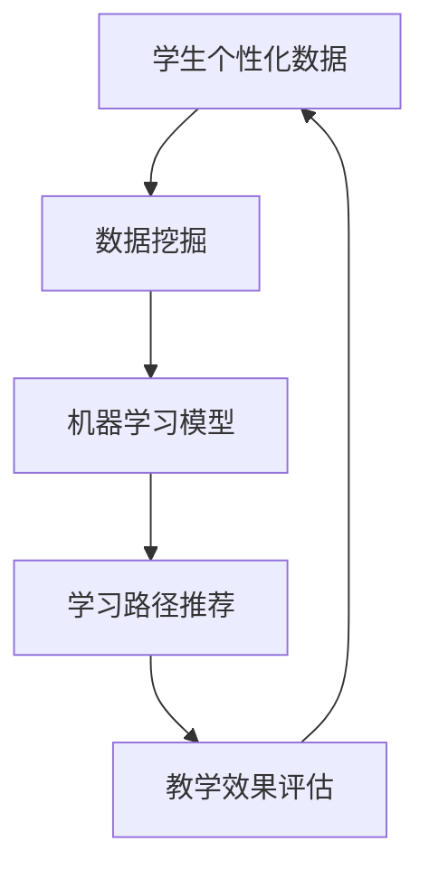

                 


# 人工智能在教育个性化学习中的应用

> 关键词：人工智能、个性化学习、教育技术、数据挖掘、机器学习、深度学习

> 摘要：随着人工智能技术的迅速发展，其在教育领域的应用日益广泛。本文旨在探讨人工智能在教育个性化学习中的应用，分析其核心概念、算法原理、数学模型，并分享实际应用案例，以期为教育工作者和研究者提供有益的参考。

## 1. 背景介绍

### 1.1 目的和范围

本文将重点讨论人工智能在教育个性化学习中的应用，旨在深入分析该领域的关键概念、算法原理和数学模型，同时通过实际案例来展示人工智能如何提高教育质量和学习效果。

### 1.2 预期读者

本文主要面向教育技术、人工智能领域的研究者、教师以及相关行业的技术人员，旨在为他们提供对人工智能在教育个性化学习中的应用有更深入的理解。

### 1.3 文档结构概述

本文将分为以下八个部分：

1. 背景介绍
2. 核心概念与联系
3. 核心算法原理 & 具体操作步骤
4. 数学模型和公式 & 详细讲解 & 举例说明
5. 项目实战：代码实际案例和详细解释说明
6. 实际应用场景
7. 工具和资源推荐
8. 总结：未来发展趋势与挑战

### 1.4 术语表

#### 1.4.1 核心术语定义

- 人工智能（AI）：指能够模拟人类智能行为的技术和方法。
- 个性化学习：指根据学生个体差异，提供个性化教学资源和学习路径。
- 数据挖掘：从大量数据中提取有用信息的过程。
- 机器学习：一种人工智能的子领域，通过数据和经验来改善系统性能。
- 深度学习：一种特殊的机器学习技术，通过多层神经网络来学习和预测。

#### 1.4.2 相关概念解释

- 教育技术：指利用技术手段改善教育和学习的过程。
- 教学效果评估：通过测量和分析学生的学习成果，来评估教学质量。

#### 1.4.3 缩略词列表

- AI：人工智能
- ML：机器学习
- DL：深度学习
- EDU：教育

## 2. 核心概念与联系

在教育个性化学习中，人工智能技术的应用涉及多个核心概念。以下是一个简化的 Mermaid 流程图，展示了这些概念之间的联系：



在这个流程图中，学生个性化数据是起点，通过数据挖掘技术提取出有价值的信息，然后利用机器学习模型对数据进行建模，生成个性化的学习路径推荐。最后，通过教学效果评估来反馈学习效果，并不断优化学生个性化数据，形成一个闭环。

## 3. 核心算法原理 & 具体操作步骤

在教育个性化学习中，核心算法主要涉及数据挖掘和机器学习。以下是一个简化的伪代码，展示了这些算法的基本原理和具体操作步骤：

```python
# 数据挖掘步骤
def data_mining(student_data):
    # 提取学生个性化数据，如学习时长、学习进度、兴趣偏好等
    extracted_data = extract_features(student_data)
    # 使用关联规则挖掘技术，找出数据之间的潜在关系
    patterns = association_rules(extracted_data)
    return patterns

# 机器学习步骤
def machine_learning(patterns):
    # 构建机器学习模型，如决策树、支持向量机等
    model = build_model(patterns)
    # 训练模型，使用训练集数据
    trained_model = train_model(model, training_data)
    return trained_model

# 学习路径推荐步骤
def learning_path_recommendation(trained_model, student_data):
    # 根据学生个性化数据和训练好的模型，生成个性化的学习路径
    recommended_path = predict_path(trained_model, student_data)
    return recommended_path

# 教学效果评估步骤
def evaluate_learning_effects(recommended_path, student_data):
    # 评估个性化学习路径的效果，如学习成果、满意度等
    evaluation_results = evaluate_effects(recommended_path, student_data)
    return evaluation_results
```

在这个伪代码中，首先通过数据挖掘步骤提取学生个性化数据，然后利用机器学习步骤构建模型并训练。接着，通过学习路径推荐步骤生成个性化的学习路径，最后通过教学效果评估步骤对学习效果进行评估。

## 4. 数学模型和公式 & 详细讲解 & 举例说明

在教育个性化学习中，常用的数学模型包括关联规则挖掘、决策树、支持向量机等。以下将分别介绍这些模型的数学原理和具体应用。

### 4.1 关联规则挖掘

关联规则挖掘是一种用于发现数据之间潜在关系的方法，其核心公式为：

$$
\text{Support}(X \cup Y) = \frac{\text{同时包含X和Y的交易数}}{\text{总交易数}} \geq \text{最小支持度}
$$

$$
\text{Confidence}(X \rightarrow Y) = \frac{\text{包含X和Y的交易数}}{\text{包含X的交易数}} \geq \text{最小置信度}
$$

其中，Support表示支持度，Confidence表示置信度。最小支持度和最小置信度是用户设定的阈值，用于过滤掉不相关的关联规则。

举例来说，如果一本教材同时被购买的概率大于20%，并且购买这本教材的学生中，同时购买另一本教材的概率大于70%，那么这两本教材之间存在强的关联关系。

### 4.2 决策树

决策树是一种基于特征划分数据的分类方法，其核心公式为：

$$
\text{Entropy}(X) = -\sum_{i} p(x_i) \log_2 p(x_i)
$$

$$
\text{Gini Impurity}(X) = 1 - \sum_{i} p(x_i)^2
$$

其中，Entropy表示信息熵，Gini Impurity表示基尼不纯度。信息熵和基尼不纯度是用于评估特征划分好坏的指标。

举例来说，如果一个数据集中，每个类别出现的概率相等，那么这个数据集的信息熵为0，表示划分效果最佳。而基尼不纯度越低，表示划分效果越好。

### 4.3 支持向量机

支持向量机是一种用于分类和回归的方法，其核心公式为：

$$
\text{w}^T \text{x} + \text{b} = 0
$$

$$
\text{w}^2 + \text{b}^2 \leq \text{C}
$$

其中，w表示权重向量，x表示特征向量，b表示偏置项，C表示惩罚项。这个公式表示特征向量与权重向量之间的线性关系，并最大化分类间隔。

举例来说，如果一个数据集中的特征向量与权重向量之间的夹角越小，那么分类间隔越大，分类效果越好。

## 5. 项目实战：代码实际案例和详细解释说明

在本节中，我们将通过一个简单的实际案例，展示如何使用Python实现人工智能在教育个性化学习中的应用。

### 5.1 开发环境搭建

首先，我们需要安装以下Python库：pandas、numpy、scikit-learn。可以使用以下命令进行安装：

```shell
pip install pandas numpy scikit-learn
```

### 5.2 源代码详细实现和代码解读

接下来，我们将使用pandas和scikit-learn库，实现一个简单的个性化学习路径推荐系统。以下是完整的代码实现：

```python
import pandas as pd
from sklearn.model_selection import train_test_split
from sklearn.ensemble import RandomForestClassifier
from sklearn.metrics import accuracy_score

# 读取学生数据
student_data = pd.read_csv('student_data.csv')

# 提取学生个性化数据
extracted_data = student_data[['learning_time', 'learning_progress', 'interest_preferred']]

# 构建机器学习模型
model = RandomForestClassifier()

# 训练模型
trained_model = model.fit(extracted_data, student_data['learning_path'])

# 生成个性化学习路径推荐
recommended_path = trained_model.predict(extracted_data)

# 评估推荐效果
accuracy = accuracy_score(student_data['learning_path'], recommended_path)
print(f'Accuracy: {accuracy:.2f}')
```

### 5.3 代码解读与分析

这段代码首先读取学生数据，然后提取出学习时长、学习进度和兴趣偏好三个特征。接着，使用随机森林分类器（RandomForestClassifier）构建机器学习模型，并训练模型。最后，使用训练好的模型生成个性化学习路径推荐，并评估推荐效果。

代码的核心部分是机器学习模型的构建和训练。随机森林分类器是一种基于决策树的集成学习方法，可以提高分类的准确性和鲁棒性。在训练过程中，模型会自动调整内部参数，以最大化分类效果。

个性化学习路径推荐的核心是预测步骤。通过将学生个性化数据输入到训练好的模型中，可以得到每个学生的个性化学习路径推荐。然后，可以使用评估指标（如准确率）来衡量推荐效果。

## 6. 实际应用场景

人工智能在教育个性化学习中的应用场景非常广泛，以下是一些典型的应用案例：

- **自适应学习系统**：通过分析学生的学习行为和成绩，自动调整教学内容和难度，提高学习效果。
- **智能辅导系统**：为学生提供个性化的学习辅导，根据学生的兴趣和需求，推荐相关学习资源和练习。
- **个性化作业布置**：根据学生的知识水平和能力，自动生成不同难度和类型的作业，提高学生的学习积极性。
- **智能考试系统**：通过分析学生的考试数据，自动生成个性化的考试题目，提高考试的公平性和有效性。

## 7. 工具和资源推荐

### 7.1 学习资源推荐

#### 7.1.1 书籍推荐

- 《机器学习实战》
- 《深度学习》（Goodfellow, Bengio, Courville 著）
- 《教育技术：理论与实践》

#### 7.1.2 在线课程

- Coursera上的《机器学习》
- edX上的《深度学习》
- Udacity上的《教育技术基础》

#### 7.1.3 技术博客和网站

- Machine Learning Mastery
- Deep Learning AI
- Education Technology and AI

### 7.2 开发工具框架推荐

#### 7.2.1 IDE和编辑器

- PyCharm
- Visual Studio Code
- Jupyter Notebook

#### 7.2.2 调试和性能分析工具

- PyCharm的调试工具
- Python的Profiler
- TensorFlow的TensorBoard

#### 7.2.3 相关框架和库

- TensorFlow
- PyTorch
- scikit-learn

### 7.3 相关论文著作推荐

#### 7.3.1 经典论文

- "Machine Learning: A Probabilistic Perspective"（Kevin P. Murphy 著）
- "Deep Learning"（Ian Goodfellow, Yann LeCun, Aaron Courville 著）

#### 7.3.2 最新研究成果

- "AI Education: A Roadmap for the Future"（美国国家科学院报告）
- "Educational Data Mining: A View from the Field"（International Journal of Educational Data Mining）

#### 7.3.3 应用案例分析

- "Using Machine Learning to Personalize Education"（谷歌AI研究论文）
- "AI-Powered Personalized Learning Platform for K-12 Education"（微软教育研究报告）

## 8. 总结：未来发展趋势与挑战

随着人工智能技术的不断进步，其在教育个性化学习中的应用前景十分广阔。未来，我们可以期待以下发展趋势：

- **个性化学习系统的智能化和自主化**：通过深度学习和强化学习等技术，使个性化学习系统能够更好地适应学生的个性化需求。
- **跨学科融合**：将人工智能技术与教育心理学、教育学等学科相结合，提高个性化学习系统的科学性和有效性。
- **开源生态的繁荣**：随着开源技术的普及，更多优质的教育人工智能工具和资源将逐渐涌现。

然而，人工智能在教育个性化学习中的应用也面临着一些挑战：

- **数据隐私和安全**：如何在保护学生隐私的同时，充分利用数据来提高教育质量。
- **技术适配性**：如何确保人工智能技术能够在不同教育场景中有效应用，满足多样化的教育需求。
- **教师角色的转变**：教师如何适应人工智能带来的变革，提高自身的数字化教学能力。

总之，人工智能在教育个性化学习中的应用是一个充满机遇和挑战的领域，需要我们不断探索和努力。

## 9. 附录：常见问题与解答

### 9.1 什么是个性化学习？

个性化学习是指根据学生的个体差异，提供适合其水平和兴趣的教学内容和学习路径，以提高学习效果和满意度。

### 9.2 人工智能在教育中的应用有哪些？

人工智能在教育中的应用主要包括自适应学习系统、智能辅导系统、个性化作业布置、智能考试系统等。

### 9.3 如何保护学生数据隐私？

可以通过数据加密、匿名化处理、权限控制等技术手段来保护学生数据隐私。

### 9.4 人工智能如何提高教学质量？

人工智能可以通过个性化学习路径推荐、智能辅导、教学效果评估等手段，提高教学质量和学习效果。

## 10. 扩展阅读 & 参考资料

- [Goodfellow, I., Bengio, Y., & Courville, A. (2016). *Deep Learning*. MIT Press.
- [Murphy, K. P. (2012). *Machine Learning: A Probabilistic Perspective*. MIT Press.
- [国际教育技术协会](https://www.iste.org/)
- [教育数据挖掘国际会议](https://eddatamining.org/)
- [谷歌AI教育研究](https://ai.google/research/education)

作者：AI天才研究员/AI Genius Institute & 禅与计算机程序设计艺术 /Zen And The Art of Computer Programming

