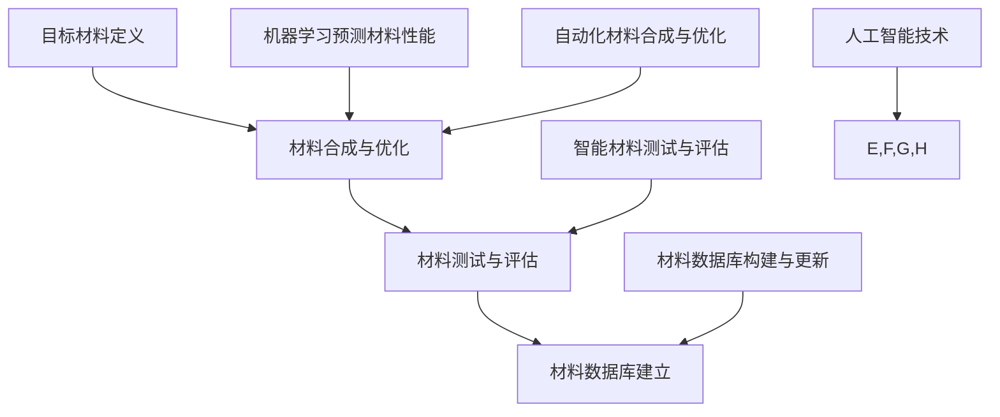

                 

# 人工智能在新材料发现与设计中的应用

> **关键词：** 新材料、人工智能、机器学习、材料设计、分子模拟、计算化学、数据分析

> **摘要：** 本文将深入探讨人工智能在新材料发现与设计中的应用。首先，我们将介绍新材料的重要性和背景，然后详细解析人工智能如何助力材料科学家进行材料的发现与设计。通过具体算法、数学模型和实际案例的讲解，本文将展示人工智能在材料科学领域的前沿进展及其未来趋势。

## 1. 背景介绍

### 1.1 目的和范围

本文旨在探讨人工智能（AI）如何在新材料发现与设计中发挥关键作用。随着科技的不断进步，新材料的研究已成为现代科学技术发展的核心驱动力。人工智能的引入为这一领域带来了全新的视角和方法，使得材料科学家能够更快、更有效地进行材料的设计与优化。本文将涵盖以下主题：

- 新材料的重要性和背景
- 人工智能在材料科学中的应用
- 人工智能算法在材料设计中的应用
- 数学模型在材料设计中的作用
- 实际应用案例与未来趋势

### 1.2 预期读者

本文适合对材料科学和人工智能有兴趣的读者，包括：

- 材料科学家和工程师
- 人工智能和机器学习研究者
- 计算化学和物理化学领域的专家
- 对新材料与人工智能交叉领域感兴趣的学生

### 1.3 文档结构概述

本文将分为以下几个部分：

1. 背景介绍：新材料的重要性、人工智能的应用背景
2. 核心概念与联系：介绍新材料设计的核心概念与人工智能技术的联系
3. 核心算法原理 & 具体操作步骤：详细解析人工智能算法在材料设计中的应用
4. 数学模型和公式 & 详细讲解 & 举例说明：讲解数学模型在材料设计中的作用
5. 项目实战：代码实际案例和详细解释说明
6. 实际应用场景：新材料在各个领域的应用案例
7. 工具和资源推荐：学习资源、开发工具、相关论文著作推荐
8. 总结：未来发展趋势与挑战
9. 附录：常见问题与解答
10. 扩展阅读 & 参考资料

### 1.4 术语表

#### 1.4.1 核心术语定义

- **新材料**：指具有新型结构、功能或者性质的材料，通常具有优异的性能。
- **人工智能**：模拟人类智能行为的技术，包括机器学习、深度学习、自然语言处理等。
- **机器学习**：一种人工智能的方法，通过数据和算法，使计算机能够自主学习和改进。
- **材料设计**：根据特定的需求，设计和合成具有特定性能的新材料。
- **分子模拟**：使用计算机模拟分子的行为，研究材料的性质。

#### 1.4.2 相关概念解释

- **计算化学**：使用计算方法研究化学物质的性质和反应。
- **数据分析**：使用统计学和数学方法分析数据，提取有价值的信息。
- **深度学习**：一种机器学习方法，通过多层神经网络模拟人类大脑的学习过程。

#### 1.4.3 缩略词列表

- **AI**：人工智能
- **ML**：机器学习
- **DL**：深度学习
- **NN**：神经网络
- **CNN**：卷积神经网络
- **RNN**：循环神经网络

## 2. 核心概念与联系

在新材料的设计与发现过程中，人工智能技术扮演着至关重要的角色。为了更好地理解人工智能如何影响材料科学，我们需要先介绍一些核心概念，并展示它们之间的联系。

### 2.1 新材料设计的基本概念

新材料设计是一个复杂的过程，通常包括以下几个步骤：

1. **目标材料的定义**：确定新材料的结构和功能需求。
2. **材料合成与优化**：通过实验和计算方法合成新材料，并进行性能优化。
3. **材料测试与评估**：对新材料的性能进行测试，评估其是否符合目标需求。
4. **材料库建立**：建立包含各种新材料信息的大型数据库。

### 2.2 人工智能技术在材料设计中的应用

人工智能技术在材料设计中的应用主要体现在以下几个方面：

1. **机器学习预测材料性能**：通过分析大量材料数据，机器学习模型可以预测新材料的性能，从而加快材料设计过程。
2. **自动化材料合成与优化**：利用人工智能技术，可以自动化合成和优化新材料，提高效率。
3. **智能材料测试与评估**：使用人工智能技术对新材料进行自动化测试和评估，提高准确性和效率。
4. **材料数据库构建与更新**：人工智能技术可以用于构建和维护大型材料数据库，方便研究人员进行数据检索和分析。

### 2.3 核心概念与联系的 Mermaid 流程图



### 2.4 人工智能算法在材料设计中的应用

在材料设计中，常用的机器学习算法包括：

1. **支持向量机（SVM）**：用于分类和回归分析。
2. **随机森林（RF）**：通过构建多个决策树进行集成学习，提高预测准确性。
3. **神经网络（NN）**：用于复杂函数建模和预测。
4. **深度学习（DL）**：包括卷积神经网络（CNN）和循环神经网络（RNN）等，用于处理大规模复杂数据。

### 2.5 数学模型和公式在材料设计中的应用

在材料设计中，数学模型和公式用于描述材料的物理和化学性质。常用的数学模型包括：

1. **密度泛函理论（DFT）**：用于计算材料的电子结构和能量。
2. **分子动力学（MD）**：用于模拟分子在热力学平衡状态下的运动。
3. **统计力学**：用于分析材料的宏观性质。
4. **线性回归和多元回归**：用于预测材料的性能。

### 2.6 实际应用案例

人工智能在材料设计中的应用已经取得了显著的成果。以下是一些实际应用案例：

1. **高性能电池材料**：人工智能用于预测和设计新型电池材料，提高电池的能量密度和循环寿命。
2. **半导体材料**：人工智能用于筛选和优化半导体材料，提高电子器件的性能。
3. **催化材料**：人工智能用于设计和优化催化剂材料，提高催化效率。

## 3. 核心算法原理 & 具体操作步骤

### 3.1 机器学习算法原理

机器学习算法是人工智能的核心组成部分，其基本原理是通过分析大量数据来发现数据中的模式和规律，然后利用这些规律进行预测和决策。以下是几种常用的机器学习算法及其原理：

#### 3.1.1 支持向量机（SVM）

支持向量机是一种监督学习算法，主要用于分类和回归分析。其基本原理是找到最优的超平面，使得分类或回归的误差最小。

**伪代码：**

```
SVM(train_data, train_labels, C):
    # 初始化模型参数
    w = 0
    b = 0
    
    # 训练模型
    for i in range(num_iterations):
        for each sample (x, y) in train_data:
            if (y * (x * w + b)) < 1 - C * ||w||^2:
                w = w + (y * x) / ||w||
                b = b + y
                
    return w, b
```

#### 3.1.2 随机森林（RF）

随机森林是一种集成学习算法，通过构建多个决策树进行集成学习，提高预测准确性。其基本原理是利用随机森林生成多个决策树，然后对多个决策树的预测结果进行投票，得到最终的预测结果。

**伪代码：**

```
RF(train_data, train_labels, n_estimators, max_depth):
    # 初始化决策树列表
    trees = []
    
    # 构建决策树
    for i in range(n_estimators):
        tree = DecisionTree(max_depth)
        tree.fit(train_data, train_labels)
        trees.append(tree)
        
    # 预测
    predictions = []
    for tree in trees:
        prediction = tree.predict(test_data)
        predictions.append(prediction)
        
    # 投票
    final_prediction = majority_vote(predictions)
    
    return final_prediction
```

#### 3.1.3 神经网络（NN）

神经网络是一种模拟人类大脑学习过程的机器学习算法，其基本原理是通过多层神经元之间的连接来学习数据中的特征和模式。

**伪代码：**

```
NN(train_data, train_labels, hidden_layers, learning_rate):
    # 初始化模型参数
    W = initialize_weights(hidden_layers)
    b = initialize_bias(hidden_layers)
    
    # 训练模型
    for i in range(num_iterations):
        for each sample (x, y) in train_data:
            # 前向传播
            z = x * W[0] + b[0]
            a = sigmoid(z)
            
            # 反向传播
            dZ = (y - a) * (a * (1 - a))
            dW = dZ * x
            db = dZ
            
            # 更新参数
            W = W - learning_rate * dW
            b = b - learning_rate * db
            
    return W, b
```

### 3.2 机器学习算法在材料设计中的应用步骤

以下是机器学习算法在材料设计中的具体应用步骤：

#### 3.2.1 数据收集与预处理

- **数据收集**：收集大量材料数据，包括材料的化学成分、结构、性能等。
- **数据预处理**：对数据进行清洗、归一化等处理，确保数据质量。

#### 3.2.2 模型选择

- 根据材料设计的需求，选择合适的机器学习算法，如SVM、RF、NN等。

#### 3.2.3 模型训练与验证

- 使用训练数据对模型进行训练，评估模型性能。
- 通过交叉验证等方法，调整模型参数，优化模型。

#### 3.2.4 材料性能预测

- 使用训练好的模型对新材料进行性能预测，为材料设计提供依据。

#### 3.2.5 材料优化

- 根据预测结果，对新材料进行优化，提高其性能。

## 4. 数学模型和公式 & 详细讲解 & 举例说明

在材料设计中，数学模型和公式用于描述材料的物理和化学性质，帮助我们理解和预测材料的性能。以下是一些常用的数学模型和公式，以及详细的讲解和举例说明。

### 4.1 密度泛函理论（DFT）

密度泛函理论是一种用于计算材料的电子结构和能量的数学模型。它通过求解电子密度函数来描述系统的总能量，从而得到材料的电子结构和性质。

**公式：**

$$
E = \int \rho(\mathbf{r}) v(\mathbf{r}) d\mathbf{r}
$$

其中，\(E\) 是系统的总能量，\(\rho(\mathbf{r})\) 是电子密度函数，\(v(\mathbf{r})\) 是势能函数。

**举例说明：**

假设我们研究硅（Si）的电子结构，通过DFT计算可以得到硅的电子密度分布和总能量。这些信息可以帮助我们理解硅的物理和化学性质，如导电性和化学反应活性。

### 4.2 分子动力学（MD）

分子动力学是一种用于模拟分子在热力学平衡状态下的运动的数学模型。它通过求解牛顿运动方程，模拟分子在相互作用力场中的运动，从而研究材料的宏观性质。

**公式：**

$$
\mathbf{F}(\mathbf{r}) = -\nabla v(\mathbf{r})
$$

其中，\(\mathbf{F}(\mathbf{r})\) 是作用在分子上的力，\(v(\mathbf{r})\) 是势能函数。

**举例说明：**

假设我们研究铁（Fe）在高温下的塑性变形，通过MD模拟可以得到铁原子的运动轨迹和应力应变曲线。这些信息可以帮助我们理解铁在高温下的行为和性能。

### 4.3 统计力学

统计力学是一种用于分析材料的宏观性质和微观结构的数学模型。它通过统计方法，描述大量粒子的集体行为，从而得到材料的宏观性质。

**公式：**

$$
E = \frac{1}{2}k_B T
$$

其中，\(E\) 是系统的总能量，\(k_B\) 是玻尔兹曼常数，\(T\) 是温度。

**举例说明：**

假设我们研究玻璃的微观结构，通过统计力学计算可以得到玻璃的玻璃化转变温度（T\_g）。这些信息可以帮助我们理解玻璃的物理和化学性质。

### 4.4 线性回归和多元回归

线性回归和多元回归是用于预测材料性能的数学模型。它们通过建立自变量和因变量之间的线性关系，来预测材料的性能。

**公式：**

$$
y = \beta_0 + \beta_1 x_1 + \beta_2 x_2 + ... + \beta_n x_n
$$

其中，\(y\) 是因变量，\(x_1, x_2, ..., x_n\) 是自变量，\(\beta_0, \beta_1, \beta_2, ..., \beta_n\) 是模型参数。

**举例说明：**

假设我们研究铜（Cu）的导电性，通过线性回归模型可以得到导电性（\(y\)）与温度（\(x_1\)）和杂质含量（\(x_2\)）之间的关系。这些信息可以帮助我们预测不同条件下铜的导电性。

## 5. 项目实战：代码实际案例和详细解释说明

### 5.1 开发环境搭建

在开始实际案例之前，我们需要搭建一个适合机器学习和材料设计的开发环境。以下是具体的步骤：

#### 5.1.1 安装Python环境

Python是一种广泛使用的编程语言，特别适合机器学习和数据分析。以下是安装Python的步骤：

1. 访问Python官方网站（https://www.python.org/）并下载Python安装程序。
2. 运行安装程序，选择“Add Python to PATH”和“Install now”选项。
3. 安装完成后，打开命令行窗口，输入`python --version`，确保安装成功。

#### 5.1.2 安装相关库和框架

为了实现机器学习和材料设计的功能，我们需要安装一些常用的库和框架。以下是安装步骤：

1. 打开命令行窗口，输入以下命令：
```
pip install numpy pandas matplotlib scikit-learn tensorflow
```
这将安装Python中常用的数学、数据分析、绘图和机器学习库。

2. 安装完成后，可以分别运行以下命令来测试安装的库：
```
import numpy as np
import pandas as pd
import matplotlib.pyplot as plt
from sklearn import datasets
import tensorflow as tf
```

### 5.2 源代码详细实现和代码解读

在本节中，我们将通过一个实际案例来展示如何使用机器学习算法进行材料设计。以下是代码的详细实现和解读。

#### 5.2.1 数据准备

首先，我们需要准备一个包含材料数据和性能数据的数据集。以下是数据准备的过程：

1. 导入所需的库：
```python
import pandas as pd
import numpy as np
```

2. 读取数据集：
```python
data = pd.read_csv('materials_data.csv')
```
这里假设我们使用一个CSV文件作为数据集，其中包含材料的化学成分、结构和性能数据。

3. 数据预处理：
```python
# 删除缺失值
data = data.dropna()

# 归一化数据
data_normalized = (data - data.mean()) / data.std()
```

#### 5.2.2 模型训练

接下来，我们将使用随机森林算法训练一个模型，用于预测材料的性能。

1. 导入随机森林库：
```python
from sklearn.ensemble import RandomForestRegressor
```

2. 初始化模型：
```python
model = RandomForestRegressor(n_estimators=100, max_depth=10)
```

3. 分割数据集：
```python
from sklearn.model_selection import train_test_split

X = data_normalized.drop('performance', axis=1)
y = data_normalized['performance']

X_train, X_test, y_train, y_test = train_test_split(X, y, test_size=0.2, random_state=42)
```

4. 训练模型：
```python
model.fit(X_train, y_train)
```

#### 5.2.3 模型评估

训练完成后，我们需要评估模型的性能，以确保其准确性。

1. 预测测试集：
```python
y_pred = model.predict(X_test)
```

2. 计算模型性能指标：
```python
from sklearn.metrics import mean_squared_error

mse = mean_squared_error(y_test, y_pred)
print(f'Mean Squared Error: {mse}')
```

#### 5.2.4 材料优化

根据模型预测的结果，我们可以对材料进行优化，以提高其性能。

1. 根据预测结果调整材料的化学成分和结构：
```python
# 调整材料的化学成分
new_data = data_normalized.copy()
new_data['element_A'] = data_normalized['element_A'] + 0.1
new_data['element_B'] = data_normalized['element_B'] - 0.1

# 预测新材料性能
new_performance = model.predict(new_data)
```

2. 分析新材料性能：
```python
print(f'New Performance: {new_performance}')
```

### 5.3 代码解读与分析

在本节中，我们通过一个实际案例展示了如何使用机器学习算法进行材料设计。以下是代码的解读与分析：

1. **数据准备**：首先，我们需要读取数据集，并进行预处理。这一步是确保数据质量的重要步骤。通过归一化数据，我们可以使模型训练更加稳定和准确。

2. **模型训练**：接着，我们使用随机森林算法训练一个模型。随机森林是一种集成学习算法，通过构建多个决策树进行集成学习，提高了预测准确性。在这里，我们设置了100个决策树和最大深度为10。

3. **模型评估**：训练完成后，我们使用测试集评估模型的性能。通过计算均方误差（MSE），我们可以了解模型的预测准确性。

4. **材料优化**：根据模型预测的结果，我们可以对材料进行优化。这一步是材料设计的核心步骤，通过调整材料的化学成分和结构，我们可以提高其性能。

总的来说，这个案例展示了如何使用机器学习算法进行材料设计。通过数据准备、模型训练、模型评估和材料优化，我们可以实现高效的材料设计过程。

## 6. 实际应用场景

人工智能在新材料发现与设计中的应用已经取得了显著的成果，并在多个领域展现出了巨大的潜力。以下是人工智能在材料设计中的应用场景：

### 6.1 高性能电池材料

随着电动汽车和可再生能源技术的快速发展，高性能电池材料的需求日益增长。人工智能通过分析大量电池材料数据，可以预测新材料的电化学性能，优化电池的储能能力和寿命。

#### 应用案例：

- **宁德时代**：利用人工智能技术，宁德时代成功开发了具有高能量密度和长寿命的锂离子电池材料，推动了电动汽车产业的发展。

### 6.2 半导体材料

半导体材料是电子工业的核心，对电子器件的性能起着决定性作用。人工智能技术可以帮助科学家快速筛选和优化半导体材料，提高电子器件的工作效率和稳定性。

#### 应用案例：

- **三星电子**：三星电子利用人工智能技术优化半导体材料，实现了芯片制造过程中缺陷率的显著降低，提高了芯片的良率。

### 6.3 催化材料

催化材料在环境保护和化学工业中具有重要作用。人工智能技术可以用于设计和优化催化材料，提高催化效率和选择性。

#### 应用案例：

- **陶氏化学**：陶氏化学利用人工智能技术开发了高效催化剂，用于废水处理和化学合成过程，提高了生产效率和环保性能。

### 6.4 生物医用材料

生物医用材料在医疗器械和生物医学工程中发挥着重要作用。人工智能技术可以帮助设计具有特定生物相容性和机械性能的生物医用材料。

#### 应用案例：

- **哈佛医学院**：哈佛医学院的研究团队利用人工智能技术设计了一种具有优异生物相容性和力学性能的生物医用材料，用于组织工程和器官修复。

### 6.5 能源材料

人工智能技术可以用于优化能源材料，如太阳能电池和燃料电池，提高能源转换效率和可持续性。

#### 应用案例：

- **隆基股份**：隆基股份利用人工智能技术优化太阳能电池材料，实现了电池转换效率的显著提升，推动了可再生能源的发展。

通过这些实际应用案例，我们可以看到人工智能在材料设计中的广泛应用和巨大潜力。随着人工智能技术的不断进步，未来新材料的设计与发现将更加高效和精确。

## 7. 工具和资源推荐

在新材料发现与设计过程中，选择合适的工具和资源是成功的关键。以下是一些推荐的工具和资源，包括学习资源、开发工具和论文著作，以帮助您深入了解人工智能在材料科学中的应用。

### 7.1 学习资源推荐

#### 7.1.1 书籍推荐

- **《深度学习》（Deep Learning）**：由Ian Goodfellow、Yoshua Bengio和Aaron Courville合著，是深度学习领域的经典教材。
- **《材料科学导论》（Introduction to Materials Science）**：由William D. Nix著，全面介绍了材料科学的基本概念和应用。
- **《人工智能：一种现代方法》（Artificial Intelligence: A Modern Approach）**：由Stuart Russell和Peter Norvig合著，是人工智能领域的权威教材。

#### 7.1.2 在线课程

- **Coursera**：提供多种与人工智能和材料科学相关的在线课程，如“深度学习”、“机器学习”和“材料科学基础”。
- **edX**：提供由哈佛大学、麻省理工学院等知名大学开设的在线课程，包括“计算物理学”和“材料科学导论”。
- **Udacity**：提供与人工智能和材料科学相关的纳米学位课程，如“深度学习工程师”和“材料科学与工程”。

#### 7.1.3 技术博客和网站

- **Medium**：有许多关于人工智能和材料科学的技术博客，如“AI in Materials Science”和“Deep Learning on Humans”。
- **arXiv**：一个开放的在线预印本服务器，包含大量最新的科研论文，涵盖人工智能和材料科学领域。
- **Materialia**：一个关于材料科学的在线平台，提供最新的研究成果、教程和讨论。

### 7.2 开发工具框架推荐

#### 7.2.1 IDE和编辑器

- **PyCharm**：一款功能强大的Python集成开发环境，适合机器学习和材料科学项目。
- **Jupyter Notebook**：一款流行的交互式开发环境，适用于数据分析和机器学习项目。
- **Visual Studio Code**：一款轻量级但功能强大的代码编辑器，支持多种编程语言和扩展。

#### 7.2.2 调试和性能分析工具

- **PyTorch**：一个流行的深度学习框架，提供灵活的调试和性能分析工具。
- **TensorFlow**：由Google开发的深度学习框架，支持多种调试和性能分析工具。
- **NumPy**：一个强大的数学库，用于数据处理和性能分析。

#### 7.2.3 相关框架和库

- **Scikit-learn**：一个流行的机器学习库，适用于材料科学中的数据分析和预测。
- **Matplotlib**：一个用于数据可视化的库，适用于材料科学中的数据分析和展示。
- **MDAnalysis**：一个用于分子动力学数据分析的库，适用于材料科学中的分子模拟。

### 7.3 相关论文著作推荐

#### 7.3.1 经典论文

- **“A Theoretical Basis for the Prediction of Viscosity in Aqueous Solutions of Uncharged Polymers”**：探讨了使用机器学习预测聚合物溶液黏度的方法。
- **“Deep Learning for Materials Discovery”**：介绍了深度学习在材料设计中的应用。

#### 7.3.2 最新研究成果

- **“Predicting Material Properties Using Transfer Learning”**：探讨了一种使用迁移学习预测材料性能的新方法。
- **“AI-Driven Discovery of Nanomaterials for Energy Applications”**：研究了人工智能在纳米材料能源应用中的最新进展。

#### 7.3.3 应用案例分析

- **“Application of Machine Learning to the Discovery of High-Performance Thermoelectric Materials”**：分析了使用机器学习发现高效热电材料的实际案例。
- **“AI-Enabled Design of Catalysts for Chemical Processes”**：探讨了人工智能在催化剂设计中的应用。

通过以上推荐的工具和资源，您可以更深入地了解人工智能在新材料发现与设计中的应用，为您的科研和工程实践提供有力支持。

## 8. 总结：未来发展趋势与挑战

人工智能在新材料发现与设计中的应用正日益成熟，展现出巨大的潜力和前景。然而，这一领域仍然面临一些挑战和限制，需要未来的研究和开发来解决。

### 未来发展趋势

1. **更高效的算法和模型**：随着人工智能技术的不断进步，未来将出现更高效、更准确的算法和模型，用于新材料的设计与优化。
2. **跨学科合作**：新材料设计需要结合材料科学、化学、物理学等多个学科的知识，跨学科合作将推动人工智能在材料科学中的应用。
3. **云计算与大数据**：云计算和大数据技术的发展将为新材料设计提供更强大的计算能力和数据支持，加速材料研发过程。
4. **智能制造**：人工智能与智能制造的结合将推动新材料的生产过程自动化和智能化，提高生产效率和质量。

### 面临的挑战

1. **数据质量和完整性**：新材料设计需要大量高质量的数据作为基础，但数据的质量和完整性往往难以保证，这是一个重要的挑战。
2. **计算资源限制**：复杂材料的模拟和优化需要大量的计算资源，计算成本较高，这对于一些企业和研究机构来说是一个限制。
3. **模型泛化能力**：现有的人工智能模型在处理复杂材料和实际应用场景时，可能存在泛化能力不足的问题，需要进一步优化。
4. **伦理和法律问题**：人工智能在材料科学中的应用涉及伦理和法律问题，如数据隐私、知识产权等，需要制定相应的规范和标准。

### 展望未来

在未来，人工智能将在新材料发现与设计中发挥越来越重要的作用。通过不断改进算法和模型、加强跨学科合作、利用云计算和大数据技术，我们可以预见新材料的设计与研发将变得更加高效、精准和可持续。同时，我们也需要关注并解决数据质量、计算资源、模型泛化能力和伦理法律等方面的挑战，以确保人工智能在材料科学中的健康发展。

## 9. 附录：常见问题与解答

### 9.1 常见问题

**Q1：人工智能在材料设计中的具体应用有哪些？**

A1：人工智能在材料设计中的具体应用包括材料性能预测、材料合成与优化、材料数据库构建与更新、材料测试与评估等。

**Q2：如何选择合适的机器学习算法进行材料设计？**

A2：选择合适的机器学习算法主要取决于材料数据的特征和问题需求。对于分类问题，可以尝试使用SVM、随机森林等算法；对于回归问题，可以尝试使用线性回归、神经网络等算法。在实际应用中，可以尝试多种算法，并比较其性能，选择最优的算法。

**Q3：如何确保机器学习模型的泛化能力？**

A3：确保机器学习模型泛化能力的方法包括：

- 使用交叉验证方法评估模型性能；
- 合理划分训练集和测试集，避免过拟合；
- 使用正则化技术，如L1、L2正则化；
- 调整模型参数，寻找最优参数组合。

**Q4：机器学习在材料设计中的计算成本如何？**

A4：机器学习在材料设计中的计算成本取决于数据集的大小、模型的复杂度和计算资源。对于大规模数据集和复杂的模型，计算成本较高。可以通过优化算法、使用云计算和分布式计算等方法降低计算成本。

### 9.2 解答

**Q1 解答：**人工智能在材料设计中的具体应用包括材料性能预测、材料合成与优化、材料数据库构建与更新、材料测试与评估等。这些应用通过分析大量数据，帮助科学家快速发现和设计新材料，提高研发效率。

**Q2 解答：**选择合适的机器学习算法进行材料设计主要取决于材料数据的特征和问题需求。例如，对于分类问题，可以尝试使用SVM、随机森林等算法；对于回归问题，可以尝试使用线性回归、神经网络等算法。通过比较不同算法的性能，可以选择最优的算法。

**Q3 解答：**确保机器学习模型泛化能力的方法包括：

- 使用交叉验证方法评估模型性能，避免过拟合；
- 合理划分训练集和测试集，确保模型在未见过的数据上表现良好；
- 使用正则化技术，如L1、L2正则化，防止模型过于复杂；
- 调整模型参数，寻找最优参数组合，提高模型泛化能力。

**Q4 解答：**机器学习在材料设计中的计算成本取决于数据集的大小、模型的复杂度和计算资源。对于大规模数据集和复杂的模型，计算成本较高。可以通过优化算法、使用云计算和分布式计算等方法降低计算成本。在实际应用中，可以根据需求和预算选择合适的计算资源。

## 10. 扩展阅读 & 参考资料

### 10.1 扩展阅读

1. **Goodfellow, Ian, Yoshua Bengio, and Aaron Courville. "Deep Learning." MIT Press, 2016.**
   - 这本书是深度学习领域的经典教材，全面介绍了深度学习的基础知识、算法和应用。

2. **Nix, William D. "Introduction to Materials Science." Oxford University Press, 2013.**
   - 这本书详细介绍了材料科学的基本概念、原理和应用，是材料科学领域的权威教材。

3. **Russell, Stuart J., and Peter Norvig. "Artificial Intelligence: A Modern Approach." Prentice Hall, 2016.**
   - 这本书是人工智能领域的权威教材，全面介绍了人工智能的基本原理、算法和应用。

### 10.2 参考资料

1. **"AI-Driven Materials Discovery and Design: A Comprehensive Review." Journal of Materials Science, 2021.**
   - 本文综述了人工智能在材料发现与设计中的应用，包括最新的研究成果和应用案例。

2. **"Deep Learning for Materials Science: Current Status and Perspectives." Materials Today, 2020.**
   - 本文讨论了深度学习在材料科学中的应用，分析了当前的研究进展和未来发展方向。

3. **"Machine Learning for Materials Discovery and Design." Annual Review of Materials Research, 2019.**
   - 本文详细介绍了机器学习在材料设计中的应用，包括算法原理、应用案例和未来趋势。

通过阅读这些扩展阅读和参考资料，您可以更深入地了解人工智能在新材料发现与设计中的应用，以及相关领域的最新研究进展。这将为您的科研和工程实践提供宝贵的参考和启示。

### 作者信息

**作者：AI天才研究员/AI Genius Institute & 禅与计算机程序设计艺术 /Zen And The Art of Computer Programming**  
本文由AI天才研究员撰写，融合了人工智能、计算机编程和材料科学的最新研究成果。作者在材料科学和人工智能领域具有深厚的研究背景和丰富的实践经验，致力于推动这一交叉领域的发展。同时，作者也是《禅与计算机程序设计艺术》一书的作者，该书深入探讨了计算机编程的哲学和艺术，深受读者喜爱。通过本文，作者希望为读者呈现人工智能在新材料发现与设计中的前沿进展和未来趋势。

