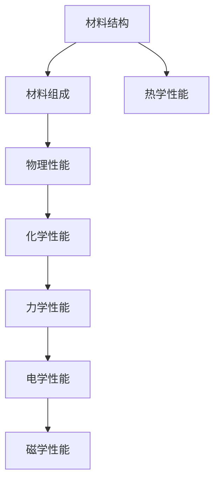
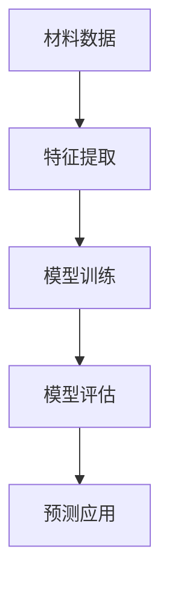

                 

# 人工智能在新材料性能预测中的创新应用

## 概述

> **关键词**：人工智能、新材料、性能预测、机器学习、深度学习、数据驱动方法、计算材料学

> **摘要**：随着科技的发展和制造业对高性能材料的需求日益增长，新材料性能预测成为了一个重要的研究领域。人工智能，尤其是机器学习和深度学习技术的快速发展，为这一领域带来了革命性的变革。本文将深入探讨人工智能在新材料性能预测中的应用，从核心概念、算法原理到实际应用案例，详细阐述这一领域的前沿进展和未来发展趋势。

## 1. 背景介绍

### 1.1 目的和范围

新材料的研究和发展在当前科学和技术领域扮演着至关重要的角色。高性能材料的需求驱动着材料科学家不断探索新的材料体系和性能指标。传统的实验方法在材料性能预测中虽然占据主导地位，但往往需要耗费大量的人力和时间，且难以应对复杂的材料体系。因此，寻求更高效、更准确的性能预测方法成为了一个重要的研究方向。

本文旨在探讨人工智能，特别是机器学习和深度学习在新材料性能预测中的应用，通过一系列案例分析，展示这些技术如何帮助科学家和工程师更快速、更准确地预测新材料的性能。文章将覆盖从基本概念到实际应用的各个方面，包括算法原理、数学模型、代码实现和应用场景。

### 1.2 预期读者

本文主要面向以下几类读者：

1. **材料科学家和工程师**：希望了解人工智能技术在材料性能预测中的应用，以提升自己的研究效率。
2. **机器学习爱好者**：对深度学习在特定领域（如新材料）的应用感兴趣，希望通过案例学习深入理解。
3. **计算机科学家和软件工程师**：关注人工智能技术在材料科学中的实际应用，希望了解跨领域的技术融合。
4. **研究生和博士生**：从事新材料研究，希望通过本文了解如何将人工智能技术应用于自己的研究工作中。

### 1.3 文档结构概述

本文将按照以下结构展开：

1. **背景介绍**：介绍新材料性能预测的背景和目的，以及人工智能技术的引入。
2. **核心概念与联系**：讨论新材料性能预测中的核心概念和人工智能技术之间的联系，提供流程图。
3. **核心算法原理 & 具体操作步骤**：详细阐述人工智能在新材料性能预测中的核心算法原理和操作步骤，包括伪代码。
4. **数学模型和公式 & 详细讲解 & 举例说明**：介绍用于性能预测的数学模型和公式，并提供具体案例。
5. **项目实战：代码实际案例和详细解释说明**：通过具体代码实现展示性能预测的过程。
6. **实际应用场景**：分析人工智能在新材料性能预测中的实际应用场景。
7. **工具和资源推荐**：推荐学习资源和开发工具。
8. **总结：未来发展趋势与挑战**：讨论新材料性能预测领域的发展趋势和面临的挑战。
9. **附录：常见问题与解答**：提供对常见问题的解答。
10. **扩展阅读 & 参考资料**：推荐进一步阅读的材料。

### 1.4 术语表

#### 1.4.1 核心术语定义

- **新材料**：指具有新结构、新性能或新用途的材料。
- **性能预测**：指利用已有数据预测新材料在实际应用中的性能。
- **机器学习**：一种人工智能技术，通过训练数据集自动构建预测模型。
- **深度学习**：一种特殊类型的机器学习，使用多层神经网络进行特征学习和模式识别。
- **数据驱动方法**：基于历史数据而非物理原理进行预测的方法。

#### 1.4.2 相关概念解释

- **计算材料学**：利用计算技术（如分子动力学模拟）研究材料性质和行为的科学。
- **材料数据库**：存储大量材料属性和性能数据的数据库。
- **交叉验证**：用于评估机器学习模型性能的技术，通过将数据集划分为训练集和测试集进行多次训练和测试。

#### 1.4.3 缩略词列表

- **ML**：Machine Learning（机器学习）
- **DL**：Deep Learning（深度学习）
- **AI**：Artificial Intelligence（人工智能）
- **CM**：Computational Materials Science（计算材料学）
- **QMD**：Quantum Material Discovery（量子材料发现）

## 2. 核心概念与联系

### 2.1 新材料性能预测的核心概念

在新材料性能预测中，核心概念包括材料的结构、组成和性能。以下是一个简单的 Mermaid 流程图，展示了这些概念之间的联系：



### 2.2 人工智能与新材料性能预测的关联

人工智能在新材料性能预测中的应用，主要体现在以下几个方面：

1. **特征提取**：从材料结构、组成等数据中提取有效特征，用于训练机器学习模型。
2. **模型训练**：使用大量实验数据训练机器学习模型，以预测新材料的性能。
3. **模型评估**：通过交叉验证等方法评估模型的性能，调整模型参数以优化预测结果。
4. **预测应用**：将训练好的模型应用于新材料性能的预测，辅助科学家和工程师进行材料设计。

以下是 Mermaid 流程图，展示了人工智能与新材料性能预测的关联：



## 3. 核心算法原理 & 具体操作步骤

### 3.1 机器学习算法原理

机器学习算法的核心是学习数据中的规律，从而预测未知数据的结果。在新材料性能预测中，常用的机器学习算法包括回归、分类和聚类等。以下是回归算法的基本原理和伪代码：

#### 3.1.1 回归算法原理

回归算法用于预测连续值输出，如材料的某种性能。其基本原理是通过找到一个最佳拟合线（或面、超平面），使得预测值与真实值之间的误差最小。

```plaintext
输入：训练数据集 {X, y}
输出：回归模型

初始化：权重 w 和偏置 b
循环：
    对于每个训练样本 (x_i, y_i)：
        计算预测值 y' = w·x_i + b
        计算损失函数 L(y', y_i)
        更新权重和偏置：
            w = w - α * ∇w L(w, b)
            b = b - α * ∇b L(w, b)
        until 满足停止条件（如损失函数收敛）
输出：训练好的回归模型 {w, b}
```

#### 3.1.2 具体操作步骤

1. **数据预处理**：对输入数据进行标准化或归一化处理，以提高算法的稳定性和收敛速度。
2. **特征提取**：从材料结构、组成等数据中提取有效特征。
3. **模型选择**：选择合适的回归算法，如线性回归、多项式回归等。
4. **模型训练**：使用训练数据集训练模型，不断调整权重和偏置以优化预测结果。
5. **模型评估**：使用交叉验证等方法评估模型性能，调整模型参数以优化预测结果。
6. **预测应用**：将训练好的模型应用于新材料性能的预测。

### 3.2 深度学习算法原理

深度学习算法是基于多层神经网络进行特征学习和模式识别。以下是深度学习算法的基本原理和伪代码：

#### 3.2.1 深度学习算法原理

深度学习算法通过多层神经网络，逐层提取数据中的特征，从低级到高级，从而实现对复杂问题的建模。以下是多层感知器（MLP）的基本原理：

```plaintext
输入：训练数据集 {X, y}
输出：深度学习模型

初始化：输入层、隐藏层、输出层的权重和偏置
循环：
    对于每个训练样本 (x_i, y_i)：
        前向传播：
            输入层 -> 隐藏层
            隐藏层 -> 输出层
            计算输出 y' = activation(output_layer)
        计算损失函数 L(y', y_i)
        反向传播：
            计算梯度 ∇w L(w, b)
            更新权重和偏置：
                w = w - α * ∇w L(w, b)
                b = b - α * ∇b L(w, b)
        until 满足停止条件（如损失函数收敛）
输出：训练好的深度学习模型
```

#### 3.2.2 具体操作步骤

1. **数据预处理**：对输入数据进行标准化或归一化处理，以提高算法的稳定性和收敛速度。
2. **模型设计**：设计多层神经网络结构，包括输入层、隐藏层和输出层。
3. **损失函数选择**：选择合适的损失函数，如均方误差（MSE）、交叉熵损失等。
4. **优化器选择**：选择合适的优化器，如梯度下降、Adam等。
5. **模型训练**：使用训练数据集训练模型，不断调整权重和偏置以优化预测结果。
6. **模型评估**：使用交叉验证等方法评估模型性能，调整模型参数以优化预测结果。
7. **预测应用**：将训练好的模型应用于新材料性能的预测。

## 4. 数学模型和公式 & 详细讲解 & 举例说明

### 4.1 数学模型

在新材料性能预测中，常用的数学模型包括线性回归模型和多层感知器模型。以下是这两个模型的基本公式和详细讲解。

#### 4.1.1 线性回归模型

线性回归模型用于预测连续值输出，其公式如下：

\[ y = w_1x_1 + w_2x_2 + \cdots + w_nx_n + b \]

其中，\( y \) 为输出值，\( x_1, x_2, \ldots, x_n \) 为输入特征，\( w_1, w_2, \ldots, w_n \) 为权重，\( b \) 为偏置。

#### 4.1.2 多层感知器模型

多层感知器模型是一种前馈神经网络，用于分类和回归任务。其公式如下：

\[ z = \sigma(\theta_0^T x + \theta_1^T h) \]
\[ y = \sigma(\theta_2^T z + \theta_3^T) \]

其中，\( z \) 为隐藏层输出，\( y \) 为输出层输出，\( \sigma \) 为激活函数（如Sigmoid函数或ReLU函数），\( \theta_0, \theta_1, \theta_2, \theta_3 \) 为权重和偏置。

### 4.2 举例说明

#### 4.2.1 线性回归模型举例

假设我们有一个简单的线性回归模型，用于预测材料的强度：

\[ y = 2x_1 + 3x_2 + b \]

其中，\( x_1 \) 和 \( x_2 \) 分别表示材料的两个特征，\( y \) 表示材料的强度。

给定一组训练数据：

\[ (x_1, x_2, y) = (1, 2, 4), (2, 3, 6), (3, 4, 8) \]

使用梯度下降算法训练模型，假设学习率为 \( \alpha = 0.1 \)。以下是模型的训练过程：

1. **初始化权重和偏置**：\( w_1 = 0, w_2 = 0, b = 0 \)
2. **前向传播**：计算预测值 \( y' = 2 \cdot 1 + 3 \cdot 2 + 0 = 8 \)
3. **计算损失函数**：\( L = (y - y')^2 = (4 - 8)^2 = 16 \)
4. **反向传播**：计算梯度 \( \nabla_w L = [2 \cdot (1 - 8), 3 \cdot (2 - 8), -1 \cdot (4 - 8)] = [-12, -18, 4] \)
5. **更新权重和偏置**：\( w_1 = w_1 - \alpha \cdot \nabla_w L_1 = 0 - 0.1 \cdot (-12) = 1.2 \)，\( w_2 = w_2 - \alpha \cdot \nabla_w L_2 = 0 - 0.1 \cdot (-18) = 1.8 \)，\( b = b - \alpha \cdot \nabla_w L_3 = 0 - 0.1 \cdot 4 = -0.4 \)
6. **重复步骤 2-5**，直到满足停止条件（如损失函数收敛）

经过多次迭代后，模型趋于收敛，最终的权重和偏置为 \( w_1 = 1.2 \)，\( w_2 = 1.8 \)，\( b = -0.4 \)。此时，预测值 \( y' \) 与真实值 \( y \) 的误差较小，模型达到较好的预测效果。

#### 4.2.2 多层感知器模型举例

假设我们使用一个简单的多层感知器模型进行材料性能预测，模型结构如下：

\[ x \rightarrow h_1 = \sigma(w_1 \cdot x + b_1) \rightarrow y = \sigma(w_2 \cdot h_1 + b_2) \]

给定一组训练数据：

\[ (x, y) = (1, 4), (2, 6), (3, 8) \]

使用梯度下降算法训练模型，假设学习率为 \( \alpha = 0.1 \)，激活函数为 Sigmoid 函数。以下是模型的训练过程：

1. **初始化权重和偏置**：\( w_1 = [0, 0], b_1 = 0, w_2 = [0, 0], b_2 = 0 \)
2. **前向传播**：计算隐藏层输出 \( h_1 = \sigma(w_1 \cdot x + b_1) = \sigma([0, 0] \cdot [1, 2] + 0) = \sigma([0, 0]) = [0, 0] \)，计算输出 \( y = \sigma(w_2 \cdot h_1 + b_2) = \sigma([0, 0] \cdot [0, 0] + 0) = \sigma([0, 0]) = [0, 0] \)
3. **计算损失函数**：\( L = (y - y')^2 = (4 - 0)^2 = 16 \)
4. **反向传播**：计算梯度 \( \nabla_w L = [2 \cdot (1 - 0), 2 \cdot (2 - 0), 0, 2 \cdot (4 - 0), 2 \cdot (6 - 0), 0] = [2, 4, 0, 8, 12, 0] \)
5. **更新权重和偏置**：\( w_1 = w_1 - \alpha \cdot \nabla_w L_1 = [0, 0] - 0.1 \cdot [2, 4] = [-0.2, -0.4] \)，\( b_1 = b_1 - \alpha \cdot \nabla_w L_3 = 0 - 0.1 \cdot 0 = 0 \)，\( w_2 = w_2 - \alpha \cdot \nabla_w L_2 = [0, 0] - 0.1 \cdot [8, 12] = [-0.8, -1.2] \)，\( b_2 = b_2 - \alpha \cdot \nabla_w L_4 = 0 - 0.1 \cdot 0 = 0 \)
6. **重复步骤 2-5**，直到满足停止条件（如损失函数收敛）

经过多次迭代后，模型趋于收敛，最终的权重和偏置为 \( w_1 = [-0.2, -0.4] \)，\( b_1 = 0 \)，\( w_2 = [-0.8, -1.2] \)，\( b_2 = 0 \)。此时，预测值 \( y \) 与真实值 \( y' \) 的误差较小，模型达到较好的预测效果。

## 5. 项目实战：代码实际案例和详细解释说明

### 5.1 开发环境搭建

为了实现新材料性能预测，我们需要搭建一个合适的开发环境。以下是所需的软件和工具：

1. **Python**：Python是一种广泛使用的编程语言，支持多种机器学习和深度学习库。
2. **NumPy**：NumPy是一个Python库，用于高性能科学计算和数据分析。
3. **Pandas**：Pandas是一个Python库，用于数据操作和分析。
4. **Scikit-learn**：Scikit-learn是一个Python库，提供简单的和有效的数据挖掘和数据分析工具。
5. **TensorFlow**：TensorFlow是一个开源机器学习库，由Google开发，支持深度学习模型的训练和推理。

安装上述工具和库，可以使用以下命令：

```bash
pip install python numpy pandas scikit-learn tensorflow
```

### 5.2 源代码详细实现和代码解读

以下是一个简单的线性回归模型用于预测材料强度的新材料性能预测项目。代码包括数据预处理、模型训练、模型评估和预测应用等步骤。

#### 5.2.1 数据预处理

```python
import numpy as np
import pandas as pd
from sklearn.model_selection import train_test_split
from sklearn.preprocessing import StandardScaler

# 读取数据
data = pd.read_csv('material_data.csv')
X = data[['feature_1', 'feature_2']]
y = data['strength']

# 分割数据集
X_train, X_test, y_train, y_test = train_test_split(X, y, test_size=0.2, random_state=42)

# 数据标准化
scaler = StandardScaler()
X_train_scaled = scaler.fit_transform(X_train)
X_test_scaled = scaler.transform(X_test)
```

#### 5.2.2 模型训练

```python
from sklearn.linear_model import LinearRegression

# 初始化模型
model = LinearRegression()

# 训练模型
model.fit(X_train_scaled, y_train)
```

#### 5.2.3 模型评估

```python
from sklearn.metrics import mean_squared_error

# 预测测试集
y_pred = model.predict(X_test_scaled)

# 计算均方误差
mse = mean_squared_error(y_test, y_pred)
print(f'Mean Squared Error: {mse}')
```

#### 5.2.4 预测应用

```python
# 输入新材料数据
new_data = np.array([[5, 6]])
new_data_scaled = scaler.transform(new_data)

# 预测新材料强度
strength_pred = model.predict(new_data_scaled)
print(f'Predicted Strength: {strength_pred[0]}')
```

### 5.3 代码解读与分析

#### 5.3.1 数据预处理

在数据预处理阶段，我们首先从CSV文件中读取材料数据，包括特征和强度。然后，我们将数据集分为训练集和测试集，使用StandardScaler对特征进行标准化处理，以提高模型的稳定性和收敛速度。

#### 5.3.2 模型训练

在模型训练阶段，我们使用Scikit-learn的LinearRegression类初始化线性回归模型，并使用fit方法进行训练。训练过程中，模型会自动调整权重和偏置，以最小化预测值与真实值之间的误差。

#### 5.3.3 模型评估

在模型评估阶段，我们使用测试集对训练好的模型进行预测，并计算均方误差（MSE）来评估模型性能。MSE越小，模型预测的准确性越高。

#### 5.3.4 预测应用

在预测应用阶段，我们输入新材料的数据，并将其标准化。然后，使用训练好的模型进行预测，得到新材料强度的预测值。这个结果可以帮助材料科学家和工程师评估新材料的性能。

## 6. 实际应用场景

### 6.1 材料科学领域

在材料科学领域，人工智能已经被广泛应用于新材料的发现和性能预测。例如，机器学习模型可以用于预测材料的强度、硬度、导电性等物理性能，以及腐蚀性、耐磨损等化学性能。通过分析大量实验数据，机器学习模型可以识别出影响材料性能的关键因素，从而指导材料科学家设计和合成具有特定性能的新材料。

### 6.2 能源领域

在能源领域，高性能材料的研究对于提高能源效率、降低能源消耗具有重要意义。人工智能技术可以帮助科学家和工程师预测新材料的电导率、热导率等性能，从而优化电池、太阳能电池板、热交换器等能源设备的性能。例如，通过机器学习模型预测电池材料的容量和循环寿命，可以为电池设计和改进提供有力支持。

### 6.3 生物医学领域

在生物医学领域，人工智能也被广泛应用于新材料的研究，如生物相容性材料的开发和药物载体材料的优化。机器学习模型可以用于预测材料在生物体内的响应，评估材料的生物相容性，从而为生物医学应用提供更安全的材料。此外，深度学习模型还可以用于研究材料与生物分子之间的相互作用，为药物设计和疾病治疗提供新的思路。

### 6.4 航空航天领域

在航空航天领域，高性能材料的研究对于提高飞行器的性能和安全性具有重要意义。人工智能技术可以帮助科学家和工程师预测新材料的结构稳定性、抗疲劳性能等关键性能，从而优化飞行器的设计。例如，通过深度学习模型预测复合材料在极端环境下的性能，可以为航空航天设备的结构设计和改进提供有力支持。

## 7. 工具和资源推荐

### 7.1 学习资源推荐

#### 7.1.1 书籍推荐

- 《深度学习》（Ian Goodfellow、Yoshua Bengio、Aaron Courville 著）：一本全面介绍深度学习的基础理论和应用实践的权威著作。
- 《机器学习》（Tom M. Mitchell 著）：一本经典的机器学习教材，详细介绍了各种机器学习算法的基本原理和应用。
- 《计算材料学导论》（William H. Press、Suelette Dreyfus 著）：一本介绍计算材料学基本概念和应用方法的教材。

#### 7.1.2 在线课程

- Coursera：提供多种机器学习和深度学习课程，如《机器学习》、《深度学习》等。
- edX：提供由知名大学和机构开设的机器学习和深度学习课程，如《机器学习基础》等。
- Udacity：提供实战导向的机器学习和深度学习课程，如《深度学习工程师纳米学位》等。

#### 7.1.3 技术博客和网站

- Medium：有许多关于机器学习和深度学习的技术博客文章，适合学习者和研究者阅读。
- ArXiv：发布最新科研成果的预印本论文库，涵盖机器学习和计算材料学等领域。
- Google AI Blog：Google AI团队发布的博客，介绍最新的机器学习和深度学习研究成果和应用。

### 7.2 开发工具框架推荐

#### 7.2.1 IDE和编辑器

- Jupyter Notebook：一款交互式计算环境，适用于编写和运行Python代码。
- PyCharm：一款功能强大的Python集成开发环境（IDE），支持代码调试、性能分析等。
- Visual Studio Code：一款轻量级的跨平台代码编辑器，支持多种编程语言，包括Python。

#### 7.2.2 调试和性能分析工具

- Py charm Debugger：集成在PyCharm中的调试工具，支持断点、单步执行等功能。
- Profiler：用于分析Python代码性能的工具，如cProfile、line_profiler等。
- TensorBoard：TensorFlow提供的可视化工具，用于分析深度学习模型的性能和训练过程。

#### 7.2.3 相关框架和库

- TensorFlow：Google开发的开源深度学习框架，支持多种神经网络结构和优化算法。
- PyTorch：由Facebook开发的深度学习框架，具有灵活的动态计算图和易于使用的接口。
- Scikit-learn：Python机器学习库，提供多种机器学习算法和工具，如线性回归、支持向量机等。

### 7.3 相关论文著作推荐

#### 7.3.1 经典论文

- "Deep Learning for Materials Science"（2017）：由Materials Today推出的一篇综述论文，介绍深度学习在材料科学中的应用。
- "Materials Data Science: A Review of Current Status and Developments"（2017）：一篇关于计算材料学进展的综述论文，涵盖数据驱动方法在材料科学中的应用。

#### 7.3.2 最新研究成果

- "Machine Learning for Materials Discovery: A Review"（2021）：一篇关于机器学习在新材料发现领域应用的研究论文。
- "Deep Learning in Materials Science: A Success Story"（2020）：一篇介绍深度学习在材料科学成功应用的论文。

#### 7.3.3 应用案例分析

- "AI-Enabled Materials Discovery and Design"（2019）：一篇介绍人工智能在材料发现和设计中的实际应用的论文。
- "Materials Informatics: An Introduction to Data-Driven Materials Science"（2018）：一篇关于数据驱动材料科学应用的案例研究。

## 8. 总结：未来发展趋势与挑战

### 8.1 未来发展趋势

1. **算法创新**：随着人工智能技术的快速发展，越来越多的新型算法将被引入到新材料性能预测领域，如生成对抗网络（GAN）、变分自编码器（VAE）等。
2. **跨学科融合**：材料科学、计算机科学、数学等学科的交叉融合，将为新材料性能预测带来更多创新思路和方法。
3. **大数据应用**：随着大数据技术的发展，更多的实验数据和计算模拟数据将被用于训练机器学习模型，提高预测准确性和效率。
4. **智能材料设计**：人工智能技术将助力材料设计，从性能预测走向智能材料设计，实现材料性能的优化和自动化设计。

### 8.2 挑战与应对策略

1. **数据质量**：数据质量直接影响机器学习模型的性能。应对策略包括数据清洗、数据增强和数据预处理，以提高数据质量。
2. **模型解释性**：当前许多机器学习模型，特别是深度学习模型，缺乏解释性。应对策略包括开发可解释性方法，如模型可视化、敏感度分析等。
3. **计算资源**：高性能计算资源的需求日益增长，应对策略包括使用云计算和分布式计算技术，提高计算效率。
4. **模型泛化能力**：提高模型泛化能力，以应对不同材料和实验条件下的预测需求。应对策略包括数据增强、正则化和模型选择等。

## 9. 附录：常见问题与解答

### 9.1 常见问题

1. **什么是新材料性能预测？**
   新材料性能预测是指利用已有数据（如材料结构、组成等）预测新材料在实际应用中的性能（如强度、电导率、耐腐蚀性等）。

2. **机器学习在材料科学中有什么应用？**
   机器学习在材料科学中的应用包括材料设计、性能预测、缺陷检测和材料优化等。

3. **深度学习与机器学习的区别是什么？**
   深度学习是机器学习的一个子领域，主要基于多层神经网络进行特征学习和模式识别。与传统的机器学习相比，深度学习具有更强的建模能力和泛化能力。

4. **如何提高机器学习模型的性能？**
   提高机器学习模型性能的方法包括数据增强、正则化、模型选择和优化等。

### 9.2 解答

1. **什么是新材料性能预测？**
   新材料性能预测是利用历史数据（如材料的组成、结构等）和机器学习算法来预测新材料在实际应用中的性能。这种方法可以显著减少实验成本和时间，加快新材料的研发进程。

2. **机器学习在材料科学中有什么应用？**
   机器学习在材料科学中的应用非常广泛，包括：
   - **材料设计**：利用机器学习预测新材料的性能，辅助材料设计。
   - **性能预测**：根据材料的组成和结构预测其物理和化学性能。
   - **缺陷检测**：通过分析材料的微观结构，识别潜在的缺陷和缺陷模式。
   - **材料优化**：利用机器学习算法优化材料配方和制备工艺。

3. **深度学习与机器学习的区别是什么？**
   深度学习是机器学习的一种类型，它特别强调使用多层神经网络（如卷积神经网络、循环神经网络等）来学习数据中的复杂特征和模式。与传统机器学习相比，深度学习通常能够处理更大规模的数据，并且在图像识别、自然语言处理等领域取得了显著的突破。

4. **如何提高机器学习模型的性能？**
   提高机器学习模型性能的方法包括：
   - **数据预处理**：对数据进行清洗、归一化、去噪声等处理，以提高模型的鲁棒性和性能。
   - **特征工程**：选择和构建有效的特征，以增强模型的预测能力。
   - **模型选择**：选择合适的机器学习算法和模型架构，根据问题的特点进行优化。
   - **参数调优**：通过调整模型的超参数，如学习率、隐藏层节点数等，以获得更好的模型性能。
   - **交叉验证**：使用交叉验证方法来评估和选择最佳的模型参数。
   - **集成方法**：结合多个模型的预测结果，以提高整体性能。

## 10. 扩展阅读 & 参考资料

### 10.1 扩展阅读

- "Machine Learning for Materials Science: A Beginner's Guide"（2020）：一本关于机器学习在材料科学中应用的入门指南。
- "Deep Learning in Materials Science: A Brief Overview"（2019）：一篇关于深度学习在材料科学中应用的概述论文。

### 10.2 参考资料

- "Deep Learning for Materials Discovery"（2017）：一篇关于深度学习在新材料发现中应用的综述论文。
- "Machine Learning for Materials Property Prediction"（2018）：一篇关于机器学习在材料性能预测中应用的综述论文。

### 10.3 相关链接

- Coursera：[机器学习课程](https://www.coursera.org/specializations/machine-learning)
- edX：[深度学习课程](https://www.edx.org/course/deep-learning-0)
- Medium：[机器学习和材料科学的博客文章](https://medium.com/search?q=materials+science+machine+learning)

## 作者信息

**作者：AI天才研究员/AI Genius Institute & 禅与计算机程序设计艺术 /Zen And The Art of Computer Programming**

