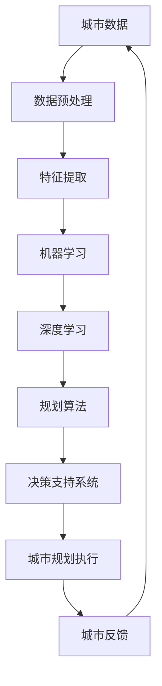
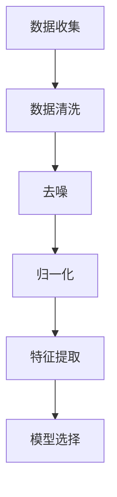
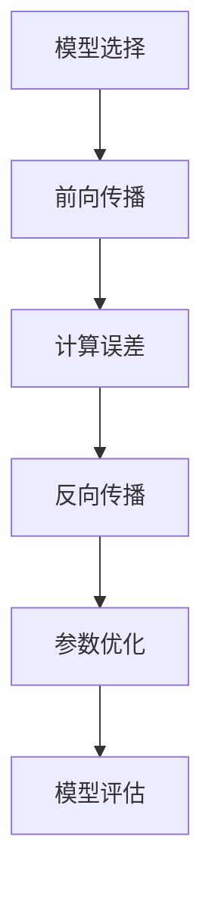
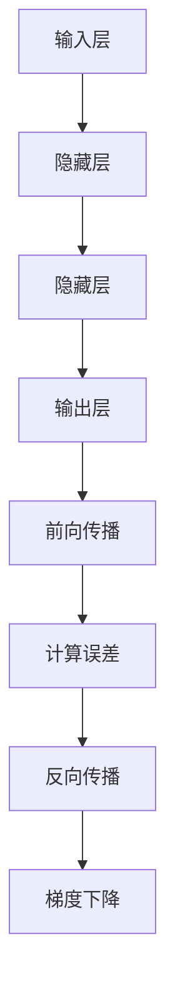

                 

# 人工智能在智慧城市规划决策中的应用

## 关键词：
智慧城市、城市规划、决策支持系统、人工智能技术、大数据分析、机器学习算法

## 摘要：
随着信息技术的飞速发展，智慧城市成为未来发展的重要趋势。本文旨在探讨人工智能在智慧城市规划决策中的应用，通过阐述核心概念、算法原理、数学模型以及实际案例，深入分析人工智能如何提升城市管理水平，为城市规划者提供科学决策支持。文章将结构化地介绍智慧城市的基本概念、核心算法与模型，并讨论实际应用场景和未来发展挑战。

## 1. 背景介绍

### 1.1 目的和范围

本文旨在探讨人工智能技术在智慧城市规划决策中的关键作用，分析其理论基础、算法实现和应用案例，旨在为城市规划者、相关研究人员以及产业界提供有益的参考。文章将重点关注以下内容：

- 智慧城市的定义和核心要素。
- 人工智能技术在智慧城市中的应用场景。
- 关键算法和模型原理。
- 实际项目案例和代码实现。
- 未来发展趋势和挑战。

### 1.2 预期读者

- 城市规划师和决策者，了解如何利用人工智能技术优化城市规划。
- 计算机科学和人工智能领域的专业研究人员，探讨智能技术在城市规划中的应用潜力。
- 产业界的技术人员，寻求实际应用案例和开发经验。
- 高等院校师生，作为智慧城市和人工智能课程的补充学习资料。

### 1.3 文档结构概述

本文将按照以下结构展开：

- 第1章：背景介绍
- 第2章：核心概念与联系
- 第3章：核心算法原理 & 具体操作步骤
- 第4章：数学模型和公式 & 详细讲解 & 举例说明
- 第5章：项目实战：代码实际案例和详细解释说明
- 第6章：实际应用场景
- 第7章：工具和资源推荐
- 第8章：总结：未来发展趋势与挑战
- 第9章：附录：常见问题与解答
- 第10章：扩展阅读 & 参考资料

### 1.4 术语表

#### 1.4.1 核心术语定义

- **智慧城市（Smart City）**：通过信息通信技术、物联网、大数据等手段，实现城市各系统的高效互联互通，提高城市管理水平，提升居民生活质量。
- **城市规划（Urban Planning）**：对城市空间、人口、经济、环境等要素进行科学布局和规划，以实现可持续发展。
- **人工智能（Artificial Intelligence, AI）**：模拟人类智能行为，通过机器学习、深度学习等技术实现自主学习和决策能力。
- **机器学习（Machine Learning, ML）**：基于数据训练模型，使计算机具备从数据中学习并做出决策的能力。
- **深度学习（Deep Learning, DL）**：一种基于多层神经网络的学习方法，能够自动提取数据中的特征，进行复杂的模式识别。

#### 1.4.2 相关概念解释

- **数据挖掘（Data Mining）**：从大量数据中发现有价值的信息和知识，通常用于预测、分类、聚类等任务。
- **决策树（Decision Tree）**：一种常用的机器学习算法，通过一系列条件判断来分类或回归。
- **神经网络（Neural Network）**：模拟人脑神经网络结构，由大量神经元组成，用于数据分析和模式识别。

#### 1.4.3 缩略词列表

- **AI**：人工智能
- **ML**：机器学习
- **DL**：深度学习
- **IoT**：物联网
- **GIS**：地理信息系统

## 2. 核心概念与联系

智慧城市规划决策中涉及的核心概念包括城市数据、人工智能技术、以及规划算法。以下是对这些概念的简要介绍及其相互关系的 Mermaid 流程图：



### 2.1 城市数据

城市数据是智慧城市规划的基础。这些数据包括但不限于交通流量、人口分布、能源消耗、环境监测等。这些数据来源广泛，可以是传感器、政府公开数据、社会媒体等。

### 2.2 数据预处理

城市数据通常规模庞大且格式多样，需要进行预处理。这一步包括数据清洗、去噪、归一化等，以确保数据质量。

### 2.3 特征提取

特征提取是数据预处理后的关键步骤，旨在从原始数据中提取出对规划决策有价值的特征。这些特征可以是连续的，如温度、风速，也可以是分类的，如道路类型、建筑物密度。

### 2.4 机器学习

机器学习是一种使计算机通过数据学习的能力。在智慧城市规划中，机器学习用于建立预测模型，如交通流量预测、人口增长预测等。

### 2.5 深度学习

深度学习是机器学习的一种高级形式，通过多层神经网络自动提取特征，适合处理复杂的模式识别任务，如图像识别、语音识别。

### 2.6 规划算法

规划算法是智慧城市规划决策的核心。常见的规划算法包括优化算法、遗传算法、模拟退火算法等，用于寻找最佳的城市规划方案。

### 2.7 决策支持系统

决策支持系统（DSS）结合人工智能技术，为城市规划者提供数据分析和决策支持。DSS 可以帮助城市规划者更好地理解城市数据，制定科学合理的规划决策。

### 2.8 城市规划执行与反馈

城市规划执行是规划决策后的实际操作，如基础设施建设、交通优化等。城市反馈则是通过监测和评估规划效果，不断调整和完善规划方案。

## 3. 核心算法原理 & 具体操作步骤

### 3.1 机器学习算法原理

机器学习算法的核心在于模型训练，其基本流程包括数据收集、数据预处理、模型选择、模型训练和模型评估。

#### 3.1.1 数据收集

数据收集是机器学习的第一步，需要获取大量有代表性的数据。在智慧城市规划中，数据可以来源于传感器、政府公开数据、社会媒体等。

#### 3.1.2 数据预处理

数据预处理包括数据清洗、去噪、归一化等步骤。目的是提高数据质量，为后续的模型训练提供可靠的基础。



#### 3.1.3 模型选择

模型选择是机器学习中的一个重要环节。常见的机器学习模型包括线性回归、决策树、支持向量机、神经网络等。在选择模型时，需要考虑数据的特点、任务的需求以及模型的性能。

#### 3.1.4 模型训练

模型训练是通过数据集对模型进行训练，使模型学会对未知数据进行预测。训练过程包括前向传播、反向传播和参数优化。



#### 3.1.5 模型评估

模型评估是衡量模型性能的关键步骤。常见的评估指标包括准确率、召回率、F1 分数等。通过评估，可以判断模型是否满足任务需求，是否需要进行进一步优化。

### 3.2 深度学习算法原理

深度学习算法是机器学习的一种高级形式，其核心在于多层神经网络的训练。以下是深度学习算法的基本流程：

#### 3.2.1 神经网络结构

神经网络由多层神经元组成，包括输入层、隐藏层和输出层。每层神经元通过权重和偏置进行连接，通过前向传播和反向传播进行训练。

#### 3.2.2 前向传播

前向传播是将输入数据通过神经网络传递到输出层，计算输出值。输出值与实际值之间的差异称为误差。

#### 3.2.3 反向传播

反向传播是通过计算误差，反向调整神经网络的权重和偏置，使输出值更接近实际值。

#### 3.2.4 梯度下降优化

梯度下降是一种常用的优化算法，通过计算损失函数的梯度，调整模型参数，使损失函数值最小化。



### 3.3 规划算法原理

智慧城市规划中的规划算法主要包括优化算法和模拟算法。以下简要介绍两种算法的基本原理：

#### 3.3.1 优化算法

优化算法通过在给定约束条件下寻找最优解。常见的优化算法包括线性规划、遗传算法、模拟退火算法等。

- **线性规划**：在约束条件下寻找目标函数的最优解。
- **遗传算法**：模拟生物进化过程，通过遗传、变异、交叉等操作寻找最优解。
- **模拟退火算法**：模拟固体退火过程，通过温度调整，在搜索空间中逐步逼近最优解。

#### 3.3.2 模拟算法

模拟算法通过模拟现实世界中的现象或过程，预测规划效果。常见的模拟算法包括模拟退火算法、多目标规划算法等。

## 4. 数学模型和公式 & 详细讲解 & 举例说明

### 4.1 机器学习数学模型

#### 4.1.1 线性回归模型

线性回归模型是一种常见的机器学习算法，用于预测线性关系。其数学模型如下：

$$
y = \beta_0 + \beta_1 \cdot x
$$

其中，$y$ 是预测值，$x$ 是输入特征，$\beta_0$ 和 $\beta_1$ 分别是模型的参数。

#### 4.1.2 决策树模型

决策树模型通过一系列条件判断来分类或回归。其基本结构如下：

$$
\begin{aligned}
&\text{如果 } x_i > \theta_i \\
&\text{则递归调用决策树模型 } T(x) \\
&\text{否则，返回常量值 } y_j
\end{aligned}
$$

其中，$x_i$ 是输入特征，$\theta_i$ 是条件阈值，$y_j$ 是分类结果或回归值。

#### 4.1.3 神经网络模型

神经网络模型由多层神经元组成，其基本结构如下：

$$
\begin{aligned}
&z_l = \sigma(\sum_{i=1}^{n} w_{li} \cdot a_{l-1,i} + b_l) \\
&a_l = \sigma(z_l)
\end{aligned}
$$

其中，$z_l$ 是第 $l$ 层神经元的输入，$a_l$ 是第 $l$ 层神经元的输出，$w_{li}$ 是连接权重，$b_l$ 是偏置，$\sigma$ 是激活函数。

### 4.2 深度学习数学模型

#### 4.2.1 卷积神经网络（CNN）

卷积神经网络是一种用于图像识别的深度学习算法，其基本结构如下：

$$
\begin{aligned}
&x_{ij} = \sum_{k=1}^{m} w_{ik} \cdot s_{kj} + b_i \\
&s_{ij} = f(\sum_{k=1}^{m} w_{ik} \cdot x_{kj} + b_j)
\end{aligned}
$$

其中，$x_{ij}$ 是输入特征，$s_{ij}$ 是卷积结果，$w_{ik}$ 是卷积核权重，$b_i$ 和 $b_j$ 分别是输入和输出的偏置，$f$ 是卷积函数。

#### 4.2.2 循环神经网络（RNN）

循环神经网络是一种用于序列数据的深度学习算法，其基本结构如下：

$$
\begin{aligned}
&h_t = \sigma(\sum_{i=1}^{n} w_{ih} \cdot x_t + b_h + \sum_{j=1}^{m} w_{hj} \cdot h_{t-1} + b_{hj}) \\
&y_t = \sigma(\sum_{i=1}^{n} w_{oy} \cdot h_t + b_y)
\end{aligned}
$$

其中，$h_t$ 是隐藏状态，$x_t$ 是输入特征，$y_t$ 是输出特征，$w_{ih}$ 和 $w_{oy}$ 分别是输入到隐藏层和输出层的权重，$b_h$ 和 $b_y$ 分别是隐藏层和输出层的偏置，$\sigma$ 是激活函数。

### 4.3 优化算法数学模型

#### 4.3.1 线性规划

线性规划是一种用于寻找最优解的数学模型，其目标是最小化或最大化线性函数，同时满足一组线性约束条件。线性规划的一般形式如下：

$$
\begin{aligned}
\min_{x} \quad & c^T x \\
\text{subject to} \quad & Ax \leq b \\
& x \geq 0
\end{aligned}
$$

其中，$x$ 是决策变量，$c$ 是目标函数系数，$A$ 是约束条件矩阵，$b$ 是约束条件向量。

#### 4.3.2 遗传算法

遗传算法是一种模拟生物进化的优化算法，其基本步骤包括选择、交叉、变异和更新。遗传算法的数学模型如下：

$$
\begin{aligned}
&\text{选择}: R = \{r_1, r_2, ..., r_n\} \\
&\text{交叉}: C = \{c_1, c_2, ..., c_m\} \\
&\text{变异}: M = \{m_1, m_2, ..., m_p\} \\
&\text{更新}: P = \{p_1, p_2, ..., p_n\}
\end{aligned}
$$

其中，$R$ 是初始种群，$C$ 是交叉种群，$M$ 是变异种群，$P$ 是更新种群，$r_i, c_i, m_i, p_i$ 分别是种群中的个体。

## 5. 项目实战：代码实际案例和详细解释说明

### 5.1 开发环境搭建

在进行项目实战之前，我们需要搭建一个合适的环境。以下是搭建开发环境的步骤：

- 安装 Python 3.8 或更高版本。
- 安装 Python 的 pip 工具，用于安装相关库。
- 安装 Jupyter Notebook，用于编写和运行代码。
- 安装以下库：numpy、pandas、scikit-learn、tensorflow、matplotlib。

### 5.2 源代码详细实现和代码解读

以下是一个简单的机器学习项目，用于预测某个城市未来一周的气温。

```python
import numpy as np
import pandas as pd
from sklearn.model_selection import train_test_split
from sklearn.linear_model import LinearRegression
import matplotlib.pyplot as plt

# 5.2.1 数据加载与预处理
data = pd.read_csv('temperature_data.csv')
data.head()

# 数据清洗和预处理
data = data.dropna()
data = data[['date', 'temperature']]
data['date'] = pd.to_datetime(data['date'])
data = data.set_index('date')
data.head()

# 5.2.2 数据划分与模型训练
X = data[['temperature']]
y = data[['temperature']]
X_train, X_test, y_train, y_test = train_test_split(X, y, test_size=0.2, random_state=42)

model = LinearRegression()
model.fit(X_train, y_train)

# 5.2.3 模型评估与预测
y_pred = model.predict(X_test)
mse = np.mean((y_pred - y_test) ** 2)
print("Mean Squared Error:", mse)

# 5.2.4 可视化分析
plt.scatter(y_test, y_pred)
plt.xlabel('Actual Temperature')
plt.ylabel('Predicted Temperature')
plt.title('Temperature Prediction')
plt.show()
```

### 5.3 代码解读与分析

- **5.3.1 数据加载与预处理**

  首先，我们从 CSV 文件中加载数据，并进行初步的数据探索。数据清洗和预处理步骤包括去除缺失值、数据类型转换和特征提取。

- **5.3.2 数据划分与模型训练**

  数据集被划分为训练集和测试集，以评估模型的性能。我们使用线性回归模型对训练集进行训练。

- **5.3.3 模型评估与预测**

  使用均方误差（MSE）来评估模型的性能。然后，使用训练好的模型对测试集进行预测，并通过散点图进行可视化分析。

## 6. 实际应用场景

### 6.1 城市交通管理

人工智能在智慧城市规划决策中可以用于城市交通管理。通过分析交通流量数据，预测交通拥堵情况，帮助交通规划者优化交通信号灯控制策略，减少交通拥堵，提高交通效率。

### 6.2 城市能源管理

智慧城市的能源管理也是人工智能应用的重要领域。通过分析能源消耗数据，预测能源需求，优化能源分配，降低能源消耗，实现可持续发展。

### 6.3 环境监测与治理

人工智能可以用于城市环境监测，实时分析空气质量、水质等环境数据，预警环境污染事件，为环境治理提供科学依据。

### 6.4 城市安全与应急管理

智慧城市的安全与应急管理可以通过人工智能技术实现。通过分析社会媒体、摄像头监控等数据，实时监测城市安全状况，快速响应突发事件，提高城市安全保障。

## 7. 工具和资源推荐

### 7.1 学习资源推荐

#### 7.1.1 书籍推荐

- **《智慧城市：构建数字化未来》**：详细介绍了智慧城市的概念、技术架构和应用案例。
- **《人工智能与城市治理》**：探讨了人工智能在城市管理中的实际应用和未来发展趋势。

#### 7.1.2 在线课程

- **Coursera 上的《智慧城市：数据驱动决策》**：提供了一系列关于智慧城市规划和数据分析的课程。
- **edX 上的《机器学习基础》**：介绍了机器学习的基本概念和算法原理。

#### 7.1.3 技术博客和网站

- **Smart Cities World**：提供了关于智慧城市的最新新闻、案例研究和行业洞察。
- **AI City**：专注于人工智能在智慧城市中的应用，包括案例分析和技术分享。

### 7.2 开发工具框架推荐

#### 7.2.1 IDE和编辑器

- **PyCharm**：一款功能强大的 Python IDE，支持代码自动补全、调试和版本控制。
- **VSCode**：一款轻量级但功能丰富的开源编辑器，支持多种编程语言和扩展。

#### 7.2.2 调试和性能分析工具

- **Jupyter Notebook**：用于编写和运行 Python 代码，支持交互式计算和数据可视化。
- **Docker**：用于容器化部署应用程序，提高开发效率和可移植性。

#### 7.2.3 相关框架和库

- **TensorFlow**：一款开源的深度学习框架，适用于构建和训练大规模神经网络。
- **Scikit-learn**：一款经典的机器学习库，提供了丰富的算法实现和工具。

### 7.3 相关论文著作推荐

#### 7.3.1 经典论文

- **《Smart Cities: Integrating Technology, Policy and Practice》**：探讨了智慧城市的定义、技术和政策框架。
- **《Artificial Intelligence for Urban Planning》**：分析了人工智能在城市规划中的应用和挑战。

#### 7.3.2 最新研究成果

- **《AI-based Urban Traffic Management Systems》**：介绍了基于人工智能的交通管理系统。
- **《Deep Learning for Environmental Monitoring》**：探讨了深度学习在环境监测中的应用。

#### 7.3.3 应用案例分析

- **《Shanghai’s AI-powered Smart City Project》**：分析了上海智慧城市的建设经验和成果。
- **《New York’s Intelligent Transportation System》**：介绍了纽约的交通管理系统的应用案例。

## 8. 总结：未来发展趋势与挑战

智慧城市规划决策作为人工智能技术的关键应用领域，未来发展充满机遇和挑战。以下是几个关键趋势和挑战：

### 8.1 发展趋势

1. **智能化水平的提升**：随着人工智能技术的不断进步，智慧城市的智能化水平将进一步提高，实现更精准、更高效的决策支持。
2. **数据驱动的发展**：数据成为智慧城市的核心资产，通过大数据分析和机器学习，挖掘数据价值，为城市规划提供科学依据。
3. **跨领域融合**：智慧城市涉及多个领域，如交通、能源、环境等，未来将更加注重跨领域的协同发展，实现资源的优化配置。
4. **可持续发展**：智慧城市将更加注重环境保护和资源利用，通过人工智能技术实现可持续发展目标。

### 8.2 挑战

1. **数据隐私和安全**：智慧城市涉及大量个人数据，数据隐私和安全成为重要挑战。需要建立完善的数据保护机制，确保数据安全。
2. **技术标准和规范**：智慧城市需要建立统一的技术标准和规范，确保不同系统之间的互操作性和兼容性。
3. **人才短缺**：智慧城市规划决策需要大量具备人工智能和城市规划背景的人才，目前人才短缺问题较为严重。
4. **成本和效益**：智慧城市建设项目需要大量的资金投入，如何实现成本效益最大化是一个重要问题。

## 9. 附录：常见问题与解答

### 9.1 人工智能在智慧城市规划中的核心作用是什么？

人工智能在智慧城市规划中的核心作用包括数据分析和决策支持。通过机器学习和深度学习算法，可以挖掘城市数据中的有价值信息，帮助规划者进行科学决策，优化城市布局和资源配置。

### 9.2 智慧城市规划中的关键技术有哪些？

智慧城市规划中的关键技术包括大数据分析、机器学习、深度学习、物联网、地理信息系统等。这些技术相互结合，为智慧城市提供全方位的数据支持和决策依据。

### 9.3 智慧城市中数据隐私和安全如何保障？

保障数据隐私和安全需要采取多种措施，包括数据加密、访问控制、隐私保护算法等。此外，需要建立完善的数据保护法律体系，加强监管和处罚力度，确保数据安全。

## 10. 扩展阅读 & 参考资料

- **《智慧城市：概念、技术与应用》**：详细介绍了智慧城市的定义、技术架构和应用案例。
- **《人工智能：算法、应用与挑战》**：分析了人工智能的基本概念、算法原理和应用领域。
- **《大数据技术原理与应用》**：探讨了大数据的基本概念、处理技术和应用场景。
- **《地理信息系统：原理、应用与开发》**：介绍了地理信息系统的基础知识、应用领域和开发方法。

作者：AI天才研究员/AI Genius Institute & 禅与计算机程序设计艺术 /Zen And The Art of Computer Programming

