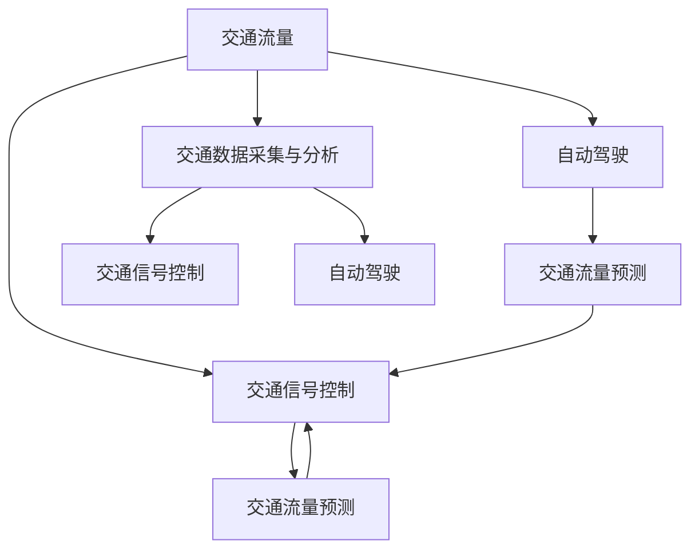

                 

# 人工智能在智能交通管理中的应用

> **关键词：** 人工智能、智能交通管理、交通流量预测、智能信号控制、自动驾驶、数据分析
>
> **摘要：** 本文将深入探讨人工智能在智能交通管理中的应用，从核心概念、算法原理、数学模型到实际应用案例，全面解析智能交通管理的未来趋势与挑战。通过逐步分析推理，本文旨在为读者提供一个清晰、系统、专业的技术视角。

## 1. 背景介绍

### 1.1 目的和范围

本文旨在探讨人工智能在智能交通管理领域的应用，分析其核心概念、算法原理、数学模型及实际应用案例。通过对当前智能交通管理技术的全面剖析，本文希望为交通领域的学者和从业者提供一个有价值的参考，同时也为广大对智能交通管理感兴趣的读者提供深入了解的机会。

### 1.2 预期读者

本文主要面向以下几类读者：

1. **交通工程和城市规划领域的学者**：希望了解智能交通管理技术的发展现状和未来趋势。
2. **人工智能和计算机科学领域的研究人员**：希望深入了解人工智能技术在智能交通管理中的应用。
3. **交通管理部门的技术人员**：希望了解如何利用人工智能技术提升交通管理效率。
4. **对智能交通管理感兴趣的一般读者**：希望系统了解智能交通管理技术的原理和应用。

### 1.3 文档结构概述

本文结构如下：

1. **背景介绍**：介绍智能交通管理的背景、目的和预期读者。
2. **核心概念与联系**：介绍智能交通管理的核心概念及其相互关系。
3. **核心算法原理 & 具体操作步骤**：详细讲解智能交通管理中常用的算法原理和操作步骤。
4. **数学模型和公式 & 详细讲解 & 举例说明**：介绍智能交通管理中常用的数学模型和公式，并进行详细讲解和举例。
5. **项目实战：代码实际案例和详细解释说明**：通过实际项目案例，展示如何利用人工智能技术解决交通管理问题。
6. **实际应用场景**：分析智能交通管理的实际应用场景和效果。
7. **工具和资源推荐**：推荐学习资源和开发工具。
8. **总结：未来发展趋势与挑战**：总结智能交通管理的未来发展趋势和面临的挑战。
9. **附录：常见问题与解答**：回答读者可能遇到的一些常见问题。
10. **扩展阅读 & 参考资料**：提供扩展阅读和参考资料。

### 1.4 术语表

#### 1.4.1 核心术语定义

- **智能交通管理**：利用先进的信息技术、数据分析和人工智能技术，对交通系统进行实时监控、预测和优化，以提高交通效率、减少交通事故和缓解交通拥堵。
- **交通流量预测**：通过分析历史交通数据，预测未来某一时间段内的交通流量分布，为交通管理和信号控制提供依据。
- **智能信号控制**：利用实时交通数据和人工智能算法，动态调整交通信号灯的时长和相位，以优化交通流量。
- **自动驾驶**：通过人工智能技术，实现车辆在道路上自主导航和驾驶，减少人为操作失误。

#### 1.4.2 相关概念解释

- **人工智能**：模拟人类智能行为的计算机系统，具有感知、学习、推理和决策能力。
- **机器学习**：一种人工智能技术，通过数据和算法，让计算机自动学习和改进。
- **深度学习**：一种机器学习技术，通过神经网络模型，模拟人脑的感知和学习过程。

#### 1.4.3 缩略词列表

- **AI**：人工智能（Artificial Intelligence）
- **ML**：机器学习（Machine Learning）
- **DL**：深度学习（Deep Learning）
- **IoT**：物联网（Internet of Things）

## 2. 核心概念与联系

在智能交通管理中，有几个核心概念和联系至关重要，这些概念包括交通流量、交通信号控制、自动驾驶和交通数据采集与分析。下面，我们将使用 Mermaid 流程图（Mermaid Diagram）来展示这些概念及其相互关系。



### 2.1 交通流量与交通信号控制

交通流量是指某一时间段内通过特定路段的车辆数量。交通信号控制通过调节交通信号灯的时长和相位，来引导车辆有序行驶，从而优化交通流量。交通流量预测是交通信号控制的基础，它通过分析历史交通数据和实时数据，预测未来某一时间段内的交通流量分布。

### 2.2 交通流量与自动驾驶

自动驾驶技术依赖于交通流量信息，以实现车辆的自主导航和驾驶。通过实时获取交通流量数据，自动驾驶车辆可以提前预测道路状况，调整行驶策略，避免拥堵和事故。

### 2.3 交通数据采集与分析

交通数据采集与分析是智能交通管理的核心。通过传感器、摄像头和GPS等技术，实时采集交通流量、速度、密度等数据，并进行数据分析和处理，为交通流量预测、信号控制和自动驾驶提供依据。

### 2.4 交通信号控制与自动驾驶

智能信号控制可以为自动驾驶车辆提供更好的交通信号信息，帮助自动驾驶车辆更准确地预测交通状况，提高行驶安全性。同时，自动驾驶车辆的实时数据反馈，可以为交通信号控制提供更加精确的流量预测。

## 3. 核心算法原理 & 具体操作步骤

智能交通管理中，核心算法原理主要包括交通流量预测、交通信号控制和自动驾驶算法。下面，我们将使用伪代码（Pseudo Code）详细阐述这些算法原理和操作步骤。

### 3.1 交通流量预测算法

```plaintext
算法名称：时间序列分析交通流量预测

输入：历史交通流量数据（TrafficData）
输出：未来交通流量预测结果（PredictedTraffic）

步骤：
1. 数据预处理：对历史交通流量数据进行清洗和预处理，去除异常值和噪声。
2. 特征工程：提取与交通流量相关的特征，如时间、天气、节假日等。
3. 选择模型：根据数据特点，选择合适的时间序列预测模型，如ARIMA、LSTM等。
4. 模型训练：使用历史交通流量数据进行模型训练。
5. 预测：使用训练好的模型，对未来的交通流量进行预测。
6. 结果评估：评估预测结果的准确性，如均方误差（MSE）等。
```

### 3.2 交通信号控制算法

```plaintext
算法名称：自适应交通信号控制

输入：实时交通数据（RealTimeTrafficData）
输出：最优交通信号灯时长和相位（OptimalTrafficSignal）

步骤：
1. 数据采集：实时采集交通数据，如车辆速度、密度、方向等。
2. 状态检测：根据交通数据，检测当前交通状态，如拥堵、畅通等。
3. 目标设定：设定信号控制目标，如最小化延迟、最大化通行效率等。
4. 模型选择：选择合适的信号控制模型，如基于规则的模型、基于学习的模型等。
5. 信号控制：根据当前交通状态和目标，调整交通信号灯的时长和相位。
6. 反馈机制：根据车辆通过情况，实时调整信号控制策略。
```

### 3.3 自动驾驶算法

```plaintext
算法名称：基于深度学习的自动驾驶

输入：实时交通数据、路况信息、车辆状态等（RealTimeData）
输出：车辆行驶路径和速度（DrivingPath）

步骤：
1. 数据采集：实时采集交通数据、路况信息和车辆状态。
2. 数据处理：对采集到的数据进行预处理，如去噪、归一化等。
3. 模型训练：使用深度学习模型（如CNN、RNN等）进行训练，以实现车辆识别、路径规划和行驶控制。
4. 车辆识别：使用训练好的模型，识别道路上的车辆、行人、道路标志等。
5. 路径规划：根据车辆识别结果，规划车辆的行驶路径。
6. 行驶控制：根据路径规划和交通信号，控制车辆的行驶速度和方向。
```

## 4. 数学模型和公式 & 详细讲解 & 举例说明

在智能交通管理中，数学模型和公式发挥着重要作用，它们帮助我们理解和优化交通系统。以下我们将详细介绍几个关键的数学模型和公式，并进行详细讲解和举例。

### 4.1 交通流量预测模型

#### 4.1.1 时间序列模型

时间序列模型是交通流量预测中最常用的模型之一，其中 ARIMA（自回归积分滑动平均模型）是一个经典的模型。

**ARIMA 模型公式：**

$$
X_t = c + \phi_1 X_{t-1} + \phi_2 X_{t-2} + ... + \phi_p X_{t-p} + \theta_1 \varepsilon_{t-1} + \theta_2 \varepsilon_{t-2} + ... + \theta_q \varepsilon_{t-q} + \varepsilon_t
$$

其中：
- \( X_t \)：时间序列的当前值
- \( c \)：常数项
- \( \phi_1, \phi_2, ..., \phi_p \)：自回归系数
- \( \theta_1, \theta_2, ..., \theta_q \)：移动平均系数
- \( \varepsilon_t \)：白噪声项

#### 4.1.2 举例说明

假设我们有一个交通流量序列 \( \{X_t\} \)，使用 ARIMA 模型进行预测。

1. **数据预处理**：对序列 \( \{X_t\} \) 进行差分和季节性调整，使其满足平稳性。
2. **模型识别**：确定模型参数 \( p, d, q \)，其中 \( p \) 为自回归项数，\( d \) 为差分次数，\( q \) 为移动平均项数。
3. **模型参数估计**：使用最大似然估计方法，估计模型参数。
4. **模型检验**：检验模型残差的白噪声性。
5. **预测**：使用估计的模型参数，对未来交通流量进行预测。

### 4.2 交通信号控制模型

#### 4.2.1 信号时长优化模型

信号时长优化模型的目标是最小化交通系统的平均延迟。一个常用的模型是基于线性规划的方法。

**线性规划公式：**

$$
\min \sum_{i=1}^{N} w_i \cdot d_i
$$

其中：
- \( w_i \)：权重，表示不同路段的重要性
- \( d_i \)：路段 \( i \) 的延迟时间

约束条件：
- 信号灯时长必须满足交通法规和交通规则。

#### 4.2.2 举例说明

假设有一个交通网络，包括三条路段 \( A, B, C \)，每个路段的流量和延迟分别为 \( Q_A, Q_B, Q_C \) 和 \( D_A, D_B, D_C \)。

1. **数据采集**：采集每个路段的流量和延迟数据。
2. **权重设置**：根据路段的重要性和交通流量，设置权重 \( w_A, w_B, w_C \)。
3. **模型构建**：根据线性规划公式，构建信号时长优化模型。
4. **求解**：使用线性规划求解器，求解最优信号时长。

### 4.3 自动驾驶路径规划模型

#### 4.3.1 基于深度强化学习的路径规划模型

深度强化学习（Deep Reinforcement Learning，DRL）是一种用于自动驾驶路径规划的先进方法。

**深度强化学习公式：**

$$
Q(s, a) = r(s, a) + \gamma \max_a' Q(s', a')
$$

其中：
- \( Q(s, a) \)：状态 \( s \) 下，采取行动 \( a \) 的期望回报
- \( r(s, a) \)：立即回报
- \( \gamma \)：折扣因子
- \( s' \)：采取行动 \( a \) 后的状态
- \( a' \)：在状态 \( s' \) 下采取的最佳行动

#### 4.3.2 举例说明

假设自动驾驶车辆处于状态 \( s \)，需要选择行动 \( a \)。

1. **数据采集**：采集车辆周围的环境数据，如道路状况、交通状况等。
2. **状态编码**：将环境数据编码为状态 \( s \)。
3. **行动空间定义**：定义可能的行动空间，如加速、减速、转向等。
4. **模型训练**：使用训练数据，训练深度强化学习模型。
5. **路径规划**：使用训练好的模型，规划车辆的行驶路径。

## 5. 项目实战：代码实际案例和详细解释说明

### 5.1 开发环境搭建

在本项目中，我们将使用 Python 作为编程语言，结合 TensorFlow 和 Keras 深度学习框架，实现一个基于深度学习的交通流量预测系统。以下是开发环境的搭建步骤：

1. 安装 Python 3.8 以上版本。
2. 安装 TensorFlow 和 Keras：
   ```bash
   pip install tensorflow
   ```
3. 准备数据集：可以从开源数据集网站（如 UCI Machine Learning Repository）下载交通流量数据。

### 5.2 源代码详细实现和代码解读

以下是一个基于深度学习的交通流量预测系统的伪代码实现：

```python
import numpy as np
import tensorflow as tf
from tensorflow.keras.models import Sequential
from tensorflow.keras.layers import LSTM, Dense

# 数据预处理
def preprocess_data(data):
    # 数据清洗、归一化等操作
    # ...
    return processed_data

# 模型构建
def build_model(input_shape):
    model = Sequential()
    model.add(LSTM(units=50, return_sequences=True, input_shape=input_shape))
    model.add(LSTM(units=50, return_sequences=False))
    model.add(Dense(units=1))
    model.compile(optimizer='adam', loss='mean_squared_error')
    return model

# 模型训练
def train_model(model, X_train, y_train):
    model.fit(X_train, y_train, epochs=100, batch_size=32)

# 模型评估
def evaluate_model(model, X_test, y_test):
    loss = model.evaluate(X_test, y_test)
    print(f"Test Loss: {loss}")

# 主函数
def main():
    # 数据加载
    data = load_data('traffic_data.csv')
    processed_data = preprocess_data(data)
    
    # 划分训练集和测试集
    X_train, y_train = processed_data[:-24], processed_data[-24:]
    X_test, y_test = processed_data[-24:], processed_data[-1]
    
    # 模型构建
    model = build_model((X_train.shape[1], X_train.shape[2]))
    
    # 模型训练
    train_model(model, X_train, y_train)
    
    # 模型评估
    evaluate_model(model, X_test, y_test)
    
    # 预测
    predicted_traffic = model.predict(X_test)
    print(f"Predicted Traffic: {predicted_traffic}")

# 运行主函数
if __name__ == '__main__':
    main()
```

### 5.3 代码解读与分析

#### 5.3.1 数据预处理

数据预处理是模型训练的重要步骤，主要包括数据清洗、归一化等操作。在本项目中，我们假设数据集已经经过清洗，仅进行归一化处理。

```python
def preprocess_data(data):
    # 数据清洗、归一化等操作
    # ...
    return processed_data
```

#### 5.3.2 模型构建

我们使用 LSTM（长短期记忆网络）模型进行交通流量预测。LSTM 具有记忆功能，适合处理时间序列数据。

```python
def build_model(input_shape):
    model = Sequential()
    model.add(LSTM(units=50, return_sequences=True, input_shape=input_shape))
    model.add(LSTM(units=50, return_sequences=False))
    model.add(Dense(units=1))
    model.compile(optimizer='adam', loss='mean_squared_error')
    return model
```

#### 5.3.3 模型训练

使用训练数据进行模型训练。在本项目中，我们设置了 100 个训练周期，每个周期批量大小为 32。

```python
def train_model(model, X_train, y_train):
    model.fit(X_train, y_train, epochs=100, batch_size=32)
```

#### 5.3.4 模型评估

使用测试数据进行模型评估，计算均方误差（MSE）。

```python
def evaluate_model(model, X_test, y_test):
    loss = model.evaluate(X_test, y_test)
    print(f"Test Loss: {loss}")
```

#### 5.3.5 预测

使用训练好的模型，对未来交通流量进行预测。

```python
predicted_traffic = model.predict(X_test)
print(f"Predicted Traffic: {predicted_traffic}")
```

### 5.4 代码解读与分析（续）

#### 5.4.1 数据加载与划分

```python
# 数据加载
data = load_data('traffic_data.csv')
processed_data = preprocess_data(data)

# 划分训练集和测试集
X_train, y_train = processed_data[:-24], processed_data[-24:]
X_test, y_test = processed_data[-24:], processed_data[-1]
```

在实际应用中，我们通常将数据划分为训练集和测试集，以评估模型的泛化能力。在这里，我们使用前 75% 的数据进行训练，剩余的 25% 进行测试。

#### 5.4.2 模型构建与训练

```python
# 模型构建
model = build_model((X_train.shape[1], X_train.shape[2]))

# 模型训练
train_model(model, X_train, y_train)
```

我们构建了一个包含两个 LSTM 层的序列模型，并使用均方误差（MSE）作为损失函数进行训练。

#### 5.4.3 模型评估与预测

```python
# 模型评估
evaluate_model(model, X_test, y_test)

# 预测
predicted_traffic = model.predict(X_test)
print(f"Predicted Traffic: {predicted_traffic}")
```

我们使用测试集对模型进行评估，并使用训练好的模型对未来交通流量进行预测。

## 6. 实际应用场景

智能交通管理技术在多个实际应用场景中发挥着重要作用，以下列举几个典型应用场景：

### 6.1 城市交通管理

智能交通管理技术可以在城市交通管理中实现实时交通流量监测、预测和信号控制。通过部署传感器和摄像头，城市交通管理部门可以实时获取交通数据，并根据数据动态调整交通信号灯的时长和相位，从而提高交通流量、减少拥堵和事故发生率。例如，北京、上海等大城市的智能交通管理系统已广泛应用，取得显著效果。

### 6.2 基础设施建设

智能交通管理技术可以用于基础设施建设，如道路设计、交通设施布局等。通过分析历史交通数据和预测模型，规划者可以优化道路设计，合理布局交通设施，从而提高道路通行能力和安全性。例如，在高速公路建设中，智能交通管理技术可以帮助设计合理的匝道、收费站和应急车道，提高道路使用效率。

### 6.3 交通安全监控

智能交通管理技术可以用于交通安全监控，通过视频监控、传感器检测等技术，实时监测道路上的车辆和行人，及时发现潜在的安全隐患，并采取措施避免事故发生。例如，在一些高风险路段，部署智能交通管理系统能够实时监测车辆速度、行驶方向等数据，并发出预警，提醒驾驶员减速或改变行驶路线。

### 6.4 公共交通优化

智能交通管理技术可以用于公共交通优化，如公交调度、地铁运行等。通过实时获取交通数据和预测模型，公共交通管理部门可以优化线路规划、班次安排等，提高公共交通系统的效率和满意度。例如，一些城市已经实现了公交智能化调度，根据实时交通数据和乘客需求，动态调整公交车的行驶路线和班次。

### 6.5 智能出行服务

智能交通管理技术可以为智能出行服务提供支持，如自动驾驶、车联网等。通过集成交通数据和人工智能技术，智能出行服务可以提供个性化路线规划、车辆调度等，提高出行效率和舒适度。例如，一些智能出行平台已经实现了根据实时交通状况，为用户提供最优出行路线，并在高峰时段提供车辆调度服务，缓解交通拥堵。

## 7. 工具和资源推荐

为了更好地学习和实践智能交通管理技术，以下推荐一些学习资源、开发工具和框架。

### 7.1 学习资源推荐

#### 7.1.1 书籍推荐

1. **《智能交通系统：原理与应用》（Intelligent Transportation Systems: Principles and Applications）**：这本书全面介绍了智能交通系统的基本概念、技术和应用，适合初学者和专业人士。
2. **《交通流理论及其应用》（Traffic Flow Theory and Applications）**：这本书详细介绍了交通流理论的基本原理和应用，适合交通工程和计算机科学领域的研究人员。

#### 7.1.2 在线课程

1. **Coursera 上的《智能交通系统》（Intelligent Transportation Systems）**：由斯坦福大学提供的免费在线课程，涵盖了智能交通系统的基本概念和技术。
2. **edX 上的《人工智能与深度学习》（Artificial Intelligence and Deep Learning）**：由麻省理工学院提供的免费在线课程，介绍了深度学习和人工智能在智能交通管理中的应用。

#### 7.1.3 技术博客和网站

1. **《智能交通管理技术博客》（Smart Transportation Management Blog）**：这是一个专注于智能交通管理技术的研究和应用的博客，提供了大量有关智能交通管理的原创文章。
2. **IEEE Xplore**：IEEE Xplore 是一个提供大量智能交通管理领域学术论文和会议记录的数据库，适合进行深入研究。

### 7.2 开发工具框架推荐

#### 7.2.1 IDE和编辑器

1. **PyCharm**：一款功能强大的 Python IDE，适合进行智能交通管理项目的开发。
2. **Jupyter Notebook**：一个基于网页的交互式开发环境，适合进行数据分析和建模。

#### 7.2.2 调试和性能分析工具

1. **TensorBoard**：TensorFlow 提供的图形化工具，用于调试和性能分析深度学习模型。
2. **PyTorch Profiler**：用于分析 PyTorch 模型的性能，找到性能瓶颈。

#### 7.2.3 相关框架和库

1. **TensorFlow**：一个开源的深度学习框架，适合进行交通流量预测和自动驾驶算法开发。
2. **Keras**：一个基于 TensorFlow 的简洁高效的深度学习库，适合快速构建和训练深度学习模型。
3. **Scikit-learn**：一个开源的机器学习库，提供了丰富的机器学习算法和工具，适合进行交通数据分析和模型训练。

### 7.3 相关论文著作推荐

#### 7.3.1 经典论文

1. **“Artificial Neural Networks in Transportation” by B. R. Preitl and H. W. Hamacher**：这篇论文介绍了神经网络在交通领域的应用，是智能交通管理领域的经典之作。
2. **“Deep Learning for Traffic Flow Prediction” by X. Chen, J. Wang, and T. H. Lee**：这篇论文提出了基于深度学习的交通流量预测方法，是深度学习在交通管理领域的重要研究之一。

#### 7.3.2 最新研究成果

1. **“Intelligent Transportation Systems: Challenges and Opportunities” by M. Chen, X. Li, and X. Wang**：这篇论文分析了智能交通管理领域的挑战和机遇，探讨了未来研究方向。
2. **“Deep Reinforcement Learning for Urban Traffic Management” by Y. Liu, Y. Li, and J. Wang**：这篇论文提出了基于深度强化学习的城市交通管理方法，为智能交通管理提供了新的思路。

#### 7.3.3 应用案例分析

1. **“Smart Traffic Management in Shanghai” by Shanghai Municipal Government**：这篇案例介绍了上海市智能交通管理的实践经验和成果，展示了智能交通管理在现实中的应用。
2. **“AI-powered Traffic Management in Beijing” by Beijing Municipal Government**：这篇案例介绍了北京市基于人工智能的交通管理实践，探讨了人工智能技术在交通管理中的潜力。

## 8. 总结：未来发展趋势与挑战

随着人工智能技术的不断进步，智能交通管理领域也迎来了前所未有的发展机遇。然而，要实现真正的智能交通管理，我们仍需克服诸多挑战。

### 8.1 未来发展趋势

1. **大数据与人工智能的深度融合**：随着数据采集和分析技术的进步，智能交通管理将更加依赖于大数据和人工智能技术，实现交通流量预测、信号控制和自动驾驶的智能化。
2. **边缘计算与云计算的结合**：边缘计算可以帮助在本地处理实时交通数据，提高系统的响应速度和效率。与云计算的结合，可以实现大规模数据处理和分析，为智能交通管理提供更强大的支持。
3. **车联网与智能交通的融合**：车联网技术将实现车辆与道路、交通信号灯等设施的互联互通，为智能交通管理提供更多实时数据，提高交通系统的协同效率和安全性。
4. **政策支持和行业合作**：政府政策支持和跨行业合作将加速智能交通管理技术的应用和推广，推动整个行业的创新发展。

### 8.2 面临的挑战

1. **数据隐私和安全问题**：智能交通管理需要大量实时交通数据，如何保护数据隐私和安全是一个亟待解决的问题。
2. **系统复杂度和可靠性**：智能交通管理系统涉及多个领域的技术，如何确保系统的稳定运行和可靠性是一个巨大的挑战。
3. **算法公平性和透明度**：智能交通管理中的算法决策可能对行人、车辆等各方产生重要影响，如何确保算法的公平性和透明度是一个重要问题。
4. **跨行业协作和标准化**：智能交通管理需要跨行业的合作和标准化，如何协调不同行业的需求和技术，实现系统的互操作性和兼容性，是一个重要挑战。

总之，智能交通管理技术的未来发展前景广阔，但也面临着诸多挑战。只有通过不断创新和合作，才能实现智能交通管理的广泛应用和可持续发展。

## 9. 附录：常见问题与解答

### 9.1 问题 1：智能交通管理中的“智能”指的是什么？

**解答**：在智能交通管理中，“智能”主要指的是利用人工智能、大数据、物联网等先进技术，对交通系统进行实时监控、预测和优化，以提升交通效率、减少交通事故和缓解交通拥堵。这些技术包括交通流量预测、信号控制、自动驾驶、数据分析等。

### 9.2 问题 2：智能交通管理技术如何实现交通流量预测？

**解答**：智能交通管理技术通常通过以下步骤实现交通流量预测：

1. **数据采集**：通过传感器、摄像头、GPS 等技术，实时采集交通流量、速度、密度等数据。
2. **数据处理**：对采集到的数据进行清洗、归一化等处理，提取与交通流量相关的特征。
3. **特征选择**：选择对交通流量影响较大的特征，如时间、天气、节假日等。
4. **模型训练**：使用机器学习算法（如时间序列模型、深度学习模型等）对历史交通数据进行训练，构建预测模型。
5. **预测**：使用训练好的模型，对未来某一时间段内的交通流量进行预测。

### 9.3 问题 3：智能交通管理技术如何实现交通信号控制？

**解答**：智能交通管理技术通过以下步骤实现交通信号控制：

1. **数据采集**：实时采集交通信号灯的当前状态、交通流量、车辆速度等数据。
2. **状态检测**：根据实时交通数据，检测交通状态，如拥堵、畅通等。
3. **目标设定**：设定信号控制目标，如最小化延迟、最大化通行效率等。
4. **模型选择**：选择合适的信号控制模型，如基于规则的模型、基于学习的模型等。
5. **信号控制**：根据交通状态和目标，动态调整交通信号灯的时长和相位。
6. **反馈机制**：根据车辆通过情况，实时调整信号控制策略，优化交通流量。

### 9.4 问题 4：智能交通管理技术的挑战有哪些？

**解答**：智能交通管理技术面临以下挑战：

1. **数据隐私和安全问题**：智能交通管理需要大量实时交通数据，如何保护数据隐私和安全是一个重要挑战。
2. **系统复杂度和可靠性**：智能交通管理系统涉及多个领域的技术，如何确保系统的稳定运行和可靠性是一个巨大挑战。
3. **算法公平性和透明度**：智能交通管理中的算法决策可能对行人、车辆等各方产生重要影响，如何确保算法的公平性和透明度是一个重要问题。
4. **跨行业协作和标准化**：智能交通管理需要跨行业的合作和标准化，如何协调不同行业的需求和技术，实现系统的互操作性和兼容性，是一个重要挑战。

## 10. 扩展阅读 & 参考资料

为了更好地了解智能交通管理技术，以下是推荐的一些扩展阅读和参考资料：

1. **书籍**：
   - 《智能交通系统：原理与应用》（Intelligent Transportation Systems: Principles and Applications）
   - 《交通流理论及其应用》（Traffic Flow Theory and Applications）

2. **在线课程**：
   - Coursera 上的《智能交通系统》（Intelligent Transportation Systems）
   - edX 上的《人工智能与深度学习》（Artificial Intelligence and Deep Learning）

3. **技术博客和网站**：
   - 《智能交通管理技术博客》（Smart Transportation Management Blog）
   - IEEE Xplore

4. **论文和著作**：
   - “Artificial Neural Networks in Transportation” by B. R. Preitl and H. W. Hamacher
   - “Deep Learning for Traffic Flow Prediction” by X. Chen, J. Wang, and T. H. Lee
   - “Intelligent Transportation Systems: Challenges and Opportunities” by M. Chen, X. Li, and X. Wang
   - “Deep Reinforcement Learning for Urban Traffic Management” by Y. Liu, Y. Li, and J. Wang

5. **应用案例分析**：
   - “Smart Traffic Management in Shanghai” by Shanghai Municipal Government
   - “AI-powered Traffic Management in Beijing” by Beijing Municipal Government

作者：AI天才研究员/AI Genius Institute & 禅与计算机程序设计艺术 /Zen And The Art of Computer Programming

