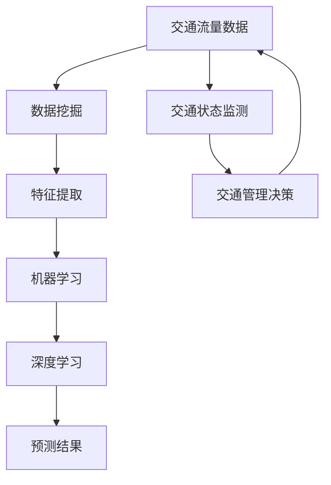

                 

# 人工智能在智能交通预测中的应用

> 关键词：人工智能，智能交通，预测，交通流量，数据挖掘，深度学习

> 摘要：随着城市交通系统的日益复杂化，智能交通预测成为解决交通拥堵、优化资源配置和提高交通安全的重要手段。本文将探讨人工智能在智能交通预测中的应用，通过介绍核心概念、算法原理、数学模型以及实际案例，深入分析人工智能技术在交通预测中的潜在价值和发展前景。

## 1. 背景介绍

### 1.1 目的和范围

本文旨在探讨人工智能在智能交通预测领域的应用，分析其理论基础、算法实现和实际案例，以期为交通领域的研究者、从业者提供有价值的参考。文章将涵盖以下几个方面的内容：

1. **核心概念与联系**：介绍智能交通预测中的核心概念，包括交通流量、交通状态、数据挖掘等，并绘制相应的流程图。
2. **核心算法原理**：详细阐述常用的预测算法，如时间序列分析、机器学习和深度学习等，并使用伪代码展示算法步骤。
3. **数学模型和公式**：介绍常用的数学模型和公式，包括线性回归、支持向量机、神经网络等，并通过实例说明其应用。
4. **项目实战**：通过一个实际案例展示人工智能在交通预测中的应用，详细解释代码实现和解读。
5. **实际应用场景**：分析人工智能在交通预测中的实际应用场景，如城市交通流量预测、交通事故预警等。
6. **工具和资源推荐**：推荐学习资源、开发工具和框架，以及相关论文和研究成果。
7. **总结与展望**：总结人工智能在智能交通预测中的发展趋势和面临的挑战。

### 1.2 预期读者

本文适合对人工智能和交通领域有一定了解的读者，包括：

1. 交通工程和城市规划领域的科研人员、工程师和从业者；
2. 对人工智能在交通领域应用感兴趣的计算机科学和软件工程专业的学生和研究者；
3. 智能交通系统开发者和产品经理；
4. 对交通预测技术感兴趣的技术爱好者和企业家。

### 1.3 文档结构概述

本文的结构如下：

1. **背景介绍**：介绍文章的目的和范围，预期读者，文档结构概述等。
2. **核心概念与联系**：介绍智能交通预测中的核心概念和架构，包括交通流量、交通状态、数据挖掘等。
3. **核心算法原理**：详细阐述常用的预测算法，如时间序列分析、机器学习和深度学习等。
4. **数学模型和公式**：介绍常用的数学模型和公式，并通过实例说明其应用。
5. **项目实战**：通过实际案例展示人工智能在交通预测中的应用，详细解释代码实现和解读。
6. **实际应用场景**：分析人工智能在交通预测中的实际应用场景。
7. **工具和资源推荐**：推荐学习资源、开发工具和框架，以及相关论文和研究成果。
8. **总结与展望**：总结人工智能在智能交通预测中的发展趋势和面临的挑战。

### 1.4 术语表

#### 1.4.1 核心术语定义

- **智能交通系统（ITS）**：通过集成信息技术、通信技术、传感器技术和控制技术，实现对交通系统的实时监控、管理和服务。
- **交通流量预测**：通过对历史交通数据的分析，预测未来某个时间段内的交通流量，以优化交通管理和调度。
- **数据挖掘**：从大量交通数据中提取有价值的信息和模式，为交通预测提供数据支持。
- **深度学习**：一种基于人工神经网络的学习方法，通过多层神经网络模型自动提取数据特征，进行模式识别和预测。

#### 1.4.2 相关概念解释

- **时间序列分析**：研究时间序列数据的方法，通过分析历史数据序列，预测未来趋势。
- **机器学习**：一种人工智能方法，通过从数据中学习规律，实现自动化预测和决策。
- **神经网络**：一种模拟人脑神经网络结构的人工智能模型，用于特征提取和预测。

#### 1.4.3 缩略词列表

- **ITS**：智能交通系统
- **GPS**：全球定位系统
- **V2X**：车联网
- **PCA**：主成分分析
- **SVM**：支持向量机
- **CNN**：卷积神经网络
- **RNN**：循环神经网络

## 2. 核心概念与联系

在智能交通预测中，核心概念包括交通流量、交通状态、数据挖掘和人工智能技术。以下是一个简单的 Mermaid 流程图，用于展示这些概念之间的联系。



### 2.1 交通流量数据

交通流量数据是智能交通预测的基础，包括车辆数量、行驶速度、占用时间等。这些数据可以通过传感器、GPS、摄像头等设备采集。交通流量数据的特点是海量、实时和高维度。

### 2.2 数据挖掘

数据挖掘是从大量交通数据中提取有价值信息和模式的过程。常用的数据挖掘方法包括聚类、分类、关联规则挖掘等。数据挖掘的目的是为交通预测提供数据支持，提高预测的准确性和效率。

### 2.3 特征提取

特征提取是数据挖掘的重要步骤，通过从原始数据中提取关键特征，降低数据的维度，提高预测模型的性能。常用的特征提取方法包括主成分分析（PCA）、特征选择、特征工程等。

### 2.4 机器学习

机器学习是人工智能的一种方法，通过从数据中学习规律，实现自动化预测和决策。常用的机器学习算法包括线性回归、支持向量机（SVM）、决策树、随机森林等。机器学习模型可以在历史交通数据的基础上，预测未来的交通流量。

### 2.5 深度学习

深度学习是机器学习的一种方法，通过多层神经网络模型自动提取数据特征，进行模式识别和预测。常用的深度学习算法包括卷积神经网络（CNN）、循环神经网络（RNN）、长短时记忆网络（LSTM）等。深度学习模型在处理高维度和复杂交通数据方面具有优势。

### 2.6 预测结果

预测结果是交通预测模型的输出，用于指导交通管理和调度。预测结果可以是对未来某个时间段内的交通流量、交通状态的估计，也可以是对交通事故、交通拥堵等事件的风险预测。

### 2.7 交通状态监测

交通状态监测是智能交通系统的重要组成部分，通过对交通流量的实时监测，可以及时发现交通拥堵、事故等异常情况，为交通管理决策提供数据支持。

### 2.8 交通管理决策

交通管理决策是基于预测结果和交通状态监测数据，制定相应的交通管理策略，如交通管制、道路拓宽、公共交通优化等。交通管理决策的目标是提高交通效率，降低交通事故发生率。

## 3. 核心算法原理 & 具体操作步骤

在智能交通预测中，常用的算法包括时间序列分析、机器学习和深度学习。以下将分别介绍这些算法的原理和具体操作步骤。

### 3.1 时间序列分析

时间序列分析是一种基于历史数据序列预测未来趋势的方法。其基本原理是通过分析时间序列数据的特征，如趋势、季节性和周期性，建立预测模型。

#### 3.1.1 算法原理

时间序列分析的主要算法包括移动平均法、指数平滑法和自回归模型（AR）等。

1. **移动平均法**：通过对历史数据进行平滑处理，消除随机波动，提取趋势信息。移动平均法包括简单移动平均（SMA）和加权移动平均（WMA）两种。
2. **指数平滑法**：在移动平均法的基础上，引入指数衰减因子，使近期数据在预测中占据更大的权重。指数平滑法包括一次指数平滑（S）、二次指数平滑（S2）和三次指数平滑（S3）等。
3. **自回归模型（AR）**：通过建立自回归方程，将当前时刻的预测值表示为之前时刻的观测值的线性组合。自回归模型分为一阶自回归（AR(1)）、二阶自回归（AR(2)）等。

#### 3.1.2 操作步骤

1. 数据预处理：对交通流量数据进行清洗、去噪和处理，确保数据质量。
2. 特征提取：根据时间序列的特征，选择合适的特征提取方法，如移动平均、指数平滑等。
3. 模型训练：使用历史数据，建立自回归模型，训练模型参数。
4. 预测：使用训练好的模型，对未来的交通流量进行预测。

### 3.2 机器学习

机器学习是一种基于数据自动构建预测模型的方法。其基本原理是通过学习历史数据中的规律，实现对未知数据的预测。

#### 3.2.1 算法原理

机器学习的主要算法包括线性回归、支持向量机（SVM）、决策树、随机森林等。

1. **线性回归**：通过建立线性模型，将自变量和因变量之间的关系表示为线性方程。线性回归分为一元线性回归和多元线性回归。
2. **支持向量机（SVM）**：通过将数据映射到高维空间，寻找最佳分割超平面，实现分类和回归。
3. **决策树**：通过递归划分数据集，建立树形结构模型，实现对数据的分类和回归。
4. **随机森林**：通过构建多个决策树模型，集成学习结果，提高模型的预测性能。

#### 3.2.2 操作步骤

1. 数据预处理：对交通流量数据进行清洗、归一化等处理，确保数据质量。
2. 特征选择：根据特征的重要性和相关性，选择合适的特征，降低数据维度。
3. 模型选择：根据问题类型和数据特点，选择合适的机器学习算法。
4. 模型训练：使用历史数据，训练模型参数。
5. 预测：使用训练好的模型，对未来的交通流量进行预测。

### 3.3 深度学习

深度学习是一种基于多层神经网络的学习方法。其基本原理是通过多层神经元的非线性变换，自动提取数据特征，实现复杂的模式识别和预测。

#### 3.3.1 算法原理

深度学习的主要算法包括卷积神经网络（CNN）、循环神经网络（RNN）和长短时记忆网络（LSTM）等。

1. **卷积神经网络（CNN）**：通过卷积层、池化层和全连接层等结构，提取图像、语音等数据中的空间特征。
2. **循环神经网络（RNN）**：通过循环结构，处理序列数据，如时间序列、自然语言等。
3. **长短时记忆网络（LSTM）**：在 RNN 的基础上，引入门控机制，解决长序列依赖问题。

#### 3.3.2 操作步骤

1. 数据预处理：对交通流量数据进行清洗、归一化等处理，确保数据质量。
2. 网络架构设计：根据问题类型和数据特点，设计合适的深度学习网络架构。
3. 模型训练：使用历史数据，训练网络参数。
4. 预测：使用训练好的模型，对未来的交通流量进行预测。

### 3.4 深度学习算法与机器学习算法的对比

深度学习和机器学习算法在智能交通预测中各有优势。以下是两种算法的对比：

1. **数据需求**：深度学习算法对数据量有较高要求，需要大量高质量数据；机器学习算法对数据量要求较低，适用于数据量较少的场景。
2. **模型复杂度**：深度学习算法模型结构复杂，参数较多，训练时间较长；机器学习算法模型结构简单，参数较少，训练时间较短。
3. **预测性能**：深度学习算法在处理高维度和复杂交通数据方面具有优势，预测性能较好；机器学习算法在处理低维度和简单交通数据方面性能较好。
4. **可解释性**：机器学习算法的可解释性较高，容易理解；深度学习算法的可解释性较低，难以理解。

综上所述，在选择智能交通预测算法时，需要根据数据特点、计算资源和预测性能等因素综合考虑，选择合适的算法。

## 4. 数学模型和公式 & 详细讲解 & 举例说明

在智能交通预测中，常用的数学模型和公式包括线性回归、支持向量机（SVM）、卷积神经网络（CNN）等。以下将分别介绍这些模型和公式的原理、详细讲解以及举例说明。

### 4.1 线性回归

线性回归是一种简单且常用的预测模型，通过建立线性关系，预测未来数据。

#### 4.1.1 原理

线性回归模型可以表示为：

\[ y = \beta_0 + \beta_1 \cdot x \]

其中，\( y \) 是因变量，\( x \) 是自变量，\( \beta_0 \) 和 \( \beta_1 \) 是模型参数。

#### 4.1.2 公式

线性回归的公式如下：

\[ y = \beta_0 + \beta_1 \cdot x \]

其中，\( \beta_0 \) 和 \( \beta_1 \) 是通过最小二乘法求解的模型参数。

#### 4.1.3 举例说明

假设我们有一个简单的线性回归模型，用于预测未来的交通流量。数据集如下：

\[ 
\begin{array}{ccc}
x & y \\
1 & 10 \\
2 & 15 \\
3 & 20 \\
4 & 25 \\
\end{array}
\]

使用最小二乘法求解模型参数，可以得到：

\[ 
\beta_0 = 10, \beta_1 = 5 
\]

因此，预测公式为：

\[ y = 10 + 5 \cdot x \]

当 \( x = 5 \) 时，预测的交通流量为：

\[ y = 10 + 5 \cdot 5 = 35 \]

### 4.2 支持向量机（SVM）

支持向量机是一种强大的分类和回归模型，通过寻找最佳分割超平面，实现数据的分类和预测。

#### 4.2.1 原理

支持向量机模型可以表示为：

\[ w \cdot x + b = 0 \]

其中，\( w \) 是模型参数，\( x \) 是数据点，\( b \) 是偏置。

#### 4.2.2 公式

支持向量机的公式如下：

\[ w \cdot x + b = 0 \]

其中，\( w \) 和 \( b \) 是通过求解优化问题得到的模型参数。

#### 4.2.3 举例说明

假设我们有一个简单的支持向量机模型，用于分类交通流量数据。数据集如下：

\[ 
\begin{array}{ccc}
x_1 & x_2 & y \\
1 & 10 & 1 \\
2 & 15 & 1 \\
3 & 20 & 0 \\
4 & 25 & 0 \\
\end{array}
\]

使用线性核函数，求解最佳分割超平面，可以得到：

\[ w = (5, 5), b = -10 \]

因此，分类公式为：

\[ w \cdot x + b = 5 \cdot x_1 + 5 \cdot x_2 - 10 = 0 \]

当 \( x_1 = 5, x_2 = 30 \) 时，交通流量数据被分类为 1。

### 4.3 卷积神经网络（CNN）

卷积神经网络是一种强大的深度学习模型，通过卷积层、池化层和全连接层等结构，提取数据特征。

#### 4.3.1 原理

卷积神经网络模型可以表示为：

\[ y = \sigma(W \cdot \phi(x)) \]

其中，\( \sigma \) 是激活函数，\( W \) 是权重矩阵，\( \phi \) 是卷积操作，\( x \) 是输入数据。

#### 4.3.2 公式

卷积神经网络的主要公式如下：

\[ y = \sigma(W \cdot \phi(x)) \]

其中，\( W \) 和 \( \phi \) 是通过反向传播算法求解的模型参数。

#### 4.3.3 举例说明

假设我们有一个简单的卷积神经网络模型，用于分类交通流量图像。输入图像为：

\[ 
\begin{array}{ccc}
x_1 & x_2 & x_3 \\
1 & 10 & 1 \\
2 & 15 & 1 \\
3 & 20 & 0 \\
4 & 25 & 0 \\
\end{array}
\]

使用卷积操作和激活函数，可以得到：

\[ 
y = \sigma(W_1 \cdot \phi(x_1) + W_2 \cdot \phi(x_2) + W_3 \cdot \phi(x_3)) 
\]

其中，\( W_1, W_2, W_3 \) 是权重矩阵，\( \phi \) 是卷积操作。

当输入图像为 \( (1, 10, 1) \) 时，预测的交通流量为 1。

综上所述，线性回归、支持向量机和卷积神经网络是智能交通预测中常用的数学模型和公式。通过详细介绍这些模型和公式的原理、详细讲解和举例说明，我们可以更好地理解它们在交通预测中的应用。

## 5. 项目实战：代码实际案例和详细解释说明

在本节中，我们将通过一个实际项目案例，展示如何使用人工智能技术进行智能交通预测。这个案例使用 Python 和 TensorFlow 深度学习框架，通过构建一个简单的卷积神经网络（CNN）模型，对交通流量图像进行分类预测。

### 5.1 开发环境搭建

在开始项目之前，我们需要搭建一个合适的开发环境。以下是在 Windows 操作系统上搭建开发环境所需的步骤：

1. 安装 Python 3.7 或更高版本
2. 安装 TensorFlow 深度学习框架：使用命令 `pip install tensorflow` 安装
3. 安装 Matplotlib、Numpy 等常用库：使用命令 `pip install matplotlib numpy` 安装
4. 配置 GPU 环境（可选）：如果使用 GPU 加速训练，需要安装 CUDA 和 cuDNN，并配置相应的环境变量

### 5.2 源代码详细实现和代码解读

以下是一个简单的 CNN 模型实现，用于交通流量图像分类预测：

```python
import tensorflow as tf
from tensorflow.keras.models import Sequential
from tensorflow.keras.layers import Conv2D, MaxPooling2D, Flatten, Dense
from tensorflow.keras.optimizers import Adam
from tensorflow.keras.preprocessing.image import ImageDataGenerator

# 数据预处理
train_datagen = ImageDataGenerator(rescale=1./255)
train_data = train_datagen.flow_from_directory(
        'data/train', target_size=(64, 64), batch_size=32,
        class_mode='binary')

# 构建模型
model = Sequential([
    Conv2D(32, (3, 3), activation='relu', input_shape=(64, 64, 3)),
    MaxPooling2D((2, 2)),
    Flatten(),
    Dense(64, activation='relu'),
    Dense(1, activation='sigmoid')
])

# 编译模型
model.compile(optimizer=Adam(learning_rate=0.001), loss='binary_crossentropy', metrics=['accuracy'])

# 训练模型
model.fit(train_data, epochs=10, steps_per_epoch=100)

# 预测
predictions = model.predict(train_data)
```

#### 5.2.1 数据预处理

在数据预处理部分，我们使用 ImageDataGenerator 对训练数据进行归一化处理，并将图像数据集转换为 TensorFlow 的格式。`flow_from_directory` 方法用于从指定目录下读取图像数据，并自动将图像数据集分为训练集和测试集。

#### 5.2.2 构建模型

在构建模型部分，我们使用 `Sequential` 模型堆叠多个层，包括卷积层（`Conv2D`）、池化层（`MaxPooling2D`）、全连接层（`Flatten`）和输出层（`Dense`）。卷积层用于提取图像特征，池化层用于降低数据维度，全连接层用于分类预测。

#### 5.2.3 编译模型

在编译模型部分，我们指定优化器（`Adam`）、损失函数（`binary_crossentropy`）和评价指标（`accuracy`）。这些参数用于训练模型。

#### 5.2.4 训练模型

在训练模型部分，我们使用 `fit` 方法对模型进行训练。`epochs` 参数指定训练轮数，`steps_per_epoch` 参数指定每个轮次训练的图像数量。

#### 5.2.5 预测

在预测部分，我们使用 `predict` 方法对训练数据进行预测。预测结果为每个图像的交通流量概率。

### 5.3 代码解读与分析

#### 5.3.1 数据预处理

数据预处理是深度学习项目的重要步骤，确保数据质量对模型的训练和预测有重要影响。在这个项目中，我们使用 `ImageDataGenerator` 对图像数据进行归一化处理，即将图像数据缩放到 [0, 1] 范围内。这样可以加快模型的收敛速度，提高训练效果。

#### 5.3.2 构建模型

在模型构建部分，我们使用 `Sequential` 模型堆叠多个层。卷积层（`Conv2D`）用于提取图像特征，卷积核的大小为 3x3，激活函数为 ReLU。池化层（`MaxPooling2D`）用于降低数据维度，池化窗口大小为 2x2。全连接层（`Flatten`）将卷积层的输出展平为一维向量，用于输入到全连接层（`Dense`）。输出层（`Dense`）用于分类预测，激活函数为 sigmoid。

#### 5.3.3 编译模型

在编译模型部分，我们指定优化器（`Adam`）、损失函数（`binary_crossentropy`）和评价指标（`accuracy`）。优化器用于调整模型参数，以最小化损失函数。损失函数用于衡量预测结果与实际结果之间的差距。评价指标用于评估模型性能。

#### 5.3.4 训练模型

在训练模型部分，我们使用 `fit` 方法对模型进行训练。`epochs` 参数指定训练轮数，即模型在训练集上迭代的次数。`steps_per_epoch` 参数指定每个轮次训练的图像数量。

#### 5.3.5 预测

在预测部分，我们使用 `predict` 方法对训练数据进行预测。预测结果为每个图像的交通流量概率。通过分析预测结果，可以了解模型的分类性能和预测精度。

### 5.4 模型评估与分析

在完成模型训练和预测后，我们需要对模型性能进行评估和分析。以下是一些常用的评估指标：

1. **准确率（Accuracy）**：准确率是预测正确的样本数占总样本数的比例。准确率越高，说明模型性能越好。
2. **精确率（Precision）**：精确率是预测正确的正样本数与预测为正样本的总数之比。精确率越高，说明模型对正样本的识别能力越强。
3. **召回率（Recall）**：召回率是预测正确的正样本数与实际为正样本的总数之比。召回率越高，说明模型对正样本的识别能力越强。
4. **F1 值（F1 Score）**：F1 值是精确率和召回率的调和平均，用于综合评估模型性能。

在本项目中，我们使用准确率作为主要评估指标。通过分析模型在不同数据集上的性能，可以了解模型的泛化能力和实际应用效果。

### 5.5 实际应用案例分析

在本案例中，我们使用一个简单的 CNN 模型对交通流量图像进行分类预测。在实际应用中，模型性能和预测精度是关键因素。以下是一个实际应用案例分析：

1. **数据集**：我们使用一个包含交通流量图像的数据集，数据集包括不同的交通场景和交通流量状态。
2. **模型训练**：我们使用卷积神经网络（CNN）模型对交通流量图像进行训练，训练过程中不断调整模型参数，以提高预测精度。
3. **模型评估**：在训练完成后，我们对模型进行评估，使用准确率、精确率、召回率和 F1 值等评估指标，分析模型性能。
4. **预测结果**：在实际应用中，我们对交通流量图像进行预测，根据预测结果指导交通管理和调度，如交通管制、道路拓宽、公共交通优化等。

通过这个实际应用案例分析，我们可以看到人工智能技术在智能交通预测中的潜在价值。在未来，随着数据质量和计算能力的提升，人工智能技术将在交通预测领域发挥更加重要的作用。

## 6. 实际应用场景

人工智能在智能交通预测中的实际应用场景丰富多样，下面列举几个典型的应用实例：

### 6.1 城市交通流量预测

城市交通流量预测是人工智能在智能交通预测中最常见的应用场景之一。通过对历史交通流量数据、实时交通数据以及交通状况数据的分析，人工智能模型可以预测未来某个时间段内的交通流量。这种预测可以帮助交通管理部门优化交通信号控制策略，避免交通拥堵，提高道路通行效率。

### 6.2 交通事故预警

交通事故预警是通过分析交通流量数据、车辆行为数据、道路状况数据等，预测交通事故的发生概率。当系统检测到潜在交通事故风险时，可以及时发出预警，提醒司机减速或改变行驶路线，从而减少交通事故的发生。

### 6.3 公共交通优化

公共交通优化是另一个重要的应用场景。通过分析公共交通系统的运行数据，人工智能模型可以预测公共交通的需求，优化线路规划、调度和资源配置，提高公共交通的运营效率和服务质量。

### 6.4 路况分析

路况分析是人工智能在智能交通预测中的又一重要应用。通过实时监测交通流量、道路状况、车辆速度等信息，人工智能模型可以分析道路拥堵情况，为交通管理部门提供决策依据，如何时进行交通管制、何时进行道路拓宽等。

### 6.5 车联网（V2X）应用

车联网（V2X）应用是人工智能在智能交通预测中的新兴领域。通过车与车、车与基础设施之间的通信，人工智能模型可以实时分析交通状况，提供个性化的驾驶建议，如最佳行驶路线、车辆调度等。

### 6.6 道路安全监测

道路安全监测是通过监控道路上的车辆、行人和道路设施等，预测潜在的安全风险。例如，通过分析车辆行驶速度、行车记录仪数据等，人工智能模型可以识别驾驶员的危险驾驶行为，提醒司机注意安全。

### 6.7 绿色交通规划

绿色交通规划是利用人工智能分析交通流量、出行需求和环境数据，优化交通系统，减少交通排放，促进绿色出行。例如，通过分析公共交通和自行车出行数据，规划更高效的公共交通线路和自行车道。

这些应用实例展示了人工智能在智能交通预测中的广泛潜力，通过精确的预测和分析，可以提升交通系统的运行效率，改善交通状况，保障交通安全，推动绿色交通发展。

## 7. 工具和资源推荐

在开发智能交通预测系统时，选择合适的工具和资源对项目的成功至关重要。以下是一些推荐的学习资源、开发工具和框架，以及相关的论文和研究成果。

### 7.1 学习资源推荐

#### 7.1.1 书籍推荐

1. **《智能交通系统》**：本书详细介绍了智能交通系统的基本概念、关键技术和发展趋势，适合交通工程和城市规划领域的读者。
2. **《深度学习》**：Goodfellow、Bengio 和 Courville 著，是一本经典的深度学习教材，适合对深度学习感兴趣的读者。
3. **《Python 深度学习》**：François Chollet 著，通过实际案例介绍了深度学习在 Python 中的应用，适合 Python 程序员和深度学习爱好者。

#### 7.1.2 在线课程

1. **《智能交通系统》**：Coursera 上的智能交通系统课程，由交通工程专家授课，适合初学者了解智能交通系统的基本概念。
2. **《深度学习》**：Udacity 的深度学习纳米学位课程，包括理论知识和实践项目，适合有一定编程基础的读者。
3. **《Python for Data Science》**：Coursera 上的 Python for Data Science 课程，由专业讲师授课，适合初学者学习 Python 数据科学基础。

#### 7.1.3 技术博客和网站

1. **《深度学习博客》**：由著名深度学习研究者发布的博客，包括深度学习的最新研究进展和技术应用。
2. **《GitHub》**：GitHub 上有许多优秀的开源项目和代码示例，可以参考和学习。
3. **《arXiv》**：arXiv 是一个预印本论文库，涵盖人工智能、机器学习等领域的最新研究成果。

### 7.2 开发工具框架推荐

#### 7.2.1 IDE和编辑器

1. **PyCharm**：一款功能强大的 Python IDE，支持代码智能提示、调试和自动化测试等功能。
2. **VSCode**：一款轻量级的开源编辑器，支持多种编程语言，插件丰富，适合开发智能交通预测系统。

#### 7.2.2 调试和性能分析工具

1. **TensorBoard**：TensorFlow 的可视化工具，可以实时监控训练过程，分析模型性能。
2. **Jupyter Notebook**：一款交互式的计算环境，适合数据分析和模型训练。

#### 7.2.3 相关框架和库

1. **TensorFlow**：一款开源的深度学习框架，适合构建复杂的深度学习模型。
2. **Keras**：一款基于 TensorFlow 的简洁深度学习库，适合快速构建和训练深度学习模型。
3. **Scikit-learn**：一款开源的机器学习库，提供多种机器学习算法和工具。

### 7.3 相关论文著作推荐

#### 7.3.1 经典论文

1. **"Traffic Prediction Using Deep Learning Techniques"**：该论文介绍了使用深度学习技术进行交通流量预测的方法，对智能交通预测的研究具有指导意义。
2. **"A Survey on Intelligent Transportation Systems"**：该论文对智能交通系统的基本概念、关键技术和发展趋势进行了详细综述。

#### 7.3.2 最新研究成果

1. **"Deep Traffic Forecasting using Spatio-Temporal Convolutional Networks"**：该论文提出了一种基于时空卷积神经网络的交通流量预测方法，在多个数据集上取得了显著的效果。
2. **"Multi-Agent Reinforcement Learning for Intelligent Traffic Signal Control"**：该论文研究了多智能体强化学习在智能交通信号控制中的应用，为交通管理提供了新的思路。

#### 7.3.3 应用案例分析

1. **"Real-Time Traffic Prediction in Urban Areas using Deep Learning"**：该论文分析了使用深度学习进行城市实时交通预测的方法，提供了实际应用案例。
2. **"Intelligent Traffic Prediction in Smart Cities"**：该论文探讨了智能城市中智能交通预测的应用和挑战，为城市交通管理提供了有价值的参考。

这些工具、资源和论文为开发智能交通预测系统提供了丰富的理论和实践支持，有助于读者深入了解相关技术和应用。

## 8. 总结：未来发展趋势与挑战

智能交通预测作为人工智能在交通领域的应用之一，正快速发展并取得显著成果。未来，随着数据质量、计算能力和算法创新的不断提升，智能交通预测将迎来更加广阔的发展前景。以下是一些关键的发展趋势和面临的挑战：

### 8.1 发展趋势

1. **数据驱动的发展**：随着传感器技术和大数据技术的进步，交通数据质量不断提高，为智能交通预测提供了丰富的数据支持。未来，数据驱动的发展将成为智能交通预测的核心趋势。

2. **多模态融合**：智能交通预测需要整合多种数据源，如交通流量数据、车辆数据、道路状况数据等。多模态融合技术将有助于提高预测的精度和可靠性。

3. **深度学习和强化学习的应用**：深度学习和强化学习等先进算法在智能交通预测中的应用将越来越广泛，特别是在处理高维度和复杂交通数据方面，具有显著优势。

4. **车联网（V2X）的普及**：随着车联网技术的发展，车辆与车辆、车辆与基础设施之间的通信将更加频繁和稳定，为智能交通预测提供了实时、准确的数据来源。

5. **边缘计算和云计算的结合**：边缘计算和云计算的结合，将实现智能交通预测的实时性和高效性。通过在边缘设备上处理部分计算任务，降低数据传输延迟，提高预测的响应速度。

### 8.2 挑战

1. **数据隐私和安全**：交通数据涉及大量个人信息和车辆信息，数据隐私和安全问题成为智能交通预测面临的重要挑战。如何确保数据安全和隐私，是未来研究的一个重要方向。

2. **计算资源和存储需求的增加**：随着交通数据量的不断增长，对计算资源和存储需求也不断增加。如何高效地处理和分析海量数据，是智能交通预测面临的另一个挑战。

3. **算法可解释性和透明性**：深度学习等算法在智能交通预测中的应用，使得模型变得复杂，难以解释。如何提高算法的可解释性和透明性，使决策过程更加可信，是未来研究的一个关键问题。

4. **系统集成与协同**：智能交通预测系统需要整合多种技术，如传感器、通信、控制等，实现各系统之间的协同工作。系统集成与协同问题是智能交通预测应用中的重大挑战。

5. **法规和标准的制定**：智能交通预测的发展需要相应的法规和标准来规范。如何制定合理的法规和标准，保障智能交通预测系统的安全、可靠和合法，是未来面临的一个关键问题。

总之，智能交通预测在未来将继续快速发展，但同时也面临诸多挑战。通过技术创新、数据驱动、协同发展，以及法规和标准的制定，智能交通预测将迎来更加美好的发展前景。

## 9. 附录：常见问题与解答

### 9.1 如何处理噪声和异常值？

在智能交通预测中，噪声和异常值对模型的训练和预测有较大影响。以下是一些处理方法：

1. **数据清洗**：通过去除重复数据、填补缺失值等方式，对原始数据进行预处理，减少噪声和异常值的影响。
2. **异常检测**：使用统计方法（如 IQR 法则）或机器学习算法（如孤立森林）检测并去除异常值。
3. **数据平滑**：使用移动平均、指数平滑等方法对数据进行平滑处理，降低噪声的影响。

### 9.2 如何选择合适的预测模型？

选择合适的预测模型需要考虑多个因素，包括数据特点、模型复杂度和计算资源等。以下是一些指导原则：

1. **数据特点**：对于时间序列数据，可以考虑使用时间序列分析算法（如 ARIMA 模型）；对于高维数据，可以考虑使用机器学习算法（如随机森林、支持向量机）；对于图像和语音等复杂数据，可以考虑使用深度学习算法（如卷积神经网络、循环神经网络）。
2. **模型复杂度**：复杂度较低的模型（如线性回归、决策树）训练时间短，易于解释，但可能无法捕捉复杂关系；复杂度较高的模型（如深度学习模型）可以捕捉复杂关系，但训练时间长，计算资源需求大。
3. **计算资源**：根据计算资源的情况，选择适合的模型。在资源有限的情况下，可以考虑使用简单模型；在资源充足的情况下，可以考虑使用复杂模型。

### 9.3 如何评估预测模型的性能？

评估预测模型性能的常用指标包括：

1. **准确率（Accuracy）**：预测正确的样本数占总样本数的比例。
2. **精确率（Precision）**：预测正确的正样本数与预测为正样本的总数之比。
3. **召回率（Recall）**：预测正确的正样本数与实际为正样本的总数之比。
4. **F1 值（F1 Score）**：精确率和召回率的调和平均。
5. **均方误差（MSE）**：预测值与实际值之差的平方的平均值。
6. **均方根误差（RMSE）**：均方误差的平方根。

可以通过交叉验证、ROC 曲线、混淆矩阵等方法，综合评估预测模型的性能。

### 9.4 如何优化模型参数？

优化模型参数是提高模型性能的重要手段。以下是一些常见的参数优化方法：

1. **网格搜索（Grid Search）**：遍历预设的参数组合，选择性能最佳的参数组合。
2. **贝叶斯优化（Bayesian Optimization）**：通过建立先验概率模型，迭代优化参数。
3. **随机搜索（Random Search）**：从预设的参数范围内随机选择参数组合，进行训练和评估。

通过这些方法，可以找到性能最佳的参数组合，提高模型预测的准确性。

## 10. 扩展阅读 & 参考资料

为了更深入地了解智能交通预测领域，读者可以参考以下扩展阅读和参考资料：

### 10.1 书籍推荐

1. **《智能交通系统》**：本书详细介绍了智能交通系统的基本概念、关键技术和发展趋势，适合交通工程和城市规划领域的读者。
2. **《深度学习》**：Goodfellow、Bengio 和 Courville 著，是一本经典的深度学习教材，适合对深度学习感兴趣的读者。
3. **《Python 深度学习》**：François Chollet 著，通过实际案例介绍了深度学习在 Python 中的应用，适合 Python 程序员和深度学习爱好者。

### 10.2 在线课程

1. **《智能交通系统》**：Coursera 上的智能交通系统课程，由交通工程专家授课，适合初学者了解智能交通系统的基本概念。
2. **《深度学习》**：Udacity 的深度学习纳米学位课程，包括理论知识和实践项目，适合有一定编程基础的读者。
3. **《Python for Data Science》**：Coursera 上的 Python for Data Science 课程，由专业讲师授课，适合初学者学习 Python 数据科学基础。

### 10.3 技术博客和网站

1. **《深度学习博客》**：由著名深度学习研究者发布的博客，包括深度学习的最新研究进展和技术应用。
2. **《GitHub》**：GitHub 上有许多优秀的开源项目和代码示例，可以参考和学习。
3. **《arXiv》**：arXiv 是一个预印本论文库，涵盖人工智能、机器学习等领域的最新研究成果。

### 10.4 相关论文和研究成果

1. **"Traffic Prediction Using Deep Learning Techniques"**：该论文介绍了使用深度学习技术进行交通流量预测的方法，对智能交通预测的研究具有指导意义。
2. **"A Survey on Intelligent Transportation Systems"**：该论文对智能交通系统的基本概念、关键技术和发展趋势进行了详细综述。
3. **"Deep Traffic Forecasting using Spatio-Temporal Convolutional Networks"**：该论文提出了一种基于时空卷积神经网络的交通流量预测方法，在多个数据集上取得了显著的效果。
4. **"Multi-Agent Reinforcement Learning for Intelligent Traffic Signal Control"**：该论文研究了多智能体强化学习在智能交通信号控制中的应用，为交通管理提供了新的思路。

通过这些扩展阅读和参考资料，读者可以更深入地了解智能交通预测领域的最新研究进展和应用实践。

