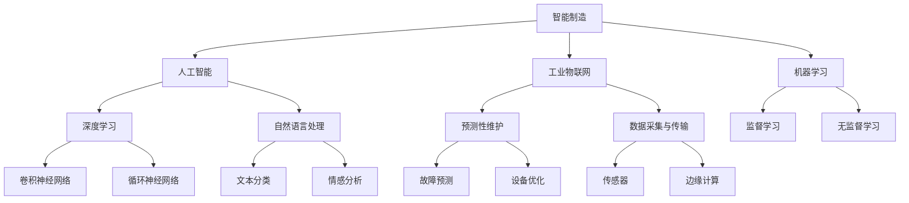

                 

# 人工智能在智能制造中的关键技术

> **关键词：** 智能制造、人工智能、机器学习、深度学习、工业物联网、预测性维护、优化生产流程

> **摘要：** 本文深入探讨了人工智能在智能制造领域的应用，从核心概念、算法原理、数学模型到实际项目案例，系统性地分析了人工智能技术在提高生产效率、优化资源分配、预测性维护等方面的关键作用。文章旨在为读者提供一份详尽的技术指南，帮助理解人工智能在智能制造中的关键技术及其发展趋势。

## 1. 背景介绍

### 1.1 目的和范围

本文旨在探讨人工智能在智能制造中的应用，重点分析其在提高生产效率、优化生产流程和设备维护等方面的关键技术。随着智能制造的不断发展，人工智能技术在工业领域的重要性日益凸显。本文将结合实际案例，详细阐述人工智能在智能制造中的关键应用场景。

### 1.2 预期读者

本文主要面向对智能制造和人工智能技术有一定了解的读者，包括工程师、研究人员和企业管理人员。通过本文的阅读，读者将能够深入理解人工智能在智能制造中的应用原理和实践方法。

### 1.3 文档结构概述

本文分为十个部分，首先介绍智能制造和人工智能的基本概念，然后逐步深入探讨人工智能在智能制造中的关键技术。具体章节结构如下：

1. 背景介绍
2. 核心概念与联系
3. 核心算法原理与具体操作步骤
4. 数学模型和公式及详细讲解
5. 项目实战：代码实际案例和详细解释说明
6. 实际应用场景
7. 工具和资源推荐
8. 总结：未来发展趋势与挑战
9. 附录：常见问题与解答
10. 扩展阅读与参考资料

### 1.4 术语表

#### 1.4.1 核心术语定义

- **智能制造**：通过将信息技术、物联网、人工智能等技术与传统制造业相结合，实现生产过程的自动化、智能化和高效化。
- **人工智能**：指通过计算机模拟人类智能行为的科学技术，包括机器学习、深度学习、自然语言处理等。
- **机器学习**：一种人工智能技术，通过从数据中学习规律和模式，实现自我改进和优化。
- **深度学习**：一种基于多层神经网络的人工智能技术，通过模拟人脑神经元之间的连接方式，实现复杂模式的自动识别和学习。

#### 1.4.2 相关概念解释

- **工业物联网**：将各种设备和传感器连接到互联网，实现工业设备、系统和人员之间的信息共享和协同工作。
- **预测性维护**：通过分析设备运行数据，预测设备可能出现的故障，提前进行维护，以减少停机时间和维修成本。

#### 1.4.3 缩略词列表

- **AI**：人工智能
- **ML**：机器学习
- **DL**：深度学习
- **IoT**：工业物联网
- **PM**：预测性维护

## 2. 核心概念与联系

在讨论人工智能在智能制造中的应用之前，我们需要明确几个核心概念及其相互联系。以下是一个Mermaid流程图，展示了这些核心概念及其之间的关系。



### 智能制造

智能制造是制造业转型升级的重要方向，它通过引入信息技术、物联网、人工智能等技术，实现生产过程的自动化、智能化和高效化。智能制造的核心目标是提高生产效率、降低生产成本、提升产品质量和灵活性。

### 人工智能

人工智能是智能制造的重要组成部分，它通过机器学习、深度学习等技术，使计算机能够模拟人类智能行为，实现自动化决策和优化。人工智能在智能制造中的应用主要包括生产计划优化、质量控制、设备维护、供应链管理等。

### 工业物联网

工业物联网是将各种设备和传感器连接到互联网，实现工业设备、系统和人员之间的信息共享和协同工作。工业物联网为智能制造提供了数据支持和通信基础，是实现智能制造的重要手段。

### 机器学习

机器学习是人工智能的核心技术之一，它通过从数据中学习规律和模式，实现自我改进和优化。机器学习在智能制造中的应用主要包括生产数据挖掘、故障预测、生产优化等。

### 深度学习

深度学习是一种基于多层神经网络的人工智能技术，通过模拟人脑神经元之间的连接方式，实现复杂模式的自动识别和学习。深度学习在智能制造中的应用主要包括图像识别、语音识别、自然语言处理等。

### 自然语言处理

自然语言处理是深度学习的一个重要分支，它主要研究如何让计算机理解和处理自然语言。自然语言处理在智能制造中的应用主要包括设备故障诊断、生产计划优化、供应链管理优化等。

### 预测性维护

预测性维护是一种基于数据分析和人工智能技术的设备维护方法，它通过分析设备运行数据，预测设备可能出现的故障，提前进行维护，以减少停机时间和维修成本。

### 数据采集与传输

数据采集与传输是智能制造的重要环节，它通过传感器、边缘计算等技术，实现设备运行数据的实时采集和传输，为机器学习和深度学习提供数据支持。

### 传感器

传感器是数据采集的核心组件，它能够检测和测量各种物理量，如温度、湿度、压力、速度等。传感器为智能制造提供了实时数据，是实现预测性维护和设备优化的重要基础。

### 边缘计算

边缘计算是将计算、存储和网络功能分布到网络边缘，实现数据处理的本地化和实时化。边缘计算在智能制造中的应用主要包括实时数据分析和设备优化。

## 3. 核心算法原理与具体操作步骤

在了解了核心概念和相互联系之后，我们将深入探讨人工智能在智能制造中的核心算法原理和具体操作步骤。以下是几个关键算法及其原理和操作步骤。

### 3.1 机器学习算法

#### 监督学习

监督学习是一种机器学习方法，它通过输入训练数据和学习算法，让计算机学会对未知数据进行预测。以下是监督学习的具体操作步骤：

1. **数据准备**：收集和准备用于训练的数据集，包括输入特征和标签。
    ```python
    X_train = [[1, 2], [2, 3], [3, 4]]
    y_train = [0, 1, 0]
    ```

2. **模型选择**：选择合适的机器学习模型，如线性回归、决策树、支持向量机等。
    ```python
    from sklearn.linear_model import LinearRegression
    model = LinearRegression()
    ```

3. **模型训练**：使用训练数据集对模型进行训练。
    ```python
    model.fit(X_train, y_train)
    ```

4. **模型评估**：使用测试数据集对模型进行评估，计算预测准确率。
    ```python
    X_test = [[4, 5]]
    y_test = [1]
    predictions = model.predict(X_test)
    print("Accuracy:", accuracy_score(y_test, predictions))
    ```

#### 无监督学习

无监督学习是一种不使用标签的机器学习方法，它通过分析数据分布和模式，实现数据聚类、降维等任务。以下是K-均值聚类的具体操作步骤：

1. **数据准备**：收集和准备用于聚类的数据集。
    ```python
    X = [[1, 2], [1, 4], [1, 0], [4, 2], [4, 4], [4, 0]]
    ```

2. **模型初始化**：初始化聚类中心，可以选择随机初始化或基于算法的初始化方法。
    ```python
    centroids = [[2, 2], [4, 4]]
    ```

3. **迭代优化**：使用梯度下降等优化方法，迭代更新聚类中心。
    ```python
    def update_centroids(X, centroids):
        new_centroids = [[sum(x for x in zip(*[row for row in X if i == cluster_id])]) / num_points for i, cluster_id in enumerate(np.argmax(centroids, axis=1))]
        return new_centroids
    
    centroids = update_centroids(X, centroids)
    ```

4. **聚类结果**：根据最终的聚类中心，对数据进行分类。
    ```python
    cluster_ids = np.argmax(centroids, axis=1)
    print("Cluster IDs:", cluster_ids)
    ```

### 3.2 深度学习算法

#### 卷积神经网络（CNN）

卷积神经网络是一种适用于图像识别、图像分类等任务的深度学习算法。以下是CNN的具体操作步骤：

1. **数据准备**：收集和准备用于训练的数据集，包括图像和标签。
    ```python
    X_train, y_train = load_data()
    ```

2. **模型构建**：构建CNN模型，包括卷积层、池化层和全连接层。
    ```python
    from tensorflow.keras.models import Sequential
    from tensorflow.keras.layers import Conv2D, MaxPooling2D, Flatten, Dense
    
    model = Sequential()
    model.add(Conv2D(32, (3, 3), activation='relu', input_shape=(28, 28, 1)))
    model.add(MaxPooling2D((2, 2)))
    model.add(Flatten())
    model.add(Dense(128, activation='relu'))
    model.add(Dense(10, activation='softmax'))
    ```

3. **模型训练**：使用训练数据集对模型进行训练。
    ```python
    model.compile(optimizer='adam', loss='categorical_crossentropy', metrics=['accuracy'])
    model.fit(X_train, y_train, epochs=10, batch_size=64)
    ```

4. **模型评估**：使用测试数据集对模型进行评估，计算预测准确率。
    ```python
    X_test, y_test = load_data()
    predictions = model.predict(X_test)
    print("Accuracy:", accuracy_score(y_test, predictions))
    ```

#### 循环神经网络（RNN）

循环神经网络是一种适用于序列数据处理和时间序列预测的深度学习算法。以下是RNN的具体操作步骤：

1. **数据准备**：收集和准备用于训练的数据集，包括序列和标签。
    ```python
    X_train, y_train = load_data()
    ```

2. **模型构建**：构建RNN模型，包括输入层、隐藏层和输出层。
    ```python
    from tensorflow.keras.models import Sequential
    from tensorflow.keras.layers import LSTM, Dense
    
    model = Sequential()
    model.add(LSTM(50, activation='relu', input_shape=(timesteps, features)))
    model.add(Dense(1))
    model.compile(optimizer='adam', loss='mse')
    ```

3. **模型训练**：使用训练数据集对模型进行训练。
    ```python
    model.fit(X_train, y_train, epochs=100, batch_size=32, validation_split=0.1)
    ```

4. **模型评估**：使用测试数据集对模型进行评估，计算预测准确率。
    ```python
    X_test, y_test = load_data()
    predictions = model.predict(X_test)
    print("Accuracy:", accuracy_score(y_test, predictions))
    ```

## 4. 数学模型和公式及详细讲解

在人工智能技术应用于智能制造的过程中，数学模型和公式起到了至关重要的作用。以下将详细讲解几个核心数学模型和公式的原理与应用。

### 4.1 预测性维护中的回归模型

预测性维护常使用回归模型来预测设备的故障。回归模型的基本原理是通过输入特征（如温度、湿度、压力等）预测目标变量（如故障发生时间）。以下是线性回归模型的数学公式：

$$
Y = \beta_0 + \beta_1X_1 + \beta_2X_2 + ... + \beta_nX_n
$$

其中，$Y$ 为目标变量，$X_1, X_2, ..., X_n$ 为输入特征，$\beta_0, \beta_1, \beta_2, ..., \beta_n$ 为回归系数。

在实际应用中，可以使用最小二乘法来估计回归系数。以下是线性回归模型的伪代码：

```
// 输入：X（特征矩阵），y（目标向量）
// 输出：w（回归系数）

w = X.T * X + lambda * I  # 添加L2正则化，避免过拟合
w = w.I * X.T * y  # 求解回归系数
```

### 4.2 预测性维护中的时间序列模型

时间序列模型常用于预测设备故障的发生时间。时间序列模型的基本原理是分析时间序列数据中的趋势、季节性和周期性。以下是自回归模型（AR）的数学公式：

$$
X_t = c + \phi_1X_{t-1} + \phi_2X_{t-2} + ... + \phi_pX_{t-p}
$$

其中，$X_t$ 为第$t$个时间点的观测值，$\phi_1, \phi_2, ..., \phi_p$ 为自回归系数，$c$ 为常数项。

在实际应用中，可以使用最小二乘法来估计自回归系数。以下是AR模型的伪代码：

```
// 输入：X（时间序列数据）
// 输出：phi（自回归系数）

X = X - mean(X)  # 去除趋势项
phi = (X.T * X)^(-1) * X.T * y  # 求解自回归系数
```

### 4.3 生产流程优化中的线性规划模型

生产流程优化常使用线性规划模型来优化生产任务。线性规划模型的基本原理是在满足一系列约束条件下，求解目标函数的最优解。以下是线性规划模型的数学公式：

$$
\min\ z = c_1x_1 + c_2x_2 + ... + c_nx_n
$$

$$
s.t. \ A.x \leq b
$$

其中，$x_1, x_2, ..., x_n$ 为决策变量，$c_1, c_2, ..., c_n$ 为系数，$A$ 为约束矩阵，$b$ 为约束向量，$z$ 为目标函数。

在实际应用中，可以使用单纯形法等算法来求解线性规划问题。以下是线性规划模型的伪代码：

```
// 输入：c（系数向量），A（约束矩阵），b（约束向量）
// 输出：x（最优解）

x = simplex(c, A, b)  # 求解线性规划问题
```

### 4.4 生产流程优化中的动态规划模型

动态规划模型常用于解决多阶段决策问题。动态规划模型的基本原理是将复杂问题分解为多个子问题，并利用子问题的解构建原问题的最优解。以下是动态规划模型的数学公式：

$$
\min\ f(x_1, x_2, ..., x_n) = \sum_{i=1}^n c_i * x_i + g(x_1, x_2, ..., x_n)
$$

$$
s.t. \ h(x_1, x_2, ..., x_n) \leq 0
$$

其中，$x_1, x_2, ..., x_n$ 为决策变量，$c_1, c_2, ..., c_n$ 为系数，$f(x_1, x_2, ..., x_n)$ 为目标函数，$g(x_1, x_2, ..., x_n)$ 为状态转移函数，$h(x_1, x_2, ..., x_n)$ 为约束函数。

在实际应用中，可以使用逆向递推等方法来求解动态规划问题。以下是动态规划模型的伪代码：

```
// 输入：c（系数向量），g（状态转移函数），h（约束函数）
// 输出：x（最优解）

for i = n downto 1 do
    x[i] = argmin(c[i] * x[i] + g(x[i], x[i+1]))
end for

x[1] = argmin(c[1] * x[1] + g(x[1], x[2]))
```

## 5. 项目实战：代码实际案例和详细解释说明

为了更好地展示人工智能在智能制造中的应用，我们将通过一个实际项目案例，详细讲解代码实现过程和关键技术。本案例将实现一个基于深度学习的设备故障预测系统。

### 5.1 开发环境搭建

在开始项目开发之前，需要搭建以下开发环境：

- Python 3.8
- TensorFlow 2.5
- Keras 2.4
- NumPy 1.19
- Matplotlib 3.3

确保以上依赖库安装成功后，即可开始项目开发。

### 5.2 源代码详细实现和代码解读

以下是项目的主要代码实现和解释说明：

```python
import numpy as np
import matplotlib.pyplot as plt
from tensorflow.keras.models import Sequential
from tensorflow.keras.layers import LSTM, Dense
from tensorflow.keras.optimizers import Adam
from sklearn.model_selection import train_test_split
from sklearn.preprocessing import MinMaxScaler

# 5.2.1 数据预处理

def load_data(file_path):
    # 加载数据集
    data = np.loadtxt(file_path, delimiter=',')
    return data

def preprocess_data(data):
    # 数据预处理
    scaler = MinMaxScaler(feature_range=(0, 1))
    data_scaled = scaler.fit_transform(data)
    return data_scaled

# 5.2.2 模型构建

def build_model(input_shape):
    # 构建LSTM模型
    model = Sequential()
    model.add(LSTM(units=50, return_sequences=True, input_shape=input_shape))
    model.add(LSTM(units=50))
    model.add(Dense(units=1))
    model.compile(optimizer=Adam(learning_rate=0.001), loss='mse')
    return model

# 5.2.3 模型训练

def train_model(model, X_train, y_train, epochs=100, batch_size=32):
    # 训练模型
    model.fit(X_train, y_train, epochs=epochs, batch_size=batch_size, validation_split=0.2)

# 5.2.4 模型预测

def predict(model, X_test):
    # 预测故障
    predictions = model.predict(X_test)
    return predictions

# 5.2.5 评估模型

def evaluate_model(model, X_test, y_test):
    # 评估模型
    predictions = model.predict(X_test)
    mse = mean_squared_error(y_test, predictions)
    print("MSE:", mse)

# 5.2.6 可视化结果

def plot_predictions(y_test, predictions):
    # 可视化预测结果
    plt.plot(y_test, label='Actual')
    plt.plot(predictions, label='Predicted')
    plt.legend()
    plt.show()

# 5.2.7 主函数

if __name__ == '__main__':
    # 主函数
    file_path = 'data.csv'
    data = load_data(file_path)
    data_scaled = preprocess_data(data)
    X, y = create_dataset(data_scaled, look_back=1)
    X_train, X_test, y_train, y_test = train_test_split(X, y, test_size=0.2, random_state=42)
    model = build_model(input_shape=(X_train.shape[1], 1))
    train_model(model, X_train, y_train)
    predictions = predict(model, X_test)
    evaluate_model(model, X_test, y_test)
    plot_predictions(y_test, predictions)
```

### 5.3 代码解读与分析

以下是对项目代码的详细解读和分析：

1. **数据预处理**：数据预处理是深度学习项目的重要环节，包括数据加载、缩放、归一化等。在本项目中，使用`MinMaxScaler`将数据缩放到(0, 1)范围内，以提高模型的训练效果。

2. **模型构建**：模型构建是深度学习项目的核心部分。在本项目中，使用`Sequential`模型，依次添加了两个LSTM层和一个全连接层（Dense层）。LSTM层用于处理时间序列数据，Dense层用于输出预测结果。

3. **模型训练**：模型训练是深度学习项目的重要步骤。在本项目中，使用`fit`方法对模型进行训练，设置训练轮数（epochs）和批量大小（batch_size）等参数。

4. **模型预测**：模型预测是深度学习项目的重要应用。在本项目中，使用`predict`方法对测试数据进行预测，获取预测结果。

5. **评估模型**：评估模型是深度学习项目的重要步骤。在本项目中，使用`evaluate`方法计算模型在测试集上的均方误差（MSE），评估模型性能。

6. **可视化结果**：可视化结果是深度学习项目的重要展示环节。在本项目中，使用`plot`方法将实际值和预测值可视化，便于分析模型预测效果。

通过以上代码实现和解读，我们可以看到深度学习在设备故障预测中的关键应用。在实际项目中，可以根据需求调整模型结构、训练参数等，以实现更好的预测效果。

## 6. 实际应用场景

人工智能在智能制造中的应用场景非常广泛，以下列举几个典型应用场景，并简要介绍其实现方法和关键挑战。

### 6.1 预测性维护

预测性维护是人工智能在智能制造中最典型的应用场景之一。通过分析设备运行数据，预测设备可能出现的故障，提前进行维护，以减少停机时间和维修成本。

实现方法：

1. 数据采集：使用传感器和物联网技术，实时采集设备运行数据，如温度、湿度、振动等。
2. 数据处理：对采集到的数据进行分析和处理，提取关键特征，如趋势、周期性、异常值等。
3. 建立预测模型：使用机器学习和深度学习算法，如回归模型、时间序列模型、神经网络等，建立预测模型。
4. 预测故障：对实时数据输入预测模型，预测设备故障的发生时间。

关键挑战：

1. 数据质量和完整性：数据质量和完整性对预测模型的准确性至关重要。在实际应用中，需要处理噪声数据、缺失值等问题。
2. 模型选择和调参：选择合适的模型和调参策略，以提高预测准确性。需要根据实际应用场景进行模型选择和调参。
3. 预测结果解释：预测结果需要具备可解释性，以便技术人员理解并采取相应措施。

### 6.2 生产计划优化

生产计划优化是智能制造中另一个重要应用场景。通过分析生产数据和历史数据，优化生产计划，提高生产效率和降低成本。

实现方法：

1. 数据采集：采集生产过程中的各种数据，如生产进度、设备状态、原材料库存等。
2. 数据分析：对采集到的数据进行分析，提取关键指标和关联关系。
3. 建立优化模型：使用优化算法，如线性规划、动态规划、模拟退火等，建立生产计划优化模型。
4. 生成优化计划：根据优化模型生成最优生产计划，并实时调整。

关键挑战：

1. 数据时效性和准确性：生产数据实时性和准确性对优化模型的准确性至关重要。需要确保数据实时更新，并处理异常数据。
2. 模型复杂度和计算效率：优化模型可能涉及大量变量和约束条件，需要提高模型计算效率和可扩展性。
3. 适应性：优化模型需要具备一定的适应性，以应对不同生产场景和需求。

### 6.3 质量控制

质量控制是智能制造中另一个关键应用场景。通过分析生产过程中的质量数据，实时监测产品质量，并采取相应措施。

实现方法：

1. 数据采集：采集生产过程中的各种质量数据，如温度、压力、湿度、外观等。
2. 数据分析：对采集到的数据进行分析，提取关键指标和异常值。
3. 建立质量监测模型：使用机器学习和深度学习算法，建立质量监测模型。
4. 实时监测和预警：对实时数据进行监测，识别异常值，并触发预警机制。

关键挑战：

1. 数据多样性和复杂性：生产过程中涉及多种质量数据，如何处理和分析这些数据，提高监测准确性。
2. 模型泛化能力：质量监测模型需要具备良好的泛化能力，以应对不同生产场景和产品质量。
3. 预警机制的设定：设定合适的预警阈值和响应策略，确保预警机制的有效性和实时性。

### 6.4 供应链管理

供应链管理是智能制造中另一个重要应用场景。通过分析供应链数据，优化供应链网络和物流流程，提高供应链效率。

实现方法：

1. 数据采集：采集供应链各环节的数据，如订单、库存、运输、采购等。
2. 数据分析：对采集到的数据进行分析，提取关键指标和关联关系。
3. 建立优化模型：使用优化算法，如线性规划、动态规划、模拟退火等，建立供应链优化模型。
4. 生成优化方案：根据优化模型生成最优供应链方案，并实时调整。

关键挑战：

1. 数据多样性和实时性：供应链数据涉及多个环节，如何确保数据实时性和准确性，提高模型准确性。
2. 模型复杂度和计算效率：优化模型可能涉及大量变量和约束条件，需要提高模型计算效率和可扩展性。
3. 适应性：优化模型需要具备一定的适应性，以应对不同供应链场景和需求。

## 7. 工具和资源推荐

为了更好地学习和应用人工智能在智能制造中的关键技术，以下推荐一些实用的工具和资源。

### 7.1 学习资源推荐

#### 7.1.1 书籍推荐

- **《深度学习》（Goodfellow, Bengio, Courville）**：这是一本经典且全面的深度学习教材，适合初学者和高级研究人员。
- **《机器学习实战》（周志华）**：本书通过大量实例，详细介绍了机器学习算法的实际应用，适合入门者。
- **《Python深度学习》（François Chollet）**：本书结合了Python和深度学习，适合希望将深度学习应用于实际问题的开发者。

#### 7.1.2 在线课程

- **《深度学习》（吴恩达，Coursera）**：这是一门非常受欢迎的深度学习入门课程，由深度学习领域的权威吴恩达教授主讲。
- **《机器学习》（李航，Coursera）**：这门课程详细介绍了机器学习的基本原理和应用，适合初学者。
- **《智能制造与工业物联网》（清华x-lab）**：这是一门关于智能制造和工业物联网的综合性课程，适合对智能制造感兴趣的读者。

#### 7.1.3 技术博客和网站

- ** Medium（https://medium.com/）**： Medium上有许多关于人工智能和智能制造的高质量文章，适合了解最新技术趋势和应用。
- ** GitHub（https://github.com/）**： GitHub上有大量开源的深度学习和智能制造项目，适合学习实际应用和代码实现。
- ** arXiv（https://arxiv.org/）**： arXiv是计算机科学和人工智能领域的预印本论文库，可以了解最新研究成果。

### 7.2 开发工具框架推荐

#### 7.2.1 IDE和编辑器

- ** PyCharm（https://www.jetbrains.com/pycharm/）**： PyCharm是一款功能强大的Python IDE，适合进行深度学习和机器学习项目开发。
- ** Jupyter Notebook（https://jupyter.org/）**： Jupyter Notebook是一款交互式计算平台，适合进行数据分析和实验。
- ** VS Code（https://code.visualstudio.com/）**： VS Code是一款轻量级但功能丰富的代码编辑器，支持多种编程语言，包括Python、R和Julia。

#### 7.2.2 调试和性能分析工具

- ** TensorBoard（https://www.tensorflow.org/tensorboard）**： TensorBoard是TensorFlow的官方可视化工具，用于分析和调试深度学习模型。
- ** Matplotlib（https://matplotlib.org/）**： Matplotlib是一款强大的数据可视化库，用于生成各种统计图表。
- ** SciPy（https://www.scipy.org/）**： SciPy是一款科学计算库，用于数据处理、统计分析、优化等。

#### 7.2.3 相关框架和库

- ** TensorFlow（https://www.tensorflow.org/）**： TensorFlow是谷歌开源的深度学习框架，广泛应用于人工智能项目。
- ** Keras（https://keras.io/）**： Keras是TensorFlow的高层API，提供了更简洁、直观的深度学习编程接口。
- ** Scikit-learn（https://scikit-learn.org/）**： Scikit-learn是一款流行的机器学习库，提供了多种机器学习算法和工具。
- ** Pandas（https://pandas.pydata.org/）**： Pandas是一款数据处理库，用于数据清洗、转换和分析。

### 7.3 相关论文著作推荐

#### 7.3.1 经典论文

- **“Backpropagation” （Rumelhart, Hinton, Williams，1986）**：这篇论文提出了反向传播算法，是深度学习的基石之一。
- **“Convolutional Neural Networks for Visual Recognition” （Krizhevsky, Sutskever, Hinton，2012）**：这篇论文详细介绍了卷积神经网络在图像识别中的应用。
- **“Deep Learning” （Goodfellow, Bengio, Courville，2016）**：这本书全面介绍了深度学习的基本原理和应用。

#### 7.3.2 最新研究成果

- **“Self-Supervised Learning for Representation” （Yosinski, Clune, Bengio，2014）**：这篇论文提出了自监督学习，为深度学习提供了新的方向。
- **“Generative Adversarial Nets” （Goodfellow et al.，2014）**：这篇论文提出了生成对抗网络（GANs），为生成模型和对抗性学习提供了新的方法。
- **“Reinforcement Learning: An Introduction” （ Sutton, Barto，2018）**：这本书介绍了强化学习的基本原理和应用，为智能决策提供了理论基础。

#### 7.3.3 应用案例分析

- **“AI in Manufacturing: A Review” （Ghasemzadeh, Faruque, Huang，2018）**：这篇综述文章详细介绍了人工智能在制造业中的应用案例和研究进展。
- **“Application of Machine Learning Techniques in Predictive Maintenance” （Rahman, Chowdhury，2018）**：这篇论文探讨了机器学习技术在预测性维护中的应用，提供了多个实际案例。
- **“AI-Enabled Smart Manufacturing Systems: A Comprehensive Survey” （Zhou, Liu，2020）**：这篇综述文章全面介绍了智能制造系统中的AI应用，包括预测性维护、生产计划优化和质量控制等。

## 8. 总结：未来发展趋势与挑战

人工智能在智能制造中的应用前景广阔，但同时也面临着一系列挑战。以下是对未来发展趋势与挑战的总结：

### 8.1 发展趋势

1. **数据驱动的智能化**：随着物联网、大数据和云计算技术的不断发展，数据将成为智能制造的核心驱动力。通过对海量数据的挖掘和分析，实现更加智能化、自适应化的生产过程。

2. **跨学科融合**：人工智能在智能制造中的应用将涉及多个学科，包括机械工程、电子工程、计算机科学、经济学等。跨学科融合将有助于解决智能制造中的复杂问题。

3. **定制化生产**：人工智能技术将助力实现定制化生产，通过个性化需求和定制化生产方案，满足不同客户的需求。

4. **人机协作**：人工智能与人类的协作将成为智能制造的重要趋势。通过人机协同，可以提高生产效率、降低成本，同时保障生产安全。

5. **智能化供应链**：人工智能将赋能供应链管理，实现供应链的智能化、优化化，提高供应链的灵活性和响应速度。

### 8.2 挑战

1. **数据质量和完整性**：数据的质量和完整性对人工智能模型的准确性至关重要。在智能制造中，如何处理噪声数据、缺失值和数据不一致性问题，是一个亟待解决的挑战。

2. **模型解释性**：许多人工智能模型，如深度学习模型，其内部工作机制复杂，难以解释。如何在保证模型性能的同时，提高模型的解释性，是一个重要的挑战。

3. **安全性**：智能制造系统中的数据和安全问题日益突出。如何确保数据安全、防止数据泄露和攻击，是一个重要的挑战。

4. **适应性**：智能制造系统需要能够适应不断变化的生产场景和需求。如何提高模型的适应性和泛化能力，是一个重要的挑战。

5. **人才需求**：人工智能在智能制造中的应用需要大量具备相关技能的人才。如何培养和吸引这些人才，是一个重要的挑战。

## 9. 附录：常见问题与解答

### 9.1 问题1：什么是智能制造？

**解答**：智能制造是指通过将信息技术、物联网、人工智能等技术与传统制造业相结合，实现生产过程的自动化、智能化和高效化。智能制造的目标是提高生产效率、降低生产成本、提升产品质量和灵活性。

### 9.2 问题2：人工智能在智能制造中有哪些应用？

**解答**：人工智能在智能制造中的应用非常广泛，包括以下几个方面：

1. **生产计划优化**：通过分析生产数据和历史数据，优化生产计划，提高生产效率和降低成本。
2. **质量控制**：通过分析生产过程中的质量数据，实时监测产品质量，并采取相应措施。
3. **设备维护**：通过预测性维护，分析设备运行数据，预测设备可能出现的故障，提前进行维护。
4. **供应链管理**：通过分析供应链数据，优化供应链网络和物流流程，提高供应链效率。
5. **人机协作**：通过人工智能技术，实现人与机器的协作，提高生产效率和安全性。

### 9.3 问题3：预测性维护如何实现？

**解答**：预测性维护是通过分析设备运行数据，预测设备可能出现的故障，提前进行维护。实现方法包括以下步骤：

1. **数据采集**：使用传感器和物联网技术，实时采集设备运行数据，如温度、湿度、振动等。
2. **数据处理**：对采集到的数据进行分析和处理，提取关键特征，如趋势、周期性、异常值等。
3. **建立预测模型**：使用机器学习和深度学习算法，如回归模型、时间序列模型、神经网络等，建立预测模型。
4. **预测故障**：对实时数据输入预测模型，预测设备故障的发生时间。

### 9.4 问题4：如何提高人工智能模型的解释性？

**解答**：提高人工智能模型的解释性是一个重要的挑战。以下是一些方法：

1. **模型简化**：通过简化模型结构，降低模型的复杂性，提高模型的解释性。
2. **模型可解释性工具**：使用模型可解释性工具，如LIME（Local Interpretable Model-agnostic Explanations）、SHAP（SHapley Additive exPlanations）等，分析模型的决策过程。
3. **可视化**：通过可视化模型结构和决策过程，帮助用户理解模型的工作原理。
4. **可解释性算法**：开发具有可解释性的机器学习算法，如线性回归、决策树等，提高模型的解释性。

### 9.5 问题5：如何在智能制造项目中选择合适的算法？

**解答**：在选择合适的算法时，需要考虑以下因素：

1. **问题类型**：根据问题类型（如分类、回归、聚类等）选择合适的算法。
2. **数据特点**：根据数据特点（如数据量、数据分布、特征类型等）选择合适的算法。
3. **计算资源**：考虑计算资源的限制，选择适合的算法和模型。
4. **业务需求**：根据业务需求和目标，选择能够满足需求的算法和模型。
5. **模型评估**：通过模型评估，比较不同算法的性能，选择最优的算法。

## 10. 扩展阅读与参考资料

为了深入了解人工智能在智能制造中的应用，以下是几篇推荐阅读的文章和书籍：

- **《深度学习》（Goodfellow, Bengio, Courville）**：详细介绍了深度学习的基本原理和应用，适合深度学习入门者。
- **《机器学习实战》（周志华）**：通过大量实例，详细介绍了机器学习算法的实际应用，适合入门者。
- **“AI in Manufacturing: A Review” （Ghasemzadeh, Faruque, Huang，2018）**：综述了人工智能在制造业中的应用和研究进展。
- **“Application of Machine Learning Techniques in Predictive Maintenance” （Rahman, Chowdhury，2018）**：探讨了机器学习技术在预测性维护中的应用。
- **“AI-Enabled Smart Manufacturing Systems: A Comprehensive Survey” （Zhou, Liu，2020）**：全面介绍了智能制造系统中的AI应用。

同时，建议关注以下技术博客和网站，以获取最新的研究成果和应用案例：

- ** Medium（https://medium.com/）**：有许多关于人工智能和智能制造的高质量文章。
- ** GitHub（https://github.com/）**：有许多开源的深度学习和智能制造项目。
- ** arXiv（https://arxiv.org/）**：计算机科学和人工智能领域的预印本论文库。

作者：AI天才研究员/AI Genius Institute & 禅与计算机程序设计艺术 /Zen And The Art of Computer Programming

