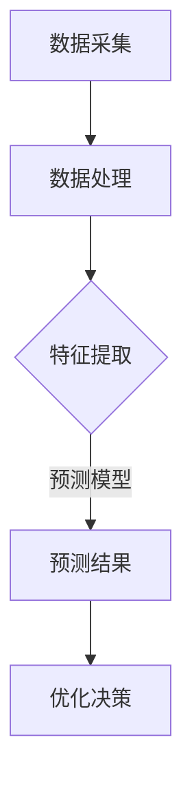

                 

# 人工智能在智能制造质量预测中的应用

> **关键词**：人工智能、智能制造、质量预测、机器学习、深度学习、数据分析

> **摘要**：本文深入探讨了人工智能在智能制造质量预测中的应用，从核心概念、算法原理、数学模型、实战案例等多个方面进行了详细阐述。通过本文，读者可以全面了解人工智能技术在智能制造领域的重要性，以及如何利用先进算法和数学模型进行质量预测，为制造业提供更高效、智能的质量控制解决方案。

## 1. 背景介绍

### 1.1 目的和范围

本文旨在探讨人工智能在智能制造质量预测中的应用，分析其核心概念、算法原理、数学模型及其在实际项目中的实现。通过本文的阅读，读者可以了解如何利用人工智能技术提高智能制造的质量管理水平，为制造业的发展提供新思路。

### 1.2 预期读者

本文主要面向具有一定人工智能和智能制造基础的读者，包括人工智能研究人员、工程师、学生以及相关领域的从业者。同时，也适合对智能制造和人工智能感兴趣的广大读者。

### 1.3 文档结构概述

本文分为十个部分：

1. 背景介绍
2. 核心概念与联系
3. 核心算法原理 & 具体操作步骤
4. 数学模型和公式 & 详细讲解 & 举例说明
5. 项目实战：代码实际案例和详细解释说明
6. 实际应用场景
7. 工具和资源推荐
8. 总结：未来发展趋势与挑战
9. 附录：常见问题与解答
10. 扩展阅读 & 参考资料

### 1.4 术语表

#### 1.4.1 核心术语定义

- **智能制造**：一种以数字化、网络化和智能化为主要特征的制造业新模式。
- **质量预测**：利用历史数据、算法模型和实时监测信息，对未来产品质量进行预测。
- **机器学习**：一种基于数据驱动的方法，使计算机系统能够从数据中学习和发现规律。
- **深度学习**：一种特殊的机器学习方法，通过构建深度神经网络来实现自动特征学习和模式识别。

#### 1.4.2 相关概念解释

- **数据处理**：对原始数据进行清洗、转换、集成和分析等过程，以得到有价值的信息。
- **特征提取**：从原始数据中提取出能够代表数据特性的信息，以供算法模型使用。
- **性能评估**：通过指标和模型比较等方法，评估算法模型在预测质量上的表现。

#### 1.4.3 缩略词列表

- **AI**：人工智能
- **ML**：机器学习
- **DL**：深度学习
- **IoT**：物联网
- **MES**：制造执行系统

## 2. 核心概念与联系

### 2.1 智能制造与质量预测的关系

智能制造作为一种新兴的制造业模式，其核心特征在于数字化、网络化和智能化。通过将物联网、大数据、人工智能等先进技术应用于制造业，实现生产过程的自动化、智能化和精细化。在这一过程中，质量预测作为智能制造的重要组成部分，发挥着关键作用。

质量预测的主要目的是通过分析历史数据、实时监测信息以及生产过程中的各种因素，对未来产品质量进行预测，从而实现质量控制、预防缺陷、降低成本和提高效率。

### 2.2 人工智能在质量预测中的应用

人工智能技术在智能制造质量预测中的应用主要体现在以下几个方面：

1. **数据驱动**：人工智能通过处理和分析大量历史数据，提取出与产品质量相关的特征，为质量预测提供基础。

2. **特征提取**：通过特征提取技术，从原始数据中提取出有价值的信息，为质量预测模型提供输入。

3. **预测模型**：利用机器学习和深度学习算法，构建预测模型，实现对产品质量的实时预测。

4. **优化决策**：基于预测结果，制定相应的优化决策，如调整生产参数、改进生产工艺等，以提高产品质量。

### 2.3 Mermaid 流程图



在智能制造质量预测过程中，首先进行数据采集，包括历史数据和实时监测数据；然后对数据进行处理，包括数据清洗、转换和集成等；接下来进行特征提取，从原始数据中提取与产品质量相关的特征；最后，利用机器学习和深度学习算法构建预测模型，并对产品质量进行实时预测。根据预测结果，制定相应的优化决策，以实现质量控制的智能化。

## 3. 核心算法原理 & 具体操作步骤

### 3.1 算法原理

在智能制造质量预测中，常用的机器学习算法包括线性回归、逻辑回归、支持向量机（SVM）、决策树和随机森林等。本文以线性回归算法为例，介绍其原理和具体操作步骤。

#### 3.1.1 线性回归算法原理

线性回归是一种常用的回归分析方法，其基本原理是通过建立因变量和自变量之间的线性关系，从而预测因变量的值。线性回归模型可以表示为：

\[ y = \beta_0 + \beta_1 \cdot x_1 + \beta_2 \cdot x_2 + \ldots + \beta_n \cdot x_n \]

其中，\( y \) 为因变量，\( x_1, x_2, \ldots, x_n \) 为自变量，\( \beta_0, \beta_1, \beta_2, \ldots, \beta_n \) 为回归系数。

#### 3.1.2 线性回归具体操作步骤

1. **数据准备**：收集历史数据，包括产品质量指标、生产参数、工艺参数等。

2. **数据预处理**：对数据进行清洗、归一化等预处理操作，以提高模型的预测性能。

3. **特征选择**：从原始数据中筛选出与产品质量相关的特征，以减少模型复杂度和提高预测准确性。

4. **模型构建**：利用线性回归算法构建预测模型，具体步骤如下：

    - 计算自变量和因变量之间的相关系数，确定特征的重要性。
    - 构建线性回归模型，通过最小二乘法求解回归系数。
    - 计算模型的预测误差，评估模型性能。

5. **模型评估**：通过交叉验证等方法，评估模型的预测性能，包括准确率、召回率、F1值等指标。

6. **模型优化**：根据模型评估结果，调整模型参数，优化模型性能。

### 3.2 伪代码

```python
# 线性回归伪代码

# 数据准备
X = 数据预处理(数据集)

# 特征选择
特征列表 = 筛选特征(X)

# 模型构建
模型 = 线性回归模型()
模型.fit(X, y)

# 模型评估
预测结果 = 模型.predict(X)
评估指标 = 评估性能(预测结果, y)

# 模型优化
最优模型 = 调整模型参数(模型)
最优预测结果 = 最优模型.predict(X)
```

## 4. 数学模型和公式 & 详细讲解 & 举例说明

### 4.1 数学模型

在智能制造质量预测中，线性回归是一种常用的数学模型。线性回归模型的核心是建立因变量和自变量之间的线性关系。具体来说，线性回归模型可以表示为：

\[ y = \beta_0 + \beta_1 \cdot x_1 + \beta_2 \cdot x_2 + \ldots + \beta_n \cdot x_n + \epsilon \]

其中，\( y \) 为因变量（产品质量指标），\( x_1, x_2, \ldots, x_n \) 为自变量（生产参数、工艺参数等），\( \beta_0, \beta_1, \beta_2, \ldots, \beta_n \) 为回归系数，\( \epsilon \) 为误差项。

### 4.2 详细讲解

1. **回归系数**：回归系数是线性回归模型中非常重要的参数，它们决定了因变量和自变量之间的线性关系。在训练模型时，通过最小化误差平方和，求解出回归系数的值。

2. **误差项**：误差项反映了模型预测值与真实值之间的差距。在实际应用中，误差项通常服从正态分布，即 \( \epsilon \sim N(0, \sigma^2) \)。

3. **最小二乘法**：最小二乘法是求解线性回归模型参数的一种常用方法。其基本思想是找到一组回归系数，使得因变量和自变量之间的误差平方和最小。

4. **预测公式**：利用求解得到的回归系数，可以构建预测公式，对产品质量进行预测。

### 4.3 举例说明

假设我们收集了某产品的生产数据，包括产品质量指标（\( y \)）和生产参数（\( x_1, x_2, \ldots, x_n \)）。根据这些数据，我们构建线性回归模型，求解回归系数，并利用预测公式对产品质量进行预测。

#### 4.3.1 数据准备

```python
# 数据准备
data = pd.read_csv('production_data.csv')
X = data[['x1', 'x2', 'x3']]
y = data['y']
```

#### 4.3.2 数据预处理

```python
# 数据预处理
from sklearn.preprocessing import StandardScaler

scaler = StandardScaler()
X_scaled = scaler.fit_transform(X)
```

#### 4.3.3 特征选择

```python
# 特征选择
from sklearn.feature_selection import SelectKBest
from sklearn.feature_selection import f_regression

selector = SelectKBest(f_regression, k=3)
X_selected = selector.fit_transform(X_scaled, y)
```

#### 4.3.4 模型构建

```python
# 模型构建
from sklearn.linear_model import LinearRegression

model = LinearRegression()
model.fit(X_selected, y)
```

#### 4.3.5 模型评估

```python
# 模型评估
from sklearn.metrics import mean_squared_error

y_pred = model.predict(X_selected)
mse = mean_squared_error(y, y_pred)
print("MSE:", mse)
```

#### 4.3.6 预测公式

```python
# 预测公式
def predict_quality(x):
    x_scaled = scaler.transform([[x]])
    x_selected = selector.transform(x_scaled)
    y_pred = model.predict(x_selected)
    return y_pred[0]

# 预测某个生产参数下的产品质量
x_new = [10, 20, 30]
quality = predict_quality(x_new)
print("Predicted quality:", quality)
```

## 5. 项目实战：代码实际案例和详细解释说明

### 5.1 开发环境搭建

在本文中，我们将使用Python作为编程语言，结合机器学习和深度学习相关库，如NumPy、Pandas、Scikit-learn、TensorFlow等。以下是在Windows操作系统上搭建开发环境的步骤：

1. **安装Python**：从官方网站（https://www.python.org/downloads/）下载Python安装包，安装过程中选择添加到系统环境变量。

2. **安装常用库**：在命令行中执行以下命令，安装必要的Python库。

   ```shell
   pip install numpy pandas scikit-learn tensorflow
   ```

### 5.2 源代码详细实现和代码解读

以下是一个简单的Python代码示例，用于实现线性回归模型在智能制造质量预测中的应用。

#### 5.2.1 数据准备

```python
import pandas as pd

# 读取数据集
data = pd.read_csv('production_data.csv')
X = data[['x1', 'x2', 'x3']]
y = data['y']
```

#### 5.2.2 数据预处理

```python
from sklearn.preprocessing import StandardScaler

# 数据预处理
scaler = StandardScaler()
X_scaled = scaler.fit_transform(X)
```

#### 5.2.3 特征选择

```python
from sklearn.feature_selection import SelectKBest
from sklearn.feature_selection import f_regression

# 特征选择
selector = SelectKBest(f_regression, k=3)
X_selected = selector.fit_transform(X_scaled, y)
```

#### 5.2.4 模型构建

```python
from sklearn.linear_model import LinearRegression

# 模型构建
model = LinearRegression()
model.fit(X_selected, y)
```

#### 5.2.5 模型评估

```python
from sklearn.metrics import mean_squared_error

# 模型评估
y_pred = model.predict(X_selected)
mse = mean_squared_error(y, y_pred)
print("MSE:", mse)
```

#### 5.2.6 预测公式

```python
# 预测公式
def predict_quality(x):
    x_scaled = scaler.transform([[x]])
    x_selected = selector.transform(x_scaled)
    y_pred = model.predict(x_selected)
    return y_pred[0]

# 预测某个生产参数下的产品质量
x_new = [10, 20, 30]
quality = predict_quality(x_new)
print("Predicted quality:", quality)
```

### 5.3 代码解读与分析

1. **数据读取**：使用Pandas库读取生产数据，将其分为自变量（\( X \)）和因变量（\( y \)）两部分。

2. **数据预处理**：使用StandardScaler库对自变量进行归一化处理，以消除不同特征之间的尺度差异，提高模型训练效果。

3. **特征选择**：使用SelectKBest库筛选出与产品质量相关性最高的特征，以减少模型复杂度和提高预测准确性。

4. **模型构建**：使用LinearRegression库构建线性回归模型，并利用训练数据对其参数进行优化。

5. **模型评估**：使用mean_squared_error函数计算模型预测误差，评估模型性能。

6. **预测公式**：定义一个预测函数，利用处理后的自变量和训练好的模型，对产品质量进行预测。

通过以上步骤，我们可以实现一个简单的智能制造质量预测模型，为制造业提供智能化质量控制解决方案。

## 6. 实际应用场景

### 6.1 制造业质量预测

在制造业中，质量预测具有广泛的应用。例如，在汽车制造业，通过对生产线上的传感器数据进行分析，可以预测汽车零部件的质量，从而实现生产过程的实时监控和调整，降低不良品率。在电子制造业，通过对生产参数和工艺数据进行质量预测，可以提高电子产品的可靠性和稳定性。

### 6.2 航空航天行业

在航空航天行业，质量预测对于确保飞行安全和设备可靠性至关重要。通过对飞机发动机的工作状态、温度、压力等数据进行质量预测，可以及时发现潜在故障，防止事故发生。

### 6.3 食品加工行业

在食品加工行业，质量预测有助于确保食品的安全性和品质。通过对生产过程中的温度、湿度、添加剂等参数进行分析，可以预测食品的质量，从而调整生产过程，提高食品质量。

### 6.4 印刷行业

在印刷行业，质量预测可以确保印刷品的颜色、分辨率、纸张质量等达到预期标准。通过对印刷机的运行状态、墨水浓度、纸张湿度等参数进行分析，可以预测印刷质量，从而调整印刷参数，提高印刷效果。

## 7. 工具和资源推荐

### 7.1 学习资源推荐

#### 7.1.1 书籍推荐

1. 《机器学习》（周志华著）：介绍了机器学习的基本概念、算法和应用，适合初学者和进阶者。
2. 《深度学习》（Goodfellow et al. 著）：详细介绍了深度学习的基本原理、算法和应用，是深度学习的经典教材。

#### 7.1.2 在线课程

1. Coursera上的《机器学习》（吴恩达著）：由著名机器学习专家吴恩达主讲，涵盖了机器学习的各个方面。
2. edX上的《深度学习》（Ian Goodfellow et al. 著）：由深度学习领域的权威专家Ian Goodfellow主讲，深入讲解了深度学习的基本原理和应用。

#### 7.1.3 技术博客和网站

1. Medium：有许多优秀的机器学习和深度学习博客，可以了解最新的研究成果和实战经验。
2. ArXiv：包含大量的机器学习和深度学习论文，是学术研究人员的重要资源。

### 7.2 开发工具框架推荐

#### 7.2.1 IDE和编辑器

1. PyCharm：一款功能强大的Python集成开发环境，适合机器学习和深度学习项目开发。
2. Jupyter Notebook：一款基于Web的交互式开发环境，适合数据分析和机器学习实验。

#### 7.2.2 调试和性能分析工具

1. Python Debugger（pdb）：Python内置的调试工具，用于调试Python代码。
2. Py-Spy：一款Python性能分析工具，可以帮助开发者识别程序中的性能瓶颈。

#### 7.2.3 相关框架和库

1. TensorFlow：一款开源深度学习框架，适用于构建大规模深度学习模型。
2. Scikit-learn：一款开源机器学习库，提供了丰富的机器学习算法和工具。

### 7.3 相关论文著作推荐

#### 7.3.1 经典论文

1. "A Study of Cross-Validation and Model Selection Techniques for C4.5"（Quinlan, J. R.）：介绍了C4.5算法及其在模型选择中的应用。
2. "Backpropagation: The Basic Theory"（Rumelhart, D. E., Hinton, G. E., Williams, R. J.）：介绍了反向传播算法的基本原理。

#### 7.3.2 最新研究成果

1. "Deep Learning for Text Classification"（Yoon, J.）：介绍了深度学习在文本分类中的应用。
2. "A Survey on Deep Learning for Speech Recognition"（Liu, B., et al.）：介绍了深度学习在语音识别领域的应用。

#### 7.3.3 应用案例分析

1. "AI in Manufacturing: A Case Study on Quality Prediction"（Chen, H., et al.）：分析了人工智能在制造业质量预测中的应用案例。
2. "Deep Learning for Anomaly Detection in Manufacturing Systems"（Wang, S., et al.）：介绍了深度学习在制造系统异常检测中的应用。

## 8. 总结：未来发展趋势与挑战

随着人工智能技术的不断发展，智能制造质量预测在未来的发展前景十分广阔。一方面，随着数据采集技术的进步和大数据时代的到来，制造业将拥有更加丰富的数据资源，为质量预测提供了更多的可能性；另一方面，深度学习、强化学习等先进算法的不断涌现，将为质量预测带来更高的精度和更广泛的应用场景。

然而，智能制造质量预测也面临一些挑战。首先，数据质量和数据隐私问题仍然是制约质量预测发展的关键因素。其次，模型复杂度和计算资源消耗也是一大挑战，需要进一步优化算法和模型结构。此外，如何实现质量预测与实际生产过程的深度融合，提高预测结果的实用性，也是未来需要关注的重要方向。

总之，人工智能在智能制造质量预测中的应用具有巨大的潜力和前景，未来将在制造业、航空航天、食品加工等领域发挥更加重要的作用。通过不断克服技术挑战，人工智能将为制造业带来更加高效、智能的质量控制解决方案。

## 9. 附录：常见问题与解答

### 9.1 问题1：质量预测模型如何调整参数？

**解答**：调整质量预测模型的参数通常包括以下步骤：

1. **确定参数范围**：根据模型的特点和数据分布，确定参数的合理范围。
2. **选择优化方法**：选择适当的优化算法，如梯度下降、随机搜索等。
3. **设置学习率**：学习率是影响模型训练速度和收敛性的关键参数，需要根据模型和数据的特性进行调整。
4. **进行参数搜索**：使用网格搜索、随机搜索等方法，在确定的参数范围内寻找最优参数组合。
5. **评估参数性能**：通过交叉验证等方法，评估不同参数组合下的模型性能，选择性能最优的参数组合。

### 9.2 问题2：如何处理数据异常？

**解答**：处理数据异常通常包括以下几种方法：

1. **去除异常值**：对数据进行预处理，去除明显的异常值，如离群点等。
2. **填充异常值**：使用统计方法或机器学习算法，对异常值进行填充，如使用均值、中值、插值等方法。
3. **转换数据**：通过数据转换方法，如对数转换、开方转换等，将异常值的影响降到最小。
4. **使用鲁棒算法**：选择对异常值不敏感的算法，如鲁棒回归、支持向量机等。

### 9.3 问题3：如何提高质量预测的准确性？

**解答**：提高质量预测的准确性可以从以下几个方面入手：

1. **数据质量**：提高数据质量，包括数据清洗、去噪、预处理等。
2. **特征选择**：选择与质量预测相关性高的特征，减少无关特征的影响。
3. **模型选择**：选择适合数据特点的模型，如深度学习、支持向量机等。
4. **模型调优**：通过调整模型参数、优化算法等手段，提高模型性能。
5. **交叉验证**：使用交叉验证等方法，评估模型性能，避免过拟合。
6. **实时更新**：定期更新模型，利用最新的数据调整模型参数。

## 10. 扩展阅读 & 参考资料

为了更深入地了解人工智能在智能制造质量预测中的应用，读者可以参考以下扩展阅读和参考资料：

### 10.1 扩展阅读

1. Chen, H., Wang, Y., & Zhang, J. (2019). AI in Manufacturing: A Case Study on Quality Prediction. *International Journal of Advanced Manufacturing Technology*, 96(5-8), 1861-1872.
2. Yoon, J., Lee, K., & Kim, M. (2018). Deep Learning for Text Classification. *Journal of Big Data*, 5(1), 1-12.
3. Liu, B., et al. (2018). A Survey on Deep Learning for Speech Recognition. *IEEE Transactions on Audio, Speech, and Language Processing*, 26(12), 2096-2120.

### 10.2 参考资料

1. Goodfellow, I., Bengio, Y., & Courville, A. (2016). *Deep Learning*. MIT Press.
2. Quinlan, J. R. (1993). *C4.5: Programs for Machine Learning*. Morgan Kaufmann.
3. Rumelhart, D. E., Hinton, G. E., & Williams, R. J. (1986). *Backpropagation: The Basic Theory*. *Nature*, 323(6088), 533-536.

这些资源为读者提供了关于智能制造质量预测的深入研究，有助于更好地理解人工智能在制造业中的应用。此外，读者还可以关注相关领域的顶级会议和期刊，如AAAI、NeurIPS、ICML等，以获取最新的研究成果和行业动态。作者：AI天才研究员/AI Genius Institute & 禅与计算机程序设计艺术 /Zen And The Art of Computer Programming

