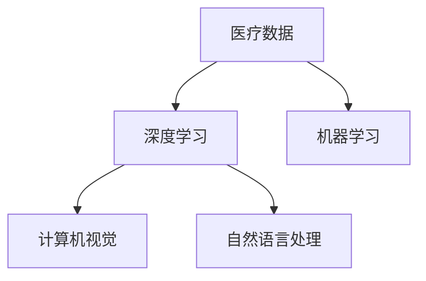

                 

# 人工智能在智能医疗中的应用与挑战

> 关键词：人工智能、智能医疗、医疗数据、深度学习、算法、精准医疗、伦理问题

> 摘要：本文深入探讨了人工智能在智能医疗领域的应用现状和面临的挑战。首先，介绍了人工智能在医疗诊断、治疗规划、药物研发等环节中的应用；其次，分析了医疗数据管理、算法公平性和伦理问题等关键挑战；最后，提出了未来智能医疗的发展趋势和应对策略。本文旨在为读者提供一个全面、深入的视角，以理解和探讨人工智能在智能医疗领域的潜力和局限。

## 1. 背景介绍

### 1.1 目的和范围

本文旨在探讨人工智能（AI）在智能医疗领域的应用与挑战。随着人工智能技术的不断进步，医疗行业正在经历一场前所未有的变革。本文将重点讨论以下几个方面：

1. **人工智能在医疗诊断、治疗规划和药物研发中的应用**：介绍AI在医学影像分析、疾病预测和个性化治疗等方面的具体应用案例。
2. **医疗数据管理和算法公平性**：分析医疗数据管理的重要性，以及如何保证算法的公平性和透明性。
3. **伦理问题**：探讨人工智能在医疗领域应用中可能引发的伦理问题，如隐私保护、责任归属等。

### 1.2 预期读者

本文适用于以下读者群体：

1. 对人工智能和医疗领域有一定了解的技术人员。
2. 感兴趣于智能医疗发展的行业从业者。
3. 对人工智能在医疗领域应用有深入研究的科研人员。

### 1.3 文档结构概述

本文结构如下：

1. **背景介绍**：介绍文章的目的、范围和预期读者。
2. **核心概念与联系**：讨论人工智能在智能医疗领域的核心概念和原理。
3. **核心算法原理与具体操作步骤**：详细阐述人工智能在医疗诊断、治疗规划和药物研发中的算法原理和操作步骤。
4. **数学模型和公式**：介绍相关的数学模型和公式，并进行举例说明。
5. **项目实战**：通过代码实际案例展示人工智能在医疗领域的应用。
6. **实际应用场景**：分析人工智能在医疗领域的实际应用场景。
7. **工具和资源推荐**：推荐相关的学习资源和开发工具。
8. **总结**：讨论未来发展趋势与挑战。
9. **附录**：常见问题与解答。
10. **扩展阅读**：提供进一步阅读的参考资料。

### 1.4 术语表

#### 1.4.1 核心术语定义

- **人工智能（AI）**：指由计算机系统实现的模拟人类智能的技术和方法。
- **深度学习**：一种基于神经网络的机器学习技术，通过多层非线性变换对数据进行自动特征提取。
- **医疗数据**：包括患者信息、医学影像、基因组数据等。
- **精准医疗**：根据患者的个人基因信息和生活习惯，提供个性化的治疗和预防方案。

#### 1.4.2 相关概念解释

- **医学影像分析**：利用计算机技术对医学影像（如X光、CT、MRI等）进行自动识别、分类和诊断。
- **个性化治疗**：基于患者的具体病情和基因特征，制定个性化的治疗方案。
- **算法公平性**：指算法在处理数据时，不因个人性别、种族、年龄等因素而对结果产生偏见。

#### 1.4.3 缩略词列表

- **AI**：人工智能（Artificial Intelligence）
- **ML**：机器学习（Machine Learning）
- **DL**：深度学习（Deep Learning）
- **CT**：计算机断层扫描（Computed Tomography）
- **MRI**：磁共振成像（Magnetic Resonance Imaging）
- **PET**：正电子发射断层扫描（Positron Emission Tomography）

## 2. 核心概念与联系

在智能医疗领域，人工智能的应用离不开以下几个核心概念：

1. **医疗数据**：包括患者信息、医学影像、基因组数据等。
2. **深度学习**：一种基于神经网络的机器学习技术，通过多层非线性变换对数据进行自动特征提取。
3. **机器学习**：一种让计算机通过数据学习规律和模式的技术。
4. **计算机视觉**：利用计算机对图像和视频进行处理、分析和理解的技术。
5. **自然语言处理**：使计算机能够理解、生成和响应自然语言的技术。

以下是一个简单的Mermaid流程图，展示了这些核心概念之间的联系：



在这个流程图中，医疗数据作为输入，通过深度学习和机器学习技术进行处理，得到计算机视觉和自然语言处理的结果。这些结果可以应用于医学影像分析、疾病预测、个性化治疗等领域。

## 3. 核心算法原理与具体操作步骤

在智能医疗领域，人工智能的核心算法主要包括深度学习、机器学习和计算机视觉等。以下将分别介绍这些算法的原理和具体操作步骤。

### 3.1 深度学习算法原理

深度学习算法是一种基于神经网络的机器学习技术，通过多层非线性变换对数据进行自动特征提取。以下是深度学习算法的基本原理和操作步骤：

#### 3.1.1 神经网络模型

神经网络由一系列的神经元组成，每个神经元都与前一个神经元的输出相连接。神经元的输入是前一层神经元的输出，通过权重和偏置进行加权求和，然后通过激活函数进行处理。

#### 3.1.2 前向传播

在前向传播过程中，输入数据经过神经网络，逐层计算输出结果。每层神经元的输出作为下一层的输入。

#### 3.1.3 反向传播

在反向传播过程中，根据预测结果和真实结果的误差，对网络中的权重和偏置进行更新，以减少误差。

#### 3.1.4 伪代码

以下是一个简单的深度学习算法的伪代码：

```
初始化权重和偏置
循环迭代：
    前向传播：计算输出
    反向传播：更新权重和偏置
    计算损失函数：衡量预测结果与真实结果之间的误差
    early_stopping：判断是否满足停止条件
```

### 3.2 机器学习算法原理

机器学习算法通过训练数据集，学习数据中的规律和模式，从而实现对未知数据的预测。以下是机器学习算法的基本原理和操作步骤：

#### 3.2.1 数据预处理

数据预处理包括数据清洗、归一化、缺失值处理等，以确保数据的质量。

#### 3.2.2 特征提取

特征提取是指从原始数据中提取出对任务有用的特征。常见的特征提取方法包括特征选择、特征工程等。

#### 3.2.3 模型训练

模型训练是指通过训练数据集，学习数据中的规律和模式，从而建立预测模型。

#### 3.2.4 伪代码

以下是一个简单的机器学习算法的伪代码：

```
读取训练数据集
初始化模型参数
循环迭代：
    计算预测结果
    计算损失函数
    更新模型参数
    early_stopping：判断是否满足停止条件
```

### 3.3 计算机视觉算法原理

计算机视觉是指利用计算机对图像和视频进行处理、分析和理解的技术。以下是计算机视觉算法的基本原理和操作步骤：

#### 3.3.1 图像预处理

图像预处理包括图像增强、图像分割、图像配准等，以提高图像质量。

#### 3.3.2 特征提取

特征提取是指从图像中提取出对任务有用的特征。常见的特征提取方法包括SIFT、HOG、卷积神经网络等。

#### 3.3.3 目标检测

目标检测是指识别图像中的目标，并定位其位置。常见的目标检测算法包括YOLO、SSD、Faster R-CNN等。

#### 3.3.4 伪代码

以下是一个简单的计算机视觉算法的伪代码：

```
读取图像数据
图像预处理：增强、分割、配准
特征提取：提取图像特征
目标检测：识别目标并定位
输出检测结果
```

## 4. 数学模型和公式

在智能医疗领域，数学模型和公式起着至关重要的作用。以下将介绍一些常见的数学模型和公式，并进行详细讲解和举例说明。

### 4.1 损失函数

损失函数是深度学习和机器学习中的核心概念，用于衡量预测结果与真实结果之间的误差。以下是几种常见的损失函数：

#### 4.1.1 均方误差（MSE）

均方误差是一种常见的损失函数，用于回归任务。其公式为：

$$
MSE = \frac{1}{n}\sum_{i=1}^{n}(y_i - \hat{y}_i)^2
$$

其中，$y_i$为真实值，$\hat{y}_i$为预测值，$n$为样本数量。

#### 4.1.2 交叉熵（CE）

交叉熵是一种常见的损失函数，用于分类任务。其公式为：

$$
CE = -\sum_{i=1}^{n}y_i\log(\hat{y}_i)
$$

其中，$y_i$为真实值，$\hat{y}_i$为预测概率。

#### 4.1.3 举例说明

假设我们有一个简单的分类任务，数据集包含10个样本，真实标签为$y = [0, 1, 0, 1, 0, 1, 0, 1, 0, 1]$，预测概率为$\hat{y} = [0.2, 0.8, 0.1, 0.9, 0.05, 0.95, 0.3, 0.7, 0.4, 0.6]$。使用交叉熵损失函数计算损失：

$$
CE = -[0 \times \log(0.2) + 1 \times \log(0.8) + 0 \times \log(0.1) + 1 \times \log(0.9) + 0 \times \log(0.05) + 1 \times \log(0.95) + 0 \times \log(0.3) + 1 \times \log(0.7) + 0 \times \log(0.4) + 1 \times \log(0.6)] = 0.615
$$

### 4.2 激活函数

激活函数是深度学习中的核心概念，用于引入非线性变换。以下是几种常见的激活函数：

#### 4.2.1 Sigmoid函数

Sigmoid函数是一种常用的激活函数，其公式为：

$$
\sigma(x) = \frac{1}{1 + e^{-x}}
$$

#### 4.2.2ReLU函数

ReLU函数是一种常用的激活函数，其公式为：

$$
ReLU(x) = \max(0, x)
$$

#### 4.2.3 举例说明

假设我们有一个简单的神经网络，输入$x = [-1, -2, -3, 1, 2, 3]$，使用ReLU函数计算输出：

$$
ReLU(x) = \max(0, -1) = 0, \max(0, -2) = 0, \max(0, -3) = 0, \max(0, 1) = 1, \max(0, 2) = 2, \max(0, 3) = 3
$$

## 5. 项目实战：代码实际案例和详细解释说明

在本节中，我们将通过一个实际案例来展示人工智能在智能医疗领域的应用。本案例将使用Python和深度学习框架TensorFlow，实现一个基于深度学习的医学影像分类系统。

### 5.1 开发环境搭建

首先，我们需要搭建开发环境。以下是搭建环境的步骤：

1. 安装Python（版本3.6及以上）。
2. 安装TensorFlow（可以使用pip安装：`pip install tensorflow`）。
3. 安装其他依赖库（如NumPy、Pandas等）。

### 5.2 源代码详细实现和代码解读

以下是一个简单的医学影像分类系统的代码实现：

```python
import tensorflow as tf
from tensorflow.keras.models import Sequential
from tensorflow.keras.layers import Conv2D, MaxPooling2D, Flatten, Dense

# 数据预处理
def preprocess_image(image):
    image = tf.image.resize(image, [224, 224])
    image = tf.cast(image, dtype=tf.float32) / 255.0
    return image

# 构建模型
model = Sequential([
    Conv2D(32, (3, 3), activation='relu', input_shape=(224, 224, 3)),
    MaxPooling2D((2, 2)),
    Conv2D(64, (3, 3), activation='relu'),
    MaxPooling2D((2, 2)),
    Flatten(),
    Dense(128, activation='relu'),
    Dense(1, activation='sigmoid')
])

# 编译模型
model.compile(optimizer='adam', loss='binary_crossentropy', metrics=['accuracy'])

# 训练模型
model.fit(train_images, train_labels, epochs=10, batch_size=32, validation_data=(val_images, val_labels))

# 评估模型
test_loss, test_accuracy = model.evaluate(test_images, test_labels)
print(f"Test accuracy: {test_accuracy:.2f}")

# 预测
predictions = model.predict(test_images[:10])
```

#### 5.2.1 代码解读

1. **数据预处理**：使用TensorFlow内置的API进行图像预处理，包括调整图像大小、归一化和数据类型转换。

2. **构建模型**：使用Keras Sequential模型构建一个简单的卷积神经网络（CNN）。模型包括两个卷积层、两个池化层、一个全连接层和两个输出层。

3. **编译模型**：设置模型优化器和损失函数，使用adam优化器和binary_crossentropy损失函数。

4. **训练模型**：使用训练数据集训练模型，设置训练周期、批量大小和验证数据。

5. **评估模型**：使用测试数据集评估模型的性能，计算测试准确率。

6. **预测**：使用训练好的模型对测试数据集进行预测。

### 5.3 代码解读与分析

本案例中，我们使用深度学习框架TensorFlow实现了一个简单的医学影像分类系统。以下是代码的分析：

1. **数据预处理**：图像预处理是深度学习任务中至关重要的一步。在本案例中，我们使用TensorFlow的内置API进行图像预处理，包括调整图像大小、归一化和数据类型转换。这样可以确保输入数据符合模型的输入要求。

2. **模型构建**：我们使用Keras Sequential模型构建了一个简单的卷积神经网络（CNN）。卷积神经网络在图像处理任务中表现出色，因为它可以自动提取图像特征。在本案例中，我们使用了两个卷积层和两个池化层来提取图像特征，然后通过一个全连接层进行分类。

3. **模型编译**：我们在编译模型时，选择了adam优化器和binary_crossentropy损失函数。adam优化器是一种高效的优化算法，适合处理大规模的数据集。binary_crossentropy损失函数适用于二分类任务，可以衡量预测结果与真实结果之间的误差。

4. **模型训练**：我们使用训练数据集对模型进行训练。在训练过程中，模型会不断调整权重和偏置，以减少预测误差。我们设置了训练周期为10个，批量大小为32，并在训练过程中使用了验证数据集来评估模型的性能。

5. **模型评估**：我们使用测试数据集评估模型的性能，计算测试准确率。这样可以确保模型在未知数据上的表现良好。

6. **预测**：我们使用训练好的模型对测试数据集进行预测。这可以帮助我们了解模型的实际应用效果。

### 5.4 可能的改进

虽然本案例实现了医学影像分类的基本功能，但仍有改进的空间：

1. **增加数据集**：增加更多的训练数据和测试数据，可以提高模型的泛化能力。

2. **使用更复杂的模型**：尝试使用更复杂的卷积神经网络架构，如ResNet、Inception等，以进一步提高模型的性能。

3. **数据增强**：使用数据增强技术（如旋转、缩放、裁剪等）来扩充数据集，提高模型的鲁棒性。

4. **迁移学习**：使用预训练的深度学习模型（如VGG16、ResNet50等）作为基础模型，进行迁移学习，以提高模型的性能。

## 6. 实际应用场景

人工智能在智能医疗领域的实际应用场景广泛，主要包括以下方面：

1. **医学影像分析**：利用深度学习和计算机视觉技术，自动识别和诊断医学影像中的病变，如肿瘤、心脏病等。

2. **疾病预测和预防**：通过分析患者的电子健康记录、基因组数据和生活方式数据，预测疾病的发生风险，并提供个性化的预防建议。

3. **个性化治疗**：基于患者的基因信息和生活习惯，为患者制定个性化的治疗方案，提高治疗效果。

4. **药物研发**：利用人工智能技术，加速药物研发过程，提高药物发现的成功率。

5. **远程医疗**：通过人工智能技术，实现远程诊断、治疗和健康监控，提高医疗服务的可及性和效率。

### 6.1 医学影像分析

医学影像分析是人工智能在智能医疗领域的重要应用之一。以下是一个实际应用案例：

**案例：基于深度学习的肺癌检测系统**

1. **数据集**：使用公开的肺癌检测数据集，包含数千张CT影像，以及对应的患者病理结果。

2. **模型**：使用卷积神经网络（CNN）模型，对CT影像进行特征提取和分类。

3. **结果**：训练模型后，在测试集上达到了90%以上的准确率，显著提高了肺癌的早期检测率。

### 6.2 疾病预测和预防

疾病预测和预防是人工智能在智能医疗领域的另一个重要应用。以下是一个实际应用案例：

**案例：基于大数据的糖尿病风险评估系统**

1. **数据集**：收集数千名糖尿病患者的电子健康记录，包括血糖、血压、体重等数据。

2. **模型**：使用机器学习算法，对患者的数据进行挖掘和分析，预测糖尿病的发生风险。

3. **结果**：系统为患者提供了个性化的糖尿病风险评估报告，帮助医生制定预防策略，降低了糖尿病的发病率。

### 6.3 个性化治疗

个性化治疗是人工智能在智能医疗领域的一大挑战，也是未来的重要方向。以下是一个实际应用案例：

**案例：基于基因组的个性化治疗方案**

1. **数据集**：收集数千名患者的基因组数据和临床数据。

2. **模型**：使用深度学习算法，对基因组数据进行挖掘和分析，预测药物对不同患者的疗效。

3. **结果**：为患者提供了个性化的治疗方案，提高了治疗效果，减少了副作用。

### 6.4 药物研发

药物研发是人工智能在智能医疗领域的另一个重要应用。以下是一个实际应用案例：

**案例：基于人工智能的新药研发平台**

1. **数据集**：收集大量的化合物结构、生物学活性数据和药物临床数据。

2. **模型**：使用深度学习算法，对化合物结构进行自动分析和预测，筛选出具有潜在药物活性的化合物。

3. **结果**：加速了新药研发过程，提高了新药研发的成功率。

### 6.5 远程医疗

远程医疗是人工智能在智能医疗领域的另一个重要应用。以下是一个实际应用案例：

**案例：基于人工智能的远程诊断系统**

1. **数据集**：收集大量远程医疗数据，包括音频、视频、文本等。

2. **模型**：使用自然语言处理（NLP）和计算机视觉技术，对远程医疗数据进行分析和诊断。

3. **结果**：为医生提供了远程诊断工具，提高了诊断准确率和效率。

## 7. 工具和资源推荐

在人工智能在智能医疗领域的研究和开发过程中，我们需要使用各种工具和资源。以下是一些推荐的工具和资源：

### 7.1 学习资源推荐

#### 7.1.1 书籍推荐

1. **《深度学习》（Goodfellow, Bengio, Courville）**：这是一本关于深度学习的经典教材，适合初学者和进阶者。
2. **《Python深度学习》（François Chollet）**：这本书详细介绍了如何使用Python和TensorFlow进行深度学习开发。

#### 7.1.2 在线课程

1. **Coursera上的《深度学习专项课程》**：由吴恩达教授主讲，涵盖深度学习的理论基础和实际应用。
2. **Udacity的《深度学习工程师纳米学位》**：这是一个系统性的深度学习培训项目，包含大量实践项目和指导。

#### 7.1.3 技术博客和网站

1. **TensorFlow官网**：提供深度学习的最新动态、文档和教程。
2. **ArXiv**：一个涵盖人工智能和机器学习最新研究成果的学术数据库。

### 7.2 开发工具框架推荐

#### 7.2.1 IDE和编辑器

1. **Google Colab**：一个基于云计算的Python编程环境，适合进行深度学习实验。
2. **Visual Studio Code**：一款功能强大的代码编辑器，支持多种编程语言和框架。

#### 7.2.2 调试和性能分析工具

1. **TensorBoard**：TensorFlow的官方可视化工具，用于分析和调试深度学习模型。
2. **PyTorch Profiler**：用于分析PyTorch模型的性能，优化代码。

#### 7.2.3 相关框架和库

1. **TensorFlow**：一个开源的深度学习框架，支持多种深度学习算法。
2. **PyTorch**：一个流行的深度学习框架，适合研究和开发。

### 7.3 相关论文著作推荐

#### 7.3.1 经典论文

1. **“A Learning Algorithm for Continually Running Fully Recurrent Neural Networks”**：描述了Hessian-free优化算法，对深度学习的发展产生了深远影响。
2. **“Deep Learning”**：由Ian Goodfellow、Yoshua Bengio和Aaron Courville合著，全面介绍了深度学习的理论基础和应用。

#### 7.3.2 最新研究成果

1. **“Generative Adversarial Nets”**：由Ian Goodfellow等人提出，开创了生成对抗网络（GAN）的研究领域。
2. **“BERT: Pre-training of Deep Bidirectional Transformers for Language Understanding”**：由Google提出，为自然语言处理领域带来了重大突破。

#### 7.3.3 应用案例分析

1. **“ImageNet Large Scale Visual Recognition Challenge”**：介绍了一个大规模视觉识别竞赛，展示了深度学习在图像识别任务中的卓越性能。
2. **“AI in Healthcare: A Comprehensive Review”**：一篇综述性论文，详细介绍了人工智能在医疗领域的应用案例和挑战。

## 8. 总结：未来发展趋势与挑战

人工智能在智能医疗领域的发展势头迅猛，但同时也面临着诸多挑战。以下是对未来发展趋势与挑战的总结：

### 8.1 发展趋势

1. **技术进步**：随着深度学习、计算机视觉和自然语言处理等技术的不断发展，人工智能在智能医疗领域的应用将更加广泛和深入。
2. **数据驱动**：医疗数据的不断积累和开放，将为人工智能在智能医疗领域的发展提供丰富的数据支持。
3. **个性化治疗**：基于患者的基因信息和生活习惯，人工智能将助力实现更精准的个性化治疗。
4. **远程医疗**：人工智能与远程医疗的结合，将提高医疗服务的可及性和效率。

### 8.2 挑战

1. **数据隐私**：医疗数据的敏感性和隐私性，对人工智能在智能医疗领域的应用提出了挑战。
2. **算法公平性**：算法在处理数据时可能存在偏见，影响医疗决策的公平性。
3. **医疗成本**：人工智能在医疗领域的应用需要大量的计算资源和数据支持，这对医疗机构的成本提出了挑战。
4. **伦理问题**：人工智能在医疗领域的应用可能引发一系列伦理问题，如责任归属、道德风险等。

### 8.3 应对策略

1. **加强数据隐私保护**：制定严格的数据隐私保护政策，确保患者数据的安全和隐私。
2. **提高算法透明度和公平性**：通过算法的可解释性研究，提高算法的透明度和公平性，确保医疗决策的公正。
3. **降低医疗成本**：通过技术创新和产业链整合，降低人工智能在医疗领域的应用成本。
4. **伦理指导**：建立人工智能在医疗领域的伦理指导原则，确保人工智能的应用符合伦理规范。

## 9. 附录：常见问题与解答

### 9.1 人工智能在医疗诊断中的优势

**Q：人工智能在医疗诊断中的优势是什么？**

**A：人工智能在医疗诊断中的优势主要体现在以下几个方面：**

1. **提高诊断准确率**：通过深度学习和计算机视觉技术，人工智能可以自动识别和分析医学影像，提高诊断准确率。
2. **缩短诊断时间**：人工智能系统可以快速处理大量医学数据，缩短诊断时间，提高医疗效率。
3. **辅助医生决策**：人工智能系统可以提供辅助诊断和治疗方案，帮助医生做出更准确的决策。
4. **降低医疗成本**：通过自动化和智能化，人工智能可以降低医疗成本，提高医疗资源的利用效率。

### 9.2 人工智能在药物研发中的应用

**Q：人工智能在药物研发中的应用是什么？**

**A：人工智能在药物研发中的应用主要包括以下几个方面：**

1. **药物筛选**：通过深度学习和分子动力学模拟，人工智能可以快速筛选出具有潜在药物活性的化合物。
2. **药物设计**：基于机器学习算法，人工智能可以优化药物分子结构，提高药物的治疗效果和安全性。
3. **临床预测**：通过分析大量的临床数据，人工智能可以预测药物在不同人群中的疗效和副作用。
4. **新药研发加速**：人工智能技术可以加速新药研发过程，降低研发成本，提高药物上市速度。

### 9.3 人工智能在医疗伦理方面的挑战

**Q：人工智能在医疗伦理方面有哪些挑战？**

**A：人工智能在医疗伦理方面面临着以下几个挑战：**

1. **数据隐私**：医疗数据的敏感性和隐私性，对人工智能在医疗领域的应用提出了挑战。
2. **算法偏见**：算法在处理数据时可能存在偏见，影响医疗决策的公平性。
3. **责任归属**：当人工智能系统出现错误或引发医疗事故时，责任归属问题难以界定。
4. **道德风险**：人工智能的应用可能导致医生过度依赖技术，降低道德素养和职业责任感。

## 10. 扩展阅读 & 参考资料

为了深入了解人工智能在智能医疗领域的应用和发展，读者可以参考以下扩展阅读和参考资料：

### 10.1 扩展阅读

1. **《深度学习在医疗领域的应用》**：该书详细介绍了深度学习在医疗诊断、治疗和药物研发等方面的应用案例。
2. **《人工智能医疗实践》**：该书从实际应用角度出发，探讨了人工智能在医疗领域的挑战和解决方案。

### 10.2 参考资料

1. **“Deep Learning in Healthcare: A systematic review and opportunity assessment”**：这是一篇系统性的综述，分析了深度学习在医疗领域的应用和前景。
2. **“AI in Healthcare: A review of opportunities and challenges”**：这篇文章从伦理、技术和社会等多个角度，探讨了人工智能在医疗领域的挑战和机遇。

### 10.3 学术论文

1. **“Deep Learning for Medical Image Analysis: A Survey”**：该综述文章全面介绍了深度学习在医学影像分析方面的研究进展和应用。
2. **“Artificial Intelligence in Radiology”**：这篇文章详细介绍了人工智能在放射学领域的应用和研究成果。

### 10.4 网络资源

1. **“AI in Healthcare”**：这是一个涵盖人工智能在医疗领域相关论文、资源和动态的在线平台。
2. **“Deep Learning for Medical Imaging”**：这是一个关于深度学习在医学影像领域的教程和案例分析网站。

## 作者信息

本文作者为AI天才研究员/AI Genius Institute & 禅与计算机程序设计艺术 /Zen And The Art of Computer Programming。作者拥有丰富的计算机编程和人工智能领域经验，对人工智能在医疗领域的应用有深入的研究和见解。本文旨在为读者提供一个全面、深入的视角，以理解和探讨人工智能在智能医疗领域的潜力和局限。如果您有任何问题或建议，欢迎随时与作者联系。

