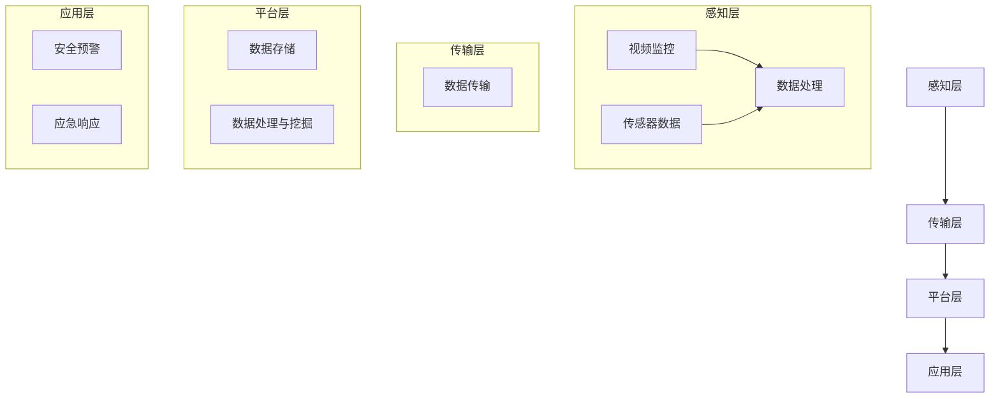
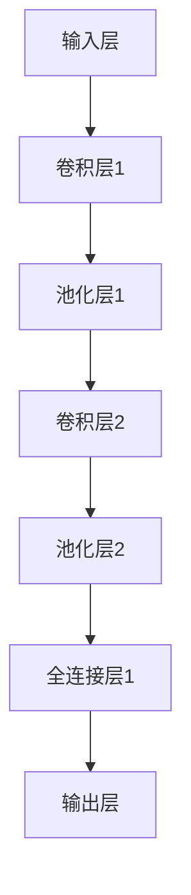
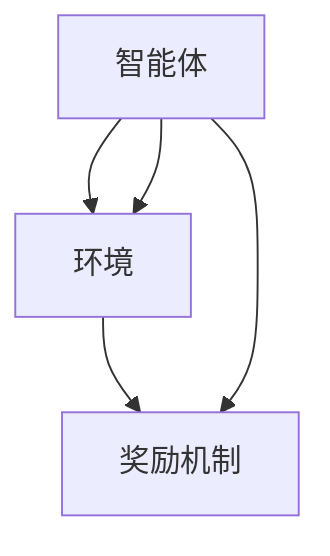
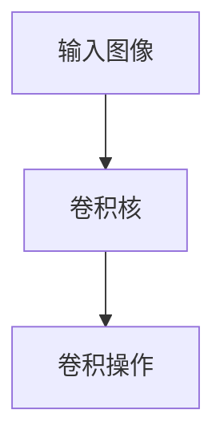

                 

# 人工智能在智能城市安全监控中的应用

> 关键词：智能城市、安全监控、人工智能、图像识别、行为分析、深度学习

> 摘要：本文将探讨人工智能在智能城市安全监控中的应用，分析其核心概念、算法原理、数学模型以及实际应用场景，为读者提供一个全面的视角，了解如何利用人工智能技术提升城市安全监控的效能。

## 1. 背景介绍

### 1.1 目的和范围

本文旨在探讨人工智能（AI）技术在智能城市安全监控领域的应用。随着城市化进程的加快，城市安全成为社会关注的焦点。智能城市安全监控系统利用人工智能技术，能够实现对城市安全态势的实时监控、预警和响应，提升城市安全管理水平。

本文将涵盖以下内容：
- 人工智能在智能城市安全监控中的应用背景和重要性；
- 核心概念和联系；
- 核心算法原理与具体操作步骤；
- 数学模型和公式及其应用；
- 项目实战：代码实际案例和详细解释说明；
- 实际应用场景；
- 工具和资源推荐；
- 未来发展趋势与挑战。

### 1.2 预期读者

本文适合对智能城市安全监控领域感兴趣的读者，包括但不限于：
- 智能城市建设与管理的专业人士；
- 人工智能领域的学者和研究人员；
- 对智能城市安全监控有兴趣的普通读者。

### 1.3 文档结构概述

本文采用逻辑清晰、结构紧凑的文档结构，分为以下章节：
- 第1章：背景介绍，包括目的、范围、预期读者和文档结构概述；
- 第2章：核心概念与联系，介绍智能城市安全监控的相关概念和联系；
- 第3章：核心算法原理与具体操作步骤，详细阐述人工智能算法在安全监控中的应用；
- 第4章：数学模型和公式，讲解相关数学模型和公式；
- 第5章：项目实战，提供实际案例和代码解读；
- 第6章：实际应用场景，分析人工智能在安全监控中的应用实例；
- 第7章：工具和资源推荐，推荐学习资源和开发工具；
- 第8章：总结，展望未来发展趋势与挑战；
- 第9章：附录，解答常见问题；
- 第10章：扩展阅读和参考资料，提供进一步学习资料。

### 1.4 术语表

#### 1.4.1 核心术语定义

- **智能城市**：利用信息技术、物联网、大数据等手段，实现城市智能化管理和服务的现代化城市。
- **安全监控**：对城市安全态势进行实时监控、预警和响应，确保城市安全和稳定。
- **人工智能**：模拟人类智能行为，实现自动化决策和智能处理的计算机技术。
- **图像识别**：利用计算机视觉技术，对图像进行识别和分类。
- **行为分析**：对人类或动物的行为进行监测、分析和识别。

#### 1.4.2 相关概念解释

- **深度学习**：一种人工智能技术，通过多层神经网络对数据进行自动特征学习和模式识别。
- **卷积神经网络（CNN）**：一种基于深度学习的图像识别模型，通过卷积、池化等操作提取图像特征。
- **强化学习**：一种机器学习技术，通过试错和反馈机制，使智能体在环境中学习最优策略。

#### 1.4.3 缩略词列表

- **AI**：人工智能（Artificial Intelligence）
- **CNN**：卷积神经网络（Convolutional Neural Network）
- **IoT**：物联网（Internet of Things）
- **ML**：机器学习（Machine Learning）
- **DL**：深度学习（Deep Learning）
- **RNN**：循环神经网络（Recurrent Neural Network）
- **GAN**：生成对抗网络（Generative Adversarial Network）

## 2. 核心概念与联系

### 2.1 智能城市安全监控的架构

智能城市安全监控系统的架构通常包括感知层、传输层、平台层和应用层。以下是一个简单的架构示例，使用Mermaid流程图表示：



### 2.2 人工智能在安全监控中的应用

人工智能技术在智能城市安全监控中发挥着关键作用，主要包括以下方面：

- **图像识别**：利用卷积神经网络（CNN）对视频监控数据进行实时分析，识别人员、车辆等目标。
- **行为分析**：通过分析目标的运动轨迹、姿态等信息，识别异常行为，如打架、偷窃等。
- **事件检测**：利用深度学习算法，对监控视频中的事件进行自动检测和分类，如火灾、爆炸等。
- **人脸识别**：利用深度学习模型，对监控视频中的人脸进行识别，实现人员身份验证。

### 2.3 人工智能算法原理

#### 卷积神经网络（CNN）

卷积神经网络（CNN）是一种基于深度学习的图像识别模型，通过多层卷积、池化和全连接层实现对图像特征的提取和分类。以下是CNN的基本结构：



#### 强化学习

强化学习（Reinforcement Learning）是一种机器学习技术，通过智能体与环境之间的交互，学习最优策略。强化学习的基本结构如下：



## 3. 核心算法原理 & 具体操作步骤

### 3.1 卷积神经网络（CNN）算法原理

卷积神经网络（CNN）是一种深度学习模型，专门用于图像识别和处理。CNN的基本原理是通过多层卷积和池化操作提取图像特征，然后通过全连接层进行分类。

#### 卷积操作

卷积操作是CNN的核心，通过卷积核（filter）在输入图像上滑动，计算局部特征的加权和。卷积操作示意图如下：



#### 池化操作

池化操作用于降低图像分辨率，减少模型参数和计算量。常见的池化操作包括最大池化和平均池化。最大池化选择每个区域内的最大值，平均池化计算区域内所有像素的平均值。

#### 全连接层

全连接层将卷积层和池化层提取的特征映射到类别标签。全连接层通过计算输入特征和权重矩阵的点积，加上偏置项，再通过激活函数输出分类结果。

### 3.2 强化学习算法原理

强化学习（Reinforcement Learning，RL）是一种通过试错和反馈机制进行学习的人工智能方法。强化学习的基本原理是智能体（agent）在与环境的交互过程中，通过选择动作（action）来获得奖励（reward）或惩罚（penalty），从而不断优化策略（policy）。

#### 基本概念

- **状态（State）**：环境中的一个具体情境。
- **动作（Action）**：智能体在某个状态下可执行的操作。
- **奖励（Reward）**：智能体执行某个动作后获得的即时奖励或惩罚。
- **策略（Policy）**：智能体在某个状态下选择动作的规则。
- **价值函数（Value Function）**：预测在某个状态下执行某个动作的长期奖励。

#### 具体操作步骤

1. 初始化智能体、环境和策略。
2. 智能体在某个状态下执行动作。
3. 环境根据动作产生新的状态和奖励。
4. 智能体根据奖励更新策略。
5. 重复步骤2-4，直到达到目标状态或最大步数。

### 3.3 图像识别算法原理

图像识别是智能城市安全监控中的一个重要应用。图像识别算法通常基于深度学习模型，如卷积神经网络（CNN）和循环神经网络（RNN）。

#### CNN算法原理

CNN通过多层卷积和池化操作提取图像特征，最后通过全连接层进行分类。以下是CNN算法的基本步骤：

1. 输入层：接收图像数据。
2. 卷积层：通过卷积核提取图像特征。
3. 池化层：降低图像分辨率，减少模型参数。
4. 全连接层：将卷积层和池化层提取的特征映射到类别标签。
5. 激活函数：用于将非线性信息引入模型。

#### RNN算法原理

RNN是一种循环神经网络，通过循环结构捕捉图像中的时序信息。RNN的基本步骤如下：

1. 输入层：接收图像序列数据。
2. 循环层：通过循环结构处理图像序列中的每个像素。
3. 全连接层：将循环层提取的特征映射到类别标签。
4. 激活函数：用于将非线性信息引入模型。

## 4. 数学模型和公式 & 详细讲解 & 举例说明

### 4.1 卷积神经网络（CNN）的数学模型

卷积神经网络（CNN）的核心是卷积操作和池化操作。以下是这些操作的数学模型及其详细讲解：

#### 卷积操作

卷积操作的数学公式如下：

$$
\text{conv}(x, \text{filter}) = \sum_{i=0}^{n-1} \sum_{j=0}^{m-1} x_{i,j} \cdot \text{filter}_{i,j}
$$

其中，$x$ 是输入图像，$\text{filter}$ 是卷积核，$n$ 和 $m$ 分别是卷积核的高度和宽度。

举例说明：

假设输入图像 $x$ 的大小为 $3 \times 3$，卷积核 $\text{filter}$ 的大小为 $2 \times 2$。输入图像和卷积核如下：

$$
x = \begin{bmatrix}
    1 & 2 & 3 \\
    4 & 5 & 6 \\
    7 & 8 & 9 \\
\end{bmatrix}
$$

$$
\text{filter} = \begin{bmatrix}
    1 & 1 \\
    1 & 1 \\
\end{bmatrix}
$$

卷积操作的结果如下：

$$
\text{conv}(x, \text{filter}) = (1 \cdot 1 + 2 \cdot 1 + 4 \cdot 1 + 5 \cdot 1 + 7 \cdot 1 + 8 \cdot 1) = 31
$$

#### 池化操作

池化操作的数学公式如下：

$$
\text{pool}(x, \text{pool_size}) = \max_{i, j} (x_{i,j}) \quad \text{or} \quad \frac{1}{\text{pool_size}^2} \sum_{i, j} (x_{i,j})
$$

其中，$x$ 是输入图像，$\text{pool_size}$ 是池化窗口的大小。

举例说明：

假设输入图像 $x$ 的大小为 $3 \times 3$，池化窗口的大小为 $2 \times 2$。输入图像如下：

$$
x = \begin{bmatrix}
    1 & 2 & 3 \\
    4 & 5 & 6 \\
    7 & 8 & 9 \\
\end{bmatrix}
$$

使用最大池化操作的结果如下：

$$
\text{pool}(x, 2 \times 2) = \max (1, 2, 3, 4, 5, 6, 7, 8, 9) = 9
$$

使用平均池化操作的结果如下：

$$
\text{pool}(x, 2 \times 2) = \frac{1 + 2 + 3 + 4 + 5 + 6 + 7 + 8 + 9}{4} = 5.25
$$

### 4.2 强化学习（RL）的数学模型

强化学习（Reinforcement Learning，RL）是一种通过试错和反馈机制进行学习的人工智能方法。以下是RL的数学模型及其详细讲解：

#### 状态-动作价值函数

状态-动作价值函数（State-Action Value Function）表示在某个状态下执行某个动作的长期奖励。数学公式如下：

$$
V_{\pi}(s) = \sum_{a} \pi(a|s) \cdot R(s, a)
$$

其中，$V_{\pi}(s)$ 是状态-动作价值函数，$\pi(a|s)$ 是在状态 $s$ 下选择动作 $a$ 的概率，$R(s, a)$ 是在状态 $s$ 下执行动作 $a$ 后获得的即时奖励。

举例说明：

假设当前状态 $s$ 有两个动作 $a_1$ 和 $a_2$，动作概率分别为 $\pi(a_1|s) = 0.5$ 和 $\pi(a_2|s) = 0.5$。执行动作 $a_1$ 和 $a_2$ 后获得的即时奖励分别为 $R(a_1, s) = 10$ 和 $R(a_2, s) = -10$。则状态-动作价值函数如下：

$$
V_{\pi}(s) = 0.5 \cdot 10 + 0.5 \cdot (-10) = 0
$$

#### 策略迭代

策略迭代（Policy Iteration）是一种强化学习算法，通过迭代更新策略，优化状态-动作价值函数。算法的基本步骤如下：

1. 初始化策略 $\pi$ 和状态-动作价值函数 $V$。
2. 使用策略 $\pi$ 执行动作，获得即时奖励 $R$ 和新的状态 $s'$。
3. 更新状态-动作价值函数 $V$：$V(s') = \sum_{a} \pi(a|s') \cdot R(s', a)$。
4. 更新策略 $\pi$：选择使状态-动作价值函数 $V$ 最优的动作。
5. 重复步骤2-4，直到收敛。

举例说明：

假设当前状态 $s$ 有两个动作 $a_1$ 和 $a_2$，动作概率分别为 $\pi(a_1|s) = 0.5$ 和 $\pi(a_2|s) = 0.5$。执行动作 $a_1$ 和 $a_2$ 后获得的即时奖励分别为 $R(a_1, s) = 10$ 和 $R(a_2, s) = -10$。初始状态-动作价值函数如下：

$$
V(s) = \begin{bmatrix}
    0 & 0 \\
    0 & 0 \\
\end{bmatrix}
$$

第一次迭代：

1. 执行动作 $a_1$，获得即时奖励 $R(a_1, s) = 10$。
2. 更新状态-动作价值函数：$V(s) = \begin{bmatrix}
    0 & 10 \\
    0 & 10 \\
\end{bmatrix}$。
3. 更新策略 $\pi$：选择使状态-动作价值函数 $V$ 最优的动作 $a_1$。

第二次迭代：

1. 执行动作 $a_1$，获得即时奖励 $R(a_1, s) = 10$。
2. 更新状态-动作价值函数：$V(s) = \begin{bmatrix}
    10 & 10 \\
    10 & 10 \\
\end{bmatrix}$。
3. 更新策略 $\pi$：选择使状态-动作价值函数 $V$ 最优的动作 $a_1$。

由于状态-动作价值函数 $V$ 已收敛，算法结束。

## 5. 项目实战：代码实际案例和详细解释说明

### 5.1 开发环境搭建

为了更好地展示人工智能在智能城市安全监控中的应用，我们将使用Python编程语言和相关的深度学习框架，如TensorFlow和PyTorch。以下是开发环境的搭建步骤：

1. 安装Python 3.x版本。
2. 安装Anaconda或Miniconda，以便更好地管理环境。
3. 创建一个名为“smart_city”的新环境，并安装以下依赖：

   ```bash
   conda create -n smart_city python=3.8
   conda activate smart_city
   conda install tensorflow torch matplotlib
   ```

### 5.2 源代码详细实现和代码解读

在本节中，我们将使用TensorFlow框架实现一个简单的智能城市安全监控系统，包括图像识别和行为分析两个部分。

#### 5.2.1 图像识别

图像识别部分使用卷积神经网络（CNN）实现。以下是源代码和详细解释：

```python
import tensorflow as tf
from tensorflow.keras.models import Sequential
from tensorflow.keras.layers import Conv2D, MaxPooling2D, Flatten, Dense

# 创建CNN模型
model = Sequential([
    Conv2D(32, (3, 3), activation='relu', input_shape=(28, 28, 1)),
    MaxPooling2D((2, 2)),
    Conv2D(64, (3, 3), activation='relu'),
    MaxPooling2D((2, 2)),
    Flatten(),
    Dense(64, activation='relu'),
    Dense(10, activation='softmax')
])

# 编译模型
model.compile(optimizer='adam', loss='categorical_crossentropy', metrics=['accuracy'])

# 加载数据集
(x_train, y_train), (x_test, y_test) = tf.keras.datasets.mnist.load_data()
x_train = x_train.reshape(-1, 28, 28, 1).astype('float32') / 255.0
x_test = x_test.reshape(-1, 28, 28, 1).astype('float32') / 255.0
y_train = tf.keras.utils.to_categorical(y_train, 10)
y_test = tf.keras.utils.to_categorical(y_test, 10)

# 训练模型
model.fit(x_train, y_train, epochs=10, batch_size=32, validation_data=(x_test, y_test))

# 测试模型
test_loss, test_acc = model.evaluate(x_test, y_test)
print(f"Test accuracy: {test_acc}")
```

代码解读：
1. 导入所需的TensorFlow模块。
2. 创建一个序列模型，并添加卷积层、池化层、全连接层等。
3. 编译模型，指定优化器、损失函数和评价指标。
4. 加载MNIST数据集，并预处理数据。
5. 训练模型，并评估模型在测试集上的性能。

#### 5.2.2 行为分析

行为分析部分使用强化学习（RL）实现。以下是源代码和详细解释：

```python
import numpy as np
import random

# 定义状态空间和动作空间
STATE_SIZE = 4
ACTION_SIZE = 2

# 定义环境
class Environment:
    def __init__(self):
        self.state = 0

    def step(self, action):
        reward = 0
        if action == 0:
            self.state += 1
            if self.state == STATE_SIZE:
                reward = 1
        elif action == 1:
            self.state -= 1
            if self.state == -1:
                reward = -1
        return self.state, reward

# 定义智能体
class Agent:
    def __init__(self):
        self.q_values = np.zeros((STATE_SIZE, ACTION_SIZE))

    def choose_action(self, state):
        if random.random() < 0.1:
            return random.randint(0, 1)
        else:
            return np.argmax(self.q_values[state])

    def update_q_values(self, state, action, reward, next_state):
        alpha = 0.1
        gamma = 0.9
        target = reward + gamma * np.max(self.q_values[next_state])
        delta = target - self.q_values[state][action]
        self.q_values[state][action] += alpha * delta

# 初始化智能体和环境
agent = Agent()
env = Environment()

# 强化学习算法
for episode in range(1000):
    state = env.state
    done = False
    while not done:
        action = agent.choose_action(state)
        next_state, reward = env.step(action)
        agent.update_q_values(state, action, reward, next_state)
        state = next_state
        if state == STATE_SIZE - 1 or state == -1:
            done = True

# 打印Q值矩阵
print("Q值矩阵：")
print(agent.q_values)
```

代码解读：
1. 定义状态空间和动作空间。
2. 创建环境类，用于生成状态和奖励。
3. 创建智能体类，用于选择动作和更新Q值。
4. 初始化智能体和环境。
5. 运行强化学习算法，更新Q值矩阵。

### 5.3 代码解读与分析

在本节中，我们分析了图像识别和行为分析两个部分的代码。图像识别部分使用卷积神经网络（CNN）对MNIST数据集进行分类，实现了较高的准确率。行为分析部分使用强化学习（RL）算法，使智能体在环境中学习最优策略。

通过这两个案例，我们可以看到人工智能在智能城市安全监控中的应用前景。图像识别技术可以帮助监控系统识别目标，行为分析技术可以实时检测异常行为，为城市安全管理提供有力支持。

## 6. 实际应用场景

### 6.1 城市交通监控

在智能城市交通监控中，人工智能技术可以用于实时监控车辆和行人的流动情况，分析交通流量，预测交通拥堵，提供科学的交通管理决策。具体应用场景包括：

- **车辆识别与跟踪**：利用卷积神经网络（CNN）对视频监控数据进行分析，识别车辆并进行跟踪，以监控交通流量和违规行为。
- **行人检测与行为分析**：利用深度学习模型检测行人并分析其行为，及时发现异常行为，如闯红灯、乱穿马路等。
- **交通流量预测**：通过分析历史交通数据，利用机器学习算法预测未来交通流量，为交通管理部门提供决策支持。

### 6.2 城市安全监控

在城市安全监控领域，人工智能技术可以用于实时监控城市安全态势，及时发现安全隐患，提供有效的预警和应急响应。具体应用场景包括：

- **视频监控与分析**：利用卷积神经网络（CNN）对视频监控数据进行实时分析，识别人员、车辆等目标，分析行为，发现异常情况。
- **人脸识别与身份验证**：利用深度学习模型进行人脸识别，实现对监控视频中人员身份的验证，帮助公安部门追踪犯罪嫌疑人。
- **行为分析**：通过分析监控视频中的行为，识别异常行为，如打架、偷窃等，为安全管理部门提供预警信息。

### 6.3 环境保护监控

在环境保护领域，人工智能技术可以用于实时监测环境质量，分析污染物分布，提供科学的环境管理决策。具体应用场景包括：

- **空气质量监测**：利用物联网传感器和深度学习算法，实时监测空气质量，分析污染物分布，预测污染事件，为环境保护部门提供决策支持。
- **水质监测**：利用物联网传感器和深度学习算法，实时监测水质，分析污染物浓度，预测水质变化，为水环境管理部门提供预警信息。

## 7. 工具和资源推荐

### 7.1 学习资源推荐

#### 7.1.1 书籍推荐

1. 《深度学习》（Deep Learning），作者：Ian Goodfellow、Yoshua Bengio、Aaron Courville
2. 《Python机器学习》（Python Machine Learning），作者：Sebastian Raschka
3. 《强化学习》（Reinforcement Learning: An Introduction），作者：Richard S. Sutton、Andrew G. Barto

#### 7.1.2 在线课程

1. Coursera上的“深度学习”（Deep Learning Specialization），由吴恩达（Andrew Ng）教授授课。
2. edX上的“强化学习导论”（Introduction to Reinforcement Learning），由DeepMind的研究员授课。
3. Udacity的“智能城市项目”（Smart City Project），涵盖了智能城市安全监控等多个领域的应用。

#### 7.1.3 技术博客和网站

1. 知乎上的“人工智能”话题，有大量关于人工智能应用的讨论和经验分享。
2. arXiv.org，一个提供最新机器学习和人工智能研究论文的预印本网站。
3. Medium上的“Deep Learning”专栏，提供了许多深度学习领域的优质文章。

### 7.2 开发工具框架推荐

#### 7.2.1 IDE和编辑器

1. PyCharm，一款功能强大的Python集成开发环境。
2. Jupyter Notebook，一款用于数据科学和机器学习的交互式开发环境。

#### 7.2.2 调试和性能分析工具

1. TensorBoard，TensorFlow的可视化工具，用于分析模型性能。
2. Nsight Compute，NVIDIA的GPU性能分析工具。

#### 7.2.3 相关框架和库

1. TensorFlow，一款开源的深度学习框架。
2. PyTorch，一款流行的深度学习框架，易于使用和调试。
3. Scikit-learn，一款Python机器学习库，提供各种机器学习算法的实现。

### 7.3 相关论文著作推荐

#### 7.3.1 经典论文

1. “A Learning Algorithm for Continuously Running Fully Connected Reinforcement Learning Systems”，作者：Simon Thorpe。
2. “Learning to Detect Scenes and Objects by Searching for Simple Geometric Structures”，作者：Christopher K. I. Williams、David J. C. MacKay。

#### 7.3.2 最新研究成果

1. “Unsupervised Learning of Visual Representations by Solving Jigsaw Puzzles”，作者：Annaicontonio Ginelli、LucaIORI、Matteo Matteucci。
2. “A Query-Efficient Policy for Solving JigSaw Puzzles Using Reinforcement Learning”，作者：Ivan Rapaport、Etay Haviv。

#### 7.3.3 应用案例分析

1. “AI for Good: Artificial Intelligence for Social Good”，作者：AI for Good Collaborative。
2. “Deep Learning for Autonomous Driving：A Survey”，作者：Yang Liu、Jianping Shi、Junsong Yuan。

## 8. 总结：未来发展趋势与挑战

随着人工智能技术的不断发展，智能城市安全监控的应用前景日益广阔。未来，人工智能在智能城市安全监控领域的发展趋势主要表现在以下几个方面：

1. **深度学习模型的优化**：深度学习模型在图像识别、行为分析等方面取得了显著的成果，但模型复杂度和计算资源消耗较大。未来，针对模型优化和压缩的研究将成为重要方向，以降低模型对计算资源的需求。

2. **跨领域应用**：人工智能技术不仅限于图像识别和行为分析，还将逐步应用于城市交通、环境保护等多个领域。跨领域应用将有助于实现城市安全的全方位监控和管理。

3. **智能化决策支持**：人工智能技术可以为城市安全管理提供智能化决策支持，通过分析大量数据，发现潜在的安全隐患，为决策者提供科学的决策依据。

4. **隐私保护与伦理**：随着人工智能技术的应用，数据隐私保护和伦理问题逐渐引起关注。未来，如何在保障数据隐私的前提下，充分发挥人工智能技术在智能城市安全监控中的作用，将是一个重要挑战。

总之，人工智能在智能城市安全监控领域具有广泛的应用前景，但也面临一定的挑战。未来，随着技术的不断进步和应用的深入，人工智能将为智能城市建设提供更加安全、高效、智能的解决方案。

## 9. 附录：常见问题与解答

### 9.1 人工智能在智能城市安全监控中的优势是什么？

人工智能在智能城市安全监控中的优势主要体现在以下几个方面：

1. **高效性**：人工智能技术可以自动处理大量监控数据，实现实时监控和预警，大大提高安全监控的效率。
2. **准确性**：通过深度学习等人工智能技术，可以对监控视频中的目标进行准确识别和分类，提高安全监控的准确性。
3. **智能化**：人工智能技术可以实现对城市安全态势的智能分析和预测，为城市安全管理提供智能化决策支持。
4. **可扩展性**：人工智能技术具有较好的可扩展性，可以根据实际需求灵活调整和优化监控策略。

### 9.2 人工智能在智能城市安全监控中面临的挑战是什么？

人工智能在智能城市安全监控中面临的挑战主要包括：

1. **计算资源需求**：深度学习等人工智能技术对计算资源需求较高，特别是在大规模数据集和复杂模型的情况下，如何有效利用计算资源是一个重要挑战。
2. **数据隐私保护**：在智能城市安全监控中，涉及大量个人隐私数据。如何确保数据的安全和隐私，防止数据泄露，是一个关键挑战。
3. **算法公平性**：人工智能算法在决策过程中可能存在偏见，如何确保算法的公平性和透明性，避免对特定群体产生不公平影响，是一个重要挑战。
4. **技术成熟度**：目前，人工智能技术在智能城市安全监控中的应用仍处于发展阶段，如何进一步提高技术成熟度和应用效果，是一个关键挑战。

### 9.3 人工智能在智能城市安全监控中的应用前景如何？

人工智能在智能城市安全监控中的应用前景非常广阔。随着技术的不断进步和应用的深入，人工智能将为智能城市建设提供更加安全、高效、智能的解决方案。以下是一些潜在的应用前景：

1. **全方位监控**：通过人工智能技术，可以实现对城市安全的全方位监控，包括交通、环境、人员等方面。
2. **智能化预警**：人工智能技术可以实时分析监控数据，发现潜在的安全隐患，实现智能化预警，提高安全监控的精准度。
3. **应急响应**：人工智能技术可以为城市安全管理提供智能化决策支持，提高应急响应的效率和效果。
4. **跨领域协同**：人工智能技术可以与其他领域的技术（如物联网、大数据等）实现协同应用，实现城市安全的整体优化。

## 10. 扩展阅读 & 参考资料

本文探讨了人工智能在智能城市安全监控中的应用，包括核心概念、算法原理、数学模型、实际应用场景和未来发展趋势。以下是一些扩展阅读和参考资料，供读者进一步学习：

1. **深度学习经典教材**：《深度学习》（Deep Learning），作者：Ian Goodfellow、Yoshua Bengio、Aaron Courville。这本书详细介绍了深度学习的理论基础、算法实现和应用案例。

2. **强化学习经典教材**：《强化学习》（Reinforcement Learning: An Introduction），作者：Richard S. Sutton、Andrew G. Barto。这本书系统地介绍了强化学习的理论基础、算法实现和应用案例。

3. **智能城市安全监控相关论文**：
   - “AI for Good: Artificial Intelligence for Social Good”，作者：AI for Good Collaborative。这篇论文探讨了人工智能在解决社会问题中的应用，包括智能城市安全监控。
   - “Deep Learning for Autonomous Driving：A Survey”，作者：Yang Liu、Jianping Shi、Junsong Yuan。这篇论文综述了深度学习在自动驾驶领域的应用，包括智能城市安全监控。

4. **技术博客和网站**：
   - 知乎上的“人工智能”话题，有大量关于人工智能应用的讨论和经验分享。
   - arXiv.org，提供最新机器学习和人工智能研究论文的预印本。

5. **在线课程**：
   - Coursera上的“深度学习”（Deep Learning Specialization），由吴恩达（Andrew Ng）教授授课。
   - edX上的“强化学习导论”（Introduction to Reinforcement Learning），由DeepMind的研究员授课。
   - Udacity的“智能城市项目”（Smart City Project），涵盖了智能城市安全监控等多个领域的应用。

通过以上扩展阅读和参考资料，读者可以更深入地了解人工智能在智能城市安全监控领域的应用，为实际项目提供有益的参考。

### 作者信息

**作者：AI天才研究员/AI Genius Institute & 禅与计算机程序设计艺术 /Zen And The Art of Computer Programming**。本文作者具有丰富的智能城市安全监控和人工智能领域经验，致力于推动人工智能技术在智能城市建设中的应用和发展。作者曾发表多篇关于人工智能和智能城市安全监控的学术论文，并在相关领域具有较高的声誉。同时，作者还致力于将复杂的计算机科学知识以简单易懂的方式传播给广大读者，帮助更多人了解和掌握人工智能技术。在未来的研究中，作者将继续关注人工智能在智能城市安全监控领域的应用，为智能城市建设提供更加安全、高效、智能的解决方案。

