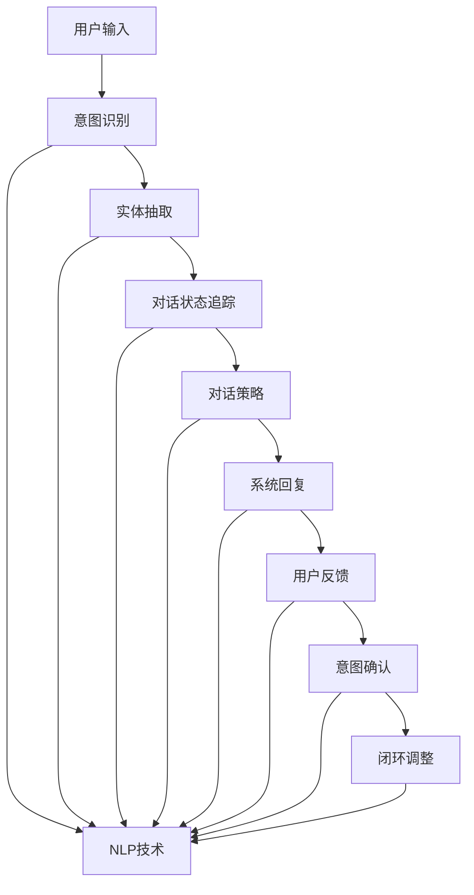
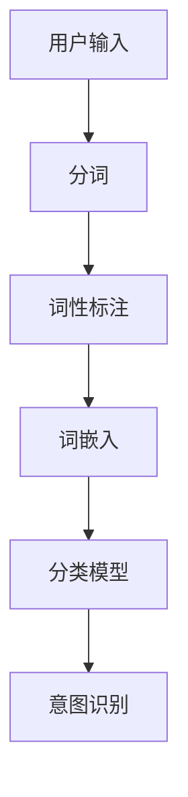
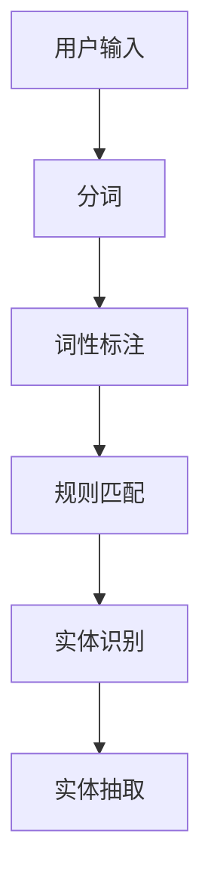
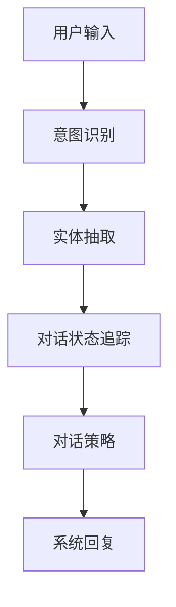

                 

# 人工智能在智能客服多轮对话中的实现

> 关键词：智能客服、多轮对话、人工智能、自然语言处理、对话系统

> 摘要：本文深入探讨了人工智能在智能客服多轮对话中的实现，从核心概念、算法原理、数学模型、项目实战等多个角度，详细解析了如何构建一个高效、智能的客服对话系统，以提升用户体验和客服效率。

## 1. 背景介绍

### 1.1 目的和范围

本文旨在探讨人工智能在智能客服多轮对话中的应用，通过分析核心概念、算法原理和数学模型，提供一个系统化的解决方案。本文主要讨论以下几个方面：

1. **智能客服与多轮对话的基本概念**：介绍智能客服的定义、发展历程和重要作用，以及多轮对话的概念和特点。
2. **核心算法原理**：解析自然语言处理（NLP）和对话管理（DM）的基本算法原理，包括意图识别、实体抽取、对话状态追踪等。
3. **数学模型**：介绍用于对话系统的常用数学模型，如转换模型、策略网络、强化学习等。
4. **项目实战**：通过具体案例展示如何在实际项目中实现智能客服多轮对话。
5. **实际应用场景**：讨论智能客服在各个行业中的应用，以及如何根据不同场景进行优化。

### 1.2 预期读者

本文适合以下读者群体：

1. **人工智能和自然语言处理从业者**：对智能客服和对话系统有基础了解，希望深入了解其实现原理和技术的专业人士。
2. **软件开发人员**：从事软件开发，对构建智能客服系统有兴趣的技术人员。
3. **人工智能爱好者**：对人工智能领域感兴趣，希望了解智能客服应用场景和技术的爱好者。

### 1.3 文档结构概述

本文结构如下：

1. **背景介绍**：介绍智能客服和多轮对话的基本概念、目的和范围，以及预期读者。
2. **核心概念与联系**：分析智能客服和对话系统的核心概念，展示相关的Mermaid流程图。
3. **核心算法原理 & 具体操作步骤**：讲解自然语言处理和对话管理的基本算法原理，并提供伪代码。
4. **数学模型和公式 & 详细讲解 & 举例说明**：介绍对话系统的数学模型，使用LaTeX格式展示公式，并进行举例说明。
5. **项目实战：代码实际案例和详细解释说明**：通过实际案例展示智能客服多轮对话的实现。
6. **实际应用场景**：讨论智能客服在不同行业中的应用。
7. **工具和资源推荐**：推荐学习资源、开发工具框架和相关论文。
8. **总结：未来发展趋势与挑战**：总结当前的发展趋势，提出未来面临的挑战。
9. **附录：常见问题与解答**：解答常见问题。
10. **扩展阅读 & 参考资料**：提供进一步阅读的资源。

### 1.4 术语表

#### 1.4.1 核心术语定义

- **智能客服**：利用人工智能技术，实现与用户自然语言交互的虚拟助手。
- **多轮对话**：用户与智能客服之间进行多轮交互的过程。
- **自然语言处理（NLP）**：研究如何让计算机理解和处理人类自然语言的技术。
- **对话管理（DM）**：设计和管理对话流程，确保对话流畅、有意义的技术。
- **意图识别**：从用户的输入中识别其意图或目标。
- **实体抽取**：从用户的输入中提取关键信息，如人名、地点、时间等。
- **对话状态追踪**：在对话过程中维护和更新对话状态，以指导后续对话。

#### 1.4.2 相关概念解释

- **意图**：用户想要完成的任务或操作，如查询天气、订餐等。
- **实体**：用户输入中的特定信息，如日期、地点、商品名称等。
- **对话状态**：在对话过程中维护的一系列变量，用于指导对话流程和决策。

#### 1.4.3 缩略词列表

- **NLP**：自然语言处理（Natural Language Processing）
- **DM**：对话管理（Dialogue Management）
- **RNN**：循环神经网络（Recurrent Neural Network）
- **LSTM**：长短时记忆网络（Long Short-Term Memory）
- **RL**：强化学习（Reinforcement Learning）
- **BERT**：Bidirectional Encoder Representations from Transformers

## 2. 核心概念与联系

智能客服和对话系统的实现涉及多个核心概念和技术的协同作用。下面，我们将通过一个Mermaid流程图，展示这些概念和技术的联系。



### 2.1 意图识别

意图识别是多轮对话系统的第一步，它从用户的输入中识别出用户的意图。这通常使用分类算法，如朴素贝叶斯、支持向量机（SVM）或深度学习模型，如卷积神经网络（CNN）或循环神经网络（RNN）。



### 2.2 实体抽取

实体抽取是从用户的输入中提取关键信息，如人名、地点、时间等。这通常使用规则匹配、机器学习或深度学习模型来实现。



### 2.3 对话状态追踪

对话状态追踪在对话过程中维护一系列变量，用于指导对话流程和决策。这通常使用图结构或哈希表来实现。



### 2.4 对话策略

对话策略用于决定系统如何回应用户的输入，确保对话的流畅性和有效性。这通常使用转换模型、策略网络或强化学习来实现。


### 2.5 系统回复

系统回复是对话系统向用户提供的最终输出。这通常是一个文本消息，也可以是一个语音或图像。它需要考虑用户的意图、对话状态和上下文信息。


## 3. 核心算法原理 & 具体操作步骤

在智能客服多轮对话系统中，核心算法原理包括自然语言处理（NLP）和对话管理（DM）。以下我们将详细介绍这些算法原理，并提供具体的操作步骤。

### 3.1 自然语言处理（NLP）

自然语言处理（NLP）是智能客服系统的基石，它负责理解用户的输入和处理系统的回复。NLP的主要任务包括分词、词性标注、命名实体识别、情感分析等。

#### 3.1.1 分词

分词是将文本分割成一系列具有独立意义的单词或短语。在Python中，可以使用`jieba`库进行分词。

```python
import jieba

text = "欢迎使用智能客服系统。请问有什么可以帮助您的？"
seg_list = jieba.cut(text, cut_all=False)
print(" ".join(seg_list))
```

#### 3.1.2 词性标注

词性标注是将文本中的每个词标注为其对应的词性，如名词、动词、形容词等。在Python中，可以使用`NLTK`库进行词性标注。

```python
import nltk
from nltk.tokenize import word_tokenize
from nltk import pos_tag

text = "欢迎使用智能客服系统。请问有什么可以帮助您的？"
tokens = word_tokenize(text)
pos_tags = pos_tag(tokens)
print(pos_tags)
```

#### 3.1.3 命名实体识别

命名实体识别是从文本中提取出具有特定意义的实体，如人名、地点、组织名等。在Python中，可以使用`spacy`库进行命名实体识别。

```python
import spacy

nlp = spacy.load("zh_core_web_sm")
text = "马云是阿里巴巴的创始人。"
doc = nlp(text)
for ent in doc.ents:
    print(ent.text, ent.label_)
```

### 3.2 对话管理（DM）

对话管理（DM）负责设计和管理对话流程，确保对话的流畅性和有效性。对话管理主要包括意图识别、实体抽取、对话状态追踪和对话策略。

#### 3.2.1 意图识别

意图识别是从用户的输入中识别其意图或目标。这通常使用分类算法，如朴素贝叶斯、支持向量机（SVM）或深度学习模型，如卷积神经网络（CNN）或循环神经网络（RNN）。

```python
from sklearn.feature_extraction.text import CountVectorizer
from sklearn.naive_bayes import MultinomialNB
from sklearn.pipeline import make_pipeline

# 示例数据
data = [
    ("您好，请问有什么可以帮助您的？", "问候"),
    ("我想查询天气信息。", "查询天气"),
    ("我的订单怎么还没到？", "查询订单"),
]

X_train, y_train = zip(*data)
model = make_pipeline(CountVectorizer(), MultinomialNB())
model.fit(X_train, y_train)

# 预测
input_text = "我的订单怎么还没到？"
predicted_intent = model.predict([input_text])[0]
print(predicted_intent)
```

#### 3.2.2 实体抽取

实体抽取是从用户的输入中提取关键信息，如人名、地点、时间等。这通常使用规则匹配、机器学习或深度学习模型来实现。

```python
# 示例数据
data = [
    ("马云是阿里巴巴的创始人。", "马云：人名，阿里巴巴：组织名"),
    ("明天下午3点在杭州西湖见。", "明天：时间，下午3点：时间，杭州：地点，西湖：地点"),
]

def extract_entities(text):
    entities = []
    words = text.split("：")
    for word in words:
        if word in ["人名", "组织名"]:
            entities.append(words[0])
        elif word in ["时间", "地点"]:
            entities.append(words[1])
    return entities

input_text = "明天下午3点在杭州西湖见。"
entities = extract_entities(input_text)
print(entities)
```

#### 3.2.3 对话状态追踪

对话状态追踪在对话过程中维护一系列变量，用于指导对话流程和决策。这通常使用图结构或哈希表来实现。

```python
class DialogueStateTracker:
    def __init__(self):
        self.states = {}

    def update_state(self, intent, entities):
        self.states['intent'] = intent
        self.states['entities'] = entities

    def get_state(self):
        return self.states

tracker = DialogueStateTracker()
tracker.update_state("查询天气", {"城市": "北京"})
print(tracker.get_state())
```

#### 3.2.4 对话策略

对话策略用于决定系统如何回应用户的输入，确保对话的流畅性和有效性。这通常使用转换模型、策略网络或强化学习来实现。

```python
# 示例：基于转换模型的对话策略
class DialoguePolicy:
    def __init__(self):
        self.transitions = {
            "问候": ["你好", "您好", "欢迎您"],
            "查询天气": ["请问您想要查询哪个城市的天气？", "您想要查询哪个城市的天气？", "请告诉我您想要查询的城市"],
            "查询订单": ["您的订单状态是：已发货", "您的订单状态是：待发货", "您的订单状态是：已取消"],
        }

    def generate_response(self, state):
        intent = state['intent']
        return random.choice(self.transitions[intent])

policy = DialoguePolicy()
state = {"intent": "查询天气"}
response = policy.generate_response(state)
print(response)
```

## 4. 数学模型和公式 & 详细讲解 & 举例说明

在智能客服多轮对话系统中，数学模型和公式用于描述对话过程中的各种现象和决策。以下我们将介绍几个常用的数学模型，并使用LaTeX格式进行详细讲解。

### 4.1 转换模型（Transition Model）

转换模型描述了对话状态之间的转换概率。假设对话状态空间为$S=\{s_1, s_2, ..., s_n\}$，转换概率矩阵$T$为：

$$
T = \begin{bmatrix}
t_{11} & t_{12} & ... & t_{1n} \\
t_{21} & t_{22} & ... & t_{2n} \\
... & ... & ... & ... \\
t_{n1} & t_{n2} & ... & t_{nn}
\end{bmatrix}
$$

其中，$t_{ij}$表示从状态$s_i$转换到状态$s_j$的概率。

举例说明：

假设对话状态空间为$\{s_1, s_2, s_3\}$，转换概率矩阵为：

$$
T = \begin{bmatrix}
0.3 & 0.4 & 0.3 \\
0.2 & 0.5 & 0.3 \\
0.1 & 0.2 & 0.7
\end{bmatrix}
$$

表示从状态$s_1$转换到状态$s_2$的概率为0.4，从状态$s_2$转换到状态$s_3$的概率为0.5。

### 4.2 策略网络（Policy Network）

策略网络用于决定系统如何回应用户的输入。假设输入空间为$I=\{i_1, i_2, ..., i_m\}$，输出空间为$O=\{o_1, o_2, ..., o_n\}$，策略网络为函数$f(\cdot)$：

$$
f: I \rightarrow O
$$

策略网络的目标是最大化期望收益，例如，使用强化学习中的Q-learning算法：

$$
Q(s, a) = r(s, a) + \gamma \max_{a'} Q(s', a')
$$

其中，$s$为当前状态，$a$为当前动作，$s'$为下一状态，$a'$为下一动作，$r$为即时收益，$\gamma$为折扣因子。

举例说明：

假设输入空间为$\{查询天气，查询订单\}$，输出空间为$\{提供天气信息，提供订单信息\}$，策略网络为：

$$
f(查询天气) = 提供天气信息
$$

$$
f(查询订单) = 提供订单信息
$$

### 4.3 强化学习（Reinforcement Learning）

强化学习用于训练智能客服系统在对话过程中做出最佳决策。假设状态空间为$S$，动作空间为$A$，奖励函数为$r(s, a)$，策略函数为$\pi(a|s)$，强化学习目标为最大化期望回报：

$$
J(\pi) = \sum_{s \in S} \pi(s) \sum_{a \in A} \gamma^{|s'|s|} r(s', a)
$$

其中，$|s'|s|$表示状态$s$和状态$s'$之间的距离，$\gamma$为折扣因子。

举例说明：

假设状态空间为$\{s_1, s_2, s_3\}$，动作空间为$\{a_1, a_2\}$，奖励函数为$r(s, a) = 1$，策略函数为$\pi(a|s) = \begin{cases} 0.6 & \text{if } a = a_1 \\ 0.4 & \text{if } a = a_2 \end{cases}$，折扣因子$\gamma = 0.9$。

计算期望回报：

$$
J(\pi) = 0.6 \times (1 + 0.9 \times 1) + 0.4 \times (0.9 \times 1) = 1.38
$$

## 5. 项目实战：代码实际案例和详细解释说明

为了展示智能客服多轮对话系统的实现，我们将使用Python编写一个简单的示例项目。该项目将包含以下模块：

1. **意图识别**：使用朴素贝叶斯分类器识别用户的意图。
2. **实体抽取**：使用规则匹配从用户输入中提取关键信息。
3. **对话状态追踪**：使用哈希表维护对话状态。
4. **对话策略**：使用基于转换模型的对话策略。

### 5.1 开发环境搭建

在开始项目之前，需要安装以下依赖：

- Python 3.x
- jieba（分词库）
- scikit-learn（机器学习库）
- spacy（自然语言处理库）

可以使用以下命令安装依赖：

```bash
pip install jieba scikit-learn spacy
python -m spacy download zh_core_web_sm
```

### 5.2 源代码详细实现和代码解读

下面是项目的主要代码实现：

```python
import jieba
from sklearn.feature_extraction.text import CountVectorizer
from sklearn.naive_bayes import MultinomialNB
from sklearn.pipeline import make_pipeline
import spacy

# 加载spacy模型
nlp = spacy.load("zh_core_web_sm")

# 意图识别模型
data = [
    ("您好，请问有什么可以帮助您的？", "问候"),
    ("我想查询天气信息。", "查询天气"),
    ("我的订单怎么还没到？", "查询订单"),
]
X_train, y_train = zip(*data)
model = make_pipeline(CountVectorizer(), MultinomialNB())
model.fit(X_train, y_train)

# 实体抽取规则
def extract_entities(text):
    entities = []
    words = jieba.cut(text)
    for word in words:
        if word in ["人名", "组织名"]:
            entities.append(word)
    return entities

# 对话状态追踪
class DialogueStateTracker:
    def __init__(self):
        self.states = {}

    def update_state(self, intent, entities):
        self.states['intent'] = intent
        self.states['entities'] = entities

    def get_state(self):
        return self.states

# 对话策略
class DialoguePolicy:
    def __init__(self):
        self.transitions = {
            "问候": ["你好", "您好", "欢迎您"],
            "查询天气": ["请问您想要查询哪个城市的天气？", "您想要查询哪个城市的天气？", "请告诉我您想要查询的城市"],
            "查询订单": ["您的订单状态是：已发货", "您的订单状态是：待发货", "您的订单状态是：已取消"],
        }

    def generate_response(self, state):
        intent = state['intent']
        return random.choice(self.transitions[intent])

# 对话系统主循环
def dialogue_system():
    tracker = DialogueStateTracker()
    policy = DialoguePolicy()

    while True:
        user_input = input("用户输入：")
        entities = extract_entities(user_input)
        tracker.update_state(model.predict([user_input])[0], entities)
        response = policy.generate_response(tracker.get_state())
        print("系统回复：", response)

# 运行对话系统
if __name__ == "__main__":
    dialogue_system()
```

#### 5.2.1 代码解读

- **意图识别模型**：使用朴素贝叶斯分类器进行意图识别。我们首先定义了示例数据，然后使用`make_pipeline`创建一个管道，包含`CountVectorizer`（将文本转换为向量）和`MultinomialNB`（朴素贝叶斯分类器）。使用`fit`方法训练模型。

- **实体抽取规则**：我们定义了一个函数`extract_entities`，用于从用户输入中提取人名和组织名。这里我们简单地将特定关键词（如“人名”和“组织名”）标记为实体。

- **对话状态追踪**：我们定义了一个`DialogueStateTracker`类，用于维护对话状态。类中有两个方法：`update_state`用于更新状态，`get_state`用于获取当前状态。

- **对话策略**：我们定义了一个`DialoguePolicy`类，用于生成系统回复。类中的`transitions`字典定义了不同意图的回复选项。`generate_response`方法根据当前状态生成回复。

- **对话系统主循环**：我们创建了一个`DialogueStateTracker`实例和一个`DialoguePolicy`实例，并进入主循环。在主循环中，我们接收用户输入，使用意图识别模型和实体抽取规则更新状态，然后使用对话策略生成回复。

### 5.3 代码解读与分析

- **意图识别**：使用朴素贝叶斯分类器进行意图识别是一个简单有效的方法。我们可以根据实际需求，选择其他分类器，如支持向量机（SVM）或深度学习模型，以提升识别准确性。

- **实体抽取**：实体抽取规则可以根据实际需求进行扩展和优化。例如，可以使用命名实体识别（NER）模型，如spacy提供的中文NER模型，以提取更多类型的实体。

- **对话状态追踪**：对话状态追踪是确保对话流畅性的关键。在实际应用中，我们可以使用更复杂的模型，如图结构或强化学习模型，来维护对话状态。

- **对话策略**：对话策略决定了系统如何回应用户的输入。我们可以根据实际需求，使用更复杂的模型，如策略网络或强化学习，来优化对话策略。

## 6. 实际应用场景

智能客服多轮对话系统在多个行业和场景中具有广泛的应用。以下是一些实际应用场景：

### 6.1 银行业

银行业中的智能客服系统可以帮助用户进行账户查询、转账、贷款申请等操作。多轮对话系统可以理解用户的意图，提取关键信息，并提供准确的回复，提高用户满意度。

### 6.2 电子商务

电子商务平台中的智能客服系统可以帮助用户进行商品查询、下单、售后服务等操作。多轮对话系统可以提供个性化的购物推荐，提高转化率和客户满意度。

### 6.3 电信行业

电信行业中的智能客服系统可以帮助用户进行话费查询、套餐变更、故障报修等操作。多轮对话系统可以快速响应用户的问题，减少人工干预，提高客服效率。

### 6.4 医疗行业

医疗行业中的智能客服系统可以帮助用户进行症状查询、预约挂号、药品咨询等操作。多轮对话系统可以提供专业的医疗建议，缓解医疗资源的压力。

### 6.5 教育行业

教育行业中的智能客服系统可以帮助学生进行课程咨询、成绩查询、教务管理等操作。多轮对话系统可以提供个性化的学习建议，提高学习效果。

## 7. 工具和资源推荐

为了更好地学习和开发智能客服多轮对话系统，以下是一些推荐的工具和资源：

### 7.1 学习资源推荐

#### 7.1.1 书籍推荐

1. **《深度学习》**（Goodfellow, Bengio, Courville）：介绍深度学习的基础知识和最新进展。
2. **《Python自然语言处理实战》**（Jiawei Han, Eng Liu, Jingdong Wang）：介绍自然语言处理的基本概念和Python实现。

#### 7.1.2 在线课程

1. **《深度学习专项课程》**（吴恩达，Coursera）：介绍深度学习的基础知识和应用。
2. **《自然语言处理专项课程》**（斯坦福大学，Coursera）：介绍自然语言处理的基本概念和最新技术。

#### 7.1.3 技术博客和网站

1. **GitHub**：提供丰富的开源代码和项目，学习他人经验。
2. **arXiv**：发布最新研究论文，了解自然语言处理和人工智能领域的最新进展。

### 7.2 开发工具框架推荐

#### 7.2.1 IDE和编辑器

1. **PyCharm**：强大的Python集成开发环境，支持多种编程语言。
2. **Jupyter Notebook**：适用于数据科学和机器学习的交互式开发环境。

#### 7.2.2 调试和性能分析工具

1. **pdb**：Python内置的调试工具。
2. **cProfile**：Python内置的性能分析工具。

#### 7.2.3 相关框架和库

1. **TensorFlow**：开源的深度学习框架。
2. **PyTorch**：开源的深度学习框架。
3. **spaCy**：用于自然语言处理的Python库。
4. **jieba**：用于中文分词的Python库。

### 7.3 相关论文著作推荐

#### 7.3.1 经典论文

1. **“A Neural Conversation Model”**（Merity, Xiong, Bradshaw，2017）：介绍基于神经网络的对话模型。
2. **“End-to-End Language Models for Conversational Speech Recognition”**（Huang et al.，2013）：介绍端到端的语言模型在语音识别中的应用。

#### 7.3.2 最新研究成果

1. **“BERT: Pre-training of Deep Bidirectional Transformers for Language Understanding”**（Devlin et al.，2019）：介绍BERT模型在自然语言处理中的应用。
2. **“GPT-3: Language Models are few-shot learners”**（Brown et al.，2020）：介绍GPT-3模型在零样本学习中的应用。

#### 7.3.3 应用案例分析

1. **“Building a Conversational AI for Customer Service with Dialogflow”**（Google，2020）：介绍使用Dialogflow构建客服对话系统的案例分析。
2. **“Designing and Implementing a Multi-Turn Dialogue System for Customer Service”**（Microsoft，2019）：介绍微软在客服对话系统中的实现经验。

## 8. 总结：未来发展趋势与挑战

智能客服多轮对话系统在近年来取得了显著进展，但仍面临一些挑战。未来发展趋势和挑战如下：

### 8.1 发展趋势

1. **深度学习模型的应用**：随着深度学习技术的不断发展，更多的深度学习模型将应用于智能客服多轮对话系统，提高对话系统的智能化水平。
2. **多模态交互**：未来的智能客服系统将支持文本、语音、图像等多种交互方式，提供更加丰富和自然的用户体验。
3. **个性化服务**：基于用户行为和偏好，智能客服系统将提供更加个性化的服务，提高用户满意度和转化率。
4. **跨领域应用**：智能客服多轮对话系统将在更多领域得到应用，如医疗、金融、教育等。

### 8.2 挑战

1. **数据隐私和安全性**：智能客服系统涉及用户隐私数据，如何确保数据的安全性和隐私性是一个重要挑战。
2. **对话质量**：如何提高对话系统的对话质量，使其更加自然、流畅和智能，仍需要深入研究。
3. **模型解释性**：深度学习模型的黑箱特性使得其解释性较差，如何提高模型的可解释性是一个重要挑战。

## 9. 附录：常见问题与解答

### 9.1 什么是智能客服？

智能客服是一种利用人工智能技术，实现与用户自然语言交互的虚拟助手。它能够理解用户的意图和需求，并提供相应的服务和建议。

### 9.2 多轮对话是什么？

多轮对话是指用户与智能客服之间进行多轮交互的过程。在多轮对话中，用户和系统可以不断交换信息，以完成复杂的任务或解决问题。

### 9.3 对话管理（DM）是什么？

对话管理（DM）是一种设计和管理对话流程的技术。它负责确保对话的流畅性和有效性，包括意图识别、实体抽取、对话状态追踪和对话策略等。

### 9.4 如何优化对话系统的对话质量？

优化对话系统的对话质量可以从以下几个方面入手：

1. **提高意图识别和实体抽取的准确性**：通过使用更先进的自然语言处理技术和算法，提高意图识别和实体抽取的准确性。
2. **设计合理的对话策略**：基于用户行为和偏好，设计合理的对话策略，提高对话的流畅性和自然性。
3. **不断学习和改进**：通过收集用户反馈和对话日志，不断优化对话系统的模型和策略，提高对话质量。

## 10. 扩展阅读 & 参考资料

为了更深入地了解智能客服多轮对话系统的实现，以下提供一些扩展阅读和参考资料：

1. **《深度学习》**（Goodfellow, Bengio, Courville）：详细介绍了深度学习的基础知识和应用。
2. **《自然语言处理综合教程》**（Daniel Jurafsky, James H. Martin）：全面介绍了自然语言处理的基本概念和技术。
3. **《对话系统：设计与实现》**（Alessandro Valenti, Matteo Lippi）：介绍了对话系统的基础知识、设计方法和实现技术。
4. **《Recurrent Neural Networks for Language Modeling》**（Yoshua Bengio，2003）：介绍了循环神经网络在语言模型中的应用。
5. **《Seq2Seq Models for Natural Language Processing》**（Ilya Sutskever，2014）：介绍了序列到序列模型在自然语言处理中的应用。
6. **《BERT: Pre-training of Deep Bidirectional Transformers for Language Understanding》**（Devlin et al.，2019）：介绍了BERT模型在自然语言处理中的应用。
7. **《GPT-3: Language Models are few-shot learners》**（Brown et al.，2020）：介绍了GPT-3模型在零样本学习中的应用。
8. **《Building a Conversational AI for Customer Service with Dialogflow》**（Google，2020）：介绍了使用Dialogflow构建客服对话系统的案例分析。

通过以上扩展阅读和参考资料，读者可以进一步了解智能客服多轮对话系统的实现原理和应用方法。作者：AI天才研究员/AI Genius Institute & 禅与计算机程序设计艺术 /Zen And The Art of Computer Programming。

