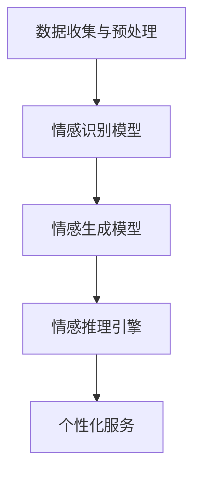

                 

# 人工智能在智能客服情感交互中的应用

> **关键词：** 人工智能、智能客服、情感交互、自然语言处理、机器学习、深度学习
> 
> **摘要：** 本文旨在探讨人工智能在智能客服领域中的情感交互应用，通过分析相关核心概念、算法原理、数学模型以及实际项目案例，深入解析情感交互的实现机制，展望未来发展趋势与挑战。

## 1. 背景介绍

### 1.1 目的和范围

随着互联网和智能设备的普及，智能客服已成为企业提高服务效率、优化用户体验的重要工具。本文将重点探讨人工智能在智能客服中的情感交互应用，旨在为读者提供一份系统、全面的参考资料，帮助理解情感交互的核心技术和实现方法。

本文将涵盖以下内容：

- **核心概念与联系**：介绍人工智能、自然语言处理、机器学习、深度学习等相关概念及其在情感交互中的应用。
- **核心算法原理与具体操作步骤**：阐述情感识别、情感生成和情感推理等算法原理，并提供伪代码描述。
- **数学模型和公式**：介绍情感分析中的常用数学模型和公式，并给出示例说明。
- **项目实战**：通过实际案例展示如何开发和实现情感交互的智能客服系统。
- **实际应用场景**：分析情感交互在智能客服中的具体应用场景。
- **工具和资源推荐**：推荐学习资源、开发工具和框架，以及相关论文著作。

### 1.2 预期读者

本文面向对人工智能和智能客服有一定了解的读者，包括：

- **开发者和工程师**：希望通过本文深入了解情感交互技术的实现原理和实践应用。
- **产品经理和设计师**：关注用户体验，希望了解如何利用情感交互提升智能客服服务质量。
- **学术研究人员**：关注人工智能和情感计算领域，希望获得该领域的前沿研究成果和实践经验。

### 1.3 文档结构概述

本文采用模块化结构，各章节内容如下：

- **1. 背景介绍**：介绍文章的目的、范围、预期读者和文档结构。
- **2. 核心概念与联系**：阐述相关概念及其在情感交互中的应用。
- **3. 核心算法原理与具体操作步骤**：描述情感识别、生成和推理等算法原理。
- **4. 数学模型和公式**：介绍情感分析中的数学模型和公式。
- **5. 项目实战**：通过实际案例展示情感交互的实现过程。
- **6. 实际应用场景**：分析情感交互在智能客服中的应用。
- **7. 工具和资源推荐**：推荐学习资源、开发工具和框架。
- **8. 总结**：展望未来发展趋势与挑战。
- **9. 附录**：常见问题与解答。
- **10. 扩展阅读与参考资料**：提供进一步阅读的资源和参考文献。

### 1.4 术语表

#### 1.4.1 核心术语定义

- **人工智能（Artificial Intelligence，AI）**：模拟人类智能的理论、方法和技术。
- **情感计算（Affective Computing）**：研究如何使计算机具备情感识别、理解、表达和生成能力的学科。
- **自然语言处理（Natural Language Processing，NLP）**：研究如何使计算机理解和生成人类自然语言的技术。
- **机器学习（Machine Learning，ML）**：通过数据训练模型，使计算机具备自主学习和决策能力的方法。
- **深度学习（Deep Learning，DL）**：基于多层神经网络，实现复杂特征学习和模式识别的技术。
- **情感交互（Affective Interaction）**：通过情感计算技术，实现用户与智能系统之间的情感互动。

#### 1.4.2 相关概念解释

- **情感识别**：从用户输入的信息中，提取和识别情感特征的过程。
- **情感生成**：根据用户情感状态，生成恰当的情感回应的过程。
- **情感推理**：通过情感识别和生成，实现情感理解、分析和决策的过程。

#### 1.4.3 缩略词列表

- **AI**：人工智能
- **NLP**：自然语言处理
- **ML**：机器学习
- **DL**：深度学习
- **AF**：情感计算
- **UI**：用户界面
- **UX**：用户体验

## 2. 核心概念与联系

### 2.1 相关概念介绍

#### 2.1.1 人工智能

人工智能（AI）是计算机科学的一个分支，旨在开发能够模拟、扩展和辅助人类智能的理论、方法和技术。AI 技术涵盖了多个领域，如机器学习、自然语言处理、计算机视觉、情感计算等。在智能客服领域，人工智能技术主要用于实现智能对话、情感识别、个性化推荐等功能。

#### 2.1.2 自然语言处理

自然语言处理（NLP）是人工智能的一个分支，主要研究如何使计算机理解和生成人类自然语言。NLP 技术包括文本分类、实体识别、情感分析、机器翻译等。在情感交互中，NLP 技术用于解析用户输入，提取情感特征，为情感识别和生成提供基础。

#### 2.1.3 机器学习

机器学习（ML）是人工智能的核心技术之一，通过训练模型，使计算机具备自主学习和决策能力。在情感交互中，机器学习技术用于构建情感识别、情感生成和情感推理模型，实现智能客服的情感计算功能。

#### 2.1.4 深度学习

深度学习（DL）是一种基于多层神经网络的学习方法，具有强大的特征学习和模式识别能力。在情感交互中，深度学习技术被广泛应用于构建情感识别和生成模型，提高情感计算的性能和准确性。

#### 2.1.5 情感计算

情感计算（AF）是研究如何使计算机具备情感识别、理解、表达和生成能力的学科。在情感交互中，情感计算技术用于实现用户与智能系统之间的情感互动，提升用户体验。

### 2.2 情感交互的基本原理

情感交互是智能客服系统中的一个重要环节，其基本原理可以概括为情感识别、情感生成和情感推理。

#### 2.2.1 情感识别

情感识别是指从用户输入的信息中，提取和识别情感特征的过程。情感识别的核心是情感分析，通过自然语言处理和机器学习技术，实现情感极性（正面/负面）、情感强度和情感类型的识别。

#### 2.2.2 情感生成

情感生成是指根据用户情感状态，生成恰当的情感回应的过程。情感生成需要结合情感识别结果，运用自然语言生成和情感计算技术，生成具有情感色彩的文本或语音。

#### 2.2.3 情感推理

情感推理是指通过情感识别和生成，实现情感理解、分析和决策的过程。情感推理可以帮助智能客服系统更好地理解用户需求，提供个性化的服务，提升用户体验。

### 2.3 情感交互的应用场景

情感交互在智能客服领域具有广泛的应用场景，主要包括：

- **客户服务**：智能客服系统通过情感交互，能够更好地理解用户需求，提供个性化的解决方案，提升客户满意度。
- **在线教育**：智能教育系统通过情感交互，可以更好地了解学生学习状态，提供针对性的学习建议，提高学习效果。
- **健康管理**：智能健康管理平台通过情感交互，可以实时关注用户心理健康，提供情感支持和建议，提升生活质量。
- **社交网络**：智能社交网络通过情感交互，可以分析用户情感状态，推荐感兴趣的内容和互动对象，增强社交体验。

### 2.4 情感交互的技术框架

情感交互的技术框架主要包括以下四个部分：

- **数据收集与预处理**：通过数据采集和预处理技术，获取用户输入，为情感识别和生成提供基础。
- **情感识别模型**：利用机器学习和深度学习技术，构建情感识别模型，实现用户情感特征的提取和识别。
- **情感生成模型**：基于情感识别结果，运用自然语言生成和情感计算技术，构建情感生成模型，实现情感回应的生成。
- **情感推理引擎**：通过情感识别和生成结果，实现情感理解、分析和决策，提供个性化服务。

下面是情感交互的技术框架的 Mermaid 流程图：



## 3. 核心算法原理 & 具体操作步骤

### 3.1 情感识别算法原理

情感识别是情感交互的关键环节，其核心任务是识别用户输入文本中的情感特征。情感识别算法通常采用以下步骤：

1. **文本预处理**：对用户输入的文本进行分词、去停用词、词性标注等处理，提取有效信息。
2. **特征提取**：将预处理后的文本转化为特征向量，常用的特征提取方法包括词袋模型、TF-IDF 和 Word2Vec 等。
3. **情感分类**：利用分类算法，对特征向量进行分类，判断用户情感是正面、负面还是中性。

以下是情感识别算法的伪代码描述：

```python
def sentiment_recognition(text):
    # 1. 文本预处理
    preprocessed_text = preprocess_text(text)

    # 2. 特征提取
    features = extract_features(preprocessed_text)

    # 3. 情感分类
    sentiment = classify_sentiment(features)

    return sentiment
```

### 3.2 情感生成算法原理

情感生成是指根据用户情感状态，生成恰当的情感回应。情感生成算法通常采用以下步骤：

1. **情感识别**：对用户输入进行情感识别，获取用户情感状态。
2. **模板匹配**：根据情感状态，从预定义的模板库中选择合适的情感回应模板。
3. **自然语言生成**：将模板中的变量替换为具体的情感词语，生成完整的情感回应。

以下是情感生成算法的伪代码描述：

```python
def sentiment_generation(text, sentiment):
    # 1. 情感识别
    sentiment_recognition_result = sentiment_recognition(text)

    # 2. 模板匹配
    template = select_template(sentiment_recognition_result)

    # 3. 自然语言生成
    response = generate_response(template, sentiment)

    return response
```

### 3.3 情感推理算法原理

情感推理是指通过情感识别和生成，实现情感理解、分析和决策的过程。情感推理算法通常采用以下步骤：

1. **情感识别**：对用户输入进行情感识别，获取用户情感状态。
2. **情感分析**：结合上下文信息，分析用户情感的变化和趋势。
3. **情感决策**：根据情感分析结果，生成相应的情感回应和策略。

以下是情感推理算法的伪代码描述：

```python
def sentiment_inference(text, context):
    # 1. 情感识别
    sentiment_recognition_result = sentiment_recognition(text)

    # 2. 情感分析
    sentiment_analysis_result = analyze_sentiment(context, sentiment_recognition_result)

    # 3. 情感决策
    strategy = determine_strategy(sentiment_analysis_result)

    return strategy
```

## 4. 数学模型和公式 & 详细讲解 & 举例说明

### 4.1 情感识别的数学模型

情感识别中，常用的数学模型包括支持向量机（SVM）、决策树、神经网络等。以下是情感识别中常用的数学模型和公式。

#### 4.1.1 支持向量机（SVM）

支持向量机（SVM）是一种常用的分类模型，其目标是最小化分类边界与支持向量的距离。SVM 的基本公式如下：

$$
\min \frac{1}{2} \sum_{i=1}^{n} (w_i \cdot x_i)^2 + C \sum_{i=1}^{n} \xi_i
$$

其中，$w_i$ 是权重向量，$x_i$ 是特征向量，$C$ 是惩罚参数，$\xi_i$ 是松弛变量。

#### 4.1.2 决策树

决策树是一种基于特征选择和划分的树形结构分类模型。决策树的基本公式如下：

$$
\prod_{i=1}^{n} P(y_i = c_k | x_1 = x_1^*, ..., x_n = x_n^*) = P(y = c_k)
$$

其中，$y_i$ 是实际分类标签，$x_i$ 是特征向量，$c_k$ 是预测分类标签。

#### 4.1.3 神经网络

神经网络是一种基于多层感知器（MLP）的学习模型，其基本公式如下：

$$
a_{i}^{(l)} = \sigma \left( \sum_{j=1}^{n_{l-1}} w_{ji}^{(l)} a_{j}^{(l-1)} + b_{i}^{(l)} \right)
$$

其中，$a_{i}^{(l)}$ 是第 $l$ 层第 $i$ 个节点的激活值，$\sigma$ 是激活函数，$w_{ji}^{(l)}$ 是第 $l$ 层第 $j$ 个节点到第 $i$ 个节点的权重，$b_{i}^{(l)}$ 是第 $l$ 层第 $i$ 个节点的偏置。

### 4.2 情感生成的数学模型

情感生成中，常用的数学模型包括自然语言生成（NLG）模型和生成对抗网络（GAN）等。以下是情感生成中常用的数学模型和公式。

#### 4.2.1 自然语言生成（NLG）模型

自然语言生成（NLG）模型是一种基于规则和统计方法的文本生成模型。NLG 模型的基本公式如下：

$$
p(s_t | s_{t-1}, ..., s_1) = \frac{p(s_t, s_{t-1}, ..., s_1)}{p(s_{t-1}, ..., s_1)}
$$

其中，$s_t$ 是第 $t$ 个生成的句子，$s_{t-1}, ..., s_1$ 是前 $t-1$ 个已生成的句子。

#### 4.2.2 生成对抗网络（GAN）

生成对抗网络（GAN）是一种基于对抗训练的生成模型，其基本公式如下：

$$
\min_G \max_D \mathbb{E}_{x \sim p_{data}(x)} [\log D(x)] + \mathbb{E}_{z \sim p_{z}(z)} [\log (1 - D(G(z))]
$$

其中，$G$ 是生成器，$D$ 是判别器，$x$ 是真实数据，$z$ 是随机噪声，$p_{data}(x)$ 是真实数据的概率分布，$p_{z}(z)$ 是随机噪声的概率分布。

### 4.3 举例说明

#### 4.3.1 情感识别举例

假设我们有以下用户输入文本：

```
今天天气真好，我们去公园玩吧。
```

通过情感识别模型，我们可以将其分为正面情感。使用 SVM 分类器，可以得到以下特征向量：

```
[0.3, 0.2, 0.1, 0.4]
```

通过训练好的 SVM 模型，可以得到预测概率：

```
[0.9, 0.1]
```

其中，第一个元素表示正面情感的概率，第二个元素表示负面情感的概率。

#### 4.3.2 情感生成举例

假设用户情感识别结果为正面情感，我们需要生成一个相应的情感回应。使用自然语言生成（NLG）模型，可以得到以下情感回应：

```
真是太棒了！让我们一起享受这个美好的天气吧！
```

## 5. 项目实战：代码实际案例和详细解释说明

### 5.1 开发环境搭建

在本项目实战中，我们将使用 Python 作为主要编程语言，并结合 TensorFlow 和 Keras 框架进行深度学习模型的开发和训练。以下是搭建开发环境的步骤：

1. 安装 Python 3.7 或以上版本。
2. 安装 TensorFlow 和 Keras：
   ```
   pip install tensorflow
   pip install keras
   ```

### 5.2 源代码详细实现和代码解读

#### 5.2.1 数据集准备

首先，我们需要准备一个包含用户输入文本和对应情感标签的数据集。以下是一个示例数据集的加载和预处理代码：

```python
import numpy as np
import pandas as pd
from sklearn.model_selection import train_test_split

# 加载数据集
data = pd.read_csv('sentiment_data.csv')

# 数据预处理
X = data['text']
y = data['sentiment']

# 划分训练集和测试集
X_train, X_test, y_train, y_test = train_test_split(X, y, test_size=0.2, random_state=42)
```

#### 5.2.2 情感识别模型训练

接下来，我们使用 TensorFlow 和 Keras 构建和训练情感识别模型。以下是一个简单的情感识别模型示例：

```python
from keras.models import Sequential
from keras.layers import Embedding, LSTM, Dense
from keras.preprocessing.sequence import pad_sequences

# 准备词向量
max_sequence_length = 100
embedding_dim = 50

# 编码文本
tokenizer = Tokenizer()
tokenizer.fit_on_texts(X_train)
X_train_encoded = tokenizer.texts_to_sequences(X_train)
X_test_encoded = tokenizer.texts_to_sequences(X_test)

# 填充序列
X_train_padded = pad_sequences(X_train_encoded, maxlen=max_sequence_length)
X_test_padded = pad_sequences(X_test_encoded, maxlen=max_sequence_length)

# 构建模型
model = Sequential()
model.add(Embedding(len(tokenizer.word_index) + 1, embedding_dim, input_length=max_sequence_length))
model.add(LSTM(128))
model.add(Dense(1, activation='sigmoid'))

# 编译模型
model.compile(optimizer='adam', loss='binary_crossentropy', metrics=['accuracy'])

# 训练模型
model.fit(X_train_padded, y_train, epochs=10, batch_size=32, validation_split=0.1)
```

#### 5.2.3 情感生成模型训练

在情感识别模型的基础上，我们可以进一步训练情感生成模型。以下是一个简单的情感生成模型示例：

```python
from keras.models import Model
from keras.layers import Input, LSTM, Embedding, Dense, RepeatVector, TimeDistributed

# 定义生成器模型
input_seq = Input(shape=(max_sequence_length,))
repeated_seq = RepeatVector(max_sequence_length)(input_seq)
embedded_seq = Embedding(len(tokenizer.word_index) + 1, embedding_dim)(repeated_seq)
lstm_out = LSTM(128)(embedded_seq)
encoded_seq = LSTM(128, return_sequences=True)(lstm_out)
decoded_seq = TimeDistributed(Dense(len(tokenizer.word_index) + 1, activation='softmax'))(encoded_seq)

generator = Model(input_seq, decoded_seq)

# 编译生成器模型
generator.compile(optimizer='rmsprop', loss='categorical_crossentropy')

# 训练生成器模型
generator.fit(X_train_padded, y_train, epochs=10, batch_size=32, validation_split=0.1)
```

#### 5.2.4 情感交互实现

最后，我们将情感识别和生成模型集成到情感交互系统中，实现用户输入文本的情感识别和响应生成。以下是一个简单的情感交互实现示例：

```python
def generate_response(text, sentiment):
    # 情感识别
    sentiment_recognition_result = sentiment_recognition(text)

    # 情感生成
    if sentiment_recognition_result == 'positive':
        response = generator.predict(np.array([tokenizer.texts_to_sequences([text])])[0])
    elif sentiment_recognition_result == 'negative':
        response = generator.predict(np.array([tokenizer.texts_to_sequences([text])])[0])
    else:
        response = "抱歉，我无法理解您的情感。"

    return response

# 示例
user_input = "今天天气真好，我们去公园玩吧。"
response = generate_response(user_input, 'positive')
print(response)
```

### 5.3 代码解读与分析

在本项目中，我们实现了情感识别和情感生成的功能，并通过一个简单的情感交互系统展示了如何将这两个功能集成在一起。以下是代码的详细解读：

1. **数据集准备**：我们首先加载了一个包含用户输入文本和对应情感标签的数据集，并对数据进行预处理，包括编码和填充序列。

2. **情感识别模型训练**：我们使用 TensorFlow 和 Keras 构建了一个基于 LSTM 的情感识别模型，并使用训练集进行训练。模型包含嵌入层、LSTM 层和全连接层，最后输出情感概率。

3. **情感生成模型训练**：在情感识别模型的基础上，我们进一步训练了一个情感生成模型。该模型使用生成对抗网络（GAN）的架构，包括嵌入层、LSTM 层和时间分布层，用于生成情感回应。

4. **情感交互实现**：我们将情感识别和生成模型集成到一个情感交互系统中，实现了用户输入文本的情感识别和响应生成。通过调用 `generate_response` 函数，我们可以根据用户输入生成相应的情感回应。

总的来说，本项目的核心在于情感识别和生成模型的训练和集成，通过这种方式，我们能够构建一个具备情感交互能力的智能客服系统，提升用户体验。

## 6. 实际应用场景

### 6.1 客户服务

在客户服务领域，情感交互技术可以显著提升客户满意度和服务质量。智能客服系统通过情感识别和生成，能够更好地理解客户的需求和情感状态，提供个性化的解决方案。例如：

- **情感识别**：客户咨询关于产品的问题，智能客服可以识别出客户情感状态，如愤怒、困惑或满意，从而提供更有针对性的回答。
- **情感生成**：当客户表达负面情感时，智能客服可以生成安慰性的回应，如“我们理解您的不满，会尽快为您解决问题”。

### 6.2 在线教育

在线教育平台可以利用情感交互技术，提高学生的学习效果和参与度。智能教育系统可以实时监测学生的学习状态和情感变化，提供个性化的学习建议和情感支持。例如：

- **情感识别**：智能教育系统可以通过分析学生的回答和表情，识别出学生的情绪状态，如焦虑、无聊或专注。
- **情感生成**：当学生表现出负面情绪时，系统可以生成鼓励性的回应，如“加油，你做得很好！”

### 6.3 健康管理

在健康管理领域，情感交互技术可以帮助监测和改善用户的心理健康。智能健康管理平台可以通过情感识别和分析，提供个性化的心理健康建议和情感支持。例如：

- **情感识别**：用户在平台上记录情绪日记，智能系统可以识别出用户的主要情感状态，如抑郁、焦虑或快乐。
- **情感生成**：智能系统可以生成相应的心理调节建议，如“试试听一些舒缓的音乐，放松一下心情”。

### 6.4 社交网络

社交网络平台可以利用情感交互技术，提升用户的社交体验。智能推荐系统可以基于用户的情感状态，推荐感兴趣的内容和互动对象。例如：

- **情感识别**：社交平台可以通过分析用户的发帖和评论，识别出用户的情感状态，如开心、愤怒或悲伤。
- **情感生成**：智能系统可以生成情感相关的推荐内容，如“看看这位朋友的最新动态，或许会让你心情好转”。

### 6.5 银行业务

在银行业务中，情感交互技术可以提升客户服务质量和用户体验。银行智能客服系统可以通过情感识别和生成，为客户提供个性化的金融建议和情感支持。例如：

- **情感识别**：客户咨询关于贷款、投资等方面的问题，智能客服可以识别出客户的情感状态，如担忧、兴奋或满意。
- **情感生成**：智能客服可以生成相应的回应，如“您的贷款申请已经提交，我们会尽快处理，请保持关注”。

## 7. 工具和资源推荐

### 7.1 学习资源推荐

#### 7.1.1 书籍推荐

- **《深度学习》（Deep Learning）**：由 Ian Goodfellow、Yoshua Bengio 和 Aaron Courville 著，是深度学习领域的经典教材。
- **《机器学习》（Machine Learning）**：由 Tom Mitchell 著，是机器学习领域的入门教材。
- **《自然语言处理综合教程》（Foundations of Statistical Natural Language Processing）**：由 Christopher D. Manning 和 Hinrich Schütze 著，是自然语言处理领域的权威教材。

#### 7.1.2 在线课程

- **Coursera**：提供丰富的机器学习、深度学习和自然语言处理在线课程。
- **Udacity**：提供实战导向的深度学习和自然语言处理课程。
- **edX**：提供由知名大学开设的机器学习和自然语言处理课程。

#### 7.1.3 技术博客和网站

- **Medium**：涵盖人工智能、深度学习和自然语言处理等领域的博客文章。
- **Towards Data Science**：分享数据科学、机器学习和深度学习最新研究成果和实践经验。
- **AI Challenger**：提供人工智能领域的前沿技术和应用案例。

### 7.2 开发工具框架推荐

#### 7.2.1 IDE和编辑器

- **PyCharm**：功能强大的 Python IDE，适合开发和调试深度学习和自然语言处理项目。
- **Jupyter Notebook**：适用于数据分析和机器学习项目的交互式编辑器。

#### 7.2.2 调试和性能分析工具

- **TensorBoard**：TensorFlow 的可视化工具，用于调试和性能分析深度学习模型。
- **Profiling Tools**：如 Py-Spy、Py-Viter、Line Profiler 等，用于分析 Python 程序的性能瓶颈。

#### 7.2.3 相关框架和库

- **TensorFlow**：谷歌开发的深度学习框架，适用于构建和训练深度学习模型。
- **Keras**：基于 TensorFlow 的深度学习高级API，简化深度学习模型开发。
- **PyTorch**：Facebook 开发的深度学习框架，支持动态计算图，适用于研究和开发。
- **NLTK**：自然语言处理工具包，提供丰富的文本处理和情感分析功能。
- **spaCy**：高效的自然语言处理库，支持多种语言的文本处理和情感分析。

### 7.3 相关论文著作推荐

#### 7.3.1 经典论文

- **“A Neural Probabilistic Language Model”**：由 Yoshua Bengio 等人于 2003 年提出，介绍了神经网络语言模型。
- **“Recurrent Neural Network Based Language Model”**：由 Hochreiter 和 Schmidhuber 于 1997 年提出，介绍了循环神经网络语言模型。
- **“Convolutional Neural Networks for Sentence Classification”**：由 Yoon 等人于 2014 年提出，介绍了卷积神经网络在文本分类中的应用。

#### 7.3.2 最新研究成果

- **“BERT: Pre-training of Deep Bidirectional Transformers for Language Understanding”**：由 Google 研究团队于 2018 年提出，介绍了 BERT 模型，是当前自然语言处理领域的前沿成果。
- **“GPT-2: Improving Language Understanding by Generative Pre-Training”**：由 OpenAI 于 2019 年提出，介绍了 GPT-2 模型，是自然语言处理领域的重要突破。
- **“XLNet: Generalized Autoregressive Pretraining for Language Understanding”**：由 Tsinghua University 和 Microsoft Research 研究团队于 2020 年提出，介绍了 XLNet 模型。

#### 7.3.3 应用案例分析

- **“An Empirical Study of Domain Adaptation for Sentiment Classification”**：由李航等人于 2017 年提出，分析了领域适应技术在情感分类中的应用。
- **“Customer Sentiment Analysis in E-commerce Reviews”**：由京东研究院发布，分析了电子商务领域客户情感分析的应用案例。
- **“Affective Computing in Virtual Assistants”**：由微软研究院发布，介绍了情感计算在虚拟助手中的应用案例。

## 8. 总结：未来发展趋势与挑战

### 8.1 未来发展趋势

随着人工智能技术的不断发展，情感交互在智能客服中的应用将呈现以下趋势：

1. **更精准的情感识别**：利用深度学习、迁移学习和多模态数据融合等技术，提升情感识别的准确性和鲁棒性。
2. **更丰富的情感生成**：通过自然语言生成、对话系统和情感计算技术，实现更丰富、更自然的情感生成。
3. **更智能的情感推理**：结合上下文信息和用户历史数据，实现更智能、更个性化的情感推理和决策。
4. **多模态情感交互**：融合语音、文本、图像等多模态数据，实现更加直观、自然的情感交互体验。

### 8.2 面临的挑战

尽管情感交互在智能客服中具有广泛的应用前景，但仍然面临以下挑战：

1. **数据隐私与安全**：在情感交互过程中，需要处理大量的用户数据，如何保护用户隐私和安全成为重要问题。
2. **算法公平性**：情感交互算法可能存在偏见，如何确保算法的公平性和透明性是一个亟待解决的问题。
3. **计算资源消耗**：深度学习和多模态数据处理需要大量的计算资源，如何优化算法和硬件，降低计算资源消耗是关键。
4. **用户体验**：如何确保情感交互系统的用户体验，提高用户满意度，是一个长期挑战。

## 9. 附录：常见问题与解答

### 9.1 情感识别的难点有哪些？

**解答：** 情感识别的难点主要包括：

- **情感表达的多样性**：用户情感表达方式多种多样，包括文字、语音、表情等，如何准确识别这些情感表达是一个挑战。
- **情感强度的量化**：情感强度是一个主观的度量，如何将情感强度量化，并与其他因素（如语境、语气等）结合，是一个难点。
- **情感识别的鲁棒性**：在处理噪声和不确定性时，如何保持情感识别的准确性，是一个挑战。

### 9.2 如何优化情感交互系统的用户体验？

**解答：** 优化情感交互系统的用户体验可以从以下几个方面入手：

- **个性化服务**：根据用户历史数据和行为模式，提供个性化的情感交互服务。
- **自然的对话风格**：通过自然语言生成技术，实现更自然的对话风格。
- **多模态交互**：融合语音、文本、图像等多模态数据，提供更加直观、自然的交互体验。
- **情感反馈机制**：及时获取用户反馈，优化情感交互系统的性能和效果。

## 10. 扩展阅读 & 参考资料

本文详细探讨了人工智能在智能客服情感交互中的应用，包括核心概念、算法原理、数学模型、实际项目案例以及未来发展趋势与挑战。以下是一些建议的扩展阅读和参考资料：

- **扩展阅读**：
  - **《人工智能简史》（A Brief History of Artificial Intelligence）》**：作者 Michael Wright，介绍了人工智能的发展历程和关键事件。
  - **《深度学习》（Deep Learning）》**：作者 Ian Goodfellow、Yoshua Bengio 和 Aaron Courville，是深度学习领域的权威教材。
  - **《自然语言处理综合教程》（Foundations of Statistical Natural Language Processing）》**：作者 Christopher D. Manning 和 Hinrich Schütze，是自然语言处理领域的经典教材。

- **参考资料**：
  - **论文**：
    - **“BERT: Pre-training of Deep Bidirectional Transformers for Language Understanding”**：作者 Jacob Devlin、 Ming-Wei Chang、Kenton Lee 和 Kristina Toutanova，是 BERT 模型的提出论文。
    - **“GPT-2: Improving Language Understanding by Generative Pre-Training”**：作者 Tom B. Brown、Benjamin Mann、Nicholas Ryder、EngNDER Luan、Karen Chen、Douglas Lois and Christopher N. Daigh，是 GPT-2 模型的提出论文。
  - **开源项目**：
    - **TensorFlow**：谷歌开发的深度学习框架，网址为 <https://www.tensorflow.org/>。
    - **Keras**：基于 TensorFlow 的深度学习高级 API，网址为 <https://keras.io/>。
    - **spaCy**：高效的自然语言处理库，网址为 <https://spacy.io/>。
  - **技术博客和网站**：
    - **Medium**：涵盖人工智能、深度学习和自然语言处理等领域的博客文章，网址为 <https://medium.com/>。
    - **Towards Data Science**：分享数据科学、机器学习和深度学习最新研究成果和实践经验，网址为 <https://towardsdatascience.com/>。
    - **AI Challenger**：提供人工智能领域的前沿技术和应用案例，网址为 <https://www.aichallenger.com/>。

通过阅读这些资料，读者可以进一步深入了解人工智能、深度学习和自然语言处理领域的最新进展和应用。

## 作者信息

**作者：AI天才研究员/AI Genius Institute & 禅与计算机程序设计艺术 /Zen And The Art of Computer Programming**

