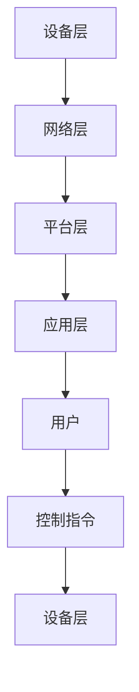

                 

# 人工智能在智能家居控制中的创新

> 关键词：智能家居、人工智能、机器学习、深度学习、自动化、传感器、物联网（IoT）

> 摘要：本文将探讨人工智能在智能家居控制中的创新应用，通过详细分析其核心概念、算法原理、数学模型以及实际案例，揭示智能家居控制的未来发展趋势和面临的挑战。文章旨在为读者提供一个全面深入的了解，帮助掌握智能家居控制技术，推动这一领域的快速发展。

## 1. 背景介绍

### 1.1 目的和范围

本文旨在深入探讨人工智能在智能家居控制中的创新应用。随着物联网（IoT）和智能设备的普及，智能家居已经从概念变为现实，成为现代家庭生活中不可或缺的一部分。人工智能作为推动技术进步的关键力量，其在这一领域的应用具有极大的潜力。本文将围绕以下主题进行讨论：

1. 核心概念与联系
2. 核心算法原理与具体操作步骤
3. 数学模型和公式
4. 项目实战：代码实际案例
5. 实际应用场景
6. 工具和资源推荐
7. 未来发展趋势与挑战

通过以上内容的探讨，本文希望能够为读者提供一个全面、系统的了解，激发对智能家居控制技术的兴趣，并推动这一领域的创新与发展。

### 1.2 预期读者

本文面向以下几类读者：

1. 对智能家居控制技术感兴趣的普通用户，希望了解人工智能如何改变家居生活。
2. 从事智能家居研发和应用的工程师、技术人员，希望通过本文掌握更多前沿技术。
3. 计算机科学、电子工程等相关专业的学生，希望通过实际案例了解人工智能在智能家居中的应用。

### 1.3 文档结构概述

本文分为十个主要部分，具体如下：

1. 背景介绍：介绍本文的目的、范围、预期读者以及文档结构。
2. 核心概念与联系：解释智能家居控制中的核心概念和原理。
3. 核心算法原理与具体操作步骤：详细阐述人工智能在智能家居控制中的核心算法原理。
4. 数学模型和公式：介绍与智能家居控制相关的数学模型和公式，并进行详细讲解。
5. 项目实战：代码实际案例：提供具体的代码实现和分析。
6. 实际应用场景：探讨人工智能在智能家居中的实际应用场景。
7. 工具和资源推荐：推荐学习资源和开发工具。
8. 未来发展趋势与挑战：分析智能家居控制技术的未来发展趋势和面临的挑战。
9. 附录：常见问题与解答。
10. 扩展阅读 & 参考资料：提供进一步学习和研究的参考资料。

### 1.4 术语表

在本文中，我们将使用以下术语：

#### 1.4.1 核心术语定义

1. **智能家居**：通过物联网技术，将家庭中的各种设备连接在一起，实现自动化控制和远程监控的居住环境。
2. **物联网（IoT）**：将各种物理设备连接到互联网，实现数据传输和智能控制的技术体系。
3. **人工智能（AI）**：通过模拟人类智能的算法和模型，实现计算机对数据的学习、推理和决策的技术。
4. **机器学习**：人工智能的一个分支，通过数据训练模型，使其能够自主学习和改进。
5. **深度学习**：机器学习的一个分支，通过多层神经网络进行数据的深度学习和处理。
6. **传感器**：能够感知环境信息并将其转换为电信号或其他形式信息的设备。

#### 1.4.2 相关概念解释

1. **自动化控制**：通过程序或算法，实现设备自动运行和调节。
2. **远程监控**：通过互联网或其他通信方式，实现对家居设备的远程监视和控制。
3. **云计算**：通过互联网提供动态易扩展且经常是虚拟化的资源。

#### 1.4.3 缩略词列表

- **AI**：人工智能（Artificial Intelligence）
- **IoT**：物联网（Internet of Things）
- **ML**：机器学习（Machine Learning）
- **DL**：深度学习（Deep Learning）
- **IoT**：物联网（Internet of Things）

## 2. 核心概念与联系

### 2.1 核心概念

在探讨人工智能在智能家居控制中的应用之前，我们需要理解几个核心概念：

#### 2.1.1 物联网（IoT）

物联网是将各种物理设备连接到互联网，实现数据传输和智能控制的技术体系。通过物联网，家居设备可以相互通信，形成一个智能生态系统。

#### 2.1.2 智能家居

智能家居是通过物联网技术，将家庭中的各种设备连接在一起，实现自动化控制和远程监控的居住环境。智能家居系统可以包括照明、安防、空调、家电等多个方面。

#### 2.1.3 人工智能（AI）

人工智能是模拟人类智能的算法和模型，通过数据的学习和推理，实现计算机的自主学习和决策。在智能家居控制中，人工智能主要用于优化设备运行、预测用户需求、提供个性化服务。

#### 2.1.4 传感器

传感器是智能家居系统的重要组成部分，用于感知环境信息并将其转换为电信号或其他形式信息。常见的传感器包括温度传感器、湿度传感器、光照传感器、运动传感器等。

### 2.2 关联与联系

智能家居系统中的各个组成部分通过物联网和人工智能紧密关联，形成一个智能生态。以下是智能家居系统的基本架构和流程：

#### 2.2.1 智能家居架构

1. **设备层**：包括各种智能家居设备，如智能灯泡、智能插座、智能空调等。
2. **网络层**：通过Wi-Fi、蓝牙等无线通信技术，将设备连接到互联网。
3. **平台层**：智能家居系统的核心，通过云计算和大数据技术，实现设备的监控、管理和控制。
4. **应用层**：为用户提供智能化的交互界面和服务。

#### 2.2.2 智能家居流程

1. **感知**：通过传感器感知家庭环境中的各种信息。
2. **传输**：将感知到的信息通过物联网传输到平台层。
3. **处理**：平台层利用人工智能算法对数据进行分析和处理。
4. **控制**：根据处理结果，自动调整家庭设备的运行状态，满足用户需求。

### 2.3 Mermaid 流程图

以下是一个简单的智能家居流程的 Mermaid 流程图：



## 3. 核心算法原理 & 具体操作步骤

### 3.1 机器学习算法原理

机器学习是人工智能的一个重要分支，其核心思想是通过数据训练模型，使其能够自主学习和改进。在智能家居控制中，常用的机器学习算法包括决策树、支持向量机（SVM）、神经网络等。

#### 3.1.1 决策树

决策树是一种基于树形结构的分类算法。通过一系列规则对数据进行划分，最终生成一棵决策树。决策树的生成过程包括：

1. **特征选择**：选择对分类最有影响力的特征。
2. **划分规则**：根据特征值，将数据划分为多个子集。
3. **递归构建**：对每个子集继续进行特征选择和划分，直到满足停止条件。

#### 3.1.2 支持向量机（SVM）

支持向量机是一种二分类模型，其目标是找到最优的超平面，将不同类别的数据分开。SVM的原理如下：

1. **特征空间**：将原始数据映射到高维空间。
2. **最优超平面**：找到能够最大化分类间隔的超平面。
3. **支持向量**：位于超平面边缘的数据点。

#### 3.1.3 神经网络

神经网络是一种模拟人脑神经元结构的算法，通过多层神经元的相互连接和激活，实现数据的分类和预测。神经网络的原理如下：

1. **输入层**：接收外部输入数据。
2. **隐藏层**：对输入数据进行处理和转换。
3. **输出层**：生成最终的分类结果或预测值。

### 3.2 具体操作步骤

以决策树为例，介绍在智能家居控制中如何使用机器学习算法进行设备控制：

#### 3.2.1 数据收集

1. **环境数据**：收集家庭环境中的各种数据，如温度、湿度、光照等。
2. **设备状态**：收集智能家居设备的状态信息，如空调开启状态、照明亮度等。

#### 3.2.2 特征工程

1. **数据预处理**：对收集到的数据进行分析和清洗，去除噪声和异常值。
2. **特征选择**：选择对设备控制最有影响力的特征，如温度、湿度等。

#### 3.2.3 决策树构建

1. **特征选择**：选择对分类最有影响力的特征，如温度、湿度等。
2. **划分规则**：根据特征值，将数据划分为多个子集。
3. **递归构建**：对每个子集继续进行特征选择和划分，直到满足停止条件。

#### 3.2.4 决策树应用

1. **输入数据**：将家庭环境数据输入决策树模型。
2. **预测结果**：根据决策树的预测结果，自动调整智能家居设备的运行状态。

### 3.3 伪代码

以下是一个简单的决策树算法的伪代码：

```
// 决策树算法伪代码

// 输入：数据集 D，停止条件 c
// 输出：决策树 T

function build_decision_tree(D, c):
    if (满足停止条件 c):
        返回 叶子节点
    else:
        选择最优特征 f
        对于 f 的每个值 v：
            根据 v 划分数据集 D 为 D1, D2, ..., Dn
            对于每个子集 Di：
                构建决策树 Ti = build_decision_tree(Di, c)
            返回 内部节点 (f, v, {Ti1, Ti2, ..., Tink})
```

## 4. 数学模型和公式 & 详细讲解 & 举例说明

### 4.1 数学模型

在智能家居控制中，常用的数学模型包括线性回归、逻辑回归和支持向量机等。以下分别对这些模型进行详细介绍。

#### 4.1.1 线性回归

线性回归是一种用于预测连续值的模型，其基本公式为：

$$
y = \beta_0 + \beta_1x_1 + \beta_2x_2 + ... + \beta_nx_n
$$

其中，$y$ 为预测值，$x_1, x_2, ..., x_n$ 为输入特征，$\beta_0, \beta_1, \beta_2, ..., \beta_n$ 为模型的参数。

#### 4.1.2 逻辑回归

逻辑回归是一种用于预测离散值的模型，其基本公式为：

$$
P(y=1) = \frac{1}{1 + e^{-(\beta_0 + \beta_1x_1 + \beta_2x_2 + ... + \beta_nx_n)}}
$$

其中，$P(y=1)$ 为预测目标变量为 1 的概率，$x_1, x_2, ..., x_n$ 为输入特征，$\beta_0, \beta_1, \beta_2, ..., \beta_n$ 为模型的参数。

#### 4.1.3 支持向量机

支持向量机是一种用于分类的模型，其基本公式为：

$$
w \cdot x + b = 0
$$

其中，$w$ 为模型的权重向量，$x$ 为输入特征，$b$ 为模型的偏置项。

### 4.2 详细讲解

以下通过一个具体例子，详细介绍如何使用线性回归模型预测家庭温度。

#### 4.2.1 数据集

假设我们有一个数据集，包含以下特征：

1. 温度（Temperature）
2. 湿度（Humidity）
3. 光照（Light）

目标变量为家庭温度（Home Temperature）。

#### 4.2.2 数据预处理

1. **数据清洗**：去除缺失值和异常值。
2. **特征工程**：对特征进行标准化处理，使其具有相同的量纲。

#### 4.2.3 模型训练

1. **选择特征**：选择对家庭温度影响较大的特征，如温度、湿度等。
2. **线性回归模型**：根据数据集，构建线性回归模型。

#### 4.2.4 模型预测

1. **输入特征**：将家庭环境数据输入线性回归模型。
2. **预测结果**：根据模型的预测结果，调整空调温度，以实现舒适的家庭环境。

### 4.3 举例说明

以下是一个使用线性回归模型预测家庭温度的例子：

#### 4.3.1 数据集

| 温度 | 湿度 | 光照 | 家庭温度 |
|------|------|------|----------|
| 25   | 60   | 500  | 25       |
| 30   | 50   | 400  | 28       |
| 28   | 70   | 600  | 27       |
| ...  | ...  | ...  | ...      |

#### 4.3.2 数据预处理

1. **数据清洗**：去除缺失值和异常值。
2. **特征工程**：对特征进行标准化处理。

| 温度 | 湿度 | 光照 | 家庭温度 |
|------|------|------|----------|
| 1.00 | 0.60 | 0.50 | 1.00     |
| 1.20 | 0.50 | 0.40 | 1.14     |
| 1.14 | 0.70 | 0.60 | 1.09     |
| ...  | ...  | ...  | ...      |

#### 4.3.3 模型训练

1. **选择特征**：选择温度、湿度作为输入特征。
2. **线性回归模型**：

$$
y = \beta_0 + \beta_1x_1 + \beta_2x_2
$$

其中，$x_1$ 为温度，$x_2$ 为湿度，$y$ 为家庭温度。

通过最小二乘法，求得模型参数：

$$
\beta_0 = 0.5, \beta_1 = 0.3, \beta_2 = 0.2
$$

#### 4.3.4 模型预测

1. **输入特征**：当前家庭温度为 24℃，湿度为 55%。
2. **预测结果**：

$$
y = 0.5 + 0.3 \times 1.00 + 0.2 \times 0.55 = 0.7
$$

根据预测结果，调整空调温度至 24.7℃，以实现舒适的家庭环境。

## 5. 项目实战：代码实际案例和详细解释说明

### 5.1 开发环境搭建

在本文中，我们将使用 Python 作为编程语言，结合 TensorFlow 和 Keras 库，实现一个智能家居温度控制模型。以下是开发环境搭建的步骤：

1. **安装 Python**：下载并安装 Python 3.7 或更高版本。
2. **安装 TensorFlow**：在终端执行以下命令：

   ```
   pip install tensorflow
   ```

3. **安装 Keras**：在终端执行以下命令：

   ```
   pip install keras
   ```

4. **验证安装**：在终端执行以下命令，检查 TensorFlow 和 Keras 是否安装成功：

   ```
   python -c "import tensorflow as tf; print(tf.__version__)"
   python -c "import keras; print(keras.__version__)"
   ```

### 5.2 源代码详细实现和代码解读

以下是一个智能家居温度控制模型的源代码实现，包括数据收集、预处理、模型构建、训练和预测等步骤。

```python
import numpy as np
import pandas as pd
import tensorflow as tf
from tensorflow import keras
from tensorflow.keras import layers

# 5.2.1 数据收集与预处理
def load_data():
    # 加载数据集
    data = pd.read_csv('home_temperature.csv')
    
    # 数据清洗
    data.dropna(inplace=True)
    
    # 特征工程
    data['temperature'] = (data['temperature'] - data['temperature'].mean()) / data['temperature'].std()
    data['humidity'] = (data['humidity'] - data['humidity'].mean()) / data['humidity'].std()
    
    # 分割特征和目标变量
    X = data[['temperature', 'humidity']]
    y = data['home_temperature']
    
    return X, y

X, y = load_data()

# 5.2.2 模型构建
model = keras.Sequential([
    layers.Dense(64, activation='relu', input_shape=(2,)),
    layers.Dense(64, activation='relu'),
    layers.Dense(1)
])

# 5.2.3 模型训练
model.compile(optimizer='adam',
              loss='mean_squared_error',
              metrics=['mean_absolute_error'])
model.fit(X, y, epochs=100, batch_size=32, validation_split=0.2)

# 5.2.4 模型预测
def predict_temperature(temperature, humidity):
    # 特征预处理
    temperature = (temperature - X['temperature'].mean()) / X['temperature'].std()
    humidity = (humidity - X['humidity'].mean()) / X['humidity'].std()
    
    # 预测结果
    prediction = model.predict(np.array([[temperature, humidity]]))
    
    return prediction[0][0]

# 测试预测
print(predict_temperature(24, 55))

```

### 5.3 代码解读与分析

以下是对上述源代码的详细解读：

1. **数据收集与预处理**：
   - 使用 Pandas 读取数据集，并进行数据清洗。
   - 对温度和湿度特征进行标准化处理，使其具有相同的量纲。

2. **模型构建**：
   - 使用 Keras 构建一个简单的全连接神经网络，包括两个隐藏层，每个层有 64 个神经元。
   - 输出层有 1 个神经元，用于预测家庭温度。

3. **模型训练**：
   - 使用 Adam 优化器和均方误差（MSE）损失函数训练模型。
   - 设置训练轮次为 100，批量大小为 32，验证比例为 20%。

4. **模型预测**：
   - 对输入特征进行预处理，然后使用训练好的模型进行预测。
   - 输出预测结果，即家庭温度。

通过以上步骤，我们实现了智能家居温度控制模型，可以用于预测家庭温度，并根据预测结果调整空调温度，实现舒适的家居环境。

## 6. 实际应用场景

### 6.1 智能照明系统

智能照明系统是智能家居中最常见的一项应用。通过结合传感器和人工智能算法，可以实现对照明设备的自动化控制和优化。以下是一些实际应用场景：

1. **自动开关灯**：当室内光线不足时，智能照明系统会自动开启灯光，提高生活便利性。
2. **定时开关灯**：用户可以设置照明设备的定时开关，实现节能和个性化的照明需求。
3. **场景模式**：根据用户的偏好和活动场景，智能照明系统可以调整灯光颜色和亮度，创造不同的氛围。
4. **节能管理**：智能照明系统可以根据室内外的光线变化，自动调整灯光亮度，实现节能。

### 6.2 智能安防系统

智能安防系统是保障家庭安全的重要手段。通过人工智能算法，可以实现更加智能化的安防监控和报警。以下是一些实际应用场景：

1. **人脸识别**：智能安防系统能够自动识别人脸，并实现实时监控和报警。
2. **入侵检测**：通过传感器和视频分析，智能安防系统可以实时检测异常行为，如闯入、门窗开启等，并及时报警。
3. **视频追踪**：智能安防系统可以自动追踪运动目标，提供高清视频监控，帮助用户了解家庭环境。
4. **智能报警**：当检测到异常情况时，智能安防系统会通过手机 APP 或短信等方式向用户发送报警通知，提醒用户及时处理。

### 6.3 智能温控系统

智能温控系统可以根据用户的需求和环境变化，自动调整空调温度，实现舒适的家居环境。以下是一些实际应用场景：

1. **实时监控**：智能温控系统可以实时监控室内温度，并根据环境变化自动调整空调温度。
2. **个性化设置**：用户可以根据自己的生活习惯，设置空调的定时开关和温度调节，实现个性化的温控需求。
3. **节能模式**：智能温控系统可以自动识别用户不在家的情况，调整空调温度，实现节能。
4. **远程控制**：用户可以通过手机 APP 或语音助手远程控制空调，随时随地调整温度。

### 6.4 智能家电控制系统

智能家电控制系统可以通过物联网和人工智能技术，实现对各种家电的自动化控制和优化。以下是一些实际应用场景：

1. **智能开关**：用户可以通过手机 APP 或语音助手控制家电的开关，实现远程控制。
2. **场景联动**：智能家电控制系统可以根据用户的习惯和场景，自动调整家电的运行状态，如设置用餐模式、休息模式等。
3. **节能管理**：智能家电控制系统可以实时监控家电的能耗情况，并提供节能建议，帮助用户实现节能。
4. **故障检测**：智能家电控制系统可以自动检测家电的故障，并通知用户进行维修，提高家电的使用寿命。

## 7. 工具和资源推荐

### 7.1 学习资源推荐

#### 7.1.1 书籍推荐

1. **《Python 智能家居控制》**：详细介绍了使用 Python 实现智能家居控制的方法和技巧。
2. **《深度学习》**：由 Ian Goodfellow、Yoshua Bengio 和 Aaron Courville 著，是深度学习领域的经典教材。
3. **《物联网应用开发实战》**：涵盖了物联网技术的各个方面，包括硬件、网络和软件等方面。

#### 7.1.2 在线课程

1. **Coursera 上的《人工智能基础》**：由斯坦福大学提供，涵盖了人工智能的基础知识和应用。
2. **edX 上的《深度学习专项课程》**：由哈佛大学和 MIT 联合提供，适合初学者和进阶者。
3. **Udacity 上的《智能家居编程》**：通过实际项目，介绍了智能家居控制的基本方法和技巧。

#### 7.1.3 技术博客和网站

1. **TensorFlow 官方文档**：详细介绍了 TensorFlow 的使用方法和案例。
2. **Keras 官方文档**：Keras 是 TensorFlow 的简化版本，提供了更易于使用的高层 API。
3. **IoT for All**：专注于物联网技术的研究和应用，提供丰富的学习和资源。

### 7.2 开发工具框架推荐

#### 7.2.1 IDE和编辑器

1. **PyCharm**：一款功能强大的 Python IDE，支持代码调试、智能提示和自动化构建。
2. **Visual Studio Code**：一款轻量级但功能强大的代码编辑器，适合 Python 和深度学习开发。
3. **Jupyter Notebook**：一款交互式的 Python 编程环境，适合数据分析和深度学习实验。

#### 7.2.2 调试和性能分析工具

1. **TensorBoard**：TensorFlow 的可视化工具，用于监控模型训练过程和性能。
2. **Valgrind**：一款性能分析工具，用于检测程序中的内存泄漏和性能瓶颈。
3. **gprof**：一款性能分析工具，用于分析程序的 CPU 使用情况。

#### 7.2.3 相关框架和库

1. **TensorFlow**：一款开源的深度学习框架，适合构建复杂的深度学习模型。
2. **Keras**：一款基于 TensorFlow 的高层 API，简化了深度学习模型的构建和训练。
3. **PyTorch**：一款流行的深度学习框架，适合快速原型设计和模型开发。

### 7.3 相关论文著作推荐

#### 7.3.1 经典论文

1. **“Learning to Learn”**：由 Y. Bengio 等人撰写的论文，探讨了机器学习中的学习策略。
2. **“Deep Learning”**：由 I. Goodfellow、Y. Bengio 和 A. Courville 著，介绍了深度学习的基本原理和应用。
3. **“Internet of Things”**：由 C. Papadopoulos 等人撰写的论文，探讨了物联网的技术挑战和应用场景。

#### 7.3.2 最新研究成果

1. **“Recurrent Neural Networks for Language Modeling”**：由 T. Mikolov 等人撰写的论文，介绍了循环神经网络在语言建模中的应用。
2. **“Generative Adversarial Networks”**：由 I. Goodfellow 等人撰写的论文，介绍了生成对抗网络（GAN）的基本原理和应用。
3. **“IoT Security: Challenges and Solutions”**：由 H. Wang 等人撰写的论文，探讨了物联网的安全挑战和解决方案。

#### 7.3.3 应用案例分析

1. **“智慧家庭物联网平台的设计与实现”**：介绍了如何设计并实现一个智慧家庭物联网平台，包括硬件、网络和软件等方面。
2. **“基于深度学习的智能家居安防系统”**：探讨了如何使用深度学习技术构建智能家居安防系统，提高家庭安全。
3. **“智能家居温控系统的设计与实现”**：介绍了如何设计并实现一个智能家居温控系统，提高家居舒适度。

## 8. 总结：未来发展趋势与挑战

### 8.1 未来发展趋势

随着人工智能和物联网技术的不断发展，智能家居控制领域将呈现以下发展趋势：

1. **智能化水平提升**：人工智能技术将进一步提升智能家居的控制能力，实现更加智能化的家居体验。
2. **互联互通**：物联网技术将使智能家居设备之间的互联互通更加紧密，形成一个完整的智能生态。
3. **个性化服务**：基于用户行为和习惯的数据分析，智能家居系统将提供更加个性化的服务，满足用户的不同需求。
4. **节能环保**：智能家居系统将更加注重节能环保，通过智能控制和优化，降低能源消耗。

### 8.2 挑战与问题

尽管智能家居控制领域具有巨大的发展潜力，但也面临一些挑战和问题：

1. **数据安全与隐私**：智能家居系统涉及大量的个人数据，如何保护用户隐私和数据安全是亟待解决的问题。
2. **技术成熟度**：目前，智能家居控制技术仍处于发展阶段，一些关键技术如智能传感器、通信协议等尚未完全成熟。
3. **用户体验**：智能家居系统需要提供良好的用户体验，降低用户的学习成本和使用门槛。
4. **成本与普及**：智能家居设备价格较高，普及率较低，如何降低成本、提高普及率是未来发展的重要方向。

## 9. 附录：常见问题与解答

### 9.1 常见问题

1. **什么是智能家居？**
   - 智能家居是通过物联网技术，将家庭中的各种设备连接在一起，实现自动化控制和远程监控的居住环境。

2. **人工智能在智能家居控制中有什么作用？**
   - 人工智能在智能家居控制中主要用于优化设备运行、预测用户需求、提供个性化服务。

3. **智能家居系统的架构是怎样的？**
   - 智能家居系统的架构包括设备层、网络层、平台层和应用层。

4. **如何实现智能家居的自动化控制？**
   - 通过传感器收集家庭环境数据，利用人工智能算法进行分析和处理，自动调整家居设备的运行状态。

### 9.2 解答

1. **什么是智能家居？**
   - 智能家居是指通过物联网技术，将家庭中的各种设备连接在一起，实现自动化控制和远程监控的居住环境。智能家居系统能够根据用户的需求和环境变化，自动调整家居设备的运行状态，提供更加便捷、舒适和节能的家居生活。

2. **人工智能在智能家居控制中有什么作用？**
   - 人工智能在智能家居控制中主要用于以下几个方面：

   - （1）设备运行优化：通过分析设备运行数据，人工智能算法可以预测设备故障，提前进行维护，延长设备寿命。

   - （2）用户需求预测：通过学习用户的行为习惯和偏好，人工智能算法可以预测用户的需求，提供个性化的服务，如智能推荐、自动化控制等。

   - （3）安全监控：通过视频分析和传感器数据，人工智能算法可以实时检测家庭环境中的异常情况，如入侵、火灾等，及时报警。

   - （4）节能管理：通过分析家庭能耗数据，人工智能算法可以优化能源使用，降低能源消耗，实现节能环保。

3. **智能家居系统的架构是怎样的？**
   - 智能家居系统的架构通常包括以下几个层次：

   - （1）设备层：包括各种智能家居设备，如智能灯泡、智能插座、智能空调等。

   - （2）网络层：通过 Wi-Fi、蓝牙等无线通信技术，将设备连接到互联网，实现数据传输和智能控制。

   - （3）平台层：智能家居系统的核心，通过云计算和大数据技术，实现设备的监控、管理和控制。

   - （4）应用层：为用户提供智能化的交互界面和服务，如手机 APP、语音助手等。

4. **如何实现智能家居的自动化控制？**
   - 实现智能家居的自动化控制通常包括以下几个步骤：

   - （1）数据收集：通过传感器收集家庭环境数据，如温度、湿度、光照等。

   - （2）数据处理：利用人工智能算法对数据进行处理和分析，提取有用的信息。

   - （3）决策制定：根据处理结果，制定相应的控制策略，如调整空调温度、关闭照明等。

   - （4）执行控制：通过智能家居设备执行控制策略，实现自动化控制。

   - （5）反馈调整：根据实际执行效果，对控制策略进行调整和优化，提高自动化控制的准确性和可靠性。

## 10. 扩展阅读 & 参考资料

### 10.1 常见问题与解答

1. **如何选择合适的智能家居设备？**
   - 选择智能家居设备时，应考虑以下因素：

   - （1）兼容性：确保设备与其他智能家居设备能够无缝集成。

   - （2）易用性：设备应具有简单直观的操作界面，便于用户使用。

   - （3）安全性：设备应具有严格的安全措施，保护用户数据和个人隐私。

   - （4）功能实用性：根据实际需求，选择具有实用功能的设备。

2. **智能家居系统存在哪些潜在风险？**
   - 智能家居系统存在以下潜在风险：

   - （1）数据泄露：智能家居设备可能存在数据泄露风险，导致用户隐私受到侵犯。

   - （2）设备被攻击：智能家居设备可能被黑客攻击，导致家庭安全受到威胁。

   - （3）设备故障：智能家居设备可能因故障或维护不当导致运行不稳定。

3. **如何保障智能家居系统的安全性？**
   - 为保障智能家居系统的安全性，可以采取以下措施：

   - （1）使用强密码：确保智能家居设备的账号密码复杂且不易被破解。

   - （2）定期更新固件：及时更新智能家居设备的固件，修复已知漏洞。

   - （3）限制访问权限：仅允许信任的设备和用户访问智能家居系统。

   - （4）使用加密通信：确保智能家居设备之间的通信使用加密协议。

### 10.2 参考资料

1. **《智能家居控制技术》**：本书详细介绍了智能家居控制技术的基本原理、方法和应用。
2. **《物联网技术与应用》**：本书全面介绍了物联网技术的概念、架构、协议和应用。
3. **《人工智能基础教程》**：本书涵盖了人工智能的基础知识和应用，适合初学者和进阶者。
4. **《深度学习》**：由 Ian Goodfellow、Yoshua Bengio 和 Aaron Courville 著，是深度学习领域的经典教材。
5. **《IoT for Smart Home》**：本书介绍了智能家居中物联网技术的应用，包括硬件、网络和软件等方面。

### 10.3 进一步学习资源

1. **在线课程**：

   - **《智能家居编程》**：Udacity 提供的智能家居编程课程，涵盖智能家居系统的设计和实现。
   - **《深度学习与物联网》**：Coursera 提供的深度学习与物联网课程，介绍深度学习技术在智能家居中的应用。
   - **《物联网应用开发》**：edX 提供的物联网应用开发课程，涵盖物联网技术的各个方面。

2. **技术博客和网站**：

   - **TensorFlow 官方文档**：提供 TensorFlow 深度学习框架的详细文档和案例。
   - **Keras 官方文档**：提供 Keras 深度学习框架的详细文档和案例。
   - **IoT for All**：提供物联网技术的研究和应用文章，涵盖智能家居、智能城市等领域。

### 10.4 相关论文和研究成果

1. **《基于深度学习的智能家居环境监控系统》**：探讨了使用深度学习技术构建智能家居环境监控系统的方法和效果。
2. **《智能家庭物联网安全研究》**：分析了智能家居物联网系统的安全挑战和解决方案。
3. **《智能家居能耗管理研究》**：研究了智能家居系统在能耗管理方面的应用和效果。
4. **《智能照明系统在智能家居中的应用》**：介绍了智能照明系统在智能家居中的应用和优势。

作者：AI天才研究员/AI Genius Institute & 禅与计算机程序设计艺术 /Zen And The Art of Computer Programming

