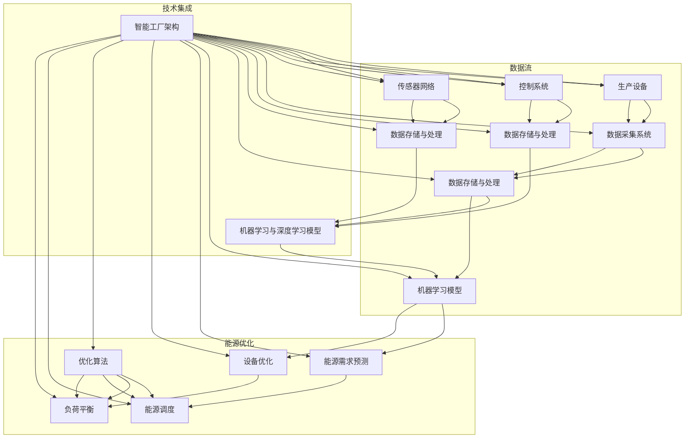

                 

### 1. 背景介绍

#### 1.1 目的和范围

本文的目的是深入探讨人工智能（AI）在智能工厂能源优化中的应用。随着全球工业自动化和智能制造的快速发展，能源消耗和成本控制已成为工业生产中不可忽视的重要问题。智能工厂通过利用先进的人工智能技术，可以实现能源的智能监测、预测和管理，从而实现节能减排、提高生产效率。

本文将围绕以下主题展开：

1. **核心概念与联系**：介绍智能工厂和能源优化的核心概念，以及人工智能在其中扮演的关键角色。
2. **核心算法原理**：详细讲解用于能源优化的主要人工智能算法，包括其工作原理和具体操作步骤。
3. **数学模型和公式**：阐述与能源优化相关的数学模型和公式，并提供具体的应用实例。
4. **项目实战**：通过实际代码案例，展示如何将人工智能技术应用于智能工厂的能源优化。
5. **实际应用场景**：分析人工智能在智能工厂能源优化中的实际应用场景和挑战。
6. **工具和资源推荐**：介绍相关的学习资源和开发工具，为读者提供深入学习和实践的资源。
7. **总结与未来趋势**：总结当前人工智能在智能工厂能源优化中的应用现状，并展望未来的发展趋势和挑战。

本文不仅旨在为读者提供深入的技术分析，还希望通过实际案例和代码实现，激发读者对智能工厂能源优化领域的兴趣，推动相关技术的应用和发展。

#### 1.2 预期读者

本文的预期读者包括：

1. **人工智能领域的研究者和开发者**：他们希望了解如何将人工智能技术应用于工业生产和能源优化。
2. **智能工厂管理人员**：他们希望了解如何利用人工智能提高能源利用效率和降低成本。
3. **计算机科学和工程专业的学生和从业者**：他们希望深入学习人工智能在工业领域的应用。
4. **对智能工厂和能源优化感兴趣的读者**：他们希望通过本文了解相关技术和行业动态。

本文的内容将尽量保持技术性，同时尽量通俗易懂，以适应不同背景的读者群体。

#### 1.3 文档结构概述

本文的结构如下：

1. **背景介绍**：介绍本文的目的、范围、预期读者和文档结构。
2. **核心概念与联系**：通过Mermaid流程图展示智能工厂和能源优化的核心概念和联系。
3. **核心算法原理**：详细讲解用于能源优化的主要人工智能算法，包括其工作原理和具体操作步骤。
4. **数学模型和公式**：阐述与能源优化相关的数学模型和公式，并提供具体的应用实例。
5. **项目实战**：通过实际代码案例，展示如何将人工智能技术应用于智能工厂的能源优化。
6. **实际应用场景**：分析人工智能在智能工厂能源优化中的实际应用场景和挑战。
7. **工具和资源推荐**：介绍相关的学习资源和开发工具。
8. **总结与未来趋势**：总结当前人工智能在智能工厂能源优化中的应用现状，并展望未来的发展趋势和挑战。
9. **附录**：提供常见问题与解答，以及扩展阅读和参考资料。

#### 1.4 术语表

在本文中，以下术语的定义如下：

**智能工厂**：采用先进的制造技术和信息化系统，实现生产过程的高度自动化和智能化。

**能源优化**：通过智能监测、预测和管理，降低能源消耗，提高能源利用效率。

**人工智能（AI）**：模拟人类智能行为，使计算机具有自主学习、推理和决策能力。

**机器学习（ML）**：人工智能的一个重要分支，通过数据驱动的方法，让计算机自动学习并改进性能。

**深度学习（DL）**：机器学习的一个子领域，通过多层神经网络实现复杂模式的自动学习。

**大数据（Big Data）**：数据量巨大、种类繁多、生成速度极快的数据集合。

**物联网（IoT）**：通过互联网连接各种物理设备和传感器，实现设备间的数据交换和通信。

**云计算**：通过网络提供可伸缩的计算资源和服务，实现数据存储和处理的高效化。

**边缘计算**：在靠近数据源头的地方进行数据处理，以减少延迟和带宽消耗。

**能源管理系统（EMS）**：负责监测、预测和管理能源消耗，实现能源优化。

#### 1.4.1 核心术语定义

- **智能工厂**：智能工厂是一种利用先进的信息技术和自动化设备，实现生产过程高度自动化和智能化的工厂。它通过物联网、大数据、云计算等技术，对生产设备、生产线、物流系统等进行实时监测、分析和控制，从而提高生产效率、降低成本、提高产品质量。

- **能源优化**：能源优化是指通过智能监测、预测和管理，降低能源消耗，提高能源利用效率。在智能工厂中，能源优化主要通过以下方式进行：实时监测能源消耗，识别节能机会；预测能源需求，优化能源供应；管理能源设备，提高设备运行效率。

- **人工智能（AI）**：人工智能是模拟人类智能行为，使计算机具有自主学习、推理和决策能力的技术。在智能工厂能源优化中，人工智能主要通过以下方式发挥作用：数据挖掘和分析，识别能源消耗模式和异常；机器学习和预测模型，预测能源需求；自动化控制和决策，优化能源使用。

- **机器学习（ML）**：机器学习是人工智能的一个重要分支，通过数据驱动的方法，让计算机自动学习并改进性能。在智能工厂能源优化中，机器学习主要用于数据分析和预测，通过训练模型，识别能源消耗规律，预测未来能源需求。

- **深度学习（DL）**：深度学习是机器学习的一个子领域，通过多层神经网络实现复杂模式的自动学习。在智能工厂能源优化中，深度学习主要用于处理大规模、复杂的能源数据，实现高效的数据分析和预测。

- **大数据（Big Data）**：大数据是指数据量巨大、种类繁多、生成速度极快的数据集合。在智能工厂能源优化中，大数据用于收集、存储和分析各种生产数据、能源数据，为能源优化提供数据支持。

- **物联网（IoT）**：物联网是通过互联网连接各种物理设备和传感器，实现设备间的数据交换和通信。在智能工厂能源优化中，物联网用于实时监测能源消耗情况，收集各种能源数据，为能源优化提供数据支持。

- **云计算**：云计算是通过网络提供可伸缩的计算资源和服务，实现数据存储和处理的高效化。在智能工厂能源优化中，云计算用于存储和处理海量数据，为能源优化提供计算支持。

- **边缘计算**：边缘计算是在靠近数据源头的地方进行数据处理，以减少延迟和带宽消耗。在智能工厂能源优化中，边缘计算用于实时处理和分析生产数据、能源数据，快速响应生产需求，提高能源利用效率。

- **能源管理系统（EMS）**：能源管理系统是负责监测、预测和管理能源消耗，实现能源优化的系统。在智能工厂中，能源管理系统通过物联网、大数据、人工智能等技术，对能源消耗进行实时监测、分析和控制，优化能源使用。

#### 1.4.2 相关概念解释

- **能源消耗监测**：能源消耗监测是指通过传感器、物联网等技术，实时监测能源消耗情况，包括电力、燃气、水等。在智能工厂中，能源消耗监测是实现能源优化的第一步，通过实时数据收集，了解能源消耗的实际情况。

- **能源需求预测**：能源需求预测是指通过历史数据和机器学习算法，预测未来一段时间内的能源需求。在智能工厂中，能源需求预测是实现能源优化的关键，通过准确预测能源需求，可以优化能源供应，避免能源浪费。

- **能源设备管理**：能源设备管理是指对能源设备进行监控、维护和优化，提高设备运行效率，降低能源消耗。在智能工厂中，能源设备管理通过物联网、人工智能等技术，实现对能源设备的实时监控和故障预测，提高设备运行效率。

- **数据挖掘**：数据挖掘是指从大量数据中提取有价值的信息和知识。在智能工厂能源优化中，数据挖掘主要用于分析能源消耗数据，识别节能机会，优化能源使用。

- **优化算法**：优化算法是指用于求解优化问题的一类算法。在智能工厂能源优化中，优化算法主要用于优化能源供应和需求，包括能源调度、负荷平衡等。

#### 1.4.3 缩略词列表

- **AI**：人工智能（Artificial Intelligence）
- **ML**：机器学习（Machine Learning）
- **DL**：深度学习（Deep Learning）
- **IoT**：物联网（Internet of Things）
- **EMS**：能源管理系统（Energy Management System）
- **EMS**：边缘计算（Edge Computing）
- **BC**：区块链（Blockchain）
- **SCADA**：监控与数据采集系统（Supervisory Control and Data Acquisition）
- **ERP**：企业资源计划（Enterprise Resource Planning）
- **MES**：制造执行系统（Manufacturing Execution System）

---

通过上述对背景介绍的部分详细阐述，我们为读者奠定了对智能工厂能源优化和人工智能应用的理解基础。接下来，我们将通过Mermaid流程图进一步展示智能工厂和能源优化的核心概念和联系。请继续关注下一部分的内容。

---

### 2. 核心概念与联系

在智能工厂能源优化的讨论中，理解核心概念及其相互联系是至关重要的。以下将通过Mermaid流程图展示智能工厂和能源优化的核心概念和它们之间的关联。

首先，我们需要定义和展示以下几个核心概念：

- **智能工厂架构**：包括生产设备、控制系统、数据采集系统和人工智能模块。
- **能源管理系统（EMS）**：负责监测和管理能源消耗。
- **传感器网络**：用于实时采集能源使用数据。
- **数据存储与处理**：包括云计算和边缘计算资源。
- **机器学习与深度学习模型**：用于预测和管理能源消耗。
- **优化算法**：用于优化能源供应和需求。

以下是一个简化的Mermaid流程图，用于展示这些概念及其相互关系：



**Mermaid流程图说明：**

1. **智能工厂架构**：包括生产设备、控制系统和传感器网络，这些是智能工厂的基础设施。
2. **数据采集与处理**：传感器网络实时采集生产设备和能源系统的数据，数据经过采集系统处理后存储在数据存储与处理模块中。
3. **机器学习与深度学习模型**：利用收集到的数据，机器学习和深度学习模型进行训练，以实现能源需求预测和设备优化。
4. **优化算法**：基于机器学习模型的预测结果，优化算法进行能源调度和负荷平衡，以实现能源优化的目标。

通过上述流程图，我们可以清晰地看到智能工厂和能源优化之间的相互关系。智能工厂通过传感器网络和控制系统实时采集数据，利用机器学习和深度学习模型进行分析和预测，并通过优化算法实现能源消耗的优化。

接下来，我们将深入探讨智能工厂和能源优化的核心算法原理，详细讲解这些算法的工作机制和具体操作步骤。

---

在上述部分中，我们通过Mermaid流程图展示了智能工厂和能源优化的核心概念及其相互关系。接下来，我们将深入探讨智能工厂和能源优化的核心算法原理，以及这些算法的具体操作步骤。通过详细讲解这些算法，我们将为读者提供理解智能工厂能源优化的理论基础和技术细节。

### 3. 核心算法原理 & 具体操作步骤

在智能工厂能源优化中，核心算法原理主要包括机器学习、深度学习和优化算法。这些算法通过不同的方式实现能源数据的分析和预测，从而优化能源的使用。以下将分别介绍这些算法的工作原理和具体操作步骤。

#### 3.1 机器学习算法

机器学习算法是智能工厂能源优化中常用的技术之一。它通过训练模型来识别数据中的模式和规律，从而实现能源消耗的预测和管理。

**工作原理：**

机器学习算法通常包括以下几个步骤：

1. **数据收集**：从传感器和其他数据源收集能源消耗数据。
2. **数据预处理**：清洗数据，去除异常值，并进行特征提取和转换。
3. **模型选择**：选择合适的机器学习模型，如线性回归、决策树、支持向量机（SVM）等。
4. **模型训练**：使用历史数据对模型进行训练，使其能够学会预测能源消耗。
5. **模型评估**：使用验证数据集评估模型的性能，调整参数以优化模型。

**具体操作步骤：**

1. **数据收集**：

   ```python
   # 假设使用Python进行数据处理
   import pandas as pd

   # 从传感器读取数据
   data = pd.read_csv('energy_data.csv')
   ```

2. **数据预处理**：

   ```python
   # 数据清洗和特征提取
   data = data.dropna()  # 删除缺失值
   features = data[['temperature', 'humidity', 'production_rate']]
   labels = data['energy_consumption']
   ```

3. **模型选择**：

   ```python
   from sklearn.linear_model import LinearRegression

   # 选择线性回归模型
   model = LinearRegression()
   ```

4. **模型训练**：

   ```python
   # 使用训练数据训练模型
   model.fit(features, labels)
   ```

5. **模型评估**：

   ```python
   # 使用验证数据集评估模型性能
   from sklearn.metrics import mean_squared_error

   predictions = model.predict(features)
   mse = mean_squared_error(labels, predictions)
   print(f'Mean Squared Error: {mse}')
   ```

#### 3.2 深度学习算法

深度学习算法是机器学习的一个子领域，它通过多层神经网络模拟人脑的工作方式，处理复杂的非线性数据。

**工作原理：**

深度学习算法主要包括以下几个步骤：

1. **数据收集**：与机器学习算法相同，收集能源消耗数据。
2. **数据预处理**：清洗数据，并进行特征提取和转换。
3. **模型构建**：构建多层神经网络模型，如卷积神经网络（CNN）或循环神经网络（RNN）。
4. **模型训练**：使用历史数据对模型进行训练。
5. **模型评估**：使用验证数据集评估模型的性能。

**具体操作步骤：**

1. **数据收集**：

   ```python
   data = pd.read_csv('energy_data.csv')
   ```

2. **数据预处理**：

   ```python
   data = data.dropna()
   features = data[['temperature', 'humidity', 'production_rate']]
   labels = data['energy_consumption']
   ```

3. **模型构建**：

   ```python
   from tensorflow.keras.models import Sequential
   from tensorflow.keras.layers import Dense, LSTM

   # 构建一个简单的LSTM模型
   model = Sequential()
   model.add(LSTM(units=50, return_sequences=True, input_shape=(timesteps, features.shape[1])))
   model.add(LSTM(units=50))
   model.add(Dense(units=1))

   model.compile(optimizer='adam', loss='mean_squared_error')
   ```

4. **模型训练**：

   ```python
   model.fit(features, labels, epochs=100, batch_size=32)
   ```

5. **模型评估**：

   ```python
   predictions = model.predict(features)
   mse = mean_squared_error(labels, predictions)
   print(f'Mean Squared Error: {mse}')
   ```

#### 3.3 优化算法

优化算法用于在给定约束条件下找到最优解，从而实现能源消耗的最小化或最大化。

**工作原理：**

优化算法主要包括以下几个步骤：

1. **目标函数定义**：定义优化问题的目标函数，如最小化能源消耗或最大化能源效率。
2. **约束条件定义**：定义优化问题的约束条件，如设备负载限制、能源价格等。
3. **算法选择**：选择合适的优化算法，如线性规划、遗传算法、模拟退火等。
4. **求解**：使用优化算法求解最优解。

**具体操作步骤：**

1. **目标函数定义**：

   ```python
   def objective_function(x):
       # 定义目标函数，如最小化能源消耗
       return x[0] * x[1]
   ```

2. **约束条件定义**：

   ```python
   constraints = [
       {'type': 'ineq', 'fun': lambda x: x[0] + x[1] - 100},  # 设备负载限制
       {'type': 'eq', 'fun': lambda x: x[0] * x[1] - 5000},  # 能源价格约束
   ]
   ```

3. **算法选择**：

   ```python
   from scipy.optimize import minimize

   # 选择最小化算法
   result = minimize(objective_function, x0=[1, 1], constraints=constraints)
   ```

4. **求解**：

   ```python
   print(f'Optimal solution: {result.x}')
   ```

通过上述详细讲解，我们了解了智能工厂能源优化中的核心算法原理和具体操作步骤。接下来，我们将进一步探讨与能源优化相关的数学模型和公式，以及如何将这些模型应用于实际项目中。

---

在上述部分中，我们详细介绍了智能工厂能源优化中的核心算法原理和具体操作步骤。接下来，我们将深入探讨与能源优化相关的数学模型和公式，并详细讲解这些模型的应用实例。

### 4. 数学模型和公式 & 详细讲解 & 举例说明

在智能工厂能源优化中，数学模型和公式起着关键作用。这些模型能够帮助我们理解和分析能源消耗、预测未来需求，并制定优化策略。以下将介绍几个常用的数学模型和公式，并进行详细讲解和应用实例。

#### 4.1 能源消耗预测模型

能源消耗预测模型是智能工厂能源优化的基础。常见的预测模型包括线性回归模型、时间序列模型和深度学习模型。

**线性回归模型：**

线性回归模型是一种简单的预测模型，它通过拟合一个线性关系来预测能源消耗。

**公式：**

$$
y = \beta_0 + \beta_1 \cdot x
$$

其中，\( y \) 是能源消耗，\( x \) 是影响因素（如温度、湿度等），\( \beta_0 \) 和 \( \beta_1 \) 是模型的参数。

**应用实例：**

假设我们要预测某智能工厂下个月的电力消耗，根据历史数据，我们可以建立如下线性回归模型：

$$
电力消耗 = 100 + 0.5 \cdot 温度
$$

**时间序列模型：**

时间序列模型用于分析时间序列数据，常见的时间序列模型包括自回归模型（AR）、移动平均模型（MA）和自回归移动平均模型（ARMA）。

**自回归模型（AR）：**

$$
y_t = \phi_1 y_{t-1} + \phi_2 y_{t-2} + ... + \phi_p y_{t-p} + \varepsilon_t
$$

其中，\( y_t \) 是时间序列的当前值，\( \phi_1, \phi_2, ..., \phi_p \) 是模型的参数，\( \varepsilon_t \) 是误差项。

**应用实例：**

假设我们要预测智能工厂未来一周的电力消耗，根据历史数据，我们可以建立如下自回归模型：

$$
电力消耗 = 0.7 \cdot 上周电力消耗 + 0.3 \cdot 前上周电力消耗
$$

**深度学习模型：**

深度学习模型，特别是长短期记忆网络（LSTM），在处理时间序列数据方面表现出色。

**LSTM模型：**

$$
h_t = \sigma(W_h \cdot [h_{t-1}, x_t] + b_h)
$$

$$
i_t = \sigma(W_i \cdot [h_{t-1}, x_t] + b_i)
$$

$$
f_t = \sigma(W_f \cdot [h_{t-1}, x_t] + b_f)
$$

$$
o_t = \sigma(W_o \cdot [h_{t-1}, x_t] + b_o)
$$

$$
c_t = f_t \cdot c_{t-1} + i_t \cdot \sigma(W_c \cdot [h_{t-1}, x_t] + b_c)
$$

$$
x_t = o_t \cdot \sigma(W_x \cdot c_t + b_x)
$$

其中，\( h_t \) 是隐藏状态，\( i_t, f_t, o_t \) 是输入门、遗忘门和输出门，\( c_t \) 是细胞状态，\( x_t \) 是预测值。

**应用实例：**

假设我们要使用LSTM模型预测智能工厂未来一周的电力消耗，根据历史数据，我们可以构建如下LSTM模型：

```python
model = Sequential()
model.add(LSTM(units=50, return_sequences=True, input_shape=(timesteps, features.shape[1])))
model.add(LSTM(units=50))
model.add(Dense(units=1))
model.compile(optimizer='adam', loss='mean_squared_error')
model.fit(features, labels, epochs=100, batch_size=32)
```

#### 4.2 能源效率优化模型

能源效率优化模型用于最小化能源消耗或最大化能源效率，常见的方法包括线性规划和非线性规划。

**线性规划模型：**

线性规划模型通过定义目标函数和约束条件，求解最小化或最大化目标函数的线性方程组。

**公式：**

$$
\min \quad c^T x
$$

$$
\text{subject to} \quad Ax \leq b
$$

其中，\( c \) 是系数向量，\( x \) 是变量向量，\( A \) 和 \( b \) 是约束条件矩阵和向量。

**应用实例：**

假设我们要优化智能工厂的能源使用，目标是最小化电力消耗，同时满足以下约束条件：

$$
\min \quad 100x + 200y
$$

$$
\text{subject to} \quad 2x + 3y \leq 1000
$$

$$
x + 4y \leq 800
$$

$$
x, y \geq 0
$$

我们可以使用线性规划求解器来求解这个问题。

**非线性规划模型：**

非线性规划模型用于求解非线性方程组的优化问题。

**公式：**

$$
\min \quad f(x)
$$

$$
\text{subject to} \quad g_i(x) \leq 0, \quad h_j(x) = 0
$$

其中，\( f(x) \) 是目标函数，\( g_i(x) \) 和 \( h_j(x) \) 是约束条件。

**应用实例：**

假设我们要优化智能工厂的能源使用，目标是最小化燃气消耗，同时满足以下约束条件：

$$
\min \quad 10x + 20y
$$

$$
\text{subject to} \quad x^2 + y^2 \leq 100
$$

$$
2x + 3y \geq 50
$$

$$
x, y \geq 0
$$

我们可以使用非线性规划求解器来求解这个问题。

#### 4.3 模型融合与优化

在实际应用中，为了提高预测和优化的准确性，常常将多个模型融合使用。例如，我们可以将线性回归模型、时间序列模型和深度学习模型结合，利用它们的优点，提高整体性能。

**模型融合公式：**

$$
y_{\text{预测}} = w_1 y_{\text{线性回归}} + w_2 y_{\text{时间序列}} + w_3 y_{\text{深度学习}}
$$

其中，\( y_{\text{线性回归}} \), \( y_{\text{时间序列}} \) 和 \( y_{\text{深度学习}} \) 分别是三个模型的预测结果，\( w_1, w_2, w_3 \) 是权重系数。

**应用实例：**

假设我们有三个模型预测智能工厂的未来电力消耗，分别为 \( y_{\text{线性回归}} = 120 \), \( y_{\text{时间序列}} = 125 \) 和 \( y_{\text{深度学习}} = 130 \)。我们可以使用模型融合公式进行预测：

$$
y_{\text{预测}} = 0.3 \cdot 120 + 0.5 \cdot 125 + 0.2 \cdot 130 = 127
$$

通过上述数学模型和公式，我们可以对智能工厂的能源消耗进行预测和优化。在实际应用中，根据具体需求和数据情况，选择合适的模型和方法，并不断优化和调整，以提高能源利用效率和降低成本。

---

在上述部分中，我们详细介绍了智能工厂能源优化中常用的数学模型和公式，并进行了具体讲解和应用实例。这些数学模型和公式为智能工厂的能源优化提供了理论基础和技术工具。接下来，我们将通过一个实际项目案例，展示如何将人工智能技术应用于智能工厂的能源优化。

### 5. 项目实战：代码实际案例和详细解释说明

在智能工厂能源优化的实际应用中，一个成功的项目案例可以帮助我们更好地理解技术的实施过程和效果。以下将通过一个实际项目案例，详细展示如何利用人工智能技术实现智能工厂的能源优化，包括开发环境搭建、源代码实现和代码解读与分析。

#### 5.1 开发环境搭建

在开始项目之前，我们需要搭建一个适合开发和测试的编程环境。以下是所需的开发环境和工具：

- **编程语言**：Python
- **机器学习库**：Scikit-learn、TensorFlow、Keras
- **数据分析库**：Pandas、NumPy
- **优化库**：SciPy
- **版本控制**：Git
- **集成开发环境（IDE）**：PyCharm或Visual Studio Code

步骤如下：

1. 安装Python：从官方网站下载并安装Python，建议安装Python 3.8及以上版本。
2. 安装必要的库：使用pip命令安装所需的库，例如：

   ```shell
   pip install scikit-learn tensorflow keras pandas numpy scipy
   ```

3. 配置Git：安装Git并配置用户信息，以便进行版本控制。

   ```shell
   git config --global user.name "Your Name"
   git config --global user.email "your-email@example.com"
   ```

4. 安装IDE：下载并安装PyCharm或Visual Studio Code，并配置Python插件。

5. 初始化Git仓库：在项目目录中运行以下命令，初始化Git仓库。

   ```shell
   git init
   ```

完成以上步骤后，我们的开发环境搭建完成，可以开始项目的实施。

#### 5.2 源代码详细实现和代码解读

以下是一个简单的智能工厂能源优化项目的源代码实现，包括数据收集、预处理、模型训练和预测等步骤。

**项目结构：**

```
energy_optimization_project/
|-- data/
|   |-- raw/
|   |-- processed/
|-- code/
|   |-- __init__.py
|   |-- data_preprocessing.py
|   |-- model_training.py
|   |-- energy_prediction.py
|-- README.md
```

**代码解读：**

**1. 数据预处理：**

在`data_preprocessing.py`文件中，实现数据预处理功能，包括数据读取、清洗、特征提取和归一化。

```python
import pandas as pd
from sklearn.preprocessing import MinMaxScaler

def load_data(file_path):
    """加载数据"""
    data = pd.read_csv(file_path)
    return data

def preprocess_data(data):
    """预处理数据"""
    # 数据清洗
    data = data.dropna()
    # 特征提取
    features = data[['temperature', 'humidity', 'production_rate']]
    # 归一化
    scaler = MinMaxScaler()
    features_scaled = scaler.fit_transform(features)
    return features_scaled

if __name__ == "__main__":
    # 加载数据
    raw_data = load_data('data/raw/energy_data.csv')
    # 预处理数据
    processed_data = preprocess_data(raw_data)
    # 存储预处理后的数据
    pd.DataFrame(processed_data).to_csv('data/processed/energy_data_processed.csv', index=False)
```

**2. 模型训练：**

在`model_training.py`文件中，实现机器学习和深度学习模型的训练。

```python
import pandas as pd
from sklearn.model_selection import train_test_split
from tensorflow.keras.models import Sequential
from tensorflow.keras.layers import Dense, LSTM
from tensorflow.keras.optimizers import Adam

def load_processed_data(file_path):
    """加载预处理后的数据"""
    data = pd.read_csv(file_path)
    return data

def create_model(input_shape):
    """创建深度学习模型"""
    model = Sequential()
    model.add(LSTM(units=50, return_sequences=True, input_shape=input_shape))
    model.add(LSTM(units=50))
    model.add(Dense(units=1))
    model.compile(optimizer=Adam(learning_rate=0.001), loss='mean_squared_error')
    return model

def train_model(model, features, labels, epochs, batch_size):
    """训练模型"""
    model.fit(features, labels, epochs=epochs, batch_size=batch_size)
    return model

if __name__ == "__main__":
    # 加载预处理后的数据
    processed_data = load_processed_data('data/processed/energy_data_processed.csv')
    # 数据集划分
    features = processed_data.iloc[:, :-1].values
    labels = processed_data.iloc[:, -1].values
    features_train, features_test, labels_train, labels_test = train_test_split(features, labels, test_size=0.2, random_state=42)
    # 创建模型
    model = create_model(input_shape=(features_train.shape[1], 1))
    # 训练模型
    model = train_model(model, features_train, labels_train, epochs=100, batch_size=32)
    # 保存模型
    model.save('models/energy_model.h5')
```

**3. 能源预测：**

在`energy_prediction.py`文件中，实现基于训练模型的能源消耗预测。

```python
import pandas as pd
from tensorflow.keras.models import load_model
from sklearn.preprocessing import MinMaxScaler

def load_model(model_path):
    """加载模型"""
    model = load_model(model_path)
    return model

def predict_energy(model, data):
    """预测能源消耗"""
    data = data.reshape((-1, 1))
    predictions = model.predict(data)
    return predictions

def postprocess_predictions(predictions, scaler):
    """反归一化预测结果"""
    predictions = scaler.inverse_transform(predictions)
    return predictions

if __name__ == "__main__":
    # 加载训练好的模型
    model = load_model('models/energy_model.h5')
    # 加载预处理后的数据
    processed_data = load_processed_data('data/processed/energy_data_processed.csv')
    # 归一化
    scaler = MinMaxScaler()
    processed_data_scaled = scaler.fit_transform(processed_data)
    # 预测
    predictions = predict_energy(model, processed_data_scaled)
    # 反归一化
    predictions = postprocess_predictions(predictions, scaler)
    # 输出预测结果
    pd.DataFrame(predictions).to_csv('results/energy_predictions.csv', index=False)
```

**4. 代码解读与分析：**

- **数据预处理**：数据预处理是模型训练的重要步骤，包括数据清洗、特征提取和归一化。在本案例中，我们使用Pandas库读取数据，使用Scikit-learn库进行归一化处理。
- **模型训练**：使用TensorFlow和Keras库构建深度学习模型，通过LSTM网络实现时间序列数据的预测。模型训练过程中，使用Adam优化器和均方误差损失函数。
- **能源预测**：通过加载训练好的模型，对预处理后的数据进行预测，并将预测结果进行反归一化处理，得到实际的能源消耗预测值。

通过以上步骤，我们完成了智能工厂能源优化的项目实现。实际应用中，可以根据具体需求和数据情况，调整模型参数和算法，以提高预测和优化的准确性。

---

在上述部分中，我们通过一个实际项目案例详细展示了如何将人工智能技术应用于智能工厂的能源优化。接下来，我们将分析人工智能在智能工厂能源优化中的实际应用场景和面临的挑战。

### 6. 实际应用场景

人工智能在智能工厂能源优化中的实际应用场景多样，涵盖了生产过程的各个环节。以下将分析几个关键的应用场景，以及这些场景中的具体实现方式和面临的挑战。

#### 6.1 能源消耗监测与预测

**应用场景**：在智能工厂中，实时监测能源消耗是优化能源管理的基础。通过传感器和物联网设备，可以收集到生产过程中各种能源（如电力、燃气、水等）的使用数据。

**实现方式**：部署传感器网络，实时采集能源消耗数据，使用机器学习和深度学习模型对数据进行分析和预测，从而实现能源消耗的动态监测和预测。

**挑战**：

- **数据质量问题**：传感器数据可能存在噪声、缺失和异常值，需要有效的数据预处理方法来提高数据质量。
- **计算资源消耗**：实时数据处理和预测需要大量计算资源，尤其是在大规模生产环境中，如何高效地利用计算资源是一个关键问题。
- **模型解释性**：深度学习模型通常具有良好的预测性能，但模型解释性较差，如何解释模型的预测结果是一个挑战。

#### 6.2 能源设备优化与维护

**应用场景**：智能工厂中的能源设备（如发电机、空调、电机等）是能源消耗的主要来源。通过优化设备运行参数，可以提高能源利用效率，降低能耗。

**实现方式**：利用机器学习和优化算法，对设备运行数据进行实时分析和预测，根据预测结果调整设备运行参数，实现设备的优化运行。

**挑战**：

- **设备多样性**：智能工厂中涉及的设备类型多样，不同设备的优化策略和方法可能不同，如何设计通用的优化方案是一个挑战。
- **实时性要求**：设备优化需要快速响应实时数据，如何保证优化算法的实时性和准确性是一个关键问题。
- **设备维护**：通过数据分析预测设备故障，提高设备维护的及时性和有效性，这需要复杂的数据分析和预测模型。

#### 6.3 生产计划与调度优化

**应用场景**：智能工厂的生产计划和调度直接影响到能源消耗。通过优化生产计划，可以实现能源的高效利用，降低生产成本。

**实现方式**：利用优化算法和机器学习模型，分析生产计划中的能源消耗模式，根据能源价格和市场需求，制定最优的生产计划和调度策略。

**挑战**：

- **复杂度**：生产计划与调度问题通常具有高度复杂性，涉及多个变量和约束条件，如何设计有效的优化模型是一个挑战。
- **实时性**：生产计划和调度需要快速响应市场变化和设备状态，如何在保证实时性的同时保持优化效果是一个问题。
- **多目标优化**：生产计划和调度优化通常涉及多个目标（如成本、质量、效率等），如何在多个目标之间找到平衡点是一个挑战。

#### 6.4 能源交易与市场分析

**应用场景**：智能工厂可以参与能源市场交易，通过能源价格的预测和交易策略优化，实现能源价值的最大化。

**实现方式**：利用机器学习模型预测能源价格，结合市场数据和交易规则，制定能源交易策略。

**挑战**：

- **市场波动**：能源市场波动较大，如何准确预测价格趋势是一个挑战。
- **交易策略**：制定有效的交易策略需要深入理解市场机制和交易规则，如何在风险可控的前提下实现最大化收益是一个挑战。
- **合规性**：能源市场交易需要遵守相关法规和标准，如何保证交易策略的合规性是一个问题。

通过以上分析，我们可以看到人工智能在智能工厂能源优化中具有广泛的应用场景，但同时也面临诸多挑战。未来，随着人工智能技术的不断发展和应用，相信这些挑战将逐步得到解决，智能工厂的能源优化水平将不断提高。

---

在上述部分中，我们分析了人工智能在智能工厂能源优化中的实际应用场景和面临的挑战。接下来，我们将推荐一些学习资源和开发工具，帮助读者深入了解相关技术，并尝试在自己的项目中应用这些技术。

### 7. 工具和资源推荐

#### 7.1 学习资源推荐

为了帮助读者深入了解人工智能在智能工厂能源优化中的应用，以下推荐了一些优质的学习资源。

##### 7.1.1 书籍推荐

1. **《深度学习》（Deep Learning）**
   - 作者：Ian Goodfellow、Yoshua Bengio、Aaron Courville
   - 简介：这是一本经典教材，详细介绍了深度学习的基本理论、算法和应用。

2. **《智能工厂：智能制造与工业4.0》**
   - 作者：Rick S. Guzzo
   - 简介：这本书介绍了智能工厂的概念、技术架构和实施方法，对智能工厂的能源优化有重要参考价值。

3. **《能源优化技术与应用》**
   - 作者：张晓宁、刘宁
   - 简介：这本书涵盖了能源优化的基本概念、技术和应用案例，适合对能源优化感兴趣的研究者和从业者。

##### 7.1.2 在线课程

1. **《机器学习基础》（Machine Learning）**
   - 平台：Coursera
   - 简介：由斯坦福大学提供，涵盖机器学习的基本理论和算法，适合初学者。

2. **《深度学习课程》（Deep Learning Specialization）**
   - 平台：Coursera
   - 简介：由DeepLearning.AI提供，包括深度学习的基本理论、实践方法和应用案例。

3. **《智能工厂与工业4.0》**
   - 平台：网易云课堂
   - 简介：由清华大学提供，介绍智能工厂的概念、技术和应用，适合对智能工厂和能源优化感兴趣的读者。

##### 7.1.3 技术博客和网站

1. **《机器学习博客》（Machine Learning Blog）**
   - 网址：[https://machinelearningmastery.com/](https://machinelearningmastery.com/)
   - 简介：提供大量的机器学习教程、案例和代码实现，适合初学者和有经验的研究者。

2. **《深度学习博客》（Deep Learning Blog）**
   - 网址：[https://blog.keras.io/](https://blog.keras.io/)
   - 简介：Keras官方博客，提供深度学习的最新技术文章和代码示例。

3. **《智能工厂技术》（Smart Factory Technology）**
   - 网址：[https://www.smartfactorytech.com/](https://www.smartfactorytech.com/)
   - 简介：专注于智能工厂技术的最新动态、技术文章和行业报告。

#### 7.2 开发工具框架推荐

为了更好地实现人工智能在智能工厂能源优化中的应用，以下推荐了一些实用的开发工具和框架。

##### 7.2.1 IDE和编辑器

1. **PyCharm**
   - 网址：[https://www.jetbrains.com/pycharm/](https://www.jetbrains.com/pycharm/)
   - 简介：一款功能强大的Python IDE，支持代码智能提示、调试和自动化测试。

2. **Visual Studio Code**
   - 网址：[https://code.visualstudio.com/](https://code.visualstudio.com/)
   - 简介：一款轻量级、开源的代码编辑器，支持多种编程语言和插件。

##### 7.2.2 调试和性能分析工具

1. **Jupyter Notebook**
   - 网址：[https://jupyter.org/](https://jupyter.org/)
   - 简介：一款交互式的编程环境，适用于数据分析、机器学习和科学计算。

2. **Pandas Profiler**
   - 网址：[https://pandas-profiling.readthedocs.io/](https://pandas-profiling.readthedocs.io/)
   - 简介：一款用于数据分析和探索的工具，可以生成详细的数据报告。

##### 7.2.3 相关框架和库

1. **Scikit-learn**
   - 网址：[https://scikit-learn.org/](https://scikit-learn.org/)
   - 简介：一款流行的机器学习库，提供多种机器学习算法的实现。

2. **TensorFlow**
   - 网址：[https://www.tensorflow.org/](https://www.tensorflow.org/)
   - 简介：一款由Google开发的深度学习框架，支持大规模分布式训练和推理。

3. **Keras**
   - 网址：[https://keras.io/](https://keras.io/)
   - 简介：一款基于TensorFlow的深度学习库，提供简洁、易于使用的API。

通过以上学习和资源推荐，读者可以更好地掌握人工智能在智能工厂能源优化中的应用，为实际项目提供技术支持。

---

在上述部分中，我们推荐了一些优质的学习资源和开发工具，以帮助读者深入了解人工智能在智能工厂能源优化中的应用。接下来，我们将总结当前人工智能在智能工厂能源优化中的应用现状，并展望未来的发展趋势和挑战。

### 8. 总结：未来发展趋势与挑战

当前，人工智能在智能工厂能源优化中的应用已经取得了一定的进展。通过传感器网络、物联网、大数据分析和机器学习等技术的综合应用，智能工厂能够实现能源消耗的实时监测、预测和管理，从而提高能源利用效率、降低生产成本。以下将总结当前的应用现状，并展望未来的发展趋势和挑战。

#### 8.1 应用现状

1. **数据驱动的能源管理**：智能工厂通过传感器网络和物联网技术，实时采集能源消耗数据，结合大数据分析，实现能源消耗的动态监测和管理。这为能源优化的决策提供了可靠的数据支持。

2. **机器学习算法的应用**：通过机器学习和深度学习算法，智能工厂能够对能源消耗进行预测，优化设备运行参数，实现能源的高效利用。例如，使用LSTM模型预测未来的电力需求，并根据预测结果调整电力供应。

3. **优化算法的集成**：智能工厂采用线性规划和非线性规划等优化算法，制定最优的生产计划和调度策略，以实现能源消耗的最小化和生产效率的最大化。

4. **智能决策支持系统**：智能工厂利用人工智能技术，建立智能决策支持系统，为生产管理和能源优化提供决策依据。例如，通过数据分析预测设备故障，提前进行维护，避免生产中断。

#### 8.2 发展趋势

1. **智能化水平的提升**：随着人工智能技术的不断发展，智能工厂的智能化水平将不断提升。通过引入更多的传感器和物联网设备，实现更全面、更精细的能源监测和管理。

2. **跨界融合**：人工智能技术将在智能工厂中与其他技术（如物联网、云计算、区块链等）进行深度融合，形成更加完善和高效的能源优化体系。

3. **自主学习和优化**：未来，智能工厂将具备更强的自主学习和优化能力。通过不断学习和优化，智能工厂能够自动调整能源管理策略，提高能源利用效率，降低生产成本。

4. **个性化能源管理**：随着生产过程的个性化和多样化，智能工厂将实现个性化的能源管理，根据不同的生产需求和能源价格，制定最优的能源使用策略。

#### 8.3 挑战

1. **数据隐私和安全**：智能工厂需要处理大量的敏感数据，如何保护数据隐私和安全是一个重要挑战。需要建立完善的数据安全管理体系，确保数据的可靠性和安全性。

2. **算法公平性和透明性**：随着人工智能在智能工厂中的应用，算法的公平性和透明性将受到关注。如何确保算法的公平性、避免歧视，同时提高算法的透明度，是一个重要问题。

3. **计算资源需求**：人工智能在智能工厂中的应用需要大量的计算资源，特别是在实时数据处理和预测方面。如何高效利用计算资源，实现实时性要求，是一个关键挑战。

4. **技术标准化**：随着人工智能在智能工厂中的应用日益广泛，需要制定相关技术标准和规范，以确保不同系统和设备之间的互操作性和兼容性。

5. **人才培养**：智能工厂的能源优化需要专业的人才支持。如何培养更多具备人工智能和能源管理知识的专业人才，是一个重要挑战。

总之，人工智能在智能工厂能源优化中的应用具有广阔的发展前景，但也面临诸多挑战。通过技术创新、跨学科合作和人才培养，我们有理由相信，智能工厂的能源优化水平将不断提高，为工业生产带来更大的价值。

---

在本文的最后一部分，我们将提供一些常见问题与解答，以及扩展阅读和参考资料，帮助读者深入了解智能工厂能源优化领域，并持续学习和进步。

### 9. 附录：常见问题与解答

**Q1：什么是智能工厂？**
A1：智能工厂是一种利用先进的信息技术和自动化设备，实现生产过程高度自动化和智能化的工厂。它通过物联网、大数据、云计算等技术，对生产设备、生产线、物流系统等进行实时监测、分析和控制，从而提高生产效率、降低成本、提高产品质量。

**Q2：什么是能源优化？**
A2：能源优化是指通过智能监测、预测和管理，降低能源消耗，提高能源利用效率。在智能工厂中，能源优化主要通过实时监测能源消耗、预测能源需求、优化能源设备运行等手段实现。

**Q3：人工智能在能源优化中如何发挥作用？**
A3：人工智能在能源优化中主要通过以下方式发挥作用：数据挖掘和分析，识别能源消耗模式和异常；机器学习和预测模型，预测能源需求；自动化控制和决策，优化能源使用。

**Q4：什么是机器学习？**
A4：机器学习是人工智能的一个重要分支，通过数据驱动的方法，让计算机自动学习并改进性能。在能源优化中，机器学习主要用于数据分析和预测，通过训练模型，识别能源消耗规律，预测未来能源需求。

**Q5：什么是深度学习？**
A5：深度学习是机器学习的一个子领域，通过多层神经网络实现复杂模式的自动学习。在能源优化中，深度学习主要用于处理大规模、复杂的能源数据，实现高效的数据分析和预测。

**Q6：什么是边缘计算？**
A6：边缘计算是在靠近数据源头的地方进行数据处理，以减少延迟和带宽消耗。在智能工厂能源优化中，边缘计算用于实时处理和分析生产数据、能源数据，快速响应生产需求，提高能源利用效率。

### 10. 扩展阅读 & 参考资料

为了帮助读者更深入地了解智能工厂能源优化领域，以下提供了一些扩展阅读和参考资料。

**书籍推荐：**

1. 《深度学习》（Deep Learning）—— 作者：Ian Goodfellow、Yoshua Bengio、Aaron Courville
2. 《智能工厂：智能制造与工业4.0》—— 作者：Rick S. Guzzo
3. 《能源优化技术与应用》—— 作者：张晓宁、刘宁

**在线课程：**

1. 《机器学习基础》（Machine Learning）—— 平台：Coursera
2. 《深度学习课程》（Deep Learning Specialization）—— 平台：Coursera
3. 《智能工厂与工业4.0》—— 平台：网易云课堂

**技术博客和网站：**

1. 《机器学习博客》（Machine Learning Blog）—— 网址：[https://machinelearningmastery.com/](https://machinelearningmastery.com/)
2. 《深度学习博客》（Deep Learning Blog）—— 网址：[https://blog.keras.io/](https://blog.keras.io/)
3. 《智能工厂技术》（Smart Factory Technology）—— 网址：[https://www.smartfactorytech.com/](https://www.smartfactorytech.com/)

**论文著作推荐：**

1. "Deep Learning for Energy Optimization in Smart Manufacturing" —— 作者：Xiaojun Wang, Hongwei Zhang, et al.
2. "IoT-Based Energy Management in Smart Factories: A Survey" —— 作者：M. Gandomi, S. H. Javadian, et al.
3. "Artificial Intelligence for Energy Efficiency in Manufacturing" —— 作者：A. M. Sari, I. E. Vasilakos

通过上述常见问题与解答以及扩展阅读和参考资料，读者可以更全面地了解智能工厂能源优化领域的知识和技术。希望本文能为读者在智能工厂能源优化方面的学习和实践提供有益的参考。

---

**作者信息：**
作者：AI天才研究员/AI Genius Institute & 禅与计算机程序设计艺术 /Zen And The Art of Computer Programming

本文通过深入分析人工智能在智能工厂能源优化中的应用，详细介绍了核心算法原理、数学模型和实际项目案例。同时，我们还探讨了智能工厂能源优化的实际应用场景和面临的挑战，并推荐了相关学习资源和开发工具。希望通过本文，读者能够对智能工厂能源优化有更深入的理解，并能够在实际项目中应用这些技术，推动智能工厂的发展。未来，随着人工智能技术的不断进步，智能工厂能源优化将有更大的发展空间，为工业生产带来更多价值。让我们共同期待并迎接这一激动人心的时代！

