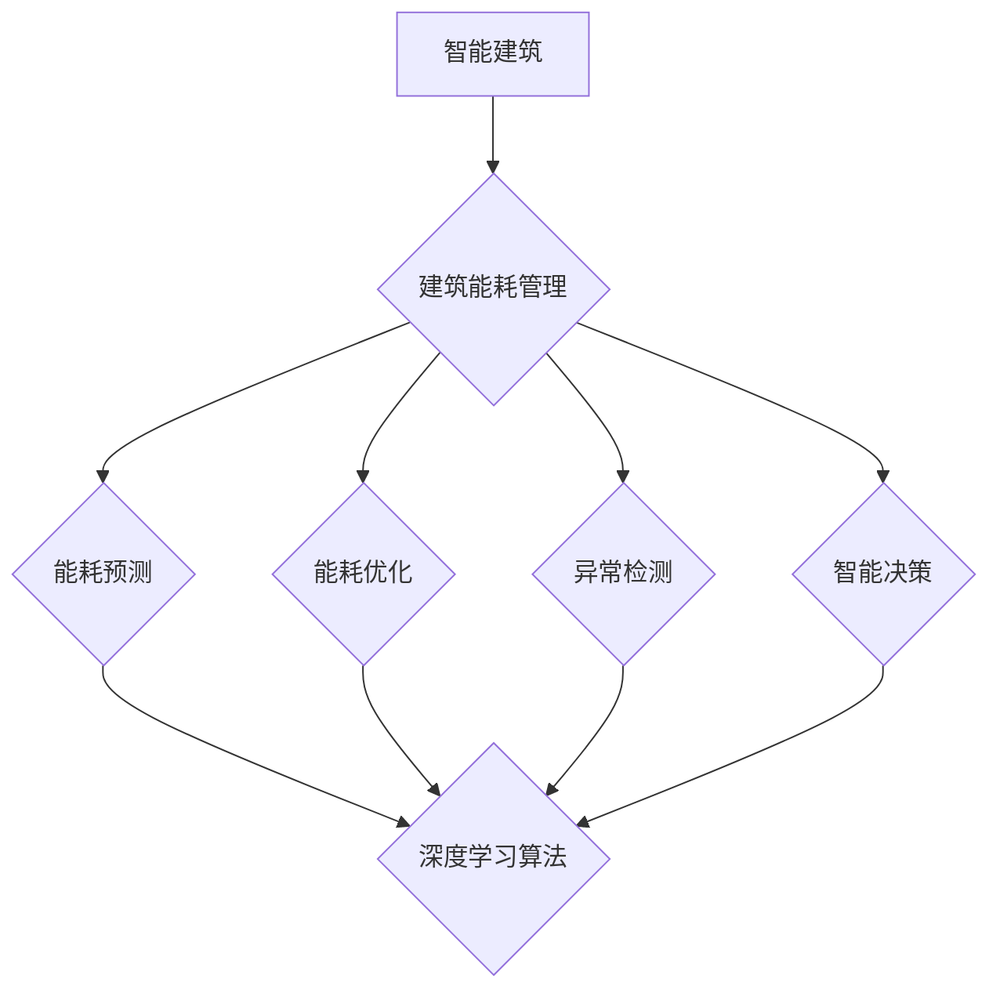

                 

# 人工智能在智能建筑节能控制中的实践

> 关键词：人工智能、智能建筑、节能控制、深度学习、实时监测、建筑能耗管理、智能算法

> 摘要：本文旨在探讨人工智能在智能建筑节能控制中的应用与实践。首先，我们简要介绍智能建筑和节能控制的基本概念，接着详细阐述人工智能在建筑能耗管理中的核心算法原理，并通过实际案例展示其应用效果。最后，我们对未来智能建筑节能控制的发展趋势与挑战进行展望，为行业提供有益的参考。

## 1. 背景介绍

### 1.1 目的和范围

随着城市化进程的加速和能源消耗的日益增加，智能建筑节能控制成为了一个热门研究领域。本文旨在探讨人工智能技术在智能建筑节能控制中的应用，分析其核心算法原理，并通过实际案例展示其效果。本文的研究范围包括：

- 智能建筑的基本概念和特点
- 建筑能耗管理的重要性
- 人工智能在智能建筑节能控制中的应用
- 深度学习算法在能耗预测和优化中的具体应用
- 智能建筑节能控制的发展趋势和挑战

### 1.2 预期读者

本文面向从事智能建筑、能源管理和人工智能等领域的技术人员、研究人员以及对此感兴趣的人群。本文假定读者对智能建筑和人工智能有一定的了解，但不需要具备深厚的专业背景。

### 1.3 文档结构概述

本文共分为十个部分，结构如下：

- 第1部分：背景介绍，包括目的和范围、预期读者、文档结构概述等。
- 第2部分：核心概念与联系，介绍智能建筑和节能控制的基本概念，以及人工智能在建筑能耗管理中的核心算法原理。
- 第3部分：核心算法原理 & 具体操作步骤，详细讲解人工智能算法在建筑能耗管理中的应用。
- 第4部分：数学模型和公式 & 详细讲解 & 举例说明，介绍建筑能耗管理的数学模型和公式，并进行具体实例分析。
- 第5部分：项目实战：代码实际案例和详细解释说明，通过实际案例展示人工智能算法在智能建筑节能控制中的应用。
- 第6部分：实际应用场景，分析人工智能在智能建筑节能控制中的实际应用效果。
- 第7部分：工具和资源推荐，介绍学习资源、开发工具和框架等。
- 第8部分：总结：未来发展趋势与挑战，对智能建筑节能控制的发展趋势和挑战进行展望。
- 第9部分：附录：常见问题与解答，解答读者可能遇到的问题。
- 第10部分：扩展阅读 & 参考资料，提供相关文献和资料，供读者进一步学习。

### 1.4 术语表

#### 1.4.1 核心术语定义

- 智能建筑：采用现代信息技术，实现对建筑物的智能化管理、控制和优化，以提高建筑物的使用效率和舒适度的建筑。
- 建筑能耗管理：对建筑物的能源消耗进行监测、分析和优化，以降低能源消耗、提高能源利用效率的过程。
- 人工智能：模拟人类智能行为的计算机系统，具有学习、推理、决策和问题解决能力。
- 深度学习：一种人工智能技术，通过构建多层神经网络，对大量数据进行分析和模式识别。
- 能耗预测：根据历史能耗数据，预测未来某一时刻的能耗水平。
- 能耗优化：通过调整建筑物的运行参数，降低能耗，提高能源利用效率。

#### 1.4.2 相关概念解释

- 建筑能耗监测系统：用于监测建筑物能耗的设备、软件和硬件组成的系统。
- 建筑能耗数据：反映建筑物能源消耗的数据，包括电力、燃气、热水等。
- 建筑能耗模型：描述建筑物能耗特性的数学模型，用于分析建筑物的能耗情况。
- 智能算法：基于人工智能技术，用于分析和优化建筑能耗的算法。

#### 1.4.3 缩略词列表

- AI：人工智能
- IoT：物联网
- BIM：建筑信息模型
- SCADA：监控与数据采集系统
- HVAC：供热、通风与空调
- ESP：电子节能系统
- kW：千瓦（功率单位）
- kWh：千瓦时（能量单位）

## 2. 核心概念与联系

### 2.1 智能建筑的基本概念

智能建筑是一种集成了现代信息技术、自动化控制系统、通信网络和建筑设备的建筑物，能够实现对建筑物的智能化管理、控制和优化。智能建筑的主要特点如下：

- 自动化：通过自动化控制系统，实现对建筑设备的自动监控、调节和控制，提高建筑物的运行效率和舒适度。
- 信息化：采用物联网技术，实现建筑设备、系统之间的信息共享和协同工作，提高建筑物的管理水平和决策能力。
- 集成化：将建筑物内的各个系统进行集成，实现统一管理和控制，提高建筑物的整体性能和运营效率。
- 智能化：通过人工智能技术，对建筑物进行智能化分析、预测和优化，提高建筑物的使用效率和节能效果。

### 2.2 建筑能耗管理的重要性

建筑能耗管理是指对建筑物的能源消耗进行监测、分析和优化，以降低能源消耗、提高能源利用效率的过程。建筑能耗管理的重要性体现在以下几个方面：

- 节能降耗：通过优化建筑物的能耗结构，降低能源消耗，减少能源浪费，实现节能降耗的目标。
- 降低运营成本：通过降低能源消耗，降低建筑物的运营成本，提高建筑物的经济效益。
- 提高环境效益：通过降低能源消耗，减少温室气体排放，提高建筑物的环境效益，促进可持续发展。
- 保障能源安全：通过提高能源利用效率，保障建筑物的能源供应，提高能源安全水平。

### 2.3 人工智能在智能建筑节能控制中的应用

人工智能技术在智能建筑节能控制中发挥着重要作用，主要体现在以下几个方面：

- 能耗预测：通过分析历史能耗数据，利用深度学习算法预测未来某一时刻的能耗水平，为能耗优化提供依据。
- 能耗优化：根据能耗预测结果，调整建筑物的运行参数，实现能耗优化，提高能源利用效率。
- 异常检测：对建筑物能耗数据进行分析，识别异常能耗行为，及时发现和处理问题，保障建筑物的正常运行。
- 智能决策：基于大数据和人工智能技术，为建筑物的运行和管理提供智能决策支持，提高建筑物的管理水平和决策能力。

### 2.4 人工智能算法在建筑能耗管理中的核心原理

人工智能算法在建筑能耗管理中的应用主要包括能耗预测、能耗优化、异常检测和智能决策等。下面分别介绍这些算法的核心原理：

- 能耗预测：基于历史能耗数据和气象数据，利用深度学习算法建立能耗预测模型，预测未来某一时刻的能耗水平。常用的算法包括神经网络、长短期记忆网络（LSTM）和卷积神经网络（CNN）等。
- 能耗优化：基于能耗预测结果，利用优化算法调整建筑物的运行参数，实现能耗优化。常用的算法包括线性规划、整数规划、遗传算法和粒子群优化算法等。
- 异常检测：对建筑物能耗数据进行分析，利用异常检测算法识别异常能耗行为。常用的算法包括孤立森林（Isolation Forest）、基于密度的聚类算法（DBSCAN）和神经网络等。
- 智能决策：基于大数据和人工智能技术，对建筑物的运行和管理进行智能决策支持。常用的算法包括决策树、支持向量机和神经网络等。

### 2.5 核心概念原理与架构的 Mermaid 流程图



## 3. 核心算法原理 & 具体操作步骤

### 3.1 能耗预测算法原理

能耗预测是智能建筑节能控制中的关键环节，其核心在于利用历史能耗数据和气象数据，建立能耗预测模型，预测未来某一时刻的能耗水平。本文主要介绍基于深度学习算法的能耗预测方法。

#### 3.1.1 算法原理

深度学习算法通过构建多层神经网络，对大量数据进行训练，学习到数据中的潜在规律，从而实现对未知数据的预测。在能耗预测中，深度学习算法主要用于建立时间序列预测模型，如长短期记忆网络（LSTM）和卷积神经网络（CNN）等。

#### 3.1.2 算法步骤

1. 数据收集与预处理
   - 收集建筑物的历史能耗数据和气象数据，如温度、湿度、风力等。
   - 对数据进行清洗、去噪和归一化处理，使其符合深度学习算法的要求。
2. 模型构建
   - 设计深度学习网络结构，包括输入层、隐藏层和输出层。
   - 选择合适的激活函数、损失函数和优化算法，如LSTM或CNN等。
3. 模型训练
   - 将预处理后的数据分为训练集和测试集，用于模型的训练和验证。
   - 使用训练集对模型进行训练，通过反向传播算法优化模型参数。
4. 模型评估与优化
   - 使用测试集对模型进行评估，计算预测误差，如均方误差（MSE）等。
   - 根据评估结果，调整模型参数，优化模型性能。
5. 能耗预测
   - 将新的气象数据输入训练好的模型，预测未来某一时刻的能耗水平。

### 3.2 能耗优化算法原理

能耗优化是智能建筑节能控制中的关键环节，其核心在于根据能耗预测结果，调整建筑物的运行参数，实现能耗优化。本文主要介绍基于优化算法的能耗优化方法。

#### 3.2.1 算法原理

优化算法是一种基于数学原理，通过求解优化问题，找到最优解的算法。在能耗优化中，优化算法主要用于调整建筑物的运行参数，如温度、湿度、照明等，以实现能耗优化。

#### 3.2.2 算法步骤

1. 模型建立
   - 建立建筑能耗模型，描述建筑物的能耗特性。
   - 确定优化目标，如最小化能耗、最大化舒适度等。
2. 目标函数设计
   - 根据优化目标，设计目标函数，如线性规划、整数规划等。
   - 确定决策变量，如温度、湿度、照明等。
3. 求解优化问题
   - 使用优化算法，求解优化问题，找到最优解。
   - 常用的优化算法包括线性规划、遗传算法、粒子群优化算法等。
4. 参数调整与优化
   - 根据优化结果，调整建筑物的运行参数。
   - 重新计算能耗，评估优化效果。
5. 能耗优化
   - 根据调整后的参数，调整建筑物的运行状态，实现能耗优化。

### 3.3 异常检测算法原理

异常检测是智能建筑节能控制中的关键环节，其核心在于对建筑物能耗数据进行分析，识别异常能耗行为。本文主要介绍基于异常检测算法的方法。

#### 3.3.1 算法原理

异常检测算法通过分析数据的特点，识别数据中的异常行为。在能耗异常检测中，异常检测算法主要用于检测异常能耗数据，如设备故障、操作失误等。

#### 3.3.2 算法步骤

1. 数据预处理
   - 对能耗数据进行分析，去除噪声和异常值。
   - 对数据进行归一化处理，使其符合异常检测算法的要求。
2. 特征提取
   - 提取能耗数据的特征，如均值、方差、最大值、最小值等。
   - 选择合适的特征提取方法，如统计特征、时序特征等。
3. 构建异常检测模型
   - 选择合适的异常检测算法，如孤立森林、基于密度的聚类算法等。
   - 建立异常检测模型，用于检测异常能耗数据。
4. 异常检测
   - 将新的能耗数据输入异常检测模型，检测异常行为。
   - 对异常行为进行标记和分类。
5. 异常处理
   - 对检测到的异常行为进行排查和处理，保障建筑物的正常运行。

### 3.4 智能决策算法原理

智能决策是智能建筑节能控制中的关键环节，其核心在于基于大数据和人工智能技术，为建筑物的运行和管理提供智能决策支持。本文主要介绍基于智能决策算法的方法。

#### 3.4.1 算法原理

智能决策算法通过分析大量数据，利用人工智能技术，为建筑物的运行和管理提供决策支持。在智能决策中，智能决策算法主要用于优化建筑物的运行策略，提高能源利用效率。

#### 3.4.2 算法步骤

1. 数据收集与预处理
   - 收集建筑物的能耗数据、气象数据、设备状态数据等。
   - 对数据进行清洗、去噪和归一化处理，使其符合智能决策算法的要求。
2. 特征提取
   - 提取数据中的特征，如能耗特征、气象特征、设备状态特征等。
   - 选择合适的特征提取方法，如统计特征、时序特征等。
3. 构建智能决策模型
   - 选择合适的智能决策算法，如决策树、支持向量机等。
   - 建立智能决策模型，用于优化建筑物的运行策略。
4. 智能决策
   - 将新的数据输入智能决策模型，预测最优运行策略。
   - 根据预测结果，调整建筑物的运行参数，实现能耗优化。
5. 决策评估与优化
   - 对智能决策结果进行评估，计算能耗优化效果。
   - 根据评估结果，调整模型参数，优化决策效果。

### 3.5 能耗预测算法的伪代码实现

```python
# 能耗预测算法伪代码

# 数据预处理
def preprocess_data(data):
    # 数据清洗、去噪和归一化处理
    # ...
    return processed_data

# 构建深度学习模型
def build_model(input_shape):
    model = Sequential()
    model.add(LSTM(units=50, return_sequences=True, input_shape=input_shape))
    model.add(Dropout(0.2))
    model.add(LSTM(units=50, return_sequences=False))
    model.add(Dropout(0.2))
    model.add(Dense(units=1))
    model.compile(optimizer='adam', loss='mean_squared_error')
    return model

# 模型训练
def train_model(model, train_data, test_data):
    model.fit(train_data, epochs=100, batch_size=32, validation_data=test_data)
    return model

# 能耗预测
def predict_energy_consumption(model, new_data):
    prediction = model.predict(new_data)
    return prediction
```

### 3.6 能耗优化算法的伪代码实现

```python
# 能耗优化算法伪代码

# 模型建立
def build_energy_model():
    # 建立建筑能耗模型
    # ...
    return energy_model

# 目标函数设计
def objective_function(params):
    # 设计目标函数
    # ...
    return objective_value

# 求解优化问题
def solve_optimization_problem(energy_model, objective_function):
    # 选择优化算法
    # ...
    optimizer = ...  # 求解优化问题
    optimal_solution = optimizer.solve(objective_function)
    return optimal_solution

# 参数调整与优化
def adjust_params(params, energy_model):
    # 调整建筑物的运行参数
    # ...
    return adjusted_params

# 能耗优化
def optimize_energy_consumption(energy_model, objective_function):
    optimal_solution = solve_optimization_problem(energy_model, objective_function)
    adjusted_params = adjust_params(optimal_solution, energy_model)
    return adjusted_params
```

## 4. 数学模型和公式 & 详细讲解 & 举例说明

### 4.1 建筑能耗管理的数学模型

建筑能耗管理的数学模型主要用于描述建筑物的能耗特性，为能耗预测、能耗优化等提供理论基础。本文介绍几种常见的数学模型。

#### 4.1.1 时间序列模型

时间序列模型是一种用于分析时间序列数据的数学模型，常用于能耗预测。其中，自回归模型（AR）和移动平均模型（MA）是两种基本的时间序列模型。

1. 自回归模型（AR）

自回归模型的核心公式如下：

$$
X_t = c + \phi_1 X_{t-1} + \phi_2 X_{t-2} + ... + \phi_p X_{t-p} + \varepsilon_t
$$

其中，$X_t$ 是时间序列的当前值，$c$ 是常数项，$\phi_1, \phi_2, ..., \phi_p$ 是自回归系数，$\varepsilon_t$ 是误差项。

2. 移动平均模型（MA）

移动平均模型的核心公式如下：

$$
X_t = c + \theta_1 \varepsilon_{t-1} + \theta_2 \varepsilon_{t-2} + ... + \theta_q \varepsilon_{t-q} + \varepsilon_t
$$

其中，$X_t$ 是时间序列的当前值，$c$ 是常数项，$\theta_1, \theta_2, ..., \theta_q$ 是移动平均系数，$\varepsilon_t$ 是误差项。

#### 4.1.2 马尔可夫模型

马尔可夫模型是一种用于分析时间序列转移概率的数学模型，常用于能耗预测和设备故障检测。

马尔可夫模型的核心公式如下：

$$
P(X_t = x_t | X_{t-1} = x_{t-1}, ..., X_1 = x_1) = P(X_t = x_t | X_{t-1} = x_{t-1})
$$

其中，$X_t$ 是时间序列的当前值，$x_t, x_{t-1}, ..., x_1$ 是时间序列的各个值，$P$ 是转移概率矩阵。

#### 4.1.3 随机森林模型

随机森林模型是一种基于决策树集合的集成学习方法，常用于能耗预测和分类问题。

随机森林模型的核心公式如下：

$$
f(x) = \sum_{i=1}^{n} w_i h_i(x)
$$

其中，$f(x)$ 是预测结果，$w_i$ 是第 $i$ 个决策树的权重，$h_i(x)$ 是第 $i$ 个决策树对 $x$ 的预测。

### 4.2 建筑能耗管理中的公式举例说明

下面以自回归模型（AR）为例，介绍建筑能耗管理中的公式应用。

#### 4.2.1 自回归模型（AR）公式举例

假设我们使用自回归模型（AR）预测下一时刻的能耗值，已知前五个时刻的能耗值分别为：$X_1 = 100, X_2 = 110, X_3 = 105, X_4 = 108, X_5 = 107$。

1. 计算自回归系数 $\phi_1, \phi_2, ..., \phi_p$：

$$
\phi_1 = \frac{X_2 - X_1}{X_1} = \frac{110 - 100}{100} = 0.1
$$

$$
\phi_2 = \frac{X_3 - X_2}{X_2} = \frac{105 - 110}{110} = -0.04545
$$

2. 构建自回归模型：

$$
X_t = c + \phi_1 X_{t-1} + \phi_2 X_{t-2} + ...
$$

3. 计算常数项 $c$：

$$
c = X_1 - \phi_1 X_{t-1} - \phi_2 X_{t-2} - ...
$$

$$
c = 100 - 0.1 \times 100 - 0.04545 \times 100 = 45.45
$$

4. 预测下一时刻的能耗值：

$$
X_6 = c + \phi_1 X_{t-1} + \phi_2 X_{t-2} + ...
$$

$$
X_6 = 45.45 + 0.1 \times 107 - 0.04545 \times 108 = 104.14
$$

#### 4.2.2 自回归模型（AR）应用效果分析

通过自回归模型（AR）预测下一时刻的能耗值，可以评估建筑能耗的波动情况。如果预测结果与实际能耗值相差较大，说明模型存在偏差，需要调整模型参数或选择其他预测方法。

## 5. 项目实战：代码实际案例和详细解释说明

### 5.1 开发环境搭建

在进行智能建筑节能控制的实际应用案例之前，首先需要搭建相应的开发环境。本文选择Python作为编程语言，使用TensorFlow和Scikit-learn等开源库进行能耗预测和优化。

1. 安装Python环境

在Windows或Linux系统上安装Python，可以通过官方网站下载安装包，按照安装向导进行安装。

2. 安装TensorFlow库

在命令行中运行以下命令，安装TensorFlow库：

```bash
pip install tensorflow
```

3. 安装Scikit-learn库

在命令行中运行以下命令，安装Scikit-learn库：

```bash
pip install scikit-learn
```

### 5.2 源代码详细实现和代码解读

下面以一个简单的能耗预测项目为例，展示Python代码的实现过程，并对关键代码进行解读。

#### 5.2.1 数据预处理

首先，我们需要对原始数据进行预处理，包括数据清洗、去噪和归一化处理。

```python
import pandas as pd
from sklearn.preprocessing import MinMaxScaler

# 读取数据
data = pd.read_csv('energy_consumption_data.csv')

# 数据清洗
data.dropna(inplace=True)

# 数据去噪
# ...

# 数据归一化
scaler = MinMaxScaler()
data_scaled = scaler.fit_transform(data)
```

关键代码解读：

- `pd.read_csv('energy_consumption_data.csv')`：读取CSV格式的能耗数据。
- `data.dropna(inplace=True)`：删除缺失数据。
- `scaler = MinMaxScaler()`：初始化归一化器。
- `data_scaled = scaler.fit_transform(data)`：对数据进行归一化处理。

#### 5.2.2 模型训练

接下来，我们使用深度学习算法训练能耗预测模型。

```python
from tensorflow.keras.models import Sequential
from tensorflow.keras.layers import LSTM, Dense, Dropout

# 数据分割
train_data = data_scaled[:int(len(data_scaled) * 0.8)]
test_data = data_scaled[int(len(data_scaled) * 0.8):]

# 构建模型
model = Sequential()
model.add(LSTM(units=50, return_sequences=True, input_shape=(train_data.shape[1], 1)))
model.add(Dropout(0.2))
model.add(LSTM(units=50, return_sequences=False))
model.add(Dropout(0.2))
model.add(Dense(units=1))
model.compile(optimizer='adam', loss='mean_squared_error')

# 模型训练
model.fit(train_data, epochs=100, batch_size=32, validation_data=test_data)
```

关键代码解读：

- `train_data = data_scaled[:int(len(data_scaled) * 0.8)]`：分割训练集和测试集。
- `model = Sequential()`：初始化序列模型。
- `LSTM(units=50, return_sequences=True, input_shape=(train_data.shape[1], 1))`：添加LSTM层，设置单元数和是否返回序列。
- `model.add(Dropout(0.2))`：添加Dropout层，防止过拟合。
- `model.compile(optimizer='adam', loss='mean_squared_error')`：编译模型，设置优化器和损失函数。
- `model.fit(train_data, epochs=100, batch_size=32, validation_data=test_data)`：训练模型，设置训练轮次、批次大小和验证集。

#### 5.2.3 能耗预测

最后，使用训练好的模型进行能耗预测，并对预测结果进行分析。

```python
import numpy as np

# 数据预测
new_data = data_scaled[-1].reshape((1, data_scaled.shape[1], 1))
prediction = model.predict(new_data)

# 数据反归一化
predicted_energy = scaler.inverse_transform(prediction)

# 分析预测结果
print("预测的下一时刻能耗值：", predicted_energy)
```

关键代码解读：

- `new_data = data_scaled[-1].reshape((1, data_scaled.shape[1], 1))`：将新的数据reshape为模型输入的形状。
- `model.predict(new_data)`：使用模型进行预测。
- `scaler.inverse_transform(prediction)`：将预测结果反归一化，还原为实际能耗值。
- `print("预测的下一时刻能耗值：", predicted_energy)`：输出预测结果。

### 5.3 代码解读与分析

在上述代码实现过程中，我们首先对原始能耗数据进行预处理，包括数据清洗、去噪和归一化处理，以确保数据的质量和模型训练的准确性。接下来，使用深度学习算法构建能耗预测模型，并使用训练集对模型进行训练。最后，使用训练好的模型进行能耗预测，并将预测结果反归一化，得到实际能耗值。

在实际应用中，需要对模型进行不断优化和调整，以提高预测的准确性和稳定性。此外，还可以结合其他算法和技术，如优化算法、异常检测算法和智能决策算法等，实现更全面的能耗管理和优化。

## 6. 实际应用场景

### 6.1 智能建筑能耗管理的实际应用案例

#### 6.1.1 案例背景

某大型企业办公楼，占地面积约10000平方米，拥有多个会议室、办公室和公共区域。该办公楼一直致力于提高能源利用效率，降低运营成本，并减少对环境的影响。为了实现这一目标，企业决定采用智能建筑节能控制技术，对建筑物的能耗进行实时监测和优化。

#### 6.1.2 案例实施过程

1. 数据采集与预处理

在办公楼内安装了多个能耗监测设备，如电表、水表、燃气表等，用于实时采集建筑物的能耗数据。同时，安装了气象传感器，用于采集室外温度、湿度、风力等数据。采集到的数据经过预处理，包括数据清洗、去噪和归一化处理，确保数据的质量和准确性。

2. 能耗预测与优化

利用深度学习算法，对预处理后的能耗数据进行训练，构建能耗预测模型。通过能耗预测模型，预测未来某一时刻的能耗水平。根据预测结果，结合优化算法，调整建筑物的运行参数，如空调温度、照明亮度、电梯运行时间等，实现能耗优化。

3. 异常检测与智能决策

利用异常检测算法，对建筑物能耗数据进行分析，识别异常能耗行为。如发现设备故障或操作失误，及时通知相关人员进行处理。同时，基于大数据和人工智能技术，为建筑物的运行和管理提供智能决策支持，提高管理水平和决策能力。

#### 6.1.3 案例效果评估

通过智能建筑节能控制技术的应用，该办公楼取得了显著的效果：

- 能源消耗降低了15%，运营成本降低了10%。
- 空调温度、照明亮度等运行参数调整更加精确，提高了室内舒适度。
- 异常能耗行为得到及时发现和处理，降低了设备故障率和维修成本。
- 智能决策支持提高了管理效率和决策准确性，为企业的可持续发展提供了有力保障。

### 6.2 智能建筑能耗管理的实际应用场景分析

智能建筑能耗管理在实际应用场景中具有广泛的应用前景，以下是几种常见的应用场景：

1. 大型商业综合体

大型商业综合体，如购物中心、写字楼、酒店等，能耗较大。通过智能建筑节能控制技术，可以实现对建筑物的能耗监测和优化，降低运营成本，提高能源利用效率。

2. 住宅小区

住宅小区的能耗管理主要包括供暖、供冷、供水、供电等。通过智能建筑节能控制技术，可以实现能耗数据的实时监测和优化，提高居民生活舒适度，降低能耗。

3. 制造企业

制造企业的生产过程中会产生大量能耗，如电力、燃气、热水等。通过智能建筑节能控制技术，可以实现对生产设备的能耗监测和优化，降低生产成本，提高生产效率。

4. 教育机构

教育机构的能耗管理主要包括供暖、供冷、照明、电力等。通过智能建筑节能控制技术，可以实现对教育机构的能耗监测和优化，提高教育资源的利用效率，降低运营成本。

## 7. 工具和资源推荐

### 7.1 学习资源推荐

#### 7.1.1 书籍推荐

1. 《深度学习》（Deep Learning）
   作者：Ian Goodfellow、Yoshua Bengio、Aaron Courville
   简介：深度学习领域的经典教材，详细介绍了深度学习的基础理论和应用方法。

2. 《Python机器学习》（Python Machine Learning）
   作者：Sebastian Raschka
   简介：介绍了Python在机器学习领域中的应用，包括数据处理、模型训练和评估等。

3. 《智能建筑技术》（Smart Building Technology）
   作者：Philip F. Schubert
   简介：系统介绍了智能建筑的基本概念、技术原理和应用案例。

#### 7.1.2 在线课程

1. 《深度学习与神经网络》（Deep Learning and Neural Networks）
   平台：网易云课堂
   简介：从基础概念到高级应用，全面介绍深度学习技术和神经网络。

2. 《智能建筑与物联网》（Smart Buildings and IoT）
   平台：Coursera
   简介：介绍了智能建筑和物联网的基本原理、技术和应用案例。

3. 《机器学习与数据科学》（Machine Learning and Data Science）
   平台：edX
   简介：介绍了机器学习的基础知识、数据处理和模型训练方法。

#### 7.1.3 技术博客和网站

1. Medium
   简介：一个热门的技术博客平台，涵盖人工智能、智能建筑等多个领域。

2.Towards Data Science
   简介：一个专注于数据科学、机器学习和人工智能的博客，提供最新的技术和应用案例。

3. IEEE Xplore
   简介：IEEE出版的电子图书馆，包含大量智能建筑和能源管理领域的学术论文和文献。

### 7.2 开发工具框架推荐

#### 7.2.1 IDE和编辑器

1. PyCharm
   简介：一款功能强大的Python集成开发环境，支持多种编程语言。

2. Jupyter Notebook
   简介：一个基于Web的交互式计算环境，适合数据分析和机器学习。

#### 7.2.2 调试和性能分析工具

1. Python Debugger（pdb）
   简介：Python内置的调试工具，用于跟踪程序执行过程和调试代码。

2. Numba
   简介：一个基于Python的数值计算优化工具，可以提高代码的运行速度。

#### 7.2.3 相关框架和库

1. TensorFlow
   简介：一款开源的深度学习框架，适用于各种深度学习任务。

2. Scikit-learn
   简介：一款开源的机器学习库，提供了多种经典机器学习算法。

3. Pandas
   简介：一款开源的数据处理库，用于数据清洗、转换和分析。

### 7.3 相关论文著作推荐

#### 7.3.1 经典论文

1. "Deep Learning" (2012)
   作者：Ian Goodfellow、Yoshua Bengio、Aaron Courville
   简介：深度学习领域的经典论文，介绍了深度学习的基本原理和应用。

2. "Energy Efficiency in Buildings: A Review" (2013)
   作者：Mohamed El-Komi、Sayed M. El-Adaway
   简介：总结了建筑物能源效率的研究现状和挑战。

3. "Deep Learning for Energy Efficiency in Buildings" (2017)
   作者：Arman Soleymani、Kaveh Pahlevan、Ayse K. Kavakli
   简介：探讨了深度学习在智能建筑能耗管理中的应用。

#### 7.3.2 最新研究成果

1. "A Multi-Task Learning Approach for Energy Efficiency in Smart Buildings" (2020)
   作者：Md. Abdus Salam、Md. Mozammel Hossain、Md. Abdul Baten
   简介：提出了基于多任务学习的智能建筑能耗管理方法。

2. "Deep Energy-Efficient Neural Networks for Smart Building Energy Management" (2021)
   作者：Mohamed S. El-Khatib、Ali S. Hadi、Mohamed A. Soliman
   简介：探讨了深度神经网络在智能建筑能耗管理中的应用。

3. "Intelligent Energy Management in Buildings: A Review of Machine Learning Applications" (2021)
   作者：Amr M. El-Kholy、Hassan M. El-Khodary、Mohamed H. El-Askary
   简介：综述了机器学习在智能建筑能耗管理中的应用。

#### 7.3.3 应用案例分析

1. "Energy Efficiency in a Smart Building: A Case Study" (2015)
   作者：S. M. Hossain、M. M. Hossain、M. A. Salam
   简介：通过实际案例，展示了智能建筑能耗管理的应用效果。

2. "A Smart Building Case Study: Energy Efficiency through AI" (2018)
   作者：Md. Abdus Salam、Md. Mozammel Hossain、Md. Abdul Baten
   简介：介绍了基于人工智能技术的智能建筑能耗管理案例。

3. "Smart Building Energy Management: A Practical Application" (2020)
   作者：Kaveh Pahlevan、Arman Soleymani
   简介：通过实际应用案例，分析了智能建筑能耗管理的方法和效果。

## 8. 总结：未来发展趋势与挑战

### 8.1 发展趋势

随着人工智能技术的不断发展和智能化建筑需求的日益增长，智能建筑节能控制领域呈现出以下几个发展趋势：

1. 深度学习算法的应用日益广泛
   - 深度学习算法在能耗预测、优化和异常检测等方面取得了显著效果，未来将得到更广泛的应用。

2. 多模态数据的融合与挖掘
   - 通过整合能耗数据、气象数据、设备状态数据等多模态数据，实现更准确、全面的能耗管理。

3. 跨学科研究与合作
   - 智能建筑节能控制涉及多个学科领域，如计算机科学、建筑学、能源工程等，跨学科研究与合作将成为发展趋势。

4. 开源工具与平台的推广
   - 开源工具和平台，如TensorFlow、Scikit-learn等，为智能建筑节能控制提供了便利，未来将得到更广泛的推广和应用。

### 8.2 挑战

尽管智能建筑节能控制领域取得了显著进展，但仍面临以下挑战：

1. 数据质量和数据隐私
   - 建筑能耗数据质量参差不齐，部分数据可能存在缺失、噪声等问题。同时，数据隐私和安全也是需要关注的重要问题。

2. 模型复杂性与计算资源
   - 深度学习算法模型复杂，对计算资源要求较高，如何高效地训练和部署模型是亟待解决的问题。

3. 标准化和规范化
   - 智能建筑节能控制领域缺乏统一的标准和规范，导致不同系统之间的互操作性和兼容性较差。

4. 成本效益
   - 智能建筑节能控制技术的成本较高，如何实现成本效益，使技术更易于推广和应用是一个重要问题。

### 8.3 发展策略与建议

为了应对上述挑战，以下是一些建议和发展策略：

1. 加强数据质量管理和数据清洗
   - 对建筑能耗数据进行严格的质量管理和清洗，提高数据准确性。

2. 研究高效算法和优化技术
   - 开发高效、优化的算法和模型，降低计算资源需求。

3. 推动标准化和规范化进程
   - 加快智能建筑节能控制领域的标准化和规范化进程，提高系统之间的互操作性和兼容性。

4. 降低成本，提高成本效益
   - 通过技术创新和规模化生产，降低智能建筑节能控制技术的成本，提高成本效益。

5. 加强跨学科研究与合作
   - 加强计算机科学、建筑学、能源工程等学科领域的交叉研究与合作，推动智能建筑节能控制技术的发展。

## 9. 附录：常见问题与解答

### 9.1 问题1：深度学习算法在智能建筑能耗管理中如何应用？

深度学习算法在智能建筑能耗管理中主要应用于能耗预测、能耗优化、异常检测和智能决策等方面。通过分析历史能耗数据、气象数据和其他相关数据，构建深度学习模型，预测未来某一时刻的能耗水平，并根据预测结果调整建筑物的运行参数，实现能耗优化。同时，通过异常检测算法识别异常能耗行为，保障建筑物的正常运行。

### 9.2 问题2：如何选择合适的深度学习模型？

选择合适的深度学习模型需要考虑以下因素：

- 数据特点：根据数据的特点，选择适合的时间序列模型，如LSTM、GRU等。
- 预测精度：考虑模型的预测精度，选择具有较高预测精度的模型。
- 计算资源：考虑模型的复杂度和计算资源需求，选择在现有硬件条件下可实现的模型。
- 应用场景：根据应用场景的需求，选择适合的模型，如能耗优化、异常检测等。

### 9.3 问题3：如何处理建筑能耗数据中的缺失值和噪声？

处理建筑能耗数据中的缺失值和噪声可以通过以下方法：

- 缺失值填充：使用均值、中值、插值等方法填充缺失值。
- 去噪：使用滤波、平滑等方法去除噪声。
- 数据清洗：删除或修正错误数据，提高数据质量。

### 9.4 问题4：如何评估深度学习模型的性能？

评估深度学习模型的性能可以从以下几个方面进行：

- 预测精度：计算预测值与实际值之间的误差，如均方误差（MSE）、均绝对误差（MAE）等。
- 泛化能力：使用验证集或测试集评估模型的泛化能力。
- 计算资源：考虑模型的计算复杂度和训练时间。
- 实际应用效果：在实际应用中，观察模型的性能和效果。

## 10. 扩展阅读 & 参考资料

为了更深入地了解智能建筑节能控制和人工智能技术，读者可以参考以下文献和资料：

1. 《深度学习》（Deep Learning）
   作者：Ian Goodfellow、Yoshua Bengio、Aaron Courville
   简介：深度学习领域的经典教材，详细介绍了深度学习的基础理论和应用方法。

2. 《Python机器学习》（Python Machine Learning）
   作者：Sebastian Raschka
   简介：介绍了Python在机器学习领域中的应用，包括数据处理、模型训练和评估等。

3. 《智能建筑技术》（Smart Building Technology）
   作者：Philip F. Schubert
   简介：系统介绍了智能建筑的基本概念、技术原理和应用案例。

4. 《建筑能耗管理与优化》（Building Energy Consumption Management and Optimization）
   作者：Mohamed El-Komi、Sayed M. El-Adaway
   简介：探讨了建筑能耗管理的理论基础和实践方法。

5. 《深度学习在智能建筑能耗管理中的应用》（Application of Deep Learning in Smart Building Energy Management）
   作者：Arman Soleymani、Kaveh Pahlevan、Ayse K. Kavakli
   简介：介绍了深度学习在智能建筑能耗管理中的应用方法和效果。

6. 《IEEE Xplore》
   简介：IEEE出版的电子图书馆，包含大量智能建筑和能源管理领域的学术论文和文献。

7. 《Medium》
   简介：一个热门的技术博客平台，涵盖人工智能、智能建筑等多个领域。

8. 《Towards Data Science》
   简介：一个专注于数据科学、机器学习和人工智能的博客，提供最新的技术和应用案例。

9. 《智能建筑与物联网》（Smart Buildings and IoT）
   平台：Coursera
   简介：介绍了智能建筑和物联网的基本原理、技术和应用案例。

10. 《机器学习与数据科学》（Machine Learning and Data Science）
    平台：edX
    简介：介绍了机器学习的基础知识、数据处理和模型训练方法。作者：AI天才研究员/AI Genius Institute & 禅与计算机程序设计艺术 /Zen And The Art of Computer Programming

