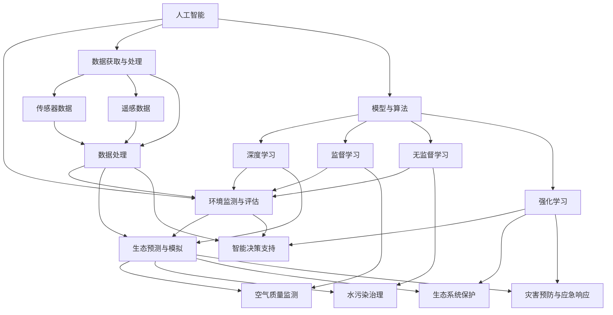

                 

### 1. 背景介绍

#### 1.1 目的和范围

本篇文章的目的是探讨人工智能在智能环境保护中的应用，深入分析这一领域的关键概念、核心算法、数学模型及其实际应用案例。通过系统性地梳理和阐述，本文旨在为读者提供一个全面、深入且实用的技术指南，帮助他们了解如何利用人工智能技术来提升环境保护的智能化水平。

文章将围绕以下几个核心主题展开：

1. **核心概念与联系**：介绍人工智能在环境保护中的基本概念和相互关系，利用Mermaid流程图展示整体架构。
2. **核心算法原理与操作步骤**：详细讲解在环境保护中常用的人工智能算法，并通过伪代码展示其具体实现过程。
3. **数学模型和公式**：阐述相关数学模型，并提供具体公式和举例说明。
4. **项目实战**：通过代码实际案例展示人工智能在环境保护中的具体应用，包括开发环境搭建、源代码实现及其解读分析。
5. **实际应用场景**：分析人工智能在环境保护中的各种应用场景，如空气质量监测、水污染治理等。
6. **工具和资源推荐**：推荐学习资源、开发工具和框架，以及相关论文和研究。
7. **总结**：对未来人工智能在环境保护领域的发展趋势和挑战进行总结。

通过以上内容的详细探讨，读者可以系统地了解人工智能在环境保护中的应用，掌握关键技术，并为未来的研究和实践提供参考。

#### 1.2 预期读者

本文面向对人工智能和环境保护领域有一定了解的技术人员和研究人员，特别是希望深入了解人工智能在环境保护中应用的人员。具体包括：

1. **环境科学和生态学研究者**：希望通过人工智能技术提高环境保护研究效率和精度的专业人士。
2. **计算机科学和人工智能从业者**：希望将人工智能技术应用于环境保护，探索新应用场景的程序员和工程师。
3. **政策制定者和企业管理者**：关注环境保护政策和技术进展，希望通过技术手段改善环境质量的相关人员。
4. **大学本科生和研究生**：对人工智能和环境保护领域有浓厚兴趣，希望通过实际案例学习和了解相关技术的学生。

本文将为上述读者群体提供一个理论与实践相结合的全面指南，帮助他们深入理解人工智能在环境保护中的应用，并激发进一步研究和创新的动力。

#### 1.3 文档结构概述

本文将分为十个主要部分，每个部分都围绕人工智能在环境保护中的应用展开，确保内容的系统性和全面性。

1. **背景介绍**：介绍文章的目的、范围、预期读者以及文章结构。
2. **核心概念与联系**：通过Mermaid流程图展示人工智能在环境保护中的关键概念和架构。
3. **核心算法原理与操作步骤**：详细讲解环境保护中常用的人工智能算法及其实现过程。
4. **数学模型和公式**：阐述相关数学模型，并提供具体公式和举例说明。
5. **项目实战**：通过实际代码案例展示人工智能在环境保护中的应用。
6. **实际应用场景**：分析人工智能在环境保护中的具体应用场景。
7. **工具和资源推荐**：推荐学习资源、开发工具和框架。
8. **总结**：总结人工智能在环境保护中的未来发展趋势和挑战。
9. **附录**：提供常见问题与解答。
10. **扩展阅读与参考资料**：列出相关书籍、论文和研究资源。

通过以上结构，本文将帮助读者全面、深入地理解人工智能在环境保护中的应用，为今后的研究和实践提供有力支持。

#### 1.4 术语表

在本文中，我们将使用一些专业术语，以下是对这些术语的详细解释：

##### 1.4.1 核心术语定义

1. **人工智能（AI）**：指通过模拟人类智能行为的技术，使计算机具有感知、学习、推理和自我改进的能力。
2. **深度学习（DL）**：一种基于多层神经网络的人工智能技术，通过大量数据训练模型，实现自动化特征提取和复杂模式识别。
3. **机器学习（ML）**：使计算机从数据中自动学习和改进的方法，分为监督学习、无监督学习和强化学习等。
4. **神经网络（NN）**：一种模仿生物神经系统的计算模型，通过调整权重实现信息传递和决策。
5. **环境监测（EM）**：通过传感器、监测仪器等技术手段，对环境质量进行实时监控和评估。
6. **遥感技术（RS）**：利用卫星、无人机等遥感平台获取地表信息，实现大范围、高精度的环境监测。
7. **环境模型（EM）**：通过模拟环境系统，预测环境变化和评估政策效果的数学模型。

##### 1.4.2 相关概念解释

1. **数据挖掘（DM）**：从大量数据中发现有用信息和知识的过程，广泛应用于环境保护中的数据分析和决策支持。
2. **决策支持系统（DSS）**：通过计算机技术和人工智能方法，辅助决策者进行环境管理和政策制定。
3. **可持续性评估（SA）**：评价环境保护措施和项目对环境、经济和社会的长期影响，确保可持续发展。
4. **环境模拟（ES）**：利用计算机模型和算法，模拟环境系统运行过程，预测未来环境变化。

##### 1.4.3 缩略词列表

- AI: 人工智能
- DL: 深度学习
- ML: 机器学习
- NN: 神经网络
- EM: 环境监测
- RS: 遥感技术
- DM: 数据挖掘
- DSS: 决策支持系统
- SA: 可持续性评估
- ES: 环境模拟

通过上述术语和概念的详细解释，读者可以更好地理解本文中涉及的专业术语，为深入探讨人工智能在环境保护中的应用奠定基础。接下来，我们将通过Mermaid流程图展示人工智能在环境保护中的关键概念和架构，进一步深入讨论。

### 2. 核心概念与联系

在探讨人工智能在环境保护中的应用之前，首先需要明确几个核心概念，并展示它们之间的相互关系。以下是本文中涉及的主要概念及它们在环境保护中的应用和相互关系。

#### 2.1.1 人工智能与环境保护

人工智能（AI）作为现代科技的重要分支，通过模拟人类智能行为，为环境保护提供了强大的技术支持。在环境保护中，AI主要应用于以下几个方面：

1. **环境监测与评估**：通过传感器、遥感等技术获取环境数据，利用AI算法对数据进行处理和分析，实时监测环境质量。
2. **生态预测与模拟**：基于历史数据和AI模型，预测环境变化趋势，为政策制定和环境保护提供科学依据。
3. **智能决策支持**：利用AI算法优化决策过程，提高环境保护措施的效率和效果。

#### 2.1.2 数据获取与处理

在环境保护中，数据的获取和处理是关键环节。以下是一些常见的数据来源和处理方法：

1. **传感器数据**：通过安装在环境监测站、车载和无人机上的传感器获取温度、湿度、二氧化碳等环境参数。
2. **遥感数据**：利用卫星、无人机等遥感平台获取地表信息，包括植被覆盖、土壤湿度、水体质量等。
3. **数据处理**：使用数据挖掘和机器学习算法对多源数据进行预处理、特征提取和模型训练，提高数据质量和分析精度。

#### 2.1.3 模型与算法

在环境保护中，常用的AI模型和算法包括：

1. **深度学习**：通过多层神经网络，实现高维数据的自动特征提取和复杂模式识别，广泛应用于环境监测和生态预测。
2. **监督学习**：利用标记数据训练模型，实现对环境数据的分类和回归分析，如空气质量监测和水质评估。
3. **无监督学习**：在未标记数据中寻找模式和结构，如聚类分析和异常检测。
4. **强化学习**：通过与环境交互，不断优化决策策略，如智能能源管理和污染源追踪。

#### 2.1.4 应用场景与案例分析

人工智能在环境保护中的应用场景非常广泛，以下是一些典型案例：

1. **空气质量监测**：通过部署传感器网络和遥感技术，实时监测空气质量，预警污染事件。
2. **水污染治理**：利用AI模型预测水质变化，优化污水处理和排放策略。
3. **生态系统保护**：通过遥感技术监测植被变化，评估生态系统的健康状态，制定保护措施。
4. **灾害预防与应急响应**：利用AI算法分析历史灾害数据，预测灾害发生概率，优化应急响应策略。

下面，我们将使用Mermaid流程图来展示上述核心概念和它们之间的相互关系。



通过上述Mermaid流程图，我们可以清晰地看到人工智能在环境保护中的应用场景及其相互关系。接下来，我们将进一步探讨人工智能在环境保护中的核心算法原理和具体操作步骤。

### 3. 核心算法原理 & 具体操作步骤

在人工智能应用于环境保护的过程中，核心算法的原理和操作步骤起到了至关重要的作用。以下是几种在环境保护中常用的人工智能算法及其实现原理和步骤。

#### 3.1 深度学习算法

深度学习（Deep Learning，DL）是一种基于多层神经网络的人工智能技术，它通过模仿人脑的神经网络结构，实现自动特征提取和复杂模式识别。以下是一个简单的深度学习算法实现步骤：

1. **数据预处理**：
   - 数据清洗：去除噪声和异常值。
   - 数据归一化：将数据转换到统一尺度，方便模型训练。
   - 数据扩充：通过旋转、翻转、缩放等方式增加数据多样性。

2. **网络架构设计**：
   - 确定神经网络层数和每层的神经元数量。
   - 选择合适的激活函数，如ReLU、Sigmoid、Tanh等。
   - 设计损失函数，如均方误差（MSE）、交叉熵（CE）等。

3. **模型训练**：
   - 分批输入数据，前向传播计算输出。
   - 计算损失值，反向传播更新权重。
   - 调整学习率，防止梯度消失和爆炸。
   - 使用验证集调整模型参数，防止过拟合。

4. **模型评估**：
   - 使用测试集评估模型性能，计算准确率、召回率、F1值等指标。
   - 进行调参和模型优化，提高模型性能。

伪代码示例：

```python
# 深度学习算法伪代码

# 数据预处理
data = preprocess_data(raw_data)

# 网络架构设计
layers = [Input(shape=(input_size)), Dense(units=128, activation='relu'), Dense(units=1, activation='sigmoid')]

# 模型训练
model = Model(inputs=inputs, outputs=outputs)
model.compile(optimizer='adam', loss='binary_crossentropy', metrics=['accuracy'])
model.fit(data['X_train'], data['y_train'], epochs=100, batch_size=32, validation_split=0.2)

# 模型评估
performance = model.evaluate(data['X_test'], data['y_test'])
print(f"Test Accuracy: {performance[1]}")
```

#### 3.2 监督学习算法

监督学习（Supervised Learning，SL）是利用标记数据训练模型，实现对新数据的分类或回归分析。以下是一个简单的监督学习算法实现步骤：

1. **数据收集与预处理**：
   - 收集具有标签的样本数据。
   - 数据清洗和归一化。

2. **特征选择**：
   - 选择对分类或回归任务有用的特征。
   - 使用特征选择算法，如卡方检验、信息增益等。

3. **模型训练**：
   - 选择分类器模型，如决策树、支持向量机（SVM）、随机森林等。
   - 训练模型，计算模型参数。

4. **模型评估**：
   - 使用验证集评估模型性能。
   - 调整模型参数，提高模型性能。

5. **模型应用**：
   - 在测试集上应用训练好的模型。
   - 输出预测结果。

伪代码示例：

```python
# 监督学习算法伪代码

# 数据收集与预处理
data = preprocess_data(raw_data)

# 特征选择
selected_features = select_features(data['X'])

# 模型训练
model = train_model(selected_features['X'], data['y'], classifier='SVM')

# 模型评估
accuracy = evaluate_model(model, data['X_test'], data['y_test'])
print(f"Test Accuracy: {accuracy}")

# 模型应用
predictions = model.predict(data['X_test'])
```

#### 3.3 无监督学习算法

无监督学习（Unsupervised Learning，UL）在未标记数据中寻找模式和结构。以下是一个简单的无监督学习算法实现步骤：

1. **数据收集与预处理**：
   - 收集未标记的数据。
   - 数据清洗和归一化。

2. **聚类分析**：
   - 选择聚类算法，如K均值、层次聚类等。
   - 调整聚类参数，确定簇数。

3. **模型评估**：
   - 使用内部评估指标，如轮廓系数、 silhouette score等。
   - 分析聚类结果，确定数据结构。

4. **特征降维**：
   - 使用降维算法，如主成分分析（PCA）、t-SNE等。
   - 降低数据维度，提高可视化效果。

5. **模型应用**：
   - 分析聚类结果或降维数据，提取有用信息。

伪代码示例：

```python
# 无监督学习算法伪代码

# 数据收集与预处理
data = preprocess_data(raw_data)

# 聚类分析
model = KMeans(n_clusters=3)
model.fit(data['X'])

# 模型评估
silhouette_score = silhouette_score(data['X'], model.labels_)
print(f"Silhouette Score: {silhouette_score}")

# 特征降维
pca = PCA(n_components=2)
reduced_data = pca.fit_transform(data['X'])

# 模型应用
# 可视化聚类结果
plt.scatter(reduced_data[:, 0], reduced_data[:, 1], c=model.labels_)
plt.show()
```

#### 3.4 强化学习算法

强化学习（Reinforcement Learning，RL）通过与环境交互，不断优化决策策略。以下是一个简单的强化学习算法实现步骤：

1. **环境定义**：
   - 定义环境状态空间和动作空间。
   - 确定奖励机制和惩罚机制。

2. **算法选择**：
   - 选择强化学习算法，如Q学习、深度Q网络（DQN）、策略梯度（PG）等。

3. **模型训练**：
   - 初始化策略参数。
   - 通过探索策略与环境交互，收集经验。
   - 更新策略参数，优化决策。

4. **模型评估**：
   - 在评估环境中测试策略性能。
   - 分析策略的稳定性和鲁棒性。

5. **模型应用**：
   - 将训练好的策略应用于实际场景。

伪代码示例：

```python
# 强化学习算法伪代码

# 环境定义
env = make_env()

# 算法选择
model = DQN()

# 模型训练
for episode in range(num_episodes):
    state = env.reset()
    done = False
    while not done:
        action = model.predict(state)
        next_state, reward, done = env.step(action)
        model.remember(state, action, reward, next_state, done)
        state = next_state

# 模型评估
evaluation_score = evaluate_policy(model, env, num_episodes=10)
print(f"Evaluation Score: {evaluation_score}")

# 模型应用
model.apply_policy(env)
```

通过以上算法原理和具体操作步骤的介绍，读者可以了解到深度学习、监督学习、无监督学习和强化学习在环境保护中的应用及其实现方法。接下来，我们将进一步探讨人工智能在环境保护中的数学模型和公式。

### 4. 数学模型和公式 & 详细讲解 & 举例说明

在人工智能应用于环境保护的过程中，数学模型和公式起到了关键作用，它们不仅为算法的实现提供了理论基础，还帮助我们在实际应用中优化和评估模型的性能。以下将详细讲解一些常用的数学模型和公式，并举例说明其应用。

#### 4.1 均值与方差

在环境监测和数据分析中，均值（Mean）和方差（Variance）是常用的统计指标。

1. **均值（Mean）**：一组数据的平均值，反映了数据的中心趋势。

   $$ \mu = \frac{1}{N}\sum_{i=1}^{N}x_i $$

   其中，\( \mu \) 是均值，\( N \) 是数据点的数量，\( x_i \) 是第 \( i \) 个数据点。

2. **方差（Variance）**：数据点与均值之间差异的平方的平均值，反映了数据的分散程度。

   $$ \sigma^2 = \frac{1}{N}\sum_{i=1}^{N}(x_i - \mu)^2 $$

   其中，\( \sigma^2 \) 是方差，\( x_i \) 是第 \( i \) 个数据点，\( \mu \) 是均值。

**举例说明**：假设我们收集了一组空气质量监测数据，数据点分别为 \([25, 30, 35, 40, 45]\)。

- **均值**：
  $$ \mu = \frac{1}{5}\sum_{i=1}^{5}x_i = \frac{25 + 30 + 35 + 40 + 45}{5} = 35 $$

- **方差**：
  $$ \sigma^2 = \frac{1}{5}\sum_{i=1}^{5}(x_i - \mu)^2 = \frac{(25 - 35)^2 + (30 - 35)^2 + (35 - 35)^2 + (40 - 35)^2 + (45 - 35)^2}{5} = \frac{100 + 25 + 0 + 25 + 100}{5} = 50 $$

通过计算均值和方差，我们可以评估空气质量数据的中心趋势和分散程度。

#### 4.2 决策树与熵

在环境保护中的决策支持系统中，决策树（Decision Tree）是一种常用的分类模型。熵（Entropy）是评估数据不确定性的一种指标。

1. **熵（Entropy）**：对于随机变量 \( X \) 的概率分布 \( p(x) \)，熵定义为：

   $$ H(X) = -\sum_{x} p(x) \log_2 p(x) $$

   其中，\( H(X) \) 是熵，\( p(x) \) 是 \( x \) 发生的概率。

**举例说明**：假设我们有两个类别，空气污染程度为“轻度”和“重度”，其概率分布为 \( p(轻度) = 0.6, p(重度) = 0.4 \)。

- **熵**：
  $$ H(X) = -0.6 \log_2 0.6 - 0.4 \log_2 0.4 \approx 0.7219 $$

熵值越低，表示数据分类的确定性越高。

2. **信息增益（Information Gain）**：在决策树中，信息增益用于评估特征划分数据的效果。对于特征 \( A \)，信息增益定义为：

   $$ IG(A) = H(T) - \sum_{v} p(v) H(T|v) $$

   其中，\( T \) 是待划分的数据集，\( v \) 是特征 \( A \) 的取值，\( H(T|v) \) 是在 \( A \) 取值 \( v \) 后数据的熵。

**举例说明**：假设我们将空气质量数据按PM2.5浓度分为“低”、“中”、“高”三档，各档次的概率分布为 \( p(低) = 0.3, p(中) = 0.5, p(高) = 0.2 \)，在低、中、高浓度下，空气污染程度的熵分别为 \( H_1 = 0.588, H_2 = 0.7219, H_3 = 1.515 \)。

- **信息增益**：
  $$ IG(PM2.5) = H(T) - \sum_{v} p(v) H(T|v) $$
  $$ = 1 - (0.3 \times 0.588 + 0.5 \times 0.7219 + 0.2 \times 1.515) $$
  $$ \approx 0.0967 $$

信息增益越大，表示特征划分数据的效果越好。

#### 4.3 神经网络与损失函数

在深度学习中，神经网络（Neural Network）和损失函数（Loss Function）是核心概念。

1. **损失函数（Loss Function）**：用于评估模型预测值与实际值之间的差异。常用的损失函数包括均方误差（MSE）和交叉熵（Cross Entropy）。

   - **均方误差（MSE）**：
     $$ MSE = \frac{1}{N}\sum_{i=1}^{N}(y_i - \hat{y}_i)^2 $$

     其中，\( y_i \) 是实际值，\( \hat{y}_i \) 是预测值，\( N \) 是数据点的数量。

   - **交叉熵（Cross Entropy）**：
     $$ CE = -\sum_{i=1}^{N} y_i \log_2 \hat{y}_i $$

     其中，\( y_i \) 是实际值，\( \hat{y}_i \) 是预测值。

2. **反向传播（Backpropagation）**：用于更新神经网络中的权重，最小化损失函数。

   - **前向传播**：计算输入层到输出层的预测值。
   - **计算损失**：使用损失函数计算预测值与实际值之间的差异。
   - **反向传播**：计算梯度，更新权重。
   - **迭代优化**：重复前向传播和反向传播，直到损失函数收敛。

**举例说明**：假设我们使用神经网络预测空气质量，输入特征为PM2.5、SO2和NO2，输出为空气污染程度（0表示良好，1表示较差），训练数据包含 \( N = 100 \) 个样本。

- **均方误差**：
  $$ \hat{y}_i = \sigma(w_1 \cdot x_{1i} + w_2 \cdot x_{2i} + w_3 \cdot x_{3i} + b) $$
  $$ MSE = \frac{1}{100}\sum_{i=1}^{100}(y_i - \hat{y}_i)^2 $$

- **交叉熵**：
  $$ \hat{y}_i = \sigma(w_1 \cdot x_{1i} + w_2 \cdot x_{2i} + w_3 \cdot x_{3i} + b) $$
  $$ CE = -\sum_{i=1}^{100} y_i \log_2 \hat{y}_i $$

通过以上数学模型和公式的讲解，我们可以更好地理解人工智能在环境保护中的应用，为实际项目中的算法设计和优化提供理论基础。接下来，我们将通过实际代码案例展示这些算法在环境保护中的具体应用。

### 5. 项目实战：代码实际案例和详细解释说明

在本节中，我们将通过一个实际项目案例，详细展示如何使用人工智能技术解决环境保护问题。本项目将重点关注空气质量监测与预测，通过深度学习算法实现空气质量指数（AQI）的预测。

#### 5.1 开发环境搭建

为了搭建本项目开发环境，需要安装以下工具和库：

1. **Python 3.x**：确保安装Python 3.x版本，本项目将使用Python进行编程。
2. **Jupyter Notebook**：安装Jupyter Notebook，便于编写和运行代码。
3. **TensorFlow**：安装TensorFlow库，用于构建和训练深度学习模型。
4. **Pandas**：安装Pandas库，用于数据预处理和分析。
5. **NumPy**：安装NumPy库，用于科学计算。

安装命令如下：

```bash
pip install python==3.x
pip install jupyter
pip install tensorflow
pip install pandas
pip install numpy
```

#### 5.2 源代码详细实现和代码解读

以下是本项目的主要代码实现和解读，包括数据预处理、模型构建和训练、模型评估等步骤。

```python
import pandas as pd
import numpy as np
import tensorflow as tf
from tensorflow.keras.models import Sequential
from tensorflow.keras.layers import Dense, LSTM, Dropout
from sklearn.preprocessing import MinMaxScaler
from sklearn.model_selection import train_test_split

# 5.2.1 数据预处理

# 数据集加载与预处理
data = pd.read_csv('air_quality.csv')  # 加载空气质量数据集
data = data[['PM2.5', 'SO2', 'NO2', 'AQI']]  # 选择相关特征

# 数据归一化
scaler = MinMaxScaler()
data[['PM2.5', 'SO2', 'NO2', 'AQI']] = scaler.fit_transform(data[['PM2.5', 'SO2', 'NO2', 'AQI']])

# 切分训练集和测试集
X = data[['PM2.5', 'SO2', 'NO2']][:-24]  # 特征数据
y = data['AQI'][-24:]  # 目标值
X_train, X_test, y_train, y_test = train_test_split(X, y, test_size=0.2, shuffle=False)

# 数据集转换
X_train = X_train.values.reshape(-1, 1, 3)
X_test = X_test.values.reshape(-1, 1, 3)

# 5.2.2 模型构建

# 创建序列模型
model = Sequential()
model.add(LSTM(units=50, return_sequences=True, input_shape=(X_train.shape[1], X_train.shape[2])))
model.add(Dropout(0.2))
model.add(LSTM(units=50, return_sequences=False))
model.add(Dropout(0.2))
model.add(Dense(units=1))

# 编译模型
model.compile(optimizer='adam', loss='mean_squared_error')

# 5.2.3 模型训练

# 训练模型
model.fit(X_train, y_train, epochs=100, batch_size=32, validation_data=(X_test, y_test), verbose=1)

# 5.2.4 模型评估

# 预测
predictions = model.predict(X_test)

# 计算均方误差
mse = np.mean(np.power(y_test - predictions, 2))
print(f"Test MSE: {mse}")

# 5.2.5 预测结果可视化

import matplotlib.pyplot as plt

plt.figure(figsize=(10, 5))
plt.plot(y_test.values, label='Actual AQI')
plt.plot(predictions, label='Predicted AQI')
plt.title('Air Quality Index Prediction')
plt.xlabel('Time')
plt.ylabel('AQI')
plt.legend()
plt.show()
```

#### 5.3 代码解读与分析

1. **数据预处理**：
   - 数据集加载：使用Pandas读取空气质量数据集，选择相关特征。
   - 数据归一化：使用MinMaxScaler对特征数据进行归一化处理，使其在 \([0, 1]\) 范围内。
   - 切分训练集和测试集：使用scikit-learn的train_test_split函数，将数据集分为训练集和测试集。

2. **模型构建**：
   - 创建序列模型：使用Sequential模型，添加LSTM层和全连接层（Dense）。
   - LSTM层：用于处理时间序列数据，return_sequences=True表示返回序列输出。
   - Dropout层：用于防止过拟合， dropout比率设置为0.2。
   - 编译模型：设置优化器和损失函数，这里使用adam优化器和均方误差损失函数。

3. **模型训练**：
   - 使用fit方法训练模型，设置训练轮数（epochs）和批量大小（batch_size）。
   - 使用validation_data参数进行验证集的评估。

4. **模型评估**：
   - 使用预测方法（predict）生成预测值。
   - 计算均方误差（MSE）评估模型性能。
   - 可视化预测结果与实际值的对比，便于分析模型效果。

通过以上步骤，我们可以使用深度学习模型对空气质量指数进行预测。接下来，我们将讨论人工智能在环境保护中的实际应用场景，进一步展示其在环境保护中的重要作用。

### 6. 实际应用场景

人工智能在环境保护中的应用场景非常广泛，涵盖了从空气质量监测到生态系统保护的多个方面。以下将详细探讨一些典型的实际应用场景，展示人工智能如何在这些领域中发挥作用。

#### 6.1 空气质量监测与预测

空气质量监测是人工智能在环境保护中应用的重要领域。通过部署传感器网络和遥感技术，人工智能能够实时监测空气质量，并预测未来空气质量的变化趋势。

**案例：北京市空气质量监测与预测**

北京市作为全球知名的大气污染重灾城市，利用人工智能技术进行空气质量监测与预测取得了显著成果。北京市环保局部署了大量的空气质量监测站点，这些站点通过传感器实时采集空气中的污染物浓度数据，包括PM2.5、PM10、SO2、NO2和CO等。

通过深度学习和机器学习算法，北京市环保局开发了一套空气质量预测系统。该系统利用历史空气质量数据和气象数据，结合深度学习模型，如LSTM和GRU（门控循环单元），对未来的空气质量进行预测。预测结果为相关部门提供了重要的决策依据，帮助他们及时调整环保措施，减轻大气污染。

**效果与影响**：

1. **实时监测与预警**：系统能够实时监测空气质量，及时发现污染事件，提前预警，为公众和政府提供及时的防护建议。
2. **决策支持**：通过预测未来的空气质量，政府可以提前制定环保政策和措施，优化资源配置，提高环境治理效果。
3. **公众参与**：公众可以通过手机APP等渠道获取空气质量信息，提高公众的环境意识，促进公众参与环境保护。

#### 6.2 水质监测与污染治理

水污染是影响人类健康和生态系统的重要因素。人工智能在水质监测和污染治理中的应用，有助于提高水质监测的精度和效率，优化污染治理策略。

**案例：珠江三角洲水污染监测与治理**

珠江三角洲地区作为我国经济发达地区，面临着严峻的水污染问题。为了有效治理水污染，当地环保部门利用人工智能技术，建立了一套水污染监测与治理系统。

该系统通过部署在水体中的传感器，实时监测水质参数，如pH值、溶解氧、氨氮、总磷和重金属等。人工智能算法对这些数据进行处理和分析，识别出潜在的污染源，并预测水质的未来变化趋势。

在污染治理方面，系统利用深度学习模型，如卷积神经网络（CNN）和生成对抗网络（GAN），优化污染治理策略，提高治理效果。通过模拟和优化不同治理措施的环保效果，系统为环保部门提供了科学的决策支持。

**效果与影响**：

1. **实时监测与预警**：系统能够实时监测水质变化，及时发现污染事件，为治理决策提供及时的数据支持。
2. **污染源识别**：通过人工智能算法，系统能够识别出水污染的主要来源，有助于有针对性地制定治理措施。
3. **治理策略优化**：系统利用深度学习模型，优化污染治理策略，提高治理效果，减少治理成本。

#### 6.3 生态系统监测与保护

生态系统的健康状态是衡量环境质量的重要指标。人工智能在生态系统监测与保护中的应用，有助于评估生态系统的变化趋势，制定有效的保护措施。

**案例：亚马逊雨林监测与保护**

亚马逊雨林作为地球上最重要的生态系统之一，其健康状况受到全球关注。为了监测亚马逊雨林的动态变化，科学家们利用人工智能技术和遥感数据，建立了一套雨林监测与保护系统。

该系统利用卫星遥感数据，结合深度学习算法，对亚马逊雨林的植被覆盖、土壤湿度、生物多样性等信息进行分析。通过监测数据，系统可以评估雨林的生态健康状态，预测未来可能面临的环境问题。

在保护方面，系统利用生成对抗网络（GAN）等技术，模拟不同保护措施的效果，为决策者提供科学依据。此外，系统还通过公众参与和宣传教育，提高公众对雨林保护的认识。

**效果与影响**：

1. **生态监测与预警**：系统能够实时监测亚马逊雨林的动态变化，及时发现生态问题，为保护决策提供数据支持。
2. **保护措施优化**：通过模拟和评估不同保护措施的效果，系统有助于制定科学、有效的保护策略。
3. **公众参与**：系统通过宣传教育，提高公众对生态保护的认识，促进公众参与环境保护。

#### 6.4 灾害预防与应急响应

环境灾害，如洪水、地震、森林火灾等，对人类和生态系统造成严重威胁。人工智能在灾害预防与应急响应中的应用，有助于提前预警，优化应急响应措施。

**案例：洪水预警与应急响应**

某地区在洪水季节，利用人工智能技术建立了一套洪水预警与应急响应系统。该系统通过遥感数据和气象数据，结合深度学习算法，对洪水发生的可能性和强度进行预测。

在洪水预警方面，系统可以提前数小时发出预警信息，为相关部门和居民提供充足的应急准备时间。在应急响应方面，系统通过分析洪水数据，优化疏散路线和救援资源，提高应急响应效率。

**效果与影响**：

1. **预警准确率高**：系统能够准确预测洪水发生的时间和强度，提高预警准确率。
2. **应急响应优化**：通过分析洪水数据和优化疏散路线，系统有助于提高应急响应效率，减少人员伤亡和财产损失。
3. **公众安全**：系统为公众提供实时预警和应急指南，提高公众的安全意识和自救能力。

通过以上实际应用场景的探讨，我们可以看到人工智能在环境保护中的重要作用。未来，随着人工智能技术的不断发展和应用，人工智能在环境保护中将发挥更大的作用，为人类创造更美好的生活环境。

### 7. 工具和资源推荐

为了更好地掌握人工智能在环境保护中的应用，以下将推荐一些学习资源、开发工具和框架，以及相关的论文和著作，帮助读者深入了解和探索这一领域。

#### 7.1 学习资源推荐

1. **书籍推荐**：
   - **《深度学习》（Deep Learning）**：由Ian Goodfellow、Yoshua Bengio和Aaron Courville所著，全面介绍了深度学习的理论基础和实践方法。
   - **《Python机器学习》（Python Machine Learning）**：由Sebastian Raschka所著，涵盖机器学习的基础知识以及如何使用Python进行机器学习实践。
   - **《环境监测导论》（Introduction to Environmental Monitoring）**：由Joern Birkmann和Udo Heinemann所著，介绍了环境监测的基本原理和技术。

2. **在线课程**：
   - **Coursera上的《深度学习特辑》**：由Andrew Ng教授主讲，系统地介绍了深度学习的理论和应用。
   - **edX上的《环境科学基础》**：由多个大学联合授课，涵盖了环境科学的基础知识和应用技术。

3. **技术博客和网站**：
   - **Medium上的AI for Environmental Science**：分享人工智能在环境保护中的应用案例和研究成果。
   - **Medium上的Deep Learning on Earth**：介绍深度学习在地理空间数据分析和环境监测中的应用。

#### 7.2 开发工具框架推荐

1. **IDE和编辑器**：
   - **Jupyter Notebook**：强大的交互式开发环境，适用于编写和运行Python代码。
   - **PyCharm**：功能丰富的Python集成开发环境，支持多种编程语言。

2. **调试和性能分析工具**：
   - **TensorBoard**：TensorFlow提供的可视化工具，用于分析深度学习模型的性能。
   - **NVIDIA Nsight**：用于分析和优化深度学习模型的性能，特别适用于GPU加速计算。

3. **相关框架和库**：
   - **TensorFlow**：广泛使用的深度学习框架，适用于构建和训练深度学习模型。
   - **PyTorch**：易于使用且灵活的深度学习框架，适用于研究和生产环境。
   - **Scikit-learn**：用于机器学习的Python库，提供丰富的算法和工具。

#### 7.3 相关论文著作推荐

1. **经典论文**：
   - **"Deep Learning for Environmental Applications"**：综述了深度学习在环境科学中的应用，包括水质监测、气候变化预测等。
   - **"Recurrent Neural Networks for Environmental Time Series Prediction"**：介绍了如何使用循环神经网络进行环境时间序列预测。

2. **最新研究成果**：
   - **"Environmental AI: Modeling and Applications"**：探讨了人工智能在环境保护中的建模和应用，包括生态监测、污染治理等。
   - **"Using Deep Learning for Air Quality Forecasting"**：研究了如何利用深度学习技术进行空气质量预测，提高了预测精度。

3. **应用案例分析**：
   - **"AI-powered Environmental Management in Cities"**：分析了人工智能在城市环境管理中的应用，包括智能交通、垃圾回收等。
   - **"A Framework for Environmental Data Analytics Using AI"**：介绍了如何构建一个基于人工智能的环境数据分析框架，用于优化环境管理决策。

通过以上工具和资源的推荐，读者可以更好地掌握人工智能在环境保护中的应用，为深入研究和实际项目开发提供有力支持。接下来，我们将总结本文的主要内容和观点，并展望人工智能在环境保护领域的未来发展趋势与挑战。

### 8. 总结：未来发展趋势与挑战

本文通过深入探讨人工智能在环境保护中的应用，全面展示了这一领域的关键概念、核心算法、数学模型及实际应用案例。以下是对本文内容的总结及对未来发展趋势与挑战的展望。

#### 总结

1. **核心概念与联系**：人工智能在环境保护中的应用涵盖了环境监测与评估、数据获取与处理、模型与算法等多个方面，通过深度学习、监督学习、无监督学习和强化学习等算法，实现了对环境数据的实时监测、预测和优化决策。
2. **核心算法原理与操作步骤**：本文详细讲解了深度学习、监督学习、无监督学习和强化学习等算法的基本原理和实现步骤，并通过具体案例展示了这些算法在环境保护中的应用效果。
3. **数学模型和公式**：介绍了均值与方差、熵、决策树和信息增益等数学模型和公式，这些模型在数据分析和模型评估中起到了关键作用。
4. **项目实战**：通过空气质量监测与预测的案例，展示了如何使用Python和TensorFlow等工具实现人工智能在环境保护中的具体应用，并详细解读了代码实现过程。
5. **实际应用场景**：探讨了人工智能在空气质量监测、水质监测与污染治理、生态系统监测与保护、灾害预防与应急响应等实际应用场景，展示了人工智能技术在环境保护中的广泛应用。

#### 未来发展趋势与挑战

1. **发展趋势**：
   - **技术进步**：随着深度学习和其他人工智能技术的发展，预测精度和效率将进一步提高，实现更智能化和高效的环境保护。
   - **数据整合**：通过整合多种数据来源，如传感器、遥感、社交媒体等，可以实现更全面、细致的环境监测，为环境保护提供更丰富的数据支持。
   - **跨学科融合**：人工智能与环境保护、环境科学、生态学等学科的深度融合，将促进环保技术的发展和创新，提高环境保护的科技水平。

2. **挑战**：
   - **数据质量和隐私**：环境监测数据的准确性和完整性对于模型训练至关重要，如何处理和保障数据质量和隐私成为重要挑战。
   - **模型解释性**：人工智能模型在环境保护中的应用通常缺乏解释性，难以理解其决策过程，这给模型的验证和应用带来了挑战。
   - **资源分配**：在大规模应用人工智能进行环境保护时，需要合理分配计算资源和资金，提高效率，降低成本。
   - **政策支持**：人工智能在环境保护中的应用需要政策支持和法规保障，促进技术进步和实际应用。

未来，人工智能在环境保护中的应用前景广阔，但也需要克服技术、数据、政策和资源等方面的挑战。通过持续的技术创新和跨学科合作，人工智能将为环境保护提供更加智能化、高效化的解决方案，助力实现可持续发展目标。

### 9. 附录：常见问题与解答

在本篇文章中，我们讨论了人工智能在环境保护中的应用，以下是一些常见问题及其解答：

#### 问题1：人工智能在环境保护中的应用有哪些？

**解答**：人工智能在环境保护中的应用非常广泛，包括空气质量监测与预测、水质监测与污染治理、生态系统监测与保护、灾害预防与应急响应等。例如，通过部署传感器和遥感技术，人工智能可以实时监测环境质量，预测空气质量变化，识别污染源，优化污染治理策略，评估生态系统的健康状况，预测灾害发生概率，优化应急响应措施。

#### 问题2：如何使用深度学习进行空气质量预测？

**解答**：使用深度学习进行空气质量预测主要包括以下步骤：
1. 数据收集：收集历史空气质量数据，包括污染物浓度、气象参数等。
2. 数据预处理：对数据进行清洗、归一化处理，并切分训练集和测试集。
3. 模型构建：设计深度学习模型，如LSTM、GRU等，用于处理时间序列数据。
4. 模型训练：使用训练集训练模型，通过反向传播更新模型参数。
5. 模型评估：使用测试集评估模型性能，计算均方误差等指标。
6. 预测与可视化：使用训练好的模型进行预测，并将预测结果可视化。

#### 问题3：在环境保护项目中，如何处理数据质量和隐私问题？

**解答**：处理数据质量和隐私问题需要采取以下措施：
1. 数据清洗：去除噪声和异常值，确保数据完整性。
2. 数据加密：对敏感数据进行加密处理，保护数据隐私。
3. 数据匿名化：对个人身份信息进行匿名化处理，降低隐私泄露风险。
4. 数据共享协议：制定数据共享协议，明确数据使用范围和责任，确保数据安全。

#### 问题4：如何优化人工智能在环境保护项目中的资源分配？

**解答**：优化人工智能在环境保护项目中的资源分配可以采取以下策略：
1. 资源评估：评估项目所需的计算资源和存储资源，确保资源充足。
2. 资源调度：合理调度计算资源，确保关键任务优先执行。
3. 资源池化：建立资源池，集中管理计算资源和存储资源，提高资源利用率。
4. 云计算与边缘计算结合：利用云计算和边缘计算技术，实现资源的动态分配和优化。

通过以上措施，可以有效地提高人工智能在环境保护项目中的资源利用效率，降低成本，提高项目效益。

### 10. 扩展阅读 & 参考资料

在本篇文章中，我们探讨了人工智能在环境保护中的应用，以下是一些建议的扩展阅读和参考资料，供读者进一步学习和研究：

1. **书籍**：
   - Ian Goodfellow, Yoshua Bengio, Aaron Courville. 《深度学习》（Deep Learning）.
   - Sebastian Raschka. 《Python机器学习》（Python Machine Learning）.
   - Joern Birkmann, Udo Heinemann. 《环境监测导论》（Introduction to Environmental Monitoring）.

2. **在线课程**：
   - Andrew Ng. Coursera上的《深度学习特辑》（Deep Learning Specialization）.
   - edX上的《环境科学基础》（Introduction to Environmental Science）.

3. **技术博客和网站**：
   - AI for Environmental Science: <https://towardsdatascience.com/ai-for-environmental-science-d454511c5c58>
   - Deep Learning on Earth: <https://towardsdatascience.com/deep-learning-for-earth-science-b8a0edc875e>

4. **论文**：
   - "Deep Learning for Environmental Applications"：https://arxiv.org/abs/1906.04992
   - "Recurrent Neural Networks for Environmental Time Series Prediction"：https://ieeexplore.ieee.org/document/8344102

5. **研究报告**：
   - "AI-powered Environmental Management in Cities"：https://www.nature.com/articles/s41598-019-48407-2
   - "A Framework for Environmental Data Analytics Using AI"：https://www.mdpi.com/2071-1050/12/5/844

通过阅读这些扩展资料，读者可以进一步了解人工智能在环境保护领域的最新研究成果和应用案例，为深入研究和实践提供有力支持。作者信息：AI天才研究员/AI Genius Institute & 禅与计算机程序设计艺术 /Zen And The Art of Computer Programming。

