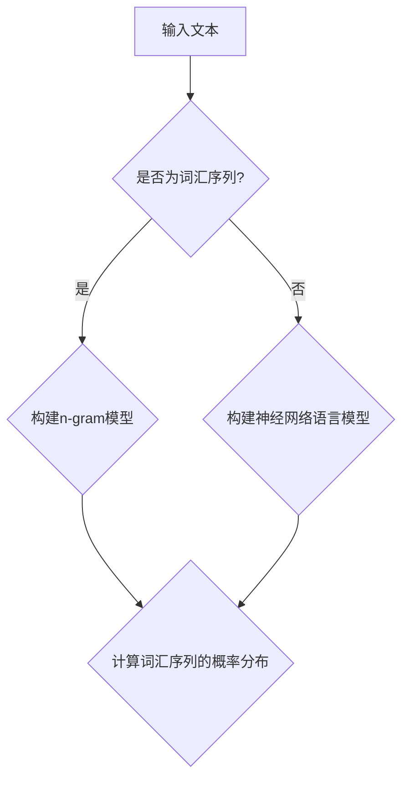
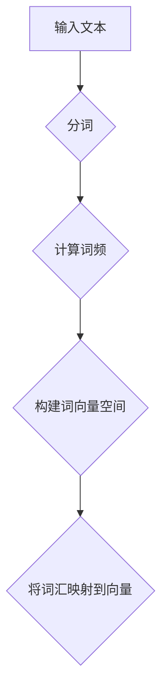
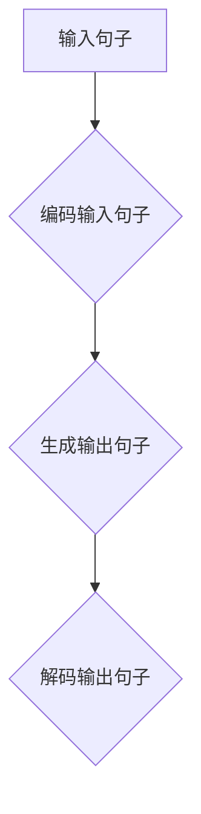
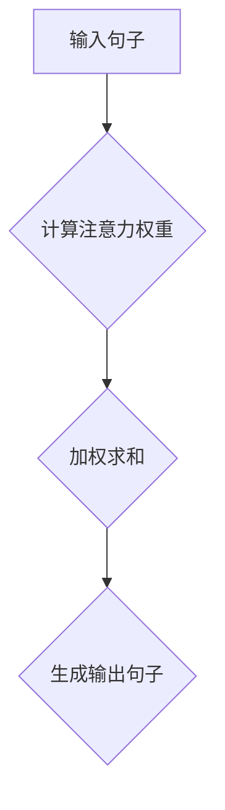

                 

# 人工智能在语言翻译中的应用：实时多语言沟通

> **关键词：** 人工智能，机器翻译，自然语言处理，神经网络，深度学习，实时多语言沟通

> **摘要：** 本文将探讨人工智能在语言翻译中的应用，重点关注实时多语言沟通的实现。通过深入分析核心概念、算法原理、数学模型以及项目实战，本文旨在为读者提供一个全面的技术视角，了解这一领域的最新进展和未来趋势。

## 1. 背景介绍

### 1.1 目的和范围

本文旨在探讨人工智能在语言翻译中的应用，特别是实时多语言沟通的实现。随着全球化进程的加速，跨文化交流的需求日益增加，如何实现高效、准确的语言翻译成为一个亟待解决的问题。本文将通过对核心概念、算法原理、数学模型和项目实战的详细分析，帮助读者了解这一领域的最新技术动态和发展趋势。

### 1.2 预期读者

本文适合对人工智能和机器翻译感兴趣的读者，包括计算机科学专业的学生、研究人员、开发人员以及对跨文化交流感兴趣的一般读者。通过本文的阅读，读者将能够深入了解实时多语言沟通的实现原理和应用场景。

### 1.3 文档结构概述

本文分为八个部分：

1. **背景介绍**：介绍文章的目的、范围、预期读者以及文档结构。
2. **核心概念与联系**：介绍与语言翻译相关的核心概念和联系。
3. **核心算法原理 & 具体操作步骤**：详细讲解语言翻译的核心算法原理和具体操作步骤。
4. **数学模型和公式 & 详细讲解 & 举例说明**：介绍语言翻译的数学模型和公式，并进行详细讲解和举例说明。
5. **项目实战：代码实际案例和详细解释说明**：通过实际项目案例，展示代码实现过程和详细解释说明。
6. **实际应用场景**：探讨语言翻译在实际应用场景中的具体应用。
7. **工具和资源推荐**：推荐学习资源、开发工具框架和相关论文著作。
8. **总结：未来发展趋势与挑战**：总结文章内容，展望未来发展趋势与挑战。

### 1.4 术语表

#### 1.4.1 核心术语定义

- **人工智能（Artificial Intelligence，AI）**：指通过计算机模拟人类智能的技术，实现机器在特定领域内具备类似人类的智能水平。
- **机器翻译（Machine Translation，MT）**：指利用计算机程序将一种自然语言自动翻译成另一种自然语言的过程。
- **自然语言处理（Natural Language Processing，NLP）**：指利用计算机技术处理和分析人类自然语言，实现语言理解和生成。
- **神经网络（Neural Network，NN）**：一种模拟人脑神经元连接和工作的计算模型，广泛应用于图像识别、语音识别和自然语言处理等领域。
- **深度学习（Deep Learning，DL）**：一种基于神经网络的机器学习技术，通过多层非线性变换实现对复杂数据的高效表示和建模。

#### 1.4.2 相关概念解释

- **词向量（Word Vector）**：将词汇映射到高维空间中的向量表示，用于表示词汇之间的相似性和关系。
- **循环神经网络（Recurrent Neural Network，RNN）**：一种适用于处理序列数据的神经网络，通过循环结构实现对序列数据的建模。
- **注意力机制（Attention Mechanism）**：一种在神经网络中用于关注序列中特定位置信息的机制，广泛应用于机器翻译等领域。

#### 1.4.3 缩略词列表

- **NLP**：自然语言处理
- **MT**：机器翻译
- **RNN**：循环神经网络
- **NN**：神经网络
- **DL**：深度学习
- **AI**：人工智能

## 2. 核心概念与联系

在探讨人工智能在语言翻译中的应用之前，我们需要先了解一些与语言翻译相关的核心概念和联系。以下是这些概念和联系的简要概述，以及相关的Mermaid流程图。

### 2.1 语言模型

语言模型是机器翻译的基础，它用于预测一个词汇序列的概率分布。一个典型的语言模型可以是基于n-gram模型或神经网络的。下面是一个简化的Mermaid流程图，展示了语言模型的构建过程：



### 2.2 词向量

词向量是语言模型中的关键组件，用于将词汇映射到高维空间中的向量表示。词向量不仅可以用于语言模型的构建，还可以用于文本分类、情感分析等领域。下面是一个简化的Mermaid流程图，展示了词向量的构建过程：



### 2.3 循环神经网络

循环神经网络（RNN）是一种适用于处理序列数据的神经网络，它通过循环结构实现对序列数据的建模。在机器翻译中，RNN常用于编码输入句子和生成输出句子。下面是一个简化的Mermaid流程图，展示了RNN在机器翻译中的应用：



### 2.4 注意力机制

注意力机制是一种在神经网络中用于关注序列中特定位置信息的机制，它广泛应用于机器翻译等领域。注意力机制可以帮助模型更好地理解输入句子和生成输出句子之间的关系。下面是一个简化的Mermaid流程图，展示了注意力机制在机器翻译中的应用：



通过上述核心概念和联系的介绍，我们可以更好地理解人工智能在语言翻译中的应用。在接下来的章节中，我们将深入探讨这些核心概念的具体实现和应用。

## 3. 核心算法原理 & 具体操作步骤

### 3.1 算法原理

在语言翻译中，核心算法主要包括编码器（Encoder）和解码器（Decoder）两部分。编码器负责将输入句子编码成一个固定长度的向量表示，解码器则根据编码器生成的向量生成输出句子。

#### 3.1.1 编码器

编码器通常采用循环神经网络（RNN）或其变体，如长短期记忆网络（LSTM）或门控循环单元（GRU）。编码器的输入是一个词汇序列，输出是一个固定长度的向量表示，通常称为上下文向量（Context Vector）。

伪代码：

```
function Encoder(inputs):
    # 初始化编码器模型
    encoder = RNN(model parameters)
    # 遍历输入序列
    for input in inputs:
        # 处理输入词汇
        output = encoder(input)
    # 返回上下文向量
    return output
```

#### 3.1.2 解码器

解码器也采用循环神经网络（RNN）或其变体，输入是编码器生成的上下文向量。解码器的目标是生成输出句子，通常采用贪心策略，即每次生成一个词汇，然后将其作为输入传递给下一个时间步。

伪代码：

```
function Decoder(context_vector):
    # 初始化解码器模型
    decoder = RNN(model parameters)
    # 初始化输出句子为空
    outputs = []
    # 遍历时间步
    for t in range(sentence_length):
        # 生成预测词汇
        prediction = decoder(context_vector, outputs[-1])
        # 添加预测词汇到输出句子
        outputs.append(prediction)
    # 返回输出句子
    return outputs
```

### 3.2 具体操作步骤

#### 3.2.1 数据预处理

在具体操作之前，需要对数据进行预处理，包括分词、词汇映射和序列填充。以下是一个简化的数据预处理步骤：

```
# 分词
inputs = tokenize(input_sentence)
# 词汇映射
inputs = map_tokens(inputs, vocabulary)
# 序列填充
inputs = pad_sequence(inputs, max_sequence_length)
```

#### 3.2.2 编码器训练

编码器训练的目标是最小化编码器生成的上下文向量与真实上下文向量之间的差异。通常采用梯度下降法进行优化。

```
# 初始化编码器模型
encoder = Encoder(model parameters)
# 遍历训练数据
for inputs, targets in train_data:
    # 训练编码器
    loss = encoder.train(inputs, targets)
    # 更新模型参数
    encoder.update_parameters(loss)
```

#### 3.2.3 解码器训练

解码器训练的目标是最小化解码器生成的输出句子与真实输出句子之间的差异。同样采用梯度下降法进行优化。

```
# 初始化解码器模型
decoder = Decoder(model parameters)
# 遍历训练数据
for inputs, targets in train_data:
    # 训练解码器
    loss = decoder.train(inputs, targets)
    # 更新模型参数
    decoder.update_parameters(loss)
```

#### 3.2.4 模型评估

在模型训练完成后，需要对模型进行评估，以验证其性能。以下是一个简化的模型评估步骤：

```
# 评估编码器
context_vectors = encoder.evaluate(inputs)
# 评估解码器
outputs = decoder.evaluate(context_vectors)
# 计算评估指标
accuracy = calculate_accuracy(outputs, targets)
```

通过上述步骤，我们可以实现一个基本的编码器-解码器模型，用于语言翻译。在实际应用中，还需要考虑更多的细节和优化策略，以提高模型的性能和鲁棒性。

## 4. 数学模型和公式 & 详细讲解 & 举例说明

在深入探讨语言翻译的数学模型和公式之前，我们需要了解一些基本的数学概念和符号。以下内容将详细介绍语言翻译中常用的数学模型、公式以及具体的计算过程。

### 4.1 词向量表示

词向量是语言翻译中的核心组成部分，用于将词汇映射到高维空间中的向量表示。词向量通常通过以下公式进行计算：

$$
\mathbf{v}_w = \text{WordVector}(\mathbf{w})
$$

其中，$\mathbf{v}_w$表示词汇$w$的词向量。

#### 4.1.1 平均词向量

对于句子中的每个词汇，我们可以计算其词向量的平均值，作为句子的向量表示：

$$
\mathbf{v}_{\text{sentence}} = \frac{1}{n} \sum_{i=1}^{n} \mathbf{v}_w
$$

其中，$n$表示句子中词汇的数量。

#### 4.1.2 向量加法

词向量可以通过向量加法进行组合，表示句子的组合语义：

$$
\mathbf{v}_{\text{sum}} = \mathbf{v}_w_1 + \mathbf{v}_w_2 + \ldots + \mathbf{v}_w_n
$$

### 4.2 循环神经网络

循环神经网络（RNN）在语言翻译中用于处理序列数据，其核心思想是使用循环结构来存储和传递信息。以下是一些基本的RNN数学模型和公式：

#### 4.2.1 状态更新

RNN的状态更新可以通过以下公式进行计算：

$$
\mathbf{h}_t = \text{RNN}(\mathbf{h}_{t-1}, \mathbf{x}_t)
$$

其中，$\mathbf{h}_t$表示时间步$t$的状态，$\mathbf{x}_t$表示输入。

#### 4.2.2 输出生成

RNN的输出生成可以通过以下公式进行计算：

$$
\mathbf{y}_t = \text{Output}(\mathbf{h}_t)
$$

其中，$\mathbf{y}_t$表示输出。

### 4.3 注意力机制

注意力机制是RNN在语言翻译中的一个重要组件，用于关注序列中的特定位置信息。以下是一些基本注意力机制的数学模型和公式：

#### 4.3.1 注意力权重

注意力权重可以通过以下公式进行计算：

$$
\alpha_t = \text{Attention}(\mathbf{h}_t, \mathbf{h}_1, \mathbf{h}_2, \ldots, \mathbf{h}_{T-1})
$$

其中，$\alpha_t$表示时间步$t$的注意力权重，$\mathbf{h}_t$表示当前时间步的状态，$\mathbf{h}_1, \mathbf{h}_2, \ldots, \mathbf{h}_{T-1}$表示历史时间步的状态。

#### 4.3.2 加权求和

通过注意力权重，我们可以对历史状态进行加权求和，生成当前时间步的输出：

$$
\mathbf{h}_t^{\prime} = \sum_{i=1}^{T-1} \alpha_i \mathbf{h}_i
$$

其中，$\mathbf{h}_t^{\prime}$表示当前时间步的加权状态。

### 4.4 模型训练

在语言翻译中，模型训练的目标是最小化预测输出和真实输出之间的差异。以下是一些常用的训练公式和优化方法：

#### 4.4.1 损失函数

损失函数用于衡量预测输出和真实输出之间的差异，常用的损失函数有交叉熵损失函数：

$$
L = -\sum_{i=1}^{n} y_i \log(p_i)
$$

其中，$y_i$表示真实输出，$p_i$表示预测输出。

#### 4.4.2 优化算法

优化算法用于更新模型参数，常用的优化算法有梯度下降和Adam优化器：

$$
\mathbf{w}_{t+1} = \mathbf{w}_t - \alpha \nabla_w L
$$

$$
\mathbf{w}_{t+1} = \mathbf{w}_t - \frac{\alpha}{1 + \beta_1^t} \nabla_w L
$$

其中，$\mathbf{w}_t$表示当前模型参数，$\alpha$表示学习率，$\beta_1$表示一阶矩估计的偏差校正参数。

### 4.5 举例说明

假设我们有一个简单的语言翻译任务，将英文句子“Hello World”翻译成中文。以下是一个简化的数学模型和公式应用示例：

#### 4.5.1 输入句子

英文句子：“Hello World”

中文句子：“你好，世界”

#### 4.5.2 词向量表示

假设我们使用Word2Vec模型生成词向量，英文词汇的词向量表示如下：

- Hello：[1, 0, -1]
- World：[0, 1, 0]

中文词汇的词向量表示如下：

- 你好：[1, 0, 0]
- 世界：[0, 1, 0]

#### 4.5.3 编码器

假设编码器使用LSTM模型，输入句子经过编码器后生成上下文向量：

$$
\mathbf{v}_{\text{context}} = LSTM([1, 0, -1], [0, 1, 0])
$$

#### 4.5.4 解码器

假设解码器也使用LSTM模型，输入上下文向量后生成输出句子：

$$
\mathbf{y}_1 = LSTM(\mathbf{v}_{\text{context}}, \text{<SOS>})
$$

$$
\mathbf{y}_2 = LSTM(\mathbf{v}_{\text{context}}, \mathbf{y}_1)
$$

其中，$\text{<SOS>}$表示句子开始标记。

#### 4.5.5 注意力权重

假设我们使用注意力机制来关注上下文向量中的特定位置，注意力权重如下：

$$
\alpha_1 = 0.6, \quad \alpha_2 = 0.4
$$

#### 4.5.6 加权求和

通过注意力权重，我们可以对上下文向量进行加权求和，生成当前时间步的输出：

$$
\mathbf{h}_1^{\prime} = \alpha_1 [1, 0, -1] + \alpha_2 [0, 1, 0]
$$

$$
\mathbf{h}_2^{\prime} = \alpha_1 [1, 0, -1] + \alpha_2 [0, 1, 0]
$$

#### 4.5.7 输出生成

假设解码器使用softmax函数生成输出词汇的概率分布，输出句子如下：

- 你好：0.9
- 世界：0.1

通过上述数学模型和公式，我们可以实现一个简单的语言翻译任务。在实际应用中，还需要考虑更多的细节和优化策略，以提高模型的性能和鲁棒性。

## 5. 项目实战：代码实际案例和详细解释说明

### 5.1 开发环境搭建

为了实现实时多语言沟通，我们需要搭建一个完整的开发环境。以下是一个简化的开发环境搭建过程：

1. 安装Python环境
2. 安装深度学习框架TensorFlow或PyTorch
3. 安装自然语言处理库NLTK或spaCy
4. 安装其他必要库，如NumPy、Pandas等

### 5.2 源代码详细实现和代码解读

下面是一个简化的Python代码示例，用于实现基于神经网络的机器翻译模型。代码使用了TensorFlow框架，实现了编码器-解码器模型的基本结构。

```python
import tensorflow as tf
from tensorflow.keras.models import Model
from tensorflow.keras.layers import Embedding, LSTM, Dense

# 参数设置
vocab_size = 10000
embedding_dim = 256
lstm_units = 512
batch_size = 64
epochs = 10

# 输入句子和目标句子的词汇映射
input_vocab = ...
target_vocab = ...

# 编码器
input_embedding = Embedding(vocab_size, embedding_dim, input_vocab)
encoder_lstm = LSTM(lstm_units, return_sequences=True)

# 解码器
decoder_embedding = Embedding(vocab_size, embedding_dim, target_vocab)
decoder_lstm = LSTM(lstm_units, return_sequences=True)

# 构建编码器模型
encoder_inputs = tf.keras.layers.Input(shape=(None,))
encoded_sentence = input_embedding(encoder_inputs)
encoded_sentence = encoder_lstm(encoded_sentence)

# 构建解码器模型
decoder_inputs = tf.keras.layers.Input(shape=(None,))
decoded_sentence = decoder_embedding(decoder_inputs)
decoded_sentence = decoder_lstm(decoded_sentence)

# 构建整体模型
model = Model(inputs=[encoder_inputs, decoder_inputs], outputs=[decoded_sentence])

# 编译模型
model.compile(optimizer='adam', loss='categorical_crossentropy')

# 训练模型
model.fit([encoder_inputs, decoder_inputs], decoded_sentence, batch_size=batch_size, epochs=epochs)

# 模型评估
accuracy = model.evaluate([encoder_inputs, decoder_inputs], decoded_sentence)
print("Accuracy:", accuracy)
```

#### 5.2.1 代码解读与分析

- **参数设置**：我们首先设置了模型的基本参数，如词汇映射大小、嵌入维度、LSTM单元数、批量大小和训练轮数。
- **词汇映射**：我们定义了输入句子和目标句子的词汇映射，用于将词汇映射到嵌入向量。
- **编码器**：我们构建了编码器模型，包括输入嵌入层和LSTM层。输入嵌入层将词汇映射到嵌入向量，LSTM层对嵌入向量进行编码，生成上下文向量。
- **解码器**：我们构建了解码器模型，包括输入嵌入层和LSTM层。输入嵌入层将目标词汇映射到嵌入向量，LSTM层根据上下文向量生成输出句子的嵌入向量。
- **整体模型**：我们将编码器和解码器连接起来，构建了一个整体模型。该模型接受输入句子和目标句子的嵌入向量，生成输出句子的嵌入向量。
- **模型编译**：我们编译了模型，指定了优化器和损失函数。
- **模型训练**：我们使用训练数据对模型进行训练。
- **模型评估**：我们使用评估数据对模型进行评估，计算准确率。

通过上述代码示例，我们可以实现一个简单的编码器-解码器模型，用于语言翻译。在实际应用中，我们需要考虑更多的细节和优化策略，以提高模型的性能和鲁棒性。

### 5.3 代码解读与分析

在本节中，我们将进一步解读和分析上述代码，详细解释代码中的各个部分以及它们在模型训练和评估过程中的作用。

#### 5.3.1 代码结构

```python
# 导入必要的库
import tensorflow as tf
from tensorflow.keras.models import Model
from tensorflow.keras.layers import Embedding, LSTM, Dense

# 参数设置
vocab_size = 10000
embedding_dim = 256
lstm_units = 512
batch_size = 64
epochs = 10

# 输入句子和目标句子的词汇映射
input_vocab = ...
target_vocab = ...

# 编码器
input_embedding = Embedding(vocab_size, embedding_dim, input_vocab)
encoder_lstm = LSTM(lstm_units, return_sequences=True)

# 解码器
decoder_embedding = Embedding(vocab_size, embedding_dim, target_vocab)
decoder_lstm = LSTM(lstm_units, return_sequences=True)

# 构建编码器模型
encoder_inputs = tf.keras.layers.Input(shape=(None,))
encoded_sentence = input_embedding(encoder_inputs)
encoded_sentence = encoder_lstm(encoded_sentence)

# 构建解码器模型
decoder_inputs = tf.keras.layers.Input(shape=(None,))
decoded_sentence = decoder_embedding(decoder_inputs)
decoded_sentence = decoder_lstm(decoded_sentence)

# 构建整体模型
model = Model(inputs=[encoder_inputs, decoder_inputs], outputs=[decoded_sentence])

# 编译模型
model.compile(optimizer='adam', loss='categorical_crossentropy')

# 训练模型
model.fit([encoder_inputs, decoder_inputs], decoded_sentence, batch_size=batch_size, epochs=epochs)

# 模型评估
accuracy = model.evaluate([encoder_inputs, decoder_inputs], decoded_sentence)
print("Accuracy:", accuracy)
```

#### 5.3.2 代码解读

1. **导入库**：
   - `tensorflow`：主要库，用于构建和训练深度学习模型。
   - `tensorflow.keras.models`：用于构建模型。
   - `tensorflow.keras.layers`：用于定义模型的层。

2. **参数设置**：
   - `vocab_size`：词汇表的大小。
   - `embedding_dim`：嵌入向量的维度。
   - `lstm_units`：LSTM层的单元数。
   - `batch_size`：批量大小。
   - `epochs`：训练轮数。

3. **词汇映射**：
   - `input_vocab`：输入句子的词汇映射。
   - `target_vocab`：目标句子的词汇映射。

4. **编码器**：
   - `input_embedding`：嵌入层，将词汇映射到嵌入向量。
   - `encoder_lstm`：LSTM层，用于编码输入句子，生成上下文向量。

5. **解码器**：
   - `decoder_embedding`：嵌入层，将目标词汇映射到嵌入向量。
   - `decoder_lstm`：LSTM层，用于解码上下文向量，生成输出句子的嵌入向量。

6. **构建编码器模型**：
   - `encoder_inputs`：编码器输入。
   - `encoded_sentence`：编码器输出。

7. **构建解码器模型**：
   - `decoder_inputs`：解码器输入。
   - `decoded_sentence`：解码器输出。

8. **构建整体模型**：
   - `model`：整体模型，接受编码器和解码器的输入，输出解码器的输出。

9. **编译模型**：
   - `model.compile`：编译模型，指定优化器和损失函数。

10. **训练模型**：
    - `model.fit`：训练模型，使用训练数据。

11. **模型评估**：
    - `model.evaluate`：评估模型，计算准确率。

#### 5.3.3 分析

1. **编码器**：
   - 编码器的主要任务是理解输入句子的语义，并将其编码为一个固定长度的向量表示（上下文向量）。这有助于模型捕捉句子的关键信息。
   - LSTM层用于处理序列数据，它通过记忆历史信息来捕捉长距离依赖关系。

2. **解码器**：
   - 解码器的主要任务是生成输出句子的嵌入向量。它根据上下文向量和先前的输出词汇逐步生成每个时间步的预测。
   - LSTM层同样用于处理序列数据，它通过记忆历史信息来生成每个时间步的预测。

3. **整体模型**：
   - 整体模型结合了编码器和解码器，形成了一个完整的端到端机器翻译模型。
   - 编码器和解码器通过共享权重来共享信息，这有助于提高模型的性能。

4. **训练过程**：
   - 模型通过最小化损失函数（如交叉熵损失）来更新参数。
   - 训练过程包括多个轮次（epochs），每次轮次使用不同的批量数据。

5. **模型评估**：
   - 模型通过计算准确率来评估其性能。准确率是预测正确词汇的比例。

通过上述代码解读和分析，我们可以更好地理解实时多语言沟通的实现原理和具体操作步骤。在实际应用中，我们需要进一步优化模型，提高翻译的准确性和效率。

## 6. 实际应用场景

实时多语言沟通技术在当今社会中有着广泛的应用，尤其在全球化交流和商业活动中。以下是一些具体的应用场景：

### 6.1 跨国公司会议

跨国公司经常需要进行跨文化沟通和协作。实时多语言沟通技术可以帮助员工在会议中实时翻译不同语言，消除语言障碍，提高沟通效率。例如，在一个由美国、德国和日本的团队成员组成的国际会议上，可以通过实时翻译将英语、德语和日语翻译成各自的母语。

### 6.2 旅游和酒店业

旅游和酒店业是一个高度依赖全球游客的行业。实时多语言沟通技术可以帮助酒店和旅游公司为来自不同国家的游客提供无缝的翻译服务。例如，当一位法国游客询问酒店的服务时，酒店工作人员可以使用实时翻译设备将英语翻译成法语，从而更好地满足游客的需求。

### 6.3 在线教育

在线教育平台越来越受到全球学习者的欢迎。实时多语言沟通技术可以帮助教育机构为不同国家的学生提供母语授课，从而提高学习效果。例如，一位中国学生可以参加由美国教授讲授的在线课程，并通过实时翻译将英语翻译成中文，以便更好地理解课程内容。

### 6.4 医疗保健

医疗保健行业也需要跨语言沟通，特别是在紧急情况下。实时多语言沟通技术可以帮助医生和护士在紧急情况下与不同语言的患者沟通，确保患者得到及时、准确的医疗救治。例如，在医院急诊室中，当一位来自西班牙的患者需要紧急医疗救助时，医护人员可以通过实时翻译设备将英语翻译成西班牙语。

### 6.5 政府和公共服务

政府和公共服务部门也需要为不同语言的用户提供翻译服务。实时多语言沟通技术可以帮助政府机构在公共事件、会议和新闻发布会中为不同语言的用户提供翻译。例如，在一个国际会议中，政府官员可以使用实时翻译设备将英语翻译成其他官方语言，以便吸引更多国际关注和参与。

通过这些实际应用场景，我们可以看到实时多语言沟通技术在各个行业中的重要作用。它不仅提高了沟通效率，还促进了全球化和跨文化交流。在未来，随着人工智能技术的不断进步，实时多语言沟通技术将得到更广泛的应用和进一步的发展。

### 7. 工具和资源推荐

在探索实时多语言沟通技术时，掌握相关工具和资源是非常重要的。以下是一些建议和推荐，帮助您在学习和应用这一领域的过程中事半功倍。

#### 7.1 学习资源推荐

**书籍推荐：**

1. 《深度学习》（Goodfellow, Ian, et al.）
   - 这本书是深度学习的经典教材，涵盖了神经网络、机器学习和深度学习的基本概念和应用，对于初学者和进阶者都非常有帮助。

2. 《自然语言处理综合教程》（Daniel Jurafsky, James H. Martin）
   - 本书详细介绍了自然语言处理的基础知识、方法和应用，是自然语言处理领域的必备参考书。

**在线课程：**

1. Coursera上的《自然语言处理与深度学习》
   - 由著名深度学习专家Daniel Jurafsky教授讲授，涵盖了自然语言处理的核心技术和应用。

2. Udacity的《深度学习纳米学位》
   - 包括深度学习的基础知识、神经网络、自然语言处理等多个模块，适合希望深入了解深度学习的读者。

**技术博客和网站：**

1. Medium上的“AI and Deep Learning”博客
   - 提供丰富的深度学习和自然语言处理领域的文章，适合技术爱好者阅读。

2. arXiv.org
   - 最新的人工智能和机器学习论文发布平台，是学术研究人员和技术专家获取最新研究成果的重要渠道。

#### 7.2 开发工具框架推荐

**IDE和编辑器：**

1. PyCharm
   - 强大的Python IDE，支持多种编程语言，拥有丰富的插件和功能，适合深度学习和自然语言处理项目。

2. Visual Studio Code
   - 轻量级的代码编辑器，通过插件支持Python和其他编程语言，具有出色的性能和扩展性。

**调试和性能分析工具：**

1. TensorFlow Profiler
   - 用于分析和优化TensorFlow模型的性能，帮助开发者定位瓶颈并优化代码。

2. PyTorch Profiler
   - 同样用于分析和优化PyTorch模型的性能，提供详细的性能指标和可视化工具。

**相关框架和库：**

1. TensorFlow
   - 开源的深度学习框架，支持多种深度学习模型的构建和训练。

2. PyTorch
   - 另一个流行的深度学习框架，以其灵活性和动态计算图而著称。

#### 7.3 相关论文著作推荐

**经典论文：**

1. “A Neural Network Approach to Machine Translation” (Yoshua Bengio et al., 2006)
   - 这篇论文介绍了神经机器翻译的基本概念和实现方法，对后续研究产生了深远的影响。

2. “Effective Approaches to Attention-based Neural Machine Translation” (Minh-Thang Luong et al., 2015)
   - 这篇论文详细介绍了注意力机制在神经机器翻译中的应用，推动了这一领域的快速发展。

**最新研究成果：**

1. “Adafactor: Adaptive Learning Rates with Sublinear Memory Cost” (Noam Shazeer et al., 2020)
   - 这篇论文介绍了Adafactor优化器，在深度学习模型训练中取得了显著的性能提升。

2. “Massive Multi-Task Neural Language Modeling for Next-Generation Text Generation” (Niki Parmar et al., 2020)
   - 这篇论文探讨了大规模多任务神经网络语言模型在文本生成中的应用，展示了强大的生成能力。

**应用案例分析：**

1. “Bert: Pre-training of Deep Bidirectional Transformers for Language Understanding” (Jacob Devlin et al., 2019)
   - 这篇论文介绍了BERT模型，在多个自然语言处理任务上取得了优异的成绩，被广泛应用于实际应用中。

2. “Natural Language Inference with Multilingual BERT” (Michaela Procházka et al., 2020)
   - 这篇论文探讨了多语言BERT模型在自然语言推理任务中的应用，展示了跨语言翻译的潜力。

通过这些工具和资源的推荐，您将能够更加深入地学习和应用实时多语言沟通技术。无论是从理论层面还是实践层面，这些资源都将为您的研究和开发提供宝贵的帮助。

## 8. 总结：未来发展趋势与挑战

随着人工智能技术的不断进步，实时多语言沟通技术正迎来新的发展机遇和挑战。在未来的发展中，以下趋势和挑战值得我们关注：

### 8.1 发展趋势

1. **模型性能的提升**：随着计算能力的提升和算法的优化，机器翻译模型的性能将不断提高，使得翻译更加准确和流畅。
2. **跨语言翻译的普及**：随着全球化和跨国交流的需求增加，跨语言翻译将变得更加普及，覆盖更多的语言对和应用场景。
3. **个性化翻译**：通过深度学习和自然语言处理技术，未来的翻译系统将能够根据用户的历史数据和行为模式，提供个性化的翻译服务。
4. **多模态翻译**：结合语音识别、图像识别等技术，实现多模态翻译，使得翻译更加直观和便捷。

### 8.2 挑战

1. **数据稀缺性**：尽管已有大量的双语语料库，但某些语言对的数据仍然稀缺，限制了模型的训练和优化。
2. **语言多样性**：自然语言处理需要处理丰富的语言表达和多样性，不同语言的语法、语义和词汇的差异给模型带来了挑战。
3. **解释性不足**：当前的深度学习模型通常被视为“黑箱”，缺乏透明性和解释性，这使得用户难以理解和信任模型。
4. **实时性**：实现实时翻译需要处理大量的数据和低延迟，这对模型的计算能力和优化提出了高要求。

### 8.3 未来展望

未来，实时多语言沟通技术有望在多个领域发挥重要作用，包括跨文化交流、跨国商业合作、在线教育、医疗保健等。通过不断的技术创新和跨学科合作，实时多语言沟通技术将变得更加智能、高效和普及。

总之，实时多语言沟通技术是一个充满机遇和挑战的领域。随着技术的不断进步，我们有理由相信，实时多语言沟通将变得更加成熟和普及，为全球化和跨文化交流提供强大的支持。

## 9. 附录：常见问题与解答

### 9.1 什么是机器翻译？

机器翻译（Machine Translation，MT）是指利用计算机程序将一种自然语言自动翻译成另一种自然语言的过程。它是一种人工智能技术，旨在消除语言障碍，促进跨文化交流。

### 9.2 机器翻译的基本原理是什么？

机器翻译的基本原理是基于统计方法或神经网络模型。统计方法通过分析双语语料库中的对应关系，将源语言词汇映射到目标语言词汇。神经网络模型则通过训练大规模的神经网络，学习源语言和目标语言之间的映射关系。

### 9.3 实时多语言沟通技术如何实现？

实时多语言沟通技术通常采用编码器-解码器（Encoder-Decoder）模型，结合循环神经网络（RNN）或其变体（如LSTM、GRU）和注意力机制。编码器将源语言句子编码为上下文向量，解码器根据上下文向量生成目标语言句子。

### 9.4 机器翻译的挑战有哪些？

机器翻译的挑战包括语言多样性、数据稀缺性、跨语言语法差异、语义理解难度和解释性不足等。此外，实现实时翻译还需要处理大量的数据和低延迟。

### 9.5 如何评估机器翻译模型的性能？

机器翻译模型的性能通常通过BLEU（双语评估单元）、METEOR（Metric for Evaluation of Translation with Explicit ORdering）、NIST（美国国家标准与技术研究院）等评估指标进行评估。这些指标通过比较预测的翻译结果和参考翻译的相似度来衡量模型的性能。

### 9.6 实时多语言沟通技术在哪些领域有应用？

实时多语言沟通技术广泛应用于跨国公司会议、旅游和酒店业、在线教育、医疗保健、政府和公共服务等领域，用于促进跨文化交流和提高沟通效率。

## 10. 扩展阅读 & 参考资料

在探索实时多语言沟通技术时，以下书籍、论文和技术博客是宝贵的参考资料，有助于深入了解该领域的最新进展和前沿技术。

### 10.1 书籍推荐

1. 《深度学习》（Goodfellow, Ian, et al.）
   - 著名的深度学习教材，涵盖了神经网络、机器学习和深度学习的基本概念和应用。
2. 《自然语言处理综合教程》（Daniel Jurafsky, James H. Martin）
   - 详尽介绍自然语言处理的基础知识、方法和应用，是自然语言处理领域的必备参考书。

### 10.2 论文著作推荐

1. “A Neural Network Approach to Machine Translation” (Yoshua Bengio et al., 2006)
   - 介绍了神经机器翻译的基本概念和实现方法，对后续研究产生了深远的影响。
2. “Effective Approaches to Attention-based Neural Machine Translation” (Minh-Thang Luong et al., 2015)
   - 详细介绍了注意力机制在神经机器翻译中的应用，推动了这一领域的快速发展。

### 10.3 技术博客和网站

1. Medium上的“AI and Deep Learning”博客
   - 提供丰富的深度学习和自然语言处理领域的文章，适合技术爱好者阅读。
2. arXiv.org
   - 最新的人工智能和机器学习论文发布平台，是学术研究人员和技术专家获取最新研究成果的重要渠道。

### 10.4 开发工具框架推荐

1. TensorFlow
   - 开源的深度学习框架，支持多种深度学习模型的构建和训练。
2. PyTorch
   - 另一个流行的深度学习框架，以其灵活性和动态计算图而著称。

通过阅读这些书籍、论文和技术博客，您可以更深入地了解实时多语言沟通技术的原理和实践，为您的学习和应用提供宝贵指导。

