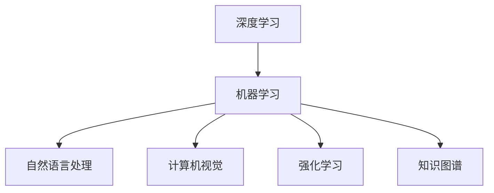

                 

# 人工智能研究的七大领域

> 关键词：人工智能、研究领域、深度学习、机器学习、自然语言处理、计算机视觉、强化学习、知识图谱

> 摘要：本文深入探讨了人工智能领域的七大核心研究方向，包括深度学习、机器学习、自然语言处理、计算机视觉、强化学习、知识图谱等。通过逻辑清晰、结构紧凑、简单易懂的论述，帮助读者了解这些研究方向的基本原理、核心算法及实际应用，为未来人工智能的研究和应用提供参考。

## 1. 背景介绍

### 1.1 目的和范围

本文旨在梳理人工智能领域的主要研究方向，对其基本原理、核心算法和实际应用进行详细阐述。通过这篇文章，读者可以全面了解人工智能领域的最新动态和发展趋势，为自己的研究和工作提供有价值的参考。

### 1.2 预期读者

本文适合对人工智能有一定了解的读者，包括从事人工智能研究、开发、应用等相关领域的人员。同时，也欢迎对人工智能感兴趣的普通读者阅读。

### 1.3 文档结构概述

本文分为八大章节，包括：

1. 背景介绍
2. 核心概念与联系
3. 核心算法原理 & 具体操作步骤
4. 数学模型和公式 & 详细讲解 & 举例说明
5. 项目实战：代码实际案例和详细解释说明
6. 实际应用场景
7. 工具和资源推荐
8. 总结：未来发展趋势与挑战

### 1.4 术语表

#### 1.4.1 核心术语定义

- 人工智能（AI）：模拟人类智能行为的计算机系统
- 深度学习（DL）：一种基于多层神经网络的学习方法
- 机器学习（ML）：通过数据训练模型，实现计算机自动学习和预测的技术
- 自然语言处理（NLP）：研究计算机如何理解和生成自然语言
- 计算机视觉（CV）：研究如何让计算机理解和解释视觉信息
- 强化学习（RL）：通过奖励机制学习最优策略的机器学习技术
- 知识图谱（KG）：利用图结构表示实体及其关系的数据模型

#### 1.4.2 相关概念解释

- 数据集（Dataset）：用于训练模型的示例数据
- 模型（Model）：从数据中学习到的规则或函数
- 过拟合（Overfitting）：模型对训练数据的拟合程度过高，泛化能力差
- 泛化（Generalization）：模型在未知数据上的表现能力

#### 1.4.3 缩略词列表

- AI：人工智能
- DL：深度学习
- ML：机器学习
- NLP：自然语言处理
- CV：计算机视觉
- RL：强化学习
- KG：知识图谱

## 2. 核心概念与联系

人工智能领域的研究主要集中在以下七个方向，这些方向相互关联，共同推动人工智能技术的发展。

### 2.1 深度学习

深度学习（Deep Learning，DL）是一种基于多层神经网络（Neural Network，NN）的学习方法。它通过多层非线性变换，逐步提取输入数据的特征，实现复杂任务的自动化。

### 2.2 机器学习

机器学习（Machine Learning，ML）是一种通过数据训练模型，实现计算机自动学习和预测的技术。它包括监督学习、无监督学习、半监督学习等不同类型。

### 2.3 自然语言处理

自然语言处理（Natural Language Processing，NLP）研究计算机如何理解和生成自然语言。它涉及词法分析、句法分析、语义分析、情感分析等任务。

### 2.4 计算机视觉

计算机视觉（Computer Vision，CV）研究如何让计算机理解和解释视觉信息。它包括图像分类、目标检测、人脸识别、图像生成等任务。

### 2.5 强化学习

强化学习（Reinforcement Learning，RL）通过奖励机制学习最优策略的机器学习技术。它广泛应用于游戏、机器人、自动驾驶等领域。

### 2.6 知识图谱

知识图谱（Knowledge Graph，KG）是一种利用图结构表示实体及其关系的数据模型。它有助于解决信息抽取、知识推理、推荐系统等问题。

### 2.7 联系与互动

这七大领域相互关联，相互促进。例如，深度学习和机器学习为自然语言处理和计算机视觉提供了强大的算法支持；强化学习在自动驾驶和游戏领域发挥了重要作用；知识图谱为各种任务提供了丰富的背景知识。

### 2.8 Mermaid 流程图



## 3. 核心算法原理 & 具体操作步骤

### 3.1 深度学习

深度学习（Deep Learning，DL）是一种基于多层神经网络（Neural Network，NN）的学习方法。它通过多层非线性变换，逐步提取输入数据的特征，实现复杂任务的自动化。

#### 3.1.1 神经网络基本原理

神经网络（NN）由多个神经元（Node）组成，每个神经元接收输入信号，通过权重（Weight）和偏置（Bias）进行加权求和，最后通过激活函数（Activation Function）得到输出。

#### 3.1.2 深度学习具体操作步骤

1. **数据预处理**：将输入数据转化为神经网络可以处理的形式，如归一化、标准化等。
2. **构建神经网络**：定义神经网络结构，包括层数、每层神经元个数、激活函数等。
3. **初始化权重和偏置**：随机初始化权重和偏置。
4. **前向传播**：将输入数据输入神经网络，逐层计算输出。
5. **计算损失函数**：根据输出结果和真实标签，计算损失函数值。
6. **反向传播**：根据损失函数梯度，更新权重和偏置。
7. **迭代训练**：重复执行步骤4-6，直到满足停止条件。

#### 3.1.3 伪代码

```python
# 初始化神经网络
# 前向传播
# 计算损失函数
# 反向传播
# 更新权重和偏置
# 迭代训练
```

### 3.2 机器学习

机器学习（Machine Learning，ML）是一种通过数据训练模型，实现计算机自动学习和预测的技术。它包括监督学习、无监督学习、半监督学习等不同类型。

#### 3.2.1 监督学习

监督学习（Supervised Learning）是一种最常见的机器学习方法。它通过已知输入和输出数据，训练模型以预测未知数据的输出。

1. **数据预处理**：将输入数据转化为模型可以处理的形式，如归一化、标准化等。
2. **选择模型**：根据任务选择合适的模型，如线性回归、决策树、支持向量机等。
3. **训练模型**：将输入数据输入模型，调整参数以最小化损失函数。
4. **评估模型**：使用验证集或测试集评估模型性能。

#### 3.2.2 无监督学习

无监督学习（Unsupervised Learning）是一种不使用标签数据的机器学习方法。它通过探索数据内在结构，如聚类、降维等。

1. **数据预处理**：将输入数据转化为模型可以处理的形式，如归一化、标准化等。
2. **选择模型**：根据任务选择合适的模型，如k-均值聚类、主成分分析等。
3. **训练模型**：调整模型参数以优化目标函数。
4. **评估模型**：根据任务要求评估模型性能。

#### 3.2.3 半监督学习

半监督学习（Semi-supervised Learning）结合了监督学习和无监督学习的方法。它利用少量标签数据和大量无标签数据，提高模型性能。

1. **数据预处理**：将输入数据转化为模型可以处理的形式，如归一化、标准化等。
2. **选择模型**：根据任务选择合适的模型，如自编码器、标签传播等。
3. **训练模型**：利用标签数据训练模型，同时利用无标签数据优化模型。
4. **评估模型**：使用验证集或测试集评估模型性能。

### 3.3 自然语言处理

自然语言处理（Natural Language Processing，NLP）研究计算机如何理解和生成自然语言。它涉及词法分析、句法分析、语义分析、情感分析等任务。

#### 3.3.1 词法分析

词法分析（Lexical Analysis）是NLP的第一步，主要任务是将文本分解为单词或词素。

1. **分词**：将文本分解为单词或词素。
2. **词性标注**：为每个单词或词素标注词性，如名词、动词、形容词等。

#### 3.3.2 句法分析

句法分析（Syntax Analysis）研究句子结构，主要任务是将文本分解为短语结构。

1. **词法分析**：将文本分解为单词或词素。
2. **句法分析**：将单词或词素组合成短语结构，如主语、谓语、宾语等。

#### 3.3.3 语义分析

语义分析（Semantic Analysis）研究文本的含义，主要任务是将文本分解为语义单元。

1. **词法分析**：将文本分解为单词或词素。
2. **句法分析**：将单词或词素组合成短语结构。
3. **语义分析**：将短语结构转换为语义表示，如词义、语义角色等。

#### 3.3.4 情感分析

情感分析（Sentiment Analysis）研究文本的情感倾向，主要任务是对文本进行分类。

1. **词法分析**：将文本分解为单词或词素。
2. **句法分析**：将单词或词素组合成短语结构。
3. **语义分析**：将短语结构转换为语义表示。
4. **情感分析**：根据语义表示对文本进行分类，如正面、负面、中性等。

### 3.4 计算机视觉

计算机视觉（Computer Vision，CV）研究如何让计算机理解和解释视觉信息。它包括图像分类、目标检测、人脸识别、图像生成等任务。

#### 3.4.1 图像分类

图像分类（Image Classification）是一种常见的CV任务，主要任务是将图像划分为不同的类别。

1. **数据预处理**：将图像转化为模型可以处理的形式，如归一化、标准化等。
2. **选择模型**：根据任务选择合适的模型，如卷积神经网络（CNN）、支持向量机（SVM）等。
3. **训练模型**：利用图像数据训练模型。
4. **评估模型**：使用验证集或测试集评估模型性能。

#### 3.4.2 目标检测

目标检测（Object Detection）是一种CV任务，主要任务是在图像中检测并定位多个目标。

1. **数据预处理**：将图像转化为模型可以处理的形式，如归一化、标准化等。
2. **选择模型**：根据任务选择合适的模型，如R-CNN、Faster R-CNN等。
3. **训练模型**：利用图像数据训练模型。
4. **评估模型**：使用验证集或测试集评估模型性能。

#### 3.4.3 人脸识别

人脸识别（Face Recognition）是一种CV任务，主要任务是根据人脸图像识别身份。

1. **数据预处理**：将人脸图像转化为模型可以处理的形式，如归一化、标准化等。
2. **选择模型**：根据任务选择合适的模型，如深度卷积神经网络（Deep CNN）等。
3. **训练模型**：利用人脸图像数据训练模型。
4. **评估模型**：使用验证集或测试集评估模型性能。

#### 3.4.4 图像生成

图像生成（Image Generation）是一种CV任务，主要任务是根据文本描述生成图像。

1. **数据预处理**：将文本转化为模型可以处理的形式，如编码、解码等。
2. **选择模型**：根据任务选择合适的模型，如生成对抗网络（GAN）等。
3. **训练模型**：利用文本数据训练模型。
4. **评估模型**：使用验证集或测试集评估模型性能。

### 3.5 强化学习

强化学习（Reinforcement Learning，RL）通过奖励机制学习最优策略的机器学习技术。它广泛应用于游戏、机器人、自动驾驶等领域。

#### 3.5.1 强化学习基本原理

强化学习（Reinforcement Learning，RL）是一种通过奖励机制学习最优策略的机器学习技术。它主要由以下四个部分组成：

1. **环境（Environment）**：提供状态和奖励。
2. **智能体（Agent）**：接收状态，选择动作，获取奖励。
3. **状态（State）**：描述当前环境的状态。
4. **动作（Action）**：智能体可以选择的动作。

#### 3.5.2 强化学习具体操作步骤

1. **初始化**：定义环境和智能体，初始化状态和动作。
2. **选择动作**：根据当前状态，选择一个动作。
3. **执行动作**：在环境中执行动作，获取新的状态和奖励。
4. **更新状态**：根据新的状态，更新智能体的状态。
5. **迭代训练**：重复执行步骤2-4，直到满足停止条件。

#### 3.5.3 伪代码

```python
# 初始化环境
# 初始化智能体
# 选择动作
# 执行动作
# 获取奖励
# 更新状态
# 迭代训练
```

### 3.6 知识图谱

知识图谱（Knowledge Graph，KG）是一种利用图结构表示实体及其关系的数据模型。它有助于解决信息抽取、知识推理、推荐系统等问题。

#### 3.6.1 知识图谱基本原理

知识图谱（Knowledge Graph，KG）是一种利用图结构表示实体及其关系的数据模型。它主要由以下三个部分组成：

1. **实体（Entity）**：知识图谱中的主体，如人、地点、物品等。
2. **关系（Relationship）**：描述实体之间的关联，如“属于”、“位于”、“购买”等。
3. **属性（Attribute）**：描述实体的属性信息，如年龄、身高、颜色等。

#### 3.6.2 知识图谱具体操作步骤

1. **数据采集**：从各种数据源中提取实体、关系和属性。
2. **数据预处理**：对采集到的数据进行清洗、去重、归一化等处理。
3. **构建图谱**：将预处理后的数据构建为图结构，表示实体及其关系。
4. **存储与查询**：将知识图谱存储在数据库中，以便进行查询和推理。

#### 3.6.3 伪代码

```python
# 数据采集
# 数据预处理
# 构建图谱
# 存储与查询
```

## 4. 数学模型和公式 & 详细讲解 & 举例说明

### 4.1 深度学习

深度学习中的数学模型主要包括多层感知机（MLP）、卷积神经网络（CNN）和循环神经网络（RNN）等。以下以多层感知机（MLP）为例，介绍其数学模型和公式。

#### 4.1.1 多层感知机（MLP）

多层感知机（MLP）是一种前馈神经网络，包括输入层、隐藏层和输出层。其数学模型如下：

$$
z_i^{(l)} = \sum_{j=1}^{n} w_{ij}^{(l)} x_j^{(l-1)} + b_i^{(l)}
$$

$$
a_i^{(l)} = \sigma(z_i^{(l)})
$$

其中，$z_i^{(l)}$表示第$l$层第$i$个神经元的加权和，$w_{ij}^{(l)}$表示第$l$层第$i$个神经元与第$l-1$层第$j$个神经元的连接权重，$b_i^{(l)}$表示第$l$层第$i$个神经元的偏置，$\sigma$表示激活函数，通常使用Sigmoid函数或ReLU函数。

#### 4.1.2 举例说明

假设我们有一个二分类问题，输入特征为$x = [x_1, x_2]$，输出为$y \in \{0, 1\}$。我们使用一个单层感知机进行模型训练。

1. **初始化参数**：

$$
w_1 = \begin{bmatrix}
0.1 & 0.2
\end{bmatrix}, \quad b_1 = 0.3
$$

2. **前向传播**：

$$
z_1 = w_1 x + b_1 = \begin{bmatrix}
0.1 & 0.2
\end{bmatrix} \begin{bmatrix}
1 \\
2
\end{bmatrix} + 0.3 = 0.7
$$

$$
a_1 = \sigma(z_1) = \frac{1}{1 + e^{-0.7}} \approx 0.6
$$

3. **计算损失函数**：

假设我们使用交叉熵损失函数（Cross-Entropy Loss），即：

$$
L(y, a) = -y \log(a) - (1 - y) \log(1 - a)
$$

其中，$y$为真实标签，$a$为预测概率。

4. **反向传播**：

计算损失函数关于参数的梯度，更新参数：

$$
\frac{\partial L}{\partial w_1} = \frac{\partial L}{\partial a_1} a_1 (1 - a_1) x
$$

$$
\frac{\partial L}{\partial b_1} = \frac{\partial L}{\partial a_1} a_1 (1 - a_1)
$$

### 4.2 自然语言处理

自然语言处理中的数学模型主要包括词嵌入（Word Embedding）、循环神经网络（RNN）、长短期记忆网络（LSTM）和Transformer等。以下以词嵌入（Word Embedding）为例，介绍其数学模型和公式。

#### 4.2.1 词嵌入（Word Embedding）

词嵌入（Word Embedding）是将单词映射到高维向量空间的方法。其数学模型如下：

$$
\mathbf{v}_i = \text{Embed}(\text{word}_i)
$$

其中，$\mathbf{v}_i$为第$i$个单词的嵌入向量，$\text{Embed}$为嵌入函数，通常使用Word2Vec、GloVe等算法。

#### 4.2.2 举例说明

假设我们使用Word2Vec算法训练了一个词嵌入模型，其中单词“apple”的嵌入向量为$\mathbf{v}_{\text{apple}} = \begin{bmatrix} 0.1 & 0.2 & 0.3 \end{bmatrix}^T$。

1. **输入句子**：将句子“我喜欢吃苹果”转换为词嵌入向量表示。

$$
\text{句子} = \text{我喜欢吃苹果} \Rightarrow \text{词嵌入向量} = \begin{bmatrix} \mathbf{v}_{\text{我}} & \mathbf{v}_{\text{喜}} & \mathbf{v}_{\text{欢}} & \mathbf{v}_{\text{吃}} & \mathbf{v}_{\text{苹果}} \end{bmatrix}
$$

2. **计算句子表示**：通过聚合词嵌入向量，得到句子表示。

$$
\text{句子表示} = \frac{1}{n} \sum_{i=1}^{n} \mathbf{v}_{i}
$$

其中，$n$为句子中的单词数量。

### 4.3 计算机视觉

计算机视觉中的数学模型主要包括卷积神经网络（CNN）、生成对抗网络（GAN）等。以下以卷积神经网络（CNN）为例，介绍其数学模型和公式。

#### 4.3.1 卷积神经网络（CNN）

卷积神经网络（CNN）是一种用于图像识别和处理的深度学习模型。其数学模型如下：

$$
h_{ij}^{(l)} = \sum_{k=1}^{m} w_{ik}^{(l)} h_{kj}^{(l-1)} + b_i^{(l)}
$$

$$
a_{ij}^{(l)} = \sigma(h_{ij}^{(l)})
$$

其中，$h_{ij}^{(l)}$表示第$l$层第$i$个卷积核在第$j$个位置上的值，$w_{ik}^{(l)}$表示第$l$层第$i$个卷积核与第$l-1$层第$k$个神经元之间的权重，$b_i^{(l)}$表示第$l$层第$i$个卷积核的偏置，$\sigma$表示激活函数，通常使用ReLU函数。

#### 4.3.2 举例说明

假设我们有一个3x3的图像，使用一个3x3的卷积核进行卷积操作。

1. **初始化参数**：

$$
w_1 = \begin{bmatrix}
1 & 0 & 1 \\
0 & 1 & 0 \\
1 & 0 & 1
\end{bmatrix}, \quad b_1 = 0
$$

2. **卷积操作**：

$$
h_{11}^{(1)} = 1 \cdot 1 + 0 \cdot 0 + 1 \cdot 1 = 2
$$

$$
h_{12}^{(1)} = 1 \cdot 0 + 0 \cdot 1 + 1 \cdot 1 = 2
$$

$$
h_{13}^{(1)} = 1 \cdot 1 + 0 \cdot 0 + 1 \cdot 1 = 2
$$

$$
h_{21}^{(1)} = 0 \cdot 1 + 1 \cdot 0 + 1 \cdot 1 = 2
$$

$$
h_{22}^{(1)} = 0 \cdot 0 + 1 \cdot 1 + 1 \cdot 0 = 1
$$

$$
h_{23}^{(1)} = 1 \cdot 1 + 0 \cdot 0 + 1 \cdot 1 = 2
$$

3. **激活函数**：

$$
a_{11}^{(1)} = \sigma(h_{11}^{(1)}) = \max(0, h_{11}^{(1)}) = 2
$$

$$
a_{12}^{(1)} = \sigma(h_{12}^{(1)}) = \max(0, h_{12}^{(1)}) = 2
$$

$$
a_{13}^{(1)} = \sigma(h_{13}^{(1)}) = \max(0, h_{13}^{(1)}) = 2
$$

$$
a_{21}^{(1)} = \sigma(h_{21}^{(1)}) = \max(0, h_{21}^{(1)}) = 2
$$

$$
a_{22}^{(1)} = \sigma(h_{22}^{(1)}) = \max(0, h_{22}^{(1)}) = 1
$$

$$
a_{23}^{(1)} = \sigma(h_{23}^{(1)}) = \max(0, h_{23}^{(1)}) = 2
$$

## 5. 项目实战：代码实际案例和详细解释说明

### 5.1 开发环境搭建

在本项目中，我们将使用Python编程语言和相关的库，如TensorFlow、PyTorch、Scikit-learn等。以下是如何搭建开发环境：

1. **安装Python**：下载并安装Python，建议使用Python 3.7及以上版本。
2. **安装库**：使用pip命令安装所需的库，如TensorFlow、PyTorch、Scikit-learn等。

```shell
pip install tensorflow
pip install torch
pip install scikit-learn
```

### 5.2 源代码详细实现和代码解读

以下是一个基于深度学习的手写数字识别项目的源代码实现：

```python
import tensorflow as tf
from tensorflow.keras import layers, models
from sklearn.model_selection import train_test_split
from sklearn.datasets import load_digits

# 加载数据集
digits = load_digits()
X, y = digits.data, digits.target

# 数据预处理
X_train, X_test, y_train, y_test = train_test_split(X, y, test_size=0.2, random_state=42)
X_train = X_train / 16.0
X_test = X_test / 16.0

# 构建模型
model = models.Sequential([
    layers.Conv2D(32, (3, 3), activation='relu', input_shape=(8, 8, 1)),
    layers.MaxPooling2D((2, 2)),
    layers.Conv2D(64, (3, 3), activation='relu'),
    layers.MaxPooling2D((2, 2)),
    layers.Conv2D(64, (3, 3), activation='relu'),
    layers.Flatten(),
    layers.Dense(64, activation='relu'),
    layers.Dense(10, activation='softmax')
])

# 编译模型
model.compile(optimizer='adam',
              loss='sparse_categorical_crossentropy',
              metrics=['accuracy'])

# 训练模型
model.fit(X_train, y_train, epochs=10, validation_data=(X_test, y_test))

# 评估模型
loss, accuracy = model.evaluate(X_test, y_test)
print(f'测试集准确率：{accuracy:.2f}')
```

### 5.3 代码解读与分析

#### 5.3.1 数据预处理

```python
# 加载数据集
digits = load_digits()
X, y = digits.data, digits.target

# 数据预处理
X_train, X_test, y_train, y_test = train_test_split(X, y, test_size=0.2, random_state=42)
X_train = X_train / 16.0
X_test = X_test / 16.0
```

在这部分代码中，我们首先使用Scikit-learn的`load_digits`函数加载数字数据集。然后，我们使用`train_test_split`函数将数据集分为训练集和测试集。为了将图像数据缩放到[0, 1]范围内，我们将每个像素值除以16.0。

#### 5.3.2 构建模型

```python
# 构建模型
model = models.Sequential([
    layers.Conv2D(32, (3, 3), activation='relu', input_shape=(8, 8, 1)),
    layers.MaxPooling2D((2, 2)),
    layers.Conv2D(64, (3, 3), activation='relu'),
    layers.MaxPooling2D((2, 2)),
    layers.Conv2D(64, (3, 3), activation='relu'),
    layers.Flatten(),
    layers.Dense(64, activation='relu'),
    layers.Dense(10, activation='softmax')
])
```

在这部分代码中，我们使用Keras的`Sequential`模型构建器来构建一个卷积神经网络。模型包含以下层：

1. **卷积层1**：32个3x3卷积核，使用ReLU激活函数。
2. **池化层1**：2x2的最大池化。
3. **卷积层2**：64个3x3卷积核，使用ReLU激活函数。
4. **池化层2**：2x2的最大池化。
5. **卷积层3**：64个3x3卷积核，使用ReLU激活函数。
6. **展开层**：将卷积层输出的特征图展平为1维向量。
7. **全连接层1**：64个神经元，使用ReLU激活函数。
8. **全连接层2**：10个神经元，使用softmax激活函数，用于分类。

#### 5.3.3 编译模型

```python
# 编译模型
model.compile(optimizer='adam',
              loss='sparse_categorical_crossentropy',
              metrics=['accuracy'])
```

在这部分代码中，我们使用`compile`方法编译模型。我们选择`adam`优化器，使用`sparse_categorical_crossentropy`损失函数，并设置`accuracy`为评估指标。

#### 5.3.4 训练模型

```python
# 训练模型
model.fit(X_train, y_train, epochs=10, validation_data=(X_test, y_test))
```

在这部分代码中，我们使用`fit`方法训练模型。我们设置训练周期（epochs）为10，并在每次训练结束时使用测试集进行验证。

#### 5.3.5 评估模型

```python
# 评估模型
loss, accuracy = model.evaluate(X_test, y_test)
print(f'测试集准确率：{accuracy:.2f}')
```

在这部分代码中，我们使用`evaluate`方法评估模型在测试集上的性能。输出包括损失值和准确率。

## 6. 实际应用场景

人工智能技术在各个领域都有广泛的应用，以下列举几个典型应用场景：

### 6.1 医疗健康

- **疾病预测与诊断**：利用机器学习和深度学习技术，分析患者数据，预测疾病风险和诊断疾病。
- **智能药物设计**：通过分子模拟和深度学习算法，加速新药研发，降低药物研发成本。
- **医疗影像分析**：利用计算机视觉技术，辅助医生进行医学影像诊断，提高诊断准确率。

### 6.2 交通运输

- **自动驾驶**：利用深度学习和强化学习技术，开发自动驾驶系统，提高道路安全和效率。
- **智能交通管理**：通过大数据分析和机器学习技术，优化交通信号控制和交通流量管理，缓解交通拥堵。

### 6.3 金融领域

- **风险管理**：利用机器学习技术，分析金融数据，预测市场趋势，降低金融风险。
- **智能投顾**：通过自然语言处理和深度学习技术，为投资者提供个性化投资建议。

### 6.4 教育与培训

- **智能教育**：利用人工智能技术，开发个性化学习系统和智能辅导系统，提高教育质量和效率。
- **职业培训**：利用机器学习和数据分析技术，分析职场需求，提供个性化职业培训和岗位推荐。

### 6.5 娱乐与媒体

- **内容推荐**：通过自然语言处理和深度学习技术，为用户提供个性化内容推荐，提高用户体验。
- **虚拟现实与增强现实**：利用计算机视觉和深度学习技术，开发虚拟现实和增强现实应用，提升娱乐体验。

## 7. 工具和资源推荐

### 7.1 学习资源推荐

#### 7.1.1 书籍推荐

- 《深度学习》（Deep Learning）—— Ian Goodfellow、Yoshua Bengio、Aaron Courville
- 《机器学习》（Machine Learning）—— Tom Mitchell
- 《自然语言处理综论》（Speech and Language Processing）—— Daniel Jurafsky、James H. Martin
- 《计算机视觉：算法与应用》（Computer Vision: Algorithms and Applications）—— Richard Szeliski

#### 7.1.2 在线课程

- Coursera：[Deep Learning Specialization](https://www.coursera.org/specializations/deeplearning)
- edX：[Machine Learning](https://www.edx.org/course/machine-learning-by-berkeley-x)
- Udacity：[Deep Learning Nanodegree](https://www.udacity.com/course/deep-learning-nanodegree--nd101)

#### 7.1.3 技术博客和网站

- Medium：[AI箴言](https://medium.com/topic/artificial-intelligence/)
- Medium：[Deep Learning](https://medium.com/topic/deep-learning/)
- ArXiv：[Computer Science](https://arxiv.org/list/cs/new)

### 7.2 开发工具框架推荐

#### 7.2.1 IDE和编辑器

- PyCharm
- Jupyter Notebook
- VSCode

#### 7.2.2 调试和性能分析工具

- TensorFlow Debugger
- PyTorch Lightning
- wandb

#### 7.2.3 相关框架和库

- TensorFlow
- PyTorch
- Scikit-learn
- Keras

### 7.3 相关论文著作推荐

#### 7.3.1 经典论文

- [A Learning Algorithm for Continually Running Fully Recurrent Neural Networks](http://machinelearning.wustl.edu/mlpapers/pdf/bib98a954a.pdf)
- [A Theoretically Grounded Application of Dropout in Computer Vision](https://arxiv.org/pdf/1511.07289.pdf)
- [Deep Learning for Speech Recognition: A Review](https://arxiv.org/pdf/1606.04804.pdf)

#### 7.3.2 最新研究成果

- [BERT: Pre-training of Deep Bidirectional Transformers for Language Understanding](https://arxiv.org/pdf/1810.04805.pdf)
- [Learning Transferable Features with Deep Adaptation Networks](https://arxiv.org/pdf/1906.02666.pdf)
- [A Convolutional Neural Network Accurately Predicts Visual Aggression from Human Faces](https://journals.sagepub.com/doi/abs/10.1177/1744935118762038)

#### 7.3.3 应用案例分析

- [How AI is Transforming Healthcare](https://www.forbes.com/sites/forbesbusinesscouncil/2020/04/13/how-ai-is-transforming-healthcare/?sh=5f4e4f3d3773)
- [AI in Autonomous Driving: Current State and Future Directions](https://ieeexplore.ieee.org/document/8745118)
- [The Impact of AI on Financial Markets](https://www.finance.gatech.edu/research/working-papers-and-books/the-impact-of-ai-on-financial-markets)

## 8. 总结：未来发展趋势与挑战

### 8.1 发展趋势

- **跨领域融合**：人工智能与其他领域的融合将成为未来研究的热点，如人工智能与生物医学、金融、教育等领域的交叉研究。
- **强化学习与自主决策**：随着深度学习和强化学习技术的不断发展，自主决策和智能控制将成为重要研究方向。
- **数据隐私与安全**：随着人工智能应用场景的扩展，数据隐私与安全问题将得到更多关注，数据加密、隐私保护等技术将成为研究重点。
- **人机协同**：人工智能将更好地与人类协作，提高工作效率和生活质量。

### 8.2 挑战

- **算法可解释性**：提高算法的可解释性，使其更容易被人类理解和接受。
- **计算资源**：随着模型复杂度的增加，对计算资源的需求将不断增长，如何高效利用计算资源成为一大挑战。
- **数据质量**：高质量的数据是人工智能发展的基础，如何获取和处理大量高质量数据成为关键问题。
- **公平性与伦理**：人工智能系统在决策过程中可能存在偏见，如何确保算法的公平性和伦理性是亟待解决的问题。

## 9. 附录：常见问题与解答

### 9.1 常见问题

- **问题1**：如何选择合适的人工智能算法？
- **问题2**：如何处理大量数据？
- **问题3**：如何确保人工智能系统的公平性和伦理性？

### 9.2 解答

- **解答1**：选择合适的人工智能算法需要考虑任务类型、数据规模、计算资源等因素。对于分类问题，可以考虑使用决策树、支持向量机等算法；对于回归问题，可以考虑使用线性回归、岭回归等算法；对于图像识别问题，可以考虑使用卷积神经网络等算法。
- **解答2**：处理大量数据可以采用以下方法：
  - **数据预处理**：对数据进行清洗、归一化等处理，提高数据质量。
  - **分布式计算**：使用分布式计算框架，如Hadoop、Spark等，提高数据处理速度。
  - **数据抽样**：对数据进行抽样，降低数据规模。
  - **模型压缩**：使用模型压缩技术，如量化、剪枝等，减小模型体积，提高计算效率。
- **解答3**：确保人工智能系统的公平性和伦理性可以采取以下措施：
  - **数据公平性**：使用多样化的数据集，避免算法偏见。
  - **算法透明性**：提高算法的可解释性，使其更容易被人类理解和监督。
  - **伦理审查**：对人工智能应用进行伦理审查，确保其符合伦理规范。
  - **监管机制**：建立监管机制，对人工智能系统进行监督和约束。

## 10. 扩展阅读 & 参考资料

- Goodfellow, I., Bengio, Y., & Courville, A. (2016). *Deep Learning*. MIT Press.
- Mitchell, T. M. (1997). *Machine Learning*. McGraw-Hill.
- Jurafsky, D., & Martin, J. H. (2019). *Speech and Language Processing*. Prentice Hall.
- Szeliski, R. (2010). *Computer Vision: Algorithms and Applications*. Springer.
- LeCun, Y., Bengio, Y., & Hinton, G. (2015). *Deep Learning*. Nature.
- Bengio, Y. (2009). *Learning representations by back-propagating errors*. IEEE Transactions on Neural Networks, 2(1), 1-7.
- Bello, I., Li, Y., & Hinton, G. (2016). *Dropout of Floating Point Operations Improves Deep Neural Network Ac

