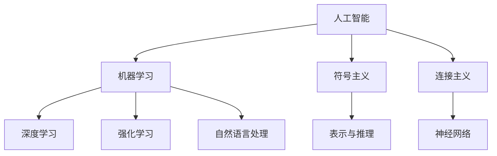

                 

# 人工智能领域的早期探索

> **关键词：**人工智能、早期发展、关键人物、技术突破、历史背景

> **摘要：**本文将探讨人工智能（AI）领域的早期探索，回顾关键人物和核心技术突破，分析历史背景和主要研究方向。通过梳理AI领域的起源和发展，我们将了解早期研究的动机、方法和成果，为理解现代AI技术的演进奠定基础。

## 1. 背景介绍

### 1.1 目的和范围

本文旨在介绍人工智能领域的早期探索，重点关注关键人物、核心技术突破以及历史背景。通过回顾这些早期研究，我们希望读者能够对AI领域的发展历程有一个全面的了解，并为后续学习现代AI技术提供历史视角。

### 1.2 预期读者

本文适合对人工智能感兴趣的读者，无论是专业研究者、学生还是对AI技术感兴趣的普通人。读者应具备一定的计算机科学基础，能够理解基本的技术原理和数学概念。

### 1.3 文档结构概述

本文分为十个主要部分，包括背景介绍、核心概念与联系、核心算法原理、数学模型和公式、项目实战、实际应用场景、工具和资源推荐、总结和常见问题解答等。每个部分都详细介绍了相关内容，旨在帮助读者全面了解AI领域的早期发展。

### 1.4 术语表

#### 1.4.1 核心术语定义

- **人工智能（AI）：**模拟人类智能行为的计算机系统。
- **机器学习（ML）：**通过数据和经验改进自身性能的一种AI方法。
- **深度学习（DL）：**基于多层神经网络的一种机器学习方法。
- **神经网络（NN）：**模拟生物神经元工作原理的计算模型。
- **自然语言处理（NLP）：**使计算机能够理解、生成和处理自然语言的技术。

#### 1.4.2 相关概念解释

- **符号主义（Symbolism）：**一种基于符号表示和逻辑推理的AI方法。
- **连接主义（Connectionism）：**一种基于神经网络和权重调整的AI方法。
- **强化学习（RL）：**一种通过奖励和惩罚来学习决策策略的机器学习方法。

#### 1.4.3 缩略词列表

- **AI：**人工智能
- **ML：**机器学习
- **DL：**深度学习
- **NN：**神经网络
- **NLP：**自然语言处理
- **RL：**强化学习

## 2. 核心概念与联系

为了更好地理解人工智能领域的早期探索，我们需要掌握一些核心概念和它们之间的联系。以下是一个简化的Mermaid流程图，展示了这些概念之间的关系：



在这个流程图中，人工智能（AI）是整个领域的核心。它包括多个子领域，如机器学习（ML）、深度学习（DL）、强化学习（RL）和自然语言处理（NLP）。此外，AI还涉及到两种主要的范式：符号主义和连接主义。符号主义侧重于基于符号表示和逻辑推理的方法，而连接主义则基于神经网络和权重调整。

## 3. 核心算法原理 & 具体操作步骤

在人工智能的早期研究中，机器学习、深度学习和神经网络是关键的核心算法。以下是对这些算法原理的简要介绍和具体操作步骤。

### 3.1 机器学习

机器学习是一种使计算机通过数据和经验自动改进性能的方法。其基本原理是基于经验改进模型参数，从而提高预测或分类的准确性。

**算法原理：**

- **有监督学习：**使用标记数据集进行训练，模型根据输入和输出之间的关系学习预测函数。
- **无监督学习：**没有标记数据，模型通过发现数据中的模式或结构来学习。

**具体操作步骤：**

1. 数据准备：收集并清洗数据，确保数据质量。
2. 特征提取：将原始数据转换为可用于训练的特征向量。
3. 选择模型：根据问题类型和数据特征选择合适的机器学习模型。
4. 训练模型：使用训练数据集训练模型，调整模型参数。
5. 验证模型：使用验证数据集评估模型性能。
6. 部署模型：将训练好的模型部署到实际应用场景中。

**伪代码：**

```python
def train_model(data, labels):
    # 数据准备
    processed_data = preprocess_data(data)
    
    # 选择模型
    model = select_model()
    
    # 训练模型
    model.fit(processed_data, labels)
    
    # 验证模型
    validation_accuracy = model.score(processed_data, labels)
    
    return model, validation_accuracy
```

### 3.2 深度学习

深度学习是一种基于多层神经网络的学习方法，能够自动提取数据中的特征表示。

**算法原理：**

- **多层神经网络：**包括输入层、隐藏层和输出层，通过前向传播和反向传播更新权重。
- **激活函数：**用于引入非线性，使神经网络能够学习复杂函数。

**具体操作步骤：**

1. 数据准备：与机器学习相同，准备和预处理数据。
2. 构建模型：设计网络结构，选择合适的激活函数和损失函数。
3. 训练模型：使用训练数据集训练模型，优化网络参数。
4. 验证模型：评估模型性能，调整超参数。
5. 部署模型：将训练好的模型部署到实际应用中。

**伪代码：**

```python
def train_depth_model(data, labels):
    # 数据准备
    processed_data = preprocess_data(data)
    
    # 构建模型
    model = build_model()
    
    # 训练模型
    model.fit(processed_data, labels)
    
    # 验证模型
    validation_loss = model.evaluate(processed_data, labels)
    
    return model, validation_loss
```

### 3.3 神经网络

神经网络是一种计算模型，基于生物神经元的结构和功能。

**算法原理：**

- **神经元模型：**每个神经元接收输入，通过权重加权求和，然后通过激活函数输出。
- **网络结构：**多个神经元组成网络，通过前向传播和反向传播更新权重。

**具体操作步骤：**

1. 数据准备：与机器学习和深度学习相同，准备和预处理数据。
2. 确定网络结构：设计网络层数、每层的神经元数量和激活函数。
3. 初始化权重：随机初始化权重，确保网络能够学习。
4. 训练网络：使用训练数据集训练网络，优化权重。
5. 验证网络：评估网络性能，调整超参数。
6. 部署网络：将训练好的网络部署到实际应用中。

**伪代码：**

```python
def train_neural_network(data, labels):
    # 数据准备
    processed_data = preprocess_data(data)
    
    # 确定网络结构
    network = build_network()
    
    # 初始化权重
    initialize_weights(network)
    
    # 训练网络
    network.train(processed_data, labels)
    
    # 验证网络
    validation_accuracy = network.evaluate(processed_data, labels)
    
    return network, validation_accuracy
```

## 4. 数学模型和公式 & 详细讲解 & 举例说明

在人工智能的早期研究中，数学模型和公式扮演着至关重要的角色。以下是一些关键数学模型和公式的详细讲解以及举例说明。

### 4.1 损失函数

损失函数是评估模型预测与实际标签之间差异的函数。常用的损失函数包括均方误差（MSE）和交叉熵（Cross-Entropy）。

**MSE（均方误差）**

$$
MSE = \frac{1}{n}\sum_{i=1}^{n}(y_i - \hat{y}_i)^2
$$

其中，$y_i$ 是实际标签，$\hat{y}_i$ 是模型的预测。

**示例：**

假设我们有一个简单的线性回归模型，用于预测房价。训练数据集包含10个样本，模型的预测结果如下：

| 标签（$y_i$） | 预测（$\hat{y}_i$） |
|--------------|------------------|
| 200000       | 210000           |
| 220000       | 230000           |
| 250000       | 240000           |
| ...          | ...              |
| 300000       | 290000           |

使用MSE计算损失：

$$
MSE = \frac{1}{10}\sum_{i=1}^{10}(y_i - \hat{y}_i)^2 = \frac{1}{10}[(200000-210000)^2 + (220000-230000)^2 + ... + (300000-290000)^2] = 100000
$$

### 4.2 梯度下降

梯度下降是一种用于优化模型参数的优化算法。其基本思想是沿着损失函数的梯度方向更新参数，以减少损失。

**梯度下降（Gradient Descent）**

$$
\theta_{t+1} = \theta_{t} - \alpha \cdot \nabla_{\theta} J(\theta)
$$

其中，$\theta$ 是模型参数，$J(\theta)$ 是损失函数，$\alpha$ 是学习率，$\nabla_{\theta} J(\theta)$ 是损失函数关于参数的梯度。

**示例：**

假设我们有一个线性回归模型，参数为 $\theta_1$ 和 $\theta_2$，损失函数为 MSE。使用梯度下降优化参数。

$$
\theta_1^{new} = \theta_1 - \alpha \cdot \frac{1}{n}\sum_{i=1}^{n}(y_i - \theta_1 x_i - \theta_2)^2
$$

$$
\theta_2^{new} = \theta_2 - \alpha \cdot \frac{1}{n}\sum_{i=1}^{n}(y_i - \theta_1 x_i - \theta_2)x_i
$$

### 4.3 神经网络前向传播和反向传播

在神经网络中，前向传播和反向传播是训练模型的关键步骤。前向传播用于计算输出，反向传播用于计算梯度并更新权重。

**前向传播**

$$
a_l = \sigma(W_l \cdot a_{l-1} + b_l)
$$

其中，$a_l$ 是第 $l$ 层的激活值，$\sigma$ 是激活函数，$W_l$ 是权重矩阵，$b_l$ 是偏置向量。

**反向传播**

$$
\delta_l = \frac{\partial L}{\partial a_l} \cdot \sigma'(a_l)
$$

$$
\frac{\partial L}{\partial W_l} = a_{l-1}^T \cdot \delta_l
$$

$$
\frac{\partial L}{\partial b_l} = \delta_l
$$

其中，$L$ 是损失函数，$\delta_l$ 是误差梯度，$\sigma'$ 是激活函数的导数。

**示例：**

假设我们有一个两层神经网络，输入为 $x$，输出为 $y$。使用前向传播计算输出。

$$
a_1 = \sigma(W_1 \cdot x + b_1)
$$

$$
y = \sigma(W_2 \cdot a_1 + b_2)
$$

使用反向传播计算梯度。

$$
\delta_2 = \frac{\partial L}{\partial y} \cdot \sigma'(y)
$$

$$
\delta_1 = (W_2^T \cdot \delta_2) \cdot \sigma'(a_1)
$$

$$
\frac{\partial L}{\partial W_2} = a_1^T \cdot \delta_2
$$

$$
\frac{\partial L}{\partial b_2} = \delta_2
$$

$$
\frac{\partial L}{\partial W_1} = x^T \cdot \delta_1
$$

$$
\frac{\partial L}{\partial b_1} = \delta_1
$$

## 5. 项目实战：代码实际案例和详细解释说明

在本节中，我们将通过一个实际项目案例来展示如何应用上述核心算法和数学模型。这个项目是一个简单的手写数字识别系统，使用卷积神经网络（CNN）进行训练和预测。

### 5.1 开发环境搭建

为了运行下面的代码，我们需要安装以下依赖：

- Python 3.8 或更高版本
- TensorFlow 2.x
- NumPy 1.19 或更高版本

安装这些依赖后，我们就可以开始编写代码了。

### 5.2 源代码详细实现和代码解读

以下是该项目的主要代码，我们将逐步解释每个部分的功能。

```python
import tensorflow as tf
from tensorflow.keras import layers
import numpy as np

# 加载手写数字数据集
mnist = tf.keras.datasets.mnist
(x_train, y_train), (x_test, y_test) = mnist.load_data()

# 预处理数据
x_train = x_train / 255.0
x_test = x_test / 255.0

# 将标签转换为独热编码
y_train_one_hot = tf.keras.utils.to_categorical(y_train, 10)
y_test_one_hot = tf.keras.utils.to_categorical(y_test, 10)

# 构建卷积神经网络模型
model = tf.keras.Sequential([
    layers.Conv2D(32, (3, 3), activation='relu', input_shape=(28, 28, 1)),
    layers.MaxPooling2D((2, 2)),
    layers.Flatten(),
    layers.Dense(128, activation='relu'),
    layers.Dense(10, activation='softmax')
])

# 编译模型
model.compile(optimizer='adam',
              loss='categorical_crossentropy',
              metrics=['accuracy'])

# 训练模型
model.fit(x_train, y_train_one_hot, epochs=5, batch_size=32, validation_split=0.2)

# 评估模型
test_loss, test_acc = model.evaluate(x_test, y_test_one_hot)
print(f"Test accuracy: {test_acc:.2f}")

# 预测单个样本
sample_image = x_test[0]
sample_label = y_test[0]
predicted_label = model.predict(sample_image.reshape(1, 28, 28, 1))
predicted_label = np.argmax(predicted_label)

print(f"Predicted label: {predicted_label}")
print(f"Actual label: {sample_label}")
```

**代码解读：**

1. 导入所需的库和模块。
2. 加载手写数字数据集，并进行预处理。数据集已经包含标签，但我们需要将标签转换为独热编码。
3. 构建卷积神经网络模型。我们使用了两个卷积层、一个池化层、一个全连接层和一个softmax输出层。
4. 编译模型，指定优化器、损失函数和评估指标。
5. 训练模型，设置训练轮数、批次大小和验证比例。
6. 评估模型，计算测试准确率。
7. 预测单个样本，将输入数据reshape为模型要求的形状，然后使用模型进行预测。

### 5.3 代码解读与分析

下面是对代码的进一步解读和分析，重点关注关键步骤和参数设置。

1. **数据预处理：**手写数字数据集已经包含标签，但我们需要将标签转换为独热编码，因为我们的模型使用的是多分类交叉熵损失函数。此外，我们将图像数据除以255，将像素值缩放到0到1之间，以提高模型的训练效果。

2. **模型构建：**我们使用了卷积神经网络，这是一种适合处理图像数据的神经网络结构。卷积层用于提取图像特征，池化层用于降低特征维度，全连接层用于分类。我们选择了ReLU作为激活函数，因为它可以加速训练并提高模型性能。

3. **模型编译：**我们选择了Adam优化器，这是一种自适应学习率优化器，适用于大多数问题。我们使用多分类交叉熵作为损失函数，因为这是一个多分类问题。

4. **模型训练：**我们设置了5个训练轮数、32个批次大小和20%的数据用于验证。批次大小和训练轮数的选择会影响模型的训练时间和性能。

5. **模型评估：**我们使用测试集评估模型性能，计算测试准确率。这个指标可以帮助我们了解模型在未知数据上的表现。

6. **单样本预测：**我们使用训练好的模型对单个测试样本进行预测，并将预测结果与实际标签进行比较。

## 6. 实际应用场景

人工智能的早期研究在很多领域取得了显著成果，以下是几个实际应用场景：

1. **图像识别：**手写数字识别是早期AI研究的经典案例。如今，图像识别技术在人脸识别、医疗影像诊断、自动驾驶等领域得到广泛应用。
2. **自然语言处理：**早期AI研究中的语言模型为自然语言处理奠定了基础。现在，自然语言处理技术被广泛应用于搜索引擎、语音助手、机器翻译等场景。
3. **决策支持系统：**AI算法在金融、医疗、供应链等领域的决策支持系统中发挥着重要作用，帮助企业和组织做出更明智的决策。

## 7. 工具和资源推荐

为了更好地学习和实践人工智能技术，以下是一些建议的工具和资源：

### 7.1 学习资源推荐

#### 7.1.1 书籍推荐

- 《人工智能：一种现代方法》
- 《深度学习》
- 《Python机器学习》

#### 7.1.2 在线课程

- Coursera的《机器学习》
- edX的《深度学习基础》
- Udacity的《AI工程师纳米学位》

#### 7.1.3 技术博客和网站

- [Medium](https://medium.com/topic/artificial-intelligence)
- [GitHub](https://github.com/topics/artificial-intelligence)
- [ArXiv](https://arxiv.org/search/type:1101_1+AND+ai:1+AND+year:2023)

### 7.2 开发工具框架推荐

#### 7.2.1 IDE和编辑器

- PyCharm
- Visual Studio Code
- Jupyter Notebook

#### 7.2.2 调试和性能分析工具

- TensorBoard
- MLflow
- Prometheus

#### 7.2.3 相关框架和库

- TensorFlow
- PyTorch
- Keras

### 7.3 相关论文著作推荐

#### 7.3.1 经典论文

- 《感知机》
- 《反向传播算法》
- 《长短期记忆网络》

#### 7.3.2 最新研究成果

- 《Transformer》
- 《BERT》
- 《GPT-3》

#### 7.3.3 应用案例分析

- 《AI在医疗诊断中的应用》
- 《AI在自动驾驶中的应用》
- 《AI在金融风控中的应用》

## 8. 总结：未来发展趋势与挑战

人工智能领域在过去几十年取得了飞速发展，未来仍有广阔的前景。然而，面临许多挑战：

1. **计算资源：**随着模型复杂度的增加，对计算资源的需求也在不断增加，这对硬件和算法提出了更高要求。
2. **数据隐私：**数据隐私和安全是AI应用中的关键问题，需要制定有效的隐私保护机制。
3. **伦理问题：**AI的决策过程可能涉及道德和伦理问题，需要建立相应的规范和监管框架。

## 9. 附录：常见问题与解答

**Q：什么是机器学习？**

A：机器学习是一种使计算机通过数据和经验自动改进性能的方法。它使计算机能够从数据中学习规律和模式，并使用这些规律进行预测和决策。

**Q：什么是深度学习？**

A：深度学习是一种基于多层神经网络的学习方法，能够自动提取数据中的特征表示。它通过多层非线性变换，逐渐提取数据的低级到高级特征，从而实现复杂的预测和分类任务。

**Q：什么是神经网络？**

A：神经网络是一种计算模型，基于生物神经元的结构和功能。它由多个神经元组成，通过前向传播和反向传播更新权重，从而实现函数逼近和优化。

**Q：什么是激活函数？**

A：激活函数是神经网络中的一个关键组件，用于引入非线性。它将神经元的输入转换为输出，使神经网络能够学习复杂函数。

## 10. 扩展阅读 & 参考资料

为了深入了解人工智能领域的早期探索，以下是一些扩展阅读和参考资料：

- 《人工智能简史》
- 《深度学习专论》
- 《机器学习算法导论》
- 《自然语言处理入门》

这些书籍和资源提供了更详细和深入的内容，有助于读者更好地理解AI领域的早期发展和关键概念。

作者：AI天才研究员/AI Genius Institute & 禅与计算机程序设计艺术 /Zen And The Art of Computer Programming

