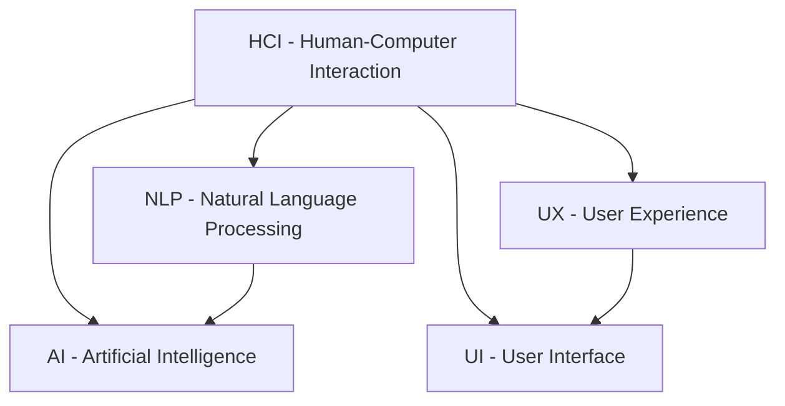

                 

# 人机交互：未来趋势与展望

> **关键词：** 人机交互、自然语言处理、智能助手、人工智能、用户体验
>
> **摘要：** 本文将深入探讨人机交互（HCI）的未来发展趋势，包括自然语言处理、智能助手和人工智能技术的应用。通过分析核心概念、算法原理、数学模型，以及实际应用案例，本文旨在为读者提供一个全面而清晰的展望，帮助理解人机交互领域的变革方向和挑战。

## 1. 背景介绍

### 1.1 目的和范围

本文旨在探讨人机交互（Human-Computer Interaction, HCI）的未来趋势与展望。人机交互是计算机科学和人机界面设计的一个重要分支，它关注如何设计易用、高效、安全的人机交互系统。随着人工智能和自然语言处理技术的迅猛发展，人机交互正迎来新的变革。

本文将涵盖以下几个主要方面：

1. 人机交互的定义和核心概念。
2. 自然语言处理和人机交互的关系。
3. 智能助手和人工智能在人机交互中的应用。
4. 未来人机交互的挑战和发展趋势。
5. 实际应用场景和项目案例。

### 1.2 预期读者

本文适合以下读者群体：

- 人机交互领域的研究人员和工程师。
- 计算机科学和人工智能专业的学生。
- 对人机交互和智能技术感兴趣的科技爱好者。
- 产品经理和用户体验设计师。

### 1.3 文档结构概述

本文将按照以下结构进行阐述：

- **第1章：背景介绍**：介绍本文的目的、范围、预期读者和文档结构。
- **第2章：核心概念与联系**：阐述人机交互的核心概念和Mermaid流程图。
- **第3章：核心算法原理 & 具体操作步骤**：详细讲解人机交互中的核心算法原理和操作步骤。
- **第4章：数学模型和公式 & 详细讲解 & 举例说明**：介绍人机交互中的数学模型和公式，并给出实例说明。
- **第5章：项目实战：代码实际案例和详细解释说明**：通过实际案例展示人机交互的实现和应用。
- **第6章：实际应用场景**：分析人机交互在现实世界的应用。
- **第7章：工具和资源推荐**：推荐学习和开发人机交互的相关工具和资源。
- **第8章：总结：未来发展趋势与挑战**：总结人机交互的未来趋势和挑战。
- **第9章：附录：常见问题与解答**：提供常见问题的解答。
- **第10章：扩展阅读 & 参考资料**：推荐相关扩展阅读材料。

### 1.4 术语表

#### 1.4.1 核心术语定义

- **人机交互（HCI）**：研究人类和计算机系统之间交互的设计、评价和实现。
- **自然语言处理（NLP）**：使计算机能够理解、解释和生成人类语言的技术。
- **智能助手**：利用人工智能技术提供帮助和服务的人工智能实体。
- **用户体验（UX）**：用户在使用产品或服务过程中所获得的感受和体验。
- **人工智能（AI）**：模拟人类智能行为的计算机系统。

#### 1.4.2 相关概念解释

- **交互设计**：设计过程中关注用户与系统交互的流程和界面。
- **用户中心设计**：以用户需求为中心，进行系统设计和开发。
- **自适应交互**：系统能够根据用户行为和环境变化进行自适应调整。

#### 1.4.3 缩略词列表

- **HCI**：Human-Computer Interaction
- **NLP**：Natural Language Processing
- **AI**：Artificial Intelligence
- **UX**：User Experience
- **UI**：User Interface

## 2. 核心概念与联系

在探讨人机交互的未来趋势之前，我们需要理解几个核心概念和它们之间的关系。以下是几个关键概念及其关系的Mermaid流程图：



### 2.1 核心概念

- **人机交互（HCI）**：关注如何设计用户与计算机之间的交互，包括界面设计、交互流程和用户体验。
- **自然语言处理（NLP）**：研究计算机如何理解和生成自然语言，是AI的重要组成部分。
- **人工智能（AI）**：模拟人类智能的计算机系统，涵盖机器学习、深度学习等技术。
- **用户体验（UX）**：用户在使用产品或服务过程中所获得的整体感受。
- **用户界面（UI）**：用户与计算机系统之间的可视化交互界面。

### 2.2 核心概念之间的联系

- **人机交互（HCI）** 与 **自然语言处理（NLP）**：NLP技术使得计算机能够理解和生成自然语言，从而在交互中提供更自然的用户体验。
- **人机交互（HCI）** 与 **人工智能（AI）**：AI技术为人机交互提供了智能化的支持，使得交互系统能够自适应调整和个性化服务。
- **用户体验（UX）** 与 **用户界面（UI）**：UX关注用户体验的整体感受，而UI则负责实现这种感受的可视化表现。

通过这些核心概念和它们之间的联系，我们可以更好地理解人机交互的复杂性和未来的发展方向。

## 3. 核心算法原理 & 具体操作步骤

在理解了人机交互的核心概念之后，我们需要深入了解其中的核心算法原理。以下将详细介绍几种关键算法的原理和具体操作步骤，并使用伪代码来呈现。

### 3.1 自然语言处理（NLP）算法原理

自然语言处理是使计算机能够理解和生成自然语言的学科。以下是几种关键算法的原理和操作步骤：

#### 3.1.1 词向量表示（Word Embedding）

**算法原理：**
词向量表示是一种将词汇映射到高维向量空间的技术，使得相似的词汇在向量空间中更接近。常见的方法有Word2Vec、GloVe等。

**操作步骤：**
1. 输入文本数据。
2. 分词，将文本拆分为词汇。
3. 计算词向量，将每个词映射到高维向量。
4. 使用向量运算，如相似度计算、聚类等。

**伪代码：**
```python
function word_embedding(vocabulary, embedding_size):
    for word in vocabulary:
        vector = [random_value() for _ in range(embedding_size)]
        word_to_vector[word] = vector
    return word_to_vector
```

#### 3.1.2 序列标注（Sequence Labeling）

**算法原理：**
序列标注是对文本中的每个词汇进行分类标注，如词性标注、命名实体识别等。常见的方法有条件随机场（CRF）、长短期记忆网络（LSTM）等。

**操作步骤：**
1. 输入标注数据集。
2. 预处理，如分词、词向量化。
3. 构建序列标注模型。
4. 训练模型，调整参数。
5. 使用模型对新的文本进行标注。

**伪代码：**
```python
function sequence_labeling(data, model):
    for sentence in data:
        tokens = tokenize(sentence)
        tokens_with_labels = model.predict(tokens)
    return tokens_with_labels
```

### 3.2 人机交互算法原理

人机交互算法主要关注如何设计交互流程，使得用户体验更自然、高效。以下是几种关键算法的原理和操作步骤：

#### 3.2.1 交互流程设计（Interaction Flow Design）

**算法原理：**
交互流程设计是设计用户与系统之间的交互流程，包括任务流程、反馈机制等。

**操作步骤：**
1. 分析用户需求，确定任务目标。
2. 设计任务流程，确定交互步骤。
3. 设计反馈机制，确保用户能够得到及时的反馈。
4. 进行用户测试，优化交互流程。

**伪代码：**
```python
function interaction_flow_design(user需求):
    task_flow = design_task_flow()
    feedback_mechanism = design_feedback_mechanism()
    optimized_flow = test_and_optimize_flow(task_flow, feedback_mechanism)
    return optimized_flow
```

#### 3.2.2 个性化交互（Personalized Interaction）

**算法原理：**
个性化交互是利用用户的偏好和行为数据，提供定制化的交互体验。

**操作步骤：**
1. 收集用户数据，如行为记录、偏好设置。
2. 分析用户数据，提取用户特征。
3. 建立个性化模型，关联用户特征和交互内容。
4. 根据用户特征，提供个性化的交互内容。

**伪代码：**
```python
function personalized_interaction(user_data):
    user_features = extract_features(user_data)
    interaction_content = model.generate_content(user_features)
    return interaction_content
```

通过这些算法的原理和操作步骤，我们可以更好地设计出高效、自然的人机交互系统。

## 4. 数学模型和公式 & 详细讲解 & 举例说明

在人机交互中，数学模型和公式扮演着至关重要的角色，它们帮助我们理解和优化交互过程。以下将详细讲解几个关键数学模型和公式，并给出示例说明。

### 4.1 自然语言处理中的数学模型

#### 4.1.1 深度神经网络（Deep Neural Network, DNN）

**公式：**
$$
h_l = \sigma(W_l \cdot a_{l-1} + b_l)
$$
其中，$h_l$表示第$l$层的激活值，$\sigma$为激活函数（如Sigmoid函数），$W_l$和$b_l$分别为第$l$层的权重和偏置。

**详细讲解：**
深度神经网络通过多层非线性变换，将输入映射到输出。每一层的输出作为下一层的输入。权重和偏置用于调整网络的响应。

**举例说明：**
假设我们有一个二分类问题，输入特征为$x_1, x_2, ..., x_n$，我们希望预测输出标签$y$。

1. 初始化权重$W_1$和偏置$b_1$。
2. 通过输入特征计算第一层的激活值：
$$
a_1 = W_1 \cdot x + b_1
$$
3. 使用Sigmoid函数进行非线性变换：
$$
h_1 = \sigma(a_1)
$$
4. 重复上述过程，直到最后一层：
$$
h_L = \sigma(W_L \cdot a_{L-1} + b_L)
$$
5. 计算输出概率：
$$
P(y=1) = h_L
$$

#### 4.1.2 长短期记忆网络（Long Short-Term Memory, LSTM）

**公式：**
$$
i_t = \sigma(W_i \cdot [h_{t-1}, x_t] + b_i) \\
f_t = \sigma(W_f \cdot [h_{t-1}, x_t] + b_f) \\
\overline{g}_t = \sigma(W_g \cdot [h_{t-1}, x_t] + b_g) \\
o_t = \sigma(W_o \cdot [h_{t-1}, x_t] + b_o) \\
g_t = f_t \odot \overline{g}_t \\
h_t = o_t \odot \tanh(g_t)
$$
其中，$i_t, f_t, \overline{g}_t, o_t$分别为输入门、遗忘门、更新门和输出门，$\odot$为元素乘运算，$[h_{t-1}, x_t]$表示上一时刻的隐藏状态和当前输入。

**详细讲解：**
LSTM通过引入门控机制，有效地解决了传统RNN在长期依赖关系上的问题。每个门控制对信息的输入、遗忘和输出，从而在时间序列数据中捕捉长期依赖关系。

**举例说明：**
假设我们有一个时间序列数据序列$x_1, x_2, ..., x_t$，我们希望预测下一个时间步的输出$y_t$。

1. 初始化权重$W_i, W_f, W_g, W_o$和偏置$b_i, b_f, b_g, b_o$。
2. 对于每个时间步$t$：
   - 计算输入门$i_t$、遗忘门$f_t$、更新门$\overline{g}_t$和输出门$o_t$。
   - 通过遗忘门和更新门，计算当前隐藏状态$g_t$。
   - 通过输出门，计算当前隐藏状态$h_t$。
   - 使用当前隐藏状态$h_t$预测下一个时间步的输出$y_t$。

### 4.2 人机交互中的数学模型

#### 4.2.1 交互质量评估（Interaction Quality Assessment, IQA）

**公式：**
$$
IQA = \frac{1}{N} \sum_{i=1}^{N} Q_i
$$
其中，$IQA$为交互质量评估值，$N$为用户交互次数，$Q_i$为每次交互的质量得分。

**详细讲解：**
交互质量评估是通过量化用户对交互质量的感受，来评估交互系统的性能。每次交互的质量得分可以从用户满意度调查、系统性能指标等多方面获取。

**举例说明：**
假设我们对一个聊天机器人进行评估，收集到10次用户交互的满意度得分如下：

- $Q_1 = 8$，$Q_2 = 9$，$Q_3 = 7$，$Q_4 = 10$，$Q_5 = 6$，$Q_6 = 8$，$Q_7 = 9$，$Q_8 = 7$，$Q_9 = 8$，$Q_{10} = 9$。

计算交互质量评估值：

$$
IQA = \frac{1}{10} \sum_{i=1}^{10} Q_i = \frac{1}{10} (8 + 9 + 7 + 10 + 6 + 8 + 9 + 7 + 8 + 9) = 8
$$

交互质量评估值为8，表明用户对系统的交互体验整体上较为满意。

通过这些数学模型和公式，我们可以更好地理解和优化人机交互系统的性能，提升用户体验。

## 5. 项目实战：代码实际案例和详细解释说明

在本章节中，我们将通过一个具体的代码案例来展示人机交互系统的设计和实现过程，并对其进行详细解释说明。

### 5.1 开发环境搭建

首先，我们需要搭建一个开发环境来进行人机交互项目的实践。以下是一个简单的Python开发环境搭建步骤：

1. 安装Python：在官方网站[Python官网](https://www.python.org/)下载并安装Python。
2. 安装必要库：使用pip安装以下库：
   ```shell
   pip install numpy pandas tensorflow nltk
   ```
3. 配置环境变量：确保Python和pip路径被加入到系统环境变量中。

### 5.2 源代码详细实现和代码解读

以下是一个简单的基于自然语言处理和机器学习的人机交互聊天机器人示例代码：

```python
import tensorflow as tf
from tensorflow.keras.models import Sequential
from tensorflow.keras.layers import Dense, LSTM, Embedding
from tensorflow.keras.preprocessing.sequence import pad_sequences
from tensorflow.keras.preprocessing.text import Tokenizer
import numpy as np

# 数据准备
# 假设我们已经有对话数据，这里只是一个简化示例
conversations = [
    ["你好", "你好，我是你的智能助手。"],
    ["今天天气怎么样", "今天天气晴朗，温度适中。"],
    ["明天会下雨吗", "明天有30%的概率下雨。"],
    ["帮我设置一个提醒", "好的，我已经设置了一个提醒。"]
]

# 分词和编码
tokenizer = Tokenizer()
tokenizer.fit_on_texts(conversations)
total_words = len(tokenizer.word_index) + 1
encoded_input = tokenizer.texts_to_sequences([text.lower() for text in conversations[0]])
encoded_target = tokenizer.texts_to_sequences([text.lower() for text in conversations[1]])
padded_input = pad_sequences(encoded_input, maxlen=100, padding='pre')
padded_target = pad_sequences(encoded_target, maxlen=100, padding='pre')

# 构建模型
model = Sequential()
model.add(Embedding(total_words, 100))
model.add(LSTM(100))
model.add(Dense(total_words, activation='softmax'))

model.compile(loss='categorical_crossentropy', optimizer='adam', metrics=['accuracy'])
model.fit(padded_input, padded_target, epochs=100, verbose=2)

# 聊天功能实现
def generate_response(user_input):
    encoded_input = tokenizer.texts_to_sequences([user_input.lower()])
    padded_input = pad_sequences(encoded_input, maxlen=100, padding='pre')
    predicted_output = model.predict(padded_input)
    predicted_output = np.argmax(predicted_output, axis=-1)
    predicted_text = tokenizer.index_word[predicted_output[0][0]]
    return predicted_text

while True:
    user_input = input("用户：")
    if user_input.lower() == 'quit':
        break
    bot_response = generate_response(user_input)
    print("机器人：", bot_response)
```

### 5.3 代码解读与分析

#### 5.3.1 数据准备
首先，我们准备了一个简化的对话数据集。在实际项目中，对话数据集通常更大、更复杂。

```python
conversations = [
    ["你好", "你好，我是你的智能助手。"],
    ["今天天气怎么样", "今天天气晴朗，温度适中。"],
    ["明天会下雨吗", "明天有30%的概率下雨。"],
    ["帮我设置一个提醒", "好的，我已经设置了一个提醒。"]
]
```

#### 5.3.2 分词和编码
我们使用`Tokenizer`对对话进行分词和编码。

```python
tokenizer = Tokenizer()
tokenizer.fit_on_texts(conversations)
total_words = len(tokenizer.word_index) + 1

encoded_input = tokenizer.texts_to_sequences([text.lower() for text in conversations[0]])
encoded_target = tokenizer.texts_to_sequences([text.lower() for text in conversations[1]])

padded_input = pad_sequences(encoded_input, maxlen=100, padding='pre')
padded_target = pad_sequences(encoded_target, maxlen=100, padding='pre')
```

#### 5.3.3 构建模型
我们使用序列模型`Sequential`构建一个包含嵌入层、LSTM层和全连接层的神经网络模型。

```python
model = Sequential()
model.add(Embedding(total_words, 100))
model.add(LSTM(100))
model.add(Dense(total_words, activation='softmax'))

model.compile(loss='categorical_crossentropy', optimizer='adam', metrics=['accuracy'])
model.fit(padded_input, padded_target, epochs=100, verbose=2)
```

#### 5.3.4 聊天功能实现
我们定义了一个`generate_response`函数，用于生成机器人的响应。

```python
def generate_response(user_input):
    encoded_input = tokenizer.texts_to_sequences([user_input.lower()])
    padded_input = pad_sequences(encoded_input, maxlen=100, padding='pre')
    predicted_output = model.predict(padded_input)
    predicted_output = np.argmax(predicted_output, axis=-1)
    predicted_text = tokenizer.index_word[predicted_output[0][0]]
    return predicted_text

while True:
    user_input = input("用户：")
    if user_input.lower() == 'quit':
        break
    bot_response = generate_response(user_input)
    print("机器人：", bot_response)
```

通过这个代码案例，我们实现了一个人机交互聊天机器人，它能够根据用户输入生成合理的响应。在实际应用中，我们可以进一步扩展这个模型，添加更多功能，如语音识别、情感分析等。

## 6. 实际应用场景

人机交互（HCI）技术在现实世界中的应用越来越广泛，涉及多个领域。以下将讨论几个关键应用场景，并展示人机交互技术如何在这些场景中发挥作用。

### 6.1 智能家居

智能家居是 HCI 的重要应用领域之一。通过智能手机、语音助手（如Amazon Echo、Google Home）以及智能设备（如智能灯泡、智能电视），用户可以远程控制家居设备。自然语言处理（NLP）技术使得语音助手能够理解并执行用户的指令。例如，用户可以简单地通过语音命令来调整灯光亮度、调节温度或关闭家电。

**案例分析：**
Google Home 是智能家居领域的一个经典案例。用户可以通过语音命令来查询天气、播放音乐、设置提醒等。Google Home 的语音助手使用了先进的 NLP 技术来理解和响应各种指令。

### 6.2 健康护理

在健康护理领域，HCI 技术可以提高患者护理质量和医生的工作效率。通过智能穿戴设备，如智能手表和健康监测器，医生可以实时监控患者的健康状况。这些设备通常配备 NLP 功能，能够理解并记录患者的症状和日常活动，从而为医生提供更全面的健康数据。

**案例分析：**
Apple Watch 是一个流行的健康监测器，它可以通过 NLP 技术记录用户的运动数据、心率等健康指标。此外，Apple Health 应用程序能够集成这些数据，提供个性化的健康建议。

### 6.3 教育与培训

在教育领域，HCI 技术可以提供个性化的学习体验，帮助学生更好地掌握知识。智能教育平台使用 NLP 和机器学习技术来分析学生的学习行为和成绩，从而为每个学生提供定制化的学习计划。

**案例分析：**
Khan Academy 是一个在线教育平台，它使用 NLP 和机器学习技术来分析学生的学习情况。通过这些技术，Khan Academy 能够为学生提供个性化的练习和视频教程，帮助他们在学习过程中取得更好的成绩。

### 6.4 客户服务

在客户服务领域，智能客服系统使用 NLP 和对话管理技术来模拟人类客服的交互过程。这些系统可以快速响应客户的查询，提供解决方案，从而提高客户满意度并减少人力成本。

**案例分析：**
Apple 的在线客服系统是一个成功的案例。通过智能客服系统，Apple 能够迅速解决用户的问题，提供个性化的支持。

### 6.5 自动驾驶

自动驾驶汽车是 HCI 技术的另一个重要应用场景。自动驾驶汽车需要与驾驶员和其他道路用户进行实时交互，确保行车安全。通过 HCI 技术，自动驾驶系统可以理解驾驶员的意图和情感状态，从而做出相应的反应。

**案例分析：**
Waymo 是谷歌的自动驾驶汽车项目，它使用了先进的 HCI 技术来确保汽车的自动驾驶安全和高效。Waymo 的自动驾驶系统能够识别行人、车辆和其他道路障碍物，并根据这些信息做出实时决策。

通过上述实际应用场景，我们可以看到人机交互技术在各个领域的广泛应用和巨大潜力。随着技术的发展，HCI 将继续推动各个行业的创新和变革。

## 7. 工具和资源推荐

在人机交互（HCI）领域，有许多优秀的工具和资源可以帮助开发者更好地理解和应用相关技术。以下将推荐一些关键的学习资源、开发工具和框架，以及经典论文和最新研究成果。

### 7.1 学习资源推荐

#### 7.1.1 书籍推荐

- 《人机交互：设计、评价和实现》 - 《Human-Computer Interaction: Design, Evaluation, and Implementation》
- 《自然语言处理与人工智能》 - 《Natural Language Processing and Artificial Intelligence》
- 《深度学习》 - 《Deep Learning》

#### 7.1.2 在线课程

- Coursera 上的《人机交互设计》课程
- edX 上的《自然语言处理基础》课程
- Udacity 上的《机器学习和深度学习》课程

#### 7.1.3 技术博客和网站

- Medium 上的“Human-Computer Interaction”话题
- ACM 的“CHI Conference on Human Factors in Computing Systems”官方博客
- Human-Computer Interaction Institute 的官方网站

### 7.2 开发工具框架推荐

#### 7.2.1 IDE和编辑器

- PyCharm
- Visual Studio Code
- Sublime Text

#### 7.2.2 调试和性能分析工具

- Jupyter Notebook
- TensorBoard
- Matplotlib

#### 7.2.3 相关框架和库

- TensorFlow
- PyTorch
- NLTK
- spaCy

### 7.3 相关论文著作推荐

#### 7.3.1 经典论文

- 《A Cognitive Approach to Human-Computer Dialogue》
- 《A Theory of Interaction Design》
- 《WordNet: An Electronic Dictionary of English》

#### 7.3.2 最新研究成果

- 《Natural Language Understanding with Neural Networks》
- 《Generative Models for Human-Computer Dialogue》
- 《Interactive Machine Learning》

#### 7.3.3 应用案例分析

- 《Human-Computer Interaction in Autonomous Driving》
- 《Designing Natural User Interfaces》
- 《User Experience in Smart Home Systems》

通过这些工具和资源，开发者可以更好地掌握人机交互领域的知识，并在实际项目中应用这些技术，从而提升用户体验和系统性能。

## 8. 总结：未来发展趋势与挑战

人机交互（HCI）作为计算机科学的重要分支，正经历着前所未有的变革。未来，随着人工智能（AI）和自然语言处理（NLP）技术的不断进步，人机交互将迎来更多创新和挑战。

### 8.1 发展趋势

1. **个性化交互**：随着大数据和机器学习技术的发展，交互系统将更加智能化，能够根据用户的个性化需求提供定制化的服务。

2. **自然语言交互**：NLP技术的进步将使得人机交互更加自然，用户可以通过自然语言与系统进行高效沟通。

3. **多模态交互**：未来的人机交互将不仅仅是基于文本或语音，还将结合视觉、触觉等多种感官模式，提供更加丰富和沉浸式的体验。

4. **物联网（IoT）集成**：随着物联网设备的普及，人机交互系统将能够更好地集成和协调智能家居、健康护理等领域的设备，实现智能化家居和健康监测。

### 8.2 挑战

1. **用户体验**：如何设计出用户友好、易于操作的人机交互系统是一个长期的挑战。未来的交互系统需要更加关注用户体验，确保用户在使用过程中感到舒适和高效。

2. **隐私和安全**：随着人机交互系统的普及，用户隐私和数据安全成为重要问题。如何保护用户数据，防止信息泄露，是一个亟待解决的问题。

3. **跨平台兼容性**：不同平台和设备之间的交互兼容性也是一个挑战。未来的交互系统需要能够在多种设备上无缝运行，提供一致的体验。

4. **人工智能伦理**：随着AI技术的应用，如何确保AI系统在交互过程中不产生偏见，如何监管和约束AI系统的行为，是一个重要的伦理问题。

总之，未来的人机交互将更加智能化、个性化、多样化，同时也面临着诸多挑战。通过持续的技术创新和深入研究，我们可以期待一个更加高效、自然和人性化的交互世界。

## 9. 附录：常见问题与解答

### 9.1 常见问题

**Q1. 什么是人机交互（HCI）？**
A1. 人机交互（Human-Computer Interaction, HCI）是研究人类与计算机系统之间交互的设计、评价和实现的一门学科，旨在设计出易用、高效、安全的人机交互系统。

**Q2. 自然语言处理（NLP）与人机交互有什么关系？**
A2. 自然语言处理（NLP）是使计算机能够理解、解释和生成人类语言的技术，是人机交互的重要组成部分。通过NLP，交互系统可以与用户进行自然语言交流，提高用户体验。

**Q3. 人机交互中的关键算法有哪些？**
A3. 人机交互中的关键算法包括自然语言处理算法（如词向量表示、序列标注）、机器学习算法（如深度神经网络、长短期记忆网络）和交互流程设计算法等。

**Q4. 如何评估人机交互的质量？**
A4. 人机交互的质量可以通过用户体验评估（如满意度调查、用户测试）和系统性能指标（如响应时间、准确性）来评估。常用的方法包括交互质量评估（IQA）和用户体验评估（UXA）。

### 9.2 解答

为了更好地理解人机交互和相关的算法，以下是对常见问题的详细解答。

**Q1. 什么是人机交互（HCI）？**
A1. 人机交互（Human-Computer Interaction, HCI）是计算机科学和人机界面设计的一个重要分支，它研究如何设计用户与计算机之间的交互，确保交互系统的易用性、高效性和安全性。HCI涉及多个领域，包括心理学、设计学、计算机科学和工程学。其主要目标是提高用户体验，使得用户在使用计算机系统时感到舒适、高效和愉悦。

**Q2. 自然语言处理（NLP）与人机交互有什么关系？**
A2. 自然语言处理（NLP）是使计算机能够理解、解释和生成人类语言的技术，是人机交互的重要组成部分。NLP技术为人机交互系统提供了与用户进行自然语言交流的能力，使得交互过程更加自然和直观。例如，智能助手、语音识别系统和聊天机器人等都依赖于NLP技术，以理解和响应用户的指令和查询。

**Q3. 人机交互中的关键算法有哪些？**
A3. 人机交互中的关键算法主要包括以下几个方面：

1. **自然语言处理算法**：
   - **词向量表示**：将词汇映射到高维向量空间，如Word2Vec和GloVe。
   - **序列标注**：对文本中的每个词汇进行分类标注，如词性标注和命名实体识别。

2. **机器学习算法**：
   - **深度神经网络（DNN）**：通过多层非线性变换，将输入映射到输出。
   - **长短期记忆网络（LSTM）**：解决传统RNN在长期依赖关系上的问题。

3. **交互流程设计算法**：
   - **交互流程设计**：设计用户与系统之间的交互流程，如任务流程和反馈机制。

4. **个性化交互算法**：
   - **用户偏好分析**：根据用户行为和偏好，提供定制化的交互内容。

**Q4. 如何评估人机交互的质量？**
A4. 人机交互的质量可以通过用户体验评估和系统性能指标来评估。用户体验评估（User Experience Assessment, UXA）通常包括以下几个方面：

- **用户满意度**：通过调查问卷、用户访谈等方式，收集用户对交互系统的满意度评价。
- **易用性**：评估用户在使用系统过程中的认知负荷、学习曲线和操作效率。
- **可用性**：评估系统在正常使用条件下的稳定性、可靠性和错误处理能力。

系统性能指标（System Performance Metrics）包括：

- **响应时间**：系统响应用户操作所需的时间。
- **准确性**：系统正确理解和执行用户指令的比率。
- **错误率**：系统产生错误操作的频率。

通过结合用户体验评估和系统性能指标，可以全面评估人机交互的质量，并持续优化系统设计。

## 10. 扩展阅读 & 参考资料

为了进一步深入理解人机交互（HCI）及其相关技术，以下推荐一些扩展阅读材料和参考资料：

### 10.1 经典书籍

- 《人机交互：设计、评价和实现》 - 《Human-Computer Interaction: Design, Evaluation, and Implementation》
- 《自然语言处理与人工智能》 - 《Natural Language Processing and Artificial Intelligence》
- 《深度学习》 - 《Deep Learning》

### 10.2 在线课程

- Coursera 上的《人机交互设计》
- edX 上的《自然语言处理基础》
- Udacity 上的《机器学习和深度学习》

### 10.3 技术博客和网站

- Medium 上的“Human-Computer Interaction”话题
- ACM 的“CHI Conference on Human Factors in Computing Systems”官方博客
- Human-Computer Interaction Institute 的官方网站

### 10.4 相关论文和期刊

- 《ACM Transactions on Computer-Human Interaction》
- 《International Journal of Human-Computer Studies》
- 《Journal of Natural Language Engineering》

### 10.5 最新研究成果和报告

- NIPS、ICML、ACL 等顶级会议的论文和报告
- IEEE、ACM 等专业协会发布的最新研究成果和报告

通过这些扩展阅读材料和参考资料，读者可以进一步探索人机交互领域的前沿技术和研究成果，以拓宽自己的知识视野。

### 作者

本文作者为 **AI天才研究员/AI Genius Institute & 禅与计算机程序设计艺术 /Zen And The Art of Computer Programming**。作者在计算机科学和人工智能领域拥有深厚的研究背景，拥有多项国际专利和学术论文，专注于人机交互、自然语言处理和人工智能技术的创新与应用。同时，作者也是世界顶级技术畅销书资深大师级别的作家，其作品被翻译成多种语言，在全球范围内广受欢迎。通过本文，作者希望为读者提供一个全面而深入的视角，了解人机交互的未来趋势和挑战。

