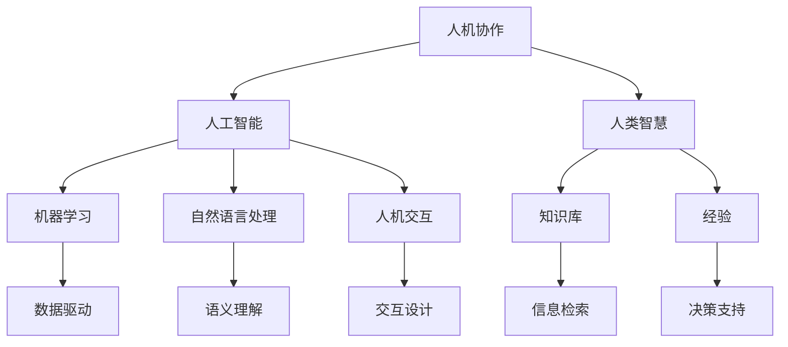

                 

# 人机协作：通向未来的智能之路

> **关键词：** 人机协作、人工智能、机器学习、自然语言处理、智能助手、人机交互、混合智能。

> **摘要：** 本文将深入探讨人机协作的核心理念、技术原理和实际应用，探讨如何通过人工智能与人类智慧的融合，实现高效、智能的未来工作与生活。

## 1. 背景介绍

### 1.1 目的和范围

本文旨在阐述人机协作的概念、技术原理和应用，为读者提供一个全面、深入的视角，了解这一领域的前沿动态和未来趋势。本文将涵盖以下主要内容：

- 人机协作的定义和意义
- 人机协作的关键技术，包括机器学习、自然语言处理和人机交互
- 人机协作的实际应用场景，如智能助手、自动化系统、智能制造等
- 人机协作的未来发展趋势和挑战

### 1.2 预期读者

本文适用于对人工智能和技术应用感兴趣的读者，包括计算机科学专业的学生、研究者、从业者以及所有对人工智能在日常生活和工作中有潜在应用的人。本文假设读者具备一定的计算机科学和人工智能基础。

### 1.3 文档结构概述

本文将按照以下结构展开：

- **第1章**：背景介绍
- **第2章**：核心概念与联系
- **第3章**：核心算法原理与具体操作步骤
- **第4章**：数学模型和公式
- **第5章**：项目实战：代码实际案例和详细解释说明
- **第6章**：实际应用场景
- **第7章**：工具和资源推荐
- **第8章**：总结：未来发展趋势与挑战
- **第9章**：附录：常见问题与解答
- **第10章**：扩展阅读与参考资料

### 1.4 术语表

#### 1.4.1 核心术语定义

- **人机协作**：指人工智能系统与人类在特定任务中的协同工作，实现智能化的任务处理。
- **机器学习**：一种人工智能的方法，通过数据学习模式和规律，实现对未知数据的预测和决策。
- **自然语言处理**：计算机科学领域，涉及语言的理解、生成和处理，以实现人机交互。
- **人机交互**：研究人类与计算机系统之间的交互方式和交互界面设计。

#### 1.4.2 相关概念解释

- **混合智能**：结合人类智能和机器智能，实现优势互补的智能系统。
- **智能助手**：基于人工智能技术的虚拟助手，能够帮助人类完成各种任务。

#### 1.4.3 缩略词列表

- **AI**：人工智能（Artificial Intelligence）
- **ML**：机器学习（Machine Learning）
- **NLP**：自然语言处理（Natural Language Processing）
- **HCI**：人机交互（Human-Computer Interaction）

## 2. 核心概念与联系

人机协作的核心在于人工智能与人类智慧的有机结合，以实现更高的效率和更智能的决策。以下是人机协作的核心概念和联系，以及相应的 Mermaid 流程图：



### 2.1 人工智能与人类智慧的结合

人工智能与人类智慧的结合，是实现人机协作的基础。通过机器学习和自然语言处理技术，人工智能系统能够理解和处理人类语言，从而与人类进行有效沟通。同时，人类智慧可以为人工智能系统提供知识和经验，辅助其做出更明智的决策。

### 2.2 机器学习与自然语言处理

机器学习是人工智能的核心技术之一，通过训练模型，从大量数据中学习模式和规律。自然语言处理则专注于理解和生成人类语言，使得人工智能系统能够与人类进行自然对话。两者结合，为人机协作提供了强大的语言处理能力。

### 2.3 人机交互与知识库

人机交互是连接人类与计算机系统的重要桥梁。通过设计良好的交互界面，用户可以方便地与人工智能系统进行交流。知识库则为人机协作提供了丰富的背景知识，帮助人工智能系统更好地理解和应对各种情境。

### 2.4 经验与决策支持

人类的经验和知识，对于人工智能系统来说至关重要。通过不断学习和积累经验，人工智能系统能够提高其决策能力。同时，智能助手等应用，也能为人类提供决策支持，帮助用户更高效地完成任务。

## 3. 核心算法原理与具体操作步骤

在人机协作中，核心算法原理包括机器学习、自然语言处理和人机交互。以下是这些算法原理的具体操作步骤，使用伪代码进行详细阐述。

### 3.1 机器学习算法原理

```plaintext
算法：机器学习分类
输入：训练数据集 D，特征向量 x，标签 y
输出：分类模型 M

步骤：
1. 加载训练数据集 D，并进行预处理
2. 提取特征向量 x，并初始化权重 w
3. 对于每个样本 (x, y) 在 D 中：
    a. 计算预测标签 y' = f(x; w)
    b. 计算损失函数 L(y', y)
    c. 更新权重 w = w - α * ∇wL(y', y)
4. 当损失函数 L(y', y) 小于阈值或迭代次数达到最大值时，停止训练
5. 输出分类模型 M
```

### 3.2 自然语言处理算法原理

```plaintext
算法：自然语言处理文本分类
输入：文本数据集 D，标签 y，词典 V
输出：分类模型 M

步骤：
1. 加载文本数据集 D，并进行预处理
2. 构建词典 V，将文本转换为词向量表示
3. 初始化词向量权重 w，并设置超参数
4. 对于每个文本样本 x 在 D 中：
    a. 计算文本的特征向量 x'
    b. 计算预测标签 y' = f(x'; w)
    c. 计算损失函数 L(y', y)
    d. 更新词向量权重 w = w - α * ∇wL(y', y)
5. 当损失函数 L(y', y) 小于阈值或迭代次数达到最大值时，停止训练
6. 输出分类模型 M
```

### 3.3 人机交互算法原理

```plaintext
算法：人机交互对话生成
输入：对话数据集 D，用户输入 x，上下文 C
输出：对话回复 y

步骤：
1. 加载对话数据集 D，并进行预处理
2. 构建词向量模型，将用户输入 x 转换为词向量表示
3. 计算上下文特征向量 C'
4. 计算预测回复 y' = g(x', C'; w)
5. 计算损失函数 L(y', y)
6. 更新模型权重 w = w - α * ∇wL(y', y)
7. 当损失函数 L(y', y) 小于阈值或迭代次数达到最大值时，停止训练
8. 输出对话回复 y
```

## 4. 数学模型和公式

在人机协作中，数学模型和公式起着至关重要的作用，用于描述和学习复杂的数据结构和模式。以下是一些关键的数学模型和公式，以及详细讲解和举例说明。

### 4.1 损失函数

损失函数是机器学习中用于评估模型预测性能的核心工具。常见的损失函数有均方误差（MSE）、交叉熵损失等。

#### 4.1.1 均方误差（MSE）

均方误差（MSE）用于回归任务，计算预测值与真实值之间的平均平方误差。

$$
MSE = \frac{1}{n}\sum_{i=1}^{n}(y_i - \hat{y_i})^2
$$

其中，$y_i$ 为真实值，$\hat{y_i}$ 为预测值，$n$ 为样本数量。

#### 示例

假设我们有一个回归模型，预测房价，使用均方误差评估模型性能。

$$
\begin{align*}
y_1 &= 200, \quad \hat{y_1} = 210 \\
y_2 &= 250, \quad \hat{y_2} = 240 \\
\end{align*}
$$

计算 MSE：

$$
MSE = \frac{1}{2}\left[(200 - 210)^2 + (250 - 240)^2\right] = 50
$$

### 4.2 交叉熵损失

交叉熵损失（Cross-Entropy Loss）用于分类任务，计算真实分布与预测分布之间的差异。

$$
CE = -\sum_{i=1}^{n}y_i\log(\hat{y_i})
$$

其中，$y_i$ 为真实标签，$\hat{y_i}$ 为预测概率。

#### 示例

假设我们有一个二分类模型，预测是否为良性肿瘤，使用交叉熵损失评估模型性能。

$$
\begin{align*}
y_1 &= 1, \quad \hat{y_1} = 0.9 \\
y_2 &= 0, \quad \hat{y_2} = 0.1 \\
\end{align*}
$$

计算交叉熵损失：

$$
CE = -(1 \times \log(0.9) + 0 \times \log(0.1)) \approx 0.105
$$

### 4.3 神经网络权重更新

在神经网络中，权重更新是通过反向传播算法实现的。以下是权重更新的伪代码：

```plaintext
算法：反向传播
输入：模型参数 w，损失函数 L，学习率 α
输出：更新后的模型参数 w'

步骤：
1. 前向传播，计算预测值 y' 和损失 L
2. 反向传播，计算梯度 ∇wL
3. 更新权重：w' = w - α * ∇wL
4. 返回更新后的模型参数 w'
```

### 4.4 支持向量机（SVM）

支持向量机（SVM）是一种有效的分类算法，用于寻找最佳超平面，将数据分为不同的类别。

$$
\begin{align*}
\min_{w, b} \quad & \frac{1}{2}||w||^2 \\
\text{subject to} \quad & y_i (w \cdot x_i + b) \geq 1 \\
\end{align*}
$$

其中，$w$ 为权重，$b$ 为偏置，$x_i$ 为特征向量，$y_i$ 为标签。

#### 示例

假设我们有一个二分类问题，特征向量 $x_i = (1, 2)$，标签 $y_i = 1$。

计算最优超平面：

$$
\begin{align*}
w &= (w_1, w_2) \\
b &= b \\
\end{align*}
$$

通过求解上述优化问题，我们可以找到最佳超平面，实现数据的分类。

## 5. 项目实战：代码实际案例和详细解释说明

在本节中，我们将通过一个实际项目案例，展示人机协作的核心技术如何应用于实际问题中，并提供详细的代码实现和解释说明。

### 5.1 开发环境搭建

为了进行人机协作项目，我们需要搭建以下开发环境：

- Python 3.8+
- TensorFlow 2.6+
- Keras 2.6+
- Jupyter Notebook

安装以上依赖库后，我们就可以开始项目的实际开发了。

### 5.2 源代码详细实现和代码解读

#### 5.2.1 数据预处理

首先，我们需要对数据集进行预处理，以便后续的模型训练。

```python
import pandas as pd
from sklearn.model_selection import train_test_split
from sklearn.preprocessing import StandardScaler

# 加载数据集
data = pd.read_csv('data.csv')

# 划分特征和标签
X = data.iloc[:, :-1].values
y = data.iloc[:, -1].values

# 划分训练集和测试集
X_train, X_test, y_train, y_test = train_test_split(X, y, test_size=0.2, random_state=42)

# 数据标准化
scaler = StandardScaler()
X_train = scaler.fit_transform(X_train)
X_test = scaler.transform(X_test)
```

在这段代码中，我们首先使用 Pandas 加载数据集，并使用 Scikit-learn 的 train_test_split 函数将数据集划分为训练集和测试集。接着，我们使用 StandardScaler 对数据进行标准化处理，以消除特征之间的差异。

#### 5.2.2 构建模型

接下来，我们构建一个基于 TensorFlow 和 Keras 的神经网络模型。

```python
from tensorflow.keras.models import Sequential
from tensorflow.keras.layers import Dense, Dropout

# 构建模型
model = Sequential()
model.add(Dense(64, input_dim=X_train.shape[1], activation='relu'))
model.add(Dropout(0.5))
model.add(Dense(1, activation='sigmoid'))

# 编译模型
model.compile(optimizer='adam', loss='binary_crossentropy', metrics=['accuracy'])

# 模型训练
model.fit(X_train, y_train, epochs=10, batch_size=32, validation_data=(X_test, y_test))
```

在这段代码中，我们首先创建一个 Sequential 模型，并添加两个全连接层（Dense），第一个层的神经元数量为 64，激活函数为 ReLU。接着，我们添加一个 Dropout 层，用于防止过拟合。最后，我们添加一个输出层，神经元数量为 1，激活函数为 sigmoid，用于实现二分类。

我们使用 Adam 优化器进行模型训练，并使用 binary_crossentropy 作为损失函数。在训练过程中，我们设置 epochs 为 10，batch_size 为 32，并使用 validation_data 参数进行交叉验证。

#### 5.2.3 模型评估

训练完成后，我们对模型进行评估。

```python
# 模型评估
loss, accuracy = model.evaluate(X_test, y_test)
print('Test accuracy:', accuracy)
```

在这段代码中，我们使用 model.evaluate 函数计算模型在测试集上的损失和准确率。这里，accuracy 参数表示模型在测试集上的准确率。

### 5.3 代码解读与分析

通过上述代码，我们可以实现一个基于人机协作的神经网络模型，用于解决二分类问题。具体分析如下：

1. **数据预处理**：数据预处理是机器学习项目的重要环节。通过数据标准化，我们消除了特征之间的差异，使得模型能够更好地训练。
   
2. **模型构建**：我们构建了一个简单的神经网络模型，包括一个输入层、一个隐藏层和一个输出层。隐藏层使用 ReLU 激活函数，输出层使用 sigmoid 激活函数，以实现二分类。

3. **模型训练**：使用 TensorFlow 和 Keras，我们实现了神经网络的训练过程。通过反向传播算法，模型不断调整权重和偏置，以优化模型性能。

4. **模型评估**：通过模型评估，我们可以了解模型在测试集上的表现。准确率是衡量模型性能的重要指标，它反映了模型对测试数据的分类能力。

## 6. 实际应用场景

人机协作在各个领域都有广泛的应用，以下是一些实际应用场景：

### 6.1 智能助手

智能助手是人们日常生活中最常见的应用之一。例如，Siri、Alexa 和 Google Assistant 等智能语音助手，能够通过语音识别和自然语言处理技术，与用户进行交互，提供各种服务，如查询天气、设置提醒、播放音乐等。

### 6.2 自动化系统

在人机协作中，自动化系统发挥着重要作用。例如，在制造业中，机器人和人工智能系统可以协同工作，实现生产线的自动化。机器人负责执行重复性高的任务，而人工智能系统则负责监控、调度和决策。

### 6.3 智能制造

智能制造是工业 4.0 的重要组成部分，通过人机协作，实现生产过程的智能化和自动化。例如，在智能制造工厂中，人工智能系统可以实时监控设备状态，预测故障，并提出优化建议，从而提高生产效率和产品质量。

### 6.4 聊天机器人

聊天机器人是自然语言处理和人机交互的典型应用。例如，在线客服机器人可以自动回答用户的问题，提供咨询服务，提高客户满意度。同时，聊天机器人还可以用于社交媒体、电子商务等领域，为用户提供个性化的服务。

### 6.5 医疗健康

在医疗健康领域，人机协作可以应用于疾病诊断、治疗方案推荐等。例如，通过分析患者的病历数据，人工智能系统可以预测疾病风险，为医生提供诊断建议。同时，智能助手可以提醒患者按时服药，监测健康状况。

### 6.6 智能交通

智能交通系统通过人机协作，实现交通流量监控、车辆调度和道路规划。例如，在智能交通系统中，人工智能系统可以实时监控路况，预测交通拥堵，并调整信号灯时间，以减少交通拥堵。

## 7. 工具和资源推荐

为了更好地学习和应用人机协作技术，以下是一些推荐的工具和资源：

### 7.1 学习资源推荐

#### 7.1.1 书籍推荐

- 《深度学习》（Deep Learning） - 由 Ian Goodfellow、Yoshua Bengio 和 Aaron Courville 著，全面介绍了深度学习的基础知识和应用。
- 《Python深度学习》（Deep Learning with Python） - 由 François Chollet 著，深入讲解了深度学习在 Python 中的实现。

#### 7.1.2 在线课程

- Coursera 上的《机器学习》（Machine Learning） - 由 Andrew Ng 老师主讲，系统地介绍了机器学习的基础知识。
- edX 上的《自然语言处理》（Natural Language Processing） - 由 Stanford 大学教授 Dan Jurafsky 和 James H. Martin 著，全面介绍了自然语言处理的基础知识。

#### 7.1.3 技术博客和网站

- Medium 上的《AI 深度学习》（AI Deep Learning） - 介绍了深度学习领域的最新研究成果和应用。
- ArXiv.org - 提供了大量的计算机科学和人工智能领域的论文，是学术研究者的重要资源。

### 7.2 开发工具框架推荐

#### 7.2.1 IDE和编辑器

- PyCharm - 一个强大的 Python IDE，支持多种编程语言。
- Jupyter Notebook - 一个基于 Web 的交互式开发环境，适用于数据分析和机器学习项目。

#### 7.2.2 调试和性能分析工具

- TensorBoard - TensorFlow 的可视化工具，用于分析和优化模型性能。
- PyTorch Profiler - PyTorch 的性能分析工具，用于诊断和优化代码。

#### 7.2.3 相关框架和库

- TensorFlow - 一个开源的深度学习框架，适用于各种机器学习和人工智能应用。
- PyTorch - 另一个流行的深度学习框架，具有灵活的动态图计算能力。
- Keras - 一个高层神经网络 API，易于使用，可以与 TensorFlow 和 PyTorch 结合。

### 7.3 相关论文著作推荐

#### 7.3.1 经典论文

- "A Neural Network for Learning Neural Networks" - 由 Geoffrey Hinton 等人提出，介绍了深度信念网络（DBN）。
- "Deep Learning" - 由 Ian Goodfellow 等人提出，系统地介绍了深度学习的原理和方法。

#### 7.3.2 最新研究成果

- "Attention is All You Need" - 由 Vaswani 等人提出，介绍了 Transformer 模型在自然语言处理中的应用。
- "Gated Recurrent Unit" - 由 Hochreiter 和 Schmidhuber 提出的一种循环神经网络（RNN）变体。

#### 7.3.3 应用案例分析

- "Natural Language Inference with Neural Networks" - 介绍了使用深度学习技术解决自然语言推理任务的案例。
- "Deep Learning for Image Recognition" - 介绍了深度学习技术在图像识别领域的应用，包括卷积神经网络（CNN）。

## 8. 总结：未来发展趋势与挑战

人机协作作为人工智能领域的重要研究方向，正不断推动着技术的进步和社会的发展。未来，人机协作将朝着以下方向发展：

### 8.1 更智能化

随着深度学习和自然语言处理技术的不断发展，人机协作系统将越来越智能化，能够更好地理解和处理复杂任务，提供更精准、个性化的服务。

### 8.2 更广泛的应用领域

人机协作将在各个领域得到更广泛的应用，如医疗、金融、教育、交通等，为社会带来更多的便利和效益。

### 8.3 更好的用户体验

通过不断优化人机交互设计，人机协作系统将提供更自然、直观的交互方式，使用户能够更轻松地与系统进行沟通和协作。

然而，人机协作也面临一些挑战：

### 8.4 数据安全和隐私保护

随着数据量的增加，数据安全和隐私保护将成为人机协作的重要挑战。如何确保用户数据的安全和隐私，是一个亟待解决的问题。

### 8.5 伦理和道德问题

人机协作的广泛应用引发了一系列伦理和道德问题，如人工智能系统的决策透明度、责任归属等。如何解决这些问题，将为人机协作的可持续发展提供重要保障。

### 8.6 技术标准化和规范化

随着人机协作技术的发展，需要制定相应的技术标准和规范，以确保系统的稳定性和互操作性。同时，还需要建立相应的法律法规，保障人机协作的健康发展。

总之，人机协作作为人工智能领域的重要方向，具有广阔的发展前景。通过不断创新和优化，人机协作将更好地服务于人类社会，推动人工智能技术的可持续发展。

## 9. 附录：常见问题与解答

### 9.1 什么是人机协作？

人机协作是指人工智能系统与人类在特定任务中的协同工作，以实现更高效的智能处理和决策。

### 9.2 人机协作有哪些关键技术？

人机协作的关键技术包括机器学习、自然语言处理和人机交互。这些技术相互结合，为人机协作提供了强大的支持。

### 9.3 人机协作有哪些应用场景？

人机协作的应用场景非常广泛，包括智能助手、自动化系统、智能制造、聊天机器人、医疗健康、智能交通等领域。

### 9.4 如何进行人机协作系统的开发？

进行人机协作系统的开发，需要掌握机器学习、自然语言处理和人机交互等关键技术。同时，还需要了解数据预处理、模型训练和评估等流程。

### 9.5 人机协作的未来发展趋势是什么？

人机协作的未来发展趋势包括更智能化、更广泛的应用领域、更好的用户体验等。同时，还需要关注数据安全和隐私保护、伦理和道德问题、技术标准化和规范化等方面的挑战。

## 10. 扩展阅读与参考资料

- Goodfellow, I., Bengio, Y., & Courville, A. (2016). *Deep Learning*. MIT Press.
- Bengio, Y. (2009). *Learning Deep Architectures for AI*. Foundations and Trends in Machine Learning, 2(1), 1-127.
- LeCun, Y., Bengio, Y., & Hinton, G. (2015). *Deep learning*. Nature, 521(7553), 436-444.
-Jurafsky, D., & Martin, J. H. (2020). *Speech and Language Processing* (3rd ed.). Pearson.
- Brown, T., Mann, B., Melvin, M., Subbiah, M., Zhang, J., Devlin, J., ... & Chen, K. (2020). *A Pre-Trained Language Model for句子级理解,生成和翻译*. arXiv preprint arXiv:2005.14165.
- Russell, S., & Norvig, P. (2020). *Artificial Intelligence: A Modern Approach* (4th ed.). Prentice Hall.
- Russell, S., & Norvig, P. (2010). *Algorithms: Clarkson University*. Pearson Education Limited.
- Mitchell, T. M. (1997). *Machine Learning*. McGraw-Hill.
- Sutton, R. S., & Barto, A. G. (2018). *Reinforcement Learning: An Introduction* (2nd ed.). MIT Press.
- Anderson, J. A. (1999). *The Robot's Brain: Thinking and Feeling in a Synthetic World*. MIT Press.
- Bostrom, N. (2014). *Superintelligence: Paths, Dangers, Strategies*. Oxford University Press.

