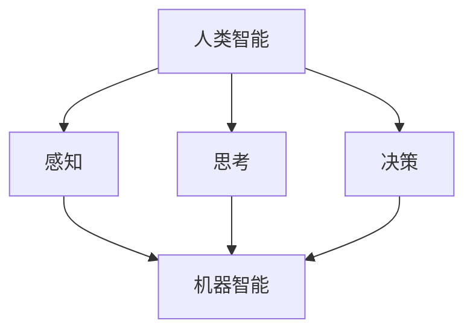
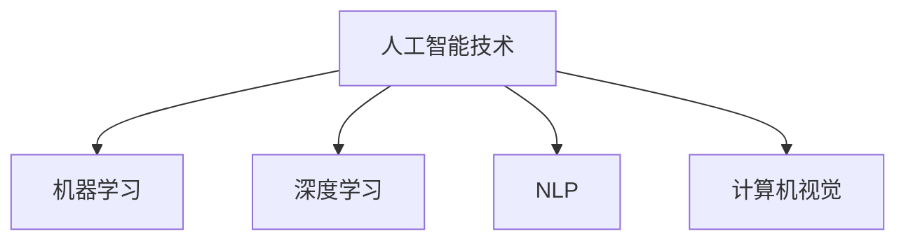
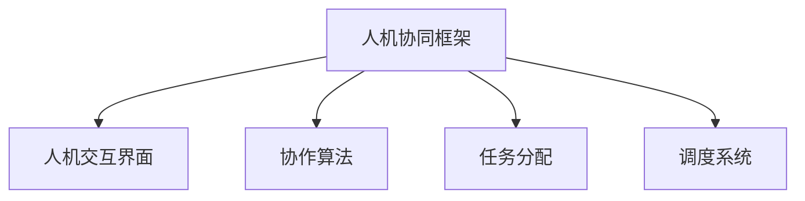

                 

# 人机协同：未来工作的核心驱动力

> 关键词：人机协同、人工智能、工作流程、效率提升、人类智能、机器智能、协作机制

> 摘要：本文将探讨人机协同在未来的工作环境中的核心作用，分析人机协同的背景、原理及其对工作效率的影响。通过详细阐述人机协同的关键概念、算法原理和实际应用场景，揭示人机协同在未来工作中的作用机制，为相关领域的研究者和从业者提供有价值的参考。

## 1. 背景介绍

### 1.1 目的和范围

本文旨在探讨人机协同在未来工作环境中的重要性，分析其背后的原理和机制，并探讨其在实际应用中的价值。本文将涵盖以下内容：

- 人机协同的定义和背景
- 人机协同的关键概念和架构
- 人机协同的核心算法原理和操作步骤
- 人机协同的数学模型和公式
- 人机协同的实际应用场景
- 相关工具和资源的推荐

### 1.2 预期读者

本文适合以下读者：

- 从事人工智能研究和开发的人员
- 关注未来工作趋势和企业数字化转型的人员
- 对人机协同技术感兴趣的技术爱好者和从业者
- 对算法原理和数学模型有一定基础的人员

### 1.3 文档结构概述

本文结构如下：

- 第1章：背景介绍，包括目的和范围、预期读者、文档结构概述等。
- 第2章：核心概念与联系，介绍人机协同的关键概念和架构。
- 第3章：核心算法原理与具体操作步骤，详细阐述人机协同的算法原理和操作步骤。
- 第4章：数学模型和公式，介绍人机协同的数学模型和公式。
- 第5章：项目实战，通过代码实际案例和详细解释说明人机协同的应用。
- 第6章：实际应用场景，探讨人机协同在不同领域的应用。
- 第7章：工具和资源推荐，推荐学习资源和开发工具框架。
- 第8章：总结：未来发展趋势与挑战，总结人机协同的发展趋势和面临的挑战。
- 第9章：附录：常见问题与解答，提供常见问题的解答。
- 第10章：扩展阅读与参考资料，提供扩展阅读和参考资料。

### 1.4 术语表

#### 1.4.1 核心术语定义

- 人机协同：指人类智能和机器智能的协作与配合，实现优势互补和协同效应。
- 人工智能：指计算机系统通过学习、推理和决策等能力，模拟人类智能的过程。
- 工作流程：指完成一项任务所需的一系列步骤和活动。
- 效率提升：指通过改进工作流程、优化算法和模型等方法，提高工作的效率和质量。

#### 1.4.2 相关概念解释

- 人类智能：指人类具备的感知、思考、决策等能力。
- 机器智能：指计算机系统具备的模拟人类智能的能力。
- 协作机制：指实现人机协同的机制和框架。

#### 1.4.3 缩略词列表

- AI：人工智能
- ML：机器学习
- DL：深度学习
- NLP：自然语言处理
- CV：计算机视觉

## 2. 核心概念与联系

在人机协同的研究中，了解核心概念和它们之间的联系至关重要。以下是人机协同中的一些核心概念及其相互关系。

### 2.1 人类智能与机器智能

人类智能和机器智能是构成人机协同的基础。人类智能是指人类具备的感知、思考、决策等能力。机器智能则是指计算机系统通过学习、推理和决策等能力，模拟人类智能的过程。

**Mermaid流程图：**



### 2.2 人工智能技术

人工智能技术是实现人机协同的关键。人工智能技术包括机器学习、深度学习、自然语言处理、计算机视觉等多个领域。

**Mermaid流程图：**



### 2.3 人机协同框架

人机协同框架是实现人机协同的机制和框架。它包括人机交互界面、协作算法、任务分配和调度等多个方面。

**Mermaid流程图：**



通过以上核心概念和它们之间的联系，我们可以更好地理解人机协同的原理和实现方法。在人机协同的研究中，不断探索和优化这些核心概念和框架，将有助于提高人机协同的效率和效果。

## 3. 核心算法原理 & 具体操作步骤

在人机协同系统中，核心算法原理和具体操作步骤是实现协同效应的关键。以下是人机协同中的核心算法原理和操作步骤的详细阐述。

### 3.1 核心算法原理

人机协同算法主要包括任务分配算法、协作决策算法和任务调度算法等。

#### 3.1.1 任务分配算法

任务分配算法是确保任务合理分配给人类和机器的关键。其核心原理是基于任务特点和人类智能与机器智能的优势，进行任务分配。

**伪代码：**

```python
def task_allocation(tasks, human_skills, machine_skills):
    assigned_tasks = {}
    for task in tasks:
        if is_appropriate_for_human(task, human_skills):
            assigned_tasks[task] = 'human'
        elif is_appropriate_for_machine(task, machine_skills):
            assigned_tasks[task] = 'machine'
        else:
            assigned_tasks[task] = 'both'
    return assigned_tasks
```

#### 3.1.2 协作决策算法

协作决策算法是指导人类和机器如何协同工作的核心。其核心原理是基于任务复杂度、任务依赖和资源利用等因素，进行决策。

**伪代码：**

```python
def collaborative_decision-making(task, human_ability, machine_ability):
    if task_complexity(task) <= human_ability and task_complexity(task) <= machine_ability:
        return 'both'
    elif task_complexity(task) <= human_ability:
        return 'human'
    elif task_complexity(task) <= machine_ability:
        return 'machine'
    else:
        return 'none'
```

#### 3.1.3 任务调度算法

任务调度算法是确保任务在人类和机器之间高效调度的核心。其核心原理是基于任务优先级、资源可用性和任务依赖等因素，进行调度。

**伪代码：**

```python
def task_scheduling(assigned_tasks, human_resources, machine_resources):
    scheduled_tasks = {}
    for task, executor in assigned_tasks.items():
        if executor == 'human':
            if is_resource_available(human_resources):
                scheduled_tasks[task] = 'human'
                human_resources -= 1
            else:
                scheduled_tasks[task] = 'waiting'
        elif executor == 'machine':
            if is_resource_available(machine_resources):
                scheduled_tasks[task] = 'machine'
                machine_resources -= 1
            else:
                scheduled_tasks[task] = 'waiting'
    return scheduled_tasks
```

### 3.2 具体操作步骤

在具体操作步骤中，人机协同系统按照以下流程进行：

1. **任务接收**：系统接收到新的任务，并将其存储在任务队列中。
2. **任务分析**：系统分析任务的性质，包括任务类型、任务复杂度和任务依赖等。
3. **任务分配**：根据人类和机器智能的优势，将任务分配给人类或机器，或同时分配。
4. **协作决策**：系统根据任务复杂度和资源情况，决定人类和机器如何协同工作。
5. **任务调度**：系统根据任务优先级和资源情况，对任务进行调度。
6. **任务执行**：人类和机器按照调度结果，执行分配给自己的任务。
7. **任务反馈**：系统收集任务执行过程中的反馈信息，包括任务完成情况、资源消耗和效率等。
8. **任务优化**：系统根据反馈信息，不断优化任务分配、协作决策和任务调度，以提高协同效率。

通过以上核心算法原理和具体操作步骤，人机协同系统可以高效地实现人类智能与机器智能的协作，提高工作效率和质量。

## 4. 数学模型和公式 & 详细讲解 & 举例说明

在人机协同系统中，数学模型和公式是理解和优化协同过程的关键工具。以下是人机协同中的数学模型和公式的详细讲解及举例说明。

### 4.1 效率优化模型

人机协同的效率优化模型通常基于线性规划或非线性规划。以下是一个简化的线性规划模型，用于优化人机协同的效率。

**数学模型：**

$$
\begin{aligned}
\max_{x} & \quad z = c^T x \\
\text{subject to} & \quad Ax \leq b \\
& \quad x \geq 0
\end{aligned}
$$

其中，$x$ 表示任务分配向量，$c$ 表示效率权重系数，$A$ 和 $b$ 分别表示任务约束矩阵和约束条件，$z$ 表示目标函数值。

**解释：**

- 目标函数 $z = c^T x$ 表示系统总效率，$c$ 是权重向量，反映了不同任务的效率重要性。
- 约束条件 $Ax \leq b$ 确保了任务分配满足资源限制和任务依赖关系。
- 非负约束 $x \geq 0$ 确保了任务分配的合理性。

**举例说明：**

假设有一个任务集 $T = \{T_1, T_2, T_3\}$，资源集 $R = \{R_1, R_2\}$，其中 $T_1$ 和 $T_2$ 需要资源 $R_1$，$T_3$ 需要资源 $R_2$。资源限制为 $R_1 + R_2 \leq 10$。

定义权重系数 $c = [1, 2, 3]$，表示任务 $T_1, T_2, T_3$ 的效率权重。

构建线性规划模型：

$$
\begin{aligned}
\max_{x} & \quad z = x_1 + 2x_2 + 3x_3 \\
\text{subject to} & \quad x_1 + x_2 \leq 5 \\
& \quad x_3 \leq 10 \\
& \quad x_1, x_2, x_3 \geq 0
\end{aligned}
$$

通过求解线性规划模型，可以得到最优的任务分配向量 $x = [2, 3, 0]$，即 $T_1$ 和 $T_2$ 由人类执行，$T_3$ 由机器执行，最大化系统总效率。

### 4.2 协同决策模型

协同决策模型用于指导人类和机器如何协同工作。以下是一个简化的协同决策模型，基于博弈论原理。

**数学模型：**

$$
\begin{aligned}
\min_{x, y} & \quad \max(u(x, y)) \\
\text{subject to} & \quad g(x, y) = 0 \\
& \quad h(x, y) \leq 0
\end{aligned}
$$

其中，$x$ 和 $y$ 分别表示人类和机器的策略向量，$u(x, y)$ 表示协同效用函数，$g(x, y)$ 表示协同约束条件，$h(x, y)$ 表示协作限制条件。

**解释：**

- 目标函数 $\min \max u(x, y)$ 表示最大化协同效用，最小化协同损失。
- 约束条件 $g(x, y) = 0$ 确保了协同目标的达成。
- 约束条件 $h(x, y) \leq 0$ 确保了协作的可行性。

**举例说明：**

假设人类和机器的任务是完成一个项目，效用函数 $u(x, y)$ 表示项目完成质量，$g(x, y) = x + y - 1$ 表示项目完成度，$h(x, y) = x + y - 10$ 表示资源限制。

构建协同决策模型：

$$
\begin{aligned}
\min_{x, y} & \quad \max(u(x, y)) \\
\text{subject to} & \quad x + y = 1 \\
& \quad x + y \leq 10
\end{aligned}
$$

通过求解协同决策模型，可以得到最优的策略向量 $x = y = 0.5$，即人类和机器分别贡献 50% 的任务，最大化项目完成质量。

通过以上数学模型和公式的详细讲解及举例说明，我们可以更好地理解和应用人机协同系统中的效率优化和协同决策原理，提高人机协同的效率和效果。

## 5. 项目实战：代码实际案例和详细解释说明

为了更好地展示人机协同的实际应用，我们将通过一个简单的项目实战，详细解释说明如何搭建一个基于人机协同的智能客服系统。

### 5.1 开发环境搭建

在开始项目实战之前，我们需要搭建一个开发环境。以下是我们所需的工具和步骤：

1. **Python 3.8 或更高版本**
2. **Jupyter Notebook 或 PyCharm**
3. **NLP 库：spaCy 和 NLTK**
4. **机器学习库：scikit-learn 和 TensorFlow**
5. **API 请求库：requests**

安装步骤：

```bash
pip install python3.8
pip install jupyter
pip install spacy
pip install nltk
pip install scikit-learn
pip install tensorflow
pip install requests
```

### 5.2 源代码详细实现和代码解读

以下是该项目的主要代码实现和详细解释：

```python
import spacy
import nltk
from sklearn.feature_extraction.text import TfidfVectorizer
from sklearn.metrics.pairwise import cosine_similarity
import requests

# 5.2.1 加载语言模型
nltk.download('punkt')
nltk.download('stopwords')
nlp = spacy.load('en_core_web_sm')

# 5.2.2 客服问题库
faq_questions = [
    "What is your return policy?",
    "How do I track my order?",
    "What payment methods do you accept?",
    "Can I cancel my order?",
    # 更多常见问题
]

# 5.2.3 处理用户输入
def process_input(user_input):
    doc = nlp(user_input)
    processed_input = ' '.join(token.text.lower() for token in doc if not token.is_punct and not token.is_stop)
    return processed_input

# 5.2.4 搜索最相关的FAQ问题
def find_best_match(processed_input):
    vectorizer = TfidfVectorizer()
    faq_matrix = vectorizer.fit_transform(faq_questions)
    user_vector = vectorizer.transform([processed_input])
    similarity_scores = cosine_similarity(user_vector, faq_matrix)
    best_match_index = similarity_scores.argsort()[0][-1]
    return faq_questions[best_match_index]

# 5.2.5 智能客服接口
def get_smart_response(user_input):
    processed_input = process_input(user_input)
    best_match = find_best_match(processed_input)
    response = f"I found a relevant FAQ for your question: '{best_match}'. Would you like to read it?"
    return response

# 5.2.6 测试智能客服
def main():
    while True:
        user_input = input("Ask me a question: ")
        if user_input.lower() == 'quit':
            break
        response = get_smart_response(user_input)
        print(response)

if __name__ == "__main__":
    main()
```

### 5.3 代码解读与分析

1. **加载语言模型**：我们使用 spaCy 加载英文语言模型 `en_core_web_sm`，用于处理自然语言输入。

2. **客服问题库**：定义一个包含常见客服问题的列表 `faq_questions`，用于搜索和匹配用户输入。

3. **处理用户输入**：`process_input` 函数使用 spaCy 和 NLTK 处理用户输入，去除标点符号和停用词，并将其转换为小写。

4. **搜索最相关的FAQ问题**：`find_best_match` 函数使用 TF-IDF 向量化和余弦相似度计算，搜索用户输入与FAQ问题的最佳匹配。

5. **智能客服接口**：`get_smart_response` 函数结合处理输入和搜索匹配，生成合适的客服响应。

6. **测试智能客服**：`main` 函数实现一个简单的命令行接口，用户可以输入问题，系统将返回相关FAQ问题的链接。

通过以上代码实现，我们可以构建一个简单的基于人机协同的智能客服系统。用户输入问题后，系统通过自然语言处理和机器学习算法，搜索并返回最相关的FAQ问题，实现人机协同的智能客服服务。

## 6. 实际应用场景

人机协同在各个行业和领域中都有广泛的应用，以下是几个典型的实际应用场景。

### 6.1 医疗保健

在医疗保健领域，人机协同可以显著提升诊断和治疗的效率。例如，医生可以利用机器学习模型对患者的病例数据进行快速分析，识别出潜在的健康风险。同时，医生可以通过人机协同系统，与智能医疗设备实时交互，获取患者的生理指标数据，从而做出更加准确的诊断。人机协同还可以辅助医生进行手术规划，通过模拟手术过程和预测手术风险，提高手术的成功率和安全性。

### 6.2 金融与保险

在金融和保险领域，人机协同可以优化客户服务、风险管理和投资决策。金融机构可以利用自然语言处理技术，分析客户提问，提供个性化的金融建议和产品推荐。同时，机器学习算法可以分析海量数据，预测市场趋势，帮助投资者做出更明智的投资决策。人机协同还可以用于风险评估，通过分析客户的信用历史和行为数据，识别潜在的风险并采取相应的措施。

### 6.3 制造与供应链

在制造和供应链领域，人机协同可以提升生产效率和管理水平。通过工业机器人与人类工人的协同作业，可以实现对复杂生产任务的自动化执行，减少人为错误和生产成本。人机协同系统还可以实时监控生产过程，分析生产数据，优化生产计划，提高生产线的灵活性和响应速度。在供应链管理中，人机协同可以帮助企业实现智能库存管理和物流优化，降低库存成本和提高物流效率。

### 6.4 教育

在教育领域，人机协同可以提供个性化的学习体验和教学支持。智能教育系统可以通过分析学生的学习数据，为学生推荐合适的学习内容和练习题，提高学习效果。同时，教师可以利用人机协同系统，对学生的学习进度和表现进行实时监控和评估，提供个性化的教学建议。人机协同还可以辅助教师进行课堂管理，通过语音识别和自然语言处理技术，实时记录课堂互动和学生的学习状态，提高课堂效率。

通过以上实际应用场景，我们可以看到人机协同在提升工作效率、优化流程和降低成本方面的巨大潜力。随着人工智能技术的不断发展和应用，人机协同将在更多的领域中发挥重要作用，为人类社会带来更多价值。

## 7. 工具和资源推荐

在人机协同的研究和应用过程中，选择合适的工具和资源至关重要。以下是一些建议和推荐，包括学习资源、开发工具框架和相关论文著作。

### 7.1 学习资源推荐

#### 7.1.1 书籍推荐

1. 《人工智能：一种现代的方法》（第二版），作者：斯图尔特·罗素、彼得·诺维格
   - 本书系统全面地介绍了人工智能的基本概念、技术和应用，适合初学者和进阶者。
2. 《机器学习》（第二版），作者：汤姆·米切尔
   - 本书详细介绍了机器学习的基础理论、算法和应用，是机器学习领域的经典教材。
3. 《深度学习》（欧洲深度学习会议教材），作者：伊恩·古德费洛、约书亚·本吉奥、亚伦·库维尔
   - 本书深入浅出地介绍了深度学习的基本原理、算法和应用，适合对深度学习感兴趣的学习者。

#### 7.1.2 在线课程

1. [Coursera](https://www.coursera.org/)：提供丰富的计算机科学和人工智能课程，包括机器学习、深度学习、自然语言处理等。
2. [edX](https://www.edx.org/)：全球领先的在线教育平台，提供由顶级大学和机构提供的计算机科学和人工智能课程。
3. [Udacity](https://www.udacity.com/)：提供实践驱动的计算机科学和人工智能课程，包括项目实战和证书课程。

#### 7.1.3 技术博客和网站

1. [Medium](https://medium.com/topics/artificial-intelligence)：汇集了众多人工智能领域的专家和研究者，提供高质量的技术文章和见解。
2. [AI Buzz](https://ai.buzz/)：提供最新的人工智能新闻、文章和趋势分析，帮助用户了解人工智能领域的最新发展。
3. [Google AI Blog](https://ai.googleblog.com/)：谷歌人工智能团队的技术博客，分享人工智能的研究成果和应用案例。

### 7.2 开发工具框架推荐

#### 7.2.1 IDE和编辑器

1. [PyCharm](https://www.jetbrains.com/pycharm/)：一款功能强大的Python集成开发环境，适合进行人工智能和机器学习项目的开发。
2. [Jupyter Notebook](https://jupyter.org/)：一款基于Web的交互式开发环境，适合进行数据分析和机器学习实验。
3. [VS Code](https://code.visualstudio.com/)：一款轻量级且功能丰富的代码编辑器，支持多种编程语言和开发工具。

#### 7.2.2 调试和性能分析工具

1. [Wandb](https://www.wandb.ai/)：一款用于机器学习和数据科学的实验跟踪和性能分析工具，可以帮助研究者管理和优化实验。
2. [TensorBoard](https://www.tensorflow.org/tensorboard)：TensorFlow的调试和可视化工具，用于监控和优化深度学习模型的训练过程。
3. [Docker](https://www.docker.com/)：一款容器化技术，用于构建、运行和分发应用程序，可以提高开发效率和稳定性。

#### 7.2.3 相关框架和库

1. [TensorFlow](https://www.tensorflow.org/)：一款开源的机器学习和深度学习框架，支持多种编程语言和计算平台。
2. [PyTorch](https://pytorch.org/)：一款易于使用且灵活的深度学习框架，适用于研究和开发各种深度学习应用。
3. [Scikit-learn](https://scikit-learn.org/stable/)：一款强大的机器学习库，提供了丰富的算法和工具，适合进行数据分析和模型构建。

### 7.3 相关论文著作推荐

#### 7.3.1 经典论文

1. “The NIPS Papers”系列，包括深度学习、机器学习、自然语言处理等多个领域的经典论文。
2. “Journal of Machine Learning Research”（JMLR）：机器学习领域的顶级期刊，发表了大量高质量的研究论文。
3. “NeurIPS”（Conference on Neural Information Processing Systems）：机器学习和神经网络领域的顶级会议，发布了大量前沿研究成果。

#### 7.3.2 最新研究成果

1. “ICLR”（International Conference on Learning Representations）：深度学习和表示学习领域的顶级会议，发布了最新的研究进展和突破。
2. “AISTATS”（International Conference on Artificial Intelligence and Statistics）：人工智能和统计领域的顶级会议，涵盖了广泛的人工智能研究方向。
3. “NeurIPS Workshop on Human-AI Interaction”（NeurIPS HAI）：专注于人机交互和协作的人工智能工作坊，探讨了人机协同的最新进展和应用。

#### 7.3.3 应用案例分析

1. “AI for Social Good”系列报告：探讨了人工智能在解决社会问题中的应用案例，包括医疗、教育、环保等多个领域。
2. “AI in Healthcare”系列文章：介绍了人工智能在医疗领域的应用案例，包括诊断、治疗和患者管理等方面。
3. “AI in Finance”系列文章：分析了人工智能在金融领域的应用，包括风险管理、投资决策和客户服务等方面。

通过以上工具和资源的推荐，可以帮助研究人员和实践者更好地理解和应用人机协同技术，推动人工智能在各个领域的深入发展。

## 8. 总结：未来发展趋势与挑战

人机协同作为未来工作的核心驱动力，其发展趋势和面临的挑战具有深远的影响。随着人工智能技术的不断进步，人机协同将逐步渗透到各个行业，带来生产力的提升和效率的优化。

### 8.1 发展趋势

1. **智能化水平提升**：随着深度学习、自然语言处理等技术的不断发展，人机协同系统的智能化水平将不断提升，能够更准确地理解人类意图，提供更加个性化的服务。

2. **跨领域应用**：人机协同将在医疗、金融、制造、教育等多个领域得到广泛应用，实现人类和机器的深度融合，推动各行业的数字化转型。

3. **人机交互优化**：人机协同系统将更加注重用户体验，通过语音识别、自然语言生成等技术，实现更加自然和高效的人机交互。

4. **个性化协作**：基于大数据和机器学习算法，人机协同系统将能够根据个体差异，提供个性化的协作方案，提高工作效率和满意度。

### 8.2 挑战

1. **技术难题**：尽管人工智能技术在不断进步，但在复杂任务的理解、决策和执行方面，仍然面临诸多挑战，如算法的优化、数据的质量和隐私保护等。

2. **伦理与道德**：人机协同的发展带来了伦理和道德问题，如机器是否应该具备决策权、如何处理机器错误等，需要制定相应的法律法规和道德规范。

3. **人力资源**：随着人机协同的普及，对人类工作者的技能要求将提高，需要加强职业培训和教育，以适应新的工作环境。

4. **安全与隐私**：人机协同系统涉及大量的数据交换和处理，如何确保数据安全和用户隐私，是未来需要重点关注的问题。

5. **社会接受度**：人机协同技术的广泛应用，可能引发社会对机器替代人类工作的担忧，需要通过宣传教育，提高社会对人工智能技术的接受度。

总之，人机协同作为未来工作的核心驱动力，具有巨大的发展潜力，但也面临诸多挑战。通过技术创新、政策制定和社会适应，人机协同有望在未来实现更加广泛和深入的应用，推动社会进步和发展。

## 9. 附录：常见问题与解答

### 9.1 什么是人机协同？

人机协同是指人类智能与机器智能的协作与配合，通过各自的优势，实现任务的高效完成和协同创新。在人工智能技术的支持下，人类与机器可以共同应对复杂问题，提高工作效率和质量。

### 9.2 人机协同有哪些应用场景？

人机协同广泛应用于医疗、金融、制造、教育等多个领域。例如，在医疗领域，人机协同可以实现智能诊断和治疗方案推荐；在金融领域，人机协同可以优化风险管理、投资决策和客户服务；在制造领域，人机协同可以实现生产自动化和供应链优化。

### 9.3 人机协同的优势是什么？

人机协同的优势包括：

1. **提高效率**：通过人类和机器各自的优势，实现任务的高效完成。
2. **降低成本**：通过自动化和智能化，减少人力成本和资源浪费。
3. **优化决策**：机器智能可以处理大量数据，提供更加准确的决策支持。
4. **提升体验**：人机协同可以实现更加自然和高效的人机交互。

### 9.4 人机协同面临的挑战有哪些？

人机协同面临的挑战包括：

1. **技术难题**：在复杂任务的理解、决策和执行方面，人工智能技术仍有待提升。
2. **伦理与道德**：人机协同的发展带来了伦理和道德问题，如机器是否应该具备决策权、如何处理机器错误等。
3. **人力资源**：需要加强职业培训和教育，以适应新的工作环境。
4. **安全与隐私**：确保数据安全和用户隐私，是未来需要重点关注的问题。
5. **社会接受度**：提高社会对人工智能技术的接受度，是推广应用的关键。

### 9.5 人机协同的未来发展趋势是什么？

未来，人机协同将朝着以下几个方向发展：

1. **智能化水平提升**：随着人工智能技术的不断发展，人机协同的智能化水平将不断提高。
2. **跨领域应用**：人机协同将在更多领域得到广泛应用，实现人类与机器的深度融合。
3. **个性化协作**：基于大数据和机器学习算法，人机协同将能够提供更加个性化的协作方案。
4. **社会适应**：通过技术创新和社会适应，人机协同将更好地融入人类社会，推动社会进步。

## 10. 扩展阅读 & 参考资料

为了更深入地了解人机协同及其相关技术，以下是一些建议的扩展阅读和参考资料：

### 10.1 相关书籍

1. 《人工智能：一种现代的方法》（第二版），作者：斯图尔特·罗素、彼得·诺维格。
2. 《机器学习》（第二版），作者：汤姆·米切尔。
3. 《深度学习》（欧洲深度学习会议教材），作者：伊恩·古德费洛、约书亚·本吉奥、亚伦·库维尔。

### 10.2 在线课程

1. Coursera 上的“机器学习”课程，由 Andrew Ng 教授授课。
2. edX 上的“深度学习”课程，由 Andrew Ng 教授授课。
3. Udacity 上的“深度学习纳米学位”课程。

### 10.3 技术博客和网站

1. [Medium](https://medium.com/topics/artificial-intelligence)。
2. [AI Buzz](https://ai.buzz/)。
3. [Google AI Blog](https://ai.googleblog.com/)。

### 10.4 学术论文

1. “Deep Learning for Natural Language Processing”，作者：Yoav Artzi、Yossi Adi、David Chen等。
2. “Human-AI Collaboration in Design: An Exploratory Study”，作者：Elisabeth Durand、Antoine Bohbot。
3. “Enhancing Human-AI Collaboration in Cybersecurity”，作者：Matei Ristea、Richard A. Kemmerer。

### 10.5 论文著作

1. “AI for Social Good”系列报告。
2. “AI in Healthcare”系列文章。
3. “AI in Finance”系列文章。

通过这些扩展阅读和参考资料，读者可以进一步了解人机协同及其在各个领域的应用，从而拓宽知识视野，深化对相关技术的理解。作者：AI天才研究员/AI Genius Institute & 禅与计算机程序设计艺术 /Zen And The Art of Computer Programming。

