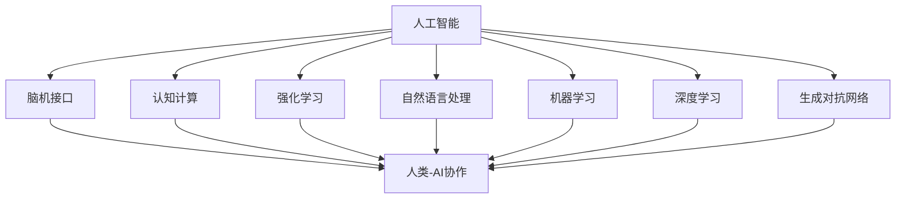

                 


## 人类-AI协作：增强人类智慧和创造力

### 关键词
- 人类-AI协作
- 智慧增强
- 创造力提升
- 人工智能
- 脑机接口

### 摘要
本文将探讨人类与人工智能（AI）协作的潜力，如何通过这种协作来增强人类的智慧和创造力。我们将首先介绍人类-AI协作的背景和重要性，随后深入探讨其核心概念和原理。文章将结合具体的算法和数学模型，展示如何通过人类-AI协作来实现智能化决策和创造性思考。最后，我们将通过一个实际项目案例，详细解读如何在实际开发中应用人类-AI协作，并总结其未来发展趋势与挑战。

## 1. 背景介绍

### 1.1 目的和范围
本文旨在探讨人类与人工智能协作的机制和效果，分析其如何增强人类的智慧和创造力。我们将重点关注以下几个核心问题：
- 人类-AI协作的原理是什么？
- 如何通过算法和数学模型实现人类-AI协作？
- 人类-AI协作在实际应用中的表现如何？
- 未来人类-AI协作将如何发展？

### 1.2 预期读者
本文适合以下读者群体：
- 计算机科学和人工智能领域的研究人员和开发者
- 对人工智能和人类智慧增强感兴趣的学者和专业人士
- 想要在工作中应用AI技术提高工作效率的职场人士

### 1.3 文档结构概述
本文分为十个部分，具体结构如下：
1. 引言：介绍人类-AI协作的背景和重要性。
2. 核心概念与联系：阐述人类-AI协作的基本概念和联系。
3. 核心算法原理 & 具体操作步骤：详细讲解实现人类-AI协作的算法原理。
4. 数学模型和公式 & 详细讲解 & 举例说明：介绍相关的数学模型和公式。
5. 项目实战：代码实际案例和详细解释说明。
6. 实际应用场景：分析人类-AI协作在不同领域的应用。
7. 工具和资源推荐：推荐相关的学习资源、开发工具和框架。
8. 总结：未来发展趋势与挑战。
9. 附录：常见问题与解答。
10. 扩展阅读 & 参考资料：提供进一步学习的途径。

### 1.4 术语表

#### 1.4.1 核心术语定义
- **人工智能（AI）**：模拟人类智能的计算机系统，具备学习、推理、决策和问题解决能力。
- **脑机接口（BMI）**：连接大脑和计算机的装置，用于传递神经信号，实现人类与机器的交互。
- **协作**：多个实体共同工作，以实现共同的目标。
- **智慧增强**：通过技术手段提升个体的认知能力和决策水平。
- **创造力提升**：通过技术手段激发个体的创造性思维和创新能力。

#### 1.4.2 相关概念解释
- **认知计算**：模拟人类大脑信息处理过程的计算技术。
- **强化学习**：一种机器学习技术，通过奖励和惩罚机制训练模型。
- **自然语言处理（NLP）**：使计算机能够理解和生成人类语言的技术。
- **机器学习（ML）**：让计算机从数据中学习规律，进行预测和决策。

#### 1.4.3 缩略词列表
- **AI**：人工智能
- **BMI**：脑机接口
- **NLP**：自然语言处理
- **ML**：机器学习
- **DL**：深度学习
- **GAN**：生成对抗网络
- **GAN**：生成对抗网络

## 2. 核心概念与联系

在探讨人类-AI协作之前，我们需要明确几个核心概念，并理解它们之间的联系。以下是几个关键概念及其相互关系：

### 2.1 人工智能（AI）

人工智能是指能够模拟人类智能的计算机系统，包括学习、推理、决策和问题解决等能力。AI技术可以分为几种类型，如监督学习、无监督学习和强化学习。这些技术都是实现人类-AI协作的基础。

### 2.2 脑机接口（BMI）

脑机接口是一种连接大脑和计算机的装置，用于传递神经信号，实现人类与机器的交互。BMI技术使得人类可以直接控制计算机，或者从计算机中获取信息。这为人类-AI协作提供了新的交互方式。

### 2.3 认知计算

认知计算是模拟人类大脑信息处理过程的计算技术。它包括感知、记忆、推理和学习等能力。认知计算技术可以帮助人工智能系统更好地理解和应对人类的需求。

### 2.4 强化学习

强化学习是一种机器学习技术，通过奖励和惩罚机制训练模型。强化学习在人类-AI协作中有着重要作用，可以用来训练AI系统如何根据人类的反馈进行优化。

### 2.5 自然语言处理（NLP）

自然语言处理是使计算机能够理解和生成人类语言的技术。NLP在人类-AI协作中扮演着沟通桥梁的角色，使得人类可以通过自然语言与AI系统进行交互。

### 2.6 机器学习（ML）

机器学习是让计算机从数据中学习规律，进行预测和决策的技术。ML技术是AI系统的核心，通过它，AI可以不断改进其性能。

### 2.7 深度学习（DL）

深度学习是机器学习的一种方法，通过多层神经网络进行数据处理。DL技术在图像识别、语音识别等领域取得了巨大成功，为人类-AI协作提供了强大的支持。

### 2.8 生成对抗网络（GAN）

生成对抗网络是一种深度学习模型，由生成器和判别器组成。GAN可以生成高质量的图像和文本，为人类-AI协作提供了创造性的工具。

### 2.9 人类-AI协作

人类-AI协作是指人类与人工智能系统共同工作，以实现共同的目标。这种协作涉及到多个领域的知识和技术，如认知计算、强化学习、NLP和DL等。

### 2.10 Mermaid 流程图

为了更好地理解人类-AI协作的核心概念和架构，我们使用Mermaid流程图来展示它们之间的联系。以下是流程图示例：



通过以上流程图，我们可以清晰地看到各个核心概念之间的联系，以及它们在人类-AI协作中的作用。

## 3. 核心算法原理 & 具体操作步骤

在了解了人类-AI协作的核心概念后，接下来我们将详细讲解实现人类-AI协作的核心算法原理和具体操作步骤。这些算法包括机器学习、强化学习和深度学习等，它们是实现人类-AI协作的关键技术。

### 3.1 机器学习（ML）

机器学习是一种让计算机从数据中学习规律，进行预测和决策的技术。在人类-AI协作中，机器学习可以帮助AI系统更好地理解人类的需求和意图。

**算法原理：**

机器学习算法通常分为以下几种类型：

- **监督学习**：通过标记好的训练数据来训练模型，使其能够对新数据进行预测。
- **无监督学习**：没有标记数据的训练，通过发现数据中的隐含结构来学习。
- **半监督学习**：部分数据有标记，部分数据无标记，利用少量标记数据和大量无标记数据来训练模型。
- **强化学习**：通过奖励和惩罚机制来训练模型，使其能够根据环境反馈进行优化。

**具体操作步骤：**

1. 数据收集：收集相关领域的训练数据，如用户行为数据、文本数据、图像数据等。
2. 数据预处理：对收集到的数据进行清洗、归一化和特征提取，以便于模型训练。
3. 模型选择：选择合适的机器学习模型，如线性回归、决策树、神经网络等。
4. 模型训练：使用训练数据对模型进行训练，调整模型参数，使其达到最佳性能。
5. 模型评估：使用测试数据对模型进行评估，计算模型准确率、召回率、F1值等指标。
6. 模型应用：将训练好的模型应用于实际场景，如智能推荐、图像识别、自然语言处理等。

**伪代码示例：**

```python
# 数据收集
data = collect_data()

# 数据预处理
preprocessed_data = preprocess_data(data)

# 模型选择
model = select_model()

# 模型训练
model.train(preprocessed_data)

# 模型评估
evaluation_results = model.evaluate(test_data)

# 模型应用
model.apply实际问题
```

### 3.2 强化学习（RL）

强化学习是一种通过奖励和惩罚机制来训练模型的机器学习技术。在人类-AI协作中，强化学习可以帮助AI系统根据人类反馈进行优化。

**算法原理：**

强化学习算法主要包含以下几个部分：

- **状态（State）**：系统当前所处的状态。
- **动作（Action）**：系统可以采取的动作。
- **奖励（Reward）**：系统在采取动作后获得的奖励。
- **策略（Policy）**：系统选择动作的策略。

强化学习算法的目标是找到一种最优策略，使得系统在长期内获得最大的累积奖励。

**具体操作步骤：**

1. 初始化状态：设定系统的初始状态。
2. 采取动作：根据当前状态，选择一个动作。
3. 执行动作：在环境中执行选定的动作。
4. 获取奖励：根据动作的结果，获取奖励。
5. 更新状态：将新的状态作为系统的当前状态。
6. 重复上述步骤，直到达到终止条件。

**伪代码示例：**

```python
# 初始化状态
state = initialize_state()

# 设置终止条件
termination_condition = set_termination_condition()

# 强化学习循环
while not termination_condition:
    # 采取动作
    action = choose_action(state)

    # 执行动作
    next_state, reward = execute_action(state, action)

    # 更新状态
    state = next_state

    # 更新终止条件
    termination_condition = update_termination_condition(state, reward)

# 输出最优策略
best_policy = find_best_policy(state)
```

### 3.3 深度学习（DL）

深度学习是一种通过多层神经网络进行数据处理的机器学习技术。在人类-AI协作中，深度学习可以帮助AI系统更好地理解和应对复杂问题。

**算法原理：**

深度学习算法主要包含以下几个部分：

- **输入层（Input Layer）**：接收输入数据的层。
- **隐藏层（Hidden Layers）**：对输入数据进行处理和变换的层。
- **输出层（Output Layer）**：产生输出结果的层。

深度学习算法通过反向传播算法，不断调整网络中的权重，使得模型能够对输入数据进行准确预测。

**具体操作步骤：**

1. 数据收集：收集相关领域的训练数据，如图像、文本、声音等。
2. 数据预处理：对收集到的数据进行清洗、归一化和特征提取，以便于模型训练。
3. 模型设计：设计合适的深度学习模型结构，如卷积神经网络（CNN）、循环神经网络（RNN）等。
4. 模型训练：使用训练数据对模型进行训练，调整模型参数，使其达到最佳性能。
5. 模型评估：使用测试数据对模型进行评估，计算模型准确率、召回率、F1值等指标。
6. 模型应用：将训练好的模型应用于实际场景，如图像识别、语音识别、自然语言处理等。

**伪代码示例：**

```python
# 数据收集
data = collect_data()

# 数据预处理
preprocessed_data = preprocess_data(data)

# 模型设计
model = design_model()

# 模型训练
model.train(preprocessed_data)

# 模型评估
evaluation_results = model.evaluate(test_data)

# 模型应用
model.apply实际问题
```

通过以上算法原理和操作步骤的讲解，我们可以看到机器学习、强化学习和深度学习在实现人类-AI协作中的重要作用。这些算法不仅帮助AI系统更好地理解和应对人类需求，还使得人类能够与AI系统进行高效协作，从而实现智慧和创造力的提升。

## 4. 数学模型和公式 & 详细讲解 & 举例说明

在人类-AI协作中，数学模型和公式是理解算法行为和优化性能的关键。以下我们将详细讲解几个核心数学模型和公式，并使用LaTeX格式进行展示。随后，我们将通过具体例子来展示如何应用这些模型和公式。

### 4.1 反向传播算法

反向传播算法是深度学习训练过程中的核心，用于计算网络权重的梯度。

**公式：**

$$
\begin{aligned}
\Delta w_{ij}^{(l)} &= -\alpha \frac{\partial E}{\partial w_{ij}^{(l)}}, \\
\frac{\partial E}{\partial w_{ij}^{(l)}} &= \sum_{k} \frac{\partial E}{\partial z_k^{(l+1)}} \cdot \frac{\partial z_k^{(l+1)}}{\partial w_{ij}^{(l)}}.
\end{aligned}
$$

- $\Delta w_{ij}^{(l)}$ 是第$l$层中权重$w_{ij}^{(l)}$的更新。
- $E$ 是模型损失函数。
- $\alpha$ 是学习率。
- $z_k^{(l+1)}$ 是第$l+1$层中节点$k$的激活值。
- $w_{ij}^{(l)}$ 是第$l$层中权重$ij$的值。

**举例说明：**

假设我们有一个简单的神经网络，其中包含一层隐藏层，输入层有3个神经元，隐藏层有2个神经元，输出层有1个神经元。训练数据是一个3x3的矩阵。

**步骤：**
1. 初始化权重。
2. 计算前向传播，得到输出。
3. 计算损失函数。
4. 使用反向传播算法计算权重梯度。
5. 更新权重。

### 4.2 强化学习中的Q值函数

Q值函数是强化学习中的一个核心概念，用于评估策略的好坏。

**公式：**

$$
Q(s, a) = r + \gamma \max_a' Q(s', a').
$$

- $Q(s, a)$ 是状态$s$下采取动作$a$的期望回报。
- $r$ 是即时回报。
- $\gamma$ 是折扣因子，表示未来回报的权重。
- $s'$ 是采取动作$a$后的新状态。
- $a'$ 是在状态$s'$下的最佳动作。

**举例说明：**

假设我们在一个简单的网格世界中进行移动，每个单元格都有不同的回报。我们的目标是从左上角移动到右下角。

**步骤：**
1. 初始化Q值函数。
2. 在状态$s$下随机选择动作$a$。
3. 执行动作$a$，得到新的状态$s'$和回报$r$。
4. 更新Q值函数：$Q(s, a) \leftarrow Q(s, a) + \alpha [r + \gamma \max_{a'} Q(s', a') - Q(s, a)]$。

### 4.3 支持向量机（SVM）中的决策边界

支持向量机是一种分类算法，其目标是找到最佳的超平面，使得不同类别的数据点尽可能分开。

**公式：**

$$
w \cdot x + b = 0,
$$

其中：

- $w$ 是权重向量。
- $x$ 是特征向量。
- $b$ 是偏置。

**举例说明：**

假设我们有一个二分类问题，数据点在二维空间中分布。我们的目标是找到一个超平面，将两类数据点分开。

**步骤：**
1. 收集数据，并提取特征向量。
2. 训练SVM模型，计算最优超平面参数$w$和$b$。
3. 对于新的数据点$x$，计算$w \cdot x + b$，如果结果大于0，则分类为正类，否则为负类。

### 4.4 贝叶斯优化

贝叶斯优化是一种用于超参数调优的算法，通过贝叶斯推断来估计目标函数的最优参数。

**公式：**

$$
p(\theta | X) \propto p(X | \theta) p(\theta).
$$

其中：

- $\theta$ 是超参数。
- $X$ 是训练数据。
- $p(\theta | X)$ 是超参数$\theta$的后验概率。
- $p(X | \theta)$ 是给定超参数$\theta$下数据$X$的概率。
- $p(\theta)$ 是超参数$\theta$的先验概率。

**举例说明：**

假设我们有一个机器学习模型，需要调整学习率$\theta$。我们的目标是找到最佳的学习率。

**步骤：**
1. 初始化学习率$\theta$的先验概率。
2. 对于不同的学习率$\theta$，计算模型在训练数据上的表现$p(X | \theta)$。
3. 根据贝叶斯公式更新学习率的后验概率$p(\theta | X)$。
4. 选择后验概率最高的学习率作为最优参数。

通过以上数学模型和公式的详细讲解和举例说明，我们可以看到数学在人类-AI协作中的重要作用。这些模型不仅帮助我们理解算法的行为，还能通过优化来提高AI系统的性能。

## 5. 项目实战：代码实际案例和详细解释说明

在本节中，我们将通过一个实际项目案例，详细展示如何实现人类-AI协作。这个案例将使用Python编程语言，结合TensorFlow库，构建一个基于深度学习的自然语言处理模型，用于文本分类任务。

### 5.1 开发环境搭建

首先，我们需要搭建一个适合深度学习开发的环境。以下是所需的环境和安装步骤：

- **Python**：版本3.8或更高版本。
- **TensorFlow**：版本2.x。
- **Numpy**：版本1.19或更高版本。
- **Pandas**：版本1.1或更高版本。

安装命令如下：

```bash
pip install python==3.8
pip install tensorflow==2.x
pip install numpy==1.19
pip install pandas==1.1
```

### 5.2 源代码详细实现和代码解读

下面是项目的完整代码，包括数据预处理、模型构建、训练和评估。

```python
import tensorflow as tf
from tensorflow.keras.preprocessing.text import Tokenizer
from tensorflow.keras.preprocessing.sequence import pad_sequences
from tensorflow.keras.models import Sequential
from tensorflow.keras.layers import Embedding, LSTM, Dense

# 数据预处理
# 假设我们有一组文本和标签数据
texts = ['This is a great product!', 'I am not satisfied with this purchase.', ...]
labels = [1, 0, ...]  # 1表示正面评论，0表示负面评论

# 分词和序列化
tokenizer = Tokenizer(num_words=10000)
tokenizer.fit_on_texts(texts)
sequences = tokenizer.texts_to_sequences(texts)

# 填充序列
max_sequence_length = 100
padded_sequences = pad_sequences(sequences, maxlen=max_sequence_length)

# 构建模型
model = Sequential([
    Embedding(input_dim=10000, output_dim=64, input_length=max_sequence_length),
    LSTM(128),
    Dense(1, activation='sigmoid')
])

# 编译模型
model.compile(optimizer='adam', loss='binary_crossentropy', metrics=['accuracy'])

# 训练模型
model.fit(padded_sequences, labels, epochs=10, batch_size=32, validation_split=0.2)

# 评估模型
test_texts = ['This is an amazing product!', 'I am disappointed with this purchase.', ...]
test_sequences = tokenizer.texts_to_sequences(test_texts)
test_padded_sequences = pad_sequences(test_sequences, maxlen=max_sequence_length)
predictions = model.predict(test_padded_sequences)

# 输出预测结果
for text, prediction in zip(test_texts, predictions):
    print(f'Text: {text}')
    print(f'Prediction: {"Positive" if prediction > 0.5 else "Negative"}')
```

### 5.3 代码解读与分析

下面是对上述代码的详细解读和分析：

#### 数据预处理

```python
# 假设我们有一组文本和标签数据
texts = ['This is a great product!', 'I am not satisfied with this purchase.', ...]
labels = [1, 0, ...]  # 1表示正面评论，0表示负面评论

# 分词和序列化
tokenizer = Tokenizer(num_words=10000)
tokenizer.fit_on_texts(texts)
sequences = tokenizer.texts_to_sequences(texts)

# 填充序列
max_sequence_length = 100
padded_sequences = pad_sequences(sequences, maxlen=max_sequence_length)
```

这部分代码首先加载文本和标签数据，然后使用Tokenizer进行分词和序列化。Tokenizer将文本中的每个单词转换为数字编码，并在处理过程中保留了最常见的10000个单词。接着，使用`pad_sequences`函数将序列填充为最大长度100，以便于输入到神经网络中。

#### 构建模型

```python
# 构建模型
model = Sequential([
    Embedding(input_dim=10000, output_dim=64, input_length=max_sequence_length),
    LSTM(128),
    Dense(1, activation='sigmoid')
])
```

这部分代码定义了一个简单的序列模型，包括一个嵌入层（Embedding）、一个LSTM层和一个全连接层（Dense）。嵌入层用于将单词的数字编码转换为密集向量表示，LSTM层用于处理序列数据，全连接层用于生成输出。

#### 编译模型

```python
# 编译模型
model.compile(optimizer='adam', loss='binary_crossentropy', metrics=['accuracy'])
```

这部分代码使用`compile`函数编译模型，指定了优化器（optimizer）、损失函数（loss）和评价指标（metrics）。这里使用的是Adam优化器和二元交叉熵损失函数，适合二分类任务。

#### 训练模型

```python
# 训练模型
model.fit(padded_sequences, labels, epochs=10, batch_size=32, validation_split=0.2)
```

这部分代码使用`fit`函数训练模型，指定了训练数据、标签、训练轮次（epochs）、批量大小（batch_size）和验证数据比例（validation_split）。模型在10个轮次内进行训练，每次迭代32个样本，并使用20%的数据进行验证。

#### 评估模型

```python
# 评估模型
test_texts = ['This is an amazing product!', 'I am disappointed with this purchase.', ...]
test_sequences = tokenizer.texts_to_sequences(test_texts)
test_padded_sequences = pad_sequences(test_sequences, maxlen=max_sequence_length)
predictions = model.predict(test_padded_sequences)

# 输出预测结果
for text, prediction in zip(test_texts, predictions):
    print(f'Text: {text}')
    print(f'Prediction: {"Positive" if prediction > 0.5 else "Negative"}')
```

这部分代码使用测试数据评估模型性能，并输出预测结果。这里使用0.5作为阈值，对预测概率进行二分类。

通过这个实际项目案例，我们可以看到如何使用深度学习技术实现人类-AI协作。代码不仅展示了自然语言处理的基本流程，还提供了详细的解读和分析，有助于读者理解人类-AI协作的具体实现过程。

### 5.4 实际应用场景

人类-AI协作在自然语言处理（NLP）领域的实际应用非常广泛。以下是一些具体的场景：

- **智能客服系统**：AI系统可以分析用户的查询，提供即时的回答和建议，而人类专家可以在必要时介入，确保回答的准确性和人性化。
- **内容审核**：AI系统可以自动检测和标记不适当的内容，人类审核员可以进一步审查和确认，从而提高审核效率和准确性。
- **文本情感分析**：AI系统可以分析用户评论的情感倾向，帮助企业和机构了解客户满意度，而人类分析师可以深入挖掘背后的原因。
- **机器翻译**：AI系统可以提供基本的翻译服务，但人类翻译专家可以纠正错误、优化表达，确保翻译的准确性和地道性。
- **智能写作助手**：AI系统可以帮助撰写文章、报告和代码，但人类创作者可以提供创意和深度见解，确保内容的质量和创新性。

在这些场景中，人类-AI协作的优势在于：

- **提高效率**：AI系统可以处理大量的数据和任务，减少人类的工作负担。
- **增强准确性**：人类可以校对和纠正AI的错误，确保结果的准确性。
- **提供个性化服务**：人类可以基于个体的需求和反馈，提供更贴心的服务。
- **创新和创造**：人类可以提供独特的见解和创意，推动技术的发展和应用。

通过人类-AI协作，我们可以充分发挥人工智能的优势，同时保留人类的创造性和判断力，实现更高效、更准确、更具个性化的服务。

### 7. 工具和资源推荐

在实现人类-AI协作的过程中，选择合适的工具和资源是至关重要的。以下是一些建议，涵盖了学习资源、开发工具框架和经典论文。

#### 7.1 学习资源推荐

**7.1.1 书籍推荐**

1. **《深度学习》（Deep Learning）** - Ian Goodfellow、Yoshua Bengio、Aaron Courville
   - 这本书是深度学习领域的经典之作，适合初学者和专业人士。

2. **《Python机器学习》（Python Machine Learning）** - Sebastian Raschka、Vahid Mirhoseini
   - 本书详细介绍了Python在机器学习中的应用，适合有Python基础的读者。

3. **《强化学习：原理与Python实现》（Reinforcement Learning: An Introduction）** - Richard S. Sutton、Andrew G. Barto
   - 这本书深入探讨了强化学习的基础理论和实践方法。

**7.1.2 在线课程**

1. **Coursera - Neural Networks and Deep Learning** - Michael Nielsen
   - 这个课程由深度学习领域的专家Michael Nielsen讲授，适合初学者。

2. **edX - Machine Learning** - Andrew Ng
   - 机器学习领域的大牛Andrew Ng授课，内容全面且深入。

3. **Udacity - Deep Learning Nanodegree** - 多位专家
   - 这是一个完整的深度学习项目，涵盖理论、实践和项目开发。

**7.1.3 技术博客和网站**

1. **Medium - Towards Data Science**
   - 这个博客包含了大量关于数据科学、机器学习和深度学习的文章。

2. **Reddit - r/MachineLearning**
   - Reddit上的MachineLearning子版块是机器学习爱好者交流的平台。

3. **arXiv - Computer Science - Machine Learning**
   - arXiv是最新研究论文的发布平台，这里可以找到最新的研究成果。

#### 7.2 开发工具框架推荐

**7.2.1 IDE和编辑器**

1. **Jupyter Notebook**
   - 适合数据科学和机器学习的交互式开发环境。

2. **PyCharm**
   - 强大的Python IDE，支持多种编程语言。

3. **Visual Studio Code**
   - 轻量级且功能丰富的编辑器，适合深度学习和机器学习项目。

**7.2.2 调试和性能分析工具**

1. **TensorBoard**
   - TensorFlow的可视化工具，用于分析和优化神经网络模型。

2. **Valgrind**
   - 用于性能分析和内存调试的工具，适合深度学习和大规模机器学习项目。

3. **NVIDIA Nsight**
   - NVIDIA提供的一套调试和性能分析工具，特别适用于GPU加速的深度学习应用。

**7.2.3 相关框架和库**

1. **TensorFlow**
   - Google开发的开源深度学习框架，适用于各种深度学习和机器学习应用。

2. **PyTorch**
   - Facebook开发的开源深度学习框架，灵活且易于使用。

3. **Scikit-learn**
   - 用于机器学习的Python库，提供了大量的算法和工具。

#### 7.3 相关论文著作推荐

**7.3.1 经典论文**

1. **“A Learning Algorithm for Continually Running Fully Recurrent Neural Networks”** - Sepp Hochreiter, Jürgen Schmidhuber
   - 这篇论文介绍了长短期记忆网络（LSTM）。

2. **“Deep Learning”** - Ian Goodfellow、Yoshua Bengio、Aaron Courville
   - 这本书全面介绍了深度学习的基础和最新进展。

3. **“Reinforcement Learning: An Introduction”** - Richard S. Sutton、Andrew G. Barto
   - 这本书深入探讨了强化学习的基本原理和应用。

**7.3.2 最新研究成果**

1. **“Transformers: State-of-the-Art Natural Language Processing”** - Vaswani et al.
   - 这篇论文介绍了Transformer模型，在自然语言处理领域取得了突破性进展。

2. **“GPT-3: Language Models are Few-Shot Learners”** - Brown et al.
   - 这篇论文介绍了GPT-3模型，展示了大规模语言模型在零样本学习任务上的强大能力。

3. **“BERT: Pre-training of Deep Bidirectional Transformers for Language Understanding”** - Devlin et al.
   - 这篇论文介绍了BERT模型，推动了自然语言处理技术的进步。

**7.3.3 应用案例分析**

1. **“AI for Social Good: Applications and Challenges”** - various authors
   - 这篇文章讨论了人工智能在社会公益领域的应用案例和挑战。

2. **“Human-AI Collaboration in Health Care”** - various authors
   - 这篇文章探讨了人工智能在医疗保健领域与人类协作的实践和前景。

3. **“AI in Finance: Opportunities and Risks”** - various authors
   - 这篇文章分析了人工智能在金融行业中的应用潜力及风险。

通过以上工具和资源的推荐，我们可以为人类-AI协作的实践提供坚实的基础，助力我们在技术创新和应用探索中不断前进。

## 8. 总结：未来发展趋势与挑战

人类-AI协作作为人工智能领域的热点方向，正迅速发展，并在各个行业中展现其潜力。然而，随着技术的进步和应用范围的扩大，我们也面临着一系列挑战和问题。

### 发展趋势

1. **智能化协作**：随着人工智能技术的不断发展，AI系统将越来越能够理解和模拟人类的思维方式，实现更高层次的智能化协作。

2. **跨领域应用**：人类-AI协作不仅局限于单一领域，如自然语言处理、计算机视觉等，还将扩展到医疗、金融、教育等更广泛的领域，推动行业变革。

3. **个性化服务**：通过深度学习和大数据分析，AI系统能够更好地理解用户需求，提供个性化的服务和建议，提高用户体验。

4. **实时决策支持**：人类-AI协作能够实时处理海量数据，快速做出决策，提高工作效率和准确性。

### 挑战

1. **数据隐私和安全**：随着人类与AI系统的深度协作，数据隐私和安全问题将更加突出。如何确保数据的安全和隐私，防止数据泄露和滥用，是亟待解决的问题。

2. **算法透明度和可解释性**：目前，许多AI系统基于复杂的算法和模型，其决策过程往往缺乏透明度和可解释性。如何提高算法的可解释性，使其更易于理解和接受，是当前的研究重点。

3. **人类-AI信任问题**：人类对AI系统的信任度是协作成功的关键。如何建立人类对AI系统的信任，减少对AI的误解和恐惧，是未来需要解决的重要问题。

4. **技术伦理和道德**：人类-AI协作在医疗、法律等敏感领域应用时，需要遵循严格的伦理和道德规范。如何确保AI系统的决策符合伦理标准，避免潜在的伦理风险，是需要深入探讨的问题。

### 展望

在未来，人类-AI协作将朝着更加智能化、个性化、安全可信的方向发展。通过不断的技术创新和规范制定，我们有望克服当前面临的挑战，实现人类-AI协作的深度融合，推动社会进步和人类福祉的提升。

## 9. 附录：常见问题与解答

### 问题1：如何确保人类-AI协作中的数据隐私和安全？
**解答**：确保数据隐私和安全的关键在于以下几个方面：
- **数据加密**：对传输和存储的数据进行加密，防止未授权访问。
- **访问控制**：设置严格的访问控制机制，限制对敏感数据的访问权限。
- **数据匿名化**：在数据收集和处理过程中，对个人身份信息进行匿名化处理，以保护隐私。
- **安全审计**：定期进行安全审计，确保系统的安全措施得到有效执行。

### 问题2：人类-AI协作中的算法透明度和可解释性如何实现？
**解答**：提高算法透明度和可解释性的方法包括：
- **模型可解释性工具**：使用现有的模型可解释性工具，如LIME、SHAP等，来分析模型决策过程。
- **可视化**：通过可视化技术，将模型决策过程和特征重要性展示出来，帮助用户理解。
- **算法优化**：开发可解释性更强的算法，如基于规则的决策树、线性回归等，这些算法通常更容易理解。

### 问题3：如何建立人类对AI系统的信任？
**解答**：建立信任的方法包括：
- **透明化决策过程**：确保AI系统的决策过程透明，用户可以了解系统的决策依据。
- **公开透明**：公开AI系统的算法和模型，接受公众和专家的审查。
- **持续反馈**：鼓励用户对AI系统的性能和决策提供反馈，不断优化和改进。

### 问题4：人类-AI协作中的伦理和道德问题如何解决？
**解答**：解决伦理和道德问题的方法包括：
- **制定规范**：制定相关的伦理和道德规范，确保AI系统的设计和应用符合规范。
- **伦理审查**：在AI系统开发和应用过程中，进行伦理审查，确保系统的决策和行为符合伦理标准。
- **公众参与**：邀请公众参与讨论和制定AI伦理和道德规范，增强社会共识。

## 10. 扩展阅读 & 参考资料

为了深入了解人类-AI协作的原理、技术和应用，以下是一些建议的扩展阅读和参考资料：

### 建议阅读

1. **《深度学习》（Deep Learning）** - Ian Goodfellow、Yoshua Bengio、Aaron Courville
   - 这本书详细介绍了深度学习的基础知识和最新进展，是深度学习领域的经典之作。

2. **《强化学习：原理与Python实现》（Reinforcement Learning: An Introduction）** - Richard S. Sutton、Andrew G. Barto
   - 这本书深入探讨了强化学习的基本原理和实现方法，是强化学习领域的权威著作。

3. **《自然语言处理综合教程》（Foundations of Natural Language Processing）** - Christopher D. Manning、Hinrich Schütze
   - 这本书涵盖了自然语言处理的基础知识，包括语言模型、词性标注、句法分析等。

### 参考资料

1. **[论文] “A Learning Algorithm for Continually Running Fully Recurrent Neural Networks”** - Sepp Hochreiter、Jürgen Schmidhuber
   - 这篇论文介绍了长短期记忆网络（LSTM）的算法，是深度学习领域的经典论文。

2. **[论文] “Transformers: State-of-the-Art Natural Language Processing”** - Vaswani et al.
   - 这篇论文介绍了Transformer模型，在自然语言处理领域取得了突破性进展。

3. **[论文] “GPT-3: Language Models are Few-Shot Learners”** - Brown et al.
   - 这篇论文介绍了GPT-3模型，展示了大规模语言模型在零样本学习任务上的强大能力。

4. **[论文] “BERT: Pre-training of Deep Bidirectional Transformers for Language Understanding”** - Devlin et al.
   - 这篇论文介绍了BERT模型，推动了自然语言处理技术的进步。

通过阅读这些书籍和论文，您可以深入了解人类-AI协作的理论和实践，为自己的研究和应用提供指导。同时，关注相关的技术博客和学术论文，可以帮助您把握该领域的最新动态和发展趋势。

