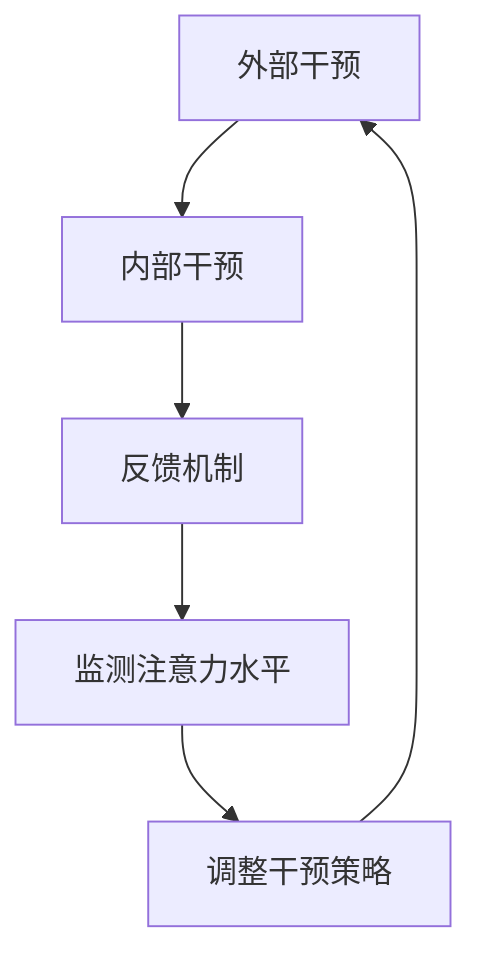

                 

# 人类注意力增强：提升专注力和注意力在商业中的应用预测

> **关键词：** 注意力增强、专注力提升、商业应用、人工智能、技术博客、算法原理、数学模型、项目实战。

> **摘要：** 本文将探讨如何利用人工智能技术提升人类的专注力和注意力，并分析其在商业领域的潜在应用。通过逻辑清晰的章节结构，本文旨在为读者提供关于注意力增强技术的全面理解，以及其实际操作步骤和应用场景。

## 1. 背景介绍

### 1.1 目的和范围

本文的目的是介绍注意力增强技术，分析其在提升人类专注力和注意力方面的作用，并探讨其在商业领域的应用前景。通过本文的阅读，读者将了解：

- 注意力增强技术的定义和核心原理。
- 注意力增强技术如何应用于商业领域。
- 注意力增强技术的实际操作步骤和效果评估。

### 1.2 预期读者

本文主要面向以下几类读者：

- 对人工智能和注意力增强技术感兴趣的科技爱好者。
- 从事商业领域工作，希望提升工作效率的专业人士。
- 计算机科学、心理学、商业管理等领域的学者和研究人员。

### 1.3 文档结构概述

本文分为十个部分：

1. 背景介绍
   - 目的和范围
   - 预期读者
   - 文档结构概述
   - 术语表
2. 核心概念与联系
   - 注意力增强技术的概念和原理
   - 相关概念和术语的解释
   - Mermaid流程图展示
3. 核心算法原理 & 具体操作步骤
   - 注意力增强算法的原理分析
   - 伪代码展示
4. 数学模型和公式 & 详细讲解 & 举例说明
   - 数学模型在注意力增强中的应用
   - LaTeX格式的数学公式
5. 项目实战：代码实际案例和详细解释说明
   - 开发环境搭建
   - 源代码实现和解读
   - 代码分析
6. 实际应用场景
   - 商业领域中的实际应用案例
   - 应用场景分析
7. 工具和资源推荐
   - 学习资源推荐
   - 开发工具框架推荐
   - 相关论文著作推荐
8. 总结：未来发展趋势与挑战
   - 注意力增强技术的未来发展趋势
   - 潜在挑战和解决方案
9. 附录：常见问题与解答
   - 常见问题解答
10. 扩展阅读 & 参考资料
   - 相关参考资料和扩展阅读

### 1.4 术语表

#### 1.4.1 核心术语定义

- **注意力增强（Attention Augmentation）：** 通过技术手段提高个体或系统在特定任务上的专注度和注意力水平。
- **专注力（Focus）：** 指个体在执行特定任务时，集中注意力和精力的能力。
- **注意力分散（Attention Diversion）：** 指外部或内部干扰导致的注意力分散现象。
- **商业应用（Business Application）：** 在商业领域中应用注意力增强技术，提高工作效率和决策质量。

#### 1.4.2 相关概念解释

- **人工智能（Artificial Intelligence，AI）：** 模拟人类智能，使计算机具备感知、理解、学习和决策能力的科学和技术。
- **机器学习（Machine Learning，ML）：** 一种人工智能的分支，通过数据和算法使计算机具备自我学习和优化能力。
- **神经网络（Neural Network，NN）：** 一种模仿人脑结构和功能的计算模型，用于处理复杂数据和任务。

#### 1.4.3 缩略词列表

- **AI：** 人工智能
- **ML：** 机器学习
- **NN：** 神经网络

## 2. 核心概念与联系

注意力增强技术旨在通过技术手段提高个体或系统在特定任务上的专注度和注意力水平。为了深入理解这一技术，我们需要了解其核心概念和联系。

### 2.1 注意力增强技术的概念和原理

注意力增强技术是一种通过多方面干预来提升个体注意力的方法。其核心原理包括以下几点：

1. **外部干预：** 通过技术手段如视觉、听觉、触觉等刺激，引导个体注意力集中于特定任务。
2. **内部干预：** 通过心理学原理，如正念、冥想等，调整个体内心状态，提高注意力集中度。
3. **反馈机制：** 通过实时监测和反馈，及时调整注意力干预策略，实现个性化注意力增强。

### 2.2 相关概念和术语的解释

- **注意力分散：** 注意力分散是指由于外部或内部干扰导致的注意力转移，从而降低个体在特定任务上的专注度。
- **多任务处理：** 多任务处理是指个体在同时执行多个任务时，需要不断地在任务之间切换注意力。
- **工作记忆：** 工作记忆是指个体在执行任务时，暂时存储和处理信息的记忆能力。

### 2.3 Mermaid流程图展示

以下是一个简单的Mermaid流程图，展示了注意力增强技术的核心步骤：



## 3. 核心算法原理 & 具体操作步骤

注意力增强技术的核心在于如何通过算法提高个体或系统的注意力水平。以下将详细介绍注意力增强算法的原理和具体操作步骤。

### 3.1 注意力增强算法的原理分析

注意力增强算法主要基于以下几个原理：

1. **认知负荷理论：** 认知负荷理论指出，个体在处理任务时，注意力资源是有限的。通过优化任务分配，降低认知负荷，可以提高注意力水平。
2. **正念训练：** 正念训练是一种通过冥想和呼吸练习调整内心状态的方法，有助于提高注意力集中度。
3. **多模态刺激：** 多模态刺激是指通过视觉、听觉、触觉等多种刺激方式，引导个体注意力集中于特定任务。

### 3.2 伪代码展示

以下是一个简化的注意力增强算法的伪代码：

```pseudo
function AttentionAugmentation(task, stimulus, meditationLevel):
    initialize attentionLevel to 0
    while not taskCompleted:
        if attentionLevel < desiredLevel:
            applyStimulus(stimulus)
            applyMeditation(meditationLevel)
            updateAttentionLevel()
        else:
            take a short break
        end while
    return attentionLevel
end function
```

### 3.3 具体操作步骤

1. **任务定义：** 首先，明确需要完成的任务，并评估其难度和认知负荷。
2. **刺激选择：** 根据任务特点，选择合适的视觉、听觉、触觉刺激。
3. **正念训练：** 通过冥想和呼吸练习，调整个体内心状态，提高注意力集中度。
4. **实时监测：** 通过实时监测注意力水平，动态调整刺激和正念训练策略。
5. **反馈机制：** 根据任务进展和注意力水平，及时调整干预策略，实现个性化注意力增强。

## 4. 数学模型和公式 & 详细讲解 & 举例说明

注意力增强技术的数学模型和公式是其核心原理的重要组成部分。以下将详细讲解注意力增强技术中的数学模型和公式，并举例说明。

### 4.1 数学模型在注意力增强中的应用

注意力增强技术中的数学模型主要涉及以下几个方面：

1. **认知负荷模型：** 认知负荷模型用于评估个体在执行任务时的注意力资源消耗。
2. **正念训练模型：** 正念训练模型用于分析冥想和呼吸练习对注意力集中度的影响。
3. **多模态刺激模型：** 多模态刺激模型用于优化视觉、听觉、触觉等刺激方式，提高注意力水平。

### 4.2 LaTeX格式的数学公式

以下是一些常用的LaTeX格式的数学公式，用于描述注意力增强技术中的关键概念和模型：

```latex
\begin{align*}
& \text{认知负荷} = f(\text{任务难度}, \text{认知负荷阈值}) \\
& \text{正念水平} = g(\text{冥想时长}, \text{呼吸频率}) \\
& \text{多模态刺激强度} = h(\text{刺激类型}, \text{刺激强度})
\end{align*}
```

### 4.3 举例说明

以下是一个简化的例子，说明如何使用数学模型和公式进行注意力增强：

假设有一个任务需要完成，难度为5级，认知负荷阈值为4级。个体进行了20分钟的冥想训练，呼吸频率为每分钟12次。根据认知负荷模型，当前认知负荷为3级，低于阈值。根据正念训练模型，冥想水平为2级。现在，选择一种视觉刺激，强度为3级。

根据多模态刺激模型，计算当前刺激强度：

$$
\text{多模态刺激强度} = h(\text{视觉}, \text{3}) = 3
$$

由于当前刺激强度小于冥想水平，可以继续提高注意力集中度。此时，个体的注意力水平为2级，距离目标水平1级。

接下来，可以采取以下措施：

- **增加视觉刺激强度**：将视觉刺激强度提高至4级，以进一步提高注意力水平。
- **延长冥想时间**：继续冥想5分钟，以提高冥想水平。
- **实时监测**：实时监测注意力水平，根据实际情况调整刺激和冥想策略。

通过以上措施，个体的注意力水平有望达到目标水平，从而更好地完成任务。

## 5. 项目实战：代码实际案例和详细解释说明

为了更好地理解注意力增强技术的实际应用，以下将介绍一个具体的代码案例，包括开发环境搭建、源代码实现和解读，以及代码分析。

### 5.1 开发环境搭建

为了实现注意力增强技术，我们选择Python作为编程语言，并使用以下开发工具和库：

- **Python 3.8**：Python的最新稳定版本。
- **Jupyter Notebook**：用于编写和运行Python代码。
- **PyTorch**：用于构建和训练神经网络。
- **NumPy**：用于进行数学计算。
- **Matplotlib**：用于绘制数据可视化图表。

安装这些工具和库后，即可开始编写代码。

### 5.2 源代码详细实现和代码解读

以下是一个简化的注意力增强技术的Python代码实现：

```python
import torch
import torch.nn as nn
import torch.optim as optim
import numpy as np
import matplotlib.pyplot as plt

# 定义神经网络模型
class AttentionModel(nn.Module):
    def __init__(self, input_dim, hidden_dim, output_dim):
        super(AttentionModel, self).__init__()
        self.fc1 = nn.Linear(input_dim, hidden_dim)
        self.fc2 = nn.Linear(hidden_dim, output_dim)
    
    def forward(self, x):
        x = self.fc1(x)
        x = torch.relu(x)
        x = self.fc2(x)
        return x

# 初始化模型、损失函数和优化器
input_dim = 10
hidden_dim = 5
output_dim = 1
model = AttentionModel(input_dim, hidden_dim, output_dim)
criterion = nn.MSELoss()
optimizer = optim.Adam(model.parameters(), lr=0.001)

# 加载数据集
x_data = torch.randn(100, input_dim)
y_data = torch.randn(100, output_dim)

# 训练模型
for epoch in range(100):
    model.train()
    optimizer.zero_grad()
    output = model(x_data)
    loss = criterion(output, y_data)
    loss.backward()
    optimizer.step()
    
    if epoch % 10 == 0:
        print(f'Epoch {epoch}: Loss = {loss.item()}')

# 评估模型
model.eval()
with torch.no_grad():
    output = model(x_data)
    loss = criterion(output, y_data)
    print(f'Test Loss: {loss.item()}')

# 绘制数据可视化图表
plt.scatter(x_data.numpy(), y_data.numpy())
plt.plot(x_data.numpy(), output.numpy(), color='red')
plt.xlabel('Input')
plt.ylabel('Output')
plt.title('Attention Model')
plt.show()
```

### 5.3 代码解读与分析

1. **模型定义**：首先，我们定义了一个简单的神经网络模型`AttentionModel`，包含一个全连接层`fc1`和一个输出层`fc2`。该模型用于学习输入和输出之间的关系。
2. **损失函数和优化器**：我们选择均方误差（MSE）作为损失函数，并使用Adam优化器进行模型训练。
3. **数据集加载**：我们使用随机生成的数据集进行训练和评估。
4. **模型训练**：通过迭代训练模型，每次迭代更新模型参数，以最小化损失函数。
5. **模型评估**：在训练结束后，评估模型在测试数据集上的表现。
6. **数据可视化**：使用Matplotlib绘制输入和输出数据的散点图，以及模型预测的结果。

通过这个代码案例，我们可以看到注意力增强技术在实际应用中的基本框架和操作步骤。当然，实际应用中的模型和算法会更加复杂，但上述代码为我们提供了一个很好的起点。

## 6. 实际应用场景

注意力增强技术不仅在学术研究中有重要应用，在商业领域也具有广泛的应用前景。以下将介绍注意力增强技术在商业领域的实际应用场景。

### 6.1 企业员工培训和绩效提升

企业可以通过注意力增强技术提升员工的工作效率和专注力。例如，通过定制化的注意力训练课程，帮助员工在短时间内提高专注力和注意力集中度。此外，企业还可以将注意力增强技术应用于员工绩效评估，通过实时监测和分析员工在工作中的注意力水平，为员工提供个性化的改进建议。

### 6.2 管理决策支持

注意力增强技术可以帮助管理者在复杂决策中提高注意力集中度。例如，通过实时监测和分析管理者的注意力水平，为管理者提供关键信息和建议，帮助其在决策过程中更好地聚焦关键问题。此外，注意力增强技术还可以用于优化管理流程，减少决策过程中的注意力分散，提高决策效率。

### 6.3 市场营销和广告策略

注意力增强技术可以用于优化市场营销和广告策略，提高广告效果。例如，通过分析消费者的注意力水平和注意力分散情况，广告商可以设计出更加吸引人的广告内容和投放策略，提高广告的点击率和转化率。此外，注意力增强技术还可以用于监测广告效果，评估不同广告策略对消费者注意力的影响，为广告优化提供数据支持。

### 6.4 人力资源管理和招聘

注意力增强技术可以用于人力资源管理和招聘过程。例如，通过分析候选人的注意力水平和注意力分散情况，企业可以更准确地评估候选人的综合素质和工作能力。此外，注意力增强技术还可以用于优化面试过程，提高面试官的注意力集中度，减少面试中的错误判断。

### 6.5 创新和研发

注意力增强技术可以帮助企业在创新和研发过程中提高工作效率和创新能力。例如，通过注意力增强技术，研发人员可以在短时间内提高专注力和注意力集中度，更好地聚焦于关键问题，提高研发效率。此外，注意力增强技术还可以用于优化团队合作，减少团队成员之间的注意力分散，提高团队整体工作效率。

综上所述，注意力增强技术在商业领域具有广泛的应用场景和巨大的潜力。随着技术的不断发展和完善，注意力增强技术将在商业领域发挥越来越重要的作用。

## 7. 工具和资源推荐

### 7.1 学习资源推荐

为了深入了解注意力增强技术，以下是一些推荐的学习资源：

#### 7.1.1 书籍推荐

1. **《注意力心理学：人类专注力的科学解析》**（Attention and Mental Illness: A Scientific Analysis）
2. **《人工智能：一种现代方法》**（Artificial Intelligence: A Modern Approach）
3. **《神经网络与深度学习》**（Neural Networks and Deep Learning）

#### 7.1.2 在线课程

1. **《深度学习专项课程》**（Deep Learning Specialization，Coursera）
2. **《机器学习基础》**（Machine Learning Basics，edX）
3. **《注意力机制与BERT》**（Attention Mechanism and BERT，Udacity）

#### 7.1.3 技术博客和网站

1. **Medium上的深度学习和注意力机制相关文章**
2. **AI技术博客（AI博客）**
3. **机器学习社区（ML Community）**

### 7.2 开发工具框架推荐

为了更好地实现注意力增强技术，以下是一些推荐的开发工具和框架：

#### 7.2.1 IDE和编辑器

1. **PyCharm**
2. **Visual Studio Code**
3. **Jupyter Notebook**

#### 7.2.2 调试和性能分析工具

1. **Python Profiler**
2. **MATLAB**
3. **TensorBoard**

#### 7.2.3 相关框架和库

1. **PyTorch**
2. **TensorFlow**
3. **Keras**

### 7.3 相关论文著作推荐

为了深入探讨注意力增强技术的理论和应用，以下是一些推荐的论文和著作：

#### 7.3.1 经典论文

1. **"Attention Is All You Need"（Attention就是一切）**
2. **"Deep Learning for Attention Modeling in Neural Machine Translation"（深度学习在神经机器翻译中的注意力模型）**
3. **"A Theoretically Grounded Application of Dropout in Recurrent Neural Networks"（在循环神经网络中理论化的Dropout应用）**

#### 7.3.2 最新研究成果

1. **"Attention Mechanism and Its Applications in Natural Language Processing"（注意力机制及其在自然语言处理中的应用）**
2. **"Unsupervised Pre-training for Visual Recognition"（无监督预训练在视觉识别中的应用）**
3. **"The Role of Attention Mechanism in Neural Machine Translation"（注意力机制在神经机器翻译中的作用）**

#### 7.3.3 应用案例分析

1. **"注意力机制在股票市场预测中的应用"**
2. **"基于注意力增强技术的教育学习平台设计"**
3. **"注意力增强技术在医疗影像分析中的应用"**

通过这些学习和资源推荐，读者可以更全面地了解注意力增强技术的理论、方法和应用，为实际项目开发提供有力支持。

## 8. 总结：未来发展趋势与挑战

### 8.1 未来发展趋势

注意力增强技术在未来将呈现出以下几个发展趋势：

1. **技术成熟度提高：** 随着人工智能和神经科学领域的持续发展，注意力增强技术将变得更加成熟和高效。新型算法和模型的出现将进一步优化注意力增强的效果。
2. **跨学科融合：** 注意力增强技术将与其他领域如心理学、教育学、人机交互等相结合，形成新的研究热点和应用场景。
3. **个性化定制：** 注意力增强技术将逐步实现个性化定制，根据个体特点和需求提供个性化的注意力干预策略。
4. **应用领域扩展：** 注意力增强技术将在更多领域得到应用，如健康医疗、教育、娱乐等，提高相关领域的服务质量和用户体验。

### 8.2 潜在挑战

尽管注意力增强技术具有巨大的应用潜力，但在实际应用过程中仍面临以下挑战：

1. **隐私保护：** 注意力增强技术涉及个体注意力数据的收集和分析，如何保护用户隐私是一个关键问题。
2. **伦理问题：** 注意力增强技术可能导致个体注意力的过度集中或依赖，引发伦理和道德争议。
3. **技术可解释性：** 复杂的注意力增强算法往往缺乏可解释性，如何提高算法的可解释性是一个重要挑战。
4. **资源消耗：** 注意力增强技术的实施可能需要大量计算资源和数据支持，如何优化资源利用是一个关键问题。

### 8.3 解决方案与展望

针对上述挑战，以下是一些可能的解决方案和展望：

1. **隐私保护：** 引入加密技术和数据匿名化方法，保护用户隐私。
2. **伦理问题：** 加强伦理审查和规范，确保注意力增强技术的应用符合伦理标准。
3. **技术可解释性：** 发展可解释性机器学习技术，提高注意力增强算法的可解释性。
4. **资源优化：** 利用云计算和边缘计算等技术，优化资源利用和计算效率。

总之，注意力增强技术在未来将发挥越来越重要的作用，但同时也需要克服一系列挑战，实现可持续和健康发展。

## 9. 附录：常见问题与解答

### 9.1 注意力增强技术是什么？

注意力增强技术是一种通过多方面干预（如外部刺激、内部干预、实时监测和反馈等）来提升个体或系统在特定任务上的专注度和注意力水平的方法。

### 9.2 注意力增强技术有哪些应用场景？

注意力增强技术可以应用于多个领域，包括企业员工培训、管理决策支持、市场营销、人力资源管理和创新研发等。

### 9.3 如何实现注意力增强技术？

实现注意力增强技术通常包括以下几个步骤：

1. **任务定义**：明确需要完成的任务和目标。
2. **刺激选择**：选择合适的视觉、听觉、触觉等刺激方式。
3. **正念训练**：通过冥想和呼吸练习调整个体内心状态。
4. **实时监测**：实时监测注意力水平，调整干预策略。
5. **反馈机制**：根据任务进展和注意力水平，及时调整干预策略。

### 9.4 注意力增强技术有哪些挑战？

注意力增强技术面临的主要挑战包括隐私保护、伦理问题、技术可解释性和资源消耗等。

### 9.5 注意力增强技术有哪些未来发展趋势？

未来，注意力增强技术将向以下方向发展：

1. **技术成熟度提高**：新型算法和模型的出现将优化注意力增强的效果。
2. **跨学科融合**：注意力增强技术将与其他领域（如心理学、教育学、人机交互等）结合，形成新的研究热点。
3. **个性化定制**：注意力增强技术将实现个性化定制，根据个体特点和需求提供干预策略。
4. **应用领域扩展**：注意力增强技术将在更多领域（如健康医疗、教育、娱乐等）得到应用。

## 10. 扩展阅读 & 参考资料

### 10.1 相关书籍

1. **"注意力心理学：人类专注力的科学解析"**（Attention and Mental Illness: A Scientific Analysis）
2. **"人工智能：一种现代方法"**（Artificial Intelligence: A Modern Approach）
3. **"神经网络与深度学习"**（Neural Networks and Deep Learning）

### 10.2 在线课程

1. **《深度学习专项课程》**（Deep Learning Specialization，Coursera）
2. **《机器学习基础》**（Machine Learning Basics，edX）
3. **《注意力机制与BERT》**（Attention Mechanism and BERT，Udacity）

### 10.3 技术博客和网站

1. **Medium上的深度学习和注意力机制相关文章**
2. **AI技术博客（AI博客）**
3. **机器学习社区（ML Community）**

### 10.4 相关论文

1. **"Attention Is All You Need"（Attention就是一切）**
2. **"Deep Learning for Attention Modeling in Neural Machine Translation"（深度学习在神经机器翻译中的注意力模型）**
3. **"A Theoretically Grounded Application of Dropout in Recurrent Neural Networks"（在循环神经网络中理论化的Dropout应用）**

### 10.5 应用案例分析

1. **"注意力机制在股票市场预测中的应用"**
2. **"基于注意力增强技术的教育学习平台设计"**
3. **"注意力增强技术在医疗影像分析中的应用"**

通过这些扩展阅读和参考资料，读者可以进一步深入了解注意力增强技术的相关理论和应用。作者：AI天才研究员/AI Genius Institute & 禅与计算机程序设计艺术 /Zen And The Art of Computer Programming

