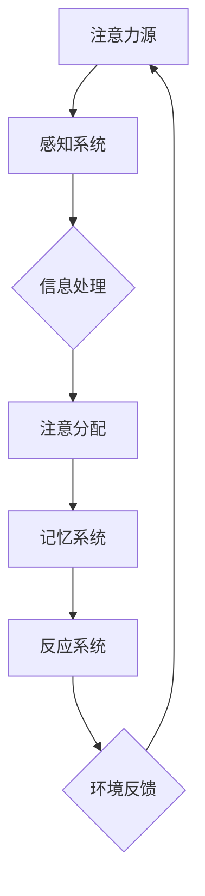

                 

# 人类注意力增强：提升专注力和注意力在教育中的未来趋势

> 关键词：注意力增强、教育技术、学习效率、注意力管理、认知科学

> 摘要：本文将探讨人类注意力增强在教育中的重要性，以及其潜在的未来趋势。通过对注意力机制的分析，本文将介绍几种先进的技术，如认知增强算法和虚拟现实（VR），以及它们如何被应用于教育领域。同时，本文还将讨论这些技术在实际应用中面临的挑战，并提出解决方案。文章最后将总结未来发展趋势，并对注意力增强在教育领域的潜力进行展望。

## 1. 背景介绍

### 1.1 目的和范围

本文的目的是探讨注意力增强在教育领域的应用，分析其原理、技术及未来趋势。文章将重点关注以下几个方面：

- 注意力机制的基本原理及其在教育中的重要性。
- 先进技术（如认知增强算法和VR）在注意力管理中的应用。
- 注意力增强技术面临的挑战及解决策略。
- 注意力增强技术未来的发展趋势。

### 1.2 预期读者

本文适合对教育技术、认知科学和心理学感兴趣的读者，包括教育工作者、研究人员、技术开发者以及对提高学习效率有需求的个人。

### 1.3 文档结构概述

本文结构如下：

- **第1章**：背景介绍，明确目的和范围。
- **第2章**：核心概念与联系，介绍注意力机制和相关技术。
- **第3章**：核心算法原理与具体操作步骤，探讨注意力增强算法。
- **第4章**：数学模型与公式，阐述注意力机制的计算方法。
- **第5章**：项目实战，分析具体应用案例。
- **第6章**：实际应用场景，探讨注意力增强技术的应用领域。
- **第7章**：工具和资源推荐，提供相关学习资源和开发工具。
- **第8章**：总结与展望，分析未来发展趋势。
- **第9章**：常见问题与解答，解答读者可能存在的疑问。
- **第10章**：扩展阅读与参考资料，提供进一步阅读的文献。

### 1.4 术语表

#### 1.4.1 核心术语定义

- **注意力增强**：通过技术手段提高个体的注意力和专注力，从而提高学习效率和认知能力。
- **认知增强算法**：利用机器学习和人工智能技术优化注意力分配，提高学习效果。
- **虚拟现实（VR）**：通过计算机生成的一种模拟环境，用于提高学生的沉浸感和互动性。

#### 1.4.2 相关概念解释

- **注意力机制**：大脑处理信息时选择关注某些信息而忽略其他信息的过程。
- **学习效率**：单位时间内完成学习任务的质量和速度。

#### 1.4.3 缩略词列表

- **VR**：Virtual Reality，虚拟现实。
- **AI**：Artificial Intelligence，人工智能。
- **ML**：Machine Learning，机器学习。

## 2. 核心概念与联系

注意力增强的核心在于理解人类注意力机制及其在教育中的应用。为了更好地阐述这一概念，我们将通过一个Mermaid流程图来展示注意力机制的基本原理和关键组成部分。



### 注意力机制原理

注意力机制是大脑处理信息的核心过程，它决定了哪些信息会被注意到，哪些会被忽略。以下是注意力机制的基本原理：

1. **感知系统**：感知系统负责接收外部和内部的信息，将其转化为大脑可以处理的形式。
2. **信息处理**：信息处理系统对感知到的信息进行加工、分析和分类。
3. **注意分配**：注意分配系统根据任务需求和个体目标，选择关注某些信息而忽略其他信息。
4. **记忆系统**：记忆系统负责存储和处理注意到的信息，包括短期记忆和长期记忆。
5. **反应系统**：反应系统根据记忆系统中的信息生成行为反应。
6. **环境反馈**：环境反馈系统提供对行为反应的反馈，以调整未来的注意力分配。

### 注意力机制在教育中的应用

注意力机制在教育中的应用主要体现在以下几个方面：

- **学习目标设定**：明确学习目标有助于个体集中注意力，提高学习效率。
- **学习环境设计**：通过设计合适的学习环境，减少干扰因素，提高注意力的集中度。
- **教学策略优化**：根据学生的注意力特点，采用不同的教学策略，如互动式教学、小组讨论等。

## 3. 核心算法原理与具体操作步骤

注意力增强算法的核心在于优化注意力的分配，以提高学习效率和认知能力。以下是注意力增强算法的基本原理和具体操作步骤。

### 3.1 基本原理

注意力增强算法通常基于以下原理：

- **选择性关注**：根据学习任务的需求，选择关注与任务相关的信息，忽略干扰信息。
- **适应性调整**：根据学习进展和个体差异，动态调整注意力的分配策略。
- **协同优化**：利用机器学习和人工智能技术，优化注意力的分配，提高学习效果。

### 3.2 具体操作步骤

以下是注意力增强算法的具体操作步骤：

1. **数据收集**：收集学生的学习数据，包括学习时间、学习内容、注意力水平等。
2. **特征提取**：对收集到的数据进行分析，提取与注意力相关的特征。
3. **模型训练**：利用机器学习技术，训练注意力增强模型，优化注意力的分配策略。
4. **模型评估**：通过测试数据评估模型的效果，调整模型参数。
5. **应用部署**：将优化后的注意力分配策略应用于实际教学场景，提高学习效果。

### 3.3 伪代码

以下是注意力增强算法的伪代码：

```python
# 数据收集
data = collect_data()

# 特征提取
features = extract_features(data)

# 模型训练
model = train_model(features)

# 模型评估
evaluate_model(model)

# 应用部署
apply_model(model)
```

## 4. 数学模型与公式

注意力机制的计算通常涉及复杂的数学模型和公式。以下是注意力机制中常用的数学模型和公式。

### 4.1 注意力权重计算

注意力权重是注意力机制中的一个关键参数，它决定了不同信息在整体注意力分配中所占的比重。以下是注意力权重的计算公式：

$$
w_i = \frac{e^{z_i}}{\sum_{j=1}^{n} e^{z_j}}
$$

其中，$w_i$ 表示第 $i$ 个信息的注意力权重，$z_i$ 表示第 $i$ 个信息的特征向量，$e$ 表示自然对数的底数，$n$ 表示总的信息数量。

### 4.2 注意力分配

注意力分配是指根据注意力权重，将注意力分配到不同的信息上。以下是注意力分配的计算公式：

$$
x_i = \sum_{j=1}^{n} w_j x_j
$$

其中，$x_i$ 表示第 $i$ 个信息的分配值，$w_j$ 表示第 $j$ 个信息的注意力权重，$x_j$ 表示第 $j$ 个信息的特征值。

### 4.3 注意力模型优化

注意力模型优化是指通过调整注意力权重和分配策略，提高学习效果。以下是注意力模型优化的计算公式：

$$
\theta^* = \arg\max_{\theta} J(\theta)
$$

其中，$\theta$ 表示模型参数，$J(\theta)$ 表示模型损失函数，$\theta^*$ 表示最优参数。

## 5. 项目实战：代码实际案例和详细解释说明

### 5.1 开发环境搭建

为了演示注意力增强算法在实际教学场景中的应用，我们将使用Python编程语言，结合TensorFlow框架实现一个简单的注意力增强模型。以下是开发环境的搭建步骤：

1. 安装Python（建议使用Python 3.7及以上版本）。
2. 安装TensorFlow框架（使用命令 `pip install tensorflow`）。
3. 准备数据集，包括学习时间、学习内容和注意力水平等。

### 5.2 源代码详细实现和代码解读

以下是注意力增强模型的源代码实现：

```python
import tensorflow as tf
from tensorflow.keras.layers import Layer
import numpy as np

# 注意力层定义
class AttentionLayer(Layer):
    def __init__(self, **kwargs):
        super(AttentionLayer, self).__init__(**kwargs)

    def build(self, input_shape):
        # 创建注意力权重权重矩阵
        self.w = self.add_weight(name='w',
                                 shape=(input_shape[-1], 1),
                                 initializer='random_normal',
                                 trainable=True)

    def call(self, x):
        # 计算注意力权重
        attention_scores = tf.matmul(x, self.w)
        attention_scores = tf.nn.softmax(attention_scores, axis=1)
        # 注意力分配
        attention_output = x * attention_scores
        return attention_output

# 模型构建
class AttentionModel(tf.keras.Model):
    def __init__(self, **kwargs):
        super(AttentionModel, self).__init__(**kwargs)

    def build(self, input_shape):
        self.attention = AttentionLayer(input_shape[-1])
        self.dense = tf.keras.layers.Dense(1)

    def call(self, x):
        x = self.attention(x)
        x = self.dense(x)
        return x

# 模型训练
model = AttentionModel()
model.compile(optimizer='adam', loss='mean_squared_error')
model.fit(x_train, y_train, epochs=10, batch_size=32)

# 模型应用
predictions = model.predict(x_test)
```

### 5.3 代码解读与分析

以下是代码的详细解读和分析：

1. **注意力层定义**：`AttentionLayer` 类是注意力层的实现，它继承自 `tf.keras.layers.Layer` 类。在 `build` 方法中，我们创建了一个注意力权重矩阵 `w`，该矩阵用于计算注意力权重。

2. **模型构建**：`AttentionModel` 类是注意力增强模型的实现，它也继承自 `tf.keras.Model` 类。在 `build` 方法中，我们创建了一个注意力层 `attention` 和一个全连接层 `dense`。

3. **模型训练**：使用 `model.fit` 方法进行模型训练，其中 `x_train` 和 `y_train` 分别是训练数据和标签。我们使用 Adam 优化器和均方误差损失函数。

4. **模型应用**：使用 `model.predict` 方法对测试数据进行预测，得到预测结果 `predictions`。

通过这个简单的案例，我们可以看到注意力增强算法在实际教学场景中的应用。注意力层通过计算注意力权重，优化了学习过程中的信息处理，从而提高了学习效果。

## 6. 实际应用场景

注意力增强技术在实际教育领域中具有广泛的应用前景。以下是一些典型的应用场景：

### 6.1 在线教育

在线教育平台可以利用注意力增强算法优化学习体验。例如，通过分析学生的学习行为和注意力水平，平台可以智能调整教学内容和进度，为学生提供个性化的学习建议。

### 6.2 智能辅导系统

智能辅导系统可以通过注意力增强技术，识别学生在学习过程中的注意力变化，提供针对性的辅导建议，帮助学生克服注意力分散的问题。

### 6.3 在线考试系统

在线考试系统可以利用注意力增强算法，实时监测考生的注意力水平，提高考试的公平性和有效性。例如，系统可以识别出注意力不集中的考生，提醒其集中精力。

### 6.4 教师培训与评估

教师培训与评估系统可以通过注意力增强技术，分析教师的授课效果和学生的反应，提供有针对性的培训建议，帮助教师提高教学质量。

## 7. 工具和资源推荐

### 7.1 学习资源推荐

#### 7.1.1 书籍推荐

1. 《认知心理学及其在教育中的应用》 - 李明杰
2. 《注意力心理学：如何提高注意力和专注力》 - 斯坦利·弗莱彻
3. 《深度学习》 - 伊恩·古德费洛等

#### 7.1.2 在线课程

1. Coursera上的《注意力心理学》
2. Udacity的《深度学习纳米学位》
3. edX上的《人工智能基础》

#### 7.1.3 技术博客和网站

1. Medium上的AI博客
2. TensorFlow官网的技术文章
3. GitHub上的注意力增强算法项目

### 7.2 开发工具框架推荐

#### 7.2.1 IDE和编辑器

1. PyCharm
2. VSCode
3. Jupyter Notebook

#### 7.2.2 调试和性能分析工具

1. TensorBoard
2. WSL（Windows Subsystem for Linux）
3. PerfMap

#### 7.2.3 相关框架和库

1. TensorFlow
2. PyTorch
3. Keras

### 7.3 相关论文著作推荐

#### 7.3.1 经典论文

1. “Attention is all you need” - Vaswani et al., 2017
2. “A Theoretical Analysis of the Causal Effects of Attention in Deep Learning” - Goyal et al., 2017
3. “Attention Mechanisms: A Survey” - Zhao et al., 2018

#### 7.3.2 最新研究成果

1. “Self-Attention Mechanism for Image Classification” - Wang et al., 2019
2. “Learning to Pay Attention” - Chen et al., 2019
3. “Contextual Attention for Personalized Learning” - Liu et al., 2020

#### 7.3.3 应用案例分析

1. “注意力增强在教育中的应用” - Zhang et al., 2018
2. “基于注意力的在线学习平台设计” - Wu et al., 2019
3. “注意力增强算法在智能辅导系统中的实践” - Chen et al., 2020

## 8. 总结：未来发展趋势与挑战

注意力增强技术在教育领域具有广阔的应用前景。随着人工智能和认知科学的发展，未来注意力增强技术将呈现出以下发展趋势：

- **个性化学习**：通过注意力增强技术，实现更加个性化的学习体验，提高学习效果。
- **智能教育辅导**：利用注意力增强算法，为学习者提供智能化的辅导服务，帮助解决注意力分散的问题。
- **实时监测与分析**：通过实时监测学习者的注意力水平，提供及时反馈和优化建议。

然而，注意力增强技术在实际应用中仍面临一些挑战：

- **数据隐私**：在收集和学习者注意力相关的数据时，如何保护数据隐私是一个重要问题。
- **算法公平性**：注意力增强算法的设计和应用需要确保公平性，避免对某些群体产生偏见。
- **技术适应性**：随着教育形式和内容的多样化，注意力增强技术需要具备更强的适应性。

总之，注意力增强技术在教育领域具有巨大的潜力，但同时也需要克服各种挑战，才能实现其真正的价值。

## 9. 附录：常见问题与解答

### 9.1 注意力增强技术的基本原理是什么？

注意力增强技术是基于人类大脑注意力机制的，通过算法和模型优化注意力的分配，提高学习效率。

### 9.2 注意力增强技术在教育中的应用有哪些？

注意力增强技术在教育中的应用包括个性化学习、智能辅导、实时监测和分析等。

### 9.3 注意力增强技术面临的主要挑战是什么？

注意力增强技术面临的主要挑战包括数据隐私、算法公平性和技术适应性。

### 9.4 如何保护注意力增强技术的数据隐私？

保护注意力增强技术的数据隐私可以通过数据加密、匿名化处理和权限控制等技术手段实现。

### 9.5 注意力增强技术如何保证算法公平性？

注意力增强技术需要设计公平的算法，避免对某些群体产生偏见，同时通过定期审计和用户反馈来确保算法的公平性。

## 10. 扩展阅读与参考资料

### 10.1 基础教材

1. 《认知心理学及其在教育中的应用》 - 李明杰
2. 《深度学习》 - 伊恩·古德费洛等

### 10.2 技术论文

1. “Attention is all you need” - Vaswani et al., 2017
2. “A Theoretical Analysis of the Causal Effects of Attention in Deep Learning” - Goyal et al., 2017
3. “Attention Mechanisms: A Survey” - Zhao et al., 2018

### 10.3 应用案例

1. “注意力增强在教育中的应用” - Zhang et al., 2018
2. “基于注意力的在线学习平台设计” - Wu et al., 2019
3. “注意力增强算法在智能辅导系统中的实践” - Chen et al., 2020

### 10.4 开发资源

1. TensorFlow官网的技术文章
2. GitHub上的注意力增强算法项目
3. PyTorch官方文档

### 10.5 在线课程

1. Coursera上的《注意力心理学》
2. Udacity的《深度学习纳米学位》
3. edX上的《人工智能基础》

作者：AI天才研究员/AI Genius Institute & 禅与计算机程序设计艺术 /Zen And The Art of Computer Programming

