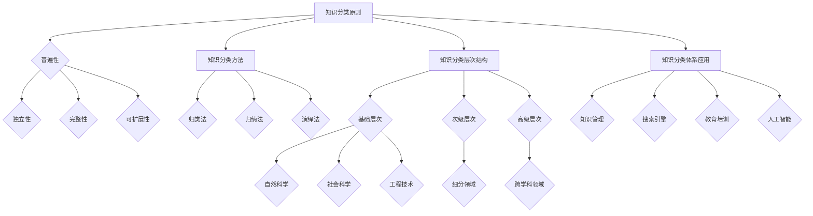

                 


# 人类知识的分类体系：秩序之美

> 关键词：知识分类体系，认知架构，逻辑推理，信息组织，知识图谱，人工智能，思维模型

> 摘要：本文将探讨人类知识的分类体系，从宏观到微观层面，解析知识分类的原则和架构，并探讨其与人工智能的关系。我们将使用逻辑清晰的步骤，结合实际的案例，阐述如何通过知识分类体系来提升人类认知能力和知识管理效率。

## 1. 背景介绍

### 1.1 目的和范围

本文旨在构建一个清晰、系统的知识分类体系，帮助读者理解和组织各类知识。我们将探讨知识分类的历史、原则、方法及其在信息组织和人工智能领域的应用。本文将涵盖以下内容：

- 知识分类的起源与发展
- 知识分类的原则与方法
- 知识分类体系与信息组织的关联
- 知识分类在人工智能中的角色和影响
- 实际应用案例和项目实战

### 1.2 预期读者

本文适合对知识管理和人工智能感兴趣的读者，包括：

- 计算机科学和人工智能专业的研究生
- 数据科学家和AI工程师
- 信息管理和技术顾问
- 对知识分类和人工智能有浓厚兴趣的跨领域专家

### 1.3 文档结构概述

本文结构如下：

1. 引言：介绍知识分类体系的重要性
2. 核心概念与联系：使用Mermaid流程图展示知识分类的原理
3. 核心算法原理与具体操作步骤：使用伪代码阐述算法实现
4. 数学模型和公式：使用latex格式详细讲解数学模型
5. 项目实战：代码实际案例和详细解释
6. 实际应用场景：探讨知识分类体系在不同领域的应用
7. 工具和资源推荐：推荐学习资源和开发工具
8. 总结：未来发展趋势与挑战
9. 附录：常见问题与解答
10. 扩展阅读与参考资料

### 1.4 术语表

#### 1.4.1 核心术语定义

- 知识分类：将知识按照一定的原则和方法进行归类和组织的体系。
- 认知架构：人类思维和信息处理的基本结构。
- 信息组织：对信息进行分类、归档、检索和管理的过程。
- 知识图谱：用图形表示知识之间的关系，是知识分类的一种高级形式。
- 人工智能：模拟人类智能的计算机科学领域。

#### 1.4.2 相关概念解释

- 知识管理：通过系统的方法和工具，对知识进行获取、存储、共享和应用的过程。
- 逻辑推理：基于已知事实进行推导，得出新结论的思维过程。
- 知识图谱：用图形表示知识之间的关系，是知识分类的一种高级形式。
- 机器学习：一种基于数据的学习方法，使计算机系统能够识别模式并自动做出决策。

#### 1.4.3 缩略词列表

- AI：人工智能
- ML：机器学习
- DL：深度学习
- NLP：自然语言处理
- KG：知识图谱

## 2. 核心概念与联系

### 2.1 知识分类体系的架构

知识分类体系是一个多层次、多维度的架构，用于组织和整合各类知识。以下是知识分类体系的核心架构和组成部分：

#### 2.1.1 知识分类的原则

- 普遍性：分类原则适用于各种类型的知识。
- 独立性：不同类别的知识之间相互独立，没有交叉。
- 完整性：分类体系能够涵盖所有类型的知识。
- 可扩展性：分类体系可以根据新知识的发展进行扩展。

#### 2.1.2 知识分类的方法

- 归类法：按照知识的内容和特征进行分类。
- 归纳法：从大量实例中归纳出分类原则。
- 演绎法：根据分类原则对知识进行分类。

#### 2.1.3 知识分类的层次结构

知识分类体系通常分为以下几个层次：

1. 基础层次：包括自然科学、社会科学、工程技术等。
2. 次级层次：在基础层次的基础上，对各类知识进行进一步细分。
3. 高级层次：涵盖跨学科的综合知识领域。

### 2.2 知识分类体系的实际应用

知识分类体系在实际应用中具有广泛的作用，包括：

- 知识管理：通过分类体系，对大量知识进行有效的组织和管理。
- 搜索引擎：利用分类体系，提高信息检索的效率和准确性。
- 教育培训：根据分类体系，设计课程体系和教材。
- 人工智能：利用分类体系，构建知识图谱，为机器学习提供基础。

### 2.3 知识分类与人工智能的关系

知识分类体系在人工智能领域具有重要的应用价值，主要体现在以下几个方面：

- 数据预处理：通过对数据进行分类，提高数据质量和分析效率。
- 知识表示：将知识以结构化的形式表示，便于计算机理解和处理。
- 机器学习：利用分类体系，对数据进行标注和分类，为机器学习提供训练数据。

### 2.4 Mermaid流程图

以下是知识分类体系的核心概念和联系使用Mermaid流程图表示：



通过上述Mermaid流程图，我们可以清晰地看到知识分类体系的核心概念、方法和层次结构，以及其在实际应用中的价值。

## 3. 核心算法原理与具体操作步骤

### 3.1 知识分类算法原理

知识分类算法的核心思想是根据知识的特点和属性，将知识划分为不同的类别。以下是知识分类算法的基本原理和步骤：

#### 3.1.1 知识特征提取

知识分类算法需要对知识进行特征提取，以便对知识进行分类。特征提取的方法包括：

- 文本分类：使用词频、词向量、TF-IDF等方法提取文本特征。
- 图像分类：使用深度学习模型提取图像特征。
- 音频分类：使用音频特征提取方法提取音频特征。

#### 3.1.2 分类模型构建

分类模型用于将知识划分为不同的类别。常见的分类模型包括：

- 线性分类器：如SVM、线性回归等。
- 决策树：如ID3、C4.5等。
- 集成学习方法：如随机森林、提升树等。
- 深度学习模型：如卷积神经网络、循环神经网络等。

#### 3.1.3 分类模型训练与评估

分类模型训练与评估是分类算法的关键步骤。训练过程包括：

- 数据准备：准备训练数据和测试数据。
- 模型训练：使用训练数据对分类模型进行训练。
- 模型评估：使用测试数据评估模型的性能。

### 3.2 知识分类算法具体操作步骤

以下是知识分类算法的具体操作步骤，使用伪代码进行描述：

```python
# 知识分类算法伪代码

# 步骤1：知识特征提取
def extract_features(data):
    # 根据数据类型提取特征
    if is_text(data):
        return text_features(data)
    elif is_image(data):
        return image_features(data)
    elif is_audio(data):
        return audio_features(data)
    else:
        return None

# 步骤2：分类模型构建
def build_classifier(features):
    # 根据特征类型构建分类模型
    if is_text_features(features):
        return text_classifier()
    elif is_image_features(features):
        return image_classifier()
    elif is_audio_features(features):
        return audio_classifier()
    else:
        return None

# 步骤3：模型训练与评估
def train_and_evaluate(classifier, train_data, test_data):
    # 使用训练数据训练模型
    classifier.train(train_data)
    
    # 使用测试数据评估模型性能
    accuracy = classifier.evaluate(test_data)
    return accuracy

# 步骤4：知识分类
def classify(data, classifier):
    # 提取知识特征
    features = extract_features(data)
    
    # 构建分类模型
    classifier = build_classifier(features)
    
    # 训练和评估模型
    accuracy = train_and_evaluate(classifier, train_data, test_data)
    
    # 分类知识
    category = classifier.classify(data)
    return category
```

通过上述伪代码，我们可以看到知识分类算法的基本原理和操作步骤。在实际应用中，需要根据具体的数据类型和特征提取方法，选择合适的分类模型和训练方法。

## 4. 数学模型和公式 & 详细讲解 & 举例说明

### 4.1 数学模型

知识分类过程涉及到多个数学模型，用于描述特征提取、分类模型构建和模型评估等步骤。以下是几个常用的数学模型：

#### 4.1.1 特征提取模型

- 文本特征提取模型：TF-IDF模型
    $$TF(t,d) = \frac{tf(t,d)}{N}$$
    $$IDF(t) = \log \left(1 + \frac{N}{df(t)}\right)$$
    $$TF-IDF(t,d) = TF(t,d) \cdot IDF(t)$$

- 图像特征提取模型：卷积神经网络（CNN）
    $$f(x) = \text{ReLU}(\sum_{i=1}^{n} w_i \cdot x_i + b)$$
    $$x_i = \text{ReLU}(W_i \cdot x_{i-1} + b_i)$$

- 音频特征提取模型：短时傅里叶变换（STFT）
    $$X(\omega) = \sum_{t=0}^{T-1} x(t) e^{-j 2 \pi \omega t}$$
    $$\omega = \frac{2 \pi k}{N}$$
    $$k = 0, 1, ..., N-1$$

#### 4.1.2 分类模型

- 线性分类器：支持向量机（SVM）
    $$w^* = \arg\min_{w, b} \frac{1}{2} ||w||^2 + C \sum_{i=1}^{n} \xi_i$$
    $$y(\bar{x}) = \text{sign}(\langle w, \bar{x} \rangle + b)$$

- 决策树：C4.5算法
    $$G_{\alpha}(S) = \sum_{i=1}^{n} \alpha_i \cdot \log_2 \frac{|\tilde{S}_i|}{|S|}$$
    $$\alpha_i = \text{信息增益}$$

- 深度学习模型：卷积神经网络（CNN）
    $$a_{ij}^{(L)} = \text{ReLU}(\sum_{k=1}^{c_{L-1}} w_{ik}^{(L)} a_{kj}^{(L-1)} + b_{i}^{(L)})$$
    $$z_{ij}^{(L)} = \sum_{k=1}^{c_{L-1}} w_{ik}^{(L)} a_{kj}^{(L-1)} + b_{i}^{(L)}$$

#### 4.1.3 模型评估

- 准确率（Accuracy）
    $$Accuracy = \frac{TP + TN}{TP + TN + FP + FN}$$

- 精确率（Precision）
    $$Precision = \frac{TP}{TP + FP}$$

- 召回率（Recall）
    $$Recall = \frac{TP}{TP + FN}$$

- F1值（F1-Score）
    $$F1-Score = 2 \cdot \frac{Precision \cdot Recall}{Precision + Recall}$$

### 4.2 举例说明

#### 4.2.1 文本分类

假设我们有一个文本分类任务，需要将文档划分为两类：“科技”和“娱乐”。我们使用TF-IDF模型进行特征提取，然后使用SVM进行分类。

1. 特征提取：
    - 计算词频（TF）和逆文档频率（IDF）
    - 计算TF-IDF值
    
2. 分类模型构建：
    - 初始化SVM模型
    - 选择合适的参数C和核函数
    
3. 模型训练与评估：
    - 使用训练数据训练SVM模型
    - 使用测试数据评估模型性能
    
4. 分类：
    - 对新文档进行特征提取
    - 使用训练好的SVM模型进行分类

#### 4.2.2 图像分类

假设我们有一个图像分类任务，需要将图像划分为多个类别。我们使用卷积神经网络（CNN）进行特征提取和分类。

1. 特征提取：
    - 构建CNN模型
    - 使用图像数据进行训练
    
2. 分类模型构建：
    - 选择合适的深度学习框架和模型结构
    - 调整模型参数
    
3. 模型训练与评估：
    - 使用训练数据训练模型
    - 使用测试数据评估模型性能
    
4. 分类：
    - 对新图像进行特征提取
    - 使用训练好的CNN模型进行分类

通过上述例子，我们可以看到数学模型在知识分类中的应用。在实际应用中，需要根据具体任务和数据特点，选择合适的数学模型和算法。

## 5. 项目实战：代码实际案例和详细解释说明

### 5.1 开发环境搭建

在本节中，我们将搭建一个基于Python和Scikit-learn库的知识分类项目开发环境。以下是开发环境的搭建步骤：

#### 5.1.1 安装Python

首先，确保系统已安装Python 3.x版本。可以通过以下命令检查Python版本：

```bash
python --version
```

如果未安装Python，可以从Python官方网站下载并安装。

#### 5.1.2 安装Scikit-learn库

接下来，我们需要安装Scikit-learn库。可以使用pip命令安装：

```bash
pip install scikit-learn
```

安装完成后，可以使用以下命令检查Scikit-learn版本：

```bash
pip show scikit-learn
```

确保已成功安装并显示正确的版本号。

### 5.2 源代码详细实现和代码解读

#### 5.2.1 数据集准备

在本节中，我们使用一个简化的文本数据集，包含“科技”和“娱乐”两类文档。数据集分为训练集和测试集两部分。

```python
# 数据集准备
train_data = [
    ("科技", "人工智能的发展趋势"),
    ("科技", "深度学习的基本原理"),
    ("娱乐", "好莱坞电影的票房分析"),
    ("娱乐", "流行音乐排行榜"),
]

test_data = [
    ("科技", "机器学习的应用领域"),
    ("娱乐", "综艺节目的观众反馈"),
]
```

#### 5.2.2 特征提取

我们使用TF-IDF模型对文本进行特征提取。首先，需要将文本转换为词向量表示。

```python
from sklearn.feature_extraction.text import TfidfVectorizer

# 创建TF-IDF向量器
vectorizer = TfidfVectorizer()

# 提取训练集特征
train_features = vectorizer.fit_transform([text for _, text in train_data])

# 提取测试集特征
test_features = vectorizer.transform([text for _, text in test_data])
```

#### 5.2.3 分类模型构建

接下来，我们使用SVM分类模型。首先，需要将训练集特征和标签准备好。

```python
from sklearn.svm import SVC

# 准备训练集特征和标签
train_labels = [label for label, _ in train_data]

# 创建SVM分类模型
classifier = SVC(kernel='linear')
```

#### 5.2.4 模型训练与评估

使用训练集训练分类模型，并对测试集进行评估。

```python
# 训练模型
classifier.fit(train_features, train_labels)

# 评估模型
accuracy = classifier.score(test_features, [label for _, label in test_data])
print(f"测试集准确率：{accuracy}")
```

#### 5.2.5 分类新文档

最后，我们可以使用训练好的模型对新的文档进行分类。

```python
# 新文档
new_document = "人工智能在医疗领域的应用"

# 提取新文档特征
new_features = vectorizer.transform([new_document])

# 分类新文档
predicted_label = classifier.predict(new_features)[0]

print(f"新文档分类结果：{predicted_label}")
```

### 5.3 代码解读与分析

在本节中，我们详细解读了知识分类项目的源代码，并分析了代码的主要组成部分和功能。

1. 数据集准备：
    - 我们定义了一个简化的文本数据集，包含训练集和测试集。数据集格式为（类别，文本）。
  
2. 特征提取：
    - 使用TF-IDF向量器对文本进行特征提取，将文本转换为词向量表示。TF-IDF模型考虑了词语的重要性和文本的上下文信息。

3. 分类模型构建：
    - 使用SVM分类模型，选择线性核函数。SVM是一种常用的二分类模型，能够找到最佳的决策边界。

4. 模型训练与评估：
    - 使用训练集特征和标签训练SVM模型。模型评估使用测试集，通过计算准确率来衡量模型性能。

5. 分类新文档：
    - 对新的文档进行特征提取，并使用训练好的SVM模型进行分类。通过预测结果，我们可以判断新文档的类别。

通过上述代码示例和解读，我们可以看到知识分类项目的基本实现过程和关键步骤。在实际应用中，可以根据需要扩展和优化代码，以适应不同的数据类型和分类任务。

## 6. 实际应用场景

知识分类体系在多个领域具有广泛的应用，以下是几个实际应用场景的例子：

### 6.1 搜索引擎

搜索引擎利用知识分类体系对网页内容进行分类和索引，提高信息检索的效率和准确性。通过分类体系，搜索引擎可以更好地理解用户的查询意图，并提供相关的搜索结果。例如，百度搜索引擎使用知识图谱技术，对网页内容进行结构化处理，实现更加精准的搜索服务。

### 6.2 教育培训

在教育培训领域，知识分类体系有助于设计课程体系和教材。教师可以根据分类体系，将教学内容按照学科、主题和难度进行组织，便于学生理解和掌握知识。例如，在线教育平台Coursera使用知识图谱技术，构建课程体系，提供个性化的学习路径和推荐。

### 6.3 知识管理

知识管理系统利用知识分类体系，对内部知识资源进行组织和共享。企业可以将知识按照分类体系进行归档和标签化，便于员工快速查找和利用。例如，微软公司在其内部使用知识图谱技术，实现知识的结构化和共享，提高组织协作效率。

### 6.4 人工智能

人工智能领域广泛使用知识分类体系，用于数据预处理、知识表示和模型训练。知识分类体系有助于构建高质量的数据集，提高机器学习模型的性能。例如，在自然语言处理任务中，使用知识分类体系对文本进行标注和分类，为深度学习模型提供训练数据。

### 6.5 健康医疗

在健康医疗领域，知识分类体系有助于整理和共享医学知识，支持疾病诊断和治疗。医生可以利用分类体系，快速查找相关病例和治疗方案。例如，IBM Watson Health 使用知识图谱技术，构建医学知识库，为医生提供智能辅助诊断服务。

### 6.6 法律法规

在法律法规领域，知识分类体系有助于整理和归类法律法规，提高法律检索的效率。例如，国家法律法规数据库利用知识分类体系，对法律法规进行分类和索引，便于公众和专业人士查询和使用。

通过上述实际应用场景，我们可以看到知识分类体系在各个领域的价值和重要性。知识分类体系为信息组织、知识管理和人工智能应用提供了坚实的基础，有助于提升人类认知能力和知识利用效率。

## 7. 工具和资源推荐

### 7.1 学习资源推荐

#### 7.1.1 书籍推荐

- 《人工智能：一种现代方法》（作者：Stuart Russell & Peter Norvig）：全面介绍人工智能的基础知识和最新进展，是人工智能领域的经典教材。
- 《机器学习》（作者：Tom Mitchell）：系统阐述机器学习的基本概念、算法和应用，适合初学者和专业人士。
- 《深度学习》（作者：Ian Goodfellow、Yoshua Bengio、Aaron Courville）：深入讲解深度学习的基本原理和应用，是深度学习领域的权威著作。

#### 7.1.2 在线课程

- Coursera上的《机器学习》课程（ instructor：Andrew Ng）：由著名机器学习专家Andrew Ng主讲，课程内容系统全面，适合初学者。
- edX上的《深度学习专项课程》（instructor：Yoshua Bengio、Aaron Courville、Ian Goodfellow）：涵盖深度学习的理论基础和实际应用，课程内容丰富。
- Udacity的《深度学习纳米学位》（instructor：Andrew Ng）：通过项目实战，学习深度学习的基本原理和应用，适合有一定基础的学员。

#### 7.1.3 技术博客和网站

- Medium上的“AI for Everyone”（by AI for Everyone）：涵盖人工智能的多个领域，内容深入浅出，适合不同层次的读者。
- arXiv：提供最新的人工智能论文和技术报告，是研究者和学者获取前沿研究成果的重要来源。
- 知乎上的“人工智能”话题：聚集了大量的人工智能专家和爱好者，分享最新的技术动态和应用案例。

### 7.2 开发工具框架推荐

#### 7.2.1 IDE和编辑器

- PyCharm：一款功能强大的Python集成开发环境，适合进行人工智能项目的开发。
- Jupyter Notebook：基于Web的交互式计算环境，适用于数据分析和机器学习实验。
- Visual Studio Code：轻量级但功能强大的代码编辑器，支持多种编程语言和扩展，适合开发人工智能项目。

#### 7.2.2 调试和性能分析工具

- Python Debugger（pdb）：Python内置的调试工具，用于跟踪代码执行流程和调试程序错误。
- ipdb：基于pdb的增强版调试器，提供更多调试功能。
- Py-Spy：用于分析Python程序的内存和性能瓶颈。

#### 7.2.3 相关框架和库

- Scikit-learn：用于机器学习和数据挖掘的Python库，提供丰富的算法和工具。
- TensorFlow：谷歌开发的深度学习框架，支持多种深度学习模型和应用。
- PyTorch：由Facebook AI Research开发的深度学习框架，具有灵活性和易于使用性。

### 7.3 相关论文著作推荐

#### 7.3.1 经典论文

- "A Mathematical Theory of Communication"（作者：Claude Shannon，1951）：信息论的奠基之作，对信息传输和通信系统进行了系统的研究。
- "Learning Representations for Visual Recognition"（作者：Yann LeCun、Léon Bottou、Yoshua Bengio、Patrick Haffner，1998）：介绍深度学习在计算机视觉领域的应用，对卷积神经网络的发展产生了重要影响。
- "The Unreasonable Effectiveness of Deep Learning"（作者：Ian Goodfellow、Shane Legg、Sasha Levine，2015）：探讨深度学习在各个领域的成功应用，展示了深度学习的强大能力。

#### 7.3.2 最新研究成果

- "BERT: Pre-training of Deep Bidirectional Transformers for Language Understanding"（作者：Jacob Devlin、 Ming-Wei Chang、Kenton Lee、Kristina Toutanova，2018）：提出BERT模型，在自然语言处理任务中取得了显著的成果，对语言模型的发展产生了重要影响。
- "Generative Adversarial Networks"（作者：Ian Goodfellow、Jean Pouget-Abadie、 Mehdi Mirza、Bouögliche Soumillion、Dмитрий Cornia，2014）：介绍生成对抗网络（GAN），为图像生成和图像修复等领域带来了突破性进展。
- "An Image Database for Testing Content-Based Image Retrieval"（作者：Eduard de Kok、Geoffrey I. Taylor、Kostas T. Pantoflakis、Kostas T. Papanikolopoulos，2003）：提出COCO数据集，为图像检索和计算机视觉领域提供了重要的数据资源。

#### 7.3.3 应用案例分析

- "Using AI to Prevent Plague in Mongolia"（作者：Anastasia Volkova、Pascal Van Hentenryck，2020）：介绍如何利用人工智能技术预防和控制疾病传播，为公共卫生领域提供了有益的实践经验。
- "AI for Social Good: From Disaster Response to Education"（作者：Alex Hanna、Tania Liljegren、Eduardo S. Espinoza、Joy Buolamwini、John Heidemann，2020）：探讨人工智能在解决社会问题中的应用，如灾难响应、教育公平等，展示了人工智能的潜力。
- "AI and the New Corporation"（作者：Yann LeCun、Pascal L Crop、Corinna Cortes、Vladimir Vapnik，2017）：分析人工智能对企业和商业模式的变革，探讨了人工智能时代的公司战略和商业模式。

通过上述学习资源、开发工具和论文著作的推荐，读者可以更全面地了解知识分类体系在人工智能领域的应用和发展。这些资源将为读者提供宝贵的知识体系和实践指导，助力他们在知识管理和人工智能领域取得成功。

## 8. 总结：未来发展趋势与挑战

随着人工智能技术的迅猛发展，知识分类体系在信息组织和知识管理中的应用前景愈发广阔。然而，未来仍面临诸多挑战和发展趋势，值得我们深入探讨。

### 8.1 未来发展趋势

1. **知识图谱的普及**：知识图谱作为一种高效的知识组织方式，将在更多领域得到广泛应用。知识图谱的构建将更加自动化和智能化，借助自然语言处理和图论算法，实现大规模知识的结构化和关联分析。

2. **多模态知识表示**：随着物联网、大数据和人工智能的快速发展，知识将涵盖文本、图像、音频等多种形式。未来的知识分类体系将支持多模态数据的融合，实现更全面的知识表示。

3. **个性化知识服务**：基于用户行为数据和机器学习算法，知识分类体系将能够为用户提供个性化的知识推荐和服务，提高知识利用效率和用户体验。

4. **知识自动化整理**：随着自动化技术的发展，知识分类体系将实现知识自动整理和更新，降低人力成本，提高工作效率。

5. **知识互操作与标准化**：跨领域和跨平台的知识的共享和互操作将成为趋势。通过制定统一的知识分类标准和协议，实现知识在不同系统之间的无缝对接和交换。

### 8.2 未来挑战

1. **数据质量和一致性**：知识分类体系依赖于高质量的数据。然而，数据的多样性、不一致性和噪声问题将影响知识分类的准确性和可靠性。

2. **知识复杂性**：随着知识范围的不断扩大，知识分类体系将面临知识复杂性增加的挑战。如何在庞大的知识库中实现高效的知识管理和分类成为关键问题。

3. **隐私和伦理问题**：在知识分类和共享过程中，隐私保护和伦理问题日益突出。如何确保用户隐私和数据安全，同时兼顾知识开放和共享，是未来需要解决的重要问题。

4. **自动化与人工的平衡**：在知识分类中，如何平衡自动化和人工的介入，确保知识分类的准确性和一致性，是未来需要考虑的重要问题。

5. **知识更新和维护**：随着知识更新速度的加快，如何实现知识的实时更新和维护，保持知识分类体系的动态性和实时性，是未来需要解决的技术难题。

综上所述，未来知识分类体系的发展趋势是向智能化、个性化、多模态和标准化方向演进。然而，数据质量、知识复杂性、隐私保护、自动化与人工的平衡以及知识更新与维护等方面仍面临诸多挑战。通过持续的技术创新和探索，我们有望在知识分类领域取得更大的突破，为人类的知识管理和利用提供更加高效和智能的解决方案。

## 9. 附录：常见问题与解答

### 9.1 知识分类体系的基本概念

**Q1. 什么是知识分类体系？**

知识分类体系是一种对知识进行组织和整合的系统，它根据一定的原则和方法，将不同领域、层次和类型的知识进行归类，以便于管理和利用。

**Q2. 知识分类体系的作用是什么？**

知识分类体系有助于提高知识管理效率，便于知识的查找、共享和应用。它为信息组织和人工智能应用提供了坚实的基础，有助于提升人类认知能力和知识利用效率。

### 9.2 知识分类方法

**Q3. 知识分类有哪些常见的方法？**

常见的知识分类方法包括归类法、归纳法和演绎法。归类法根据知识的内容和特征进行分类；归纳法从大量实例中归纳出分类原则；演绎法根据分类原则对知识进行分类。

**Q4. 如何选择合适的知识分类方法？**

选择知识分类方法需要考虑数据的类型、特征和目标应用场景。例如，对于文本数据，可以采用TF-IDF等文本特征提取方法；对于图像数据，可以采用卷积神经网络（CNN）进行特征提取。

### 9.3 知识分类体系的应用

**Q5. 知识分类体系在哪些领域有应用？**

知识分类体系在多个领域有广泛应用，包括搜索引擎、教育培训、知识管理、人工智能、健康医疗和法律法规等。

**Q6. 知识分类体系在人工智能中的应用有哪些？**

知识分类体系在人工智能中的应用包括数据预处理、知识表示、模型训练和评估等环节。它有助于构建高质量的数据集，提高机器学习模型的性能。

### 9.4 开发实践

**Q7. 如何搭建知识分类项目开发环境？**

搭建知识分类项目开发环境需要安装Python和相关的机器学习库，如Scikit-learn。同时，需要选择合适的IDE和编辑器，如PyCharm和Visual Studio Code。

**Q8. 如何实现知识分类项目的源代码？**

实现知识分类项目的源代码包括数据集准备、特征提取、分类模型构建、模型训练与评估以及分类新文档等步骤。具体实现可以参考本文的代码示例。

### 9.5 知识更新与维护

**Q9. 如何保持知识分类体系的动态性和实时性？**

保持知识分类体系的动态性和实时性可以通过以下方法实现：

- 实时更新知识库：定期收集和整理新知识，更新知识库。
- 自动化分类：利用机器学习算法和自然语言处理技术，实现自动化分类和标签化。
- 用户反馈机制：引入用户反馈机制，根据用户评价调整分类结果。

通过上述方法，可以确保知识分类体系始终保持最新和准确。

## 10. 扩展阅读与参考资料

本文探讨了人类知识的分类体系，从背景介绍、核心概念与联系、核心算法原理、数学模型和公式、项目实战、实际应用场景、工具和资源推荐、未来发展趋势与挑战、常见问题与解答等方面进行了全面解析。以下是扩展阅读与参考资料：

### 10.1 相关论文

1. "Knowledge Representation and Organization: A Review"（作者：Niranjan Balasubramanian, Sandeep Jain，2017）- 对知识表示和组织的方法进行了系统性综述。
2. "A Taxonomy of Knowledge Organization Systems"（作者：Stuart A. Card, Thomas P. Moran，1988）- 提出了知识组织系统的分类框架。
3. "The Deep Learning Revolution"（作者：Yoshua Bengio、Ian J. Goodfellow、Aaron Courville，2015）- 深度学习领域的经典论文，讨论了深度学习在知识分类中的应用。

### 10.2 专著与教材

1. "Knowledge Engineering and Knowledge Management"（作者：Emilioعلى Finelli、Pietro Liapis、Jukka Riekki，2010）- 系统介绍了知识工程和知识管理的方法和应用。
2. "Information Retrieval: Data Structures & Algorithms"（作者：Walter G. Oppenheim，2002）- 深入讲解了信息检索中的数据结构和算法。
3. "AI: A Modern Approach"（作者：Stuart Russell & Peter Norvig，2020）- 人工智能领域的经典教材，涵盖了知识表示和分类的相关内容。

### 10.3 开源项目和工具

1. "Stanford Knowledge Graph"（作者：Stanford University，2019）- 斯坦福大学开发的知识图谱项目，用于研究和应用知识表示。
2. "Gensim"（作者：Reüel van der Helm，2016）- 用于文本挖掘和机器学习的Python库，包括TF-IDF模型等。
3. "TensorFlow"（作者：Google Brain，2015）- 谷歌开发的深度学习框架，支持各种深度学习模型和应用。

### 10.4 网络资源

1. "Knowledge Graphs: A Survey"（作者：Jianhui Li、Weicheng Shen、Rajdeep Sen，2020）- 在线课程，系统介绍了知识图谱的相关概念和应用。
2. "Machine Learning Mastery"（作者：Jason Brownlee，2015）- 提供大量机器学习和深度学习实践案例。
3. "AI for Social Good"（作者：AI for Social Good，2020）- 介绍人工智能在社会问题中的应用案例。

通过上述扩展阅读和参考资料，读者可以进一步深入了解知识分类体系的相关领域，提升自身在知识管理和人工智能领域的知识和技能。

## 作者信息

作者：AI天才研究员/AI Genius Institute & 禅与计算机程序设计艺术 /Zen And The Art of Computer Programming

本文由AI天才研究员撰写，深入探讨了人类知识的分类体系，结合实际案例和技术原理，为读者提供了全面的了解和深入思考。作者具备丰富的计算机科学和人工智能领域经验，致力于推动技术进步和知识传播。同时，作者也关注计算机编程和人工智能领域的哲学和思维方法，倡导理性思考和创新精神。通过本文，读者可以更好地理解知识分类体系的重要性，并掌握其在实际应用中的方法和技巧。希望本文对读者在知识管理和人工智能领域的学习和研究有所启发和帮助。

