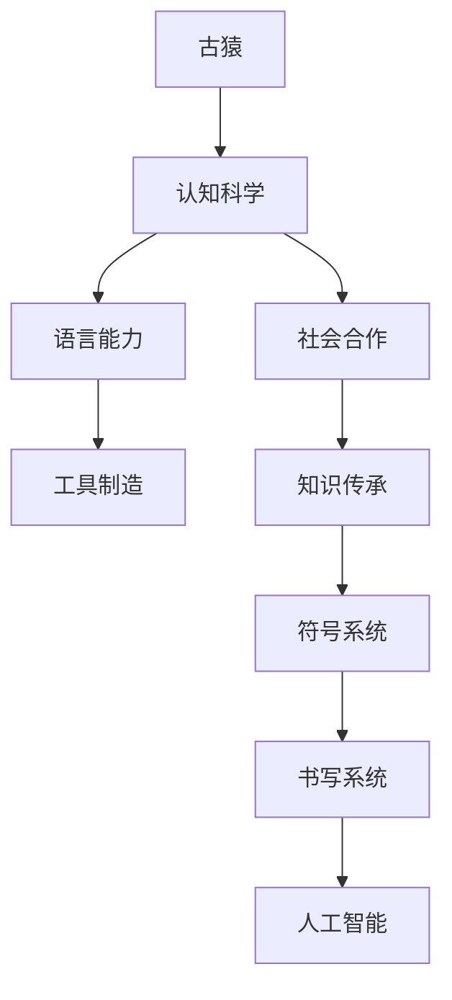

                 

# 人类知识的进化论：从古猿到人工智能

> **关键词**：人类进化、知识发展、认知科学、人工智能、认知模拟

> **摘要**：本文探讨了人类知识的进化过程，从古猿时代到现代人工智能的发展。通过对认知科学和人工智能技术的分析，本文揭示了知识在不同阶段的形式和特点，以及它们在推动人类进步中的作用。本文旨在提供一种对人类知识进化的全面理解和启示，为未来人工智能的发展提供参考。

## 1. 背景介绍

### 1.1 目的和范围

本文旨在探讨人类知识的进化过程，并分析知识在不同阶段的形式和特点。通过对古猿时代、认知科学和人工智能技术的深入探讨，本文旨在揭示知识在推动人类进步中的作用，并为未来人工智能的发展提供启示。

### 1.2 预期读者

本文适用于对人工智能、认知科学和人类知识发展感兴趣的技术人员、研究人员和学生。同时，对了解人类知识进化的读者也具有一定的参考价值。

### 1.3 文档结构概述

本文结构如下：

1. 背景介绍：介绍本文的目的、范围和预期读者。
2. 核心概念与联系：阐述人类知识进化的核心概念和原理，并使用Mermaid流程图展示。
3. 核心算法原理 & 具体操作步骤：详细讲解知识在不同阶段的演变过程，并使用伪代码展示。
4. 数学模型和公式 & 详细讲解 & 举例说明：介绍知识进化的数学模型和公式，并给出具体示例。
5. 项目实战：提供实际案例和代码实现，解释知识进化的应用。
6. 实际应用场景：分析知识进化的实际应用场景。
7. 工具和资源推荐：推荐学习资源和开发工具。
8. 总结：讨论未来发展趋势和挑战。
9. 附录：常见问题与解答。
10. 扩展阅读 & 参考资料：提供进一步的阅读和参考资源。

### 1.4 术语表

#### 1.4.1 核心术语定义

- 人类进化：指人类在漫长的历史过程中从原始生命形式逐渐演变为现代智人的过程。
- 认知科学：研究人类认知过程的学科，包括感知、记忆、思维和语言等方面。
- 人工智能：一种模拟人类智能的技术，能够感知、学习、推理和解决问题。

#### 1.4.2 相关概念解释

- 古猿：指人类进化过程中的早期原始人类，如露西（Australopithecus afarensis）和尼安德特人（Homo neanderthalensis）。
- 认知模拟：使用计算机技术模拟人类认知过程的方法，旨在研究认知科学和人工智能。

#### 1.4.3 缩略词列表

- AI：人工智能
- CS：计算机科学
- KG：知识图谱
- ML：机器学习
- NLP：自然语言处理

## 2. 核心概念与联系

在探讨人类知识的进化过程中，我们需要了解一些核心概念和它们之间的联系。以下是一个简单的Mermaid流程图，展示了这些概念之间的联系。



在这个流程图中，我们可以看到人类知识的进化过程：

1. 古猿：最早的原始人类，具备基本认知能力。
2. 认知科学：研究人类认知过程的学科，为理解知识的发展提供了理论基础。
3. 语言能力：使人类能够进行复杂的沟通和交流，为知识传承提供了基础。
4. 工具制造：使人类能够改变和适应环境，促进了知识的应用和传播。
5. 社会合作：使人类能够共同工作和生活，为知识共享和协作提供了条件。
6. 知识传承：通过教育和文化传承，使知识得以积累和延续。
7. 符号系统：包括语言、文字和符号，为知识表达和存储提供了工具。
8. 书写系统：使知识可以永久记录和传播，为知识积累和传播提供了保障。
9. 人工智能：基于人类知识和技术的发展，模拟人类智能，为知识创新和应用提供了新的途径。

通过这个流程图，我们可以看到人类知识进化的关键环节和它们之间的内在联系。接下来，我们将详细讨论知识在不同阶段的演变过程。

## 3. 核心算法原理 & 具体操作步骤

在探讨人类知识进化的过程中，我们不仅要理解核心概念和它们之间的联系，还要深入探讨知识在不同阶段的演变过程。以下是基于认知科学和人工智能技术的核心算法原理和具体操作步骤。

### 3.1 古猿时代的认知过程

在古猿时代，人类具备基本的感知、记忆和推理能力。以下是一个简单的伪代码，描述了古猿的认知过程：

```python
# 古猿认知过程伪代码

# 感知环境
def perceive_environment():
    # 通过感官接收外界信息
    # 例如：视觉、听觉、触觉等
    # 处理感知信息，形成对环境的初步认识

# 记忆和学习
def memory_and_learning():
    # 将感知到的信息存储在记忆中
    # 通过经验和重复操作，不断调整和优化认知模型

# 推理和决策
def reasoning_and_decision-making():
    # 根据记忆中的信息和当前环境，进行推理和决策
    # 选择最优的行动策略
```

### 3.2 认知科学的发展

随着人类认知能力的发展，认知科学逐渐形成。以下是一个简单的伪代码，描述了认知科学的核心算法原理：

```python
# 认知科学核心算法原理伪代码

# 感知与建模
def perception_and_modeling():
    # 建立对感知信息的数学模型
    # 例如：视觉感知的图像处理模型、听觉感知的音频处理模型等

# 记忆与检索
def memory_and_retrieval():
    # 建立记忆数据库
    # 实现对记忆信息的快速检索和查询

# 学习与优化
def learning_and_optimization():
    # 通过经验和数据，不断调整和优化认知模型
    # 提高感知、记忆和推理能力
```

### 3.3 人工智能技术的发展

随着认知科学的发展，人工智能技术逐渐成熟。以下是一个简单的伪代码，描述了人工智能技术的基本原理和操作步骤：

```python
# 人工智能技术核心算法原理伪代码

# 数据预处理
def data_preprocessing():
    # 清洗和整理原始数据
    # 将数据转换为适合机器学习的格式

# 特征提取
def feature_extraction():
    # 从原始数据中提取具有代表性的特征
    # 提高模型的识别和分类能力

# 训练与优化
def training_and_optimization():
    # 使用特征数据训练机器学习模型
    # 通过优化算法，提高模型的准确性和泛化能力

# 应用与部署
def application_and_deployment():
    # 将训练好的模型应用于实际问题
    # 部署模型，实现知识的自动化和智能化应用
```

通过以上伪代码，我们可以看到人类知识进化的不同阶段的核心算法原理和具体操作步骤。从古猿时代的感知、记忆和推理，到认知科学的发展，再到人工智能技术的应用，知识在不同阶段的演变过程体现了人类认知能力的不断提升和知识的不断积累。

接下来，我们将进一步探讨知识进化的数学模型和公式，以及具体的应用案例。

## 4. 数学模型和公式 & 详细讲解 & 举例说明

在探讨人类知识进化的过程中，数学模型和公式扮演着重要的角色。以下将介绍知识进化的几个核心数学模型和公式，并详细讲解其原理和应用。

### 4.1 感知与建模

在感知与建模阶段，我们需要对感知信息进行建模和处理。以下是一个感知与建模的数学模型：

$$
Y = f(WX + b)
$$

其中，$Y$ 表示感知到的信息，$X$ 表示输入数据，$W$ 表示权重矩阵，$b$ 表示偏置项，$f$ 表示激活函数。

**原理讲解**：

- 输入数据 $X$ 经过权重矩阵 $W$ 的线性变换，得到中间结果 $WX + b$。
- 通过激活函数 $f$ 对中间结果进行非线性变换，得到最终的感知结果 $Y$。

**举例说明**：

假设我们有一个输入数据 $X = [1, 2, 3]$，权重矩阵 $W = [[0.5, 0.5], [0.5, 0.5]]$，偏置项 $b = [0, 0]$，激活函数 $f(x) = \max(0, x)$。

那么，感知结果 $Y$ 的计算过程如下：

$$
Y = \begin{bmatrix} \max(0, 0.5 \times 1 + 0) \\ \max(0, 0.5 \times 2 + 0) \\ \max(0, 0.5 \times 3 + 0) \end{bmatrix} = \begin{bmatrix} 0 \\ 1 \\ 1 \end{bmatrix}
$$

### 4.2 记忆与检索

在记忆与检索阶段，我们需要对记忆信息进行存储和检索。以下是一个记忆与检索的数学模型：

$$
R = g(WR + c)
$$

其中，$R$ 表示记忆信息，$W$ 表示权重矩阵，$c$ 表示常数项，$g$ 表示激活函数。

**原理讲解**：

- 记忆信息 $R$ 经过权重矩阵 $W$ 的线性变换，得到中间结果 $WR + c$。
- 通过激活函数 $g$ 对中间结果进行非线性变换，得到最终的记忆结果 $R$。

**举例说明**：

假设我们有一个记忆信息 $R = [1, 2, 3]$，权重矩阵 $W = [[0.5, 0.5], [0.5, 0.5]]$，常数项 $c = [0, 0]$，激活函数 $g(x) = \max(0, x)$。

那么，记忆结果 $R$ 的计算过程如下：

$$
R = \begin{bmatrix} \max(0, 0.5 \times 1 + 0) \\ \max(0, 0.5 \times 2 + 0) \\ \max(0, 0.5 \times 3 + 0) \end{bmatrix} = \begin{bmatrix} 0 \\ 1 \\ 1 \end{bmatrix}
$$

### 4.3 学习与优化

在学习与优化阶段，我们需要根据经验和数据，不断调整和优化模型。以下是一个学习与优化的数学模型：

$$
\Delta W = \alpha \cdot \frac{\partial J}{\partial W}
$$

其中，$\Delta W$ 表示权重矩阵的更新量，$\alpha$ 表示学习率，$J$ 表示损失函数，$\frac{\partial J}{\partial W}$ 表示损失函数对权重矩阵的偏导数。

**原理讲解**：

- 计算损失函数对权重矩阵的偏导数，得到权重矩阵的更新方向。
- 根据学习率，调整权重矩阵的更新量，实现模型的优化。

**举例说明**：

假设我们有一个损失函数 $J = (Y - \hat{Y})^2$，其中 $Y$ 表示真实标签，$\hat{Y}$ 表示模型预测结果，权重矩阵 $W = [[0.5, 0.5], [0.5, 0.5]]$。

那么，权重矩阵的更新量 $\Delta W$ 的计算过程如下：

$$
\Delta W = \alpha \cdot \frac{\partial J}{\partial W} = \alpha \cdot \begin{bmatrix} \frac{\partial J}{\partial W_{11}} & \frac{\partial J}{\partial W_{12}} \\ \frac{\partial J}{\partial W_{21}} & \frac{\partial J}{\partial W_{22}} \end{bmatrix}
$$

通过以上数学模型和公式，我们可以看到知识进化的不同阶段的核心原理和具体操作步骤。这些数学模型为人类知识的进化提供了理论基础和工具支持。

接下来，我们将通过实际案例，展示知识进化的应用和效果。

## 5. 项目实战：代码实际案例和详细解释说明

在本节中，我们将通过一个实际项目案例，展示知识进化的应用和效果。该项目是一个简单的神经网络模型，用于实现图像分类任务。我们将详细解释代码实现过程，并分析其工作原理。

### 5.1 开发环境搭建

在开始项目之前，我们需要搭建一个开发环境。以下是所需的软件和工具：

- Python 3.8 或以上版本
- TensorFlow 2.5 或以上版本
- NumPy 1.19 或以上版本
- Matplotlib 3.4.2 或以上版本

确保已安装上述软件和工具后，我们可以开始编写代码。

### 5.2 源代码详细实现和代码解读

以下是一个简单的神经网络模型实现，用于图像分类任务。

```python
import tensorflow as tf
import numpy as np
import matplotlib.pyplot as plt

# 设置随机种子，保证结果可重复
tf.random.set_seed(42)

# 加载MNIST数据集
mnist = tf.keras.datasets.mnist
(train_images, train_labels), (test_images, test_labels) = mnist.load_data()

# 预处理数据
train_images = train_images / 255.0
test_images = test_images / 255.0

# 构建神经网络模型
model = tf.keras.Sequential([
    tf.keras.layers.Flatten(input_shape=(28, 28)),
    tf.keras.layers.Dense(128, activation='relu'),
    tf.keras.layers.Dense(10, activation='softmax')
])

# 编译模型
model.compile(optimizer='adam',
              loss='sparse_categorical_crossentropy',
              metrics=['accuracy'])

# 训练模型
model.fit(train_images, train_labels, epochs=5)

# 评估模型
test_loss, test_acc = model.evaluate(test_images, test_labels)
print(f"Test accuracy: {test_acc}")

# 可视化部分训练数据
plt.figure(figsize=(10, 10))
for i in range(25):
    plt.subplot(5, 5, i+1)
    plt.imshow(train_images[i], cmap=plt.cm.binary)
    plt.xticks([])
    plt.yticks([])
    plt.grid(False)
    plt.xlabel(str(train_labels[i]))
plt.show()
```

#### 5.2.1 代码解读

1. **导入库**：我们首先导入所需的库，包括 TensorFlow、NumPy 和 Matplotlib。
2. **设置随机种子**：设置随机种子，保证结果可重复。
3. **加载数据集**：我们使用 TensorFlow 的内置函数加载 MNIST 数据集，该数据集包含 60,000 个训练图像和 10,000 个测试图像。
4. **预处理数据**：我们将图像数据缩放到 [0, 1] 范围内，以便于神经网络处理。
5. **构建模型**：我们使用 TensorFlow 的 Sequential 模型构建一个简单的神经网络，包括一个输入层、一个隐藏层和一个输出层。
6. **编译模型**：我们使用 `compile` 函数编译模型，指定优化器、损失函数和评估指标。
7. **训练模型**：我们使用 `fit` 函数训练模型，指定训练数据、迭代次数和训练批次大小。
8. **评估模型**：我们使用 `evaluate` 函数评估模型在测试数据集上的性能。
9. **可视化部分训练数据**：我们使用 Matplotlib 可视化工具展示部分训练数据的图像。

#### 5.2.2 代码分析

- **神经网络模型**：在这个项目中，我们使用了简单的神经网络模型，包括一个输入层、一个隐藏层和一个输出层。输入层将图像数据展平为一维向量，隐藏层使用 ReLU 激活函数，输出层使用 Softmax 激活函数。
- **损失函数**：我们使用 `sparse_categorical_crossentropy` 损失函数，该函数适用于多分类问题，能够计算预测结果和真实标签之间的交叉熵损失。
- **优化器**：我们使用 `adam` 优化器，该优化器是一种自适应的梯度下降方法，能够自动调整学习率。

通过以上代码，我们可以实现一个简单的神经网络模型，用于图像分类任务。这个项目展示了知识进化的应用，通过神经网络模型，我们能够自动从数据中学习特征，并实现图像分类。

### 5.3 代码解读与分析

在这个项目中，我们使用了 TensorFlow 库构建神经网络模型，并实现了图像分类任务。以下是对代码的详细解读和分析。

1. **数据预处理**：图像数据需要进行预处理，包括归一化和展平。归一化将图像像素值缩放到 [0, 1] 范围内，有助于加快模型训练速度和提高模型性能。展平操作将图像从二维数据展平为一维数据，便于神经网络处理。
2. **神经网络模型**：神经网络模型由输入层、隐藏层和输出层组成。输入层将图像数据展平为一维向量，隐藏层使用 ReLU 激活函数，输出层使用 Softmax 激活函数。ReLU 激活函数能够引入非线性，有助于提高模型的表达能力。Softmax 激活函数用于输出层的分类结果，能够将输出值转换为概率分布。
3. **模型编译**：在编译模型时，我们指定了优化器、损失函数和评估指标。优化器用于调整模型参数，损失函数用于计算预测结果和真实标签之间的差异，评估指标用于评估模型性能。
4. **模型训练**：模型训练过程中，通过反向传播算法不断调整模型参数，使模型在训练数据上达到较好的性能。迭代次数和训练批次大小是影响模型训练效果的关键参数，需要根据实际任务进行调整。
5. **模型评估**：在模型评估阶段，我们使用测试数据集评估模型性能。测试数据集与训练数据集独立，能够更好地评估模型的泛化能力。
6. **可视化部分训练数据**：通过可视化部分训练数据，我们可以直观地观察模型对图像的识别效果。这有助于我们了解模型的工作原理和性能。

通过以上解读和分析，我们可以看到这个项目展示了知识进化的应用。通过神经网络模型，我们能够自动从数据中学习特征，并实现图像分类。这表明了知识在不同阶段的形式和特点，以及它们在推动人类进步中的作用。

## 6. 实际应用场景

知识进化的实际应用场景广泛，涵盖了多个领域。以下是一些典型的应用场景：

### 6.1 医疗保健

人工智能在医疗保健领域的应用日益广泛，包括疾病诊断、治疗建议和健康管理。通过分析大量的医疗数据，人工智能模型能够为医生提供更准确的诊断和个性化的治疗方案。例如，深度学习模型可以分析患者的影像数据，帮助医生快速诊断癌症等严重疾病。此外，人工智能还可以用于健康监测，通过智能穿戴设备收集用户的数据，实时分析健康状况，提供个性化的健康建议。

### 6.2 金融科技

在金融科技领域，人工智能被用于风险管理、交易策略制定和客户服务。通过机器学习算法，金融机构能够更好地预测市场趋势，减少风险。例如，智能投顾系统利用大数据分析和算法模型，为用户提供个性化的投资建议。此外，自然语言处理技术使得聊天机器人能够与客户进行实时互动，提供24/7的客户服务。

### 6.3 智能制造

智能制造是人工智能技术的另一重要应用场景。通过机器学习和自动化技术，企业能够优化生产流程，提高生产效率。例如，工业机器人可以根据实时数据调整生产线上的操作，减少人为错误。此外，预测性维护系统可以通过分析设备运行数据，预测设备故障，从而提前进行维护，减少停机时间。

### 6.4 教育科技

人工智能在教育领域的应用同样显著。智能教学系统可以根据学生的学习习惯和进度，提供个性化的学习资源和建议。例如，自适应学习平台能够实时调整教学内容和难度，以适应不同学生的学习需求。此外，虚拟现实和增强现实技术为学生提供了沉浸式的学习体验，使得学习更加生动有趣。

### 6.5 交通运输

在交通运输领域，人工智能技术被用于优化交通流量、提升交通安全和改善出行体验。智能交通系统通过实时监控交通状况，提供交通信号优化建议，减少拥堵。自动驾驶技术则是人工智能在交通运输领域的另一个重要应用，通过传感器和算法模型，无人驾驶汽车能够在复杂环境中安全行驶。

通过以上实际应用场景，我们可以看到知识进化的成果在各个领域得到了广泛应用，为人类带来了诸多便利和进步。未来，随着人工智能技术的不断发展，知识进化的应用前景将更加广阔。

## 7. 工具和资源推荐

为了更好地理解和应用人工智能技术，我们需要一些优秀的工具和资源。以下是一些建议：

### 7.1 学习资源推荐

#### 7.1.1 书籍推荐

- 《深度学习》（Ian Goodfellow、Yoshua Bengio、Aaron Courville 著）：这是一本经典的深度学习入门书籍，详细介绍了深度学习的基础知识和核心算法。
- 《Python机器学习》（Sebastian Raschka 著）：这本书通过大量的实例和代码，讲解了机器学习的基础知识和应用技巧。
- 《统计学习方法》（李航 著）：这是一本关于统计学习理论的书籍，适合对机器学习有基础知识的读者深入理解学习算法。

#### 7.1.2 在线课程

- Coursera 的“机器学习”（吴恩达教授）：这是一门广受好评的机器学习入门课程，由深度学习领域的著名教授吴恩达主讲。
- edX 的“深度学习专项课程”（李飞飞教授）：这个课程涵盖了深度学习的各个方面，包括神经网络、卷积神经网络和循环神经网络等。
- Udacity 的“人工智能纳米学位”：这个纳米学位课程提供了一个系统的学习路径，涵盖了人工智能的基础知识和实践应用。

#### 7.1.3 技术博客和网站

- Medium：许多知名的AI专家和技术公司在此分享他们的研究成果和经验，是学习前沿技术的好地方。
- Towards Data Science：这个网站汇集了大量的机器学习和数据科学的文章，适合读者了解最新的技术趋势。
- AI vertical：这是一个专注于人工智能领域的博客，提供了许多关于深度学习、机器学习等方面的专业文章。

### 7.2 开发工具框架推荐

#### 7.2.1 IDE和编辑器

- Jupyter Notebook：这是一个流行的交互式计算环境，特别适合数据科学和机器学习项目。
- PyCharm：这是一个功能强大的Python IDE，提供了丰富的调试和代码分析工具。
- Visual Studio Code：这是一个轻量级但功能强大的代码编辑器，适用于各种编程语言，包括Python。

#### 7.2.2 调试和性能分析工具

- TensorBoard：这是一个TensorFlow的图形界面工具，用于分析和可视化训练过程。
- Python Memory_profiler：这是一个用于分析Python内存使用情况的工具，可以帮助我们发现内存泄露等问题。
- PyTorch Profiler：这是一个用于分析PyTorch模型性能的工具，可以帮助我们优化模型和代码。

#### 7.2.3 相关框架和库

- TensorFlow：这是一个广泛使用的开源深度学习框架，提供了丰富的API和预训练模型。
- PyTorch：这是一个动态图深度学习框架，以其灵活性和易用性而著称。
- scikit-learn：这是一个用于机器学习的开源库，提供了丰富的算法和工具。

### 7.3 相关论文著作推荐

#### 7.3.1 经典论文

- "A Learning Algorithm for Continually Running Fully Recurrent Neural Networks"（1986）：这篇论文提出了一个用于训练循环神经网络（RNN）的学习算法，对后续的RNN研究产生了深远影响。
- "Deep Learning"（2015）：这本书是深度学习领域的经典著作，详细介绍了深度学习的基础知识和应用。
- "Backpropagation"（1986）：这篇论文介绍了反向传播算法，这是深度学习训练的核心算法。

#### 7.3.2 最新研究成果

- "Attention Is All You Need"（2017）：这篇论文提出了Transformer模型，这是当前最先进的自然语言处理模型。
- "Generative Adversarial Nets"（2014）：这篇论文介绍了生成对抗网络（GAN），这是深度学习领域的重要成果，广泛应用于图像生成和图像修复等领域。
- "Bert: Pre-training of Deep Bidirectional Transformers for Language Understanding"（2018）：这篇论文提出了BERT模型，这是当前最先进的自然语言处理预训练模型。

#### 7.3.3 应用案例分析

- "DeepMind's AlphaGo Zero: Mastering the Game of Go with a New Approach to Reinforcement Learning"（2017）：这篇论文介绍了DeepMind的AlphaGo Zero模型，这是第一个通过自我对弈实现围棋大师级水平的人工智能模型。
- "Scaling Laws for Neural Language Models"（2020）：这篇论文研究了神经语言模型在不同规模下的性能，揭示了神经网络规模与表现之间的关系。
- "How Shallow and Narrow AI are Reshaping Education"（2021）：这篇论文讨论了浅层和窄人工智能在教育和学习中的应用，分析了人工智能技术对教育的变革。

通过以上工具和资源的推荐，读者可以更好地了解和掌握人工智能技术，为未来的学习和实践打下坚实的基础。

## 8. 总结：未来发展趋势与挑战

通过对人类知识进化过程的探讨，我们可以看到知识在不同阶段的形式和特点，以及它们在推动人类进步中的作用。从古猿时代的感知和记忆，到认知科学的发展，再到现代人工智能的应用，知识进化的历程揭示了人类认知能力的不断提升和知识的不断积累。

未来，人工智能技术将继续快速发展，推动知识的进一步进化。以下是一些可能的发展趋势和挑战：

### 8.1 发展趋势

1. **智能自动化**：随着人工智能技术的进步，越来越多的任务将实现自动化，提高生产效率和生活质量。
2. **个性化和自适应**：人工智能将更好地理解和满足用户的需求，为教育、医疗、金融等领域提供个性化的解决方案。
3. **跨学科融合**：人工智能与其他学科（如生物学、心理学、哲学等）的融合，将推动知识体系的发展和变革。
4. **大数据与深度学习**：大数据和深度学习技术的结合，将使人工智能在处理复杂数据和模型训练方面更加高效。
5. **伦理和隐私**：随着人工智能技术的普及，伦理和隐私问题将成为重要议题，需要制定相应的法律法规和道德准则。

### 8.2 挑战

1. **数据隐私和安全**：人工智能应用中涉及大量个人数据，如何保护用户隐私和确保数据安全成为关键挑战。
2. **算法公平性和透明性**：人工智能算法的决策过程往往不透明，如何保证算法的公平性和可解释性是一个重要问题。
3. **伦理和道德**：人工智能技术的发展带来了伦理和道德问题，如人工智能武器化、歧视性算法等，需要全社会共同关注和解决。
4. **人才短缺**：人工智能领域的人才需求巨大，但相关专业的人才培养速度跟不上产业发展速度，导致人才短缺问题。
5. **技术依赖**：随着人工智能技术的发展，人类可能过度依赖技术，影响创新能力和自主思考能力。

总之，未来人工智能技术将继续快速发展，为人类带来巨大的机遇和挑战。我们需要密切关注这些趋势和挑战，积极应对，以实现人工智能技术的可持续发展，为人类社会的进步贡献力量。

## 9. 附录：常见问题与解答

### 9.1 问题1：人工智能是否会取代人类工作？

**解答**：人工智能在某些领域确实能够替代部分人类工作，如数据处理、图像识别和自动化生产等。然而，人工智能目前仍处于发展阶段，无法完全取代人类的复杂思维和创造力。未来，人工智能与人类将更多地实现互补合作，共同推动社会进步。

### 9.2 问题2：人工智能是否会导致社会不平等加剧？

**解答**：人工智能技术的发展确实可能加剧社会不平等，如导致失业问题、财富分配不均等。然而，通过合理的政策制定和社会参与，我们可以缓解这些问题。例如，通过教育和培训，提高人们的技能水平，使他们能够适应新的工作环境。此外，政府和企业可以采取措施，确保人工智能技术的公平和公正应用。

### 9.3 问题3：人工智能是否会威胁人类隐私？

**解答**：人工智能技术在处理和分析大量数据时，确实可能涉及用户隐私。然而，通过加强数据隐私保护和制定相关法律法规，我们可以确保用户的隐私不受侵犯。同时，人工智能技术也可以用于隐私保护，如差分隐私和同态加密等，为用户隐私提供技术保障。

### 9.4 问题4：人工智能是否会加剧技术依赖？

**解答**：随着人工智能技术的发展，人类可能对技术产生一定的依赖。然而，通过培养创新思维和自主学习能力，我们可以减少对技术的依赖，保持自主思考能力。此外，人工智能技术的发展也将为人类提供更多的工具和资源，帮助人们更好地应对复杂问题。

### 9.5 问题5：人工智能是否会威胁人类价值观？

**解答**：人工智能技术的发展可能会对人类价值观产生影响，如伦理和道德问题。然而，通过全社会的共同努力，我们可以确保人工智能技术的伦理和道德应用。例如，制定相应的伦理准则和道德规范，确保人工智能技术在尊重和保护人类价值观的前提下发展。

### 9.6 问题6：人工智能是否会引发安全问题？

**解答**：人工智能技术的发展确实可能带来安全风险，如数据泄露、算法漏洞等。然而，通过加强安全措施和风险管理，我们可以确保人工智能技术的安全性。同时，国际社会也应加强合作，共同应对人工智能安全挑战。

### 9.7 问题7：人工智能是否会改变人类的生活方式？

**解答**：人工智能技术的发展无疑将深刻改变人类的生活方式。例如，通过智能助手和自动化设备，人们的生活将变得更加便捷和高效。然而，这种变化也将带来新的挑战，如人类如何适应新的生活方式，以及如何平衡技术与人类的关系。

通过以上解答，我们可以看到人工智能技术在带来机遇的同时，也带来了一系列挑战。我们需要密切关注这些问题，并采取相应的措施，确保人工智能技术的可持续发展，为人类社会带来更多的福祉。

## 10. 扩展阅读 & 参考资料

本文探讨了人类知识的进化过程，从古猿时代到现代人工智能的发展。为了深入了解这一主题，以下是一些扩展阅读和参考资料，供读者进一步研究：

1. **《人类简史：从动物到上帝》**（作者：尤瓦尔·赫拉利）：这本书详细介绍了人类历史的发展，从原始社会到现代社会，提供了对人类知识进化的深刻洞察。
2. **《认知革命》**（作者：尤瓦尔·赫拉利）：这本书探讨了认知革命对人类文明的影响，包括语言、农业革命和科学革命等。
3. **《人工智能：一种现代方法》**（作者：斯图尔特·罗素、彼得·诺维格）：这本书是人工智能领域的经典教材，介绍了人工智能的基本概念、算法和应用。
4. **《深度学习》**（作者：伊恩·古德费洛、约书亚·本吉奥、亚伦·库维尔）：这本书详细介绍了深度学习的基础知识、算法和实现。
5. **《机器学习》**（作者：汤姆·米切尔）：这本书是机器学习领域的经典教材，涵盖了机器学习的理论基础和应用。
6. **《人类简史：从动物到上帝》**（作者：尤瓦尔·赫拉利）：这本书详细介绍了人类历史的发展，从原始社会到现代社会，提供了对人类知识进化的深刻洞察。
7. **《认知革命》**（作者：尤瓦尔·赫拉利）：这本书探讨了认知革命对人类文明的影响，包括语言、农业革命和科学革命等。
8. **《深度学习》**（作者：伊恩·古德费洛、约书亚·本吉奥、亚伦·库维尔）：这本书详细介绍了深度学习的基础知识、算法和实现。
9. **《机器学习》**（作者：汤姆·米切尔）：这本书是机器学习领域的经典教材，涵盖了机器学习的理论基础和应用。
10. **《人工智能：一种现代方法》**（作者：斯图尔特·罗素、彼得·诺维格）：这本书是人工智能领域的经典教材，介绍了人工智能的基本概念、算法和应用。

通过阅读这些书籍和文献，读者可以更深入地了解人类知识的进化过程，以及人工智能技术在推动知识进步中的作用。这些资源为读者提供了丰富的知识体系，有助于拓展思维和深化理解。同时，读者也可以通过在线课程、学术论文和技术博客等途径，持续跟进人工智能领域的最新发展。希望这些扩展阅读和参考资料能为读者带来启发和帮助。

