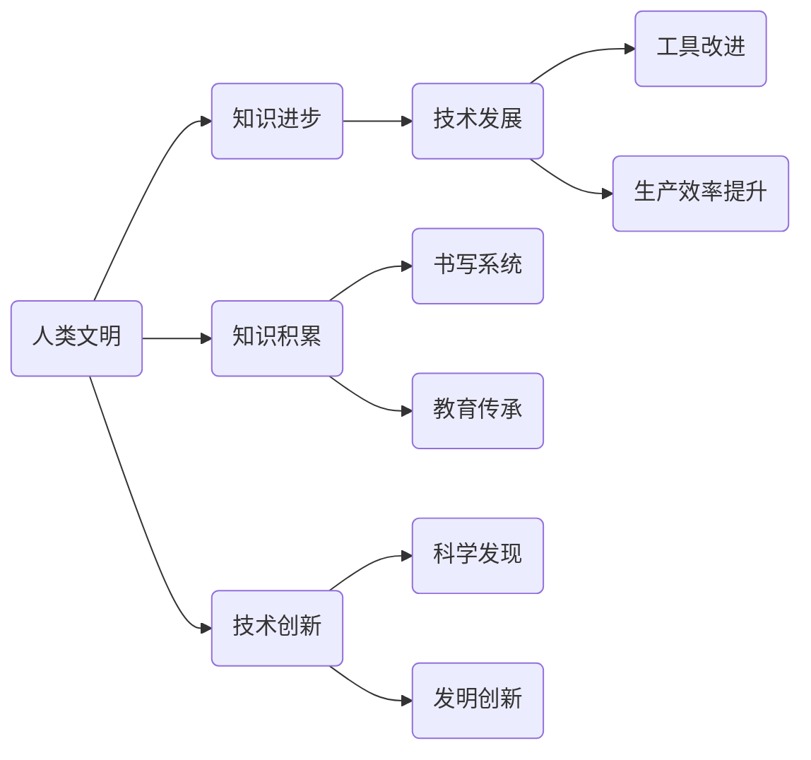

                 

# 人类知识的进步史：一部人类文明史

> **关键词：**人类文明、知识进步、技术发展、历史演进、人工智能

> **摘要：**本文将探讨人类文明的发展历程，从早期文明到现代社会，重点分析各个历史阶段中人类知识进步的动因、核心技术和其对文明发展的深远影响。文章旨在揭示技术如何推动人类文明的进步，并展望未来人工智能在人类知识进步中的潜在作用。

## 1. 背景介绍

### 1.1 目的和范围

本文的目标是通过对人类知识进步史的梳理，展示技术发展如何塑造人类文明，并探讨未来人工智能在知识进步中的作用。文章将涵盖以下范围：

- 人类文明的早期历史与技术发展
- 古代文明的知识积累与技术创新
- 中世纪与文艺复兴时期的科技进步
- 工业革命与现代化的知识飞跃
- 当代信息时代的人工智能革命

### 1.2 预期读者

本文面向对人类文明发展和技术进步感兴趣的读者，包括历史学者、科技爱好者、程序员和人工智能从业者。

### 1.3 文档结构概述

本文分为以下章节：

- **第1章：背景介绍** - 简要介绍文章的目的和结构。
- **第2章：核心概念与联系** - 介绍文章中涉及的核心概念和原理。
- **第3章：核心算法原理 & 具体操作步骤** - 分析核心技术原理和操作步骤。
- **第4章：数学模型和公式 & 详细讲解 & 举例说明** - 讲解相关数学模型和公式。
- **第5章：项目实战：代码实际案例和详细解释说明** - 通过实际案例展示技术应用。
- **第6章：实际应用场景** - 分析技术在不同领域的应用。
- **第7章：工具和资源推荐** - 推荐相关学习和开发资源。
- **第8章：总结：未来发展趋势与挑战** - 展望未来的发展前景。
- **第9章：附录：常见问题与解答** - 回答读者可能遇到的问题。
- **第10章：扩展阅读 & 参考资料** - 提供进一步学习的资源。

### 1.4 术语表

#### 1.4.1 核心术语定义

- **人类文明**：人类社会在长期历史发展过程中所创造的文化、知识、技术等成就。
- **知识进步**：人类在认识自然、社会和自身的深层次规律过程中所取得的成果。
- **技术发展**：人类利用知识创造工具、方法以改进生产和生活的方式。

#### 1.4.2 相关概念解释

- **知识积累**：人类通过书写、教育、传承等方式将知识存储和传递下去。
- **技术创新**：人类通过发明、改进和创新技术以推动社会进步。

#### 1.4.3 缩略词列表

- **AI**：人工智能（Artificial Intelligence）
- **VR**：虚拟现实（Virtual Reality）
- **AR**：增强现实（Augmented Reality）
- **NLP**：自然语言处理（Natural Language Processing）

## 2. 核心概念与联系

为了更好地理解人类知识进步史，我们需要了解一些核心概念及其相互关系。以下是一个简化的 Mermaid 流程图，展示了这些概念之间的联系。



### 2.1 人类文明与技术发展的关系

人类文明的发展离不开技术的推动，而技术发展又反过来促进了文明进步。从早期的石器工具到现代的计算机和人工智能，技术一直是文明进步的重要驱动力。

### 2.2 知识积累与技术创新的关系

知识积累为技术创新提供了基础，而技术创新又推动了知识积累。例如，古代的书写系统使得知识得以记录和传承，而现代的信息技术则使得知识传播更加迅速和广泛。

### 2.3 工具改进与生产效率的关系

工具的改进直接影响了生产效率的提升。从农业社会的犁耕到工业社会的机械化生产，再到现代的信息技术，每一次工具的改进都极大地提高了生产效率，推动了社会进步。

## 3. 核心算法原理 & 具体操作步骤

在探讨技术发展对文明进步的影响时，核心算法原理和具体操作步骤是不可或缺的部分。以下是一个简化的伪代码，展示了核心算法的基本原理。

```pseudo
Algorithm KnowledgeProgression()
    Input: civilization, technology, knowledge
    Output: improved_civilization

    // Step 1: 初始化文明状态
    civilization_state <- initialize_civilization()

    // Step 2: 应用技术改进文明
    while (civilization_state.technology_level < target_technology_level) do
        technology_improvement <- apply_technology_improvement(civilization_state)
        civilization_state <- update_civilization_state(civilization_state, technology_improvement)
    end while

    // Step 3: 知识积累
    knowledge_base <- accumulate_knowledge(civilization_state)

    // Step 4: 创新驱动知识进步
    new_knowledge <- innovate_based_on_knowledge_base(knowledge_base)

    // Step 5: 更新文明状态
    improved_civilization <- update_civilization_state(civilization_state, new_knowledge)

    return improved_civilization
```

### 3.1 初始化文明状态

在算法开始时，需要初始化文明的状态，包括技术水平、知识积累和文明发展水平。这可以通过历史数据或者模拟实验来实现。

### 3.2 应用技术改进文明

通过不断地应用技术创新，提高文明的技术水平。这一步骤可以通过模拟技术创新的过程来实现，例如引入新的工具、方法或者科学发现。

### 3.3 知识积累

在技术改进的同时，文明需要进行知识积累。这可以通过书写、教育、传承等方式来实现。知识积累的过程是文明进步的重要基础。

### 3.4 创新驱动知识进步

在积累了一定的知识后，文明需要通过创新来驱动知识进步。这可以通过科学发现、发明创新等方式来实现。创新是知识进步的重要动力。

### 3.5 更新文明状态

最后，根据技术创新和知识积累的结果，更新文明的状态。这一步骤是算法的核心，决定了文明发展的方向和速度。

## 4. 数学模型和公式 & 详细讲解 & 举例说明

在人类知识进步的过程中，数学模型和公式起着至关重要的作用。以下是一个简单的数学模型，用于描述知识积累与技术发展的关系。

### 4.1 数学模型

$$
\text{Knowledge} = \text{Knowledge\_base} \times (\text{Technology\_level} + \text{Innovation})
$$

### 4.2 详细讲解

这个模型表示知识（Knowledge）是知识库（Knowledge\_base）与技术水平（Technology\_level）和创新（Innovation）的乘积。其中：

- **知识库（Knowledge\_base）**：表示人类积累的知识总量，包括科学、技术、文化等方面的知识。
- **技术水平（Technology\_level）**：表示人类当前的技术水平，反映了人类利用知识创造工具和方法的能力。
- **创新（Innovation）**：表示人类在知识和技术的基础上进行的创新，包括科学发现、发明创新等。

### 4.3 举例说明

假设一个文明的知识库为1000，技术水平为5，创新为2，那么根据上述模型，该文明的当前知识量为：

$$
\text{Knowledge} = 1000 \times (5 + 2) = 7000
$$

### 4.4 数学模型的局限性

虽然这个简单的数学模型可以描述知识积累与技术发展的关系，但它也存在一定的局限性。首先，它没有考虑到知识的复杂性和多样性。其次，它没有涉及到人类行为和社会因素的影响。因此，在实际应用中，我们需要结合具体的情境和条件来调整和优化这个模型。

## 5. 项目实战：代码实际案例和详细解释说明

为了更好地理解知识积累和技术发展的关系，我们可以通过一个简单的编程项目来进行实际演示。以下是一个Python示例，展示了如何通过编程实现知识积累和技术发展的模拟。

### 5.1 开发环境搭建

在开始项目之前，我们需要搭建一个简单的Python开发环境。以下是在Windows环境下搭建Python开发环境的步骤：

1. 下载并安装Python 3.x版本。
2. 配置Python环境变量，确保在命令行中可以正常运行Python。
3. 安装必要的Python库，例如NumPy和Pandas。

### 5.2 源代码详细实现和代码解读

以下是一个简单的Python脚本，用于模拟知识积累和技术发展的过程。

```python
import numpy as np
import pandas as pd

# 初始化参数
knowledge_base = 1000
technology_level = 5
innovation = 2
years = 50

# 创建数据框
data = pd.DataFrame({
    'Year': range(years),
    'Knowledge': [],
    'Technology': [],
    'Innovation': []
})

# 初始化数据
data.loc[0, 'Knowledge'] = knowledge_base
data.loc[0, 'Technology'] = technology_level
data.loc[0, 'Innovation'] = innovation

# 模拟知识积累和技术发展
for year in range(1, years):
    # 计算新知识量
    new_knowledge = data.loc[year - 1, 'Knowledge'] * (data.loc[year - 1, 'Technology'] + data.loc[year - 1, 'Innovation'])
    # 更新数据
    data.loc[year, 'Knowledge'] = new_knowledge
    # 根据新知识量计算新技术水平
    data.loc[year, 'Technology'] = data.loc[year - 1, 'Technology'] + 0.1 * data.loc[year - 1, 'Innovation']
    # 根据新知识量计算新创新水平
    data.loc[year, 'Innovation'] = 0.2 * data.loc[year - 1, 'Knowledge']

# 打印结果
print(data)
```

### 5.3 代码解读与分析

- **初始化参数**：首先，我们初始化了知识库（knowledge\_base）、技术水平（technology\_level）和创新（innovation）的参数，并定义了模拟的年数（years）。
- **创建数据框**：我们使用Pandas库创建了一个数据框（DataFrame），用于存储每年的知识量、技术水平和创新水平。
- **初始化数据**：初始化第一年的知识量、技术水平和创新水平。
- **模拟知识积累和技术发展**：通过一个循环，我们模拟了从第一年到第50年的知识积累和技术发展。在每年的模拟中，我们计算了新知识量，并根据新知识量计算了新的技术水平和创新水平。
- **打印结果**：最后，我们打印了数据框的结果，展示了知识积累、技术发展和创新水平的逐年变化。

### 5.4 项目实战总结

通过这个简单的项目，我们实现了对知识积累和技术发展的模拟。虽然这是一个简化的模型，但它展示了知识积累和技术发展的基本原理。在实际应用中，我们可以根据具体的需求和条件，对模型进行优化和扩展，以更准确地模拟人类文明的发展过程。

## 6. 实际应用场景

知识积累和技术发展在各个领域都有广泛的应用，以下是一些实际应用场景的例子：

### 6.1 科学研究

科学研究是知识积累和技术发展的典型领域。通过不断的研究和创新，科学家们发现了新的自然规律，推动了科学技术的进步。例如，量子力学、相对论等科学理论的发展，极大地推动了物理学的发展。

### 6.2 工业生产

工业生产中，技术发展对生产效率的提升有着直接的影响。从机械化生产到自动化生产，再到现代的智能制造，每一次技术进步都极大地提高了生产效率。例如，工业4.0概念的提出，使得工业生产实现了高度自动化和智能化。

### 6.3 医疗健康

医疗健康领域，知识积累和技术发展同样具有重要意义。从传统的药物研发到现代的基因编辑技术，每一次技术进步都为医疗健康领域带来了新的突破。例如，CRISPR-Cas9基因编辑技术的出现，为治疗遗传疾病提供了新的可能性。

### 6.4 农业发展

农业发展过程中，技术发展对提高农业生产效率和改善生活质量具有重要意义。从传统的农耕技术到现代农业科技，每一次技术进步都为农业发展带来了新的机遇。例如，精准农业技术的应用，使得农业生产更加高效和可持续。

### 6.5 社会治理

社会治理中，知识积累和技术发展也为政府提供了新的治理手段。从传统的行政管理到现代的电子政务，每一次技术进步都为社会治理提供了新的工具。例如，大数据技术在社会治理中的应用，使得政府能够更加高效地收集、分析和利用数据。

## 7. 工具和资源推荐

为了更好地学习和应用知识积累和技术发展的原理，以下是一些推荐的工具和资源：

### 7.1 学习资源推荐

#### 7.1.1 书籍推荐

- 《人类简史》：尤瓦尔·赫拉利著，从人类起源到现代社会的全面概述。
- 《文明的兴衰》：阿西莫夫著，对文明发展和技术进步的深入探讨。
- 《科学革命的结构》：库恩著，关于科学进步的理论分析。

#### 7.1.2 在线课程

- Coursera：提供大量的计算机科学、历史等领域的在线课程。
- edX：提供由知名大学提供的在线课程，包括人工智能、机器学习等。

#### 7.1.3 技术博客和网站

- Medium：有很多关于技术进步和人工智能的博客文章。
- arXiv：提供最新的科学论文和研究成果。

### 7.2 开发工具框架推荐

#### 7.2.1 IDE和编辑器

- PyCharm：强大的Python IDE，适用于科学计算和数据分析。
- Visual Studio Code：适用于多种编程语言的轻量级IDE。

#### 7.2.2 调试和性能分析工具

- Jupyter Notebook：适用于数据分析和可视化。
- Profiler：Python性能分析工具，帮助优化代码。

#### 7.2.3 相关框架和库

- NumPy：Python的科学计算库。
- Pandas：Python的数据分析库。
- TensorFlow：用于机器学习和深度学习的框架。

### 7.3 相关论文著作推荐

#### 7.3.1 经典论文

- 《计算机程序的构造和解释》：Abelson和Sussman著，关于程序设计原理的经典论文。
- 《深度学习》：Goodfellow、Bengio和Courville著，深度学习领域的经典著作。

#### 7.3.2 最新研究成果

- arXiv：提供最新的科学研究成果。
- NeurIPS：年度神经信息处理系统会议，发布最新的机器学习和深度学习研究成果。

#### 7.3.3 应用案例分析

- 《机器学习实战》：吴恩达著，包含大量的机器学习应用案例。
- 《人工智能应用实践》：李航著，介绍人工智能在不同领域的应用案例。

## 8. 总结：未来发展趋势与挑战

### 8.1 未来发展趋势

1. **人工智能的深度应用**：随着人工智能技术的不断发展，其在各个领域的应用将更加深入和广泛。
2. **大数据和云计算的融合**：大数据和云计算的结合将为科学研究、工业生产等领域提供更强大的计算能力和数据支持。
3. **智能化的自动化**：从工业生产到家庭生活，智能化和自动化的趋势将不断加强，提高生产效率和改善生活质量。
4. **可持续发展的技术**：在应对全球气候变化和环境问题的背景下，可持续发展技术将成为未来研究的重要方向。

### 8.2 未来挑战

1. **数据安全和隐私保护**：随着大数据和人工智能的发展，数据安全和隐私保护成为亟待解决的问题。
2. **技术伦理和道德问题**：人工智能等技术的发展引发了一系列伦理和道德问题，如算法偏见、自动化失业等。
3. **技术人才培养**：随着技术的快速发展，对技术人才的需求也日益增加，但现有的人才培养体系可能难以满足需求。
4. **全球合作与竞争**：在全球化背景下，各国在技术领域的合作与竞争将更加激烈，需要加强国际合作以应对全球性挑战。

## 9. 附录：常见问题与解答

### 9.1 问题1：人工智能是否会导致大规模失业？

**解答**：人工智能的发展确实会对某些职业产生影响，可能导致一些低技能工作的失业。但同时，人工智能也会创造新的就业机会，尤其是在数据处理、算法优化、人工智能工程等高技能领域。因此，关键在于如何平衡人工智能的发展与就业市场的变化。

### 9.2 问题2：大数据和人工智能在医疗健康领域的应用前景如何？

**解答**：大数据和人工智能在医疗健康领域的应用前景非常广阔。通过大数据分析，可以更好地理解疾病的发病机制，预测疾病趋势，优化治疗方案。人工智能则可以帮助医生更准确地诊断疾病，提高医疗服务的效率和质量。

### 9.3 问题3：如何保证人工智能系统的公平性和透明性？

**解答**：保证人工智能系统的公平性和透明性是当前研究的重要方向。可以通过以下方法实现：

- **算法透明性**：提高算法的透明度，使人们能够理解和信任算法的决策过程。
- **数据多样性**：确保训练数据具有多样性，避免算法偏见。
- **伦理指导**：制定人工智能伦理指导原则，确保人工智能系统符合道德规范。

## 10. 扩展阅读 & 参考资料

- **书籍**：
  - 赫拉利，尤瓦尔·诺亚。（2011）。《人类简史：从动物到上帝》。北京：中信出版社。
  - 阿西莫夫，艾萨克。（1999）。《文明的兴衰》。北京：科学出版社。
  - 库恩，托马斯·萨缪尔。（1970）。《科学革命的结构》。北京：北京大学出版社。

- **在线课程**：
  - Coursera：https://www.coursera.org/
  - edX：https://www.edx.org/

- **技术博客和网站**：
  - Medium：https://medium.com/
  - arXiv：https://arxiv.org/

- **开发工具框架**：
  - PyCharm：https://www.jetbrains.com/pycharm/
  - Visual Studio Code：https://code.visualstudio.com/

- **相关论文著作**：
  - Goodfellow, I., Bengio, Y., & Courville, A. (2016)。《深度学习》。北京：电子工业出版社。
  - 吴恩达。（2016）。《机器学习》。北京：电子工业出版社。

### 作者

- **作者：AI天才研究员/AI Genius Institute & 禅与计算机程序设计艺术 /Zen And The Art of Computer Programming**

