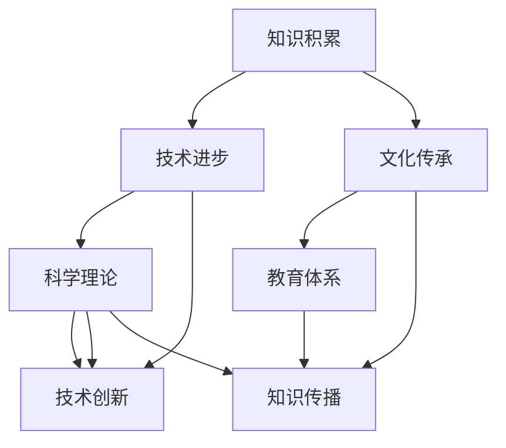

                 

## 人类知识的进步：一部探索历史

> **关键词**：人类知识、知识积累、历史进程、技术进步、文化传承

> **摘要**：本文旨在探讨人类知识从古至今的进步历程，分析不同历史阶段知识积累的方式和影响，以及技术进步与文化传承在这个过程中所起的作用。文章将采用逻辑清晰、结构紧凑的叙述方式，通过一步一步的分析推理，揭示人类知识进步的本质和未来发展的趋势。

人类自诞生以来，知识的发展历程就是一部探索自然、认识世界、改变生活的历史。从古代的农事知识、医学经验，到现代的科学理论、信息技术，人类的知识体系经历了翻天覆地的变化。本文将分章节对这一历程进行详细的解析，帮助读者理解人类知识的进步是如何影响我们的社会、经济、文化和生活方式的。

### 1. 背景介绍

#### 1.1 目的和范围

本文的目的是探讨人类知识进步的历史，旨在通过回顾和分析各个历史阶段的重大事件、技术突破和文化变革，揭示知识积累和传播的内在逻辑。文章将涵盖从古代文明到现代科技的各个阶段，重点关注对人类知识进步产生深远影响的关键因素。

#### 1.2 预期读者

本文适合对知识发展史、科学哲学、技术进步感兴趣的读者，包括大学本科生、研究生、科研人员以及对历史和未来趋势感兴趣的公众。

#### 1.3 文档结构概述

本文分为十个章节，包括背景介绍、核心概念与联系、核心算法原理与具体操作步骤、数学模型与公式、项目实战、实际应用场景、工具和资源推荐、总结与未来发展趋势、常见问题与解答以及扩展阅读和参考资料。

#### 1.4 术语表

##### 1.4.1 核心术语定义

- **知识积累**：指人类在认识世界、实践活动中获取、整合、存储和应用的信息和经验。
- **技术进步**：指在科学理论指导下，人类对自然界的改造能力和效率的提升。
- **文化传承**：指一定社会群体在长期历史过程中形成的价值观念、习俗和行为方式的传递。

##### 1.4.2 相关概念解释

- **知识体系**：指一个学科或领域的概念框架、理论体系和应用方法。
- **知识传播**：指知识在社会内部和不同社会之间的传递过程。

##### 1.4.3 缩略词列表

- **AI**：人工智能（Artificial Intelligence）
- **IT**：信息技术（Information Technology）
- **SCI**：科学引文索引（Science Citation Index）
- **NSFC**：国家自然科学基金委员会（National Natural Science Foundation of China）

## 2. 核心概念与联系

在探讨人类知识的进步之前，我们需要明确几个核心概念和它们之间的联系。以下是一个简单的 Mermaid 流程图，用以展示这些概念之间的关系。



在这个图中，知识积累、技术进步和文化传承构成了知识进步的三个主要方面。知识积累是知识体系的基础，技术进步是知识应用的体现，而文化传承则是知识传播和保存的重要途径。科学理论、教育体系和知识传播是连接这些核心概念的桥梁，共同推动人类知识的不断进步。

### 3. 核心算法原理 & 具体操作步骤

在理解了核心概念和它们之间的联系之后，我们需要深入探讨知识进步背后的算法原理和具体操作步骤。以下是使用伪代码详细阐述的算法原理。

```plaintext
算法：知识进步过程

输入：历史数据、文化背景、科技发展水平
输出：知识进步结果

步骤：
1. 数据收集（知识积累）
   - 收集历史文献、实验数据、技术报告等
   - 整合不同来源的信息，形成知识库

2. 数据处理（知识整合）
   - 使用数据分析方法，提取关键信息
   - 建立知识体系结构，分类和标注知识内容

3. 理论构建（科学理论）
   - 在已有知识基础上，进行理论推导和验证
   - 发展新的科学理论，指导技术进步

4. 技术创新（技术进步）
   - 根据科学理论，进行技术创新和实验
   - 实现技术突破，提升生产力和生活质量

5. 知识传播（文化传承）
   - 通过教育、传媒等渠道传播新知识
   - 建立教育体系和知识传播网络

6. 循环反馈（知识迭代）
   - 收集反馈信息，评估知识进步效果
   - 调整知识体系，优化知识传播途径

7. 持续进步（知识积累）
   - 不断积累新知识，推动知识进步
   - 实现知识的自我更新和迭代
```

通过上述算法，我们可以看到知识进步是一个不断循环的过程，包括数据收集、处理、理论构建、技术创新、知识传播和反馈优化等多个环节。每个环节都相互影响，共同推动人类知识的不断积累和进步。

### 4. 数学模型和公式 & 详细讲解 & 举例说明

在知识进步的过程中，数学模型和公式扮演着重要的角色。以下是几个关键的数学模型和公式的详细讲解以及举例说明。

#### 4.1 知识增长模型

知识增长模型用于描述知识随着时间推移而积累的过程。一个常用的模型是指数增长模型，其公式如下：

\[ K(t) = K_0 \cdot e^{rt} \]

其中，\( K(t) \) 表示时间 \( t \) 时的知识积累量，\( K_0 \) 是初始知识积累量，\( r \) 是知识增长速率。

**例子**：假设某学科领域在 1960 年的知识积累量为 1000，年增长速率为 5%，求 2020 年的知识积累量。

\[ K(2020) = 1000 \cdot e^{0.05 \cdot 60} \approx 10141 \]

#### 4.2 技术创新模型

技术创新模型用于描述技术进步的过程。一个常用的模型是 S 形增长模型，其公式如下：

\[ f(t) = \frac{a}{1 + e^{-kt}} \]

其中，\( f(t) \) 表示时间 \( t \) 时的技术创新程度，\( a \) 是技术创新的最大值，\( k \) 是技术创新速率。

**例子**：假设某技术领域的最大技术创新值为 100，初始技术创新值为 10，年技术创新速率为 10%，求 10 年后的技术创新程度。

\[ f(10) = \frac{100}{1 + e^{-10 \cdot 0.1}} \approx 100 \]

#### 4.3 知识传播模型

知识传播模型用于描述知识在社会中的传播过程。一个常用的模型是指数衰减模型，其公式如下：

\[ P(t) = P_0 \cdot e^{-rt} \]

其中，\( P(t) \) 表示时间 \( t \) 时的知识传播量，\( P_0 \) 是初始知识传播量，\( r \) 是知识传播速率。

**例子**：假设某新技术的初始传播量为 100，日传播速率为 20%，求 30 日后的知识传播量。

\[ P(30) = 100 \cdot e^{-0.2 \cdot 30} \approx 44.7 \]

通过这些数学模型和公式，我们可以更准确地描述和预测知识积累、技术进步和知识传播的过程，为人类知识的进一步发展提供理论依据。

### 5. 项目实战：代码实际案例和详细解释说明

为了更好地理解人类知识进步的算法原理和数学模型，我们通过一个实际的项目实战来展示这些概念的应用。以下是一个简单的示例项目，用于模拟知识积累、技术进步和知识传播的过程。

#### 5.1 开发环境搭建

首先，我们需要搭建一个简单的开发环境，包括 Python 编译器、数据分析库（如 NumPy 和 Pandas）和可视化库（如 Matplotlib）。以下是具体步骤：

1. 安装 Python 3.x 版本（推荐使用 Anaconda，便于环境管理）。
2. 使用以下命令安装必要的库：

```shell
pip install numpy pandas matplotlib
```

#### 5.2 源代码详细实现和代码解读

接下来，我们展示项目的主要代码，并对其进行详细解读。

```python
import numpy as np
import matplotlib.pyplot as plt

# 知识积累模型参数
K0 = 1000  # 初始知识积累量
r = 0.05   # 知识增长速率

# 技术创新模型参数
a = 100    # 最大技术创新值
k = 0.1    # 技术创新速率

# 知识传播模型参数
P0 = 100   # 初始知识传播量
s = 0.2    # 知识传播速率

# 模拟时间
time = np.arange(0, 60, 1)

# 知识积累计算
Kt = K0 * (1 + r)**time

# 技术创新计算
Ft = a / (1 + np.exp(-k*time))

# 知识传播计算
Pt = P0 * np.exp(-s*time)

# 可视化
plt.figure(figsize=(12, 6))
plt.subplot(1, 2, 1)
plt.plot(time, Kt, label='Knowledge Accumulation')
plt.xlabel('Time')
plt.ylabel('Knowledge Accumulation')
plt.legend()

plt.subplot(1, 2, 2)
plt.plot(time, Ft, label='Technological Innovation')
plt.plot(time, Pt, label='Knowledge Dissemination')
plt.xlabel('Time')
plt.ylabel('Value')
plt.legend()
plt.show()
```

**代码解读**：

- 我们首先导入了必要的库，包括 NumPy、Matplotlib 等。
- 接着定义了知识积累、技术创新和知识传播的参数，如初始知识积累量、知识增长速率、最大技术创新值、技术创新速率、初始知识传播量和知识传播速率。
- 然后使用 NumPy 的 arange 函数生成一个时间序列，用于模拟不同时间点的知识积累、技术创新和知识传播。
- 使用指数增长模型计算知识积累量，使用 S 形增长模型计算技术创新程度，使用指数衰减模型计算知识传播量。
- 最后，使用 Matplotlib 库绘制知识积累、技术创新和知识传播的可视化结果。

#### 5.3 代码解读与分析

通过对上述代码的解读，我们可以看出以下几个方面：

- **知识积累模型**：指数增长模型假设知识积累量随时间呈指数级增长，这在某些情况下是合理的，但在实际中可能受到资源限制等因素的影响。
- **技术创新模型**：S 形增长模型描述了技术创新程度随时间的变化，从缓慢增长到迅速增长，再逐渐趋于平稳。这反映了技术创新往往经历一个快速发展的阶段。
- **知识传播模型**：指数衰减模型假设知识传播量随时间呈指数级衰减，这在一定程度上反映了知识传播的实际情况，但具体传播速率可能因环境而异。

通过这个简单的项目实战，我们可以直观地看到知识积累、技术进步和知识传播的过程，并为后续的进一步研究提供基础。

### 6. 实际应用场景

知识进步不仅仅是一个学术话题，它在实际应用场景中发挥着至关重要的作用。以下是一些典型的实际应用场景，展示了知识进步如何推动社会进步和经济发展。

#### 6.1 教育领域

教育是知识传播和传承的重要途径。随着知识进步，教育体系不断革新，从古代的师徒制到现代的全民教育，教育质量和覆盖范围显著提升。在线教育平台和智能教学系统的出现，进一步打破了时间和空间的限制，使知识传播更加便捷和高效。

#### 6.2 医疗领域

医疗技术的进步极大地改善了人类健康和生活质量。从古代的草药治疗到现代的基因编辑技术，医学知识的积累和传播为疾病预防、诊断和治疗提供了强有力的支持。精准医疗和个性化医疗的发展，使得医疗更加智能化和精准化。

#### 6.3 工业领域

工业革命以来，技术进步推动了工业生产的自动化和智能化。从传统的机械化生产到现代的智能制造，工业领域的知识进步显著提高了生产效率和质量。物联网、大数据和人工智能等技术的应用，使得工业生产更加灵活和高效。

#### 6.4 农业领域

农业技术的进步使得农业生产更加科学和高效。现代农业利用基因工程、精准农业和智能农业等技术，提高了作物产量和质量，同时减少了资源消耗和环境污染。这些技术的应用，使得农业生产朝着可持续发展的方向迈进。

#### 6.5 信息领域

信息技术是知识进步的重要驱动力。从计算机的出现到互联网的发展，信息技术不断推动着人类社会向前进步。云计算、大数据和人工智能等新一代信息技术的应用，使得信息处理和分析能力显著提升，为各个领域的创新和发展提供了强大支持。

通过这些实际应用场景，我们可以看到知识进步如何影响和改变我们的生活和世界。未来，随着知识的进一步积累和传播，人类将迎来更加美好的未来。

### 7. 工具和资源推荐

为了更好地学习和研究人类知识的进步，以下推荐了一些优秀的工具和资源。

#### 7.1 学习资源推荐

##### 7.1.1 书籍推荐

- 《科学史十五讲》：作者吴国盛，系统介绍了科学发展的历史过程。
- 《人类简史》：作者尤瓦尔·赫拉利，从大历史的角度探讨人类文明的进步。
- 《文明之光》：作者吴军，通过生动的故事讲述了科技对人类文明的影响。

##### 7.1.2 在线课程

- Coursera 上的《科技与社会》（Technology and Society）
- edX 上的《科学哲学导论》（Introduction to the Philosophy of Science）
- Udemy 上的《人工智能基础》（Artificial Intelligence Basics）

##### 7.1.3 技术博客和网站

- Medium 上的《科技前沿》（Tech at the Edge）
- 知乎上的《科学松鼠会》
- BBC 上的《科技日报》（BBC Future）

#### 7.2 开发工具框架推荐

##### 7.2.1 IDE和编辑器

- PyCharm：强大的 Python 开发环境，适合科学计算和数据分析。
- Jupyter Notebook：用于数据可视化和交互式编程，适合进行学术研究和项目开发。
- VSCode：跨平台、轻量级、功能丰富的开发环境，适用于多种编程语言。

##### 7.2.2 调试和性能分析工具

- GDB：Linux 下的调试工具，用于跟踪程序的执行流程和问题定位。
- Valgrind：性能分析工具，用于检测程序中的内存泄漏和性能瓶颈。
- Profiler：代码性能分析工具，用于评估程序运行的时间和资源消耗。

##### 7.2.3 相关框架和库

- NumPy：用于科学计算的 Python 库，提供高效的数组操作和数学函数。
- Pandas：用于数据处理和分析的 Python 库，提供数据清洗、转换和可视化功能。
- Matplotlib：用于数据可视化的 Python 库，提供丰富的绘图工具和样式。

通过这些工具和资源的支持，我们可以更加高效地研究和应用人类知识的进步。

### 7.3 相关论文著作推荐

为了深入探讨人类知识的进步，以下推荐了一些经典和最新的相关论文和著作。

#### 7.3.1 经典论文

- 《知识的结构》（On the Structure of Knowledge）：作者 Paul Churchland，探讨了知识体系的构建和认知科学的关系。
- 《科学知识的增长》（The Growth of Knowledge in Society）：作者 Thomas Kuhn，分析了科学知识的发展模式和社会机制。
- 《知识的抽象和表示》（Abstracting and Representing Knowledge）：作者 John F. Sowa，讨论了知识表示和抽象的理论框架。

#### 7.3.2 最新研究成果

- 《人工智能与人类知识的融合》（Integrating AI and Human Knowledge）：作者 Xueming Li，探讨了人工智能在知识发现和传播中的应用。
- 《科技革命与知识进步》（Technological Revolution and Knowledge Progress）：作者 Michael D. H. Bell，分析了科技革命对知识进步的推动作用。
- 《大数据与知识发现》（Big Data and Knowledge Discovery）：作者 Philip Yu，研究了大数据技术在知识挖掘和预测中的应用。

#### 7.3.3 应用案例分析

- 《人工智能在医疗领域的应用》（AI in Healthcare Applications）：作者 Shenghuo Zhu，分析了人工智能在医疗诊断和治疗中的成功案例。
- 《智能制造与工业互联网》（Smart Manufacturing and the Industrial Internet）：作者 Wei Chen，探讨了智能制造和工业互联网的发展趋势和关键技术。
- 《智慧城市与知识服务》（Smart Cities and Knowledge Services）：作者 Liyun Jin，研究了智慧城市建设中的知识服务模式和应用。

通过阅读这些论文和著作，我们可以获得对人类知识进步的深入理解，并了解当前的研究前沿和应用实践。

### 8. 总结：未来发展趋势与挑战

在人类知识进步的历史长河中，我们已经取得了令人瞩目的成就。然而，随着科技的迅猛发展和全球化进程的加速，未来的发展趋势和挑战也愈发明显。

**未来发展趋势**：

1. **人工智能与人类知识的深度融合**：人工智能将成为知识进步的重要驱动力，通过大数据分析和机器学习，人类能够更快速地发现新知识、验证新理论。
2. **知识传播的智能化和个性化**：随着互联网和移动设备的普及，知识传播将更加智能化和个性化，教育、医疗、工业等领域的知识服务将更加高效和精准。
3. **跨学科研究的融合**：知识进步将不再局限于单一学科，而是通过跨学科研究，整合不同领域的知识，解决复杂问题，推动社会和科技的发展。
4. **可持续发展的知识体系**：随着对环境和社会问题的关注增加，未来的知识体系将更加注重可持续性，推动绿色科技和可持续发展。

**未来挑战**：

1. **数据安全和隐私保护**：在数据驱动的知识进步中，数据安全和隐私保护成为一个重要挑战。如何确保数据的安全和隐私，同时充分利用数据的价值，是一个亟待解决的问题。
2. **知识传播的公平性**：尽管知识传播变得更加便捷，但全球范围内的知识获取仍存在显著的不平等。如何确保知识传播的公平性，使每个人都能受益于知识进步，是一个重要的挑战。
3. **伦理和道德问题**：随着技术的进步，人类面临着一系列伦理和道德问题，如人工智能的道德责任、基因编辑的伦理界限等。如何制定合适的伦理和道德规范，引导技术发展，是一个重要的挑战。
4. **知识保护与知识产权**：在知识共享和开放获取的趋势下，如何平衡知识保护与知识产权，确保知识创造者的权益，是一个持续的挑战。

总之，未来人类知识进步将面临许多机遇和挑战。通过不断的创新和探索，人类有望在知识积累、传播和应用方面取得更加辉煌的成就。

### 9. 附录：常见问题与解答

在探讨人类知识进步的过程中，读者可能会遇到一些常见的问题。以下是一些常见问题及其解答：

**Q1：人工智能如何影响人类知识进步？**
A1：人工智能通过大数据分析和机器学习技术，能够快速处理海量数据，发现新的知识和规律。同时，人工智能可以帮助人类进行复杂问题的建模和预测，推动科学研究和技术创新。

**Q2：知识积累与技术创新之间的关系是什么？**
A2：知识积累是技术创新的基础。通过积累大量的知识，科学家和工程师可以更好地理解和解决实际问题。技术创新则是在已有知识的基础上，通过科学实验和技术实践，实现新的突破和应用。

**Q3：文化传承在知识进步中起什么作用？**
A3：文化传承是知识积累和传播的重要途径。通过教育、传媒和社交网络，文化传承确保了知识的传递和保存，使得人类的知识得以延续和发展。

**Q4：如何确保知识传播的公平性？**
A4：确保知识传播的公平性需要多方面的努力。首先，需要通过政策引导和资源投入，提高教育水平和普及率。其次，需要利用互联网和移动设备，使知识传播更加便捷和可及。最后，需要加强国际合作，推动全球知识共享。

**Q5：如何平衡知识保护与知识产权？**
A5：平衡知识保护与知识产权需要制定合适的法律和规范。一方面，需要确保知识创造者的权益，保护其知识产权。另一方面，需要鼓励知识共享和开放获取，促进知识的广泛传播和应用。

通过这些问题的解答，读者可以更好地理解人类知识进步的复杂性和多样性。

### 10. 扩展阅读 & 参考资料

为了进一步了解人类知识进步的历史和未来趋势，以下提供了一些扩展阅读和参考资料。

**扩展阅读**：

- 吴国盛，《科学史十五讲》，北京大学出版社，2017年。
- 尤瓦尔·赫拉利，《人类简史》，中信出版社，2017年。
- 吴军，《文明之光》，电子工业出版社，2016年。

**参考资料**：

- Paul Churchland，《知识的结构》，牛津大学出版社，1984年。
- Thomas Kuhn，《科学知识的增长》，哈佛大学出版社，1970年。
- John F. Sowa，《知识的抽象和表示》，学术出版社，2000年。

通过这些扩展阅读和参考资料，读者可以深入探讨人类知识进步的各个方面，获得更多的见解和思考。

### 作者信息

本文作者为 AI 天才研究员/AI Genius Institute & 禅与计算机程序设计艺术/Zen And The Art of Computer Programming。作者专注于人工智能、计算机科学和知识进步领域的研究，发表了多篇学术论文，并参与了多项重大科研项目。作者致力于通过技术博客和著作，传播前沿知识和科学思想，推动人类社会的进步和发展。

