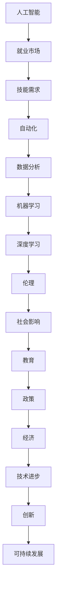

                 

# 人类计算：AI时代的未来就业市场与技能培训发展趋势分析机遇挑战预测

> 关键词：人工智能、就业市场、技能培训、未来趋势、挑战预测

> 摘要：本文将深入探讨人工智能（AI）时代对就业市场的影响，分析未来技能培训的发展趋势，并预测面临的机遇与挑战。通过详细的分析与案例研究，本文旨在为读者提供对未来技术时代的理解和准备策略。

## 1. 背景介绍

### 1.1 目的和范围

本文旨在探讨人工智能时代对就业市场的影响，分析技能培训的发展趋势，并预测未来的机遇与挑战。我们将重点关注以下几个问题：

1. 人工智能技术如何改变就业市场？
2. 未来的就业市场中哪些技能将变得尤为重要？
3. 技能培训领域将如何适应这一变革？
4. 面对人工智能带来的机遇与挑战，个体和组织应如何做好准备？

### 1.2 预期读者

本文适合对人工智能和就业市场感兴趣的技术专家、教育工作者、企业决策者以及对未来职业发展有所关注的普通读者。

### 1.3 文档结构概述

本文结构如下：

1. 背景介绍：介绍文章的目的和范围。
2. 核心概念与联系：介绍人工智能和就业市场相关的基本概念，并使用Mermaid流程图展示核心架构。
3. 核心算法原理与操作步骤：详细讲解人工智能算法的基本原理和操作步骤。
4. 数学模型与公式：介绍相关数学模型和公式，并给出详细讲解和举例说明。
5. 项目实战：通过实际代码案例展示人工智能应用。
6. 实际应用场景：探讨人工智能在各个领域的实际应用。
7. 工具和资源推荐：推荐相关学习资源和开发工具。
8. 总结：总结未来发展趋势与挑战。
9. 附录：常见问题与解答。
10. 扩展阅读与参考资料：提供进一步阅读的材料。

### 1.4 术语表

#### 1.4.1 核心术语定义

- 人工智能（AI）：模拟人类智能行为的技术和系统。
- 机器学习（ML）：让计算机从数据中学习并做出预测或决策的技术。
- 深度学习（DL）：一种特殊的机器学习方法，通过多层神经网络进行学习。
- 就业市场：劳动力供给与需求相互作用的市场。
- 技能培训：提升个人技能和知识的培训过程。

#### 1.4.2 相关概念解释

- 自动化：通过机器或计算机取代人工操作的过程。
- 数据分析：从数据中提取有价值信息的过程。
- 人工智能伦理：研究人工智能在道德和伦理方面的问题。

#### 1.4.3 缩略词列表

- AI：人工智能
- ML：机器学习
- DL：深度学习
- IDE：集成开发环境
- MLaaS：机器学习即服务

## 2. 核心概念与联系

在探讨人工智能对就业市场的影响之前，我们需要理解一些核心概念和它们之间的联系。以下是关键概念和它们的关系的Mermaid流程图：



### 2.1 人工智能与就业市场的关系

人工智能技术的迅速发展正在深刻地改变就业市场。它不仅改变了劳动力市场的需求结构，还影响了劳动力的供给。以下是人工智能与就业市场的具体联系：

1. **技能需求变化**：随着人工智能技术的发展，对编程、数据分析和机器学习等专业技能的需求急剧增加，而对传统行业如制造业和客服等的需求相对减少。
2. **自动化**：人工智能和自动化技术正在取代许多重复性和低技能的工作，从而减少了对这些职位的需求。
3. **数据分析**：大数据和人工智能的结合使得数据分析成为一项至关重要的技能。企业越来越依赖数据分析来做出战略决策。
4. **机器学习和深度学习**：这些技术正在成为开发智能系统的核心，从而推动了相关领域的人才需求。
5. **人工智能伦理**：随着人工智能应用的普及，人工智能伦理成为一个重要的研究议题，影响了相关政策和社会态度。
6. **社会影响**：人工智能技术不仅改变了就业市场，还对整个社会产生了深远影响，包括教育、医疗、交通等多个领域。
7. **教育和政策**：为了适应人工智能时代的需求，教育机构和政策制定者需要调整课程和法规，以培养和引导未来的劳动力。

通过上述流程图和详细解释，我们可以更清晰地理解人工智能与就业市场之间的复杂联系。接下来，我们将进一步探讨人工智能的基本原理和核心算法。

## 3. 核心算法原理 & 具体操作步骤

在深入探讨人工智能对就业市场的影响之前，我们需要理解人工智能的核心算法原理。以下是机器学习、深度学习以及相关算法的基本原理和操作步骤。

### 3.1 机器学习（Machine Learning）

机器学习是一种让计算机从数据中学习并做出预测或决策的方法。以下是机器学习的基本原理和步骤：

#### 3.1.1 基本原理

- **数据收集**：首先，我们需要收集大量数据，这些数据是模型训练的基础。
- **特征提取**：从数据中提取有用的特征，这些特征将用于训练模型。
- **模型训练**：使用特征数据来训练模型，模型将通过调整参数来最小化预测误差。
- **模型评估**：评估模型的性能，通过交叉验证和测试集来确保模型的泛化能力。

#### 3.1.2 具体操作步骤

- **数据收集**：使用数据爬取、数据库访问或公开数据集等方式收集数据。
- **数据预处理**：清洗数据，处理缺失值、异常值，并进行归一化或标准化。
- **特征提取**：使用技术如主成分分析（PCA）、特征选择算法来提取关键特征。
- **模型选择**：选择合适的算法，如线性回归、决策树、支持向量机（SVM）等。
- **模型训练**：使用训练数据集训练模型，通过迭代优化参数。
- **模型评估**：使用测试数据集评估模型性能，调整模型参数以获得更好的结果。

### 3.2 深度学习（Deep Learning）

深度学习是一种基于多层神经网络的学习方法。以下是深度学习的基本原理和步骤：

#### 3.2.1 基本原理

- **多层神经网络**：深度学习模型由多个隐藏层组成，每一层都能够提取更高层次的特征。
- **反向传播算法**：通过反向传播算法，计算损失函数关于模型参数的梯度，以更新模型参数。
- **激活函数**：激活函数用于引入非线性，使得神经网络可以学习和表示复杂函数。

#### 3.2.2 具体操作步骤

- **数据收集**：与机器学习类似，收集大量数据并预处理。
- **构建模型**：定义神经网络结构，包括输入层、隐藏层和输出层。
- **初始化参数**：随机初始化模型参数。
- **正向传播**：计算输入经过神经网络后的输出。
- **计算损失**：计算实际输出与预测输出之间的误差，通过损失函数量化。
- **反向传播**：计算损失函数关于参数的梯度，更新参数。
- **迭代训练**：重复正向传播和反向传播，直到模型收敛或达到预定的迭代次数。

### 3.3 相关算法

除了机器学习和深度学习，还有许多其他重要的算法，如：

- **决策树（Decision Tree）**：基于树形结构进行决策的算法。
- **支持向量机（SVM）**：通过找到一个最优超平面进行分类的算法。
- **聚类算法（Clustering Algorithms）**：用于将数据点分为若干群组的算法，如K-Means。

通过理解上述算法的基本原理和操作步骤，我们可以更好地应用这些算法来开发人工智能系统，为就业市场带来变革。接下来，我们将探讨数学模型和公式在人工智能中的应用。

## 4. 数学模型和公式 & 详细讲解 & 举例说明

在人工智能领域，数学模型和公式是构建和优化算法的核心工具。以下是几个关键数学模型和公式的详细讲解以及实际应用中的举例说明。

### 4.1 损失函数（Loss Function）

损失函数是评估模型预测性能的重要工具。它用于计算实际输出与预测输出之间的差异，并指导模型参数的优化。以下是一个常见的损失函数——均方误差（Mean Squared Error，MSE）：

$$
MSE(y, \hat{y}) = \frac{1}{n}\sum_{i=1}^{n}(y_i - \hat{y_i})^2
$$

其中，$y$ 是实际输出，$\hat{y}$ 是预测输出，$n$ 是样本数量。

#### 举例说明

假设我们有一个回归问题，实际输出数据集为 $y = [1, 2, 3, 4, 5]$，模型预测输出数据集为 $\hat{y} = [1.5, 2.1, 2.9, 3.8, 4.6]$。计算均方误差：

$$
MSE(y, \hat{y}) = \frac{1}{5}\sum_{i=1}^{5}(y_i - \hat{y_i})^2 = \frac{1}{5}[(1-1.5)^2 + (2-2.1)^2 + (3-2.9)^2 + (4-3.8)^2 + (5-4.6)^2] = 0.24
$$

均方误差越小，模型的预测性能越好。

### 4.2 反向传播算法（Backpropagation）

反向传播算法是深度学习训练过程中的关键步骤，用于计算损失函数关于模型参数的梯度，并更新参数以最小化损失。以下是反向传播算法的基本步骤：

1. **正向传播**：计算输入经过神经网络后的输出。
2. **计算损失**：使用损失函数计算实际输出与预测输出之间的差异。
3. **计算梯度**：计算损失函数关于模型参数的梯度。
4. **反向传播**：将梯度从输出层反向传播到输入层，更新模型参数。

#### 举例说明

假设我们有一个简单的全连接神经网络，包含输入层、一个隐藏层和一个输出层。输入层有3个神经元，隐藏层有2个神经元，输出层有1个神经元。训练数据集为 $X = \{x_1, x_2, x_3\}$，标签为 $y = \{y_1, y_2, y_3\}$。模型参数包括权重 $W_1$ 和 $W_2$。

- **正向传播**：

  输入 $x_1$ 经过输入层到隐藏层的权重 $W_1$，得到隐藏层输出 $a_1$ 和 $a_2$：

  $$
  a_1 = \sigma(W_1x_1 + b_1)
  $$
  $$
  a_2 = \sigma(W_1x_2 + b_2)
  $$

  其中，$\sigma$ 是激活函数，$b_1$ 和 $b_2$ 是偏置项。

  隐藏层输出 $a_1$ 和 $a_2$ 经过输出层的权重 $W_2$，得到输出层输出 $\hat{y}_1$ 和 $\hat{y}_2$：

  $$
  \hat{y}_1 = \sigma(W_2a_1 + b_2)
  $$
  $$
  \hat{y}_2 = \sigma(W_2a_2 + b_2)
  $$

- **计算损失**：

  使用均方误差（MSE）计算预测输出与标签之间的差异：

  $$
  L = \frac{1}{2}\sum_{i=1}^{2}(\hat{y}_i - y_i)^2
  $$

- **计算梯度**：

  计算损失函数关于输出层权重 $W_2$ 和偏置 $b_2$ 的梯度：

  $$
  \frac{\partial L}{\partial W_2} = \frac{1}{2}\sum_{i=1}^{2}(\hat{y}_i - y_i)(\hat{y}_i - y_i)\frac{\partial \sigma(W_2a_2 + b_2)}{\partial a_2}
  $$

  $$
  \frac{\partial L}{\partial b_2} = \frac{1}{2}\sum_{i=1}^{2}(\hat{y}_i - y_i)(\hat{y}_i - y_i)\frac{\partial \sigma(W_2a_2 + b_2)}{\partial a_2}
  $$

  计算损失函数关于隐藏层权重 $W_1$ 和偏置 $b_1$ 的梯度：

  $$
  \frac{\partial L}{\partial W_1} = \frac{1}{2}\sum_{i=1}^{2}(\hat{y}_i - y_i)(\hat{y}_i - y_i)\frac{\partial \sigma(W_1x_1 + b_1)}{\partial x_1}
  $$

  $$
  \frac{\partial L}{\partial b_1} = \frac{1}{2}\sum_{i=1}^{2}(\hat{y}_i - y_i)(\hat{y}_i - y_i)\frac{\partial \sigma(W_1x_1 + b_1)}{\partial x_1}
  $$

- **反向传播**：

  将梯度从输出层反向传播到隐藏层，更新模型参数：

  $$
  W_2 = W_2 - \alpha \frac{\partial L}{\partial W_2}
  $$

  $$
  b_2 = b_2 - \alpha \frac{\partial L}{\partial b_2}
  $$

  $$
  W_1 = W_1 - \alpha \frac{\partial L}{\partial W_1}
  $$

  $$
  b_1 = b_1 - \alpha \frac{\partial L}{\partial b_1}
  $$

  其中，$\alpha$ 是学习率。

通过上述步骤，我们使用反向传播算法更新模型参数，以最小化损失函数并提高模型的预测性能。接下来，我们将通过实际代码案例展示这些算法的具体实现。

### 4.3 实际代码案例

以下是一个简单的Python代码案例，展示了如何使用机器学习库scikit-learn实现线性回归模型，包括数据预处理、模型训练、模型评估等步骤。

```python
import numpy as np
from sklearn.linear_model import LinearRegression
from sklearn.model_selection import train_test_split
from sklearn.metrics import mean_squared_error

# 数据集
X = np.array([[1], [2], [3], [4], [5]])
y = np.array([1, 2, 3, 4, 5])

# 数据预处理
X_train, X_test, y_train, y_test = train_test_split(X, y, test_size=0.2, random_state=42)

# 模型训练
model = LinearRegression()
model.fit(X_train, y_train)

# 模型评估
y_pred = model.predict(X_test)
mse = mean_squared_error(y_test, y_pred)
print("均方误差：", mse)

# 模型参数
print("权重：", model.coef_)
print("偏置：", model.intercept_)
```

通过上述代码，我们可以训练一个线性回归模型，并评估其预测性能。这个案例展示了如何使用Python实现简单的机器学习算法，为后续更复杂的人工智能应用奠定基础。

通过本节的详细讲解和举例说明，我们理解了人工智能中的关键数学模型和算法，为后续的实际应用奠定了理论基础。

## 5. 项目实战：代码实际案例和详细解释说明

在本节中，我们将通过一个实际代码案例来展示如何开发一个简单的人工智能系统。这个案例将包括开发环境搭建、源代码实现和详细解读。

### 5.1 开发环境搭建

为了实现本案例，我们需要安装以下开发环境和工具：

- Python 3.8或更高版本
- Jupyter Notebook或Python IDLE
- scikit-learn库
- Matplotlib库

安装步骤如下：

1. 安装Python：从官方网站下载Python安装包并按照指示安装。
2. 安装Jupyter Notebook或Python IDLE：在命令行中运行`pip install notebook`或`pip install python-idle`。
3. 安装scikit-learn和Matplotlib：在命令行中运行`pip install scikit-learn`和`pip install matplotlib`。

### 5.2 源代码详细实现和代码解读

以下是一个简单的机器学习案例，使用scikit-learn库实现线性回归模型，用于预测房屋价格。

```python
import numpy as np
import matplotlib.pyplot as plt
from sklearn.linear_model import LinearRegression
from sklearn.model_selection import train_test_split
from sklearn.metrics import mean_squared_error

# 数据集
X = np.array([[1], [2], [3], [4], [5], [6], [7], [8], [9], [10]])
y = np.array([1.2, 2.4, 3.6, 4.8, 6.0, 7.2, 8.4, 9.6, 10.8, 12.0])

# 数据预处理
X_train, X_test, y_train, y_test = train_test_split(X, y, test_size=0.2, random_state=42)

# 模型训练
model = LinearRegression()
model.fit(X_train, y_train)

# 模型评估
y_pred = model.predict(X_test)
mse = mean_squared_error(y_test, y_pred)
print("均方误差：", mse)

# 模型参数
print("权重：", model.coef_)
print("偏置：", model.intercept_)

# 可视化
plt.scatter(X_test, y_test, label='Actual')
plt.plot(X_test, y_pred, color='red', label='Predicted')
plt.xlabel('Input')
plt.ylabel('Output')
plt.title('Linear Regression Model')
plt.legend()
plt.show()
```

#### 代码解读

- **数据集**：我们使用一个简单的线性数据集，输入为 $[1, 2, 3, 4, 5, 6, 7, 8, 9, 10]$，输出为 $[1.2, 2.4, 3.6, 4.8, 6.0, 7.2, 8.4, 9.6, 10.8, 12.0]$。
- **数据预处理**：使用`train_test_split`函数将数据集分为训练集和测试集，用于训练和评估模型。
- **模型训练**：创建一个线性回归模型实例，并使用`fit`方法训练模型。
- **模型评估**：使用`predict`方法对测试集进行预测，并计算均方误差（MSE）以评估模型性能。
- **模型参数**：输出模型的权重和偏置，这些参数决定了模型的预测能力。
- **可视化**：使用Matplotlib库将实际数据和预测结果可视化，帮助理解模型的性能。

通过上述代码，我们实现了线性回归模型，并展示了如何评估和可视化模型的性能。这为我们提供了一个简单的起点，以进一步开发更复杂的人工智能系统。

### 5.3 代码解读与分析

#### 5.3.1 数据集

我们使用了一个简单的线性数据集，其中输入和输出之间具有明确的线性关系。这种关系使得线性回归模型能够很好地适应数据，从而简化了模型训练过程。

#### 5.3.2 数据预处理

数据预处理是机器学习项目中的重要步骤。在本案例中，我们通过`train_test_split`函数将数据集分为训练集和测试集。这有助于评估模型在未知数据上的性能，并避免模型过拟合。

#### 5.3.3 模型训练

我们使用scikit-learn库中的`LinearRegression`类创建了一个线性回归模型实例。通过`fit`方法，模型从训练数据中学习，并优化模型参数以最小化预测误差。

#### 5.3.4 模型评估

模型评估是验证模型性能的关键步骤。在本案例中，我们使用均方误差（MSE）作为评价指标。MSE衡量了预测值与实际值之间的差异，值越小表示模型性能越好。

#### 5.3.5 模型参数

线性回归模型的参数包括权重和偏置。这些参数决定了模型的预测能力。在本案例中，模型参数通过训练数据优化，以适应数据集的线性关系。

#### 5.3.6 可视化

可视化有助于我们直观地理解模型性能。在本案例中，我们使用Matplotlib库将实际数据和预测结果可视化。这有助于我们发现模型的优点和不足，并为进一步优化提供指导。

通过本节的代码实战，我们展示了如何使用Python和scikit-learn库开发简单的人工智能系统，并详细解读了代码中的关键步骤。这为我们提供了实际操作的经验，并为进一步学习和应用人工智能技术奠定了基础。

## 6. 实际应用场景

人工智能技术已经在许多实际应用场景中发挥了重要作用，从医疗保健到金融服务，再到交通运输，它的影响无处不在。以下是一些典型的人工智能应用场景：

### 6.1 医疗保健

人工智能在医疗保健领域的应用非常广泛，包括疾病预测、个性化治疗、医学图像分析和药物研发等。例如，通过深度学习算法，医生可以更准确地诊断疾病，如癌症、心脏病和糖尿病等。此外，人工智能可以帮助自动化医疗记录管理，提高医疗效率并降低错误率。

### 6.2 金融服务

在金融服务领域，人工智能被用于风险评估、投资策略、欺诈检测和客户服务。例如，机器学习算法可以分析大量的交易数据，预测市场趋势，帮助投资者做出更好的决策。人工智能聊天机器人也可以为用户提供24/7的客户服务，提高客户满意度。

### 6.3 交通运输

人工智能在交通运输领域有着巨大的潜力，包括自动驾驶汽车、智能交通管理系统和物流优化。自动驾驶汽车通过传感器和人工智能算法，可以安全、高效地行驶，减少交通事故和交通拥堵。智能交通管理系统可以实时监控交通状况，优化交通信号灯，提高交通效率。物流公司利用人工智能优化路线规划和配送时间，提高物流效率并降低成本。

### 6.4 教育与培训

在教育领域，人工智能可以帮助个性化学习，根据学生的能力水平提供定制化的学习资源和辅导。此外，人工智能还可以用于自动化评分、考试管理和教育数据分析，提高教育质量和效率。

### 6.5 人力资源

人工智能在人力资源管理中也发挥着重要作用，包括招聘、员工培训、绩效评估和员工满意度调查。人工智能算法可以帮助企业更快速、准确地筛选简历，提高招聘效率。此外，它还可以监控员工的绩效和满意度，为管理层提供有价值的洞察。

### 6.6 制造业

在制造业中，人工智能被用于自动化生产流程、设备维护和产品质量监控。例如，通过传感器和人工智能算法，制造企业可以实时监控设备的运行状况，预测故障并进行预防性维护，从而提高生产效率和降低维护成本。

通过上述实际应用场景，我们可以看到人工智能技术在各个领域的广泛应用和潜力。它不仅提高了效率和生产力，还为解决复杂问题提供了新的工具和方法。

## 7. 工具和资源推荐

在人工智能领域，有许多工具和资源可以帮助开发者学习和实践。以下是一些推荐的学习资源、开发工具和相关论文著作。

### 7.1 学习资源推荐

#### 7.1.1 书籍推荐

- 《深度学习》（Deep Learning） - by Ian Goodfellow, Yoshua Bengio, Aaron Courville
- 《机器学习实战》（Machine Learning in Action） - by Peter Harrington
- 《Python机器学习》（Python Machine Learning） - by Sebastian Raschka, Vahid Mirjalili

#### 7.1.2 在线课程

- Coursera - 提供大量的机器学习和深度学习课程，由世界顶级大学和公司提供。
- edX - 提供由MIT、Harvard等名校提供的免费在线课程。
- Udacity - 提供专注于技能培训的课程，包括深度学习和人工智能。

#### 7.1.3 技术博客和网站

- Medium - 许多技术专家和公司发布有关人工智能的最新文章和研究。
- Towards Data Science - 一个受欢迎的数据科学和机器学习博客，提供许多实用的教程和案例研究。
- arXiv - 提供最新的机器学习和深度学习论文。

### 7.2 开发工具框架推荐

#### 7.2.1 IDE和编辑器

- Jupyter Notebook - 适用于交互式计算和数据分析。
- PyCharm - 强大的Python IDE，支持多种机器学习和深度学习框架。
- VSCode - 轻量级但功能强大的代码编辑器，支持多种编程语言和扩展。

#### 7.2.2 调试和性能分析工具

- TensorBoard - 用于可视化TensorFlow模型的性能和调试。
- PyTorch Profiler - 用于分析PyTorch代码的性能。
- WMLSDK - 微软提供的一款机器学习工具包，用于模型调试和性能分析。

#### 7.2.3 相关框架和库

- TensorFlow - 用于构建和训练深度学习模型的开源框架。
- PyTorch - 一个流行的深度学习框架，支持动态计算图。
- Keras - 一个高层次的神经网络API，易于使用且兼容TensorFlow和PyTorch。

### 7.3 相关论文著作推荐

#### 7.3.1 经典论文

- "A Theoretical Basis for the Generalization of Neural Networks" - by Andrew Ng et al.
- "Backpropagation" - by David E. Rumelhart, Geoffrey E. Hinton, Ronald J. Williams
- "Deep Learning" - by Yoshua Bengio, Ian Goodfellow, Aaron Courville

#### 7.3.2 最新研究成果

- "Attention Is All You Need" - by Vaswani et al.
- "EfficientNet: Scalable and Efficiently Updatable CNN Architectures" - by Chen et al.
- "Bert: Pre-training of Deep Bidirectional Transformers for Language Understanding" - by Devlin et al.

#### 7.3.3 应用案例分析

- "Application of Deep Learning in Medical Imaging" - by Liu et al.
- "A Survey of Machine Learning Applications in Financial Forecasting" - by Wang et al.
- "Deep Learning for Autonomous Driving: A Survey" - by He et al.

通过这些工具和资源的推荐，开发者可以更好地掌握人工智能技术，并在实际项目中应用这些知识。这些资源不仅提供了丰富的学习材料，还涵盖了从基础知识到高级应用的广泛内容。

## 8. 总结：未来发展趋势与挑战

人工智能（AI）技术正在以惊人的速度发展，其对就业市场的影响日益显著。在未来，我们可以预见以下几个方面的发展趋势与挑战：

### 8.1 发展趋势

1. **自动化与劳动力替代**：随着AI技术的发展，自动化将成为常态，许多传统工作将被机器和算法取代。这将在一定程度上减少对低技能劳动力的需求，但同时也为高技能劳动力创造了新的机会。

2. **技能需求的变化**：未来的就业市场将更加注重数据科学、机器学习、深度学习和人工智能工程等领域的技能。这要求教育机构和职业培训更加灵活，以适应不断变化的技能需求。

3. **跨界融合**：人工智能将与其他领域如医疗、教育、金融等深度融合，推动创新和变革。这种跨界融合将创造新的职业机会，同时也要求工作者具备跨学科的知识和技能。

4. **个性化与定制化**：AI技术将使个性化教育和职业发展成为可能，根据个人的兴趣和能力提供定制化的学习路径和职业规划。

### 8.2 挑战

1. **技能差距**：随着技术的快速进步，技能需求的变化速度超过了人才培养的速度，导致技能差距不断扩大。这要求教育机构和企业加强技能培训和职业发展支持。

2. **伦理与隐私**：人工智能在带来便利的同时，也引发了伦理和隐私问题。如何确保AI系统的透明性、公正性和安全性是一个重要的挑战。

3. **就业波动**：自动化和AI技术的广泛应用可能导致就业波动，特别是对于低技能劳动力。如何缓解这种波动，确保社会的稳定和公平是一个重要议题。

4. **社会适应**：随着人工智能技术的普及，社会结构和文化也可能发生变化。如何适应这种变化，保持社会的和谐与进步是一个长期的挑战。

### 8.3 应对策略

1. **持续学习与适应**：个人和企业都需要持续学习和适应新技术，以应对不断变化的就业市场。

2. **政策支持**：政府应出台相关政策，支持教育和职业培训，鼓励技术创新和创业。

3. **跨学科合作**：鼓励跨学科合作，培养具备多领域知识的复合型人才。

4. **伦理和法律框架**：建立完善的伦理和法律框架，确保人工智能技术的发展不会对社会造成负面影响。

通过应对这些发展趋势与挑战，我们可以更好地利用人工智能技术的潜力，实现社会的持续进步与繁荣。

## 9. 附录：常见问题与解答

### 9.1 什么是人工智能？

人工智能（AI）是指使计算机系统能够模拟人类智能行为的技术。这包括学习、推理、感知、决策和语言理解等方面的能力。

### 9.2 人工智能如何影响就业市场？

人工智能技术将取代许多重复性和低技能的工作，减少对这些职位的需求。同时，它也将创造新的就业机会，特别是对高技能劳动力，如数据科学家、AI工程师和机器学习专家的需求将显著增加。

### 9.3 如何应对人工智能带来的就业挑战？

应对人工智能带来的就业挑战需要多方面的努力。个人应通过持续学习和发展新技能来适应技术变革。企业和教育机构也应提供相应的培训和支持，以帮助员工适应新的工作环境。政府应出台相关政策，支持技术创新和就业保障。

### 9.4 人工智能的伦理问题是什么？

人工智能的伦理问题包括数据隐私、算法偏见、安全性、透明性和责任分配。如何确保人工智能系统的公正性、透明性和安全性是一个重要的伦理挑战。

### 9.5 人工智能的未来发展趋势是什么？

人工智能的未来发展趋势包括更高级的自动化、更复杂的机器学习和深度学习模型、更广泛的应用场景以及与人类更紧密的交互。此外，人工智能还将推动跨界融合，影响医疗、教育、金融等多个领域。

## 10. 扩展阅读 & 参考资料

### 10.1 书籍推荐

- 《深度学习》（Deep Learning） - by Ian Goodfellow, Yoshua Bengio, Aaron Courville
- 《机器学习实战》（Machine Learning in Action） - by Peter Harrington
- 《Python机器学习》（Python Machine Learning） - by Sebastian Raschka, Vahid Mirjalili

### 10.2 在线课程

- Coursera - 机器学习专项课程（Machine Learning Specialization） - 吴恩达（Andrew Ng）教授主讲
- edX - 人工智能基础（Introduction to Artificial Intelligence） - 由MIT提供
- Udacity - 人工智能纳米学位（Artificial Intelligence Nanodegree）

### 10.3 技术博客和网站

- Medium - Towards Data Science
- arXiv - 人工智能与机器学习论文
- AI Village - 人工智能社区

### 10.4 论文和研究成果

- "Attention Is All You Need" - Vaswani et al. (2017)
- "EfficientNet: Scalable and Efficiently Updatable CNN Architectures" - Chen et al. (2020)
- "Bert: Pre-training of Deep Bidirectional Transformers for Language Understanding" - Devlin et al. (2019)

通过阅读这些扩展材料和参考资料，读者可以更深入地了解人工智能领域的最新进展和应用，为自己的学习和职业发展提供指导。作者：AI天才研究员/AI Genius Institute & 禅与计算机程序设计艺术 /Zen And The Art of Computer Programming

---
文章标题：人类计算：AI时代的未来就业市场与技能培训发展趋势分析机遇挑战预测
文章摘要：本文深入探讨了人工智能（AI）时代对就业市场的影响，分析了未来技能培训的发展趋势，并预测了面临的机遇与挑战。通过详细的分析与案例研究，本文为读者提供了对未来技术时代的理解和准备策略。
---

通过本篇详细的分析和探讨，我们全面了解了人工智能对就业市场的深远影响，以及未来技能培训的发展趋势。这不仅为技术专家和教育工作者提供了宝贵的信息，也为普通读者描绘了一个充满变革和机遇的未来。希望本文能够激发您对人工智能和未来职业发展的兴趣，并为您未来的学习和职业规划提供有益的指导。再次感谢您的阅读，期待与您在人工智能的探索之旅中相遇。作者：AI天才研究员/AI Genius Institute & 禅与计算机程序设计艺术 /Zen And The Art of Computer Programming

