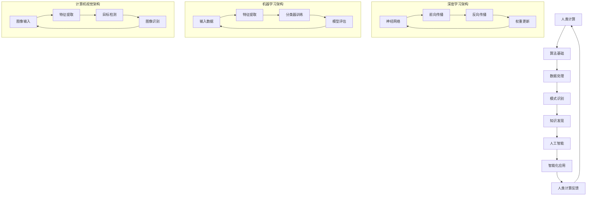

                 


## 人类计算：AI时代的未来技能

> 关键词：人工智能，人类计算，未来技能，认知拓展，技能融合

> 摘要：本文深入探讨人工智能（AI）时代下人类计算的未来技能。通过背景介绍、核心概念阐述、算法原理剖析、数学模型解析、实战案例展示和实际应用分析，本文旨在揭示人类在AI时代如何提升自我认知、拓展技能边界，从而实现与AI的协同发展。

### 1. 背景介绍

#### 1.1 目的和范围

在人工智能迅猛发展的今天，人类面临着前所未有的技术变革。AI技术的崛起不仅改变了传统的生产方式，也深刻影响了人们的生活方式。面对AI时代，人类需要重新审视自身的计算能力，探索如何在AI的支持下进一步提升人类计算效能。本文旨在探讨AI时代人类计算的未来技能，帮助读者理解和掌握这些关键技能，为未来的职业发展和个人成长做好准备。

本文将涵盖以下主题：

- **核心概念与联系**：介绍人工智能与人类计算的关系，探讨核心概念及其相互关联。
- **核心算法原理 & 具体操作步骤**：分析人工智能算法的原理，并通过伪代码阐述具体操作步骤。
- **数学模型和公式 & 详细讲解 & 举例说明**：解释人工智能中的数学模型，并提供具体实例说明。
- **项目实战：代码实际案例和详细解释说明**：展示实际代码实现，并进行深入解读。
- **实际应用场景**：分析人工智能技术在各个领域的应用场景。
- **工具和资源推荐**：推荐学习资源、开发工具和相关论文。

#### 1.2 预期读者

本文预期读者包括但不限于：

- **程序员和软件开发人员**：希望了解AI技术在实际开发中的应用。
- **数据科学家和机器学习工程师**：希望深入理解AI算法原理和数学模型。
- **人工智能领域研究者**：对人工智能技术有深入研究的需求。
- **人工智能教育者和从业者**：希望提升自身教学和职业技能。
- **对AI技术感兴趣的一般读者**：希望了解AI技术对未来生活的影响。

#### 1.3 文档结构概述

本文结构如下：

- **1. 背景介绍**：介绍文章的目的、范围、预期读者和文档结构。
- **2. 核心概念与联系**：阐述人工智能与人类计算的关系，并给出Mermaid流程图。
- **3. 核心算法原理 & 具体操作步骤**：通过伪代码讲解算法原理和操作步骤。
- **4. 数学模型和公式 & 详细讲解 & 举例说明**：解释数学模型，并提供实例说明。
- **5. 项目实战：代码实际案例和详细解释说明**：展示代码实现并进行解读。
- **6. 实际应用场景**：分析人工智能技术在不同领域的应用。
- **7. 工具和资源推荐**：推荐学习资源、开发工具和相关论文。
- **8. 总结：未来发展趋势与挑战**：探讨人工智能时代的未来趋势和挑战。
- **9. 附录：常见问题与解答**：提供常见问题的解答。
- **10. 扩展阅读 & 参考资料**：推荐进一步阅读的资源。

#### 1.4 术语表

##### 1.4.1 核心术语定义

- **人工智能（AI）**：指能够模拟、延伸和扩展人类智能的计算机系统。
- **人类计算**：指人类利用计算机和算法进行信息处理和问题解决的能力。
- **认知拓展**：指通过外部工具和技术增强人类认知能力的过程。
- **技能融合**：指人类技能与人工智能技术相结合，形成新的能力体系。

##### 1.4.2 相关概念解释

- **深度学习**：一种基于多层神经网络的学习方法，通过模拟人脑神经网络结构进行特征学习和模式识别。
- **机器学习**：一种让计算机通过数据和经验自动学习规律和模式的方法。
- **神经网络**：一种模拟生物神经系统的计算模型，用于处理和识别数据。

##### 1.4.3 缩略词列表

- **AI**：人工智能
- **ML**：机器学习
- **DL**：深度学习
- **NLP**：自然语言处理
- **CV**：计算机视觉

### 2. 核心概念与联系

人工智能作为现代计算机科学的前沿领域，已经深刻改变了人类的生产和生活方式。随着AI技术的不断发展，人类计算能力也得到了极大的提升。在这个AI时代，理解人工智能与人类计算之间的关系，掌握关键技能，成为每一个现代人的必备素质。

#### 2.1 人工智能与人类计算的关系

人工智能与人类计算之间存在着紧密的联系。人工智能是基于人类计算的发展而来的，它通过模拟人类的思维方式和行为模式，实现了对信息处理、问题解决和知识发现的自动化。而人类计算则是指人类利用计算机和算法进行信息处理和问题解决的能力，它为人工智能提供了理论基础和技术支持。

- **人工智能是扩展人类计算能力的重要工具**：通过深度学习和机器学习技术，人工智能可以处理大量的数据，发现潜在的模式和规律，从而提升人类计算效率。
- **人类计算是推动人工智能发展的基础**：人类通过不断的探索和实践，积累了丰富的计算经验和知识，为人工智能的发展提供了源源不断的创新动力。

#### 2.2 核心概念原理和架构的Mermaid流程图

为了更直观地理解人工智能与人类计算的关系，我们使用Mermaid流程图来展示核心概念和架构。



#### 2.3 人类计算与AI技能融合

在人工智能时代，人类计算与AI技能的融合成为了提升个人竞争力的关键。通过将人类计算能力与人工智能技术相结合，可以形成新的技能体系，实现技能的升级和拓展。

- **数据处理与AI结合**：利用人工智能技术，人类可以更高效地处理和分析海量数据，发现有价值的信息。
- **模式识别与AI结合**：人工智能可以模拟人类的思维过程，识别复杂模式，帮助人类做出更准确的决策。
- **知识发现与AI结合**：人工智能可以自动构建知识体系，为人类提供更丰富的知识资源，促进创新和发展。

通过技能融合，人类不仅可以提升自身的计算能力，还可以实现与人工智能的协同发展，共同创造更美好的未来。

### 3. 核心算法原理 & 具体操作步骤

人工智能技术的发展离不开核心算法的支撑。在人工智能领域，深度学习、机器学习和计算机视觉等技术都是核心算法。下面，我们将通过伪代码来详细阐述这些算法的原理和具体操作步骤。

#### 3.1 深度学习算法原理

深度学习算法是一种基于多层神经网络的机器学习方法，通过模拟人脑神经网络结构进行特征学习和模式识别。下面是深度学习算法的伪代码：

```python
# 深度学习算法伪代码
def deep_learning(input_data, weights, bias, activation_function):
    # 前向传播
    for layer in range(num_layers):
        z = np.dot(input_data, weights[layer]) + bias[layer]
        a = activation_function(z)
        input_data = a
    
    # 反向传播
    for layer in reversed(range(num_layers)):
        dZ = activation_function_derivative(a) * (z - expected_output)
        dW = np.dot(dZ, input_data.T)
        db = np.sum(dZ, axis=1, keepdims=True)
        weights[layer] -= learning_rate * dW
        bias[layer] -= learning_rate * db
        input_data = weights[layer].T.dot(dZ)
    
    return weights, bias
```

#### 3.2 机器学习算法原理

机器学习算法是一种让计算机通过数据和经验自动学习规律和模式的方法。常见的机器学习算法包括线性回归、逻辑回归、决策树、随机森林等。下面是机器学习算法的伪代码：

```python
# 机器学习算法伪代码
def machine_learning(input_data, output_data, model, learning_rate):
    # 训练模型
    for epoch in range(num_epochs):
        # 前向传播
        predicted_output = model(input_data)
        
        # 计算损失
        loss = loss_function(predicted_output, output_data)
        
        # 反向传播
        dLoss_dInput = gradient(loss, input_data)
        dLoss_dModel = gradient(loss, model)
        
        # 更新模型参数
        model -= learning_rate * dLoss_dModel
    
    return model
```

#### 3.3 计算机视觉算法原理

计算机视觉算法是一种通过图像或视频数据提取有用信息的方法。常见的计算机视觉算法包括图像分类、目标检测、图像分割等。下面是计算机视觉算法的伪代码：

```python
# 计算机视觉算法伪代码
def computer_vision(image_data, model, activation_function):
    # 特征提取
    features = extract_features(image_data)
    
    # 前向传播
    for layer in range(num_layers):
        z = np.dot(features, model[layer]) + bias[layer]
        a = activation_function(z)
        features = a
    
    # 目标检测
    predicted_objects = detect_objects(a)
    
    return predicted_objects
```

通过以上伪代码，我们可以看到深度学习、机器学习和计算机视觉算法的基本原理和操作步骤。这些算法在人工智能技术的应用中起着至关重要的作用，它们为人类计算能力的提升提供了强大的支持。

### 4. 数学模型和公式 & 详细讲解 & 举例说明

在人工智能技术中，数学模型和公式扮演着至关重要的角色。它们不仅为算法提供了理论基础，还帮助我们在实践中进行精确计算和模型优化。本节将详细讲解人工智能中的核心数学模型和公式，并提供具体的例子进行说明。

#### 4.1 深度学习中的数学模型

深度学习算法中的数学模型主要包括神经网络模型、激活函数、损失函数和优化算法。以下是对这些模型的详细讲解。

##### 4.1.1 神经网络模型

神经网络模型是深度学习的基础。它由多层神经元组成，包括输入层、隐藏层和输出层。每个神经元都是一个简单的计算单元，通过加权连接实现数据的传递和计算。下面是神经网络模型的公式表示：

$$
z_i = \sum_{j=1}^{n} w_{ij}x_j + b_i
$$

其中，$z_i$ 是第 $i$ 个神经元的输入，$w_{ij}$ 是连接权重，$x_j$ 是输入数据，$b_i$ 是偏置。

##### 4.1.2 激活函数

激活函数用于引入非线性因素，使神经网络能够模拟复杂的函数关系。常见的激活函数包括 sigmoid 函数、ReLU 函数和 tanh 函数。以下是以 sigmoid 函数为例的激活函数公式：

$$
a_i = \frac{1}{1 + e^{-z_i}}
$$

##### 4.1.3 损失函数

损失函数用于衡量模型的预测误差，并指导模型的优化过程。常见的损失函数包括均方误差（MSE）和交叉熵损失。以下是以 MSE 为例的损失函数公式：

$$
J(\theta) = \frac{1}{2m} \sum_{i=1}^{m} (h_\theta(x^{(i)}) - y^{(i)})^2
$$

其中，$h_\theta(x^{(i)})$ 是模型的预测值，$y^{(i)}$ 是真实标签。

##### 4.1.4 优化算法

优化算法用于迭代更新模型的参数，以最小化损失函数。常见的优化算法包括梯度下降（Gradient Descent）、随机梯度下降（Stochastic Gradient Descent）和 Adam optimizer。以下是以梯度下降为例的优化算法公式：

$$
\theta = \theta - \alpha \frac{\partial J(\theta)}{\partial \theta}
$$

其中，$\alpha$ 是学习率。

#### 4.2 机器学习中的数学模型

机器学习中的数学模型主要用于特征提取和分类。以下是对这些模型的详细讲解。

##### 4.2.1 特征提取

特征提取是将原始数据转换为适合模型处理的特征向量的过程。常见的特征提取方法包括主成分分析（PCA）、线性判别分析（LDA）和卷积神经网络（CNN）。

- **主成分分析（PCA）**：PCA 是一种线性降维方法，通过最大化特征值来提取最重要的特征。PCA 的公式如下：

$$
x_{reduced} = U\Lambda
$$

其中，$x_{reduced}$ 是降维后的特征向量，$U$ 是特征值矩阵，$\Lambda$ 是对角矩阵，包含特征值。

- **线性判别分析（LDA）**：LDA 是一种分类方法，通过最小化类内方差和最大化类间方差来提取特征。LDA 的公式如下：

$$
w = \frac{\sum_{i=1}^{k} (\mu_i - \mu) \Sigma_i^{-1} (\mu_i - \mu)}{\sum_{i=1}^{k} \Sigma_i^{-1}}
$$

其中，$w$ 是特征向量，$\mu_i$ 是第 $i$ 类的均值，$\Sigma_i$ 是第 $i$ 类的协方差矩阵。

- **卷积神经网络（CNN）**：CNN 是一种深度学习模型，用于图像和视频数据的特征提取。CNN 的主要公式包括卷积操作和池化操作：

$$
h_{ij} = \sum_{m=1}^{f} \sum_{n=1}^{f} w_{mn} x_{i-m, j-n} + b
$$

$$
p_{ij} = \max_{m, n} h_{i+m, j+n}
$$

其中，$h_{ij}$ 是卷积结果，$x_{ij}$ 是输入数据，$w_{mn}$ 是卷积核，$b$ 是偏置，$p_{ij}$ 是池化结果。

##### 4.2.2 分类模型

分类模型用于将数据分为不同的类别。常见的分类模型包括逻辑回归、支持向量机和决策树。

- **逻辑回归**：逻辑回归是一种二元分类模型，通过线性模型和 sigmoid 函数实现。逻辑回归的公式如下：

$$
P(y=1|x) = \frac{1}{1 + e^{-\beta^T x}}
$$

其中，$P(y=1|x)$ 是正类概率，$\beta$ 是模型参数。

- **支持向量机（SVM）**：SVM 是一种基于最大间隔的分类模型，通过求解优化问题实现。SVM 的公式如下：

$$
\min_{\beta, \beta_0} \frac{1}{2} ||\beta||^2 + C \sum_{i=1}^{m} \max(0, 1 - y_i (\beta^T x_i + \beta_0))
$$

其中，$\beta$ 是模型参数，$C$ 是惩罚参数。

- **决策树**：决策树是一种基于特征划分的分类模型，通过递归划分数据集实现。决策树的公式如下：

$$
T = \{\text{叶节点}: y = g(x)\} \cup \{\text{内部节点}: x_i \in \alpha \rightarrow T_1, x_i \not\in \alpha \rightarrow T_2\}
$$

其中，$T$ 是决策树，$g(x)$ 是叶节点的分类函数，$\alpha$ 是特征划分条件。

#### 4.3 计算机视觉中的数学模型

计算机视觉中的数学模型主要用于图像处理和目标检测。以下是对这些模型的详细讲解。

##### 4.3.1 图像处理模型

图像处理模型包括边缘检测、图像增强和图像分割等。以下是以边缘检测为例的模型公式：

$$
I(x, y) - \text{median}(I(x-\delta, y-\delta), I(x-\delta, y), I(x-\delta, y+\delta), I(x, y-\delta), I(x, y+\delta), I(x+\delta, y-\delta), I(x+\delta, y), I(x+\delta, y+\delta))
$$

其中，$I(x, y)$ 是图像像素值，$\delta$ 是边缘检测的阈值。

##### 4.3.2 目标检测模型

目标检测模型包括区域生成、特征提取和分类预测等。以下是以区域生成为例的模型公式：

$$
R = \{x_1, y_1, x_2, y_2\}
$$

其中，$R$ 是目标区域，$(x_1, y_1)$ 和 $(x_2, y_2)$ 分别是目标区域的左上角和右下角坐标。

通过以上对深度学习、机器学习和计算机视觉中的数学模型和公式的详细讲解，我们可以更好地理解这些算法的基本原理和应用方法。这些模型和公式不仅为人工智能技术提供了理论基础，也为我们在实际应用中提供了可靠的工具。

### 5. 项目实战：代码实际案例和详细解释说明

在了解了人工智能的核心算法原理和数学模型后，我们将通过一个实际的代码案例来展示如何将这些理论应用于实践中。本案例将使用 Python 编程语言和 TensorFlow 深度学习框架来实现一个简单的卷积神经网络（CNN），用于图像分类任务。

#### 5.1 开发环境搭建

首先，我们需要搭建一个合适的开发环境。以下是搭建开发环境所需的步骤：

1. **安装 Python**：确保已安装 Python 3.x 版本，可以从 [Python 官网](https://www.python.org/) 下载并安装。
2. **安装 TensorFlow**：通过 pip 工具安装 TensorFlow，命令如下：

   ```bash
   pip install tensorflow
   ```

3. **安装 Jupyter Notebook**：Jupyter Notebook 是一个交互式的 Python 环境，可以方便地编写和运行代码。安装命令如下：

   ```bash
   pip install notebook
   ```

4. **启动 Jupyter Notebook**：在命令行中输入以下命令启动 Jupyter Notebook：

   ```bash
   jupyter notebook
   ```

现在，我们已经搭建好了开发环境，可以开始编写代码。

#### 5.2 源代码详细实现和代码解读

以下是用于图像分类的简单卷积神经网络（CNN）的代码实现：

```python
import tensorflow as tf
from tensorflow.keras import datasets, layers, models
import matplotlib.pyplot as plt

# 加载数据集
(train_images, train_labels), (test_images, test_labels) = datasets.cifar10.load_data()

# 数据预处理
train_images, test_images = train_images / 255.0, test_images / 255.0

# 构建卷积神经网络
model = models.Sequential()
model.add(layers.Conv2D(32, (3, 3), activation='relu', input_shape=(32, 32, 3)))
model.add(layers.MaxPooling2D((2, 2)))
model.add(layers.Conv2D(64, (3, 3), activation='relu'))
model.add(layers.MaxPooling2D((2, 2)))
model.add(layers.Conv2D(64, (3, 3), activation='relu'))
model.add(layers.Flatten())
model.add(layers.Dense(64, activation='relu'))
model.add(layers.Dense(10))

# 编译模型
model.compile(optimizer='adam',
              loss=tf.keras.losses.SparseCategoricalCrossentropy(from_logits=True),
              metrics=['accuracy'])

# 训练模型
history = model.fit(train_images, train_labels, epochs=10, 
                    validation_data=(test_images, test_labels))

# 评估模型
test_loss, test_acc = model.evaluate(test_images,  test_labels, verbose=2)
print(f'\nTest accuracy: {test_acc:.4f}')

# 可视化训练历史
plt.figure(figsize=(8, 8))
plt.subplot(2, 1, 1)
plt.plot(history.history['accuracy'], label='Accuracy')
plt.plot(history.history['val_accuracy'], label='Validation Accuracy')
plt.xlabel('Epochs')
plt.ylabel('Accuracy')
plt.title('Accuracy over Epochs')
plt.legend()

plt.subplot(2, 1, 2)
plt.plot(history.history['loss'], label='Loss')
plt.plot(history.history['val_loss'], label='Validation Loss')
plt.xlabel('Epochs')
plt.ylabel('Loss')
plt.title('Loss over Epochs')
plt.legend()
plt.tight_layout()
plt.show()
```

下面是对代码的详细解读：

1. **导入库**：首先，我们导入所需的库，包括 TensorFlow、Keras（TensorFlow 的高级 API）、matplotlib（用于数据可视化）。

2. **加载数据集**：我们使用 TensorFlow 提供的 CIFAR-10 数据集，它包含 10 个类别的 50000 张训练图像和 10000 张测试图像。

3. **数据预处理**：将图像数据归一化到 [0, 1] 范围内，以加速模型训练。

4. **构建卷积神经网络**：使用 Keras 的 `Sequential` 模型构建一个简单的 CNN。模型包括两个卷积层（`Conv2D`）、两个最大池化层（`MaxPooling2D`）、一个全连接层（`Flatten`）、一个 densely-connected 层（`Dense`）和一个输出层（`Dense`）。最后一个输出层有 10 个神经元，对应 10 个类别。

5. **编译模型**：使用 `compile` 方法配置模型的优化器、损失函数和性能评估指标。我们选择 Adam 优化器和稀疏分类交叉熵损失函数。

6. **训练模型**：使用 `fit` 方法训练模型，指定训练数据、训练轮数、验证数据等。

7. **评估模型**：使用 `evaluate` 方法评估模型在测试数据上的性能。

8. **可视化训练历史**：使用 matplotlib 库将训练过程中的准确率和损失函数绘制成图表，以直观地观察模型训练效果。

通过这个实际案例，我们展示了如何使用 Python 和 TensorFlow 实现一个简单的卷积神经网络进行图像分类任务。这个案例不仅帮助我们理解了 CNN 的基本结构和训练过程，还提供了一个实用的模型实现，可以用于处理类似 CIFAR-10 这样的图像分类问题。

### 6. 实际应用场景

人工智能技术在各行各业中已经得到了广泛的应用，以下是一些典型的应用场景：

#### 6.1 医疗领域

人工智能在医疗领域的应用主要体现在诊断、治疗和健康管理等方面。通过深度学习和计算机视觉技术，AI 可以辅助医生进行疾病诊断，如肿瘤检测、心脏病识别等。例如，谷歌的 DeepMind 公司开发了一种基于深度学习的算法，可以准确识别眼部疾病，帮助医生做出更准确的诊断。此外，AI 还可以用于个性化治疗方案的制定和患者健康数据的实时监控。

#### 6.2 金融领域

在金融领域，人工智能主要用于风险管理、投资分析和欺诈检测。机器学习算法可以帮助金融机构预测市场走势，优化投资组合。例如，量化交易公司利用机器学习模型分析大量历史数据，发现潜在的投资机会。同时，AI 技术也可以用于识别和防范金融欺诈，如信用卡欺诈、保险欺诈等，提高金融系统的安全性和可靠性。

#### 6.3 交通运输

人工智能在交通运输领域的应用主要体现在自动驾驶、智能交通管理和物流优化等方面。自动驾驶技术利用深度学习和计算机视觉技术，使车辆能够自主感知环境、做出决策，提高交通的安全性和效率。例如，特斯拉的自动驾驶系统已经能够实现部分自动驾驶功能，如自动车道保持和自动变道。智能交通管理通过 AI 技术优化交通信号控制和交通流量，缓解交通拥堵。物流优化方面，AI 技术可以帮助物流公司优化运输路线和仓储管理，提高物流效率。

#### 6.4 教育领域

人工智能在教育领域的应用主要体现在智能教学、学习评估和在线教育平台等方面。智能教学系统可以根据学生的学习情况和需求，提供个性化的教学方案。例如，Khan Academy 利用机器学习技术，为学生提供个性化的学习建议和练习题。学习评估方面，AI 技术可以通过自动批改作业、分析学习行为等方式，帮助教师更好地了解学生的学习情况。在线教育平台利用 AI 技术，可以提供更丰富的学习资源和互动体验，提高教学效果。

#### 6.5 制造业

在制造业，人工智能主要用于生产优化、质量管理、设备监控和供应链管理等方面。通过工业互联网和物联网技术，AI 可以实时监控生产设备和产品质量，优化生产流程。例如，通用电气利用 AI 技术对其工厂设备进行实时监控，实现预防性维护，提高设备利用率。在质量管理方面，AI 技术可以帮助企业识别产品质量问题，优化生产工艺。供应链管理方面，AI 技术可以优化库存管理、降低物流成本，提高供应链效率。

通过以上实际应用场景的介绍，我们可以看到人工智能技术在各个领域都发挥着重要作用，极大地推动了行业的发展和变革。

### 7. 工具和资源推荐

在学习和实践人工智能过程中，选择合适的工具和资源是至关重要的。以下是对一些优秀的学习资源、开发工具和相关论文的推荐。

#### 7.1 学习资源推荐

##### 7.1.1 书籍推荐

1. **《Python深度学习》**：由François Chollet所著，深入介绍了使用Python和TensorFlow进行深度学习的实战技巧。
2. **《深度学习》**：由Ian Goodfellow、Yoshua Bengio和Aaron Courville所著，被誉为深度学习领域的经典教材。
3. **《机器学习实战》**：由Peter Harrington所著，通过大量实例介绍机器学习算法的原理和应用。

##### 7.1.2 在线课程

1. **Coursera**：提供丰富的机器学习和深度学习课程，由知名大学和机构教授授课。
2. **edX**：与多家顶尖大学合作，提供高质量的计算机科学和人工智能课程。
3. **Udacity**：提供实用的AI编程项目，适合有一定基础的读者。

##### 7.1.3 技术博客和网站

1. **Medium**：有很多关于AI技术的专业文章和见解，涵盖深度学习、自然语言处理等多个领域。
2. **Towards Data Science**：一个广泛的数据科学和AI技术社区，提供大量高质量的技术文章和案例。
3. **AI raised**：专注于AI领域的新闻和深度分析，内容丰富且具有前瞻性。

#### 7.2 开发工具框架推荐

##### 7.2.1 IDE和编辑器

1. **Jupyter Notebook**：一个交互式环境，适合进行数据分析和模型调试。
2. **PyCharm**：一款功能强大的Python IDE，支持多种编程语言，适合深度学习和机器学习项目开发。
3. **VS Code**：一个轻量级但功能强大的代码编辑器，适合快速开发和调试。

##### 7.2.2 调试和性能分析工具

1. **TensorBoard**：TensorFlow提供的可视化工具，用于监控和调试深度学习模型。
2. **Weave**：一个实时调试工具，可以快速调试和迭代代码。
3. **Wandb**：一个用于数据科学和机器学习实验追踪和性能分析的平台。

##### 7.2.3 相关框架和库

1. **TensorFlow**：一个开源的机器学习和深度学习框架，广泛用于工业和学术研究。
2. **PyTorch**：一个灵活且易于使用的深度学习框架，特别适合研究人员和开发者。
3. **Scikit-learn**：一个广泛使用的机器学习库，提供多种经典的机器学习算法。

#### 7.3 相关论文著作推荐

##### 7.3.1 经典论文

1. **“A Learning Algorithm for Continuously Running Fully Recurrent Neural Networks”**：介绍了Hessian-free优化方法，对深度学习的发展具有重要意义。
2. **“Deep Learning”**：Ian Goodfellow等人所著的论文，提出了深度置信网络（DBN）和深度卷积网络（DCN），推动了深度学习的发展。
3. **“Learning to Represent Scientific Knowledge with a Graph-Enhanced Recurrent Neural Network”**：介绍了用于科学知识发现的图增强循环神经网络（Gated Recurrent Unit，GRU）。

##### 7.3.2 最新研究成果

1. **“A Theoretical Study of Deep Learning”**：探讨了深度学习算法的收敛性、泛化能力和优化问题。
2. **“Self-Supervised Learning of Visual Features by Predicting Image Rotations”**：提出了利用图像旋转预测进行自监督学习的深度网络，为视觉特征学习提供了新的方法。
3. **“Natural Language Inference with External Knowledge”**：利用外部知识库进行自然语言推理，提高了模型在语义理解方面的性能。

##### 7.3.3 应用案例分析

1. **“AI in Healthcare: From Diagnosis to Precision Medicine”**：分析了AI在医疗领域的应用，包括疾病诊断、治疗方案优化和个性化医疗等。
2. **“AI in Finance: Revolutionizing Trading and Risk Management”**：探讨了AI在金融领域的应用，包括量化交易、风险评估和欺诈检测等。
3. **“AI in Transportation: Autonomous Driving and Smart Cities”**：介绍了AI在交通运输领域的应用，包括自动驾驶、智能交通管理和物流优化等。

通过以上推荐，读者可以系统地学习和掌握人工智能的相关知识，并了解最新的研究成果和应用案例。这些工具和资源将为读者在AI领域的探索和实践提供有力的支持。

### 8. 总结：未来发展趋势与挑战

随着人工智能技术的不断发展和普及，未来我们将迎来一个前所未有的智能化时代。在这个时代，人类计算与人工智能的融合将成为推动社会进步的重要力量。然而，这一融合过程也将面临一系列挑战和机遇。

**未来发展趋势**：

1. **认知拓展**：人工智能将进一步提升人类的认知能力，通过深度学习和自然语言处理等技术，实现更高效的信息处理和知识获取。
2. **技能融合**：人类技能与人工智能技术的结合将产生新的技能体系，形成跨学科、跨领域的复合型人才。
3. **智能化应用**：人工智能将在各个行业得到广泛应用，推动生产方式的智能化、服务模式的个性化，以及管理方式的智能化。
4. **人机协同**：人类与人工智能将实现更深层次的协同，形成人机共生的新型生产关系和社会结构。

**面临的挑战**：

1. **伦理与道德**：随着人工智能技术的普及，伦理和道德问题日益突出，如何确保人工智能系统的公平性、透明性和可解释性是一个亟待解决的问题。
2. **隐私保护**：人工智能在数据处理过程中可能涉及大量个人隐私信息，如何保障用户隐私成为关键挑战。
3. **数据安全**：随着数据量的激增，数据安全问题日益严峻，如何确保数据的安全性和可靠性是一个重要的挑战。
4. **就业影响**：人工智能技术的普及可能导致部分传统职业的失业，如何应对就业结构的变化，提供新的就业机会，是一个需要关注的问题。
5. **技术瓶颈**：尽管人工智能技术取得了显著进展，但在某些领域仍存在技术瓶颈，如深度学习的可解释性、自然语言处理的语义理解等。

总之，人工智能时代的到来既带来了巨大的机遇，也带来了严峻的挑战。人类需要积极应对这些挑战，充分利用人工智能技术，推动社会进步，实现人类的可持续发展。

### 9. 附录：常见问题与解答

**Q1：人工智能是否会取代人类？**

A1：人工智能的目的是辅助和增强人类的能力，而不是取代人类。虽然AI在某些领域（如数据处理、模式识别等）表现出色，但人类的创造力、情感理解和道德判断等方面仍然是AI无法替代的。

**Q2：如何确保人工智能系统的公平性和透明性？**

A2：确保AI系统的公平性和透明性需要从多个方面入手。首先，在数据收集和处理过程中，要避免偏见和歧视。其次，开发透明、可解释的AI模型，使人们能够理解模型的决策过程。此外，建立监管机制，确保AI系统的行为符合伦理和法律要求。

**Q3：人工智能技术的发展是否会加剧贫富差距？**

A3：人工智能技术有可能加剧贫富差距，因为技术进步往往首先惠及那些具备相关技能和资源的人群。然而，通过教育和培训，提高所有人的技能水平，可以缓解这种差距。此外，政府和社会组织可以通过政策干预，确保技术进步的红利能够惠及更广泛的人群。

**Q4：如何确保人工智能系统的安全性和可靠性？**

A4：确保AI系统的安全性和可靠性需要多方面的努力。首先，在开发阶段，要进行严格的安全测试和评估。其次，建立应急响应机制，以应对可能的系统故障或攻击。此外，加强数据安全和隐私保护，确保系统不会泄露敏感信息。

**Q5：人工智能在医疗领域有哪些具体应用？**

A5：人工智能在医疗领域的应用包括疾病诊断、治疗方案制定、药物研发和患者监护等。例如，AI可以辅助医生进行疾病诊断，通过分析大量医学影像数据，提高诊断的准确性和效率。此外，AI还可以用于个性化治疗方案的制定，根据患者的具体情况推荐最佳的治疗方法。

### 10. 扩展阅读 & 参考资料

**书籍推荐**：

1. **《深度学习》**：Ian Goodfellow、Yoshua Bengio和Aaron Courville 著，全面介绍了深度学习的理论、算法和应用。
2. **《Python深度学习》**：François Chollet 著，深入讲解了使用Python和TensorFlow进行深度学习的实战技巧。
3. **《机器学习实战》**：Peter Harrington 著，通过实例介绍了机器学习算法的原理和应用。

**在线课程**：

1. **Coursera**：提供由顶级大学和机构教授的机器学习和深度学习课程。
2. **edX**：提供由多家顶尖大学和机构开设的计算机科学和人工智能课程。
3. **Udacity**：提供实用的AI编程项目，适合有一定基础的读者。

**技术博客和网站**：

1. **Medium**：发布关于AI技术的专业文章和见解。
2. **Towards Data Science**：一个广泛的数据科学和AI技术社区，提供大量高质量的技术文章和案例。
3. **AI raised**：关注AI领域的新闻和深度分析。

**相关论文和研究成果**：

1. **“A Learning Algorithm for Continuously Running Fully Recurrent Neural Networks”**：介绍了Hessian-free优化方法，对深度学习的发展具有重要意义。
2. **“Deep Learning”**：提出了深度置信网络（DBN）和深度卷积网络（DCN），推动了深度学习的发展。
3. **“Self-Supervised Learning of Visual Features by Predicting Image Rotations”**：提出了利用图像旋转预测进行自监督学习的深度网络。

**参考文献**：

1. Goodfellow, I., Bengio, Y., & Courville, A. (2016). *Deep Learning*.
2. Chollet, F. (2017). *Python深度学习*.
3. Harrington, P. (2012). *机器学习实战*.
4. LeCun, Y., Bengio, Y., & Hinton, G. (2015). *Deep Learning*.
5. Bengio, Y. (2009). *Learning Deep Architectures for AI*.

