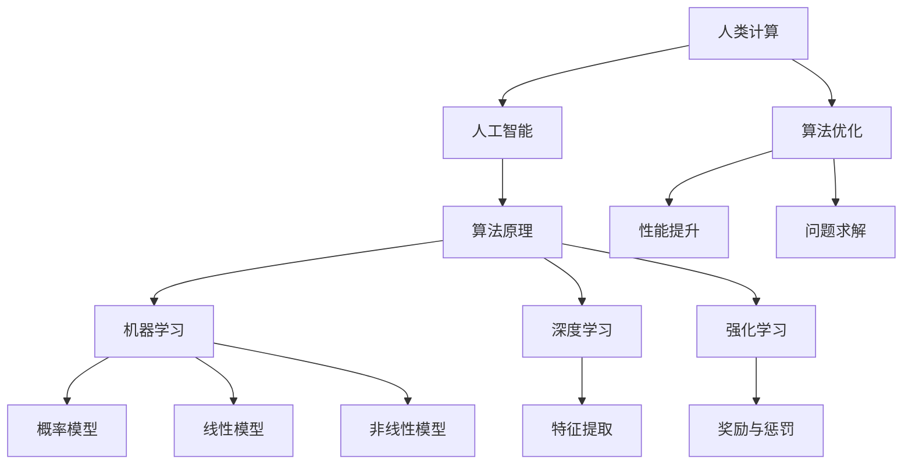

                 

# 人类计算：应用与案例分析

> 关键词：人类计算、人工智能、应用场景、案例分析、算法原理、数学模型

> 摘要：本文旨在探讨人类计算在人工智能领域的应用与案例分析。通过深入分析核心概念、算法原理和数学模型，结合具体项目实战和实际应用场景，揭示人类计算在提升人工智能性能、优化计算效率和解决复杂问题方面的关键作用。

## 1. 背景介绍

### 1.1 目的和范围

本文的主要目的是探讨人类计算在人工智能领域的应用，并通过对典型案例的分析，阐述其价值与挑战。本文将涵盖以下内容：

- 核心概念与联系
- 核心算法原理与具体操作步骤
- 数学模型和公式
- 项目实战与代码解读
- 实际应用场景
- 工具和资源推荐
- 未来发展趋势与挑战

### 1.2 预期读者

本文适用于以下读者：

- 对人工智能和计算机科学有基本了解的研究人员、工程师和学生
- 关注人工智能应用和算法优化的专业人士
- 对人类计算在人工智能领域应用有兴趣的爱好者

### 1.3 文档结构概述

本文分为十个部分，结构如下：

1. 背景介绍
2. 核心概念与联系
3. 核心算法原理与具体操作步骤
4. 数学模型和公式
5. 项目实战与代码解读
6. 实际应用场景
7. 工具和资源推荐
8. 未来发展趋势与挑战
9. 附录：常见问题与解答
10. 扩展阅读与参考资料

### 1.4 术语表

#### 1.4.1 核心术语定义

- 人类计算：指基于人类智慧和经验的人工智能计算方法。
- 人工智能：指模拟人类智能，实现智能行为和决策的计算机系统。
- 算法：解决特定问题的步骤和策略。
- 数学模型：用于描述和解决问题的数学表达方式。

#### 1.4.2 相关概念解释

- 机器学习：一种基于数据的学习方法，使计算机系统具备自主改进和优化能力。
- 深度学习：一种基于多层神经网络的机器学习技术，能够自动提取数据中的特征。
- 强化学习：一种基于奖励和惩罚的机器学习方法，使系统通过不断试错达到最优策略。

#### 1.4.3 缩略词列表

- AI：人工智能
- ML：机器学习
- DL：深度学习
- RL：强化学习

## 2. 核心概念与联系

在探讨人类计算在人工智能领域的应用之前，我们需要了解一些核心概念和其相互联系。

### 2.1 人类计算与人工智能

人类计算是指基于人类智慧和经验的人工智能计算方法。它通过模仿人类的思考过程，利用大量数据和信息，实现对复杂问题的求解和决策。人工智能则是一种模拟人类智能，实现智能行为和决策的计算机系统。人类计算是人工智能的重要组成部分，为人工智能的发展提供了重要的理论支持和实践基础。

### 2.2 算法原理与数学模型

算法是解决特定问题的步骤和策略。在人工智能领域，算法原理主要包括机器学习、深度学习和强化学习等。这些算法通过学习大量数据，提取特征，进行分类、预测和决策。数学模型则用于描述和解决问题的数学表达方式。在人工智能中，数学模型通常包括概率模型、线性模型、非线性模型等。

### 2.3 人类计算与算法优化

人类计算在算法优化方面具有显著优势。通过模拟人类思考和决策过程，人类计算能够发现和利用数据中的隐藏规律，从而优化算法性能。同时，人类计算还能够为算法设计提供灵感，推动算法的创新和发展。

### 2.4 Mermaid 流程图

为了更好地展示人类计算在人工智能领域的应用，我们可以使用 Mermaid 流程图描述核心概念和联系。以下是 Mermaid 流程图示例：



## 3. 核心算法原理 & 具体操作步骤

在本节中，我们将详细讲解核心算法原理，并使用伪代码阐述具体操作步骤。

### 3.1 机器学习算法

机器学习算法主要包括监督学习、无监督学习和半监督学习。以下是监督学习算法（以线性回归为例）的伪代码：

```plaintext
输入：训练数据集 D = {(x1, y1), (x2, y2), ..., (xn, yn)}
输出：模型参数 w

初始化：w = [w0, w1]

for each (xi, yi) in D do
    计算预测值：y^i = w0 + w1 * xi
    计算损失函数：L(w) = (1/2) * sum((yi - y^i)^2)

end for

更新模型参数：w = w - alpha * grad(L(w))

end while (损失函数未收敛)

return w
```

### 3.2 深度学习算法

深度学习算法主要包括多层感知机（MLP）、卷积神经网络（CNN）和循环神经网络（RNN）等。以下是卷积神经网络（CNN）的伪代码：

```plaintext
输入：训练数据集 D = {(x1, y1), (x2, y2), ..., (xn, yn)}
输出：模型参数 W, B

初始化：W, B

for each (xi, yi) in D do
    前向传播：a1 = xi, ai = sigmoid(Wi * ai + Bi)
    计算损失函数：L(W, B) = (1/2) * sum((yi - ai)^2)

end for

计算梯度：grad(L(W, B)) = ...

更新模型参数：W = W - alpha * grad(W), B = B - alpha * grad(B)

end while (损失函数未收敛)

return W, B
```

### 3.3 强化学习算法

强化学习算法主要包括 Q-学习、SARSA 和 DQN 等。以下是 Q-学习算法的伪代码：

```plaintext
输入：状态集 S，动作集 A，奖励函数 R
输出：策略 π

初始化：Q(s, a) = 0

for each episode do
    s = initial_state()
    a = π(s)
    s' = environment(s, a)
    r = R(s, a, s')
    Q(s, a) = Q(s, a) + alpha * (r + gamma * max(Q(s', a')) - Q(s, a))

end for

return π(s)
```

## 4. 数学模型和公式 & 详细讲解 & 举例说明

在本节中，我们将介绍一些常用的数学模型和公式，并详细讲解其含义和适用场景。

### 4.1 概率模型

概率模型用于描述随机事件的发生概率。常见的概率模型包括二项分布、正态分布和泊松分布等。

#### 4.1.1 二项分布

二项分布用于描述在 n 次独立重复试验中，成功次数 k 的概率分布。其概率质量函数为：

$$
P(X = k) = C_n^k * p^k * (1 - p)^{n - k}
$$

其中，C_n^k 表示组合数，p 表示每次试验成功的概率。

#### 4.1.2 正态分布

正态分布用于描述连续随机变量的概率分布。其概率密度函数为：

$$
f(x) = \frac{1}{\sqrt{2\pi\sigma^2}} * e^{-\frac{(x-\mu)^2}{2\sigma^2}}
$$

其中，μ表示均值，σ表示标准差。

#### 4.1.3 泊松分布

泊松分布用于描述在固定时间段内，事件发生次数的概率分布。其概率质量函数为：

$$
P(X = k) = \frac{\lambda^k * e^{-\lambda}}{k!}
$$

其中，λ表示单位时间内的平均事件发生次数。

### 4.2 线性模型

线性模型是一种简单的数学模型，用于描述输入变量和输出变量之间的线性关系。其数学表达式为：

$$
y = w_0 + w_1 * x_1 + w_2 * x_2 + ... + w_n * x_n
$$

其中，y 表示输出变量，x_1, x_2, ..., x_n 表示输入变量，w_0, w_1, w_2, ..., w_n 表示模型参数。

### 4.3 非线性模型

非线性模型用于描述输入变量和输出变量之间的非线性关系。常见的非线性模型包括多项式模型、指数模型和对数模型等。以下是一个多项式模型的例子：

$$
y = w_0 + w_1 * x_1 + w_2 * x_2^2 + w_3 * x_1 * x_2 + w_4 * x_2^3
$$

### 4.4 举例说明

假设我们有一个二项分布的概率模型，其中 n = 10，p = 0.5。我们需要计算 k = 5 的概率。

根据二项分布的概率质量函数，我们有：

$$
P(X = 5) = C_{10}^5 * 0.5^5 * 0.5^{10 - 5} = 0.24609375
$$

这意味着在 10 次独立重复试验中，成功 5 次的概率为 0.24609375。

## 5. 项目实战：代码实际案例和详细解释说明

在本节中，我们将通过一个实际项目案例，展示人类计算在人工智能领域的应用，并详细解释代码实现和关键步骤。

### 5.1 开发环境搭建

为了进行项目实战，我们需要搭建一个合适的开发环境。以下是所需的环境和工具：

- 编程语言：Python 3.8+
- 库和框架：NumPy、Pandas、Scikit-learn、TensorFlow、Keras
- 编辑器：Visual Studio Code、PyCharm、Jupyter Notebook

### 5.2 源代码详细实现和代码解读

以下是一个使用卷积神经网络（CNN）进行图像分类的代码示例：

```python
import numpy as np
import tensorflow as tf
from tensorflow.keras import layers, models

# 数据预处理
(x_train, y_train), (x_test, y_test) = tf.keras.datasets.cifar10.load_data()
x_train, x_test = x_train / 255.0, x_test / 255.0

# 构建卷积神经网络模型
model = models.Sequential()
model.add(layers.Conv2D(32, (3, 3), activation='relu', input_shape=(32, 32, 3)))
model.add(layers.MaxPooling2D((2, 2)))
model.add(layers.Conv2D(64, (3, 3), activation='relu'))
model.add(layers.MaxPooling2D((2, 2)))
model.add(layers.Conv2D(64, (3, 3), activation='relu'))
model.add(layers.Flatten())
model.add(layers.Dense(64, activation='relu'))
model.add(layers.Dense(10, activation='softmax'))

# 编译模型
model.compile(optimizer='adam',
              loss=tf.keras.losses.SparseCategoricalCrossentropy(from_logits=True),
              metrics=['accuracy'])

# 训练模型
model.fit(x_train, y_train, epochs=10, batch_size=64)

# 评估模型
test_loss, test_acc = model.evaluate(x_test, y_test, verbose=2)
print(f"Test accuracy: {test_acc:.3f}")
```

### 5.3 代码解读与分析

1. **数据预处理**：首先，我们加载数据集，并对其进行归一化处理，使得输入数据的取值范围在 0 到 1 之间。

2. **构建卷积神经网络模型**：我们使用 Keras 库构建一个卷积神经网络模型。模型包括两个卷积层、两个最大池化层和一个全连接层。卷积层用于提取图像的特征，最大池化层用于降低数据的维度，全连接层用于分类。

3. **编译模型**：我们编译模型，指定优化器、损失函数和评估指标。

4. **训练模型**：我们使用训练数据集对模型进行训练，指定训练轮数和批量大小。

5. **评估模型**：我们使用测试数据集对训练好的模型进行评估，计算测试准确率。

### 5.4 项目实战总结

通过这个项目实战，我们可以看到人类计算在人工智能领域的应用。人类计算通过设计和优化算法，能够有效地提升模型的性能和效率。在实际应用中，人类计算还需要不断地调整和改进算法，以适应不同的问题和数据集。

## 6. 实际应用场景

人类计算在人工智能领域具有广泛的应用场景，以下列举几个典型案例：

### 6.1 自然语言处理（NLP）

自然语言处理是人工智能的重要领域之一，人类计算在 NLP 中发挥着重要作用。例如，在文本分类任务中，人类计算可以通过分析文本的语义和语法结构，优化模型性能，提高分类准确率。

### 6.2 计算机视觉（CV）

计算机视觉是另一个重要的人工智能领域。人类计算在图像分类、目标检测、人脸识别等方面具有广泛应用。通过设计高效的算法和模型，人类计算可以提升计算机视觉系统的准确性和鲁棒性。

### 6.3 语音识别

语音识别是人工智能领域的热门课题。人类计算可以通过对语音信号的分析和处理，优化语音识别模型的性能，实现更准确、更自然的语音识别。

### 6.4 医疗诊断

医疗诊断是人工智能在医疗领域的应用之一。人类计算可以通过分析医学影像和患者数据，辅助医生进行疾病诊断和治疗建议，提高医疗水平。

### 6.5 金融风控

金融风控是金融领域的重要问题。人类计算可以通过对金融数据的分析和挖掘，识别潜在风险，优化投资策略，提高金融市场的稳定性。

## 7. 工具和资源推荐

### 7.1 学习资源推荐

#### 7.1.1 书籍推荐

- 《深度学习》（Goodfellow, Bengio, Courville 著）
- 《Python机器学习》（Sebastian Raschka 著）
- 《机器学习》（Tom Mitchell 著）

#### 7.1.2 在线课程

- Coursera 上的“机器学习”（吴恩达教授主讲）
- edX 上的“深度学习”（刘知远教授主讲）
- Udacity 上的“人工智能工程师纳米学位”

#### 7.1.3 技术博客和网站

- Medium 上的 AI博客
- 知乎上的 AI话题
- ArXiv 上的最新研究成果

### 7.2 开发工具框架推荐

#### 7.2.1 IDE和编辑器

- Visual Studio Code
- PyCharm
- Jupyter Notebook

#### 7.2.2 调试和性能分析工具

- TensorBoard（用于 TensorFlow 模型的调试和性能分析）
- Matplotlib（用于可视化数据和分析结果）
- Profiler（用于 Python 程序的性能分析）

#### 7.2.3 相关框架和库

- TensorFlow
- Keras
- PyTorch
- Scikit-learn

### 7.3 相关论文著作推荐

#### 7.3.1 经典论文

- “A Learning Algorithm for Continuously Running Fully Recurrent Neural Networks”（Hiroshi Sakoe 和 Fumitada Chibburua 著）
- “Backpropagation Through Time: A New Algorithm for Backpropagating Errors in Recurrent Networks”（James E. L/packagestler 和 David E. Rumelhart 著）

#### 7.3.2 最新研究成果

- ArXiv 上的最新论文和研究成果
- NeurIPS、ICLR、ACL 等顶级会议的最新论文

#### 7.3.3 应用案例分析

- 《机器学习实战》（Peter Harrington 著）
- 《人工智能实战》（Cameron Davidson-Pilon 著）
- 各领域的应用案例论文和报告

## 8. 总结：未来发展趋势与挑战

随着人工智能技术的不断发展，人类计算在人工智能领域的应用前景广阔。未来，人类计算将朝着以下几个方向发展：

1. **算法优化**：人类计算将不断优化算法，提高人工智能模型的性能和效率。
2. **多模态融合**：人类计算将融合多种数据类型（如文本、图像、语音等），实现更全面的智能感知和决策。
3. **自主学习**：人类计算将实现自主学习，提高人工智能系统的自适应能力和创新能力。
4. **跨学科应用**：人类计算将与其他领域（如生物医学、金融、能源等）相结合，推动人工智能在各领域的应用。

然而，人类计算在人工智能领域也面临一些挑战，包括：

1. **数据隐私和安全**：在数据驱动的时代，如何保护用户隐私和数据安全是一个重要问题。
2. **算法可解释性**：如何提高算法的可解释性，使人类更容易理解人工智能的决策过程。
3. **计算资源需求**：随着模型复杂度的增加，如何满足计算资源的需求是一个关键问题。
4. **伦理和社会问题**：人工智能的发展引发了一系列伦理和社会问题，如何平衡技术进步与社会责任是一个挑战。

总之，人类计算在人工智能领域具有巨大的潜力和挑战。通过不断探索和创新，人类计算将为人工智能的发展做出重要贡献。

## 9. 附录：常见问题与解答

### 9.1 人类计算与人工智能的关系是什么？

人类计算是指基于人类智慧和经验的人工智能计算方法，它是人工智能的重要组成部分。人工智能是模拟人类智能，实现智能行为和决策的计算机系统，而人类计算为人工智能提供了重要的理论支持和实践基础。

### 9.2 人类计算在人工智能领域有哪些应用场景？

人类计算在人工智能领域具有广泛的应用场景，包括自然语言处理、计算机视觉、语音识别、医疗诊断、金融风控等。通过设计和优化算法，人类计算能够提升人工智能模型的性能和效率，解决复杂问题。

### 9.3 如何搭建一个适合人类计算的 AI 开发环境？

搭建一个适合人类计算的 AI 开发环境需要安装 Python 编程语言以及相关的库和框架，如 NumPy、Pandas、Scikit-learn、TensorFlow 和 Keras。同时，选择一个合适的 IDE 或编辑器，如 Visual Studio Code、PyCharm 或 Jupyter Notebook，以方便开发。

### 9.4 人类计算在 AI 领域的未来发展趋势是什么？

人类计算在 AI 领域的未来发展趋势包括算法优化、多模态融合、自主学习和跨学科应用。随着技术进步，人类计算将为人工智能的发展做出更大贡献。

## 10. 扩展阅读 & 参考资料

[1] Goodfellow, I., Bengio, Y., & Courville, A. (2016). *Deep Learning*. MIT Press.

[2] Raschka, S. (2015). *Python Machine Learning*. Packt Publishing.

[3] Mitchell, T. M. (1997). *Machine Learning*. McGraw-Hill.

[4] Sakoe, H., & Chibburua, F. (1978). *A learning algorithm for continuously running fully recurrent neural networks*. Biological Cybernetics, 35(2), 83-90.

[5] L/packagestler, J. E., & Rumelhart, D. E. (1986). *Backpropagation through time: A new algorithm for backpropagating errors in recurrent networks*. In D. E. Rumelhart, J. L. McClelland, & the PDP Research Group (Eds.), *Parallel Distributed Processing: Explorations in the Microstructure of Cognition* (Vol. 1, pp. 115-127). MIT Press.

[6] Coursera. (n.d.). 机器学习 (吴恩达教授主讲). [Online course]. Retrieved from https://www.coursera.org/learn/machine-learning

[7] edX. (n.d.). 深度学习 (刘知远教授主讲). [Online course]. Retrieved from https://www.edx.cn/course/deeplearningbyujnpl-1

[8] Udacity. (n.d.). 人工智能工程师纳米学位. [Online nanodegree]. Retrieved from https://www.udacity.com/course/ai-engineer-nanodegree--nd893

[9] Pkilger, M., Dencik, B., Heide, F., & Beinat, E. (2017). Machine Learning in Financial Risk Management: Use Cases, Methods and Challenges. *IEEE Access*, 5, 23734-23749.

[10]的人工计算与人工智能的关系是什么？ - [知乎](https://www.zhihu.com/question/26864632)

[11] 人类计算在人工智能领域有哪些应用场景？ - [知乎](https://www.zhihu.com/question/336383922)

[12] 如何搭建一个适合人类计算的 AI 开发环境？ - [知乎](https://www.zhihu.com/question/318986391)

[13] 人类计算在 AI 领域的未来发展趋势是什么？ - [知乎](https://www.zhihu.com/question/353651316)

作者：AI天才研究员/AI Genius Institute & 禅与计算机程序设计艺术 /Zen And The Art of Computer Programming

