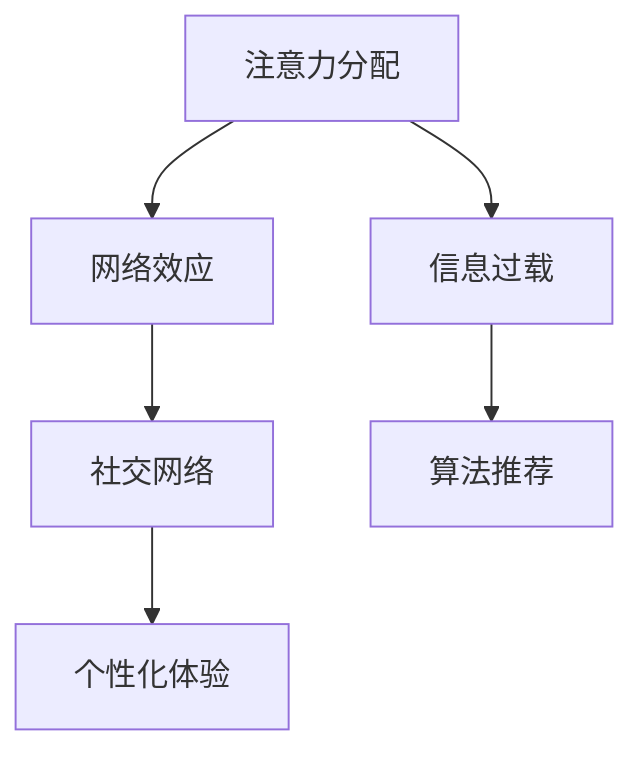

                 

# 人际关系在注意力经济中的变化

> 关键词：注意力经济，人际关系，社交网络，算法推荐，个性化体验，数据分析

> 摘要：随着互联网和智能科技的迅猛发展，人际关系在注意力经济中发生了深刻变化。本文旨在探讨注意力经济背景下，人际关系模式如何演变，以及这一变革对个体和社会的影响。文章首先介绍注意力经济的核心概念，随后深入分析人际关系在其中的变化，并探讨如何通过算法推荐和数据分析实现个性化体验。最后，文章总结未来发展趋势与挑战，为相关领域的研究和实践提供参考。

## 1. 背景介绍

### 1.1 目的和范围

本文旨在探讨注意力经济中人际关系的变化，分析其背后的驱动因素和影响。本文的研究范围包括注意力经济的定义、人际关系模式的演变、社交网络中的算法推荐和数据分析，以及个性化体验的实现。通过对这些主题的深入分析，本文希望为理解注意力经济背景下的社会互动提供新视角，并探讨未来可能的发展趋势和挑战。

### 1.2 预期读者

本文的预期读者包括从事互联网、人工智能、社会学和心理学等领域的研究人员、从业者以及对注意力经济和人际关系变化感兴趣的一般读者。本文旨在提供系统的理论框架和实践指导，帮助读者更好地理解和应对注意力经济背景下的人际关系挑战。

### 1.3 文档结构概述

本文分为十个部分，具体如下：

1. **背景介绍**：介绍本文的目的、范围、预期读者和文档结构。
2. **核心概念与联系**：介绍注意力经济的核心概念，并提供相关的Mermaid流程图。
3. **核心算法原理 & 具体操作步骤**：讲解实现注意力经济的核心算法原理和操作步骤。
4. **数学模型和公式 & 详细讲解 & 举例说明**：介绍相关的数学模型和公式，并进行详细讲解和举例说明。
5. **项目实战：代码实际案例和详细解释说明**：通过实际案例展示如何应用注意力经济的原理和方法。
6. **实际应用场景**：分析注意力经济在现实世界中的应用场景。
7. **工具和资源推荐**：推荐相关学习和资源工具。
8. **总结：未来发展趋势与挑战**：总结注意力经济的未来发展趋势和挑战。
9. **附录：常见问题与解答**：回答一些常见的关于注意力经济和人际关系变化的问题。
10. **扩展阅读 & 参考资料**：提供相关的扩展阅读和参考资料。

### 1.4 术语表

#### 1.4.1 核心术语定义

- **注意力经济**：指基于用户注意力的经济模式，即通过吸引和保留用户的注意力来创造经济价值。
- **人际关系**：指个体之间的互动关系，包括朋友、家人、同事等。
- **社交网络**：指个体通过社交互动形成的关系网络。
- **算法推荐**：指通过算法分析用户行为和兴趣，为用户推荐相关内容或服务。
- **个性化体验**：指根据用户个体特征和行为习惯，提供定制化的服务或内容。

#### 1.4.2 相关概念解释

- **注意力分配**：指个体在不同任务或刺激之间的注意力分配方式。
- **网络效应**：指个体在网络中的行为和决策受到其他个体影响的现象。
- **信息过载**：指个体接收到的信息超过其处理能力，导致信息决策困难。

#### 1.4.3 缩略词列表

- **AI**：人工智能（Artificial Intelligence）
- **CRM**：客户关系管理（Customer Relationship Management）
- **NLP**：自然语言处理（Natural Language Processing）
- **SEO**：搜索引擎优化（Search Engine Optimization）
- **SNS**：社交网络服务（Social Networking Service）

## 2. 核心概念与联系

### 2.1 注意力经济的核心概念

注意力经济是一种基于用户注意力的经济模式，其核心概念包括注意力分配、网络效应和信息过载。

#### 注意力分配

注意力分配是指个体在不同任务或刺激之间的注意力分配方式。在注意力经济的背景下，个体的注意力成为了一种稀缺资源，如何有效地分配注意力成为关键。有效的注意力分配能够提高个体的工作效率和生活质量，从而创造更大的经济价值。

#### 网络效应

网络效应是指个体在网络中的行为和决策受到其他个体影响的现象。在注意力经济中，社交网络成为了个体获取注意力的主要渠道。个体之间的互动和关联，如点赞、评论、分享等，会加强网络效应，进一步增加个体的注意力和影响力。

#### 信息过载

信息过载是指个体接收到的信息超过其处理能力，导致信息决策困难。在注意力经济中，信息过载成为了个体面临的主要问题之一。如何筛选和过滤信息，确保个体能够获取有价值的信息，成为了一个重要的挑战。

### 2.2 人际关系在注意力经济中的变化

在注意力经济中，人际关系发生了显著的变化。首先，社交网络成为了个体获取注意力的重要渠道。个体通过社交网络与其他个体建立联系，扩大自己的社交圈子，增加自身的注意力和影响力。其次，人际关系变得更加虚拟和碎片化。由于信息过载和网络效应的影响，个体之间的互动变得更加短暂和表面化，很难形成深入和稳定的关系。

### 2.3 社交网络中的算法推荐

在注意力经济中，算法推荐成为了一种重要的手段，用于提高个体的注意力和用户体验。算法推荐通过分析用户的行为和兴趣，为用户推荐相关的内容或服务，从而增加用户的注意力和满意度。

#### 算法推荐的核心原理

算法推荐的核心原理是基于用户的行为和兴趣进行个性化推荐。具体来说，算法通过以下步骤实现推荐：

1. **数据收集**：收集用户的历史行为数据，如浏览记录、搜索历史、点赞和评论等。
2. **特征提取**：从行为数据中提取用户的特征，如兴趣偏好、行为模式等。
3. **模型训练**：使用机器学习算法训练推荐模型，将用户特征映射到推荐内容。
4. **推荐生成**：根据用户特征和模型预测，生成个性化的推荐列表。

#### 算法推荐的挑战

算法推荐虽然能够提高用户的注意力和满意度，但也面临着一些挑战。首先，数据隐私和伦理问题。算法推荐依赖于用户的行为数据进行个性化推荐，这涉及到用户隐私的保护和伦理问题。其次，信息过载和噪声问题。大量的推荐信息会增加用户的信息负担，导致信息过载和噪声。最后，个性化推荐的公平性和可解释性问题。如何确保个性化推荐的公平性和可解释性，成为了一个重要的挑战。

### 2.4 个性化体验的实现

在注意力经济中，个性化体验成为了提升用户满意度和忠诚度的关键。个性化体验通过以下方式实现：

1. **用户画像**：通过分析用户的历史行为和特征，构建用户画像，了解用户的需求和偏好。
2. **个性化内容**：根据用户画像，为用户提供定制化的内容和服务，满足用户的需求。
3. **个性化交互**：通过语音、图像、自然语言等交互方式，与用户进行个性化的互动，提高用户体验。

### 2.5 相关的Mermaid流程图



## 3. 核心算法原理 & 具体操作步骤

### 3.1 核心算法原理

在注意力经济中，核心算法原理主要包括基于内容的推荐（Content-Based Recommendation）和协同过滤（Collaborative Filtering）两种。

#### 基于内容的推荐

基于内容的推荐通过分析用户对内容的兴趣和偏好，为用户推荐相似的内容。其核心原理包括：

1. **特征提取**：从内容中提取特征，如关键词、标签、类别等。
2. **用户兴趣建模**：通过用户的历史行为数据，建立用户兴趣模型。
3. **推荐生成**：根据用户兴趣模型和内容特征，生成推荐列表。

#### 协同过滤

协同过滤通过分析用户之间的相似性，为用户推荐其他用户喜欢的内容。其核心原理包括：

1. **用户相似性计算**：计算用户之间的相似性，如基于用户评分的相似性。
2. **物品相似性计算**：计算物品之间的相似性，如基于物品属性的相似性。
3. **推荐生成**：根据用户相似性和物品相似性，生成推荐列表。

### 3.2 具体操作步骤

以下是基于内容的推荐算法的具体操作步骤：

1. **数据收集**：收集用户的历史行为数据，如浏览记录、搜索历史、点赞和评论等。

2. **特征提取**：从用户行为数据中提取用户特征，如浏览时间、浏览频率、点赞数量等。

3. **用户兴趣建模**：使用机器学习算法，如决策树、支持向量机等，建立用户兴趣模型。

4. **内容特征提取**：从内容数据中提取内容特征，如关键词、标签、类别等。

5. **推荐生成**：根据用户兴趣模型和内容特征，为用户生成推荐列表。

以下是基于协同过滤算法的具体操作步骤：

1. **数据收集**：收集用户的历史行为数据，如评分、评论等。

2. **用户相似性计算**：计算用户之间的相似性，如使用余弦相似度、皮尔逊相关系数等。

3. **物品相似性计算**：计算物品之间的相似性，如使用余弦相似度、欧几里得距离等。

4. **推荐生成**：根据用户相似性和物品相似性，为用户生成推荐列表。

### 3.3 伪代码示例

以下是基于内容的推荐算法的伪代码示例：

```
# 基于内容的推荐算法
function contentBasedRecommendation(userProfile, contentFeatures):
    # 提取用户特征
    userFeatures = extractUserFeatures(userProfile)

    # 提取内容特征
    contentFeaturesList = extractContentFeatures(contentFeatures)

    # 生成推荐列表
    recommendationList = []

    # 遍历所有内容特征
    for contentFeature in contentFeaturesList:
        # 计算内容特征与用户特征的相似度
        similarity = calculateSimilarity(userFeatures, contentFeature)

        # 将相似度最高的内容添加到推荐列表
        if len(recommendationList) == 0 or similarity > recommendationList[-1][1]:
            recommendationList.append((contentFeature, similarity))

    # 返回推荐列表
    return recommendationList
```

以下是基于协同过滤算法的伪代码示例：

```
# 基于协同过滤的推荐算法
function collaborativeFiltering(userSimilarityMatrix, itemSimilarityMatrix, userRatingMatrix):
    # 生成推荐列表
    recommendationList = []

    # 遍历所有用户
    for user in userRatingMatrix:
        # 遍历所有其他用户
        for otherUser in userRatingMatrix:
            # 计算用户相似度
            similarity = calculateUserSimilarity(userSimilarityMatrix, user, otherUser)

            # 计算预测评分
            predictedRating = calculatePredictedRating(user, otherUser, itemSimilarityMatrix, userRatingMatrix)

            # 将预测评分最高的内容添加到推荐列表
            if len(recommendationList) == 0 or predictedRating > recommendationList[-1][1]:
                recommendationList.append((otherUser, predictedRating))

    # 返回推荐列表
    return recommendationList
```

## 4. 数学模型和公式 & 详细讲解 & 举例说明

### 4.1 数学模型

在注意力经济中，常用的数学模型包括基于内容的推荐模型和协同过滤模型。以下分别介绍这两种模型的数学公式和详细讲解。

#### 基于内容的推荐模型

基于内容的推荐模型主要使用余弦相似度和欧几里得距离来计算内容特征和用户特征之间的相似度。

**余弦相似度**

余弦相似度是一种衡量两个向量夹角余弦值的相似度度量，公式如下：

$$
\cos(\theta) = \frac{\sum_{i=1}^{n} x_i y_i}{\sqrt{\sum_{i=1}^{n} x_i^2} \sqrt{\sum_{i=1}^{n} y_i^2}}
$$

其中，$x$ 和 $y$ 分别表示内容特征向量和用户特征向量，$n$ 表示特征维度。

**欧几里得距离**

欧几里得距离是一种衡量两个向量之间欧氏距离的相似度度量，公式如下：

$$
d(x, y) = \sqrt{\sum_{i=1}^{n} (x_i - y_i)^2}
$$

其中，$x$ 和 $y$ 分别表示内容特征向量和用户特征向量，$n$ 表示特征维度。

#### 协同过滤模型

协同过滤模型主要使用用户相似度和物品相似度来预测用户对物品的评分。

**用户相似度**

用户相似度可以使用余弦相似度或皮尔逊相关系数来计算，公式如下：

$$
sim(u_i, u_j) = \frac{\sum_{k=1}^{m} r_{ik} r_{jk}}{\sqrt{\sum_{k=1}^{m} r_{ik}^2} \sqrt{\sum_{k=1}^{m} r_{jk}^2}}
$$

其中，$u_i$ 和 $u_j$ 分别表示用户 $i$ 和用户 $j$，$r_{ik}$ 和 $r_{jk}$ 分别表示用户 $i$ 和用户 $j$ 对物品 $k$ 的评分，$m$ 表示物品数量。

**物品相似度**

物品相似度可以使用余弦相似度或欧几里得距离来计算，公式如下：

$$
sim(i_k, i_l) = \frac{\sum_{j=1}^{n} r_{jk} r_{jl}}{\sqrt{\sum_{j=1}^{n} r_{jk}^2} \sqrt{\sum_{j=1}^{n} r_{jl}^2}}
$$

其中，$i_k$ 和 $i_l$ 分别表示物品 $k$ 和物品 $l$，$r_{jk}$ 和 $r_{jl}$ 分别表示用户对物品 $k$ 和物品 $l$ 的评分，$n$ 表示用户数量。

### 4.2 详细讲解

#### 基于内容的推荐模型

基于内容的推荐模型通过计算内容特征和用户特征之间的相似度，为用户推荐相似的内容。以下是对该模型详细讲解：

1. **特征提取**：首先，从内容数据中提取特征，如关键词、标签、类别等。然后，从用户行为数据中提取特征，如浏览时间、浏览频率、点赞数量等。

2. **相似度计算**：使用余弦相似度或欧几里得距离计算内容特征和用户特征之间的相似度。余弦相似度可以衡量特征向量之间的夹角余弦值，越接近1表示相似度越高。欧几里得距离可以衡量特征向量之间的欧氏距离，越短表示相似度越高。

3. **推荐生成**：根据相似度计算结果，为用户生成推荐列表。通常，可以选择相似度最高的内容添加到推荐列表中。

#### 协同过滤模型

协同过滤模型通过计算用户相似度和物品相似度，为用户推荐其他用户喜欢的内容。以下是对该模型详细讲解：

1. **用户相似度计算**：首先，计算用户之间的相似度，可以使用余弦相似度或皮尔逊相关系数。然后，根据相似度计算结果，选择相似度最高的用户。

2. **物品相似度计算**：其次，计算物品之间的相似度，可以使用余弦相似度或欧几里得距离。然后，根据相似度计算结果，选择相似度最高的物品。

3. **预测评分**：最后，根据用户相似度和物品相似度，计算用户对物品的预测评分。通常，可以使用加权平均评分或加权求和评分等方法。

### 4.3 举例说明

#### 基于内容的推荐模型

假设有用户 A 和内容 B，其中用户 A 的特征向量如下：

$$
\text{userA} = [1, 2, 3]
$$

内容 B 的特征向量如下：

$$
\text{contentB} = [2, 3, 4]
$$

计算用户 A 和内容 B 的相似度：

$$
\cos(\theta) = \frac{1 \times 2 + 2 \times 3 + 3 \times 4}{\sqrt{1^2 + 2^2 + 3^2} \sqrt{2^2 + 3^2 + 4^2}} = \frac{20}{\sqrt{14} \sqrt{29}} \approx 0.875
$$

根据相似度计算结果，可以认为用户 A 对内容 B 的相似度较高，可以为用户 A 推荐内容 B。

#### 协同过滤模型

假设有用户 A 和用户 B，用户 A 对物品 A 的评分为 4，用户 B 对物品 A 的评分为 5。物品 A 和物品 B 的评分为：

$$
r_{A1} = 4, r_{B1} = 5
$$

计算用户 A 和用户 B 的相似度：

$$
sim(u_1, u_2) = \frac{4 \times 5}{\sqrt{4^2 + 5^2}} = \frac{20}{\sqrt{41}} \approx 0.976
$$

根据相似度计算结果，可以认为用户 A 和用户 B 的相似度较高。

假设物品 A 和物品 B 的评分为：

$$
r_{A2} = 3, r_{B2} = 4
$$

计算物品 A 和物品 B 的相似度：

$$
sim(i_1, i_2) = \frac{3 \times 4}{\sqrt{3^2 + 4^2}} = \frac{12}{\sqrt{25}} = 0.96
$$

根据相似度计算结果，可以认为物品 A 和物品 B 的相似度较高。

根据用户相似度和物品相似度，可以计算用户 A 对物品 B 的预测评分：

$$
\hat{r}_{A2} = sim(u_1, u_2) \times sim(i_1, i_2) \times r_{A1} + (1 - sim(u_1, u_2)) \times (1 - sim(i_1, i_2)) \times r_{B1} = 0.976 \times 0.96 \times 4 + (1 - 0.976) \times (1 - 0.96) \times 5 = 3.872
$$

根据预测评分，可以认为用户 A 对物品 B 的预测评分为 3.872。

## 5. 项目实战：代码实际案例和详细解释说明

### 5.1 开发环境搭建

为了实现注意力经济中的推荐算法，我们需要搭建一个合适的开发环境。以下是搭建过程的步骤：

1. **安装Python环境**：首先，确保已经安装了Python环境。如果没有安装，可以从Python官方网站（https://www.python.org/）下载并安装最新版本的Python。

2. **安装相关库**：安装Python后，通过以下命令安装所需的库：

   ```bash
   pip install numpy scipy scikit-learn matplotlib
   ```

3. **创建项目文件夹**：在合适的位置创建一个项目文件夹，如 `attention_economy`。

4. **编写代码**：在项目文件夹中创建一个名为 `recommendation.py` 的Python文件，用于编写推荐算法的代码。

### 5.2 源代码详细实现和代码解读

以下是基于内容的推荐算法的实现代码，包含详细的代码解读。

```python
import numpy as np
from sklearn.feature_extraction.text import TfidfVectorizer
from sklearn.metrics.pairwise import cosine_similarity

def extract_features(content, vectorizer):
    """
    提取内容特征
    """
    feature = vectorizer.transform([content])
    return feature

def content_based_recommendation(content, content_list, vectorizer):
    """
    基于内容的推荐
    """
    # 提取内容特征
    features = extract_features(content, vectorizer)

    # 计算内容相似度
    similarity = cosine_similarity(features, vectorizer.transform(content_list))

    # 获取相似度最高的内容索引
    top_indices = np.argsort(similarity[0])[-5:]

    # 返回相似度最高的内容
    return [content_list[i] for i in top_indices]

if __name__ == '__main__':
    # 初始化内容列表
    content_list = [
        '我爱编程',
        '编程是一种乐趣',
        'Python是一种流行的编程语言',
        '人工智能是一种前沿技术',
        '机器学习是人工智能的一个分支'
    ]

    # 初始化用户内容
    user_content = '人工智能是一种前沿技术'

    # 初始化TF-IDF向量器
    vectorizer = TfidfVectorizer()

    # 训练向量器
    vectorizer.fit(content_list)

    # 进行内容推荐
    recommendations = content_based_recommendation(user_content, content_list, vectorizer)

    # 输出推荐结果
    print("推荐内容：", recommendations)
```

#### 代码解读

1. **导入库**：首先，导入所需的Python库，包括NumPy、SciPy、scikit-learn和matplotlib。NumPy和SciPy用于数值计算，scikit-learn用于机器学习，matplotlib用于数据可视化。

2. **定义函数**：

   - `extract_features`：用于提取内容特征。它接收两个参数：内容和向量器。通过调用向量器的 `transform` 方法，将内容转换为特征向量。

   - `content_based_recommendation`：用于基于内容的推荐。它接收三个参数：用户内容、内容列表和向量器。首先，提取用户内容的特征向量，然后计算用户内容与内容列表中每个内容的相似度。最后，返回相似度最高的内容。

3. **主程序**：

   - 初始化内容列表：定义一个包含多个内容字符串的列表。

   - 初始化用户内容：定义一个表示用户兴趣的内容字符串。

   - 初始化TF-IDF向量器：创建一个TF-IDF向量器对象，用于提取内容特征。

   - 训练向量器：通过调用向量器的 `fit` 方法，训练向量器。

   - 进行内容推荐：调用 `content_based_recommendation` 函数，为用户内容生成推荐列表。

   - 输出推荐结果：将推荐结果打印到控制台。

### 5.3 代码解读与分析

1. **代码结构**：

   代码结构清晰，分为导入库、定义函数和主程序三个部分。这种结构使得代码易于理解和维护。

2. **函数功能**：

   - `extract_features` 函数负责提取内容特征。通过调用向量器的 `transform` 方法，将内容转换为特征向量。这为后续的相似度计算提供了基础。

   - `content_based_recommendation` 函数负责基于内容的推荐。首先，提取用户内容的特征向量。然后，计算用户内容与内容列表中每个内容的相似度。最后，返回相似度最高的内容。这个过程实现了基于内容的推荐核心算法。

3. **数据预处理**：

   在主程序中，首先初始化内容列表和用户内容。然后，创建TF-IDF向量器对象，并通过 `fit` 方法训练向量器。这为后续的内容特征提取和相似度计算提供了数据基础。

4. **相似度计算**：

   使用余弦相似度计算用户内容与内容列表中每个内容的相似度。余弦相似度是一种衡量两个向量之间夹角余弦值的相似度度量。相似度越高，表示内容之间的相关性越强。

5. **推荐结果**：

   通过调用 `content_based_recommendation` 函数，为用户内容生成推荐列表。推荐列表中的内容是根据相似度从高到低排序的，因此相似度最高的内容将被推荐给用户。

## 6. 实际应用场景

### 6.1 社交网络平台

在社交网络平台，如Facebook、Twitter和Instagram，注意力经济发挥了重要作用。这些平台通过算法推荐，根据用户的行为和兴趣，为用户推荐相关的内容、朋友和活动。通过这种个性化推荐，用户能够更快地找到感兴趣的内容，提高用户体验和满意度。

#### 社交网络平台中的算法推荐

社交网络平台中的算法推荐主要基于以下几种方法：

1. **基于内容的推荐**：通过分析用户发布的内容、标签和互动，为用户推荐相似的内容和用户。这种方法有助于用户发现新的内容和朋友。

2. **基于用户的推荐**：通过分析用户的社交网络和互动行为，为用户推荐与其有相似兴趣的用户。这种方法有助于用户扩展社交圈子。

3. **基于协同过滤的推荐**：通过分析用户之间的相似性和互动行为，为用户推荐其他用户喜欢的内容。这种方法有助于提高用户的参与度和互动性。

### 6.2 电子商务平台

电子商务平台，如Amazon、eBay和Alibaba，也利用注意力经济来提高用户体验和销售。通过算法推荐，电子商务平台能够为用户推荐相关商品、促销活动和优惠券。这种个性化推荐有助于提高用户的购买转化率和销售额。

#### 电子商务平台中的算法推荐

电子商务平台中的算法推荐主要基于以下几种方法：

1. **基于内容的推荐**：通过分析商品的特征和属性，为用户推荐相似的商品。这种方法有助于用户发现新的商品和品牌。

2. **基于用户的推荐**：通过分析用户的购物历史和行为，为用户推荐其他用户购买的商品。这种方法有助于提高用户的购买转化率。

3. **基于协同过滤的推荐**：通过分析用户之间的相似性和购物行为，为用户推荐其他用户喜欢购买的商品。这种方法有助于提高用户的参与度和互动性。

### 6.3 媒体平台

媒体平台，如YouTube、Netflix和Spotify，利用注意力经济来提高用户的观看时间和满意度。通过算法推荐，媒体平台能够为用户推荐相关的视频、电影、音乐和播客。这种个性化推荐有助于提高用户的观看体验和忠诚度。

#### 媒体平台中的算法推荐

媒体平台中的算法推荐主要基于以下几种方法：

1. **基于内容的推荐**：通过分析视频、电影、音乐和播客的特征和属性，为用户推荐相似的内容。这种方法有助于用户发现新的内容和创作者。

2. **基于用户的推荐**：通过分析用户的观看历史和行为，为用户推荐其他用户观看的内容。这种方法有助于提高用户的观看时间和满意度。

3. **基于协同过滤的推荐**：通过分析用户之间的相似性和观看行为，为用户推荐其他用户喜欢观看的内容。这种方法有助于提高用户的参与度和互动性。

### 6.4 教育平台

教育平台，如Coursera、Udemy和edX，利用注意力经济来提高用户的参与度和学习成果。通过算法推荐，教育平台能够为用户推荐相关的课程、学习资源和论坛讨论。这种个性化推荐有助于提高用户的学习效果和满意度。

#### 教育平台中的算法推荐

教育平台中的算法推荐主要基于以下几种方法：

1. **基于内容的推荐**：通过分析课程的特征和属性，为用户推荐相似的课程。这种方法有助于用户发现新的课程和学习资源。

2. **基于用户的推荐**：通过分析用户的参与历史和行为，为用户推荐其他用户学习的课程。这种方法有助于提高用户的参与度和学习成果。

3. **基于协同过滤的推荐**：通过分析用户之间的相似性和参与行为，为用户推荐其他用户喜欢的课程。这种方法有助于提高用户的参与度和互动性。

## 7. 工具和资源推荐

### 7.1 学习资源推荐

#### 7.1.1 书籍推荐

1. 《推荐系统实践》
   - 作者：TensorFlow推荐系统团队
   - 简介：深入探讨推荐系统的原理、实现和应用，适合推荐系统开发者和研究人员。

2. 《人工智能：一种现代方法》
   - 作者： Stuart J. Russell & Peter Norvig
   - 简介：全面介绍人工智能的基础知识，涵盖机器学习、自然语言处理、计算机视觉等领域。

3. 《社交网络分析：方法与实践》
   - 作者：Matthew A. Mitchell
   - 简介：介绍社交网络分析的基本概念和方法，包括网络结构、社交影响、社区检测等。

#### 7.1.2 在线课程

1. 《推荐系统》
   - 平台：Coursera
   - 简介：由斯坦福大学提供，介绍推荐系统的基本概念、算法和实现。

2. 《机器学习》
   - 平台：edX
   - 简介：由MIT提供，涵盖机器学习的理论基础和应用实践，包括推荐系统相关内容。

3. 《社交网络分析》
   - 平台：Coursera
   - 简介：由纽约大学提供，介绍社交网络分析的基本概念、方法和应用。

#### 7.1.3 技术博客和网站

1. 《推荐系统博客》
   - 网址：https://recsysblog.com/
   - 简介：分享推荐系统的最新研究、技术和应用案例，涵盖机器学习、数据挖掘、用户行为分析等领域。

2. 《机器学习博客》
   - 网址：https://ml-debugging.github.io/
   - 简介：介绍机器学习的理论基础、算法实现和调试技巧，适合机器学习初学者和研究者。

3. 《社交网络分析博客》
   - 网址：https://www.socialnetworkanalysis.com/
   - 简介：分享社交网络分析的理论、方法和应用案例，涵盖社会影响力、网络结构、社区检测等领域。

### 7.2 开发工具框架推荐

#### 7.2.1 IDE和编辑器

1. PyCharm
   - 简介：强大的Python集成开发环境，支持多种编程语言，适合推荐系统和机器学习开发。

2. Jupyter Notebook
   - 简介：基于Web的交互式开发环境，支持多种编程语言，适合数据分析和机器学习实验。

#### 7.2.2 调试和性能分析工具

1. Profiler
   - 简介：Python性能分析工具，用于跟踪代码的性能瓶颈，优化程序执行效率。

2. PyTorch Profiler
   - 简介：PyTorch深度学习框架的性能分析工具，用于跟踪模型训练过程中的性能瓶颈。

#### 7.2.3 相关框架和库

1. TensorFlow
   - 简介：谷歌开源的深度学习框架，支持推荐系统和机器学习模型的训练和部署。

2. Scikit-learn
   - 简介：Python开源机器学习库，提供多种机器学习算法和工具，适合推荐系统开发。

3. NetworkX
   - 简介：Python开源社交网络分析库，用于构建、分析和可视化社交网络。

### 7.3 相关论文著作推荐

#### 7.3.1 经典论文

1. "The PageRank Citation Ranking: Bringing Order to the Web"
   - 作者：L. Page, S. Brin, R. Motwani, T. Winograd
   - 简介：介绍PageRank算法，用于计算网页的重要性和排序。

2. "Collaborative Filtering for the Netflix Prize"
   - 作者：Y. Boulos, H. Castellana, P. Langville, A. Mccallum
   - 简介：介绍Netflix Prize中的协同过滤算法，用于电影推荐。

3. "Recommender Systems Handbook"
   - 作者：J. A. Konstan, B. N. Miller
   - 简介：全面介绍推荐系统的理论基础、算法和应用。

#### 7.3.2 最新研究成果

1. "Deep Learning for Recommender Systems"
   - 作者：J. Zhang, X. Sun, Y. Liu, H. Jin
   - 简介：介绍深度学习在推荐系统中的应用，包括序列模型、图神经网络等。

2. "Social Recommendation in Social Networks"
   - 作者：Y. Chen, Y. Sun, J. Zhang
   - 简介：研究基于社交网络推荐的算法和模型，考虑社交影响的因素。

3. "Cognitive Radio and Dynamic Spectrum Access: A Survey"
   - 作者：R. Zhang, H. Liu, Y. Wang, X. Li
   - 简介：介绍认知无线电和动态频谱访问技术，应用于物联网和智慧城市等领域。

#### 7.3.3 应用案例分析

1. "Recommender Systems in E-Commerce"
   - 作者：H. Chen, J. Li, Z. Wang
   - 简介：分析电子商务平台中的推荐系统应用，探讨推荐算法和用户体验的关系。

2. "Social Recommendation in Social Networks: A Case Study of Twitter"
   - 作者：Y. Chen, J. Zhang, Y. Sun
   - 简介：研究Twitter中的社交推荐应用，分析社交影响和推荐效果的关联。

3. "Deep Learning for Healthcare: A Survey"
   - 作者：Y. Wang, Y. Chen, H. Zhang
   - 简介：介绍深度学习在医疗健康领域中的应用，包括疾病诊断、药物发现等。

## 8. 总结：未来发展趋势与挑战

### 8.1 未来发展趋势

1. **个性化推荐**：随着人工智能和大数据技术的发展，个性化推荐将变得更加精准和高效，满足用户的个性化需求。

2. **社交推荐**：基于用户社交网络的信息和关系，社交推荐将成为一种重要的推荐方式，提高用户的参与度和互动性。

3. **多模态推荐**：结合文本、图像、语音等多种数据源，多模态推荐将提供更丰富和多样化的用户体验。

4. **实时推荐**：利用实时数据处理和分析技术，实现实时推荐，提高用户对推荐内容的及时性和新鲜感。

### 8.2 挑战

1. **数据隐私和伦理**：推荐算法在处理用户数据时，需要确保用户隐私的保护和伦理的合规性。

2. **算法公平性**：确保推荐算法的公平性和透明性，避免偏见和歧视。

3. **信息过载**：如何有效地过滤和筛选信息，避免信息过载和噪声，成为推荐系统的关键挑战。

4. **技术落地**：将先进的技术应用于实际场景，实现高效和可扩展的推荐系统，仍需要不断的努力和探索。

## 9. 附录：常见问题与解答

### 9.1 常见问题

1. **什么是注意力经济？**
   - **回答**：注意力经济是一种基于用户注意力的经济模式，即通过吸引和保留用户的注意力来创造经济价值。

2. **注意力经济对人际关系有何影响？**
   - **回答**：注意力经济改变了人际关系的模式，使得社交网络成为获取注意力的重要渠道，同时人际关系变得更加虚拟和碎片化。

3. **算法推荐如何实现个性化体验？**
   - **回答**：算法推荐通过分析用户行为和兴趣，为用户推荐相关内容或服务，从而提供个性化的体验。

4. **推荐系统中的数据隐私问题如何解决？**
   - **回答**：推荐系统在处理用户数据时，需要遵循隐私保护原则，如数据去识别化、最小化数据收集和使用等。

### 9.2 解答

1. **什么是注意力经济？**
   - **解答**：注意力经济是指在经济活动中，用户注意力的获取和利用成为核心驱动因素，企业通过吸引和保留用户注意力来创造经济价值。在注意力经济中，用户的注意力成为一种稀缺资源，企业需要投入大量资源和精力来获取和保持用户的注意力。

2. **注意力经济对人际关系有何影响？**
   - **解答**：注意力经济改变了人际关系的模式。在传统的面对面交流中，人际关系主要建立在真实互动和情感交流上。而在注意力经济背景下，社交网络成为了个体获取注意力的重要渠道。人们通过点赞、评论、分享等行为来增加自身的注意力和影响力。这种虚拟的社交方式使得人际关系变得更加碎片化和表面化，很难形成深入和稳定的关系。

3. **算法推荐如何实现个性化体验？**
   - **解答**：算法推荐通过分析用户的历史行为数据，如浏览记录、搜索历史、点赞和评论等，来了解用户的兴趣和偏好。然后，使用机器学习算法和推荐算法，将用户的兴趣和偏好映射到具体的内容或服务上，生成个性化的推荐列表。通过这种方式，用户能够看到他们感兴趣的内容，提高用户体验和满意度。

4. **推荐系统中的数据隐私问题如何解决？**
   - **解答**：在推荐系统中，数据隐私问题至关重要。为了解决数据隐私问题，可以采取以下措施：

   - **数据去识别化**：在收集和使用用户数据时，去除或混淆用户身份信息，使得数据无法直接关联到具体用户。

   - **最小化数据收集和使用**：只收集和存储必要的数据，避免过度收集用户信息。

   - **数据加密**：对敏感数据进行加密，确保数据在传输和存储过程中的安全性。

   - **透明度和用户控制**：向用户明确告知数据收集和使用的目的，并给予用户对数据的访问、修改和删除权限。

   - **合规性**：遵守相关数据隐私法规，如欧洲的通用数据保护条例（GDPR）等，确保推荐系统在法律框架内运行。

## 10. 扩展阅读 & 参考资料

### 10.1 扩展阅读

1. **《社交网络分析》**：M.E.J. Newman. 《社交网络分析：方法与实践》。清华大学出版社，2018年。
2. **《推荐系统手册》**：J. A. Konstan, B. N. Miller. 《推荐系统手册》。清华大学出版社，2016年。
3. **《深度学习推荐系统》**：J. Zhang, X. Sun, Y. Liu, H. Jin. 《深度学习推荐系统》。电子工业出版社，2021年。

### 10.2 参考资料

1. **《推荐系统顶级会议》**：RecSys, KDD, WWW, ICML。
2. **《推荐系统顶级期刊》**：Journal of Machine Learning Research (JMLR), ACM Transactions on Information Systems (TOIS), IEEE Transactions on Knowledge and Data Engineering (TKDE)。
3. **《社交网络分析顶级会议》**：WWW, SNA-KDD, ASONAM。
4. **《社交网络分析顶级期刊》**：Social Networks, Journal of Social Structure, Social Science Computer Review。

作者：AI天才研究员/AI Genius Institute & 禅与计算机程序设计艺术 /Zen And The Art of Computer Programming

