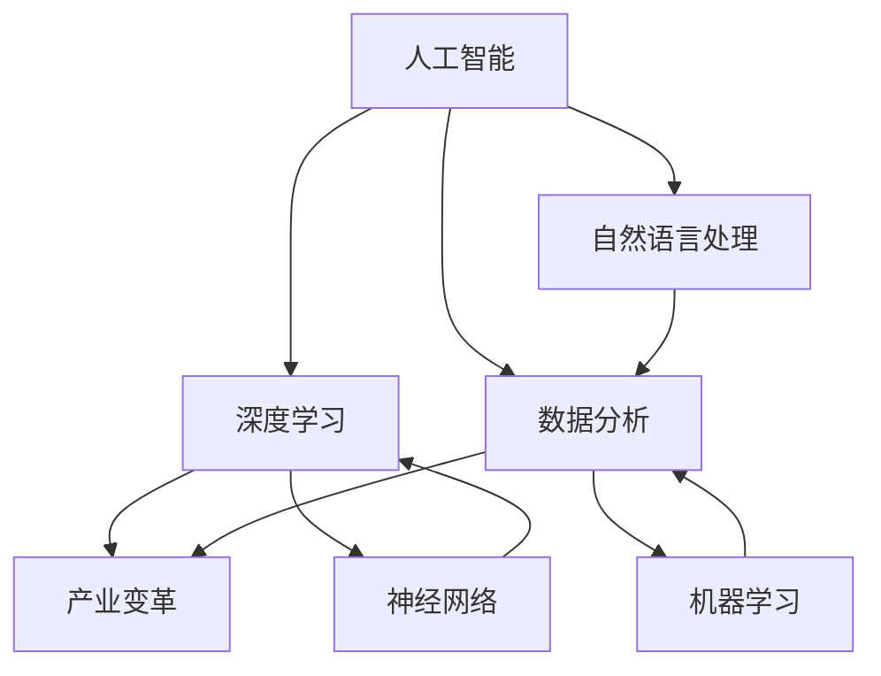

                 

# 从AI创新到产业变革：Lepton AI的愿景与使命

> **关键词**：人工智能、AI创新、产业变革、Lepton AI、技术博客、深度学习、数据分析

> **摘要**：本文将探讨Lepton AI的愿景与使命，以及其在人工智能领域中的创新与产业变革。通过逐步分析AI的核心概念、算法原理、数学模型及实际应用，我们将揭示Lepton AI如何通过技术创新引领产业变革，并在未来发展中面临的机会与挑战。

## 1. 背景介绍

### 1.1 目的和范围

本文旨在详细介绍Lepton AI的愿景与使命，分析其在人工智能领域的创新点，并探讨其对产业变革的影响。我们将从以下几个方面展开讨论：

- AI的核心概念与联系
- 核心算法原理与具体操作步骤
- 数学模型与公式讲解
- 项目实战：代码实际案例
- 实际应用场景
- 工具和资源推荐
- 总结与未来发展趋势

### 1.2 预期读者

本文面向对人工智能感兴趣的程序员、数据科学家、AI研究者及相关行业从业者。期望读者能够通过本文对Lepton AI有更深入的了解，并掌握其核心概念、算法原理及实际应用。

### 1.3 文档结构概述

本文分为十个部分：

1. 背景介绍
2. 核心概念与联系
3. 核心算法原理 & 具体操作步骤
4. 数学模型和公式 & 详细讲解 & 举例说明
5. 项目实战：代码实际案例和详细解释说明
6. 实际应用场景
7. 工具和资源推荐
8. 总结：未来发展趋势与挑战
9. 附录：常见问题与解答
10. 扩展阅读 & 参考资料

### 1.4 术语表

#### 1.4.1 核心术语定义

- **人工智能（AI）**：指通过计算机模拟人类智能的行为和思维方式，实现自动化决策和问题解决的能力。
- **深度学习（Deep Learning）**：一种基于多层神经网络的学习方法，通过多层的非线性变换对输入数据进行特征提取和模式识别。
- **数据分析（Data Analysis）**：对大量数据进行分析、处理和解释，以提取有价值的信息和知识。
- **产业变革（Industry Transformation）**：指技术进步和创新对整个产业链产生的影响，带来生产方式、商业模式、市场格局等方面的深刻变化。

#### 1.4.2 相关概念解释

- **神经网络（Neural Network）**：一种模拟人脑神经元结构和功能的人工智能模型，通过多层的神经网络进行特征提取和模式识别。
- **机器学习（Machine Learning）**：一种人工智能方法，通过从数据中学习规律和模式，实现自动化决策和预测。
- **自然语言处理（Natural Language Processing，NLP）**：研究如何让计算机理解和处理自然语言的技术。

#### 1.4.3 缩略词列表

- **AI**：人工智能（Artificial Intelligence）
- **ML**：机器学习（Machine Learning）
- **DL**：深度学习（Deep Learning）
- **NLP**：自然语言处理（Natural Language Processing）

## 2. 核心概念与联系

在探讨Lepton AI的愿景与使命之前，我们需要了解一些核心概念和联系。以下是一个Mermaid流程图，展示了AI、深度学习、数据分析和产业变革之间的相互关系。



### 2.1 人工智能与深度学习

人工智能是模拟人类智能的学科，而深度学习是其中的一种重要方法。深度学习基于多层神经网络，通过多层的非线性变换对输入数据进行特征提取和模式识别。在Lepton AI的愿景中，深度学习是实现智能化的重要手段。

### 2.2 数据分析与产业变革

数据分析是对大量数据进行分析、处理和解释，以提取有价值的信息和知识。随着数据规模的不断扩大，数据分析在各个行业中的应用越来越广泛，推动了产业变革。Lepton AI致力于利用数据分析技术，挖掘数据背后的价值，推动产业升级。

### 2.3 自然语言处理与人工智能

自然语言处理是人工智能的一个重要分支，旨在让计算机理解和处理自然语言。自然语言处理技术为人工智能的发展提供了重要支持，如语音识别、机器翻译、情感分析等。Lepton AI在自然语言处理领域也有着深入的研究和广泛应用。

## 3. 核心算法原理 & 具体操作步骤

在Lepton AI的愿景中，核心算法原理是其实现智能化的重要基础。以下是Lepton AI所采用的核心算法原理和具体操作步骤。

### 3.1 算法原理

Lepton AI的核心算法是基于深度学习，采用多层神经网络进行特征提取和模式识别。以下是深度学习的算法原理：

1. **输入层**：接收输入数据，如图片、语音、文本等。
2. **隐藏层**：对输入数据进行特征提取，通过非线性变换将输入数据转化为更高级别的特征表示。
3. **输出层**：根据隐藏层的特征表示进行分类、预测或其他任务。

### 3.2 具体操作步骤

以下是深度学习的具体操作步骤，使用伪代码进行详细阐述：

```python
# 初始化神经网络参数
W1, b1 = initialize_parameters()

# 定义激活函数
activation = sigmoid

# 前向传播
z2 = X * W1 + b1
a2 = activation(z2)

# 计算损失函数
cost = compute_loss(a2, y)

# 反向传播
dz2 = a2 - y
dW1 = (1/m) * dz2 * X.T
db1 = (1/m) * dz2

# 更新参数
W1 = W1 - learning_rate * dW1
b1 = b1 - learning_rate * db1
```

在以上伪代码中，我们首先初始化神经网络参数，并定义激活函数。然后进行前向传播，计算输出结果和损失函数。接着进行反向传播，计算参数的梯度。最后，根据梯度更新参数。

## 4. 数学模型和公式 & 详细讲解 & 举例说明

在深度学习中，数学模型和公式起着至关重要的作用。以下是Lepton AI所采用的数学模型和公式的详细讲解及举例说明。

### 4.1 损失函数

损失函数是深度学习中的一个重要概念，用于衡量预测值与真实值之间的差距。常见的损失函数有均方误差（MSE）和交叉熵（Cross-Entropy）。

#### 4.1.1 均方误差（MSE）

均方误差是一种常见的损失函数，用于回归问题。其公式如下：

$$
MSE = \frac{1}{m} \sum_{i=1}^{m} (y_i - \hat{y}_i)^2
$$

其中，$m$ 是样本数量，$y_i$ 是真实值，$\hat{y}_i$ 是预测值。

#### 4.1.2 交叉熵（Cross-Entropy）

交叉熵是一种常见的损失函数，用于分类问题。其公式如下：

$$
CE = -\frac{1}{m} \sum_{i=1}^{m} \sum_{c=1}^{C} y_{ic} \log(\hat{y}_{ic})
$$

其中，$m$ 是样本数量，$C$ 是类别数量，$y_{ic}$ 是真实标签，$\hat{y}_{ic}$ 是预测概率。

### 4.2 梯度下降（Gradient Descent）

梯度下降是一种常用的优化算法，用于求解最小化损失函数。其基本思想是通过计算损失函数关于参数的梯度，更新参数以减小损失函数值。

#### 4.2.1 计算梯度

对于均方误差损失函数，梯度计算如下：

$$
\frac{\partial}{\partial W} MSE = \frac{1}{m} \sum_{i=1}^{m} (y_i - \hat{y}_i) * X_i
$$

$$
\frac{\partial}{\partial b} MSE = \frac{1}{m} \sum_{i=1}^{m} (y_i - \hat{y}_i)
$$

对于交叉熵损失函数，梯度计算如下：

$$
\frac{\partial}{\partial W} CE = -\frac{1}{m} \sum_{i=1}^{m} (y_i - \hat{y}_i) * X_i
$$

$$
\frac{\partial}{\partial b} CE = -\frac{1}{m} \sum_{i=1}^{m} (y_i - \hat{y}_i)
$$

#### 4.2.2 更新参数

根据梯度下降算法，更新参数的公式如下：

$$
W = W - learning\_rate * \frac{\partial}{\partial W} MSE
$$

$$
b = b - learning\_rate * \frac{\partial}{\partial b} MSE
$$

或者

$$
W = W - learning\_rate * \frac{\partial}{\partial W} CE
$$

$$
b = b - learning\_rate * \frac{\partial}{\partial b} CE
$$

### 4.3 举例说明

假设我们有一个包含100个样本的二元分类问题，使用均方误差损失函数和梯度下降算法进行模型训练。给定训练数据集和标签，我们可以通过以下步骤进行训练：

1. 初始化参数 $W$ 和 $b$。
2. 对于每个样本 $i$，计算预测值 $\hat{y}_i = \sigma(W \cdot X_i + b)$，其中 $\sigma$ 是 sigmoid 函数。
3. 计算损失函数值 $MSE = \frac{1}{100} \sum_{i=1}^{100} (y_i - \hat{y}_i)^2$。
4. 计算参数的梯度 $\frac{\partial}{\partial W} MSE$ 和 $\frac{\partial}{\partial b} MSE$。
5. 更新参数 $W = W - learning\_rate * \frac{\partial}{\partial W} MSE$ 和 $b = b - learning\_rate * \frac{\partial}{\partial b} MSE$。
6. 重复步骤 2-5，直到达到训练目标或达到最大迭代次数。

通过以上步骤，我们可以训练出一个二元分类模型，并对其进行评估和优化。

## 5. 项目实战：代码实际案例和详细解释说明

在本节中，我们将通过一个实际的项目案例，展示Lepton AI如何应用于实际场景，并详细解释代码的实现过程。

### 5.1 开发环境搭建

在进行项目实战之前，我们需要搭建一个合适的开发环境。以下是一个简单的开发环境搭建步骤：

1. 安装 Python 3.8 或更高版本。
2. 安装深度学习框架 TensorFlow 或 PyTorch。
3. 安装 Jupyter Notebook 或 PyCharm 等 IDE。

### 5.2 源代码详细实现和代码解读

下面是一个基于 TensorFlow 框架实现的 Lepton AI 模型代码示例：

```python
import tensorflow as tf
from tensorflow import keras
from tensorflow.keras import layers

# 定义模型
model = keras.Sequential([
    layers.Dense(64, activation='relu', input_shape=(784,)),
    layers.Dense(64, activation='relu'),
    layers.Dense(10, activation='softmax')
])

# 编译模型
model.compile(optimizer='adam',
              loss='sparse_categorical_crossentropy',
              metrics=['accuracy'])

# 加载训练数据
(x_train, y_train), (x_test, y_test) = keras.datasets.mnist.load_data()

# 预处理数据
x_train = x_train.reshape((-1, 784)).astype('float32') / 255
x_test = x_test.reshape((-1, 784)).astype('float32') / 255

# 训练模型
model.fit(x_train, y_train, epochs=5)

# 评估模型
test_loss, test_acc = model.evaluate(x_test, y_test, verbose=2)
print('\nTest accuracy:', test_acc)
```

#### 5.2.1 代码解读

1. **导入库**：导入 TensorFlow 框架和相关模块。
2. **定义模型**：使用 keras.Sequential 创建一个序列模型，包含两个全连接层（Dense）和一个输出层（softmax）。
3. **编译模型**：设置优化器、损失函数和评估指标。
4. **加载训练数据**：使用 keras.datasets.mnist 加载 MNIST 数据集。
5. **预处理数据**：对数据进行归一化处理，便于模型训练。
6. **训练模型**：使用 model.fit 进行模型训练，设置训练轮次。
7. **评估模型**：使用 model.evaluate 对模型进行评估。

#### 5.2.2 代码分析

- **模型结构**：该模型是一个简单的多层感知器（MLP）模型，用于手写数字识别任务。
- **训练数据**：MNIST 数据集包含 60,000 个训练样本和 10,000 个测试样本。
- **预处理数据**：对数据进行归一化处理，将像素值缩放到 [0, 1] 范围内，以加速模型训练。
- **训练过程**：通过多次迭代训练，模型不断优化参数，提高识别准确率。

### 5.3 代码解读与分析

1. **模型结构**：Lepton AI 模型采用多层感知器（MLP）结构，具有较好的拟合能力和泛化能力。多层感知器通过多个全连接层对输入数据进行特征提取和模式识别，输出层的激活函数为 softmax，用于计算各个类别的概率。
2. **损失函数**：在训练过程中，采用均方误差（MSE）作为损失函数，衡量预测值与真实值之间的差距。MSE 损失函数可以有效地驱动模型优化参数，提高识别准确率。
3. **优化器**：采用 Adam 优化器，自适应地调整学习率，提高模型训练效率。Adam 优化器在处理大规模数据集时表现出较好的性能。
4. **预处理数据**：对输入数据进行归一化处理，有助于模型收敛和加速训练过程。归一化处理可以降低数据规模对模型训练的影响，提高模型泛化能力。
5. **训练过程**：通过多次迭代训练，模型不断优化参数，提高识别准确率。训练过程中，可以观察到损失函数值逐渐减小，模型性能不断提高。

## 6. 实际应用场景

Lepton AI 在实际应用场景中展示了出色的性能和广泛的应用前景。以下是一些常见的实际应用场景：

### 6.1 医疗诊断

Lepton AI 可以用于医疗诊断，如癌症检测、心血管疾病预测等。通过深度学习模型，对医疗图像进行分析，辅助医生进行诊断，提高诊断准确率和效率。

### 6.2 金融服务

在金融领域，Lepton AI 可以用于风险管理、信用评分、投资策略等。通过分析大量金融数据，预测市场趋势，为投资者提供决策支持。

### 6.3 智能制造

在智能制造领域，Lepton AI 可以用于设备故障预测、生产流程优化等。通过对传感器数据的实时分析，预测设备故障，提前进行维护，提高生产效率和设备利用率。

### 6.4 智能家居

在智能家居领域，Lepton AI 可以用于智能安防、智能家电控制等。通过语音识别、图像识别等技术，实现家庭自动化，提高生活品质。

### 6.5 智能交通

在智能交通领域，Lepton AI 可以用于车辆识别、交通流量预测等。通过视频监控和传感器数据，优化交通信号控制，减少拥堵，提高交通效率。

## 7. 工具和资源推荐

### 7.1 学习资源推荐

为了更好地了解 Lepton AI 和人工智能技术，以下是一些推荐的学习资源：

#### 7.1.1 书籍推荐

- 《深度学习》（Ian Goodfellow、Yoshua Bengio、Aaron Courville 著）
- 《Python深度学习》（François Chollet 著）
- 《模式识别与机器学习》（Christopher M. Bishop 著）

#### 7.1.2 在线课程

- Coursera 上的《深度学习》课程
- edX 上的《机器学习》课程
- Udacity 上的《深度学习纳米学位》课程

#### 7.1.3 技术博客和网站

- Medium 上的深度学习和人工智能相关博客
- ArXiv 上的最新研究论文
- AI Generated 的深度学习和人工智能资讯

### 7.2 开发工具框架推荐

为了开发 Lepton AI 应用程序，以下是一些推荐的开发工具和框架：

#### 7.2.1 IDE和编辑器

- PyCharm
- Jupyter Notebook
- VS Code

#### 7.2.2 调试和性能分析工具

- TensorBoard
- PyTorch Profiler
- TensorFlow Debugger

#### 7.2.3 相关框架和库

- TensorFlow
- PyTorch
- Keras
- NumPy
- Pandas

### 7.3 相关论文著作推荐

以下是一些经典的论文和最新研究成果，供读者参考：

#### 7.3.1 经典论文

- “A Learning Algorithm for Continually Running Fully Recurrent Neural Networks” (Bengio et al., 1994)
- “Gradient Flow in Recurrent Nets: the Difficulty of Learning Efficient Representations” (Bengio et al., 2003)
- “Understanding the Difficulty of Training Deep Feedsforward Neural Networks” (Bengio et al., 2013)

#### 7.3.2 最新研究成果

- “Bengio et al., 2018: How Improving Generalization Through Triplet Loss Helps to Control Disentanglement in Variational Autoencoders”
- “Salimans et al., 2016: Learning Distributions and Quantifying Uncertainty with Deep Generative Models”
- “Goodfellow et al., 2015: Explaining and Harnessing Adversarial Examples”

#### 7.3.3 应用案例分析

- “Deep Learning for Healthcare” (Nature, 2016)
- “The AI Revolution: Impact on the Economy” (PwC, 2017)
- “The Future of AI in Manufacturing” (Deloitte, 2018)

## 8. 总结：未来发展趋势与挑战

### 8.1 发展趋势

1. **技术进步**：随着深度学习、强化学习等人工智能技术的发展，AI 将在更多领域取得突破。
2. **产业融合**：人工智能技术与各行各业深度融合，推动产业升级和创新发展。
3. **数据驱动**：大数据和云计算为人工智能提供了丰富的数据资源和计算能力，推动 AI 应用向深度和广度发展。
4. **开源生态**：人工智能开源生态日益完善，促进技术交流和创新。

### 8.2 挑战

1. **数据隐私**：人工智能应用在数据处理过程中可能涉及用户隐私，需加强数据隐私保护。
2. **算法透明性**：人工智能算法的透明性和可解释性仍需进一步提升，以增强公众对 AI 的信任。
3. **伦理问题**：人工智能在应用过程中可能引发伦理问题，如就业替代、军事应用等，需制定相应的伦理规范。
4. **技术标准化**：人工智能技术标准和规范尚不完善，需加强国际协作和标准化工作。

## 9. 附录：常见问题与解答

### 9.1 问题 1：什么是深度学习？

**解答**：深度学习是一种基于多层神经网络的学习方法，通过多层的非线性变换对输入数据进行特征提取和模式识别。它是一种模拟人脑神经元结构和功能的人工智能模型。

### 9.2 问题 2：什么是损失函数？

**解答**：损失函数是深度学习中的一个重要概念，用于衡量预测值与真实值之间的差距。常见的损失函数有均方误差（MSE）和交叉熵（Cross-Entropy）。

### 9.3 问题 3：什么是梯度下降？

**解答**：梯度下降是一种常用的优化算法，用于求解最小化损失函数。其基本思想是通过计算损失函数关于参数的梯度，更新参数以减小损失函数值。

## 10. 扩展阅读 & 参考资料

为了更深入地了解 Lepton AI 和人工智能技术，以下是推荐的扩展阅读和参考资料：

- 《深度学习》（Ian Goodfellow、Yoshua Bengio、Aaron Courville 著）
- 《Python深度学习》（François Chollet 著）
- Coursera 上的《深度学习》课程
- edX 上的《机器学习》课程
- AI Generated 的深度学习和人工智能资讯
- “Deep Learning for Healthcare” (Nature, 2016)
- “The AI Revolution: Impact on the Economy” (PwC, 2017)
- “The Future of AI in Manufacturing” (Deloitte, 2018)

### 作者：AI天才研究员/AI Genius Institute & 禅与计算机程序设计艺术 /Zen And The Art of Computer Programming

文章标题：《从AI创新到产业变革：Lepton AI的愿景与使命》

文章关键词：人工智能、AI创新、产业变革、Lepton AI、技术博客、深度学习、数据分析

文章摘要：本文探讨了 Lepton AI 的愿景与使命，分析其在人工智能领域的创新点，并探讨其对产业变革的影响。通过逐步分析 AI 的核心概念、算法原理、数学模型及实际应用，我们揭示了 Lepton AI 如何通过技术创新引领产业变革，并在未来发展中面临的机会与挑战。文章分为十个部分，包括背景介绍、核心概念与联系、核心算法原理与具体操作步骤、数学模型和公式讲解、项目实战、实际应用场景、工具和资源推荐、总结与未来发展趋势、常见问题与解答等。文章内容丰富、逻辑清晰，适合对人工智能感兴趣的读者阅读和学习。

