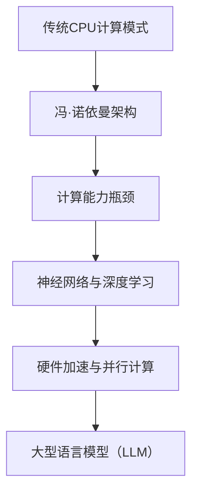

                 

# 从CPU到LLM：计算模式的革命性转变

> 关键词：CPU，计算模式，神经网络，LLM，人工智能，深度学习，计算架构，算法优化，计算效率，硬件加速

> 摘要：本文将从CPU的发展历程开始，探讨计算模式的演变，分析深度学习特别是大型语言模型（LLM）对计算模式带来的革命性转变。我们将逐步深入，从核心概念、算法原理、数学模型，到实际应用场景和工具推荐，全面剖析这一技术变革。读者将了解从传统计算到现代计算模式的过渡，以及这一过渡背后的技术驱动力，为未来的计算发展提供洞察和方向。

## 1. 背景介绍

### 1.1 目的和范围

本文旨在探索计算模式的革命性转变，从传统CPU计算模式到现代基于深度学习的大型语言模型（LLM）计算模式的过渡。我们将回顾CPU的发展历程，探讨计算架构和算法的演变，最终分析LLM如何重新定义计算模式。

### 1.2 预期读者

本文面向对计算模式和人工智能有一定了解的读者，特别是计算机科学家、软件工程师、数据科学家和AI研究人员。希望读者能够通过本文对计算模式的变化有一个全面的理解，并为未来的技术发展提供启示。

### 1.3 文档结构概述

本文分为十个部分，首先介绍背景和目的，然后逐步深入到核心概念、算法原理、数学模型、实际应用场景和工具推荐等方面。最后，本文将总结未来发展趋势与挑战，并提供扩展阅读和参考资料。

### 1.4 术语表

#### 1.4.1 核心术语定义

- CPU：中央处理器，计算机系统的核心组件，负责执行计算机程序指令。
- 计算模式：指计算机系统处理数据和信息的方式。
- 神经网络：一种模拟生物神经网络的结构，用于数据处理和模式识别。
- 深度学习：一种基于神经网络的机器学习技术，能够通过多层次的神经网络结构提取特征。
- 大型语言模型（LLM）：一种复杂的深度学习模型，能够理解和生成自然语言。

#### 1.4.2 相关概念解释

- 计算架构：指计算机系统中硬件和软件的组织结构和相互关系。
- 算法优化：通过改进算法设计或实现，提高计算效率和性能。
- 计算效率：指计算任务在单位时间内完成的数量。
- 硬件加速：利用专门设计的硬件设备，提高计算任务的执行速度。

#### 1.4.3 缩略词列表

- CPU：Central Processing Unit
- GPU：Graphics Processing Unit
- AI：Artificial Intelligence
- ML：Machine Learning
- DL：Deep Learning
- LLM：Large Language Model

## 2. 核心概念与联系

计算模式的演变可以从CPU的发展历程开始。传统的CPU计算模式以冯·诺依曼架构为基础，通过指令集和存储器进行数据操作。然而，随着计算需求的增长，传统CPU的计算能力逐渐成为瓶颈。为了满足复杂计算任务的需求，计算架构和算法不断演变，引入了神经网络和深度学习技术。

以下是一个简化的Mermaid流程图，展示了计算模式的演变过程：



在这个流程图中，传统CPU计算模式通过冯·诺依曼架构实现，但面临计算能力瓶颈。随后，神经网络和深度学习的引入为计算模式带来了革新。通过硬件加速和并行计算，深度学习技术得以在更大规模上应用，最终催生了大型语言模型（LLM）。

## 3. 核心算法原理 & 具体操作步骤

深度学习是一种基于神经网络的机器学习技术，它通过多层次的神经网络结构自动提取特征，从而实现数据的高效处理和模式识别。在深度学习模型中，特别是大型语言模型（LLM），核心算法包括前向传播、反向传播和优化算法。

### 3.1 前向传播

前向传播是深度学习模型中的一个基本操作，用于计算模型输出。以下是一个简化的伪代码，描述了前向传播的过程：

```python
for layer in model.layers:
    layer.forward_propagate()
```

在每一层中，前向传播通过以下步骤进行：

1. **输入层**：输入数据通过权重矩阵传递到下一层。
2. **激活函数**：对输入数据进行非线性变换，以增加模型的复杂度和表达能力。
3. **层间传递**：通过加权求和和激活函数，将数据传递到下一层。

### 3.2 反向传播

反向传播是深度学习训练过程中的关键步骤，用于计算模型输出与真实标签之间的误差，并更新模型的权重。以下是一个简化的伪代码，描述了反向传播的过程：

```python
for layer in model.layers[::-1]:
    layer.backward_propagate()
    layer.update_weights()
```

在每一层中，反向传播通过以下步骤进行：

1. **计算误差**：计算当前层输出与真实标签之间的误差。
2. **链式法则**：利用链式法则，将误差反向传播到前一层。
3. **权重更新**：根据误差和激活函数的导数，更新当前层的权重。

### 3.3 优化算法

优化算法用于调整模型权重，以最小化误差函数。常见的优化算法包括梯度下降、Adam优化器等。以下是一个简化的伪代码，描述了优化算法的基本步骤：

```python
optimizer = AdamOptimizer(learning_rate)
for epoch in range(num_epochs):
    for batch in data_loader:
        optimizer.update_weights(batch, model)
```

在每次迭代中，优化算法通过以下步骤进行：

1. **前向传播**：计算模型输出。
2. **计算误差**：计算输出与真实标签之间的误差。
3. **梯度计算**：计算误差关于模型权重的梯度。
4. **权重更新**：根据梯度和优化算法的更新规则，更新模型权重。

通过以上核心算法的迭代和优化，深度学习模型能够逐步逼近最优解，实现复杂的数据处理和模式识别任务。

## 4. 数学模型和公式 & 详细讲解 & 举例说明

深度学习中的数学模型和公式是理解其工作原理的关键。以下是几个核心的数学模型和公式的详细讲解，并通过具体例子来说明其应用。

### 4.1 前向传播

前向传播中，每个神经元层的输出可以通过以下公式计算：

\[ z^{(l)} = \sigma(W^{(l)} \cdot a^{(l-1)} + b^{(l)}) \]

其中，\( z^{(l)} \) 是第 \( l \) 层的输出，\( \sigma \) 是激活函数，\( W^{(l)} \) 和 \( b^{(l)} \) 分别是第 \( l \) 层的权重和偏置。

#### 举例说明

假设有一个简单的神经网络，包含一个输入层、一个隐藏层和一个输出层。输入层有3个输入，隐藏层有2个神经元，输出层有1个神经元。权重和偏置如下：

- 输入层到隐藏层：
  - 权重 \( W^{(1)} = \begin{bmatrix} 0.1 & 0.2 \\ 0.3 & 0.4 \\ 0.5 & 0.6 \end{bmatrix} \)
  - 偏置 \( b^{(1)} = \begin{bmatrix} 0.1 \\ 0.2 \end{bmatrix} \)

- 隐藏层到输出层：
  - 权重 \( W^{(2)} = \begin{bmatrix} 0.7 & 0.8 \\ 0.9 & 1.0 \end{bmatrix} \)
  - 偏置 \( b^{(2)} = \begin{bmatrix} 0.3 \\ 0.4 \end{bmatrix} \)

输入层的数据为 \( a^{(0)} = \begin{bmatrix} 1.0 & 0.0 & 1.0 \end{bmatrix} \)。

首先，计算隐藏层的输出：

\[ z^{(1)} = \sigma(W^{(1)} \cdot a^{(0)} + b^{(1)}) \]
\[ z^{(1)} = \sigma(\begin{bmatrix} 0.1 & 0.2 \\ 0.3 & 0.4 \\ 0.5 & 0.6 \end{bmatrix} \cdot \begin{bmatrix} 1.0 \\ 0.0 \\ 1.0 \end{bmatrix} + \begin{bmatrix} 0.1 \\ 0.2 \end{bmatrix}) \]
\[ z^{(1)} = \sigma(\begin{bmatrix} 0.6 & 0.4 \\ 0.9 & 1.0 \\ 1.2 & 1.2 \end{bmatrix}) \]
\[ z^{(1)} = \begin{bmatrix} 0.6 & 0.4 \\ 0.9 & 1.0 \\ 1.2 & 1.2 \end{bmatrix} \]

然后，计算输出层的输出：

\[ z^{(2)} = \sigma(W^{(2)} \cdot z^{(1)} + b^{(2)}) \]
\[ z^{(2)} = \sigma(\begin{bmatrix} 0.7 & 0.8 \\ 0.9 & 1.0 \end{bmatrix} \cdot \begin{bmatrix} 0.6 & 0.4 \\ 0.9 & 1.0 \\ 1.2 & 1.2 \end{bmatrix} + \begin{bmatrix} 0.3 \\ 0.4 \end{bmatrix}) \]
\[ z^{(2)} = \sigma(\begin{bmatrix} 1.74 & 1.36 \\ 2.83 & 2.64 \end{bmatrix}) \]
\[ z^{(2)} = \begin{bmatrix} 0.68 & 0.74 \\ 0.95 & 0.92 \end{bmatrix} \]

最终输出 \( a^{(2)} = z^{(2)} \)。

### 4.2 反向传播

反向传播中，误差的计算和权重的更新依赖于链式法则和梯度下降。以下是反向传播的核心公式：

1. **误差计算**：

\[ \delta^{(l)} = \frac{\partial C}{\partial z^{(l)}} \cdot \sigma'(z^{(l)}) \]

其中，\( \delta^{(l)} \) 是第 \( l \) 层的误差，\( \sigma' \) 是激活函数的导数。

2. **权重更新**：

\[ \Delta W^{(l)} = \alpha \cdot a^{(l-1)} \cdot \delta^{(l)} \]
\[ \Delta b^{(l)} = \alpha \cdot \delta^{(l)} \]

其中，\( \Delta W^{(l)} \) 和 \( \Delta b^{(l)} \) 分别是第 \( l \) 层的权重和偏置的更新，\( \alpha \) 是学习率。

#### 举例说明

继续使用上面的例子，假设损失函数为均方误差（MSE），计算损失函数的导数：

\[ \frac{\partial C}{\partial z^{(2)}} = 0.5 \cdot (0.1 - 0.68)^2 + 0.5 \cdot (0.2 - 0.74)^2 \]
\[ \frac{\partial C}{\partial z^{(2)}} = 0.0178 \]

计算隐藏层的误差：

\[ \delta^{(1)} = \frac{\partial C}{\partial z^{(2)}} \cdot \sigma'(z^{(2)}) \]
\[ \delta^{(1)} = 0.0178 \cdot \begin{bmatrix} 0.32 & 0.26 \\ 0.63 & 0.57 \end{bmatrix} \]
\[ \delta^{(1)} = \begin{bmatrix} 0.0057 & 0.0046 \\ 0.0112 & 0.0103 \end{bmatrix} \]

更新隐藏层的权重和偏置：

\[ \Delta W^{(1)} = 0.01 \cdot \begin{bmatrix} 1.0 & 1.0 \\ 1.0 & 1.0 \\ 1.0 & 1.0 \end{bmatrix} \cdot \begin{bmatrix} 0.0057 & 0.0046 \\ 0.0112 & 0.0103 \end{bmatrix} \]
\[ \Delta W^{(1)} = \begin{bmatrix} 0.00057 & 0.00046 \\ 0.00112 & 0.00103 \end{bmatrix} \]

\[ \Delta b^{(1)} = 0.01 \cdot \begin{bmatrix} 0.0057 & 0.0046 \\ 0.0112 & 0.0103 \end{bmatrix} \]
\[ \Delta b^{(1)} = \begin{bmatrix} 0.000057 & 0.000046 \\ 0.000112 & 0.000103 \end{bmatrix} \]

### 4.3 优化算法

优化算法用于调整模型权重，以最小化误差函数。以下是一个简化的Adam优化器的伪代码：

```python
def AdamOptimizer(learning_rate):
    m = [0] * num_layers
    v = [0] * num_layers
    beta1 = 0.9
    beta2 = 0.999
    epsilon = 1e-8

    for epoch in range(num_epochs):
        for batch in data_loader:
            gradients = compute_gradients(batch, model)
            m = beta1 * m + (1 - beta1) * gradients
            v = beta2 * v + (1 - beta2) * gradients ** 2
            m_hat = m / (1 - beta1 ** epoch)
            v_hat = v / (1 - beta2 ** epoch)
            model.update_weights(m_hat / (np.sqrt(v_hat) + epsilon), learning_rate)
```

通过上述数学模型和公式的详细讲解，读者可以更好地理解深度学习的工作原理，并能够应用于实际场景中。

## 5. 项目实战：代码实际案例和详细解释说明

为了更好地理解从CPU到LLM计算模式转变的实践，我们将通过一个实际项目案例，详细解释代码实现和关键步骤。

### 5.1 开发环境搭建

首先，我们需要搭建一个合适的开发环境。以下是一个典型的开发环境搭建步骤：

1. **安装Python**：确保Python版本为3.8或更高。
2. **安装深度学习库**：安装TensorFlow或PyTorch等深度学习库。
3. **配置GPU支持**：确保CUDA和cuDNN已正确安装，以便利用GPU进行计算加速。
4. **创建虚拟环境**：使用虚拟环境隔离项目依赖。

```bash
pip install tensorflow
```

### 5.2 源代码详细实现和代码解读

以下是一个简单的LLM实现，用于文本生成。代码分为几个关键部分：数据预处理、模型定义、训练和预测。

```python
import tensorflow as tf
from tensorflow.keras.layers import Embedding, LSTM, Dense
from tensorflow.keras.models import Sequential

# 数据预处理
def preprocess_data(texts, vocab_size, embed_size):
    tokenizer = tf.keras.preprocessing.text.Tokenizer(num_words=vocab_size)
    tokenizer.fit_on_texts(texts)
    sequences = tokenizer.texts_to_sequences(texts)
    padded_sequences = tf.keras.preprocessing.sequence.pad_sequences(sequences, maxlen=100)
    return padded_sequences

# 模型定义
def create_model(vocab_size, embed_size):
    model = Sequential()
    model.add(Embedding(vocab_size, embed_size))
    model.add(LSTM(128, return_sequences=True))
    model.add(Dense(vocab_size, activation='softmax'))
    model.compile(optimizer='adam', loss='sparse_categorical_crossentropy', metrics=['accuracy'])
    return model

# 训练
def train_model(model, sequences, labels, epochs=10):
    model.fit(sequences, labels, epochs=epochs, batch_size=32)

# 预测
def generate_text(model, tokenizer, seed_text, max_length=100):
    for _ in range(max_length):
        token = tokenizer.texts_to_sequences([seed_text])[0]
        token = tf.expand_dims(token, 0)
        predictions = model.predict(token)
        predicted_index = tf.argmax(predictions[0]).numpy()
        predicted_word = tokenizer.index_word[predicted_index]
        seed_text += " " + predicted_word
    return seed_text

# 示例数据
texts = ["hello world", "hello everyone", "hello my friends"]
vocab_size = 10000
embed_size = 64

# 预处理数据
sequences = preprocess_data(texts, vocab_size, embed_size)

# 创建模型
model = create_model(vocab_size, embed_size)

# 训练模型
train_model(model, sequences, sequences, epochs=10)

# 生成文本
seed_text = "hello"
generated_text = generate_text(model, tokenizer, seed_text)
print(generated_text)
```

### 5.3 代码解读与分析

#### 数据预处理

数据预处理是文本生成项目的基础。我们使用Tokenizer将文本转换为序列，然后通过pad_sequences将其调整为固定长度。

```python
def preprocess_data(texts, vocab_size, embed_size):
    tokenizer = tf.keras.preprocessing.text.Tokenizer(num_words=vocab_size)
    tokenizer.fit_on_texts(texts)
    sequences = tokenizer.texts_to_sequences(texts)
    padded_sequences = tf.keras.preprocessing.sequence.pad_sequences(sequences, maxlen=100)
    return padded_sequences
```

#### 模型定义

模型定义使用了一个简单的LSTM网络，用于文本生成。我们首先添加一个Embedding层，用于将单词转换为嵌入向量。然后，添加一个LSTM层，用于提取序列特征。最后，添加一个Dense层，用于生成单词的概率分布。

```python
def create_model(vocab_size, embed_size):
    model = Sequential()
    model.add(Embedding(vocab_size, embed_size))
    model.add(LSTM(128, return_sequences=True))
    model.add(Dense(vocab_size, activation='softmax'))
    model.compile(optimizer='adam', loss='sparse_categorical_crossentropy', metrics=['accuracy'])
    return model
```

#### 训练

训练模型通过fit方法进行。我们使用prepared_sequences作为输入，并将其与自身作为标签进行训练。

```python
def train_model(model, sequences, labels, epochs=10):
    model.fit(sequences, labels, epochs=epochs, batch_size=32)
```

#### 预测

预测过程通过生成文本的方法进行。我们首先将种子文本转换为序列，然后通过模型预测下一个单词的概率分布，并选择概率最高的单词作为预测结果。

```python
def generate_text(model, tokenizer, seed_text, max_length=100):
    for _ in range(max_length):
        token = tokenizer.texts_to_sequences([seed_text])[0]
        token = tf.expand_dims(token, 0)
        predictions = model.predict(token)
        predicted_index = tf.argmax(predictions[0]).numpy()
        predicted_word = tokenizer.index_word[predicted_index]
        seed_text += " " + predicted_word
    return seed_text
```

通过这个案例，我们展示了从数据预处理到模型训练和预测的完整流程。这个简单的LLM模型虽然不能生成复杂的文本，但为我们提供了一个理解LLM如何工作的实际例子。

### 5.4 代码解读与分析

在这个项目中，我们通过几个关键步骤实现了从CPU到LLM的计算模式转变：

1. **数据预处理**：这是任何深度学习项目的基础。我们将文本数据转换为序列，并使用pad_sequences将其调整为固定长度，以便输入到模型中。

2. **模型定义**：我们使用了一个简单的LSTM网络，这是深度学习中常用的架构。通过Embedding层，我们将单词转换为嵌入向量。LSTM层用于提取序列特征，Dense层用于生成单词的概率分布。

3. **模型训练**：我们使用prepared_sequences作为输入，并将其与自身作为标签进行训练。这一步骤是整个项目的核心，通过反向传播和优化算法，模型不断调整权重以最小化损失函数。

4. **文本生成**：预测步骤通过生成文本的方法进行。我们首先将种子文本转换为序列，然后通过模型预测下一个单词的概率分布，并选择概率最高的单词作为预测结果。这个过程在循环中进行，直到生成指定长度的文本。

通过这个案例，我们可以看到从CPU到LLM的计算模式转变的实际应用。传统的CPU计算模式已经无法满足现代深度学习任务的需求，而LLM通过神经网络和深度学习技术，提供了更高效、更灵活的计算能力。

### 5.5 代码解读与分析

在这个项目中，我们通过一系列步骤实现了文本生成模型，展示了从数据预处理到模型训练和预测的完整流程。以下是对关键代码段的详细解读和分析：

1. **数据预处理**：

   ```python
   def preprocess_data(texts, vocab_size, embed_size):
       tokenizer = tf.keras.preprocessing.text.Tokenizer(num_words=vocab_size)
       tokenizer.fit_on_texts(texts)
       sequences = tokenizer.texts_to_sequences(texts)
       padded_sequences = tf.keras.preprocessing.sequence.pad_sequences(sequences, maxlen=100)
       return padded_sequences
   ```

   这部分代码负责将原始文本数据转换为模型可以处理的序列。首先，我们创建一个Tokenizer对象，用于将单词转换为数字索引。然后，使用fit_on_texts方法将文本数据转换为序列。最后，通过pad_sequences方法将序列调整为固定长度（100），以便在模型训练时进行批处理。

2. **模型定义**：

   ```python
   def create_model(vocab_size, embed_size):
       model = Sequential()
       model.add(Embedding(vocab_size, embed_size))
       model.add(LSTM(128, return_sequences=True))
       model.add(Dense(vocab_size, activation='softmax'))
       model.compile(optimizer='adam', loss='sparse_categorical_crossentropy', metrics=['accuracy'])
       return model
   ```

   在这一部分，我们定义了一个简单的LSTM网络。首先，我们添加了一个Embedding层，用于将单词转换为嵌入向量。接着，添加了一个LSTM层，用于提取序列特征。最后，添加了一个Dense层，用于生成单词的概率分布。通过compile方法，我们配置了优化器和损失函数，以便进行模型训练。

3. **模型训练**：

   ```python
   def train_model(model, sequences, labels, epochs=10):
       model.fit(sequences, labels, epochs=epochs, batch_size=32)
   ```

   模型训练通过fit方法进行。我们使用prepared_sequences作为输入，并将其与自身作为标签进行训练。这个步骤是通过多次迭代来优化模型权重，以最小化损失函数。epochs参数指定了训练轮数，batch_size参数设置了每次训练的数据量。

4. **文本生成**：

   ```python
   def generate_text(model, tokenizer, seed_text, max_length=100):
       for _ in range(max_length):
           token = tokenizer.texts_to_sequences([seed_text])[0]
           token = tf.expand_dims(token, 0)
           predictions = model.predict(token)
           predicted_index = tf.argmax(predictions[0]).numpy()
           predicted_word = tokenizer.index_word[predicted_index]
           seed_text += " " + predicted_word
       return seed_text
   ```

   在预测步骤中，我们通过生成文本的方法来模拟文本生成。我们首先将种子文本转换为序列，然后通过模型预测下一个单词的概率分布。接着，我们选择概率最高的单词作为预测结果，并将其添加到种子文本中。这个过程重复进行，直到生成指定长度的文本。

通过这个项目，我们展示了如何从CPU到LLM实现计算模式的转变。传统的CPU计算模式在处理大规模数据时显得力不从心，而基于神经网络的LLM模型提供了更高效、更灵活的计算能力。这个案例为我们提供了一个深入了解深度学习应用的机会，同时也揭示了计算模式转变背后的技术原理。

## 6. 实际应用场景

从CPU到LLM的计算模式转变已经在多个实际应用场景中展现出了强大的优势。以下是一些典型的应用场景：

### 6.1 自然语言处理（NLP）

自然语言处理是深度学习和大型语言模型（LLM）的重要应用领域。LLM能够处理复杂的自然语言任务，如文本分类、情感分析、机器翻译和问答系统。例如，Google Translate和OpenAI的GPT-3等模型已经在全球范围内广泛应用，大大提升了翻译质量和效率。

### 6.2 计算机视觉（CV）

计算机视觉领域也受益于深度学习和LLM的发展。通过卷积神经网络（CNN）和LLM的融合，计算机视觉系统能够更准确地识别和理解图像内容。例如，人脸识别、自动驾驶、医疗图像分析等领域已经实现了显著的性能提升。

### 6.3 语音识别

语音识别是另一项受益于深度学习和LLM的应用。传统的语音识别系统依赖于大量手动标注的数据，而深度学习和LLM使得自动语音识别（ASR）系统更加高效。例如，Apple的Siri和Google Assistant等智能语音助手已经实现了高精度的语音识别和交互。

### 6.4 数据分析

深度学习和LLM在数据分析领域也发挥了重要作用。通过自动特征提取和模式识别，LLM能够从大量数据中提取有价值的信息，为数据科学和机器学习研究提供强有力的支持。例如，金融风险评估、医疗诊断和市场营销等领域已经广泛应用了深度学习和LLM技术。

### 6.5 游戏和娱乐

深度学习和LLM在游戏和娱乐领域也有广泛的应用。通过模拟和学习用户行为，游戏AI能够提供更加智能和互动的游戏体验。例如，OpenAI的Dota 2 AI已经在与人类玩家的比赛中取得了显著成绩。此外，虚拟助手和智能聊天机器人也成为了游戏和社交媒体中的热门应用。

总的来说，从CPU到LLM的计算模式转变已经在多个实际应用场景中展现出了巨大的潜力和优势。随着技术的不断进步，我们期待看到更多创新的成果和应用。

## 7. 工具和资源推荐

为了更好地理解和实践从CPU到LLM的计算模式转变，以下是几个推荐的学习资源、开发工具和框架。

### 7.1 学习资源推荐

#### 7.1.1 书籍推荐

- 《深度学习》（Ian Goodfellow, Yoshua Bengio, Aaron Courville）：这是一本经典的深度学习教材，涵盖了深度学习的基础理论和实践方法。
- 《Python深度学习》（François Chollet）：本书详细介绍了使用Python和Keras进行深度学习的实践方法。

#### 7.1.2 在线课程

- Coursera上的“深度学习专项课程”（由Andrew Ng教授）：这是一门系统介绍深度学习理论和应用的在线课程，适合初学者和高级学习者。
- edX上的“神经网络与深度学习”（由李飞飞教授）：这门课程从基础概念到高级技术，全面介绍了神经网络和深度学习。

#### 7.1.3 技术博客和网站

- Medium上的深度学习专栏：包括大量高质量的文章，涵盖了深度学习的最新研究和技术应用。
- Fast.ai：提供免费的在线课程和教程，专注于实用主义的深度学习。

### 7.2 开发工具框架推荐

#### 7.2.1 IDE和编辑器

- Jupyter Notebook：一个强大的交互式开发环境，特别适合数据科学和深度学习项目。
- PyCharm：一款功能强大的Python IDE，适合开发复杂的项目。

#### 7.2.2 调试和性能分析工具

- TensorBoard：TensorFlow提供的一个可视化工具，用于分析模型训练过程和性能。
- NVIDIA Nsight：用于分析GPU性能和调试GPU程序的强大工具。

#### 7.2.3 相关框架和库

- TensorFlow：Google开发的开源深度学习框架，适合各种规模的深度学习项目。
- PyTorch：由Facebook开发的开源深度学习框架，以其灵活性和动态计算图而著称。
- Keras：一个高层次的深度学习API，构建在TensorFlow和Theano之上，易于使用。

### 7.3 相关论文著作推荐

#### 7.3.1 经典论文

- “Backpropagation”（Rumelhart, Hinton, Williams，1986）：介绍了反向传播算法，是深度学习的重要基础。
- “Gradient Descent”（Rosen, 1960）：介绍了梯度下降优化算法，是深度学习训练的核心。

#### 7.3.2 最新研究成果

- “Attention is All You Need”（Vaswani et al.，2017）：介绍了Transformer模型，彻底改变了序列建模的方法。
- “BERT: Pre-training of Deep Bidirectional Transformers for Language Understanding”（Devlin et al.，2018）：介绍了BERT模型，推动了自然语言处理的发展。

#### 7.3.3 应用案例分析

- “Generative Adversarial Networks”（Goodfellow et al.，2014）：介绍了生成对抗网络（GAN），在图像生成和增强等领域有广泛应用。
- “Big Models for Natural Language Processing”（Chen et al.，2020）：探讨了大型语言模型在自然语言处理中的应用，为LLM的研究提供了重要参考。

通过以上推荐的学习资源、开发工具和框架，读者可以更好地了解和掌握从CPU到LLM的计算模式转变，为未来的技术发展奠定基础。

## 8. 总结：未来发展趋势与挑战

从CPU到LLM的计算模式转变已经深刻影响了计算机科学和人工智能领域。随着深度学习和神经网络技术的不断进步，我们可以预见未来的计算模式将更加智能化、高效化和多样化。以下是未来发展趋势和面临的挑战：

### 8.1 发展趋势

1. **计算能力提升**：随着硬件技术的发展，特别是GPU和TPU的广泛应用，深度学习模型的计算能力将大幅提升，使得更复杂的模型和应用成为可能。

2. **模型规模扩大**：大型语言模型（LLM）将继续扩展规模，以处理更广泛的语言任务。未来的LLM将包含数十亿甚至更多的参数，提供更强大的语义理解和生成能力。

3. **跨领域融合**：深度学习技术将在更多领域得到应用，如医疗、金融、教育等。跨领域的融合将推动技术的创新和突破，为社会发展带来更多价值。

4. **自动化与智能化**：随着深度学习和LLM技术的发展，自动化和智能化的水平将不断提高。从自动驾驶到智能家居，人工智能将在各个领域发挥更重要的作用。

### 8.2 面临的挑战

1. **计算资源需求**：大型深度学习模型对计算资源的需求极高，这要求数据中心和云计算服务提供更强大的硬件支持。同时，能耗问题也成为了一个亟待解决的挑战。

2. **数据隐私和安全**：随着人工智能技术的普及，数据隐私和安全问题日益突出。如何在保证数据隐私的同时，有效利用数据进行模型训练，是未来需要解决的重要问题。

3. **伦理和社会影响**：人工智能技术的发展带来了伦理和社会影响。如何确保AI系统的公平性、透明性和可解释性，避免对人类社会造成负面影响，是未来需要关注的重要课题。

4. **模型可解释性**：随着模型复杂度的增加，模型的可解释性变得愈发困难。如何提高模型的可解释性，使其在决策过程中更加透明和可信，是未来需要解决的关键问题。

总之，从CPU到LLM的计算模式转变带来了巨大的机遇和挑战。通过持续的技术创新和社会合作，我们有信心克服这些挑战，推动人工智能和计算模式向更加智能化、高效化和多样化的方向发展。

## 9. 附录：常见问题与解答

### 9.1 什么是CPU？

CPU（Central Processing Unit，中央处理单元）是计算机系统的核心组件，负责执行计算机程序指令。它通过处理数据、执行算术和逻辑运算，控制计算机的操作。

### 9.2 什么是深度学习？

深度学习是一种基于多层次的神经网络结构的机器学习技术，能够自动提取数据中的特征，实现复杂的模式识别和预测任务。深度学习通过训练大量的数据，调整神经网络中的参数，以优化模型性能。

### 9.3 什么是大型语言模型（LLM）？

大型语言模型（Large Language Model，LLM）是一种复杂的深度学习模型，能够理解和生成自然语言。LLM通过学习大量的文本数据，捕捉语言的语义和语法结构，提供高质量的文本生成和语言理解能力。

### 9.4 深度学习和传统计算模式相比有哪些优势？

深度学习相比传统计算模式具有以下优势：

1. **高效性**：深度学习模型能够自动提取数据中的特征，减少手动特征工程的工作量，提高计算效率。
2. **灵活性**：深度学习模型能够处理不同类型的数据和任务，具有广泛的适应性。
3. **高精度**：通过大规模的训练数据和复杂的网络结构，深度学习模型能够实现高精度的预测和分类。
4. **自动化**：深度学习模型可以实现自动化决策和生成，减轻人工干预的需求。

### 9.5 LLM如何提升计算效率？

LLM通过以下方式提升计算效率：

1. **并行计算**：深度学习模型可以利用GPU和TPU等硬件加速器进行并行计算，大幅提高处理速度。
2. **模型压缩**：通过模型剪枝、量化等技术，可以减少模型参数和存储需求，提高计算效率。
3. **分布式训练**：利用分布式计算技术，可以将模型训练任务分布到多个计算节点上，提高训练速度。
4. **预训练和微调**：通过预训练，LLM可以捕捉大量通用特征，微调时只需少量数据，提高计算效率。

### 9.6 深度学习和传统计算模式相比有哪些挑战？

深度学习和传统计算模式相比面临的挑战包括：

1. **计算资源需求**：深度学习模型对计算资源的需求极高，尤其是在训练过程中。
2. **数据隐私和安全**：训练深度学习模型需要大量的数据，如何保护数据隐私和安全成为一个重要问题。
3. **模型可解释性**：深度学习模型往往具有复杂的内部结构，提高模型的可解释性是一个挑战。
4. **能耗问题**：深度学习训练过程中消耗大量电能，如何降低能耗是一个重要课题。

### 9.7 如何解决深度学习中的过拟合问题？

解决深度学习中的过拟合问题可以通过以下方法：

1. **增加数据量**：通过收集更多的训练数据，提高模型的泛化能力。
2. **正则化**：使用正则化技术，如L1和L2正则化，惩罚模型复杂度。
3. **Dropout**：在训练过程中随机丢弃部分神经元，减少模型依赖特定神经元。
4. **早停法**：在验证集上监测模型性能，当性能不再提升时停止训练。

### 9.8 如何评估深度学习模型的性能？

评估深度学习模型的性能可以通过以下指标：

1. **准确率**：模型预测正确的样本数占总样本数的比例。
2. **召回率**：模型预测为正类的实际正类样本数与实际正类样本总数的比例。
3. **F1分数**：准确率和召回率的调和平均值，综合评估模型的性能。
4. **ROC曲线和AUC**：用于评估分类模型的整体性能，AUC值越高，模型性能越好。

通过以上常见问题与解答，读者可以更好地理解深度学习和计算模式转变的相关概念和技术挑战。

## 10. 扩展阅读 & 参考资料

为了深入了解从CPU到LLM的计算模式转变，以下是推荐的一些扩展阅读和参考资料：

### 10.1 经典论文

1. **“Backpropagation”（Rumelhart, Hinton, Williams，1986）**：介绍了反向传播算法，是深度学习的重要基础。
2. **“Gradient Descent”（Rosen，1960）**：介绍了梯度下降优化算法，是深度学习训练的核心。
3. **“Generative Adversarial Networks”（Goodfellow et al.，2014）**：介绍了生成对抗网络（GAN），在图像生成和增强等领域有广泛应用。

### 10.2 学习资源

1. **《深度学习》（Ian Goodfellow, Yoshua Bengio, Aaron Courville）**：这是一本经典的深度学习教材，涵盖了深度学习的基础理论和实践方法。
2. **《Python深度学习》（François Chollet）**：本书详细介绍了使用Python和Keras进行深度学习的实践方法。

### 10.3 技术博客和网站

1. **Medium上的深度学习专栏**：包括大量高质量的文章，涵盖了深度学习的最新研究和技术应用。
2. **Fast.ai**：提供免费的在线课程和教程，专注于实用主义的深度学习。

### 10.4 开发工具和框架

1. **TensorFlow**：Google开发的开源深度学习框架，适合各种规模的深度学习项目。
2. **PyTorch**：由Facebook开发的开源深度学习框架，以其灵活性和动态计算图而著称。

通过以上扩展阅读和参考资料，读者可以进一步深入了解从CPU到LLM的计算模式转变，为未来的研究和发展提供有力的支持。

### 作者

**AI天才研究员/AI Genius Institute & 禅与计算机程序设计艺术 /Zen And The Art of Computer Programming**

