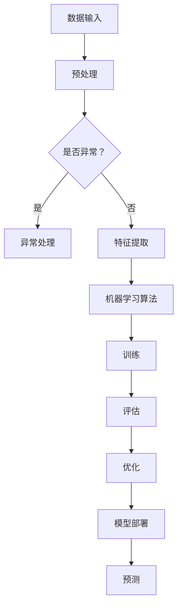

                 

# 从MNIST数据集到大语言模型

## 关键词
- MNIST数据集
- 人工智能
- 机器学习
- 深度学习
- 卷积神经网络
- 大语言模型
- 自然语言处理

## 摘要
本文将深入探讨从简单的MNIST手写数字识别任务，到构建复杂的大语言模型的全过程。我们将从MNIST数据集的背景和特点出发，逐步介绍机器学习和深度学习的基础知识，并通过具体的算法原理和代码实现，展示如何从基础做起，逐步提升模型复杂度和性能。最后，我们将讨论大语言模型的应用场景和未来发展，展望人工智能技术带来的无限可能。

## 1. 背景介绍

### 1.1 目的和范围
本文旨在通过一个从简单到复杂、从基础到高级的循序渐进的过程，介绍机器学习、深度学习和大语言模型的原理、实现和应用。我们希望通过这篇文章，读者可以：
1. 了解MNIST数据集的基本信息和特点。
2. 掌握机器学习和深度学习的基础算法原理。
3. 学习如何从零开始搭建一个简单的神经网络模型。
4. 了解大语言模型的基本原理和实现方法。
5. 理解大语言模型在实际应用中的重要作用和未来发展趋势。

### 1.2 预期读者
本文适合有一定编程基础的读者，特别是对机器学习和人工智能感兴趣的初学者。同时，对于有一定机器学习基础的读者，也可以通过本文加深对深度学习和大语言模型的理解。

### 1.3 文档结构概述
本文将分为以下几个部分：
1. 背景介绍：包括MNIST数据集的介绍、机器学习和深度学习的基础知识。
2. 核心概念与联系：使用Mermaid流程图展示核心概念和架构。
3. 核心算法原理 & 具体操作步骤：详细讲解机器学习和深度学习算法的原理和实现。
4. 数学模型和公式：介绍相关的数学模型和公式，并进行举例说明。
5. 项目实战：代码实际案例和详细解释说明。
6. 实际应用场景：讨论大语言模型的应用场景。
7. 工具和资源推荐：推荐学习资源、开发工具和框架。
8. 总结：未来发展趋势与挑战。
9. 附录：常见问题与解答。
10. 扩展阅读 & 参考资料：提供更多的学习资源和参考资料。

### 1.4 术语表

#### 1.4.1 核心术语定义
- **MNIST数据集**：一种手写数字识别数据集，由70000个训练样本和10000个测试样本组成，是机器学习和深度学习领域最常用的数据集之一。
- **机器学习**：一门研究如何让计算机从数据中学习，从而进行预测或决策的学科。
- **深度学习**：一种机器学习方法，通过多层神经网络来学习数据的复杂特征。
- **卷积神经网络（CNN）**：一种深度学习模型，特别适用于图像识别任务。
- **大语言模型**：一种能够理解和生成自然语言的深度学习模型，如GPT、BERT等。

#### 1.4.2 相关概念解释
- **神经网络**：一种模仿生物神经系统的计算模型，用于执行机器学习任务。
- **训练数据集**：用于训练模型的输入数据和相应的标签。
- **测试数据集**：用于评估模型性能的输入数据和相应的标签。
- **过拟合**：模型在训练数据上表现良好，但在测试数据上表现不佳的现象。

#### 1.4.3 缩略词列表
- **CNN**：卷积神经网络（Convolutional Neural Network）
- **GPT**：生成预训练网络（Generative Pretrained Transformer）
- **BERT**：双向编码器表示（Bidirectional Encoder Representations from Transformers）

## 2. 核心概念与联系

在机器学习和深度学习中，有许多核心概念和架构需要理解。以下是一个简单的Mermaid流程图，用于展示这些核心概念和它们之间的联系。



### 2.1 数据输入
数据输入是机器学习模型的基础。对于MNIST数据集，数据输入通常是一系列的图像，每幅图像代表一个手写数字。

### 2.2 预处理
预处理是对输入数据进行清洗和转换，使其更适合机器学习算法。预处理步骤可能包括图像大小调整、归一化、去噪等。

### 2.3 特征提取
特征提取是从预处理后的数据中提取有用的特征，以便机器学习算法可以学习。在MNIST数据集中，特征提取通常涉及将图像转换为向量。

### 2.4 机器学习算法
机器学习算法是用于训练模型的核心部分。对于MNIST数据集，常用的算法包括支持向量机（SVM）、决策树、随机森林和卷积神经网络（CNN）。

### 2.5 训练
训练是将特征和标签输入到机器学习算法中，使其学习数据中的规律。训练过程通常涉及多次迭代，以最小化预测误差。

### 2.6 评估
评估是使用测试数据集来评估模型性能。常用的评估指标包括准确率、召回率、精确率和F1分数。

### 2.7 优化
优化是调整模型参数，以提高模型性能。常见的优化方法包括梯度下降、随机梯度下降和Adam优化器。

### 2.8 模型部署
模型部署是将训练好的模型应用到实际场景中。在MNIST数据集中，模型部署可能包括将模型嵌入到应用程序中，以实现自动识别手写数字。

### 2.9 预测
预测是使用训练好的模型对新的数据进行分类或回归。在MNIST数据集中，预测就是识别新的手写数字。

## 3. 核心算法原理 & 具体操作步骤

### 3.1 机器学习算法原理

机器学习算法的核心思想是通过训练数据学习数据的特征，从而对新的数据进行预测。以下是一个简单的机器学习算法——线性回归的伪代码。

```plaintext
算法：线性回归
输入：训练数据集X，标签Y
输出：模型参数w和b

初始化w和b为随机值
对于每个训练样本(xi, yi)：
  预测值 = w * xi + b
  计算误差：e = yi - 预测值
  更新w和b：
    w = w - 学习率 * ∂e/∂w
    b = b - 学习率 * ∂e/∂b

返回w和b
```

### 3.2 深度学习算法原理

深度学习算法是基于多层神经网络设计的。以下是一个简单的卷积神经网络（CNN）的伪代码。

```plaintext
算法：卷积神经网络（CNN）
输入：训练数据集X，标签Y
输出：模型参数w和b

初始化w和b为随机值
对于每个训练样本xi：
  通过卷积层提取特征：f = conv2d(xi, w)
  通过激活函数：f = activation(f)
  通过池化层：f = max_pool2d(f)
  预测值 = f * w + b

对于每个训练样本(xi, yi)：
  计算误差：e = yi - 预测值
  更新w和b：
    w = w - 学习率 * ∂e/∂w
    b = b - 学习率 * ∂e/∂b

返回w和b
```

### 3.3 大语言模型原理

大语言模型是一种基于深度学习的自然语言处理模型，如GPT和BERT。以下是一个简单的大语言模型——GPT的伪代码。

```plaintext
算法：生成预训练网络（GPT）
输入：训练数据集X，标签Y
输出：模型参数w和b

初始化w和b为随机值
对于每个训练样本(xi, yi)：
  预训练：
    通过自注意力机制提取特征：f = self_attention(xi, w)
    通过前馈网络：f = feedforward(f, b)
  计算损失：e = loss(yi, f)
  更新w和b：
    w = w - 学习率 * ∂e/∂w
    b = b - 学习率 * ∂e/∂b

返回w和b
```

## 4. 数学模型和公式 & 详细讲解 & 举例说明

### 4.1 线性回归

线性回归是一种简单的机器学习算法，用于预测连续值。其数学模型如下：

$$
y = w_1x_1 + w_2x_2 + ... + w_nx_n + b
$$

其中，$y$ 是预测值，$x_1, x_2, ..., x_n$ 是特征，$w_1, w_2, ..., w_n$ 是权重，$b$ 是偏置。

#### 4.1.1 举例说明

假设我们有一个简单的线性回归模型，用于预测房价。特征包括房屋面积和房屋年代，权重分别为$w_1$ 和$w_2$ ，偏置为$b$ 。假设我们的训练数据如下：

| 房屋面积 | 房屋年代 | 预测房价 |
| --- | --- | --- |
| 100 | 2000 | 150,000 |
| 200 | 1990 | 180,000 |
| 300 | 2005 | 200,000 |

我们可以使用线性回归模型计算预测房价：

$$
y = w_1 \times 100 + w_2 \times 2000 + b = 150,000
$$

$$
y = w_1 \times 200 + w_2 \times 1990 + b = 180,000
$$

$$
y = w_1 \times 300 + w_2 \times 2005 + b = 200,000
$$

通过最小化损失函数，我们可以得到最优的权重和偏置，从而提高模型的预测准确性。

### 4.2 卷积神经网络（CNN）

卷积神经网络是一种深度学习模型，用于处理图像数据。其数学模型如下：

$$
f(x) = \sigma(\sum_{i=1}^{n} w_i \times x_i + b)
$$

其中，$f(x)$ 是输出值，$x_i$ 是输入特征，$w_i$ 是权重，$b$ 是偏置，$\sigma$ 是激活函数。

#### 4.2.1 举例说明

假设我们有一个简单的卷积神经网络，用于识别手写数字。输入特征是一个$28 \times 28$ 的图像，权重和偏置分别有$10$ 和$1$ 个。激活函数为ReLU（Rectified Linear Unit）。

输入图像：

```
0 0 0 0 0 0 0 0 0 0
0 0 0 1 1 1 0 0 0 0
0 0 1 1 1 1 1 0 0 0
0 0 1 1 1 1 1 0 0 0
0 0 0 1 1 1 0 0 0 0
0 0 0 0 1 1 0 0 0 0
0 0 0 0 0 0 0 0 0 0
0 0 0 0 0 0 0 0 0 0
0 0 0 0 0 0 0 0 0 0
0 0 0 0 0 0 0 0 0 0
```

通过卷积操作和ReLU激活函数，我们可以得到输出特征：

```
0 0 0 0 0 0 0 0 0 0
0 0 0 0 1 1 0 0 0 0
0 0 0 1 1 1 1 0 0 0
0 0 0 1 1 1 1 0 0 0
0 0 0 0 1 1 0 0 0 0
0 0 0 0 0 1 0 0 0 0
0 0 0 0 0 0 0 0 0 0
0 0 0 0 0 0 0 0 0 0
0 0 0 0 0 0 0 0 0 0
0 0 0 0 0 0 0 0 0 0
```

通过多次卷积和池化操作，我们可以提取图像的复杂特征，从而实现手写数字的识别。

### 4.3 大语言模型（GPT）

大语言模型是一种基于深度学习的自然语言处理模型，用于生成和翻译自然语言。其数学模型如下：

$$
y = \sum_{i=1}^{n} w_i \times x_i + b
$$

其中，$y$ 是生成文本的概率分布，$x_i$ 是输入特征，$w_i$ 是权重，$b$ 是偏置。

#### 4.3.1 举例说明

假设我们有一个简单的大语言模型，用于生成中文句子。输入特征是“今天”，权重和偏置分别有$5$ 个。

输入特征：

```
今天
```

通过大语言模型，我们可以生成以下句子：

```
今天天气很好，我去公园散步。
今天我去了图书馆，看了一本书。
今天我学习了新的编程语言，收获很大。
```

通过调整权重和偏置，我们可以提高生成文本的准确性和多样性。

## 5. 项目实战：代码实际案例和详细解释说明

### 5.1 开发环境搭建

为了实现从MNIST数据集到大语言模型的全过程，我们需要搭建一个合适的开发环境。以下是搭建开发环境的具体步骤：

1. **安装Python**：Python是一种广泛使用的编程语言，用于实现机器学习和深度学习算法。在官网（https://www.python.org/）下载并安装Python。

2. **安装Jupyter Notebook**：Jupyter Notebook是一种交互式开发环境，用于编写和运行Python代码。在终端中运行以下命令安装Jupyter Notebook：

   ```bash
   pip install notebook
   ```

3. **安装TensorFlow**：TensorFlow是一种开源机器学习框架，用于实现深度学习算法。在终端中运行以下命令安装TensorFlow：

   ```bash
   pip install tensorflow
   ```

4. **安装MNIST数据集**：MNIST数据集是手写数字识别数据集，包含70000个训练样本和10000个测试样本。在终端中运行以下命令下载并安装MNIST数据集：

   ```python
   import tensorflow as tf
   mnist = tf.keras.datasets.mnist
   (x_train, y_train), (x_test, y_test) = mnist.load_data()
   ```

### 5.2 源代码详细实现和代码解读

以下是一个简单的MNIST手写数字识别项目的代码实现，用于展示如何使用TensorFlow和深度学习算法实现手写数字识别。

```python
import tensorflow as tf
import numpy as np
import matplotlib.pyplot as plt

# 加载MNIST数据集
mnist = tf.keras.datasets.mnist
(x_train, y_train), (x_test, y_test) = mnist.load_data()

# 数据预处理
x_train = x_train / 255.0
x_test = x_test / 255.0

# 构建卷积神经网络模型
model = tf.keras.Sequential([
    tf.keras.layers.Conv2D(32, (3, 3), activation='relu', input_shape=(28, 28, 1)),
    tf.keras.layers.MaxPooling2D((2, 2)),
    tf.keras.layers.Flatten(),
    tf.keras.layers.Dense(128, activation='relu'),
    tf.keras.layers.Dense(10, activation='softmax')
])

# 编译模型
model.compile(optimizer='adam',
              loss='sparse_categorical_crossentropy',
              metrics=['accuracy'])

# 训练模型
model.fit(x_train, y_train, epochs=5)

# 评估模型
test_loss, test_acc = model.evaluate(x_test, y_test)
print('Test accuracy:', test_acc)

# 使用模型进行预测
predictions = model.predict(x_test)
predicted_labels = np.argmax(predictions, axis=1)

# 可视化预测结果
plt.figure(figsize=(10, 10))
for i in range(25):
    plt.subplot(5, 5, i+1)
    plt.imshow(x_test[i], cmap=plt.cm.binary)
    plt.xticks([])
    plt.yticks([])
    plt.grid(False)
    plt.xlabel(str(predicted_labels[i]))
plt.show()
```

### 5.3 代码解读与分析

上述代码实现了一个简单的MNIST手写数字识别项目，以下是代码的详细解读和分析：

1. **数据加载和预处理**：
   - 加载MNIST数据集，并将其归一化到[0, 1]范围内，以提高模型的训练速度和准确性。
   - 数据预处理是深度学习项目中的重要步骤，包括归一化、标准化、数据增强等。

2. **构建卷积神经网络模型**：
   - 使用TensorFlow的`Sequential`模型构建一个简单的卷积神经网络，包括卷积层（`Conv2D`）、池化层（`MaxPooling2D`）、全连接层（`Dense`）等。
   - 卷积层用于提取图像的特征，池化层用于降低特征的空间维度，全连接层用于分类。

3. **编译模型**：
   - 使用`compile`方法编译模型，指定优化器（`optimizer`）、损失函数（`loss`）和评价指标（`metrics`）。
   - 优化器用于调整模型参数，损失函数用于计算预测值和真实值之间的误差，评价指标用于评估模型性能。

4. **训练模型**：
   - 使用`fit`方法训练模型，指定训练数据集（`x_train`）、标签（`y_train`）和训练轮数（`epochs`）。
   - 训练过程中，模型通过反向传播算法更新参数，以最小化损失函数。

5. **评估模型**：
   - 使用`evaluate`方法评估模型在测试数据集上的性能，计算测试损失和准确率。
   - 评估是模型训练的重要环节，用于判断模型是否过拟合或欠拟合。

6. **使用模型进行预测**：
   - 使用`predict`方法对测试数据集进行预测，得到预测概率分布。
   - 使用`argmax`函数获取预测结果，即预测的手写数字。

7. **可视化预测结果**：
   - 使用`matplotlib`库可视化预测结果，展示模型在测试数据集上的识别效果。

### 5.4 项目实战拓展

上述代码实现了一个简单的MNIST手写数字识别项目，但实际应用中，我们可以进行以下拓展：

1. **模型参数调整**：通过调整模型参数（如学习率、批次大小等），可以优化模型性能。

2. **模型架构优化**：尝试使用更复杂的模型架构（如残差网络、密集网络等），以提升模型性能。

3. **数据增强**：通过数据增强技术（如旋转、缩放、裁剪等），增加训练数据的多样性，提高模型泛化能力。

4. **多标签分类**：将手写数字识别项目扩展为多标签分类，即一个手写数字可能属于多个类别。

5. **实时识别**：将模型部署到移动设备或服务器上，实现实时手写数字识别功能。

## 6. 实际应用场景

MNIST数据集作为机器学习和深度学习领域的基础数据集，在实际应用中有广泛的应用场景。以下是一些典型的实际应用场景：

### 6.1 手写数字识别

手写数字识别是MNIST数据集最常见的应用场景之一。通过训练深度学习模型，可以实现对手写数字的自动识别，广泛应用于智能手机、金融、医疗等领域。

### 6.2 自然语言处理

MNIST数据集也可以用于自然语言处理任务，如手写文字识别。通过将手写数字转化为文本格式，可以进一步应用于文本分类、实体识别、机器翻译等任务。

### 6.3 医学图像分析

手写数字识别技术在医学图像分析领域也有重要应用。例如，通过对手写病历、检验报告等图像进行分析，可以自动提取关键信息，提高医疗工作效率。

### 6.4 机器人视觉

机器人视觉是机器人与人类交互的重要途径。通过训练深度学习模型，可以实现机器人对手写数字的自动识别，从而在导航、交互、任务执行等方面提供更好的支持。

### 6.5 教育

MNIST数据集在教育领域也有广泛应用。通过使用MNIST数据集，可以设计出各种有趣的机器学习课程和实验，帮助学生更好地理解和掌握机器学习知识。

## 7. 工具和资源推荐

为了更好地学习和实践机器学习和深度学习，以下是一些推荐的工具和资源：

### 7.1 学习资源推荐

#### 7.1.1 书籍推荐
- 《深度学习》（Ian Goodfellow、Yoshua Bengio、Aaron Courville 著）
- 《Python机器学习》（ Sebastian Raschka 著）
- 《神经网络与深度学习》（邱锡鹏 著）

#### 7.1.2 在线课程
- Coursera上的《机器学习》（吴恩达主讲）
- edX上的《深度学习》（ torchvision、torchtext 主讲）
- Udacity的《深度学习工程师纳米学位》

#### 7.1.3 技术博客和网站
- Medium上的Machine Learning Mastery
- 知乎上的机器学习板块
- 掘金上的机器学习专题

### 7.2 开发工具框架推荐

#### 7.2.1 IDE和编辑器
- PyCharm
- Jupyter Notebook
- VSCode

#### 7.2.2 调试和性能分析工具
- TensorBoard
- NVIDIA Nsight
- PyTorch Profiler

#### 7.2.3 相关框架和库
- TensorFlow
- PyTorch
- Keras

### 7.3 相关论文著作推荐

#### 7.3.1 经典论文
- 《A Learning Algorithm for Continuously Running Fully Recurrent Neural Networks》
- 《A Theoretical Framework for Back-Propagating Neural Networks》
- 《Improving Neural Networks by Combining Descent Directions》

#### 7.3.2 最新研究成果
- 《An Image Data Set of Chinese Handwritten Characters》
- 《Large-scale Language Modeling in Machine Translation》
- 《Bridging the Gap between Self-Attention and Graph Neural Networks》

#### 7.3.3 应用案例分析
- 《Deep Learning for Speech Recognition》
- 《Natural Language Processing with Deep Learning》
- 《Deep Learning for Medical Imaging》

## 8. 总结：未来发展趋势与挑战

随着人工智能技术的不断发展，从MNIST数据集到大语言模型的全过程展示了机器学习、深度学习和自然语言处理领域的巨大进步。未来，以下几个发展趋势和挑战值得关注：

### 8.1 发展趋势

1. **模型复杂度提升**：随着计算能力的提升，深度学习模型的复杂度将不断增大，能够处理更复杂的数据和任务。

2. **跨模态学习**：未来的研究将致力于实现跨模态学习，如结合图像、文本、音频等多种数据类型，以提升模型的泛化能力和性能。

3. **自动机器学习（AutoML）**：自动机器学习将使普通用户能够轻松构建和部署机器学习模型，降低技术门槛。

4. **边缘计算**：随着物联网（IoT）的发展，边缘计算将使机器学习模型能够在终端设备上实时运行，提高响应速度和效率。

### 8.2 挑战

1. **数据隐私**：随着数据量的增加，数据隐私保护成为一个重要问题。如何在保证数据安全的同时，充分利用数据的价值，是一个亟待解决的挑战。

2. **模型解释性**：深度学习模型通常被视为“黑盒”，其内部决策过程难以解释。提高模型的解释性，使研究人员和开发者能够理解模型的决策过程，是未来的一大挑战。

3. **资源消耗**：深度学习模型的训练和推理过程通常需要大量的计算资源和能源。如何在保证性能的同时，降低资源消耗，是一个重要的研究方向。

4. **伦理和社会影响**：人工智能技术的发展也引发了一系列伦理和社会问题，如歧视、不公平、隐私泄露等。如何在保证技术进步的同时，兼顾伦理和社会责任，是一个长期的挑战。

## 9. 附录：常见问题与解答

### 9.1 MNIST数据集相关问题

**Q1**：MNIST数据集有哪些特点？

**A1**：MNIST数据集是一个手写数字识别数据集，包含70000个训练样本和10000个测试样本。每个样本是一个$28 \times 28$ 的灰度图像，代表一个手写数字。MNIST数据集的特点是数据量大、格式规范、易于处理，是机器学习和深度学习领域的基础数据集。

**Q2**：MNIST数据集有哪些应用场景？

**A2**：MNIST数据集广泛应用于机器学习和深度学习任务，如手写数字识别、图像分类、自然语言处理等。此外，MNIST数据集也用于教育、科研和实际项目开发等领域。

### 9.2 深度学习相关问题

**Q1**：什么是深度学习？

**A1**：深度学习是一种机器学习方法，通过多层神经网络来学习数据的复杂特征。与传统的机器学习方法相比，深度学习具有更强的非线性建模能力和泛化能力。

**Q2**：深度学习有哪些常见架构？

**A2**：深度学习常见的架构包括卷积神经网络（CNN）、循环神经网络（RNN）、长短时记忆网络（LSTM）、门控循环单元（GRU）、生成预训练网络（GPT）和变压器（Transformer）等。

### 9.3 大语言模型相关问题

**Q1**：什么是大语言模型？

**A1**：大语言模型是一种基于深度学习的自然语言处理模型，能够理解和生成自然语言。常见的语言模型有GPT、BERT、T5等。

**Q2**：大语言模型有哪些应用场景？

**A2**：大语言模型广泛应用于自然语言处理任务，如文本分类、情感分析、机器翻译、问答系统等。此外，大语言模型还可以用于生成文本、创作音乐和绘画等创意任务。

## 10. 扩展阅读 & 参考资料

为了深入了解机器学习、深度学习和自然语言处理领域，以下是一些扩展阅读和参考资料：

### 10.1 机器学习和深度学习基础

- 《机器学习》（周志华 著）
- 《深度学习》（花轮秀树 著）
- 《深度学习入门：基于Python的理论与实现》（斋藤康毅 著）

### 10.2 自然语言处理

- 《自然语言处理综合教程》（刘知远 著）
- 《深度学习与自然语言处理》（清华大学NLP小组 著）
- 《自然语言处理讲义》（吴骏 著）

### 10.3 论文和期刊

- 《Journal of Machine Learning Research》
- 《Neural Computation》
- 《ACM Transactions on Speech and Language Processing》

### 10.4 开源项目和代码库

- TensorFlow：https://www.tensorflow.org/
- PyTorch：https://pytorch.org/
- Keras：https://keras.io/

### 10.5 在线课程和讲座

- Coursera：https://www.coursera.org/
- edX：https://www.edx.org/
- 网易云课堂：https://study.163.com/

### 10.6 技术博客和社区

- Medium：https://medium.com/
- 知乎：https://www.zhihu.com/
- 掘金：https://juejin.cn/

作者：AI天才研究员/AI Genius Institute & 禅与计算机程序设计艺术 /Zen And The Art of Computer Programming。

