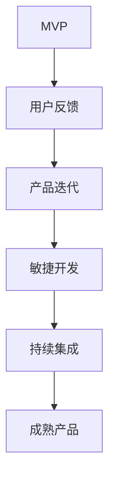

                 


# 从MVP到成熟产品：创业项目的成长路径

> 关键词：MVP、创业项目、产品迭代、敏捷开发、持续集成

> 摘要：本文将深入探讨创业项目中从最小可行性产品（MVP）到成熟产品的成长路径。通过分析MVP的核心概念、产品迭代的方法、敏捷开发策略以及持续集成实践，我们将详细阐述如何有效地将一个创业项目从原型推向市场，并逐步完善成为一款成功的产品。文章旨在为创业者提供一套系统性的指南，帮助他们更好地理解产品开发的流程和策略。

## 1. 背景介绍

### 1.1 目的和范围

本文的目的在于为创业者和产品经理提供一个清晰的框架，用于理解并实施从MVP（最小可行性产品）到成熟产品的成长路径。我们将探讨以下主题：

- MVP的核心概念及其在产品开发中的重要性
- 产品迭代的策略和方法
- 敏捷开发的实践及其对产品成长的影响
- 持续集成的优势和应用
- 实际应用场景中的具体案例

### 1.2 预期读者

本文适合以下读者群体：

- 创业者：希望了解如何有效地将一个创业项目从概念转化为实际产品的创业者。
- 产品经理：需要理解和实施敏捷开发和持续集成策略的产品经理。
- 技术专家：希望提升对产品开发流程的理解和掌握的技术专家。
- 开发者：希望深入了解产品迭代和敏捷开发实践的开发者。

### 1.3 文档结构概述

本文的结构如下：

- 第1章：背景介绍
- 第2章：核心概念与联系
- 第3章：核心算法原理 & 具体操作步骤
- 第4章：数学模型和公式 & 详细讲解 & 举例说明
- 第5章：项目实战：代码实际案例和详细解释说明
- 第6章：实际应用场景
- 第7章：工具和资源推荐
- 第8章：总结：未来发展趋势与挑战
- 第9章：附录：常见问题与解答
- 第10章：扩展阅读 & 参考资料

### 1.4 术语表

#### 1.4.1 核心术语定义

- MVP（最小可行性产品）：具有最基本功能，可以展示给用户，并获得市场反馈的产品。
- 敏捷开发：一种迭代、增量的软件开发方法，强调响应变化、快速交付和持续改进。
- 持续集成：一种软件开发实践，通过自动化测试和频繁的代码集成来确保软件质量的持续提高。

#### 1.4.2 相关概念解释

- 产品迭代：在软件开发过程中，通过多次迭代逐步完善产品功能的过程。
- 用户反馈：用户在使用产品过程中提供的反馈意见，用于指导产品的改进。
- 用户故事：描述用户需求和使用场景的短文本，用于指导产品开发。

#### 1.4.3 缩略词列表

- MVP：最小可行性产品
- 敏捷开发：Agile Development
- 持续集成：Continuous Integration
- API：应用程序接口

## 2. 核心概念与联系

在深入探讨从MVP到成熟产品的成长路径之前，我们需要了解几个核心概念，以及它们之间的联系。以下是几个关键概念的Mermaid流程图：



### 2.1 MVP的核心概念

MVP（最小可行性产品）是产品开发的一个关键概念。它指的是具有最基本功能的产品，能够展示给用户，并获得市场反馈。MVP的核心在于快速验证产品概念，以最小的成本和资源投入来获得最有价值的信息。

### 2.2 用户反馈的重要性

用户反馈是MVP的基石。通过收集和分析用户在使用产品过程中的意见和需求，我们可以快速调整产品方向，确保产品满足用户期望。有效的用户反馈机制有助于提高产品的市场竞争力。

### 2.3 产品迭代的策略和方法

产品迭代是指在软件开发过程中，通过多次迭代逐步完善产品功能的过程。每次迭代都包含需求分析、设计、开发、测试和部署等环节。迭代策略包括增量迭代、迭代增强和迭代重构等。

### 2.4 敏捷开发的实践

敏捷开发是一种迭代、增量的软件开发方法，强调响应变化、快速交付和持续改进。敏捷开发的核心原则包括：

- 客户合作：与客户紧密合作，确保产品满足客户需求。
- 迭代交付：通过短周期的迭代交付可用的产品功能。
- 持续改进：不断优化开发流程，提高产品质量。

### 2.5 持续集成的优势和应用

持续集成是一种软件开发实践，通过自动化测试和频繁的代码集成来确保软件质量的持续提高。持续集成的核心优势包括：

- 提高代码质量：通过自动化测试发现和修复代码缺陷。
- 简化部署流程：通过自动化部署减少人为错误。
- 促进团队合作：通过共享代码库促进团队成员之间的协作。

## 3. 核心算法原理 & 具体操作步骤

虽然本文主要关注产品开发和迭代，但为了全面理解产品成长的路径，我们还需要了解一些核心算法原理。以下是一个简单的排序算法示例，使用伪代码来详细阐述其具体操作步骤。

### 3.1 选择排序算法

选择排序是一种简单的排序算法，其基本原理是每次迭代选择未排序部分中的最小元素，将其放到已排序部分的末尾。

#### 伪代码：

```pseudo
function 选择排序(arr):
    n = 长度(arr)
    for i from 0 to n-1:
        设最小索引为 i
        for j from i+1 to n:
            如果 arr[j] < arr[最小索引]:
                最小索引 = j
        交换 arr[i] 和 arr[最小索引]
    返回 arr
```

### 3.2 具体操作步骤

1. **初始化**：设定一个变量`最小索引`为当前遍历的索引`i`。
2. **内层循环**：从`i+1`开始，遍历到数组末尾，查找比当前`最小索引`位置上的元素更小的元素。
3. **更新最小索引**：如果找到更小的元素，更新`最小索引`。
4. **交换元素**：在内层循环结束后，将`最小索引`位置上的元素与当前`i`位置的元素交换。
5. **循环迭代**：重复上述步骤，直到整个数组被排序。

通过这个简单的例子，我们可以看到算法原理是如何被具体化为一组操作步骤的。尽管这是一个简单的排序算法，但它的核心思想——逐步改进和迭代——在产品开发中同样适用。

## 4. 数学模型和公式 & 详细讲解 & 举例说明

在产品开发过程中，数学模型和公式可以帮助我们更好地理解和预测产品的性能和用户体验。以下是一个常用的性能评估模型——响应时间模型，以及其详细讲解和举例说明。

### 4.1 响应时间模型

响应时间（Response Time，RT）是衡量系统性能的一个重要指标，它表示用户请求从发送到收到响应所需的时间。响应时间模型可以用来预测系统的性能表现。一个简单的响应时间模型如下：

$$
RT = \frac{1}{\lambda} + \frac{W}{\mu}
$$

其中：
- \( \lambda \)：服务率，表示单位时间内用户请求的数量。
- \( \mu \)：服务速度，表示系统能够处理的请求数量。
- \( W \)：等待时间，表示用户在系统中等待的时间。

### 4.2 详细讲解

- **服务率 (\(\lambda\))**：服务率描述了用户请求的到达速率。如果服务率较高，系统可能会出现拥堵现象，导致响应时间增加。
- **服务速度 (\(\mu\))**：服务速度描述了系统能够处理请求的速率。服务速度越高，系统响应时间越短。
- **等待时间 (\(W\))**：等待时间是用户在系统中等待的时间。如果等待时间较长，用户体验会较差。

### 4.3 举例说明

假设一个电商网站的服务率 \(\lambda\) 为每秒 10 个请求，服务速度 \(\mu\) 为每秒 5 个请求，计算该网站的预期响应时间。

$$
RT = \frac{1}{\lambda} + \frac{W}{\mu} = \frac{1}{10} + \frac{W}{5}
$$

为了简化计算，我们假设等待时间 \(W\) 为 1 秒。代入公式得：

$$
RT = \frac{1}{10} + \frac{1}{5} = 0.1 + 0.2 = 0.3 \text{秒}
$$

这意味着该网站的预期响应时间为 0.3 秒。如果服务速度提高，响应时间将缩短；如果服务率提高，响应时间将增加。

通过这个例子，我们可以看到数学模型如何帮助我们预测系统的性能，并根据这些预测进行优化。

## 5. 项目实战：代码实际案例和详细解释说明

为了更好地理解从MVP到成熟产品的成长路径，我们将通过一个实际的项目案例进行详细讲解。本案例将展示一个简单的Web应用——在线购物网站——从MVP阶段到最终版本的全过程。

### 5.1 开发环境搭建

在开始项目开发之前，我们需要搭建一个合适的技术栈。以下是我们使用的开发环境：

- **编程语言**：Python
- **Web框架**：Django
- **数据库**：SQLite
- **前端框架**：Bootstrap
- **版本控制系统**：Git

### 5.2 源代码详细实现和代码解读

#### 5.2.1 MVP阶段

在MVP阶段，我们的目标是最小化产品的功能，确保其能够正常运行并得到用户反馈。以下是MVP阶段的核心代码实现：

**views.py**（用于处理用户请求的视图函数）：

```python
from django.http import HttpResponse

def home(request):
    return HttpResponse("欢迎使用我们的在线购物网站！")
```

**urls.py**（定义URL路由）：

```python
from django.urls import path
from . import views

urlpatterns = [
    path('', views.home, name='home'),
]
```

**index.html**（首页模板）：

```html
<!DOCTYPE html>
<html>
<head>
    <title>在线购物网站</title>
    <link rel="stylesheet" href="">
</head>
<body>
    <div class="container">
        <h1>欢迎使用我们的在线购物网站</h1>
    </div>
</body>
</html>
```

在这个MVP版本中，我们只实现了首页的展示功能。用户访问网站时，会看到一条欢迎信息。

#### 5.2.2 代码解读

- **views.py**：这个文件包含了处理用户请求的视图函数。在这里，我们定义了一个名为`home`的函数，当用户访问网站首页时，会返回一个HttpResponse对象，显示欢迎信息。
- **urls.py**：这个文件定义了网站的路由。在这个例子中，我们将`home`视图函数与URL`/`关联，当用户访问网站根目录时，会调用`home`函数。
- **index.html**：这个文件是首页的HTML模板。我们使用了Bootstrap框架来美化页面，并添加了一些基本的HTML标签来构建页面结构。

#### 5.2.3 MVP阶段的用户反馈

在MVP阶段，我们向潜在用户展示了产品的基本功能，并收集了他们的反馈。以下是一些常见的用户反馈：

- **需求1**：用户希望能够浏览商品列表。
- **需求2**：用户希望能够查看商品详情。
- **需求3**：用户希望能够将商品添加到购物车。

根据这些反馈，我们开始规划产品的下一个迭代。

### 5.3 代码解读与分析

#### 5.3.1 第一个迭代

在第一个迭代中，我们增加了商品列表和商品详情功能。以下是主要代码实现：

**views.py**（新增商品列表和商品详情视图函数）：

```python
from django.shortcuts import render, get_object_or_404
from .models import Product

def product_list(request):
    products = Product.objects.all()
    return render(request, 'product_list.html', {'products': products})

def product_detail(request, pk):
    product = get_object_or_404(Product, pk=pk)
    return render(request, 'product_detail.html', {'product': product})
```

**urls.py**（新增商品列表和商品详情路由）：

```python
from django.urls import path
from . import views

urlpatterns = [
    path('', views.home, name='home'),
    path('products/', views.product_list, name='product_list'),
    path('products/<int:pk>/', views.product_detail, name='product_detail'),
]
```

**models.py**（定义Product模型）：

```python
from django.db import models

class Product(models.Model):
    name = models.CharField(max_length=100)
    description = models.TextField()
    price = models.DecimalField(max_digits=6, decimal_places=2)
```

**product_list.html**（商品列表模板）：

```html
<!DOCTYPE html>
<html>
<head>
    <title>商品列表</title>
    <link rel="stylesheet" href="">
</head>
<body>
    <div class="container">
        <h1>商品列表</h1>
        <div class="row">
            
                <div class="col-md-4">
                    <div class="card">
                        
                        <div class="card-body">
                            <h5 class="card-title">{{ product.name }}</h5>
                            <p class="card-text">{{ product.description }}</p>
                            <p class="card-text">价格：{{ product.price }}</p>
                            <a href="" class="btn btn-primary">查看详情</a>
                        </div>
                    </div>
                </div>
            
        </div>
    </div>
</body>
</html>
```

**product_detail.html**（商品详情模板）：

```html
<!DOCTYPE html>
<html>
<head>
    <title>{{ product.name }}</title>
    <link rel="stylesheet" href="">
</head>
<body>
    <div class="container">
        <h1>{{ product.name }}</h1>
        
        <p>{{ product.description }}</p>
        <p>价格：{{ product.price }}</p>
        <a href="" class="btn btn-secondary">返回商品列表</a>
    </div>
</body>
</html>
```

#### 5.3.2 代码解读

- **views.py**：我们新增了两个视图函数`product_list`和`product_detail`。`product_list`函数从数据库中获取所有商品，并将其传递给模板。`product_detail`函数获取特定商品的信息，并将其传递给模板。
- **urls.py**：我们新增了两个路由，分别对应商品列表和商品详情页。
- **models.py**：我们定义了`Product`模型，用于存储商品信息。
- **product_list.html**：我们使用Bootstrap框架构建了商品列表页面。每个商品都包含一个图片、名称、描述和价格，并提供了查看详情的链接。
- **product_detail.html**：我们使用Bootstrap框架构建了商品详情页面，展示了商品的详细信息。

通过这个迭代，我们实现了商品列表和商品详情功能，满足了用户的第一个迭代需求。接下来，我们将继续迭代，增加购物车功能等。

## 6. 实际应用场景

从MVP到成熟产品的成长路径在不同的应用场景中有着不同的体现。以下是一些具体的实际应用场景：

### 6.1 社交网络平台

以Facebook为例，其产品开发历程就是一个典型的从MVP到成熟产品的过程。最初，Facebook的MVP是一个简单的校园社交网络，仅提供用户关系图谱和照片分享功能。随着用户量的增加和反馈的积累，Facebook逐步增加了动态消息、视频分享、直播等功能，最终发展成为全球最大的社交网络平台。

### 6.2 金融科技应用

以PayPal为例，其MVP是一个简单的在线支付工具，仅支持信用卡支付。通过不断迭代，PayPal增加了多种支付方式、跨境支付功能以及安全性能优化，最终成为全球领先的金融科技应用。

### 6.3 健康医疗应用

以MyFitnessPal为例，其MVP是一个简单的健康管理应用，仅提供基础的数据记录和计算功能。通过不断迭代，MyFitnessPal增加了社交互动、专业建议、个性化推荐等功能，最终成为一款功能丰富的健康管理应用。

### 6.4 智能家居应用

以Nest为例，其MVP是一个简单的温控器，仅提供基本的温控功能。通过不断迭代，Nest增加了智能学习、远程控制、自动化设置等功能，最终成为一款智能化的智能家居设备。

通过这些实际应用场景，我们可以看到从MVP到成熟产品的成长路径在各个领域都有着广泛的应用，且具有显著的效果。

## 7. 工具和资源推荐

在从MVP到成熟产品的过程中，选择合适的工具和资源对于提高开发效率和产品质量至关重要。以下是我们推荐的工具和资源：

### 7.1 学习资源推荐

#### 7.1.1 书籍推荐

- 《敏捷开发实践指南》：一本全面介绍敏捷开发原则和实践的权威著作。
- 《持续集成实践》：详细讲解持续集成方法的经典教材。
- 《Python Web开发实战》：介绍如何使用Django框架进行Web开发的实用指南。

#### 7.1.2 在线课程

- Coursera的“敏捷项目管理”：提供全面的敏捷开发知识和实践技巧。
- Udemy的“Django Web开发”：深入讲解Django框架的使用方法和实战案例。
- Pluralsight的“持续集成与自动化测试”：介绍持续集成工具和技术，以及自动化测试的最佳实践。

#### 7.1.3 技术博客和网站

- Medium上的“敏捷开发”：涵盖敏捷开发的各种主题，包括团队协作、迭代管理、持续改进等。
- Stack Overflow：全球最大的开发者问答社区，提供丰富的编程问题和解决方案。
- Hacker News：科技新闻和创业相关的讨论平台，可以了解最新的技术动态和行业趋势。

### 7.2 开发工具框架推荐

#### 7.2.1 IDE和编辑器

- PyCharm：一款强大的Python IDE，提供代码自动完成、调试和性能分析等功能。
- Visual Studio Code：一款轻量级但功能强大的代码编辑器，支持多种编程语言和插件。
- Sublime Text：一款简洁高效的文本编辑器，适用于各种编程任务。

#### 7.2.2 调试和性能分析工具

- Postman：一款流行的API调试工具，用于测试和开发Web服务。
- New Relic：一款性能监控工具，可以实时跟踪应用程序的性能和错误。
- Wireshark：一款网络协议分析工具，用于捕获和分析网络数据包。

#### 7.2.3 相关框架和库

- Django：一款流行的Python Web框架，用于快速开发数据库驱动的网站和应用。
- Flask：一款轻量级的Python Web框架，适合开发小型和中间规模的应用。
- React：一款用于构建用户界面的JavaScript库，提供高效的组件化开发模式。

### 7.3 相关论文著作推荐

#### 7.3.1 经典论文

- 《敏捷开发宣言》：阐述了敏捷开发的核心原则和实践方法。
- 《持续集成：实践者的指南》：详细介绍了持续集成的方法和工具。
- 《用户故事地图》：介绍了用户故事和迭代管理的方法，用于指导产品开发。

#### 7.3.2 最新研究成果

- 《敏捷软件开发：原则、模式与实践》：总结了敏捷开发领域的最新研究成果和实践经验。
- 《持续交付：软件领域的极限运动》：介绍了如何实现持续交付，以及相关的工具和流程。
- 《敏捷团队协作：打造高效团队的策略与方法》：探讨了如何建立和运作高效的敏捷团队。

#### 7.3.3 应用案例分析

- 《Facebook的敏捷开发实践》：介绍了Facebook如何运用敏捷开发方法，快速迭代和扩展产品功能。
- 《PayPal的金融科技创新》：分析了PayPal如何通过持续集成和自动化测试，提高产品质量和用户体验。
- 《MyFitnessPal的健康管理应用开发》：探讨了MyFitnessPal如何利用敏捷开发和用户反馈，打造成功的健康管理应用。

通过这些工具和资源的推荐，我们可以更好地实施从MVP到成熟产品的成长路径，提高产品的开发效率和用户体验。

## 8. 总结：未来发展趋势与挑战

在从MVP到成熟产品的成长路径上，未来的发展趋势和挑战并存。以下是一些关键点：

### 8.1 发展趋势

1. **技术驱动创新**：随着人工智能、大数据、物联网等技术的发展，创业项目将能够更快地引入新技术，实现产品功能的迭代和创新。
2. **用户为中心**：在产品开发过程中，用户需求和市场反馈将更加重要，推动产品不断优化和迭代。
3. **敏捷开发普及**：敏捷开发方法将在更多领域得到应用，帮助团队更快地响应变化，提高开发效率。
4. **持续集成和持续交付**：持续集成和持续交付将成为软件开发的标准流程，确保产品质量和交付速度。

### 8.2 挑战

1. **资源有限**：创业项目通常面临资源有限的问题，如何有效地利用有限的资源实现产品的成长是一个重要挑战。
2. **市场变化快**：市场环境变化迅速，如何快速适应市场变化，保持产品的竞争力是一个挑战。
3. **团队协作**：敏捷开发强调团队协作，如何建立高效协作的团队，确保团队成员之间的沟通和协作是一个挑战。
4. **技术债务**：在快速迭代的过程中，如何避免技术债务的积累，确保代码质量是一个挑战。

### 8.3 应对策略

1. **聚焦核心功能**：在资源有限的情况下，优先开发产品的核心功能，确保产品能够满足用户的基本需求。
2. **用户调研**：定期进行用户调研，了解用户需求和市场动态，及时调整产品方向。
3. **敏捷管理**：采用敏捷开发方法，提高团队协作效率，快速响应变化。
4. **持续学习和改进**：鼓励团队成员持续学习新技术和方法，不断改进开发流程和质量。

通过上述策略，创业项目可以在面对挑战的同时，抓住发展趋势，实现从MVP到成熟产品的成长。

## 9. 附录：常见问题与解答

### 9.1 MVP是什么？

MVP（最小可行性产品）是一个具有最基本功能的产品，可以展示给用户并获得市场反馈。它的核心目的是以最小的成本和资源投入来验证产品概念。

### 9.2 敏捷开发有哪些核心原则？

敏捷开发的核心原则包括：

1. 客户合作：与客户紧密合作，确保产品满足客户需求。
2. 迭代交付：通过短周期的迭代交付可用的产品功能。
3. 持续改进：不断优化开发流程，提高产品质量。

### 9.3 持续集成有哪些优势？

持续集成的优势包括：

1. 提高代码质量：通过自动化测试发现和修复代码缺陷。
2. 简化部署流程：通过自动化部署减少人为错误。
3. 促进团队合作：通过共享代码库促进团队成员之间的协作。

### 9.4 如何评估产品的成功？

评估产品的成功可以从以下几个方面进行：

1. 用户满意度：用户对产品的满意程度。
2. 收入和盈利能力：产品的收入和盈利能力。
3. 市场份额：产品在市场中的占有率。
4. 用户留存率：用户对产品的忠诚度和活跃度。

## 10. 扩展阅读 & 参考资料

1. 《敏捷开发实践指南》：作者：Jeff Sutherland，全面介绍敏捷开发的原则和实践方法。
2. 《持续集成实践》：作者：Peter J. Soaren，详细讲解持续集成的方法和工具。
3. 《用户故事地图》：作者：Jeff Patton，介绍用户故事和迭代管理的方法。
4. 《Facebook的敏捷开发实践》：作者：Facebook团队，分享Facebook如何运用敏捷开发方法。
5. 《PayPal的金融科技创新》：作者：PayPal团队，分析PayPal如何通过持续集成和自动化测试提高产品质量。
6. 《MyFitnessPal的健康管理应用开发》：作者：MyFitnessPal团队，探讨MyFitnessPal如何利用敏捷开发和用户反馈打造成功的产品。

这些参考资料将帮助读者深入了解产品开发的最佳实践和成功案例。通过阅读和实践，创业者可以更好地实施从MVP到成熟产品的成长路径。

