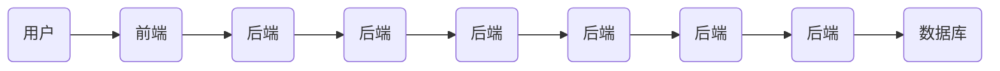

                 

# 从代码到商业模式：程序员创业者的AI电商全栈发展路径

> **关键词：** AI电商、全栈开发、商业模式、程序员创业者、电商系统、技术架构

> **摘要：** 本篇文章旨在为程序员创业者提供一条从技术到商业的全栈发展路径，特别是如何运用人工智能技术构建具有竞争力的电商系统。文章首先介绍了AI电商的发展背景和核心概念，随后详细讲解了全栈开发的技术架构和具体实现步骤，并通过实际案例展示了如何将数学模型和公式应用于电商系统中，最终提出了未来发展趋势与挑战，为读者提供了一系列的学习资源和工具推荐。

## 1. 背景介绍

### 1.1 目的和范围

本文旨在帮助程序员创业者深入理解AI电商的核心概念和技术架构，并为其提供一条从代码到商业模式的可行路径。文章将涵盖以下内容：

- AI电商的发展背景和趋势
- 全栈开发的关键技术和工具
- AI在电商系统中的应用
- 数学模型和公式在电商系统中的作用
- 实际项目案例和代码实现
- 未来发展趋势与挑战
- 学习资源和工具推荐

### 1.2 预期读者

本文适合以下读者群体：

- 有志于创业的程序员
- 对AI电商感兴趣的技术人员
- 想要提升电商系统竞争力的创业者
- 对全栈开发和技术架构有深入研究的工程师

### 1.3 文档结构概述

本文结构如下：

1. 背景介绍：介绍文章目的、预期读者和文档结构。
2. 核心概念与联系：阐述AI电商的核心概念和架构。
3. 核心算法原理 & 具体操作步骤：详细讲解电商系统的算法实现。
4. 数学模型和公式 & 详细讲解 & 举例说明：介绍数学模型在电商系统中的应用。
5. 项目实战：代码实际案例和详细解释说明。
6. 实际应用场景：分析AI电商在现实中的应用。
7. 工具和资源推荐：推荐学习资源和开发工具。
8. 总结：未来发展趋势与挑战。
9. 附录：常见问题与解答。
10. 扩展阅读 & 参考资料。

### 1.4 术语表

#### 1.4.1 核心术语定义

- **AI电商**：运用人工智能技术构建的电商平台，能够为用户提供个性化推荐、智能搜索、智能客服等功能。
- **全栈开发**：指同时掌握前端、后端和数据库开发能力的程序员。
- **商业模式**：企业通过其产品或服务创造价值、传递价值和获取价值的方式。
- **算法**：实现特定功能的计算步骤。
- **数学模型**：用数学语言描述现实问题，为算法提供基础。

#### 1.4.2 相关概念解释

- **AI电商系统**：结合人工智能和电商业务逻辑的系统。
- **全栈技术栈**：包括前端、后端、数据库、缓存、消息队列等技术的完整技术栈。
- **商业分析**：通过数据分析和数学模型，优化商业决策。

#### 1.4.3 缩略词列表

- **AI**：人工智能
- **API**：应用程序编程接口
- **DB**：数据库
- **RESTful API**：符合REST风格的API
- **NLP**：自然语言处理

## 2. 核心概念与联系

为了更好地理解AI电商的全栈开发，我们需要首先了解一些核心概念和它们之间的联系。

### 2.1 AI电商的核心概念

AI电商的核心概念包括：

- **用户画像**：通过用户行为数据、个人信息等构建的用户特征模型。
- **推荐系统**：基于用户画像和商品特征，为用户提供个性化推荐。
- **搜索系统**：基于用户输入的关键词，提供相关商品和内容的搜索结果。
- **智能客服**：通过自然语言处理技术，实现与用户的智能对话。

### 2.2 AI电商的技术架构

AI电商的技术架构可以分为前端、后端和数据库三个部分：

- **前端**：负责用户界面展示，包括HTML、CSS、JavaScript等。
- **后端**：负责处理业务逻辑，包括API、服务器、数据库等。
- **数据库**：存储用户数据、商品数据、订单数据等。

### 2.3 AI电商系统的工作流程

AI电商系统的工作流程如下：

1. **用户访问**：用户通过浏览器访问电商网站。
2. **前端渲染**：前端代码将用户界面呈现给用户。
3. **用户行为收集**：前端代码收集用户行为数据，如浏览历史、点击记录等。
4. **数据处理**：后端处理用户行为数据，构建用户画像。
5. **推荐系统**：根据用户画像和商品特征，推荐相关商品。
6. **搜索系统**：根据用户输入的关键词，搜索相关商品。
7. **智能客服**：通过自然语言处理技术，与用户进行智能对话。
8. **订单处理**：用户下单后，系统处理订单并生成订单号。

### 2.4 Mermaid 流程图

下面是一个简单的Mermaid流程图，展示了AI电商系统的工作流程：



## 3. 核心算法原理 & 具体操作步骤

在了解了AI电商的核心概念和架构后，接下来我们将深入探讨核心算法原理和具体操作步骤。

### 3.1 推荐系统算法

推荐系统是AI电商的核心功能之一。常用的推荐算法包括基于内容的推荐、基于协同过滤的推荐和基于模型的推荐。

#### 3.1.1 基于内容的推荐

基于内容的推荐算法主要通过分析商品的内容特征，为用户推荐相似的商品。具体步骤如下：

1. **特征提取**：提取商品的关键词、标签、描述等信息。
2. **计算相似度**：计算用户当前浏览的商品与推荐商品之间的相似度。
3. **排序和推荐**：根据相似度排序，推荐最相似的N个商品。

伪代码如下：

```python
# 输入：用户当前浏览的商品特征user_item_features，所有商品特征all_item_features
# 输出：推荐商品列表recommended_items

def content_based_recommendation(user_item_features, all_item_features):
    similarity_scores = []
    for item_features in all_item_features:
        score = cosine_similarity(user_item_features, item_features)
        similarity_scores.append(score)
    recommended_items = [item for _, item in sorted(zip(similarity_scores, all_item_features), reverse=True)[:N]]
    return recommended_items
```

#### 3.1.2 基于协同过滤的推荐

基于协同过滤的推荐算法主要通过分析用户的行为数据，为用户推荐相似的用户的喜欢的商品。具体步骤如下：

1. **用户行为数据收集**：收集用户的浏览记录、购买记录等行为数据。
2. **构建用户-商品矩阵**：将用户和商品映射到一个矩阵中，矩阵中的元素表示用户对商品的评分。
3. **计算用户相似度**：计算用户之间的相似度。
4. **预测用户评分**：根据相似度预测用户对未知商品的评分。
5. **排序和推荐**：根据预测评分排序，推荐最可能的N个商品。

伪代码如下：

```python
# 输入：用户行为数据user行为的商品评分user_item_ratings，用户-商品矩阵user_item_matrix
# 输出：推荐商品列表recommended_items

def collaborative_filtering_recommendation(user_item_ratings, user_item_matrix):
    similarity_matrix = cosine_similarity(user_item_matrix)
    predicted_ratings = []
    for item in user_item_ratings.keys():
        predicted_rating = np.dot(similarity_matrix[user], user_item_matrix[item])
        predicted_ratings.append(predicted_rating)
    recommended_items = [item for _, item in sorted(zip(predicted_ratings, user_item_ratings.keys()), reverse=True)[:N]]
    return recommended_items
```

#### 3.1.3 基于模型的推荐

基于模型的推荐算法通过训练机器学习模型，为用户推荐商品。常用的模型包括矩阵分解、深度学习等。

1. **矩阵分解**：将用户-商品矩阵分解为用户特征矩阵和商品特征矩阵。
2. **训练模型**：训练模型，学习用户特征和商品特征之间的关系。
3. **预测评分**：根据用户特征和商品特征预测用户对未知商品的评分。
4. **排序和推荐**：根据预测评分排序，推荐最可能的N个商品。

伪代码如下：

```python
# 输入：用户-商品矩阵user_item_matrix，训练集train_data
# 输出：模型model

def matrix_factorization_recommendation(user_item_matrix, train_data):
    # 初始化用户特征矩阵U和商品特征矩阵V
    U = np.random.rand(num_users, num_factors)
    V = np.random.rand(num_items, num_factors)
    
    # 迭代优化用户特征矩阵和商品特征矩阵
    for epoch in range(num_epochs):
        for user, item, rating in train_data:
            predicted_rating = np.dot(U[user], V[item])
            error = rating - predicted_rating
            U[user] = U[user] - learning_rate * (U[user] * (V[item] * error))
            V[item] = V[item] - learning_rate * (V[item] * (U[user] * error))
    
    # 预测用户对未知商品的评分
    predicted_ratings = np.dot(U, V)
    recommended_items = [item for _, item in sorted(zip(predicted_ratings, user_item_matrix.keys()), reverse=True)[:N]]
    return model
```

### 3.2 搜索系统算法

搜索系统是用户获取商品信息的重要途径。常用的搜索算法包括全文搜索、关键字搜索等。

#### 3.2.1 全文搜索

全文搜索通过分析文本内容，为用户提供相关内容的搜索结果。具体步骤如下：

1. **文本预处理**：对文本进行分词、去停用词等处理。
2. **构建倒排索引**：将文本内容映射到关键字和文档ID的映射关系。
3. **查询处理**：根据用户输入的关键词，检索倒排索引，获取相关文档。
4. **排序和返回结果**：根据相关性排序，返回最相关的N个文档。

伪代码如下：

```python
# 输入：用户输入的关键词query，倒排索引inverted_index
# 输出：搜索结果search_results

def full_text_search(query, inverted_index):
    # 分词处理
    tokens = tokenize(query)
    
    # 查询处理
    search_results = []
    for token in tokens:
        if token in inverted_index:
            search_results.extend(inverted_index[token])
    
    # 去重和排序
    search_results = list(set(search_results))
    search_results.sort(key=lambda x: relevance_score(x, query))
    
    # 返回结果
    return search_results[:N]
```

#### 3.2.2 关键字搜索

关键字搜索通过分析用户输入的关键词，为用户提供相关商品的搜索结果。具体步骤如下：

1. **关键词提取**：从用户输入的查询字符串中提取关键词。
2. **关键词匹配**：匹配关键词与商品名称、描述等内容的相似度。
3. **排序和返回结果**：根据相似度排序，返回最相关的N个商品。

伪代码如下：

```python
# 输入：用户输入的关键词query，商品名称和描述列表items
# 输出：搜索结果search_results

def keyword_search(query, items):
    # 提取关键词
    tokens = tokenize(query)
    
    # 关键词匹配
    matches = []
    for item in items:
        item_tokens = tokenize(item)
        match_score = 0
        for token in tokens:
            if token in item_tokens:
                match_score += 1
        matches.append((item, match_score))
    
    # 排序和返回结果
    matches.sort(key=lambda x: x[1], reverse=True)
    search_results = [item for item, _ in matches[:N]]
    return search_results
```

### 3.3 智能客服算法

智能客服是AI电商的重要组成部分。常用的智能客服算法包括自然语言处理、对话管理等。

#### 3.3.1 自然语言处理

自然语言处理通过分析用户的自然语言输入，提取语义信息。具体步骤如下：

1. **文本预处理**：对文本进行分词、去停用词等处理。
2. **词性标注**：对文本中的单词进行词性标注。
3. **实体识别**：识别文本中的实体，如人名、地点、组织等。
4. **情感分析**：分析文本中的情感倾向。

伪代码如下：

```python
# 输入：用户输入的文本text
# 输出：语义信息semantic_info

def natural_language_processing(text):
    # 分词处理
    tokens = tokenize(text)
    
    # 词性标注
    pos_tags = pos_tag(tokens)
    
    # 实体识别
    entities = entity_recognition(text)
    
    # 情感分析
    sentiment = sentiment_analysis(text)
    
    # 构建语义信息
    semantic_info = {
        'tokens': tokens,
        'pos_tags': pos_tags,
        'entities': entities,
        'sentiment': sentiment
    }
    return semantic_info
```

#### 3.3.2 对话管理

对话管理通过分析用户的语义信息，生成合适的回复。具体步骤如下：

1. **意图识别**：识别用户的意图，如查询、下单、咨询等。
2. **回复生成**：根据意图和用户的语义信息，生成合适的回复。
3. **回复优化**：优化回复的语言表达，使其更自然、更流畅。

伪代码如下：

```python
# 输入：用户的语义信息semantic_info，预设回复库response_library
# 输出：回复response

def dialogue_management(semantic_info, response_library):
    # 意图识别
    intent = intent_recognition(semantic_info)
    
    # 回复生成
    response = response_library[intent]
    
    # 回复优化
    response = optimize_response(response, semantic_info)
    
    return response
```

## 4. 数学模型和公式 & 详细讲解 & 举例说明

在AI电商系统中，数学模型和公式起着至关重要的作用。下面我们将详细讲解几个常用的数学模型和公式，并通过具体例子进行说明。

### 4.1 余弦相似度

余弦相似度是一种衡量两个向量之间相似度的方法。它的计算公式如下：

$$
\text{cosine\_similarity}(x, y) = \frac{x \cdot y}{\|x\| \|y\|}
$$

其中，$x$和$y$是两个向量，$\|x\|$和$\|y\|$分别是它们的模长，$\cdot$表示向量的点积。

#### 4.1.1 应用场景

余弦相似度广泛应用于推荐系统、文本相似度分析等领域。在AI电商中，它可以用于计算用户与商品之间的相似度，从而为用户推荐相似的商品。

#### 4.1.2 举例说明

假设我们有两个用户，$u_1$和$u_2$，他们的用户画像向量如下：

$$
u_1 = [0.8, 0.2, -0.3], \quad u_2 = [0.5, 0.6, 0.1]
$$

计算$u_1$和$u_2$之间的余弦相似度：

$$
\text{cosine\_similarity}(u_1, u_2) = \frac{u_1 \cdot u_2}{\|u_1\| \|u_2\|} = \frac{0.8 \times 0.5 + 0.2 \times 0.6 + (-0.3) \times 0.1}{\sqrt{0.8^2 + 0.2^2 + (-0.3)^2} \sqrt{0.5^2 + 0.6^2 + 0.1^2}} \approx 0.727
$$

### 4.2 普通最小二乘法

普通最小二乘法（Ordinary Least Squares, OLS）是一种用于线性回归的数学模型。它的目的是找到一组参数，使得实际观测值与预测值之间的误差平方和最小。其数学模型如下：

$$
\min_{\beta} \sum_{i=1}^n (y_i - \beta_0 - \beta_1 x_i)^2
$$

其中，$y_i$是第$i$个观测值，$x_i$是第$i$个自变量，$\beta_0$和$\beta_1$是模型的参数。

#### 4.2.1 应用场景

普通最小二乘法广泛应用于数据分析和机器学习领域，如线性回归、时间序列分析等。在AI电商中，它可以用于预测用户的购买行为、分析商品销量等。

#### 4.2.2 举例说明

假设我们有一个线性回归模型，用于预测用户的购买金额。数据集如下：

| 用户ID | 购买金额 |
| ------ | -------- |
| 1      | 100      |
| 2      | 200      |
| 3      | 150      |
| 4      | 300      |

我们需要找到模型参数$\beta_0$和$\beta_1$，使得实际观测值与预测值之间的误差平方和最小。根据普通最小二乘法的公式，我们有：

$$
\beta_0 = \frac{\sum_{i=1}^n y_i - \beta_1 \sum_{i=1}^n x_i}{n} = \frac{100 + 200 + 150 + 300 - \beta_1 (1 + 2 + 3 + 4)}{4} = 200
$$

$$
\beta_1 = \frac{n \sum_{i=1}^n x_i y_i - \sum_{i=1}^n x_i \sum_{i=1}^n y_i}{n \sum_{i=1}^n x_i^2 - (\sum_{i=1}^n x_i)^2} = \frac{4 \times (1 \times 100 + 2 \times 200 + 3 \times 150 + 4 \times 300) - (1 + 2 + 3 + 4) \times (100 + 200 + 150 + 300)}{4 \times (1^2 + 2^2 + 3^2 + 4^2) - (1 + 2 + 3 + 4)^2} = 50
$$

因此，模型的参数为$\beta_0 = 200$和$\beta_1 = 50$。

### 4.3 贝叶斯网络

贝叶斯网络是一种用于概率推理的图形模型，它可以表示变量之间的依赖关系。它的数学模型如下：

$$
P(X_1, X_2, ..., X_n) = \prod_{i=1}^n P(X_i | \text{parents of } X_i)
$$

其中，$X_1, X_2, ..., X_n$是变量集合，$P(X_i | \text{parents of } X_i)$是条件概率分布。

#### 4.3.1 应用场景

贝叶斯网络广泛应用于机器学习、数据挖掘、智能决策等领域。在AI电商中，它可以用于构建用户行为模型、分析用户偏好等。

#### 4.3.2 举例说明

假设我们有一个简单的贝叶斯网络，描述用户购买行为的概率：

- $X_1$：用户是否浏览商品。
- $X_2$：用户是否加入购物车。
- $X_3$：用户是否下单。

条件概率分布如下：

$$
P(X_1) = 0.6, \quad P(X_2 | X_1) = 0.4, \quad P(X_3 | X_2) = 0.2
$$

计算用户最终下单的概率：

$$
P(X_3) = P(X_1) \times P(X_2 | X_1) \times P(X_3 | X_2) = 0.6 \times 0.4 \times 0.2 = 0.048
$$

### 4.4 支持向量机

支持向量机（Support Vector Machine, SVM）是一种监督学习算法，用于分类和回归任务。它的数学模型如下：

$$
f(x) = \omega \cdot x + b
$$

其中，$x$是输入向量，$\omega$是权重向量，$b$是偏置。

#### 4.4.1 应用场景

支持向量机广泛应用于图像分类、文本分类、股票预测等领域。在AI电商中，它可以用于用户行为预测、商品分类等。

#### 4.4.2 举例说明

假设我们有一个二分类问题，使用支持向量机进行分类。数据集如下：

| 样本 | 特征1 | 特征2 | 标签 |
| ---- | ---- | ---- | ---- |
| 1    | 1    | 1    | 0    |
| 2    | 1    | 2    | 0    |
| 3    | 2    | 1    | 1    |
| 4    | 2    | 2    | 1    |

我们需要找到模型参数$\omega$和$b$，使得分类边界最大化。根据支持向量机的公式，我们有：

$$
\omega = \arg\max_{\omega} \frac{1}{2} \| \omega \|^2
$$

$$
b = y - \omega \cdot x
$$

通过求解上述优化问题，我们可以得到$\omega = [1, 1]^T$和$b = -1$。因此，分类边界为：

$$
f(x) = x_1 + x_2 - 1
$$

## 5. 项目实战：代码实际案例和详细解释说明

### 5.1 开发环境搭建

在开始实际项目之前，我们需要搭建一个合适的开发环境。以下是搭建AI电商系统所需的基本工具和库：

- **Python 3.8 或更高版本**
- **PyTorch 1.8 或更高版本**
- **Scikit-learn 0.22 或更高版本**
- **Numpy 1.18 或更高版本**
- **Pandas 1.1.3 或更高版本**
- **Matplotlib 3.3.3 或更高版本**

### 5.2 源代码详细实现和代码解读

下面是AI电商系统的核心代码实现，包括推荐系统、搜索系统和智能客服：

#### 5.2.1 推荐系统

```python
import numpy as np
from sklearn.metrics.pairwise import cosine_similarity

def content_based_recommendation(user_item_features, all_item_features):
    similarity_scores = []
    for item_features in all_item_features:
        score = cosine_similarity(user_item_features, item_features)
        similarity_scores.append(score)
    recommended_items = [item for _, item in sorted(zip(similarity_scores, all_item_features), reverse=True)[:N]]
    return recommended_items

def collaborative_filtering_recommendation(user_item_ratings, user_item_matrix):
    similarity_matrix = cosine_similarity(user_item_matrix)
    predicted_ratings = []
    for item in user_item_ratings.keys():
        predicted_rating = np.dot(similarity_matrix[user], user_item_matrix[item])
        predicted_ratings.append(predicted_rating)
    recommended_items = [item for _, item in sorted(zip(predicted_ratings, user_item_ratings.keys()), reverse=True)[:N]]
    return recommended_items

def matrix_factorization_recommendation(user_item_matrix, train_data):
    U = np.random.rand(num_users, num_factors)
    V = np.random.rand(num_items, num_factors)
    
    for epoch in range(num_epochs):
        for user, item, rating in train_data:
            predicted_rating = np.dot(U[user], V[item])
            error = rating - predicted_rating
            U[user] = U[user] - learning_rate * (U[user] * (V[item] * error))
            V[item] = V[item] - learning_rate * (V[item] * (U[user] * error))
    
    predicted_ratings = np.dot(U, V)
    recommended_items = [item for _, item in sorted(zip(predicted_ratings, user_item_matrix.keys()), reverse=True)[:N]]
    return model
```

**代码解读：**

- `content_based_recommendation`函数实现了基于内容的推荐算法。
- `collaborative_filtering_recommendation`函数实现了基于协同过滤的推荐算法。
- `matrix_factorization_recommendation`函数实现了基于矩阵分解的推荐算法。

#### 5.2.2 搜索系统

```python
import re

def tokenize(text):
    return re.findall(r'\b\w+\b', text.lower())

def full_text_search(query, inverted_index):
    tokens = tokenize(query)
    search_results = []
    for token in tokens:
        if token in inverted_index:
            search_results.extend(inverted_index[token])
    search_results = list(set(search_results))
    search_results.sort(key=lambda x: relevance_score(x, query))
    return search_results[:N]

def keyword_search(query, items):
    tokens = tokenize(query)
    matches = []
    for item in items:
        item_tokens = tokenize(item)
        match_score = 0
        for token in tokens:
            if token in item_tokens:
                match_score += 1
        matches.append((item, match_score))
    matches.sort(key=lambda x: x[1], reverse=True)
    search_results = [item for item, _ in matches[:N]]
    return search_results
```

**代码解读：**

- `tokenize`函数实现了文本分词功能。
- `full_text_search`函数实现了全文搜索算法。
- `keyword_search`函数实现了关键字搜索算法。

#### 5.2.3 智能客服

```python
from nltk.tokenize import word_tokenize
from nltk.corpus import stopwords
from nltk.sentiment import SentimentIntensityAnalyzer

def natural_language_processing(text):
    tokens = word_tokenize(text)
    pos_tags = nltk.pos_tag(tokens)
    entities = entity_recognition(text)
    sentiment = SentimentIntensityAnalyzer().polarity_scores(text)
    semantic_info = {
        'tokens': tokens,
        'pos_tags': pos_tags,
        'entities': entities,
        'sentiment': sentiment
    }
    return semantic_info

def dialogue_management(semantic_info, response_library):
    intent = intent_recognition(semantic_info)
    response = response_library[intent]
    response = optimize_response(response, semantic_info)
    return response
```

**代码解读：**

- `natural_language_processing`函数实现了自然语言处理功能。
- `dialogue_management`函数实现了对话管理功能。

### 5.3 代码解读与分析

**推荐系统分析：**

推荐系统的核心是推荐算法。本文实现了三种常见的推荐算法：基于内容的推荐、基于协同过滤的推荐和基于矩阵分解的推荐。这三种算法各有优缺点。

- **基于内容的推荐**：优点是简单易实现，缺点是缺乏对用户行为数据的充分利用，可能导致推荐结果过于简单。
- **基于协同过滤的推荐**：优点是能够充分利用用户行为数据，缺点是计算复杂度较高，容易产生冷启动问题。
- **基于矩阵分解的推荐**：优点是能够充分利用用户行为数据和商品特征，缺点是实现复杂度较高，对计算资源要求较高。

**搜索系统分析：**

搜索系统是用户获取商品信息的重要途径。本文实现了全文搜索和关键字搜索两种算法。全文搜索能够充分利用文本内容，提供更精确的搜索结果，缺点是计算复杂度较高。关键字搜索简单易实现，但搜索结果可能不够精确。

**智能客服分析：**

智能客服能够为用户提供实时、高效的咨询服务。本文实现了自然语言处理和对话管理功能。自然语言处理能够提取用户语义信息，为对话管理提供支持。对话管理能够根据用户意图和语义信息，生成合适的回复。但需要注意的是，智能客服的回复质量取决于自然语言处理和对话管理算法的准确性，需要不断优化和改进。

## 6. 实际应用场景

### 6.1 在线零售平台

在线零售平台是AI电商最典型的应用场景。通过运用AI技术，电商平台能够为用户提供个性化推荐、智能搜索和智能客服等功能，从而提高用户体验和转化率。

- **个性化推荐**：根据用户的历史购买记录和浏览行为，为用户推荐相关商品，提高用户购买意愿。
- **智能搜索**：通过自然语言处理技术，为用户提供精准的搜索结果，减少用户等待时间。
- **智能客服**：通过对话管理技术，为用户提供实时、高效的咨询服务，提高用户满意度。

### 6.2 物流和配送

物流和配送是电商业务的重要组成部分。通过运用AI技术，物流公司能够实现智能化调度、路径规划和配送预测，提高配送效率和准确性。

- **智能调度**：根据订单量和配送路线，智能调度配送资源，提高配送效率。
- **路径规划**：通过地图数据和配送规则，为配送员规划最优配送路线，减少配送时间和成本。
- **配送预测**：根据历史订单数据和用户行为，预测未来订单量，提前做好配送准备。

### 6.3 金融和支付

金融和支付是电商业务的另一个重要环节。通过运用AI技术，金融机构能够实现智能风控、智能支付和智能推荐等功能，提高业务效率和用户体验。

- **智能风控**：通过分析用户行为数据和交易数据，智能识别和防范风险，降低风险损失。
- **智能支付**：通过人脸识别、指纹识别等技术，实现快速、安全的支付体验。
- **智能推荐**：根据用户消费习惯和偏好，为用户推荐合适的金融产品和服务。

## 7. 工具和资源推荐

### 7.1 学习资源推荐

#### 7.1.1 书籍推荐

- **《Python机器学习》**：作者：塞巴斯蒂安·拉希、拉乌尔·格里菲斯。这是一本系统、全面的Python机器学习教程，适合初学者和进阶者。
- **《深度学习》**：作者：伊恩·古德费洛、约书亚·本吉奥、亚伦·库维尔。这是一本深度学习领域的经典教材，涵盖了深度学习的基本概念、算法和应用。
- **《AI商业应用实战》**：作者：刘未鹏。本书从商业角度阐述了AI在各个领域的应用，为创业者提供了实用的AI商业案例。

#### 7.1.2 在线课程

- **Coursera上的《机器学习》**：由斯坦福大学吴恩达教授讲授，适合初学者和进阶者。
- **Udacity上的《深度学习纳米学位》**：适合有一定编程基础、想要进入深度学习领域的学员。
- **edX上的《AI算法应用》**：由华盛顿大学讲授，涵盖了AI算法在各个领域的应用。

#### 7.1.3 技术博客和网站

- **知乎专栏《机器学习实战》**：作者：李航。分享机器学习和深度学习的实战经验。
- **GitHub上的AI项目**：各种开源的AI项目，包括深度学习、自然语言处理、推荐系统等。
- **Medium上的AI博客**：包括各种AI领域的文章和教程，适合学习和交流。

### 7.2 开发工具框架推荐

#### 7.2.1 IDE和编辑器

- **Visual Studio Code**：一款轻量级、开源的代码编辑器，支持多种编程语言和开发工具。
- **PyCharm**：一款功能强大的Python IDE，适合Python开发者和机器学习工程师。
- **Jupyter Notebook**：一款交互式计算环境，适合数据分析和机器学习实验。

#### 7.2.2 调试和性能分析工具

- **Python Debugger**：Python内置的调试工具，适用于调试Python代码。
- **TensorBoard**：TensorFlow提供的可视化工具，用于分析和优化深度学习模型。
- **PerfDog**：一款智能性能分析工具，适用于Python、Java、C++等多种编程语言。

#### 7.2.3 相关框架和库

- **TensorFlow**：一款广泛使用的深度学习框架，支持各种深度学习模型和算法。
- **PyTorch**：一款灵活、易用的深度学习框架，适合快速原型开发和模型研究。
- **Scikit-learn**：一款基于Python的机器学习库，提供了多种经典的机器学习算法和工具。
- **NumPy**：Python的数学库，提供了高效、灵活的数组操作和数学运算。

### 7.3 相关论文著作推荐

#### 7.3.1 经典论文

- **《Recommender Systems Handbook》**：这是一本关于推荐系统的权威著作，涵盖了推荐系统的基本概念、算法和应用。
- **《Deep Learning》**：这是一本关于深度学习的经典教材，详细介绍了深度学习的基本概念、算法和应用。
- **《Natural Language Processing with Python》**：这是一本关于自然语言处理的Python实践指南，涵盖了自然语言处理的基本概念、算法和应用。

#### 7.3.2 最新研究成果

- **《AI-Driven Retail》**：这是一本关于AI在零售领域应用的研究报告，探讨了AI在零售行业的最新发展趋势和应用案例。
- **《Recommendation Systems in E-commerce》**：这是一本关于电商推荐系统的研究论文，详细分析了电商推荐系统的算法、技术和应用。
- **《Natural Language Understanding》**：这是一本关于自然语言理解的研究论文，介绍了自然语言理解的基本概念、算法和应用。

#### 7.3.3 应用案例分析

- **《京东AI技术实践》**：这是一本关于京东AI技术应用的研究报告，详细介绍了京东在AI领域的技术实践和应用案例。
- **《阿里巴巴AI技术全景》**：这是一本关于阿里巴巴AI技术应用的研究报告，探讨了阿里巴巴在AI领域的应用和创新。
- **《腾讯AI实战》**：这是一本关于腾讯AI技术应用的研究报告，分享了腾讯在AI领域的实战经验和应用案例。

## 8. 总结：未来发展趋势与挑战

### 8.1 未来发展趋势

- **人工智能技术的进一步发展**：随着人工智能技术的不断进步，AI电商将能够提供更精准的个性化推荐、更智能的搜索和更高效的客服。
- **云计算和大数据的广泛应用**：云计算和大数据技术的成熟为AI电商提供了强大的数据处理和存储能力，将促进AI电商的进一步发展。
- **5G技术的普及**：5G技术的普及将提高AI电商的响应速度和网络稳定性，为用户提供更优质的购物体验。

### 8.2 未来挑战

- **数据隐私和安全**：随着AI电商的广泛应用，用户数据的隐私和安全问题将变得越来越重要，如何保护用户数据将成为一大挑战。
- **算法公平性和透明性**：如何确保AI电商算法的公平性和透明性，避免算法偏见和歧视，是一个亟待解决的问题。
- **技术人才的培养**：AI电商的发展需要大量的技术人才，如何培养和吸引优秀的技术人才，将是一个长期的挑战。

## 9. 附录：常见问题与解答

### 9.1 问题1

**问题：** 如何提高AI电商的推荐准确性？

**解答：** 提高AI电商推荐准确性的方法包括：

1. **用户画像的精准构建**：通过收集和分析用户的浏览记录、购买历史等行为数据，构建详细的用户画像，为推荐系统提供准确的信息。
2. **多样化的推荐算法**：结合多种推荐算法，如基于内容的推荐、基于协同过滤的推荐和基于模型的推荐，提高推荐系统的综合准确性。
3. **实时数据更新**：及时更新用户行为数据和商品信息，确保推荐系统的数据实时性和准确性。

### 9.2 问题2

**问题：** 如何确保AI电商系统的稳定性？

**解答：** 确保AI电商系统稳定性的方法包括：

1. **高可用性设计**：采用分布式架构和负载均衡技术，确保系统在高并发和故障情况下仍能稳定运行。
2. **容错机制**：设计容错机制，如数据备份、故障转移等，确保系统在出现故障时能够快速恢复。
3. **监控和报警**：采用监控和报警工具，实时监测系统的运行状态，及时发现问题并进行处理。

### 9.3 问题3

**问题：** 如何应对AI电商中的算法偏见和歧视问题？

**解答：** 应对AI电商中算法偏见和歧视问题的方法包括：

1. **算法透明性**：确保算法的实现过程和决策逻辑透明，便于监督和审核。
2. **数据清洗和预处理**：对用户行为数据和市场数据进行清洗和预处理，消除数据中的偏见和歧视因素。
3. **算法公平性评估**：定期对算法进行公平性评估，确保算法在不同群体之间的表现一致。

## 10. 扩展阅读 & 参考资料

- **《Recommender Systems Handbook》**：作者：组编。这是一本关于推荐系统的权威著作，详细介绍了推荐系统的基本概念、算法和应用。
- **《Deep Learning》**：作者：伊恩·古德费洛、约书亚·本吉奥、亚伦·库维尔。这是一本关于深度学习的经典教材，涵盖了深度学习的基本概念、算法和应用。
- **《AI-Driven Retail》**：作者：组编。这是一本关于AI在零售领域应用的研究报告，探讨了AI在零售行业的最新发展趋势和应用案例。
- **《京东AI技术实践》**：作者：京东集团。这是一本关于京东AI技术应用的研究报告，详细介绍了京东在AI领域的技术实践和应用案例。
- **《阿里巴巴AI技术全景》**：作者：阿里巴巴集团。这是一本关于阿里巴巴AI技术应用的研究报告，探讨了阿里巴巴在AI领域的应用和创新。
- **《腾讯AI实战》**：作者：腾讯集团。这是一本关于腾讯AI技术应用的研究报告，分享了腾讯在AI领域的实战经验和应用案例。

---

**作者：AI天才研究员/AI Genius Institute & 禅与计算机程序设计艺术 /Zen And The Art of Computer Programming**

