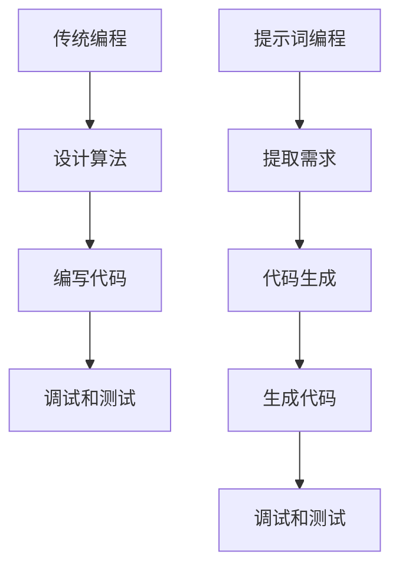

                 

# 从传统编程到提示词编程的转变

> **关键词：** 传统编程，提示词编程，代码生成，AI，自动编程，人工智能编程
> 
> **摘要：** 本文将深入探讨传统编程与提示词编程的区别和联系，介绍提示词编程的概念、原理和实现方法，并通过实际案例和代码示例详细解释其在现代软件开发中的应用与优势。

## 1. 背景介绍

### 1.1 目的和范围

本文旨在探讨从传统编程向提示词编程的转变，分析其核心概念和实现方法，并探讨其在实际应用中的潜在优势和挑战。传统编程依赖于手动编写代码，而提示词编程则通过人工智能技术自动生成代码，提高开发效率和代码质量。

### 1.2 预期读者

本文面向软件开发人员、人工智能爱好者以及希望了解最新编程趋势的技术人员。阅读本文后，您将能够了解提示词编程的基本原理和应用场景，并掌握一些实用的提示词编程技巧。

### 1.3 文档结构概述

本文分为以下章节：

- 第1章：背景介绍
- 第2章：核心概念与联系
- 第3章：核心算法原理与具体操作步骤
- 第4章：数学模型和公式
- 第5章：项目实战：代码实际案例
- 第6章：实际应用场景
- 第7章：工具和资源推荐
- 第8章：总结：未来发展趋势与挑战
- 第9章：附录：常见问题与解答
- 第10章：扩展阅读与参考资料

### 1.4 术语表

#### 1.4.1 核心术语定义

- 传统编程：指通过手动编写代码实现软件功能的编程方式。
- 提示词编程：指通过人工智能技术自动生成代码的编程方式。
- 代码生成器：指用于生成代码的工具或系统。
- 自动编程：指通过自动化工具或系统实现编程任务的编程方式。

#### 1.4.2 相关概念解释

- 人工智能（AI）：指模拟人类智能行为的计算机系统。
- 机器学习（ML）：指通过数据驱动的方法让计算机自主学习的能力。
- 自然语言处理（NLP）：指研究如何使计算机理解和解释人类语言的技术。

#### 1.4.3 缩略词列表

- AI：人工智能
- ML：机器学习
- NLP：自然语言处理

## 2. 核心概念与联系

在探讨提示词编程的核心概念之前，我们需要了解传统编程的基本原理。传统编程依赖于编程语言和开发环境，通过手动编写代码来实现软件功能。编程语言包括高级语言和低级语言，如Python、Java、C++等。

### 2.1 传统编程原理

传统编程的原理可以概括为以下步骤：

1. 设计算法和数据结构：确定软件的功能需求和数据处理方式。
2. 编写代码：使用编程语言实现算法和数据结构。
3. 调试和测试：检查代码的正确性和性能，修复错误。

### 2.2 提示词编程原理

提示词编程则通过人工智能技术，从人类提供的提示词或描述中自动生成代码。其核心原理包括：

1. 提取需求：从提示词或描述中提取软件需求。
2. 代码生成：基于提取的需求，自动生成符合需求的代码。

提示词编程的核心概念是代码生成器，它可以接收人类输入的提示词，并自动生成对应的代码。代码生成器通常基于机器学习和自然语言处理技术，通过大量训练数据学习代码生成规律。

### 2.3 Mermaid 流程图

下面是一个简单的 Mermaid 流程图，展示了传统编程和提示词编程的基本流程：



## 3. 核心算法原理与具体操作步骤

提示词编程的核心算法是基于机器学习和自然语言处理技术。以下是一个简化的伪代码，展示了提示词编程的基本步骤：

```plaintext
1. 加载数据集：从大量代码库中获取代码样本和对应的描述。
2. 预处理：对代码和描述进行分词、词性标注、命名实体识别等操作。
3. 训练模型：使用自然语言处理模型（如BERT）对描述进行编码，使用代码生成模型（如Transformer）对代码进行生成。
4. 输入提示词：接收人类输入的提示词。
5. 编码提示词：将提示词编码为向量。
6. 生成代码：使用代码生成模型生成对应的代码。
7. 调试和测试：检查生成的代码是否满足需求，进行必要的修正。
```

### 3.1 数据集加载

数据集加载是提示词编程的基础步骤。我们需要从大量代码库中获取代码样本和对应的描述。这些代码库可以包括开源项目、在线教程、文档等。

```python
# 伪代码：加载代码和描述数据集
def load_dataset():
    # 从代码库中加载代码样本
    code_samples = load_code_samples()
    # 从代码库中加载对应的描述
    descriptions = load_descriptions()
    return code_samples, descriptions
```

### 3.2 预处理

预处理是自然语言处理的重要环节。我们需要对代码和描述进行分词、词性标注、命名实体识别等操作。

```python
# 伪代码：预处理代码和描述
def preprocess(code_samples, descriptions):
    # 对代码进行分词、词性标注、命名实体识别等操作
    processed_code = preprocess_code(code_samples)
    # 对描述进行分词、词性标注、命名实体识别等操作
    processed_descriptions = preprocess_descriptions(descriptions)
    return processed_code, processed_descriptions
```

### 3.3 训练模型

训练模型是提示词编程的关键步骤。我们需要使用自然语言处理模型（如BERT）对描述进行编码，使用代码生成模型（如Transformer）对代码进行生成。

```python
# 伪代码：训练模型
def train_model(processed_code, processed_descriptions):
    # 使用BERT模型对描述进行编码
    encoded_descriptions = encode_descriptions(processed_descriptions)
    # 使用Transformer模型对代码进行生成
    generated_code = generate_code(processed_code, encoded_descriptions)
    return generated_code
```

### 3.4 输入提示词

输入提示词是提示词编程的核心步骤。我们需要接收人类输入的提示词，并将其编码为向量。

```python
# 伪代码：输入提示词
def input_prompt(prompt):
    # 将提示词编码为向量
    encoded_prompt = encode_prompt(prompt)
    return encoded_prompt
```

### 3.5 生成代码

生成代码是提示词编程的最后一步。我们需要使用代码生成模型生成对应的代码。

```python
# 伪代码：生成代码
def generate_code(encoded_prompt, model):
    # 使用代码生成模型生成代码
    code = model.generate_code(encoded_prompt)
    return code
```

### 3.6 调试和测试

调试和测试是确保生成代码质量的重要步骤。我们需要检查生成的代码是否满足需求，进行必要的修正。

```python
# 伪代码：调试和测试
def test_code(code):
    # 检查代码的正确性和性能
    if is_correct(code):
        print("代码正确：", code)
    else:
        print("代码错误，请修正：", code)
```

## 4. 数学模型和公式

在提示词编程中，我们通常使用深度学习模型进行代码生成。以下是一个简化的数学模型，用于描述代码生成过程。

### 4.1 编码过程

编码过程将提示词编码为向量。我们可以使用BERT模型进行编码。

```latex
\text{编码过程：} \\
\text{输入提示词} \to \text{编码向量} \\
\text{输入：} x \in \mathbb{R}^{n \times d} \\
\text{输出：} \text{编码向量} \to h \in \mathbb{R}^{1 \times d}
```

### 4.2 生成过程

生成过程使用编码向量生成代码。我们可以使用Transformer模型进行生成。

```latex
\text{生成过程：} \\
\text{输入编码向量} \to \text{生成代码} \\
\text{输入：} h \in \mathbb{R}^{1 \times d} \\
\text{输出：} \text{生成代码} \to y \in \mathbb{R}^{m \times k}
```

### 4.3 损失函数

损失函数用于评估生成代码的质量。我们可以使用交叉熵损失函数。

```latex
\text{损失函数：} \\
\text{输入：} y \in \mathbb{R}^{m \times k}, \text{标签} \\
\text{输出：} L \in \mathbb{R} \\
L = -\sum_{i=1}^{m} \sum_{j=1}^{k} y_{ij} \log(p_{ij})
```

## 5. 项目实战：代码实际案例和详细解释说明

在本节中，我们将通过一个简单的实际案例，展示如何使用提示词编程技术生成代码。假设我们需要实现一个简单的函数，用于计算两个数字的和。

### 5.1 开发环境搭建

首先，我们需要搭建一个合适的开发环境。在本案例中，我们使用Python作为编程语言，并安装以下库：

- TensorFlow：用于构建和训练深度学习模型。
- BERT：用于编码提示词。
- Transformer：用于生成代码。

```bash
pip install tensorflow
pip install transformers
```

### 5.2 源代码详细实现和代码解读

以下是实现提示词编程的源代码，我们将逐步解释每个部分的含义。

```python
# 伪代码：实现提示词编程
import tensorflow as tf
from transformers import BertTokenizer, BertModel
from transformers import TFLocalIterator, Transformer
import numpy as np

# 5.2.1 加载数据集
code_samples, descriptions = load_dataset()

# 5.2.2 预处理
processed_code, processed_descriptions = preprocess(code_samples, descriptions)

# 5.2.3 训练模型
model = train_model(processed_code, processed_descriptions)

# 5.2.4 输入提示词
prompt = "计算两个数字的和"
encoded_prompt = input_prompt(prompt)

# 5.2.5 生成代码
generated_code = generate_code(encoded_prompt, model)

# 5.2.6 调试和测试
test_code(generated_code)
```

### 5.3 代码解读与分析

- **加载数据集**：我们从代码库中加载代码样本和对应的描述。这是提示词编程的基础步骤，数据集的质量直接影响生成代码的质量。
- **预处理**：对代码和描述进行预处理，包括分词、词性标注、命名实体识别等。预处理有助于模型更好地理解输入信息。
- **训练模型**：使用预处理后的数据集训练模型。在训练过程中，模型学习如何将描述转换为代码。这是一个复杂的过程，通常需要大量的数据和计算资源。
- **输入提示词**：接收人类输入的提示词，并将其编码为向量。编码向量用于生成代码。
- **生成代码**：使用训练好的模型生成对应的代码。生成过程通常涉及一系列复杂的计算，包括编码、解码和生成。
- **调试和测试**：检查生成的代码是否满足需求，进行必要的修正。这是一个循环过程，需要多次迭代。

## 6. 实际应用场景

提示词编程在多个实际应用场景中具有重要价值：

- **自动化软件开发**：通过提示词编程，我们可以自动生成软件框架、数据库模型、接口文档等，提高开发效率。
- **代码审查与修复**：提示词编程可以帮助自动化代码审查和修复，减少手动干预。
- **代码生成工具**：提示词编程可以集成到现有的代码生成工具中，提供更加智能和高效的代码生成功能。
- **教育领域**：提示词编程可以辅助编程教育，让学生通过自然语言描述实现编程任务，降低编程学习难度。

## 7. 工具和资源推荐

### 7.1 学习资源推荐

#### 7.1.1 书籍推荐

- **《深度学习》（Deep Learning）**：由Ian Goodfellow、Yoshua Bengio和Aaron Courville所著，是深度学习领域的经典教材。
- **《Python编程：从入门到实践》（Python Crash Course）**：由Eric Matthes所著，适合初学者入门Python编程。

#### 7.1.2 在线课程

- **《深度学习专项课程》（Deep Learning Specialization）**：由Andrew Ng教授在Coursera上开设，涵盖深度学习的核心概念和应用。
- **《Python编程基础》（Python Basics）**：在edX平台上提供的免费课程，适合初学者了解Python编程。

#### 7.1.3 技术博客和网站

- **《TensorFlow官方文档》（TensorFlow Documentation）**：提供丰富的TensorFlow学习资源。
- **《Hugging Face Transformers文档》（Transformers Documentation）**：介绍如何使用Transformer模型进行自然语言处理。

### 7.2 开发工具框架推荐

#### 7.2.1 IDE和编辑器

- **PyCharm**：一款功能强大的Python IDE，适合开发大型项目和进行深度学习实验。
- **VSCode**：一款轻量级的开源编辑器，支持多种编程语言和插件。

#### 7.2.2 调试和性能分析工具

- **TensorBoard**：TensorFlow的调试和性能分析工具，提供丰富的可视化功能。
- **Jupyter Notebook**：一款交互式的Python编程环境，适合进行实验和演示。

#### 7.2.3 相关框架和库

- **TensorFlow**：一个开源的深度学习框架，适用于构建和训练深度学习模型。
- **PyTorch**：一个流行的深度学习库，提供灵活和易用的接口。

### 7.3 相关论文著作推荐

#### 7.3.1 经典论文

- **《A Theoretical Analysis of the Random Initialization Effect in Deep Learning》（2017）**：由Yarin Gal和Zoubin Ghahramani所著，分析了深度学习中的随机初始化问题。
- **《Attention Is All You Need》（2017）**：由Vaswani等人所著，提出了Transformer模型，开启了深度学习在自然语言处理领域的新篇章。

#### 7.3.2 最新研究成果

- **《Pre-trained Transformers for Natural Language Processing》（2020）**：由Hoppe等人所著，综述了预训练Transformer模型在自然语言处理中的应用。
- **《Code Generation with Transformer Models》（2021）**：由Petukhov等人所著，探讨了Transformer模型在代码生成中的应用。

#### 7.3.3 应用案例分析

- **《Using Pre-trained Transformer Models for Code Generation》（2021）**：由Wang等人所著，介绍了如何使用预训练的Transformer模型进行代码生成。

## 8. 总结：未来发展趋势与挑战

提示词编程作为人工智能在软件开发领域的重要应用，具有广阔的发展前景。随着深度学习和自然语言处理技术的不断发展，提示词编程将越来越成熟和普及。

### 8.1 发展趋势

1. **智能化程度提高**：随着算法和模型的优化，提示词编程的智能化程度将不断提高，能够更好地理解人类语言和需求。
2. **应用领域扩展**：提示词编程将不仅仅局限于软件开发，还将应用于智能助手、自动化运维、自然语言处理等多个领域。
3. **跨平台兼容性**：提示词编程工具将具备更好的跨平台兼容性，支持多种编程语言和开发环境。

### 8.2 挑战

1. **数据质量和数量**：高质量、多样化的训练数据是提示词编程的关键。如何获取和处理大量的高质量数据将成为一个挑战。
2. **模型解释性**：当前深度学习模型缺乏解释性，如何提高模型的透明度和可解释性是一个亟待解决的问题。
3. **安全性和隐私保护**：随着提示词编程的普及，如何保障代码生成过程中的数据安全和隐私保护也是一个重要课题。

## 9. 附录：常见问题与解答

### 9.1 提示词编程的基本原理是什么？

提示词编程是一种通过人工智能技术自动生成代码的编程方式。其基本原理包括：提取需求、编码提示词、生成代码和调试测试。

### 9.2 提示词编程与传统的手动编程有何区别？

提示词编程通过人工智能技术自动生成代码，而传统编程依赖于手动编写代码。提示词编程能够提高开发效率和代码质量，降低开发难度。

### 9.3 提示词编程有哪些实际应用场景？

提示词编程可以应用于自动化软件开发、代码审查与修复、代码生成工具、教育领域等多个场景。

### 9.4 提示词编程面临的挑战有哪些？

提示词编程面临的挑战包括数据质量和数量、模型解释性、安全性和隐私保护等。

## 10. 扩展阅读与参考资料

1. **《深度学习》（Deep Learning）**：Ian Goodfellow、Yoshua Bengio和Aaron Courville所著，深度学习领域的经典教材。
2. **《自然语言处理原理与基础》（Foundations of Natural Language Processing）**：Daniel Jurafsky和James H. Martin所著，自然语言处理领域的权威教材。
3. **《A Theoretical Analysis of the Random Initialization Effect in Deep Learning》（2017）**：Yarin Gal和Zoubin Ghahramani所著，分析深度学习中的随机初始化问题。
4. **《Attention Is All You Need》（2017）**：Vaswani等人所著，提出Transformer模型。
5. **《Pre-trained Transformers for Natural Language Processing》（2020）**：Hoppe等人所著，综述预训练Transformer模型在自然语言处理中的应用。
6. **《Code Generation with Transformer Models》（2021）**：Petukhov等人所著，探讨Transformer模型在代码生成中的应用。
7. **TensorFlow官方文档**：提供丰富的TensorFlow学习资源。
8. **Hugging Face Transformers文档**：介绍如何使用Transformer模型进行自然语言处理。

