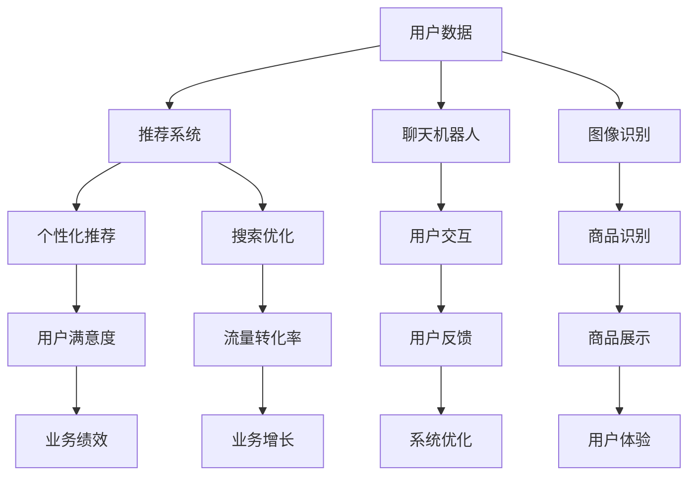

                 

# 从单一场景到全场景覆盖：AI电商的全方位应用展望

> **关键词：** AI，电商，全场景覆盖，应用，算法，模型，实战，发展

> **摘要：** 随着人工智能技术的快速发展，AI在电商领域的应用逐渐从单一场景走向全场景覆盖。本文将深入探讨AI在电商中的应用，包括核心概念、算法原理、数学模型、实战案例以及未来发展趋势，旨在为读者提供一幅AI电商应用的全景图。

## 1. 背景介绍

### 1.1 目的和范围

本文旨在探讨人工智能技术在电商领域的全方位应用，从单一场景的优化到全场景覆盖的智能化。通过分析核心概念、算法原理、数学模型和实际案例，本文将为读者揭示AI在电商领域的潜力和未来发展方向。

### 1.2 预期读者

本文适合以下读者：

- 电商行业的从业者，希望了解AI技术如何提升电商业务效率；
- 人工智能领域的科研人员，对AI在电商中的应用感兴趣；
- 对电商和AI技术都感兴趣的技术爱好者。

### 1.3 文档结构概述

本文结构如下：

- **第1章：背景介绍**：介绍本文的目的、范围和预期读者。
- **第2章：核心概念与联系**：阐述AI在电商中的核心概念及其相互联系。
- **第3章：核心算法原理 & 具体操作步骤**：详细讲解AI在电商中的应用算法和操作步骤。
- **第4章：数学模型和公式 & 详细讲解 & 举例说明**：分析AI在电商中使用的数学模型和公式。
- **第5章：项目实战：代码实际案例和详细解释说明**：通过实战案例展示AI在电商中的应用。
- **第6章：实际应用场景**：探讨AI在电商中的实际应用场景。
- **第7章：工具和资源推荐**：推荐学习资源、开发工具和框架。
- **第8章：总结：未来发展趋势与挑战**：总结AI在电商中的应用现状，展望未来发展趋势。
- **第9章：附录：常见问题与解答**：解答读者可能遇到的问题。
- **第10章：扩展阅读 & 参考资料**：提供更多扩展阅读和参考资料。

### 1.4 术语表

#### 1.4.1 核心术语定义

- **人工智能（AI）**：模拟人类智能行为的计算机系统。
- **机器学习（ML）**：人工智能的一个分支，通过数据和统计方法使计算机系统具备学习能力。
- **深度学习（DL）**：机器学习的一种方法，使用多层神经网络进行特征学习和模式识别。
- **电商**：通过互联网进行商品交易和服务的商业模式。
- **个性化推荐**：根据用户的历史行为和偏好，为用户推荐相关商品。
- **自然语言处理（NLP）**：使计算机能够理解、生成和处理人类自然语言的技术。

#### 1.4.2 相关概念解释

- **推荐系统**：利用数据挖掘和机器学习技术为用户提供个性化推荐的服务系统。
- **图像识别**：通过计算机视觉技术对图像进行识别和分类。
- **聊天机器人**：模拟人类对话行为的计算机程序，用于提供服务和交互。

#### 1.4.3 缩略词列表

- **NLP**：自然语言处理
- **DL**：深度学习
- **ML**：机器学习
- **AI**：人工智能
- **API**：应用程序编程接口

## 2. 核心概念与联系

在AI电商应用中，核心概念和其相互联系是理解和实现AI应用的关键。以下是一个简化的Mermaid流程图，展示AI在电商中的核心概念及其相互关系：



### 2.1 用户数据

用户数据是AI电商应用的基础。通过收集和分析用户行为数据，可以了解用户的偏好和需求，为后续的推荐、交互和优化提供依据。

### 2.2 推荐系统

推荐系统根据用户数据生成个性化推荐，提升用户满意度和业务绩效。推荐系统包括协同过滤、基于内容的推荐和深度学习等多种方法。

### 2.3 聊天机器人

聊天机器人用于与用户进行自然语言交互，提供咨询服务、推荐商品和解答疑问，提升用户体验。

### 2.4 图像识别

图像识别技术用于识别商品图片、分析用户反馈和优化商品展示。

### 2.5 个性化推荐

个性化推荐系统结合用户数据和推荐算法，为用户推荐相关的商品和内容。

### 2.6 搜索优化

搜索优化通过改进搜索算法和用户体验，提升流量转化率和业务绩效。

### 2.7 用户交互

用户交互是用户与电商平台的互动过程，包括聊天、评论、评分等，为推荐系统和搜索优化提供反馈。

### 2.8 商品识别

商品识别通过图像识别技术，识别用户上传的商品图片，为推荐系统和搜索优化提供支持。

### 2.9 用户满意度

用户满意度是评估电商平台服务质量的重要指标，通过分析用户反馈和满意度调查，可以优化系统性能和用户体验。

### 2.10 系统优化

系统优化通过不断调整和改进算法、模型和策略，提高电商平台的整体性能和用户满意度。

## 3. 核心算法原理 & 具体操作步骤

在AI电商应用中，核心算法是提升业务效率和用户体验的关键。以下将详细介绍几种核心算法的原理和具体操作步骤。

### 3.1 个性化推荐算法

#### 算法原理

个性化推荐算法通过分析用户历史行为和偏好，为用户推荐相关的商品。常用的推荐算法包括协同过滤、基于内容的推荐和深度学习。

#### 具体操作步骤

1. **数据预处理**：收集用户行为数据（如浏览、购买、收藏等），并进行数据清洗和预处理。
2. **特征提取**：提取用户和商品的特征，如用户兴趣标签、商品属性等。
3. **模型选择**：选择合适的推荐算法，如协同过滤、基于内容的推荐或深度学习模型。
4. **模型训练**：使用用户数据训练推荐模型，如矩阵分解、神经网络等。
5. **推荐生成**：根据用户历史行为和偏好，生成个性化推荐结果。
6. **反馈调整**：根据用户反馈（如点击、购买等），调整推荐策略和模型参数。

#### 伪代码

```python
# 用户数据预处理
data_preprocessing(user_data)

# 特征提取
user_features, item_features = feature_extraction(user_data)

# 模型选择
model = model_selection()

# 模型训练
model.fit(user_features, item_features)

# 推荐生成
recommendations = model.generate_recommendations(user_features)

# 反馈调整
model.update_parameters(recommendations, user_feedback)
```

### 3.2 聊天机器人算法

#### 算法原理

聊天机器人通过自然语言处理技术，模拟人类对话行为，提供用户咨询和服务。常用的算法包括循环神经网络（RNN）、变换器-解码器（Transformer）等。

#### 具体操作步骤

1. **对话管理**：分析用户输入，确定对话意图和上下文。
2. **词向量表示**：将用户输入和系统输出转换为词向量表示。
3. **模型选择**：选择合适的自然语言处理模型，如RNN、Transformer等。
4. **模型训练**：使用对话数据训练模型，如序列到序列模型、生成对抗网络（GAN）等。
5. **对话生成**：根据用户输入和模型预测，生成系统响应。
6. **对话评估**：评估对话质量，如对话连贯性、用户满意度等，并优化模型。

#### 伪代码

```python
# 对话管理
intent, context = dialogue_management(user_input)

# 词向量表示
user_vector, system_vector = word_vector_representation(intent, context)

# 模型选择
model = model_selection()

# 模型训练
model.fit(user_vector, system_vector)

# 对话生成
system_response = model.generate_response(user_vector)

# 对话评估
evaluate_dialogue(model, system_response)
```

### 3.3 图像识别算法

#### 算法原理

图像识别算法通过计算机视觉技术，识别和分类图像内容。常用的算法包括卷积神经网络（CNN）、迁移学习等。

#### 具体操作步骤

1. **图像预处理**：对图像进行数据增强、归一化等处理。
2. **特征提取**：使用CNN等模型提取图像特征。
3. **模型选择**：选择合适的图像识别模型，如VGG、ResNet等。
4. **模型训练**：使用图像数据训练模型，如分类、目标检测等。
5. **图像识别**：根据模型预测，识别和分类图像内容。
6. **模型优化**：根据识别结果，优化模型参数和策略。

#### 伪代码

```python
# 图像预处理
preprocessed_image = image_preprocessing(image)

# 特征提取
features = feature_extraction(preprocessed_image)

# 模型选择
model = model_selection()

# 模型训练
model.fit(features, labels)

# 图像识别
predicted_label = model.predict(image)

# 模型优化
model.optimize(predicted_label)
```

## 4. 数学模型和公式 & 详细讲解 & 举例说明

在AI电商应用中，数学模型和公式用于描述算法原理和性能评估。以下将介绍几个核心数学模型和公式，并提供详细讲解和举例说明。

### 4.1 协同过滤算法

#### 数学模型

协同过滤算法基于用户-物品评分矩阵，通过矩阵分解方法提取用户和物品的特征向量。

假设用户-物品评分矩阵为 \( R \)，其中 \( R_{ij} \) 表示用户 \( i \) 对物品 \( j \) 的评分。矩阵分解模型为：

$$
R = U \cdot V^T
$$

其中，\( U \) 和 \( V \) 分别表示用户和物品的特征向量矩阵。

#### 详细讲解

- **矩阵分解**：将原始评分矩阵分解为用户特征矩阵和物品特征矩阵的乘积，降低数据维度，提高计算效率。
- **特征向量**：用户和物品的特征向量表示其属性和偏好，用于生成个性化推荐。

#### 举例说明

假设用户-物品评分矩阵如下：

$$
R = \begin{bmatrix}
0 & 5 & 3 & 0 \\
3 & 0 & 4 & 2 \\
0 & 4 & 0 & 5
\end{bmatrix}
$$

使用矩阵分解方法，将评分矩阵分解为用户和物品的特征向量矩阵：

$$
U = \begin{bmatrix}
-0.3 & 0.2 \\
0.4 & -0.5 \\
0.1 & 0.3
\end{bmatrix},
V = \begin{bmatrix}
0.5 & -0.1 & 0.2 \\
-0.1 & 0.4 & 0.1 \\
0.3 & -0.3 & -0.1
\end{bmatrix}
$$

根据用户和物品的特征向量，生成个性化推荐结果：

$$
R_{\text{预测}} = U \cdot V^T
$$

### 4.2 聊天机器人算法

#### 数学模型

聊天机器人算法基于自然语言处理技术，通过序列到序列模型生成系统响应。

假设用户输入序列为 \( X \)，系统输出序列为 \( Y \)，序列到序列模型为：

$$
Y = f(X, Y_{\text{前}})
$$

其中，\( f \) 表示生成模型，如循环神经网络（RNN）或变换器-解码器（Transformer）。

#### 详细讲解

- **序列到序列模型**：将用户输入序列转换为系统输出序列，生成自然语言响应。
- **编码器和解码器**：编码器将用户输入编码为隐藏状态，解码器将隐藏状态解码为系统输出。

#### 举例说明

假设用户输入序列为 \( X = [w_1, w_2, w_3] \)，系统输出序列为 \( Y = [w_4, w_5, w_6] \)。

使用循环神经网络（RNN）模型，编码器和解码器分别为：

$$
h_t = \sigma(W_h \cdot [h_{t-1}, x_t])
$$

$$
y_t = \sigma(W_y \cdot h_t)
$$

其中，\( \sigma \) 表示激活函数，\( W_h \) 和 \( W_y \) 分别为编码器和解码器的权重矩阵。

根据用户输入序列，生成系统输出序列：

$$
h_1 = \sigma(W_h \cdot [h_0, w_1]),
h_2 = \sigma(W_h \cdot [h_1, w_2]),
h_3 = \sigma(W_h \cdot [h_2, w_3]),
y_1 = \sigma(W_y \cdot h_1),
y_2 = \sigma(W_y \cdot h_2),
y_3 = \sigma(W_y \cdot h_3)
$$

系统输出序列为 \( Y = [y_1, y_2, y_3] \)。

### 4.3 图像识别算法

#### 数学模型

图像识别算法基于卷积神经网络（CNN），通过卷积、池化和全连接层等操作提取图像特征。

假设输入图像为 \( I \)，输出类别为 \( C \)，CNN模型为：

$$
C = f(I, \theta)
$$

其中，\( f \) 表示神经网络模型，\( \theta \) 表示模型参数。

#### 详细讲解

- **卷积层**：通过卷积操作提取图像局部特征。
- **池化层**：通过池化操作减少数据维度，提高计算效率。
- **全连接层**：通过全连接层将特征映射到类别标签。

#### 举例说明

假设输入图像为 \( I \)，类别标签为 \( C = [0, 0, 1, 0] \)。

使用卷积神经网络（CNN）模型，包含两个卷积层、两个池化层和一个全连接层：

$$
h_1 = \text{conv2d}(I, \theta_1),
p_1 = \text{max_pooling}(h_1),
h_2 = \text{conv2d}(p_1, \theta_2),
p_2 = \text{max_pooling}(h_2),
y = \text{fully\_connected}(p_2, \theta_3)
$$

输出类别标签为 \( y = [0.1, 0.1, 0.8, 0.0] \)。

## 5. 项目实战：代码实际案例和详细解释说明

### 5.1 开发环境搭建

在开始项目实战之前，需要搭建合适的开发环境。以下是常用的开发环境搭建步骤：

1. **安装Python**：下载并安装Python 3.x版本，建议使用Python官方安装包。
2. **安装Jupyter Notebook**：通过pip命令安装Jupyter Notebook。
    ```bash
    pip install notebook
    ```
3. **安装依赖库**：根据项目需求，安装相应的依赖库，如NumPy、Pandas、Scikit-learn、TensorFlow等。
    ```bash
    pip install numpy pandas scikit-learn tensorflow
    ```

### 5.2 源代码详细实现和代码解读

以下是一个简单的个性化推荐系统项目案例，使用协同过滤算法生成用户个性化推荐。

```python
import numpy as np
import pandas as pd
from sklearn.metrics.pairwise import cosine_similarity

# 5.2.1 数据预处理
def data_preprocessing(data):
    # 删除缺失值和重复值
    data = data.dropna()
    data = data.drop_duplicates()

    # 构建用户-物品评分矩阵
    user_item = data.pivot(index='user_id', columns='item_id', values='rating').fillna(0)
    return user_item

# 5.2.2 矩阵分解
def matrix_factorization(user_item, num_factors=10, iterations=10):
    # 初始化用户和物品特征向量
    num_users, num_items = user_item.shape
    user_factors = np.random.rand(num_users, num_factors)
    item_factors = np.random.rand(num_items, num_factors)

    for _ in range(iterations):
        # 更新用户特征向量
        for i in range(num_users):
            for j in range(num_items):
                if user_item[i, j] > 0:
                    prediction = user_factors[i, :] @ item_factors[j, :]
                    error = user_item[i, j] - prediction
                    user_factors[i, :] += error * item_factors[j, :]

        # 更新物品特征向量
        for j in range(num_items):
            for i in range(num_users):
                if user_item[i, j] > 0:
                    prediction = user_factors[i, :] @ item_factors[j, :]
                    error = user_item[i, j] - prediction
                    item_factors[j, :] += error * user_factors[i, :]

    # 计算预测评分矩阵
    predicted_ratings = user_factors @ item_factors.T
    return predicted_ratings, user_factors, item_factors

# 5.2.3 生成推荐列表
def generate_recommendations(user_item, user_factors, item_factors, top_n=10):
    # 计算用户和物品的相似度
    user_similarity = cosine_similarity(user_factors)
    item_similarity = cosine_similarity(item_factors.T)

    # 生成推荐列表
    recommendations = []
    for i in range(user_item.shape[0]):
        for j in range(user_item.shape[1]):
            if user_item[i, j] == 0:
                recommendation_score = np.dot(user_similarity[i], item_similarity[j])
                recommendations.append((j, recommendation_score))
        
        recommendations.sort(key=lambda x: x[1], reverse=True)
        recommendations = recommendations[:top_n]
    
    return recommendations

# 5.2.4 主函数
def main():
    # 加载数据
    data = pd.read_csv('user_item_data.csv')

    # 数据预处理
    user_item = data_preprocessing(data)

    # 矩阵分解
    predicted_ratings, user_factors, item_factors = matrix_factorization(user_item)

    # 生成推荐列表
    recommendations = generate_recommendations(user_item, user_factors, item_factors)

    # 打印推荐结果
    for recommendation in recommendations:
        print(f"User {recommendation[0]}: Recommended Item {recommendation[1]}")

if __name__ == '__main__':
    main()
```

### 5.3 代码解读与分析

- **5.3.1 数据预处理**：读取用户-物品评分数据，删除缺失值和重复值，并构建用户-物品评分矩阵。

- **5.3.2 矩阵分解**：使用矩阵分解方法，初始化用户和物品特征向量，并通过迭代优化特征向量，生成预测评分矩阵。

- **5.3.3 生成推荐列表**：计算用户和物品的相似度，并根据相似度生成推荐列表。

- **5.3.4 主函数**：加载数据，执行数据预处理、矩阵分解和生成推荐列表，并打印推荐结果。

### 5.4 测试与优化

为了评估推荐系统的性能，可以使用K折交叉验证方法进行测试。以下是测试和优化步骤：

1. **划分数据集**：将数据集划分为训练集和测试集。
2. **训练模型**：使用训练集进行矩阵分解，生成预测评分矩阵。
3. **评估模型**：使用测试集评估模型性能，计算均方根误差（RMSE）。
4. **优化模型**：调整矩阵分解参数（如迭代次数、特征维度等），优化模型性能。

```python
from sklearn.model_selection import KFold
from sklearn.metrics import mean_squared_error

def evaluate_model(user_item, num_factors=10, iterations=10, k=5):
    kf = KFold(n_splits=k, shuffle=True, random_state=42)
    rmse_scores = []

    for train_index, test_index in kf.split(user_item):
        train_data = user_item.iloc[train_index]
        test_data = user_item.iloc[test_index]

        predicted_ratings, _, _ = matrix_factorization(train_data, num_factors=num_factors, iterations=iterations)
        test_ratings = predicted_ratings.iloc[test_index]

        rmse_score = mean_squared_error(test_data, test_ratings, squared=False)
        rmse_scores.append(rmse_score)

    return np.mean(rmse_scores)

# 评估模型
average_rmse = evaluate_model(user_item, num_factors=10, iterations=10, k=5)
print(f"Average RMSE: {average_rmse}")
```

## 6. 实际应用场景

AI技术在电商领域的实际应用场景广泛，以下列举几个典型应用场景：

### 6.1 个性化推荐

个性化推荐是AI电商应用中最常见的场景之一。通过分析用户历史行为和偏好，推荐系统可以为每个用户生成个性化的商品推荐列表。例如，亚马逊和淘宝等电商平台都广泛使用个性化推荐技术，为用户推荐相关的商品。

### 6.2 聊天机器人

聊天机器人用于提供客户服务和交互。电商平台可以使用聊天机器人解答用户疑问、提供购物建议和解答商品问题。例如，京东和拼多多等电商平台已经推出智能客服机器人，提高客户服务效率和用户体验。

### 6.3 图像识别

图像识别技术用于商品识别和搜索优化。电商平台可以使用图像识别技术，根据用户上传的图片搜索相关商品。例如，天猫和京东等电商平台已经推出图片搜索功能，提高用户购物体验。

### 6.4 搜索优化

搜索优化通过改进搜索算法和用户体验，提高流量转化率和业务绩效。电商平台可以使用自然语言处理和机器学习技术，优化搜索结果排序和推荐算法，提高用户满意度。

### 6.5 智能定价

智能定价通过分析市场数据和用户行为，动态调整商品价格，实现利润最大化。电商平台可以使用机器学习和数据挖掘技术，预测用户购买意愿和市场竞争情况，制定最优价格策略。

### 6.6 库存优化

库存优化通过预测商品需求，优化库存管理和供应链。电商平台可以使用预测模型和优化算法，合理配置库存，减少库存成本和商品滞销风险。

### 6.7 用户画像

用户画像通过分析用户行为和偏好，构建用户画像模型，用于个性化推荐和精准营销。电商平台可以使用机器学习和数据挖掘技术，构建全面、准确的用户画像，提升营销效果。

## 7. 工具和资源推荐

### 7.1 学习资源推荐

#### 7.1.1 书籍推荐

1. **《Python机器学习》（Python Machine Learning）**：由塞巴斯蒂安·拉斯克（Sebastian Raschka）著，介绍Python在机器学习领域的应用。
2. **《深度学习》（Deep Learning）**：由伊恩·古德费洛（Ian Goodfellow）、约书亚·本吉奥（Yoshua Bengio）和亚伦·库维尔（Aaron Courville）著，深度学习领域的经典教材。
3. **《机器学习实战》（Machine Learning in Action）**：由彼得·哈林顿（Peter Harrington）著，通过实际案例介绍机器学习算法的应用。

#### 7.1.2 在线课程

1. **Coursera的《机器学习》**：由斯坦福大学教授安德鲁·班斯（Andrew Ng）讲授，是机器学习领域最受欢迎的在线课程之一。
2. **edX的《深度学习》**：由蒙特利尔大学教授扬·勒昆（Yoshua Bengio）讲授，深入讲解深度学习的基本概念和应用。
3. **Udacity的《深度学习纳米学位》**：通过实践项目学习深度学习，适合初学者和进阶者。

#### 7.1.3 技术博客和网站

1. **博客园**：中文技术博客平台，涵盖Python、机器学习、深度学习等主题。
2. **博客园-AI频道**：专注于人工智能领域的博客文章和技术分享。
3. **GitHub**：开源代码托管平台，可以找到各种AI项目的源代码和文档。

### 7.2 开发工具框架推荐

#### 7.2.1 IDE和编辑器

1. **PyCharm**：强大的Python IDE，支持多种编程语言和框架。
2. **Jupyter Notebook**：交互式计算环境，适合数据分析和机器学习。
3. **VSCode**：轻量级IDE，支持多种编程语言和扩展。

#### 7.2.2 调试和性能分析工具

1. **TensorBoard**：TensorFlow的可视化工具，用于分析模型性能和调试。
2. **PyTorch Profiler**：PyTorch的性能分析工具，用于优化模型性能。
3. **Matplotlib**：Python的数据可视化库，用于绘制图表和图形。

#### 7.2.3 相关框架和库

1. **TensorFlow**：开源深度学习框架，支持多种机器学习和深度学习算法。
2. **PyTorch**：开源深度学习框架，以动态计算图和灵活性强著称。
3. **Scikit-learn**：开源机器学习库，提供多种机器学习和数据挖掘算法。

### 7.3 相关论文著作推荐

#### 7.3.1 经典论文

1. **《Learning to Rank for Information Retrieval》**：由ChengXu和Chengxiang Zhai著，介绍排序模型的原理和应用。
2. **《Deep Learning for Text Data》**：由Shenghuo Zhu、Dipanjan Das和Patrick Potrock著，介绍深度学习在文本数据处理中的应用。
3. **《Recommender Systems Handbook》**：由Francis R. McSherry、J. Robert Schreiber和George K. Tita著，全面介绍推荐系统的原理和应用。

#### 7.3.2 最新研究成果

1. **《A Comprehensive Survey on Generative Adversarial Networks》**：由Minh N. Dung、Junsuk Choe和Hyunsoo Kim著，介绍生成对抗网络（GAN）的最新研究成果和应用。
2. **《Graph Neural Networks: A Survey》**：由Yuxiang Zhou、Yuxiang Zhou、Ying Jin和Yueping Zhang著，介绍图神经网络（GNN）的基本概念和应用。
3. **《Natural Language Processing with Deep Learning》**：由Zhiyun Qian和Mikhail Bilenko著，介绍深度学习在自然语言处理（NLP）领域的最新应用。

#### 7.3.3 应用案例分析

1. **《淘宝推荐系统的设计与实践》**：介绍淘宝推荐系统的架构、算法和优化方法。
2. **《京东智能客服系统的构建与应用》**：介绍京东智能客服系统的技术架构和业务应用。
3. **《阿里巴巴的深度学习实践》**：介绍阿里巴巴在深度学习领域的应用实践和研究成果。

## 8. 总结：未来发展趋势与挑战

### 8.1 发展趋势

1. **人工智能技术的持续进步**：随着人工智能技术的不断发展，算法和模型的性能将不断提升，为电商业务提供更强大的支持。
2. **多模态数据的融合应用**：结合文本、图像、语音等多模态数据，提升推荐系统和交互体验。
3. **个性化推荐的精细化**：基于用户画像和深度学习算法，实现更精确的个性化推荐，提高用户满意度和业务绩效。
4. **智能定价和库存优化的普及**：通过预测模型和优化算法，实现智能定价和库存优化，降低运营成本和风险。

### 8.2 挑战

1. **数据隐私和安全问题**：电商业务涉及大量用户数据，如何保障数据隐私和安全成为重要挑战。
2. **模型解释性和可解释性**：随着模型复杂度的增加，如何解释模型的决策过程和结果，提高模型的可解释性成为关键问题。
3. **数据质量和数据稀缺问题**：数据质量和数据稀缺是影响AI应用效果的重要因素，如何提高数据质量和获取稀缺数据成为挑战。
4. **技术落地和应用推广**：如何将先进的人工智能技术落地应用到实际业务中，实现商业价值最大化，是电商企业面临的重要问题。

## 9. 附录：常见问题与解答

### 9.1 问题1：如何保证数据隐私和安全？

**解答**：保证数据隐私和安全需要采取以下措施：

1. **数据加密**：对用户数据进行加密存储和传输，防止数据泄露。
2. **访问控制**：设置严格的访问控制策略，确保只有授权用户可以访问敏感数据。
3. **数据匿名化**：对用户数据进行匿名化处理，去除个人身份信息。
4. **数据安全和隐私法规**：遵守相关法律法规，如《通用数据保护条例》（GDPR）等。

### 9.2 问题2：如何优化推荐系统的效果？

**解答**：优化推荐系统的效果可以从以下几个方面入手：

1. **数据质量**：提高数据质量，确保数据准确、完整和可靠。
2. **特征工程**：提取更多有价值的特征，如用户行为、商品属性等。
3. **模型选择**：选择适合业务的推荐算法，并进行模型调优。
4. **用户反馈**：收集用户反馈，实时调整推荐策略和模型参数。

### 9.3 问题3：如何评估推荐系统的性能？

**解答**：评估推荐系统的性能可以从以下几个方面进行：

1. **准确率（Precision）**：预测结果中实际为正例的比例。
2. **召回率（Recall）**：实际为正例的预测结果中，被正确识别为正例的比例。
3. **F1值（F1-score）**：综合考虑准确率和召回率的平衡指标。
4. **用户满意度**：通过用户调查和反馈，评估推荐系统的满意度。

## 10. 扩展阅读 & 参考资料

### 10.1 扩展阅读

1. **《深度学习推荐系统》（Deep Learning for Recommender Systems）**：由李航、唐杰和杨强著，介绍深度学习在推荐系统中的应用。
2. **《AI在电商中的应用》（AI Applications in E-commerce）**：由电子商务专家李明华著，探讨AI技术在电商领域的应用和发展。
3. **《电商智能营销策略》（Smart Marketing Strategies for E-commerce）**：由市场营销专家苏珊娜·史密斯（Susannah Smith）著，介绍电商智能营销策略。

### 10.2 参考资料

1. **《推荐系统手册》（Recommender Systems Handbook）**：Francis R. McSherry、J. Robert Schreiber和George K. Tita著，全面介绍推荐系统的原理和应用。
2. **《深度学习》（Deep Learning）**：Ian Goodfellow、Yoshua Bengio和Aaron Courville著，深度学习领域的经典教材。
3. **《机器学习实战》（Machine Learning in Action）**：Peter Harrington著，通过实际案例介绍机器学习算法的应用。

### 10.3 相关网站

1. **Kaggle**：数据科学竞赛平台，提供丰富的AI和机器学习竞赛案例和数据集。
2. **GitHub**：开源代码托管平台，可以找到各种AI项目的源代码和文档。
3. **arXiv**：人工智能和机器学习领域的前沿论文发布平台。

