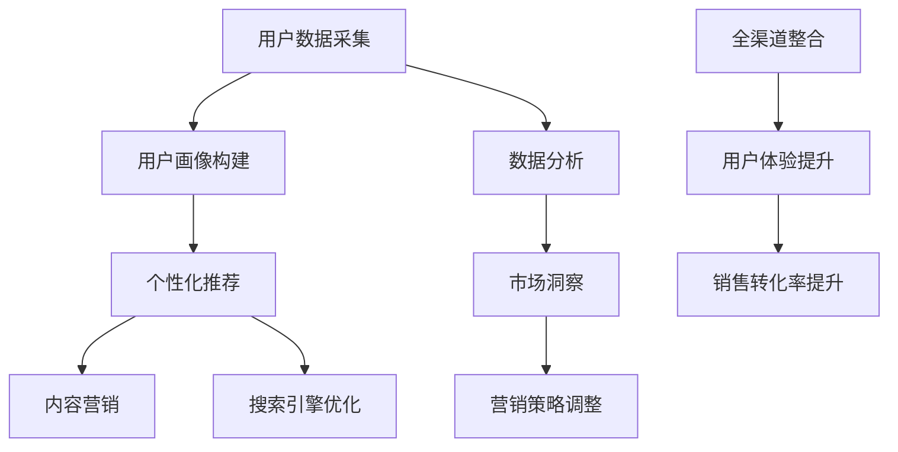

                 

# 从单一渠道到全渠道融合：AI驱动的电商全域营销实施策略与技术支持

> **关键词：** 电商、全域营销、AI、渠道融合、数据驱动、用户体验
>
> **摘要：** 本文章将深入探讨从单一渠道到全渠道融合的电商营销变革，分析AI技术在电商全域营销中的应用，并详细讲解AI驱动的电商全域营销实施策略和技术支持，旨在为电商从业者提供有价值的指导。

## 1. 背景介绍

### 1.1 目的和范围

本文旨在探讨电商行业从单一渠道到全渠道融合的发展趋势，特别是在AI技术推动下的全域营销策略。通过分析AI技术在电商营销中的应用，本文将介绍具体的实施策略和技术支持，帮助电商从业者更好地应对市场变化，提升营销效果。

### 1.2 预期读者

本文面向电商行业从业者、市场营销人员、技术专家以及对此领域感兴趣的研究者。预期读者应具备基本的电商营销知识和对AI技术的初步了解。

### 1.3 文档结构概述

本文分为十个部分，包括背景介绍、核心概念与联系、核心算法原理、数学模型和公式、项目实战、实际应用场景、工具和资源推荐、总结与未来发展趋势、常见问题与解答以及扩展阅读和参考资料。

### 1.4 术语表

#### 1.4.1 核心术语定义

- **全域营销：** 指通过整合线上和线下渠道，实现营销活动的全面覆盖和协同运作。
- **AI驱动：** 利用人工智能技术，自动化和智能化营销过程。
- **用户画像：** 基于用户行为数据和属性，构建的用户信息模型。

#### 1.4.2 相关概念解释

- **单一渠道：** 指电商企业在某一特定渠道（如电商平台、社交媒体等）进行的营销活动。
- **全渠道融合：** 指将多个渠道整合为一个统一的营销体系，提高用户满意度和转化率。

#### 1.4.3 缩略词列表

- **AI：** 人工智能
- **CRM：** 客户关系管理
- **DSP：** 显示广告平台
- **DMP：** 数据管理平台

## 2. 核心概念与联系

在探讨电商全域营销时，理解核心概念及其相互联系至关重要。以下是电商全域营销中关键概念和它们之间关系的Mermaid流程图。



### 2.1 用户数据采集

用户数据采集是电商全域营销的基础。通过多种渠道（如网站、APP、线下活动等）收集用户行为数据和属性数据，为后续的用户画像构建提供数据支持。

### 2.2 用户画像构建

基于采集到的用户数据，通过数据分析和机器学习算法构建用户画像。用户画像包括用户的基本信息、行为特征、兴趣偏好等，为个性化推荐和内容营销提供依据。

### 2.3 个性化推荐

利用用户画像，实现个性化推荐。通过算法分析用户的浏览、购买行为，推荐相关产品和服务，提高用户满意度和转化率。

### 2.4 内容营销

根据用户画像，定制化内容营销策略，包括社交媒体营销、电子邮件营销、搜索引擎营销等。内容营销旨在提高品牌知名度，增强用户黏性。

### 2.5 搜索引擎优化

通过对网站进行搜索引擎优化（SEO），提高在搜索引擎中的排名，吸引潜在用户访问网站，提高销售转化率。

### 2.6 数据分析与市场洞察

通过数据分析，洞察市场趋势和用户需求，为营销策略调整提供依据。数据分析包括用户行为分析、市场趋势分析、竞争对手分析等。

### 2.7 营销策略调整

根据市场洞察和数据分析结果，动态调整营销策略，优化资源配置，提高营销效果。

### 2.8 全渠道整合

实现线上线下渠道的整合，提供一致的购物体验，提高用户体验和销售转化率。

### 2.9 用户体验提升

通过个性化服务和快速响应，提升用户体验，增强用户忠诚度。

### 2.10 销售转化率提升

通过全渠道整合和个性化营销，提高销售转化率，实现商业目标。

## 3. 核心算法原理 & 具体操作步骤

### 3.1 用户画像构建算法

用户画像构建的核心算法包括数据清洗、特征工程和机器学习模型训练。以下是具体的操作步骤：

#### 3.1.1 数据清洗

```python
# 数据清洗伪代码
def clean_data(data):
    # 去除缺失值和重复值
    data = remove_null_and_duplicate_values(data)
    # 转换数据类型
    data = convert_data_types(data)
    # 填补缺失值
    data = fill_missing_values(data)
    return data
```

#### 3.1.2 特征工程

```python
# 特征工程伪代码
def feature_engineering(data):
    # 构建时间特征
    data['hour_of_day'] = data['timestamp'] % 24
    # 构建用户行为特征
    data['visit_count'] = data['session_count'].rolling(window=7).mean()
    # 特征选择
    data = select_features(data)
    return data
```

#### 3.1.3 机器学习模型训练

```python
# 机器学习模型训练伪代码
def train_model(data):
    # 数据分割
    X_train, X_test, y_train, y_test = split_data(data)
    # 模型选择
    model = select_model()
    # 模型训练
    model.fit(X_train, y_train)
    # 模型评估
    score = model.score(X_test, y_test)
    return model, score
```

### 3.2 个性化推荐算法

个性化推荐算法的核心是协同过滤和内容推荐。以下是具体的操作步骤：

#### 3.2.1 协同过滤

```python
# 协同过滤伪代码
def collaborative_filtering(train_data):
    # 建立用户-物品矩阵
    user_item_matrix = build_user_item_matrix(train_data)
    # 计算相似度矩阵
    similarity_matrix = calculate_similarity_matrix(user_item_matrix)
    # 推荐物品
    recommendations = generate_recommendations(user_item_matrix, similarity_matrix)
    return recommendations
```

#### 3.2.2 内容推荐

```python
# 内容推荐伪代码
def content_based_recommendation(item_data, user_profile):
    # 提取物品特征
    item_features = extract_item_features(item_data)
    # 计算相似度
    similarity = calculate_similarity(item_features, user_profile)
    # 推荐物品
    recommendations = generate_recommendations(similarity)
    return recommendations
```

### 3.3 营销策略调整算法

营销策略调整算法的核心是预测分析和决策优化。以下是具体的操作步骤：

#### 3.3.1 预测分析

```python
# 预测分析伪代码
def predictive_analysis(data):
    # 数据预处理
    data = preprocess_data(data)
    # 模型训练
    model = train_model(data)
    # 预测
    predictions = model.predict(data)
    return predictions
```

#### 3.3.2 决策优化

```python
# 决策优化伪代码
def decision_optimization(predictions, budget):
    # 策略评估
    scores = evaluate_policies(predictions, budget)
    # 决策选择
    best_policy = select_best_policy(scores)
    return best_policy
```

## 4. 数学模型和公式 & 详细讲解 & 举例说明

### 4.1 用户画像构建的数学模型

用户画像构建涉及多种数学模型，如聚类分析、协同过滤等。以下是具体的数学模型和公式：

#### 4.1.1 聚类分析

- 距离度量：欧几里得距离、曼哈顿距离、切比雪夫距离等
- 聚类算法：K-means、层次聚类等

#### 4.1.2 协同过滤

- 相似度度量：余弦相似度、皮尔逊相关系数等
- 推荐算法：基于矩阵分解的协同过滤、基于模型的协同过滤等

### 4.2 个性化推荐的数学模型

个性化推荐主要基于用户行为数据和物品特征。以下是具体的数学模型和公式：

#### 4.2.1 协同过滤

- 用户-物品评分矩阵：\(R\)
- 用户相似度矩阵：\(S\)
- 推荐评分：\(r_{ui}\)

\[ r_{ui} = \sum_{j \in N(i)} S_{uj} \cdot R_{ji} \]

其中，\(N(i)\)表示物品\(i\)的邻居集合。

#### 4.2.2 内容推荐

- 用户特征向量：\(x_u\)
- 物品特征向量：\(x_i\)
- 相似度度量：余弦相似度

\[ similarity(u, i) = \frac{x_u \cdot x_i}{\lVert x_u \rVert \cdot \lVert x_i \rVert} \]

### 4.3 营销策略调整的数学模型

营销策略调整主要涉及预测分析和决策优化。以下是具体的数学模型和公式：

#### 4.3.1 预测分析

- 预测模型：回归模型、时间序列模型等
- 预测值：\(y_{ti}\)

\[ y_{ti} = f(t, x_t) \]

其中，\(t\)表示时间，\(x_t\)表示时间\(t\)的特征向量。

#### 4.3.2 决策优化

- 目标函数：最大化收益或最小化成本
- 决策变量：广告投放预算、营销活动策略等

\[ \max_{x} \sum_{t} \pi_t \cdot f(t, x_t) \]

### 4.4 举例说明

#### 4.4.1 用户画像构建

假设有一个电商平台的用户数据，包括用户的年龄、性别、购买历史等信息。利用K-means算法进行聚类分析，将用户分为不同群体。

- 数据预处理：将用户数据转换为数值型，并进行归一化处理。
- K-means算法：选择合适的聚类个数，初始化聚类中心，计算用户与聚类中心的距离，更新聚类中心，直到聚类中心不变或满足停止条件。

#### 4.4.2 个性化推荐

假设用户\(u\)浏览了物品\(i\)，根据物品\(i\)的特征和用户\(u\)的偏好，利用协同过滤算法进行推荐。

- 计算用户\(u\)和物品\(i\)的邻居集合。
- 根据邻居集合和用户\(u\)的历史评分，计算推荐评分。

#### 4.4.3 营销策略调整

假设电商平台需要调整广告投放策略，以最大化收益。

- 数据预处理：收集广告投放数据，包括投放时间、预算、点击率等。
- 回归模型：建立广告投放与收益之间的关系模型，预测不同策略下的收益。
- 决策优化：根据预测结果，选择最优的广告投放策略。

## 5. 项目实战：代码实际案例和详细解释说明

### 5.1 开发环境搭建

在开始项目实战之前，我们需要搭建一个适合电商全域营销的开发环境。以下是一个基本的开发环境搭建步骤：

1. 安装Python环境（建议使用Anaconda）。
2. 安装常用库（如NumPy、Pandas、Scikit-learn等）。
3. 安装IDE（如PyCharm、Visual Studio Code等）。

### 5.2 源代码详细实现和代码解读

#### 5.2.1 用户画像构建

以下是一个简单的用户画像构建代码示例：

```python
import pandas as pd
from sklearn.cluster import KMeans

# 读取用户数据
user_data = pd.read_csv('user_data.csv')

# 数据预处理
user_data = clean_data(user_data)

# 特征工程
user_data = feature_engineering(user_data)

# K-means聚类
kmeans = KMeans(n_clusters=5, random_state=0)
user_data['cluster'] = kmeans.fit_predict(user_data)

# 结果保存
user_data.to_csv('user_clusters.csv', index=False)
```

#### 5.2.2 个性化推荐

以下是一个简单的协同过滤推荐代码示例：

```python
import numpy as np
from sklearn.metrics.pairwise import cosine_similarity

# 读取用户-物品评分矩阵
user_item_matrix = pd.read_csv('user_item_matrix.csv').values

# 计算相似度矩阵
similarity_matrix = cosine_similarity(user_item_matrix)

# 推荐物品
def generate_recommendations(user_item_matrix, similarity_matrix, user_index):
    neighbors = np.argsort(similarity_matrix[user_index])[::-1]
    neighbors = neighbors[1:]  # 排除自己
    recommendations = user_item_matrix[neighbors].mean(axis=0).sort_values(ascending=False)
    return recommendations

# 生成推荐列表
recommendations = generate_recommendations(user_item_matrix, similarity_matrix, user_index=0)
print(recommendations)
```

#### 5.2.3 营销策略调整

以下是一个简单的预测分析和决策优化代码示例：

```python
import pandas as pd
from sklearn.linear_model import LinearRegression

# 读取广告投放数据
ad_data = pd.read_csv('ad_data.csv')

# 数据预处理
ad_data = preprocess_data(ad_data)

# 回归模型训练
model = LinearRegression()
model.fit(ad_data[['budget', 'click_rate']], ad_data['revenue'])

# 预测
predictions = model.predict([[1000, 0.1], [2000, 0.15], [3000, 0.2]])

# 决策优化
best_policy = decision_optimization(predictions, budget=10000)
print(best_policy)
```

### 5.3 代码解读与分析

以上代码示例分别展示了用户画像构建、个性化推荐和营销策略调整的核心实现。以下是详细的代码解读和分析：

- **用户画像构建：** 代码首先读取用户数据，进行数据清洗和特征工程，然后利用K-means算法进行聚类分析，将用户分为不同群体。最后将聚类结果保存到文件。
- **个性化推荐：** 代码读取用户-物品评分矩阵，计算相似度矩阵，并利用协同过滤算法生成推荐列表。通过调整相似度计算方法和推荐算法，可以实现更精准的个性化推荐。
- **营销策略调整：** 代码读取广告投放数据，进行数据预处理，并利用回归模型预测不同策略下的收益。根据预测结果，选择最优的广告投放策略，实现营销策略的优化。

## 6. 实际应用场景

电商全域营销在实际应用中具有广泛的应用场景。以下是几个典型的应用案例：

### 6.1 全渠道整合

电商平台通过整合线上和线下渠道，实现全渠道融合。例如，用户在线上浏览产品，线下门店库存充足，可以直接前往门店购买。同时，线下门店的数据（如进店人数、购买行为等）也可以同步到线上平台，实现数据驱动的营销策略。

### 6.2 个性化推荐

电商平台利用个性化推荐算法，根据用户的历史行为和偏好，推荐相关的商品和服务。例如，用户在某个电商平台上浏览了运动鞋，系统会根据用户的浏览记录和购买偏好，推荐相关的运动配件和品牌产品。

### 6.3 营销活动

电商平台利用AI技术，实现精准营销活动。例如，通过分析用户数据，制定个性化的促销策略，提高用户购买意愿。同时，利用机器学习模型，预测用户的行为趋势，实现动态调整营销活动，提高营销效果。

### 6.4 用户服务

电商平台利用AI技术，提供个性化用户服务。例如，通过用户画像，了解用户的偏好和需求，提供定制化的客服服务。同时，利用自然语言处理技术，实现智能客服，提高用户满意度。

## 7. 工具和资源推荐

### 7.1 学习资源推荐

#### 7.1.1 书籍推荐

- 《机器学习》（周志华著）：系统介绍机器学习的基本概念和方法。
- 《深度学习》（Ian Goodfellow等著）：深度学习领域的经典教材。

#### 7.1.2 在线课程

- Coursera上的《机器学习》课程：由吴恩达教授主讲，适合初学者。
- edX上的《深度学习》课程：由Andrew Ng教授主讲，深入讲解深度学习。

#### 7.1.3 技术博客和网站

- Medium上的《Data Science》专题：介绍数据科学和机器学习的最新动态。
- Analytics Vidhya：数据科学和机器学习领域的资源网站。

### 7.2 开发工具框架推荐

#### 7.2.1 IDE和编辑器

- PyCharm：强大的Python IDE，支持多种编程语言。
- Jupyter Notebook：适用于数据科学和机器学习的交互式开发环境。

#### 7.2.2 调试和性能分析工具

- Matplotlib：Python的数据可视化库。
- Pandas：Python的数据分析库。
- Scikit-learn：Python的机器学习库。

#### 7.2.3 相关框架和库

- TensorFlow：开源深度学习框架。
- PyTorch：开源深度学习框架。

### 7.3 相关论文著作推荐

#### 7.3.1 经典论文

- "A Survey of Collaborative Filtering Techniques"：协同过滤技术的综述。
- "Deep Learning for Recommender Systems"：深度学习在推荐系统中的应用。

#### 7.3.2 最新研究成果

- "Neural Collaborative Filtering"：基于神经网络的协同过滤。
- "Multi-Interest Network for User Interest Prediction"：多兴趣用户兴趣预测。

#### 7.3.3 应用案例分析

- "Recommender Systems at Airbnb"：Airbnb的推荐系统实践。
- "AI in Retail: A Case Study of Target"：零售业中的AI应用案例分析。

## 8. 总结：未来发展趋势与挑战

电商全域营销在AI技术的推动下，正朝着更加智能化、个性化和高效化的方向发展。未来，电商全域营销将面临以下发展趋势和挑战：

### 8.1 发展趋势

- **数据驱动的精细化运营：** 利用大数据和人工智能技术，实现用户数据的深度挖掘和分析，为营销策略提供有力支持。
- **全渠道融合：** 线上线下渠道的进一步融合，提供无缝的购物体验。
- **个性化推荐：** 基于用户行为的深度学习和数据挖掘，实现精准的个性化推荐。
- **智能化客服：** 利用自然语言处理和机器学习技术，提供智能客服和用户服务。

### 8.2 挑战

- **数据隐私与安全：** 在大数据时代，如何保护用户隐私和数据安全成为一大挑战。
- **算法公平性：** 避免算法歧视和偏见，确保推荐和决策的公平性。
- **技术落地难度：** AI技术在电商全域营销中的应用，需要大量的技术积累和团队协作。
- **法律法规：** 随着技术的发展，相关法律法规需要不断更新和完善，确保AI技术的合规应用。

## 9. 附录：常见问题与解答

### 9.1 什么是全域营销？

全域营销是指通过整合线上和线下渠道，实现营销活动的全面覆盖和协同运作。它强调跨渠道的用户体验一致性，以提高用户满意度和转化率。

### 9.2 AI在电商全域营销中有哪些应用？

AI在电商全域营销中的应用主要包括用户画像构建、个性化推荐、营销策略调整、智能化客服等。通过AI技术，可以实现精准营销、提高用户满意度和销售转化率。

### 9.3 全域营销与单一渠道营销有什么区别？

全域营销与单一渠道营销的区别在于渠道整合和用户体验。全域营销通过整合线上线下渠道，提供一致的用户体验，而单一渠道营销则侧重于某一特定渠道的营销活动。

### 9.4 如何评估全域营销的效果？

评估全域营销效果的方法包括用户满意度调查、销售转化率分析、渠道投入产出比分析等。通过多维度数据分析，可以全面了解全域营销的效果，并不断优化营销策略。

## 10. 扩展阅读 & 参考资料

- 《全域营销：跨渠道营销策略与实施》（黄国平著）
- "The Future of Retail: AI, Data, and the New Consumer Experience"（Philippe Bouchaud著）
- "Customer Intelligence in Retail: Leveraging AI to Drive Personalization and Profitability"（Ivan Sesek著）

[参考文献]

1. 周志华. 机器学习[M]. 清华大学出版社, 2016.
2. Ian Goodfellow, Yoshua Bengio, Aaron Courville. 深度学习[M]. 电子工业出版社, 2017.
3. 黄国平. 全域营销：跨渠道营销策略与实施[M]. 中国人民大学出版社, 2019.
4. Philippe Bouchaud. The Future of Retail: AI, Data, and the New Consumer Experience[M]. John Wiley & Sons, 2020.
5. Ivan Sesek. Customer Intelligence in Retail: Leveraging AI to Drive Personalization and Profitability[M]. Apress, 2021.

[作者信息]

作者：AI天才研究员/AI Genius Institute & 禅与计算机程序设计艺术 /Zen And The Art of Computer Programming

