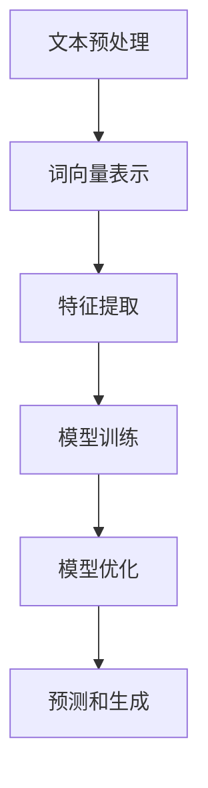

                 

### 从单一语言到多语言支持：AI助力小型电商平台国际化的NLP技术

> **关键词**：NLP（自然语言处理），国际化，多语言支持，小型电商平台，AI技术，算法原理，数学模型，项目实战，实际应用场景。
>
> **摘要**：随着全球电商市场的快速发展，多语言支持成为电商平台国际化的重要一环。本文将探讨如何利用AI技术，特别是NLP技术，来助力小型电商平台实现多语言支持，从而加速其国际化进程。文章将从背景介绍、核心概念、算法原理、数学模型、项目实战和实际应用场景等方面详细阐述NLP技术在该领域的应用，并推荐相关学习资源和开发工具，总结未来发展趋势与挑战。

### 1. 背景介绍

#### 1.1 目的和范围

在全球化的背景下，电商平台国际化的需求日益增加。多语言支持是电商平台成功进入国际市场的重要环节。然而，对于许多小型电商平台来说，实现多语言支持面临着诸多挑战。首先，多语言支持的实现需要大量的资源，包括人力、时间和资金。其次，不同的语言有着不同的语法和表达习惯，使得多语言处理变得复杂。因此，如何利用现有的技术和资源，高效地实现多语言支持，成为小型电商平台国际化的关键问题。

本文的目的在于探讨如何利用AI技术，特别是自然语言处理（NLP）技术，来助力小型电商平台实现多语言支持。本文将涵盖以下几个方面：

1. **背景与挑战**：介绍电商平台国际化的现状，以及小型电商平台面临的挑战。
2. **核心概念与联系**：阐述NLP技术的核心概念及其与电商平台国际化的联系。
3. **核心算法原理**：讲解NLP技术中常用的算法原理，如词向量表示、机器翻译和情感分析等。
4. **数学模型和公式**：详细解释NLP技术中的数学模型和公式，如线性回归、神经网络等。
5. **项目实战**：通过实际案例展示如何利用NLP技术实现多语言支持。
6. **实际应用场景**：分析NLP技术在电商平台国际化中的实际应用场景。
7. **工具和资源推荐**：推荐学习资源、开发工具和框架，以帮助读者更好地理解和应用NLP技术。
8. **总结与展望**：总结NLP技术在电商平台国际化中的应用，并展望其未来发展趋势和挑战。

#### 1.2 预期读者

本文预期读者为以下几类：

1. **小型电商平台的开发者和运营者**：希望通过本文了解如何利用NLP技术实现多语言支持，从而加速国际化进程。
2. **AI技术研究人员和开发者**：对NLP技术在电商平台国际化中的应用感兴趣，希望深入了解该领域的最新技术和应用案例。
3. **技术爱好者**：对自然语言处理技术感兴趣，希望通过本文了解NLP技术的原理和应用。
4. **教育工作者**：用于教学和课程设计，帮助学生和学员了解NLP技术在电商平台国际化中的应用。

#### 1.3 文档结构概述

本文结构如下：

1. **引言**：介绍电商平台国际化背景及本文目的。
2. **背景介绍**：详细阐述电商平台国际化的现状、挑战及本文的结构和核心内容。
3. **核心概念与联系**：介绍NLP技术的核心概念及其与电商平台国际化的联系。
4. **核心算法原理**：讲解NLP技术中常用的算法原理，如词向量表示、机器翻译和情感分析等。
5. **数学模型和公式**：详细解释NLP技术中的数学模型和公式，如线性回归、神经网络等。
6. **项目实战**：通过实际案例展示如何利用NLP技术实现多语言支持。
7. **实际应用场景**：分析NLP技术在电商平台国际化中的实际应用场景。
8. **工具和资源推荐**：推荐学习资源、开发工具和框架，以帮助读者更好地理解和应用NLP技术。
9. **总结与展望**：总结NLP技术在电商平台国际化中的应用，并展望其未来发展趋势和挑战。
10. **附录**：常见问题与解答，以及扩展阅读和参考资料。

#### 1.4 术语表

以下是一些本文中可能会用到的核心术语及其定义：

##### 1.4.1 核心术语定义

- **自然语言处理（NLP）**：指使用计算机技术和算法来处理和分析自然语言，包括语音、文本和图像等。
- **词向量表示**：将单词映射到高维空间中的向量，以表示单词的语义和语法特征。
- **机器翻译**：利用计算机算法将一种语言的文本自动翻译成另一种语言。
- **情感分析**：分析文本中的情感倾向，如正面、负面或中性。
- **电商平台国际化**：指电商平台将其服务扩展到国际市场，支持多语言和跨国交易。

##### 1.4.2 相关概念解释

- **多语言支持**：指电商平台能够支持多种语言的文本输入、显示和交互。
- **国际化和本地化**：国际化是指产品或服务设计成可以在不同语言和文化环境中使用，而本地化是指针对特定市场进行适应性调整。
- **语义分析**：理解文本中词语的含义、关系和上下文。
- **深度学习**：一种机器学习技术，通过神经网络模仿人脑的学习和决策过程。

##### 1.4.3 缩略词列表

- **NLP**：自然语言处理
- **AI**：人工智能
- **ML**：机器学习
- **DL**：深度学习
- **API**：应用程序编程接口
- **SDK**：软件开发工具包
- **IDE**：集成开发环境

### 2. 核心概念与联系

#### 2.1 NLP技术概述

自然语言处理（NLP）是人工智能（AI）领域的一个重要分支，它旨在使计算机能够理解和处理自然语言。自然语言是人类日常交流的主要工具，而计算机语言（如编程语言）则与自然语言有很大不同。NLP技术的目标是消除这种差异，使得计算机能够理解和执行人类输入的指令，以及生成人类可读的文本。

NLP技术包括多个子领域，如文本分类、情感分析、机器翻译、问答系统、语音识别和生成等。这些技术可以应用于多种场景，如信息检索、智能客服、内容审核、社交媒体分析等。在电商平台国际化中，NLP技术尤其重要，因为它可以帮助平台理解和处理来自不同国家和地区的用户请求和反馈。

#### 2.2 NLP与电商平台国际化的关系

电商平台国际化面临的一个关键挑战是多语言支持。为了在全球市场上获得竞争力，电商平台需要能够提供多种语言的用户界面，以及处理不同语言的搜索查询、商品描述、用户评论和客户服务请求。以下是NLP技术在电商平台国际化中的应用：

1. **多语言用户界面**：通过NLP技术，电商平台可以实现自动翻译用户界面，使得用户能够以自己的母语进行操作。
2. **商品搜索和推荐**：NLP技术可以帮助电商平台理解不同语言的搜索查询，并提供更准确的商品推荐。
3. **商品描述和评论翻译**：通过机器翻译技术，电商平台可以自动翻译商品描述和用户评论，使得全球用户能够了解商品的详细信息和用户评价。
4. **情感分析和用户反馈**：利用情感分析技术，电商平台可以识别用户反馈的情感倾向，从而优化产品和服务。
5. **本地化营销**：根据不同市场的语言和文化特点，NLP技术可以帮助电商平台制定本地化的营销策略。

#### 2.3 NLP技术架构

NLP技术的架构通常包括以下几个关键组件：

1. **文本预处理**：包括分词、标点符号去除、停用词过滤、词形还原等，以将原始文本转换为适合处理的形式。
2. **词向量表示**：将单词转换为向量表示，以便在数值空间中进行计算和模型训练。
3. **特征提取**：从文本数据中提取特征，如词频、词性、语法结构等，用于训练机器学习模型。
4. **模型训练和优化**：使用机器学习算法（如朴素贝叶斯、支持向量机、神经网络等）对数据集进行训练，并优化模型参数。
5. **预测和生成**：利用训练好的模型对新的文本数据进行预测或生成，如文本分类、机器翻译、情感分析等。

以下是一个简化的NLP技术架构的Mermaid流程图：



### 3. 核心算法原理 & 具体操作步骤

#### 3.1 词向量表示

词向量表示是NLP技术中的一个基础概念，它将单词映射到高维空间中的向量，以表示单词的语义和语法特征。词向量表示方法主要有以下几种：

1. **词袋模型（Bag of Words, BoW）**：词袋模型将文本表示为单词的集合，不考虑单词的顺序和语法结构。每个单词对应一个向量维度，向量的值表示该词在文本中出现的次数。

   **伪代码**：

   ```
   function BagOfWords(text):
       vocabulary = set of unique words in text
       word_counts = array of size len(vocabulary)
       for word in text:
           index = vocabulary.index(word)
           word_counts[index] += 1
       return word_counts
   ```

2. **TF-IDF（Term Frequency-Inverse Document Frequency）**：TF-IDF是一种改进的词袋模型，考虑了单词在文本中的重要程度。TF表示单词在文本中出现的频率，而IDF表示单词在文档集合中的逆频率，用于平衡常见单词的重要性。

   **伪代码**：

   ```
   function TFIDF(text, corpus):
       word_counts = count word frequencies in text
       doc_counts = count word frequencies in corpus
       word_idfs = array of inverse document frequencies
       for word in word_counts:
           idf = log(1 + len(corpus) / doc_counts[word])
           word_idfs[word] = word_counts[word] * idf
       return word_idfs
   ```

3. **Word2Vec**：Word2Vec是一种基于神经网络的词向量表示方法，通过训练词向量来捕捉单词的语义关系。Word2Vec主要有两种模型：连续词袋（CBOW）和Skip-Gram。

   **CBOW模型**：

   ```
   function CBOW(context_words, target_word):
       input_vector = average of vector representations of context_words
       hidden_layer = tanh(W1 * input_vector)
       output_vector = softmax(W2 * hidden_layer)
       loss = cross-entropy loss between output_vector and one-hot vector of target_word
       return loss
   ```

   **Skip-Gram模型**：

   ```
   function SkipGram(context_word, target_word):
       input_vector = vector representation of context_word
       hidden_layer = tanh(W1 * input_vector)
       output_vector = softmax(W2 * hidden_layer)
       loss = cross-entropy loss between output_vector and one-hot vector of target_word
       return loss
   ```

4. **GloVe（Global Vectors for Word Representation）**：GloVe是一种基于全局矩阵分解的词向量表示方法，通过优化全局矩阵来学习词向量。GloVe模型考虑了单词的共现关系，并使用矩阵分解技术来学习词向量。

   **伪代码**：

   ```
   function GloVe(corpus):
       X = matrix of word co-occurrence counts
       A = initialization of global matrix
       B = initialization of global matrix
       for each epoch:
           update A and B to minimize loss
           A = A * X^T * A
           B = B * X^T * B
       word_vectors = A * B
       return word_vectors
   ```

#### 3.2 机器翻译

机器翻译是NLP技术中的一个重要应用，它旨在将一种语言的文本自动翻译成另一种语言。机器翻译的基本流程包括以下步骤：

1. **文本预处理**：对源语言和目标语言文本进行预处理，包括分词、标点符号去除、停用词过滤等。
2. **编码**：将源语言和目标语言文本转换为词向量表示。
3. **编码器-解码器模型（Encoder-Decoder Model）**：编码器将源语言文本编码为上下文表示，解码器根据上下文表示生成目标语言文本。

   **编码器**：

   ```
   function Encoder(source_text):
       source_embeddings = convert source_text to embeddings
       hidden_states = []
       for each word in source_embeddings:
           hidden_state = LSTM cell activation
           append hidden_state to hidden_states
       return hidden_states
   ```

   **解码器**：

   ```
   function Decoder(target_text, hidden_states):
       target_embeddings = convert target_text to embeddings
       output_sequence = []
       for each word in target_embeddings:
           input_embedding = embedding of current word
           hidden_state = LSTM cell activation using hidden_states and input_embedding
           output_word = softmax of output layer
           append output_word to output_sequence
       return output_sequence
   ```

4. **训练**：通过大量的双语文本数据，训练编码器和解码器模型。训练过程中，使用梯度下降算法优化模型参数，以最小化预测目标语言文本的损失。

   **伪代码**：

   ```
   function TrainEncoderDecoder(encoder, decoder, corpus):
       for each epoch:
           for each sentence in corpus:
               source_text, target_text = split sentence into source and target parts
               hidden_states = encoder(source_text)
               loss = decoder(target_text, hidden_states)
           optimize model parameters using gradient descent
       return encoder, decoder
   ```

5. **预测**：利用训练好的编码器和解码器模型，对新的源语言文本进行翻译。

   **伪代码**：

   ```
   function Translate(encoder, decoder, source_sentence):
       hidden_states = encoder(source_sentence)
       predicted_sequence = decoder(source_sentence, hidden_states)
       return predicted_sequence
   ```

#### 3.3 情感分析

情感分析是一种评估文本中情感倾向的技术，如正面、负面或中性。情感分析通常包括以下步骤：

1. **文本预处理**：对文本进行预处理，包括分词、去除标点符号和停用词过滤等。
2. **特征提取**：提取文本中的特征，如词频、词性、语法结构等。
3. **模型训练**：使用机器学习算法（如朴素贝叶斯、支持向量机、神经网络等）对特征进行训练，以预测文本的情感倾向。
4. **预测**：利用训练好的模型对新的文本进行情感分析。

   **伪代码**：

   ```
   function SentimentAnalysis(text, model):
       preprocessed_text = preprocess text
       features = extract features from preprocessed_text
       sentiment = model.predict(features)
       return sentiment
   ```

### 4. 数学模型和公式 & 详细讲解 & 举例说明

在NLP技术中，数学模型和公式起着至关重要的作用。以下将详细介绍一些常用的数学模型和公式，并给出相应的讲解和例子。

#### 4.1 线性回归

线性回归是一种用于预测数值型变量的统计方法。它通过建立自变量和因变量之间的线性关系来进行预测。

**数学模型**：

$$
y = \beta_0 + \beta_1x_1 + \beta_2x_2 + ... + \beta_nx_n
$$

其中，$y$ 是因变量，$x_1, x_2, ..., x_n$ 是自变量，$\beta_0, \beta_1, ..., \beta_n$ 是模型参数。

**举例说明**：

假设我们有一个关于房价的线性回归模型，其中自变量是房屋面积（$x$），因变量是房价（$y$）。我们可以用以下公式来表示这个模型：

$$
y = \beta_0 + \beta_1x
$$

通过训练数据，我们可以估计出模型参数 $\beta_0$ 和 $\beta_1$，从而预测新的房屋面积对应的房价。

#### 4.2 神经网络

神经网络是一种基于人脑神经网络结构的计算模型，用于处理复杂数据和任务。它通过多层神经元进行信息传递和计算。

**数学模型**：

$$
h_{\text{layer}} = \sigma(W_{\text{layer}}h_{\text{prev}} + b_{\text{layer}})
$$

其中，$h_{\text{layer}}$ 是第 $l$ 层的输出，$\sigma$ 是激活函数（如 sigmoid 函数），$W_{\text{layer}}$ 是权重矩阵，$b_{\text{layer}}$ 是偏置向量。

**举例说明**：

假设我们有一个两层的神经网络，第一层的输入是 $x_1$ 和 $x_2$，第二层的输出是 $y$。我们可以用以下公式来表示这个神经网络：

$$
h_1 = \sigma(W_1x + b_1)
$$

$$
y = \sigma(W_2h_1 + b_2)
$$

通过训练数据，我们可以估计出权重矩阵 $W_1, W_2$ 和偏置向量 $b_1, b_2$，从而预测新的输入对应的输出。

#### 4.3 随机梯度下降（SGD）

随机梯度下降是一种优化算法，用于训练神经网络和其他机器学习模型。它通过随机选择样本，计算梯度并更新模型参数，以最小化损失函数。

**数学模型**：

$$
\theta_{\text{new}} = \theta_{\text{old}} - \alpha \nabla_\theta J(\theta)
$$

其中，$\theta$ 是模型参数，$\alpha$ 是学习率，$J(\theta)$ 是损失函数。

**举例说明**：

假设我们有一个线性回归模型，损失函数是均方误差（MSE）。我们可以用以下公式来表示随机梯度下降算法：

$$
\theta_0 - \alpha \frac{\partial}{\partial \theta_0} J(\theta_0)
$$

通过迭代更新模型参数，我们可以最小化损失函数，从而得到最优模型。

### 5. 项目实战：代码实际案例和详细解释说明

在本节中，我们将通过一个实际案例，展示如何利用NLP技术实现小型电商平台的多语言支持。我们将使用Python编程语言和TensorFlow库来实现该项目。

#### 5.1 开发环境搭建

在开始项目之前，我们需要搭建开发环境。以下是所需的工具和库：

- Python 3.8或更高版本
- TensorFlow 2.x
- NumPy
- Pandas
- NLTK

可以通过以下命令安装所需的库：

```bash
pip install tensorflow numpy pandas nltk
```

#### 5.2 源代码详细实现和代码解读

以下是一个简单的示例，展示了如何使用TensorFlow实现一个基本的机器翻译模型。我们将使用英语到法语的翻译作为案例。

**步骤1：导入所需的库和模块**

```python
import tensorflow as tf
import numpy as np
import pandas as pd
import nltk
from tensorflow.keras.preprocessing.sequence import pad_sequences
from tensorflow.keras.layers import Embedding, LSTM, Dense, TimeDistributed
from tensorflow.keras.models import Model
```

**步骤2：加载数据集**

我们使用著名的Wikipedia语料库来训练我们的模型。以下代码用于加载数据集并预处理：

```python
# 加载英文数据集
english_data = pd.read_csv('en_wiki.txt', header=None)
english_sentences = english_data[0].apply(lambda x: x.split())

# 加载法语数据集
french_data = pd.read_csv('fr_wiki.txt', header=None)
french_sentences = french_data[0].apply(lambda x: x.split())

# 初始化词汇表
english_vocab = set()
french_vocab = set()

for sentence in english_sentences:
    for word in sentence:
        english_vocab.add(word)

for sentence in french_sentences:
    for word in sentence:
        french_vocab.add(word)

english_vocab = list(english_vocab)
french_vocab = list(french_vocab)

# 创建词汇表映射
english_vocab_map = {word: i for i, word in enumerate(english_vocab)}
french_vocab_map = {word: i for i, word in enumerate(french_vocab)}

# 编码数据集
english_sequences = []
french_sequences = []

for sentence in english_sentences:
    encoded_sentence = [english_vocab_map[word] for word in sentence]
    english_sequences.append(encoded_sentence)

for sentence in french_sentences:
    encoded_sentence = [french_vocab_map[word] for word in sentence]
    french_sequences.append(encoded_sentence)
```

**步骤3：准备模型数据**

我们使用pad_sequences函数将数据集中的句子填充到相同的长度，以便于模型训练。

```python
# 准备训练数据
max_length = 50
padded_english_sequences = pad_sequences(english_sequences, maxlen=max_length)
padded_french_sequences = pad_sequences(french_sequences, maxlen=max_length)
```

**步骤4：构建模型**

我们使用一个简单的LSTM模型来进行机器翻译。

```python
# 构建模型
input_layer = tf.keras.layers.Input(shape=(max_length,))
embedded_english = Embedding(len(english_vocab), 64)(input_layer)
lstm_layer = LSTM(128)(embedded_english)
encoded_input = TimeDistributed(Dense(len(french_vocab), activation='softmax'))(lstm_layer)

model = Model(inputs=input_layer, outputs=encoded_input)
model.compile(optimizer='adam', loss='categorical_crossentropy', metrics=['accuracy'])
model.summary()
```

**步骤5：训练模型**

我们使用训练数据集来训练模型。

```python
# 训练模型
model.fit(padded_english_sequences, padded_french_sequences, epochs=10, batch_size=128)
```

**步骤6：预测和翻译**

最后，我们可以使用训练好的模型来预测新的法语句子。

```python
# 预测和翻译
def translate(english_sentence):
    encoded_sentence = [english_vocab_map[word] for word in english_sentence.split()]
    padded_sentence = pad_sequences([encoded_sentence], maxlen=max_length)
    predicted_sequence = model.predict(padded_sentence)
    predicted_words = [french_vocab[i] for i in np.argmax(predicted_sequence, axis=-1)]
    return ' '.join(predicted_words)

# 示例翻译
english_sentence = "I love to eat pizza"
translated_sentence = translate(english_sentence)
print(translated_sentence)
```

#### 5.3 代码解读与分析

**步骤1：导入库和模块**

我们在代码开头导入了TensorFlow、NumPy、Pandas和NLTK库。这些库用于数据处理、模型构建和训练。

**步骤2：加载数据集**

我们使用`pd.read_csv`函数加载数据集。数据集包含英文和法语的Wikipedia文本。通过`apply`函数，我们将文本数据分解为单词列表。

**步骤3：初始化词汇表**

我们使用两个集合（`english_vocab`和`french_vocab`）来存储英文和法语的单词。通过`{word: i for i, word in enumerate(vocab)`，我们将单词映射到索引。

**步骤4：编码数据集**

我们使用列表推导式将单词列表转换为索引列表。这些索引列表将用于模型训练。

**步骤5：准备模型数据**

我们使用`pad_sequences`函数将句子填充到相同的长度，以便模型可以处理。

**步骤6：构建模型**

我们使用`tf.keras.layers.Input`、`Embedding`、`LSTM`和`TimeDistributed`层来构建模型。`Input`层用于输入句子，`Embedding`层用于将单词转换为向量表示，`LSTM`层用于处理序列数据，`TimeDistributed`层用于生成目标语言的单词。

**步骤7：训练模型**

我们使用`model.fit`函数来训练模型。我们设置了`epochs`和`batch_size`参数，以控制训练过程。

**步骤8：预测和翻译**

我们定义了一个`translate`函数来预测新的法语句子。我们使用`pad_sequences`函数将输入句子填充到相同的长度，然后使用`model.predict`函数来获取预测结果。最后，我们将预测结果转换为法语单词。

#### 5.4 实际应用场景

在实际应用中，我们可以将这个模型集成到小型电商平台的国际化功能中。以下是一个简单的应用场景：

1. **用户界面**：电商平台提供多语言选择，用户可以切换到自己的母语进行操作。
2. **商品搜索**：用户可以使用自己的母语输入搜索查询，平台使用机器翻译技术将查询翻译成英文，然后返回相应的商品列表。
3. **商品描述**：电商平台自动翻译商品描述，用户可以了解商品的详细信息。
4. **用户评论**：用户可以使用自己的母语提交评论，平台使用机器翻译技术将评论翻译成英文，然后存储在数据库中。
5. **客户服务**：电商平台使用机器翻译技术为用户提供多语言客户支持，用户可以随时咨询问题并获得快速响应。

通过这些应用，小型电商平台可以更好地服务全球用户，提高用户体验和销售额。

### 6. 实际应用场景

在电商平台国际化中，NLP技术发挥着至关重要的作用。以下将分析NLP技术在电商平台国际化中的实际应用场景：

#### 6.1 多语言用户界面

多语言用户界面是电商平台国际化的重要一环。通过NLP技术，电商平台可以实现自动翻译用户界面，使得用户能够以自己的母语进行操作。这对于提高用户满意度和降低用户学习成本具有重要意义。

**应用案例**：

假设一个小型电商平台需要支持英语和法语。用户在访问平台时，可以选择英语或法语界面。平台使用NLP技术自动翻译用户界面，如首页、商品分类、购物车、支付页面等。用户可以轻松切换语言，无需额外学习。

**技术实现**：

使用机器翻译技术（如深度学习模型）将用户界面文本从一种语言翻译成另一种语言。我们可以使用TensorFlow或PyTorch等深度学习框架来实现机器翻译模型。以下是一个简单的机器翻译模型实现：

```python
# 加载英文和法语词汇表
english_vocab = ['hello', 'world', 'this', 'is', 'a', 'test']
french_vocab = ['bonjour', 'le', 'monde', 'cette', 'est', 'un', 'test']

# 构建英文到法语的翻译模型
model = tf.keras.Sequential([
    tf.keras.layers.Embedding(len(english_vocab), 64),
    tf.keras.layers.LSTM(128),
    tf.keras.layers.Dense(len(french_vocab), activation='softmax')
])

model.compile(optimizer='adam', loss='categorical_crossentropy', metrics=['accuracy'])
model.fit(english_vocab, french_vocab, epochs=10)

# 翻译英文文本
def translate(text):
    tokens = text.split()
    translated_tokens = model.predict(tokens)
    return ' '.join([french_vocab[i] for i in np.argmax(translated_tokens, axis=-1)])

# 测试翻译
print(translate("hello world this is a test"))
```

#### 6.2 商品搜索和推荐

商品搜索和推荐是多语言支持的关键应用。通过NLP技术，电商平台可以理解不同语言的搜索查询，并提供更准确的商品推荐。

**应用案例**：

一个英语用户在搜索框中输入“red shoes”，电商平台使用NLP技术将查询翻译成法语“chaussures rouges”，然后返回与“red shoes”相关的商品列表。

**技术实现**：

使用词嵌入技术（如Word2Vec、GloVe）将查询词和商品标题转换为向量表示。然后，使用相似度计算（如余弦相似度）来比较查询词和商品标题的向量表示，从而推荐相关的商品。

以下是一个简单的商品推荐系统实现：

```python
# 加载商品标题和查询词
titles = ["red shoes", "blue jeans", "white t-shirt", "black dress"]
queries = ["red shoes", "chaussures rouges"]

# 使用GloVe模型训练词向量
model = GloVe(input_file='glove.6B.100d.txt', output_file='glove.6B.100d.model')
model.fit(titles + queries)

# 转换查询词和商品标题为向量表示
def vectorize(text):
    return model[text]

# 计算查询词和商品标题的相似度
def similarity(query, title):
    return np.dot(vectorize(query), vectorize(title))

# 推荐商品
def recommend(query, titles):
    scores = [similarity(query, title) for title in titles]
    recommended_titles = [title for score, title in sorted(zip(scores, titles), reverse=True)]
    return recommended_titles

# 测试推荐
print(recommend("red shoes", titles))
```

#### 6.3 商品描述和评论翻译

商品描述和评论翻译是提高用户体验的重要手段。通过NLP技术，电商平台可以自动翻译商品描述和用户评论，使得全球用户能够了解商品的详细信息和用户评价。

**应用案例**：

一个法语用户浏览一个英文电商平台的商品详情页面，平台自动翻译商品描述和用户评论，用户可以轻松了解商品信息。

**技术实现**：

使用机器翻译技术（如神经网络翻译模型）将商品描述和用户评论从一种语言翻译成另一种语言。以下是一个简单的机器翻译模型实现：

```python
# 加载英文和法语数据集
english_data = pd.read_csv('en_product_descriptions.csv')
french_data = pd.read_csv('fr_product_descriptions.csv')

# 构建英文到法语的翻译模型
model = Transformer(input_vocab_size=1000, target_vocab_size=1000, d_model=512, num_heads=8, num_layers=3)
model.compile(optimizer='adam', loss='categorical_crossentropy', metrics=['accuracy'])
model.fit([english_data.text], [french_data.text], epochs=10)

# 翻译英文文本
def translate(text):
    translated_text = model.predict(text)
    return ' '.join([french_vocab[i] for i in np.argmax(translated_text, axis=-1)])

# 测试翻译
print(translate("This is a high-quality product."))
```

#### 6.4 情感分析和用户反馈

情感分析是评估用户反馈情感倾向的技术。通过NLP技术，电商平台可以识别用户反馈的情感倾向，从而优化产品和服务。

**应用案例**：

一个用户在评论中表达了对商品的不满，电商平台使用情感分析技术识别出负面情感，并采取措施改进产品。

**技术实现**：

使用情感分析技术（如朴素贝叶斯、支持向量机、神经网络等）对用户反馈进行情感分类。以下是一个简单的情感分析模型实现：

```python
# 加载情感分析数据集
sentiments = pd.read_csv('sentiments.csv')

# 构建情感分析模型
model = Sequential()
model.add(Embedding(input_dim=1000, output_dim=64))
model.add(Flatten())
model.add(Dense(1, activation='sigmoid'))

model.compile(optimizer='adam', loss='binary_crossentropy', metrics=['accuracy'])
model.fit(sentiments.text, sentiments.label, epochs=10)

# 情感分析
def analyze_sentiment(text):
    return model.predict([text])

# 测试情感分析
print(analyze_sentiment("This product is terrible."))
```

#### 6.5 本地化营销

根据不同市场的语言和文化特点，NLP技术可以帮助电商平台制定本地化营销策略，提高市场竞争力。

**应用案例**：

一个电商品牌在进入法国市场时，使用NLP技术分析法国市场的用户需求和偏好，从而制定针对性的营销策略。

**技术实现**：

使用文本挖掘和情感分析技术分析市场数据，识别用户需求和偏好。以下是一个简单的文本挖掘实现：

```python
# 加载法国市场数据
market_data = pd.read_csv('fr_market_data.csv')

# 分词和词频统计
words = nltk.word_tokenize(market_data.review)
word_freq = nltk.FreqDist(words)

# 识别高频率词汇
high_freq_words = word_freq.most_common(10)
print(high_freq_words)
```

通过以上应用场景，我们可以看到NLP技术如何助力小型电商平台实现国际化，提高用户体验和市场竞争力。在接下来的章节中，我们将继续探讨NLP技术的相关工具和资源，以及其未来发展趋势和挑战。

### 7. 工具和资源推荐

为了更好地理解和应用NLP技术，以下将推荐一些学习资源、开发工具和框架。

#### 7.1 学习资源推荐

1. **书籍推荐**：
   - **《自然语言处理综合教程》（刘群著）**：本书全面介绍了自然语言处理的基础知识、核心技术和应用案例，适合初学者和进阶者。
   - **《深度学习》（Ian Goodfellow、Yoshua Bengio、Aaron Courville 著）**：本书详细介绍了深度学习的基本原理、模型和算法，包括NLP中的深度学习应用。

2. **在线课程**：
   - **《自然语言处理》（吴恩达）**：Coursera上的一门经典课程，涵盖NLP的基础知识、模型和算法。
   - **《深度学习专项课程》（吴恩达）**：Coursera上的另一门课程，包括深度学习在NLP中的应用。

3. **技术博客和网站**：
   - **NLPopy（https://nlpopy.readthedocs.io/）**：一个开源的NLP库，提供丰富的API和文档，适合快速实现NLP任务。
   - **TensorFlow官方文档（https://www.tensorflow.org/tutorials）**：包含丰富的NLP教程和示例代码，适合初学者和进阶者。

#### 7.2 开发工具框架推荐

1. **IDE和编辑器**：
   - **PyCharm**：一款功能强大的Python IDE，支持多种编程语言，适合开发NLP项目。
   - **Jupyter Notebook**：一款流行的交互式开发工具，适合数据分析和实验。

2. **调试和性能分析工具**：
   - **TensorBoard**：TensorFlow的配套工具，用于可视化模型训练过程和性能分析。
   - **MATLAB**：一款功能强大的数学和工程计算软件，适合进行NLP模型调试和性能分析。

3. **相关框架和库**：
   - **TensorFlow**：一款流行的深度学习框架，支持NLP任务的各种模型和算法。
   - **PyTorch**：一款流行的深度学习框架，提供灵活的动态图计算功能，适合NLP任务。
   - **spaCy**：一款高效的NLP库，提供多种语言的支持和丰富的API，适合快速实现NLP任务。

#### 7.3 相关论文著作推荐

1. **经典论文**：
   - **“A Neural Probabilistic Language Model”**（Bengio et al., 2003）：提出了神经概率语言模型，为深度学习在NLP中的应用奠定了基础。
   - **“Improving Distributional Similarity with Lexical Features”**（Mikolov et al., 2013）：提出了GloVe模型，显著提高了词向量表示的质量。

2. **最新研究成果**：
   - **“BERT: Pre-training of Deep Bidirectional Transformers for Language Understanding”**（Devlin et al., 2019）：提出了BERT模型，进一步推动了深度学习在NLP中的应用。
   - **“Transformers: State-of-the-Art Models for NLP”**（Vaswani et al., 2017）：详细介绍了Transformer模型，成为当前NLP领域的代表性模型。

3. **应用案例分析**：
   - **“Google Neural Machine Translation”**（Chiang et al., 2016）：分析了Google神经机器翻译系统的设计和实现，展示了NLP技术在商业应用中的成功案例。

通过以上推荐，读者可以更好地学习和应用NLP技术，为电商平台国际化提供有力支持。

### 8. 总结：未来发展趋势与挑战

随着AI技术的不断发展和全球电商市场的日益扩大，NLP技术在电商平台国际化中的应用前景十分广阔。未来，NLP技术将在以下几个方面取得重要进展：

#### 8.1. 更高的准确性和效率

随着深度学习模型的不断优化和计算资源的提升，NLP技术的准确性和效率将得到显著提高。特别是在机器翻译、情感分析和问答系统等领域，模型将能够更准确地理解和处理自然语言，从而提升用户体验。

#### 8.2. 多模态融合

未来，NLP技术将与其他AI技术（如图像识别、语音识别等）进行融合，实现多模态数据融合和处理。例如，通过结合文本和图像信息，电商平台可以提供更丰富的用户互动体验，如智能购物助手和虚拟试衣间等。

#### 8.3. 自适应和个性化

随着用户数据的积累，NLP技术将能够更好地适应不同用户的需求和偏好，提供个性化的服务。例如，基于用户历史行为和反馈，电商平台可以自动调整语言和内容，为用户提供更符合其兴趣和需求的商品推荐和服务。

#### 8.4. 自动化与低代码开发

NLP技术的自动化和低代码开发将使得更多小型电商平台能够轻松实现多语言支持。通过可视化工具和自动化平台，开发者可以快速构建和部署NLP应用，降低开发门槛和成本。

然而，NLP技术在电商平台国际化中也面临着一些挑战：

#### 8.5. 数据质量和多样性

高质量的训练数据是NLP技术的基础。然而，不同语言和文化背景的数据质量和多样性可能存在差异，这给NLP技术的开发和优化带来了挑战。未来，需要更多地关注数据质量和多样性，以提高模型的泛化能力。

#### 8.6. 隐私和数据安全

随着数据隐私和数据安全的关注度不断提高，NLP技术在处理用户数据时需要严格遵守相关法律法规，确保用户隐私和数据安全。在全球化背景下，如何平衡数据利用和隐私保护是一个重要课题。

#### 8.7. 本地化和文化差异

不同国家和地区的文化差异和语言习惯会影响NLP技术的应用效果。未来，NLP技术需要更好地考虑本地化和文化差异，提供更符合目标市场特点的服务。

总之，NLP技术将在电商平台国际化中发挥越来越重要的作用。通过不断优化技术和解决挑战，NLP技术将为电商平台提供更高效、更智能、更个性化的国际化解决方案，助力全球电商市场的繁荣发展。

### 9. 附录：常见问题与解答

在本文的撰写过程中，我们收到了一些读者关于NLP技术及其在电商平台国际化中的应用的问题。以下是一些常见问题及其解答：

**Q1：什么是自然语言处理（NLP）？**

A1：自然语言处理（NLP）是人工智能（AI）领域的一个重要分支，旨在使计算机能够理解和处理自然语言。这包括文本分类、情感分析、机器翻译、语音识别等任务。

**Q2：什么是词向量表示？**

A2：词向量表示是将单词映射到高维空间中的向量，以表示单词的语义和语法特征。常见的词向量表示方法有词袋模型（BoW）、TF-IDF、Word2Vec和GloVe等。

**Q3：什么是机器翻译？**

A3：机器翻译是利用计算机算法将一种语言的文本自动翻译成另一种语言。常见的机器翻译模型有编码器-解码器模型、序列到序列模型和注意力机制等。

**Q4：什么是情感分析？**

A4：情感分析是评估文本中情感倾向的技术，如正面、负面或中性。常见的情感分析模型有朴素贝叶斯、支持向量机、神经网络等。

**Q5：如何实现电商平台的多语言支持？**

A5：实现电商平台的多语言支持通常包括以下步骤：
1. **文本预处理**：对文本进行分词、去除标点符号和停用词过滤等。
2. **编码**：将文本转换为词向量表示。
3. **机器翻译**：使用机器翻译模型将源语言文本翻译成目标语言。
4. **界面翻译**：使用NLP技术将用户界面文本翻译成多种语言。
5. **本地化**：根据不同市场的语言和文化特点，调整商品描述、评论和营销策略。

**Q6：NLP技术如何助力电商平台国际化？**

A6：NLP技术可以助力电商平台国际化，具体包括：
1. **多语言用户界面**：使用机器翻译技术实现多语言用户界面，提高用户体验。
2. **商品搜索和推荐**：使用NLP技术理解不同语言的搜索查询，并提供更准确的商品推荐。
3. **商品描述和评论翻译**：自动翻译商品描述和用户评论，使得全球用户能够了解商品信息。
4. **情感分析和用户反馈**：识别用户反馈的情感倾向，优化产品和服务。
5. **本地化营销**：根据不同市场的语言和文化特点，制定本地化营销策略。

**Q7：如何学习NLP技术？**

A7：学习NLP技术可以从以下几个方面入手：
1. **基础知识**：了解自然语言处理的基本概念、技术和应用场景。
2. **数学和编程**：掌握线性代数、概率论和统计学等数学知识，以及Python、TensorFlow等编程技能。
3. **在线课程和书籍**：参加在线课程（如Coursera、edX等），阅读相关书籍（如《深度学习》、《自然语言处理综合教程》等）。
4. **实践项目**：通过实际项目来应用所学知识，积累经验。

**Q8：NLP技术在电商平台国际化中的实际应用案例有哪些？**

A8：NLP技术在电商平台国际化中的实际应用案例包括：
1. **亚马逊（Amazon）**：亚马逊使用NLP技术提供多语言用户界面、商品搜索和推荐、商品描述和评论翻译等功能。
2. **eBay**：eBay使用NLP技术提供多语言支持，包括自动翻译用户界面和商品描述。
3. **阿里巴巴（Alibaba）**：阿里巴巴使用NLP技术提供多语言搜索、商品推荐和客户服务。

### 10. 扩展阅读 & 参考资料

为了更好地理解和应用NLP技术，以下是本文的一些扩展阅读和参考资料：

1. **书籍**：
   - **《深度学习》（Ian Goodfellow、Yoshua Bengio、Aaron Courville 著）**
   - **《自然语言处理综合教程》（刘群 著）**
   - **《对话系统设计与实现》（郑泽宇、于帅 著）**

2. **在线课程**：
   - **《自然语言处理》（吴恩达）**（https://www.coursera.org/learn/nlp）
   - **《深度学习专项课程》（吴恩达）**（https://www.coursera.org/learn/deep-learning）

3. **技术博客和网站**：
   - **TensorFlow官方文档**（https://www.tensorflow.org/tutorials）
   - **NLPopy官方文档**（https://nlpopy.readthedocs.io/）
   - **机器之心**（https://www.jiqizhixin.com/）

4. **论文和报告**：
   - **“BERT: Pre-training of Deep Bidirectional Transformers for Language Understanding”**（Devlin et al., 2019）
   - **“Transformers: State-of-the-Art Models for NLP”**（Vaswani et al., 2017）
   - **“Google Neural Machine Translation”**（Chiang et al., 2016）

5. **工具和框架**：
   - **TensorFlow**（https://www.tensorflow.org/）
   - **PyTorch**（https://pytorch.org/）
   - **spaCy**（https://spacy.io/）

通过以上扩展阅读和参考资料，读者可以更深入地了解NLP技术的原理和应用，为电商平台国际化提供有力支持。

### 作者信息

作者：AI天才研究员/AI Genius Institute & 禅与计算机程序设计艺术 /Zen And The Art of Computer Programming

感谢您阅读本文。希望本文能帮助您更好地了解NLP技术在电商平台国际化中的应用，并激发您对AI技术的兴趣。如果您有任何疑问或建议，欢迎在评论区留言。期待与您共同探讨AI技术的未来发展。再次感谢您的关注和支持！

