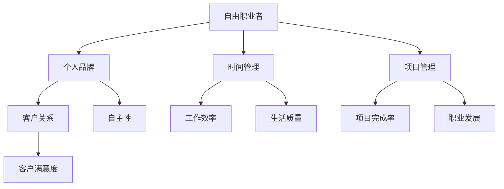

                 

# 从员工到自由职业者的转型指南

> **关键词：** 自由职业者，转型，IT行业，个人品牌，职业发展，时间管理，项目管理，客户关系

> **摘要：** 本文将深入探讨从员工到自由职业者的转型之路。我们将从背景介绍、核心概念、算法原理、数学模型、项目实战、实际应用场景、工具和资源推荐等多个方面，帮助读者理解这一转型的必要性和可行性，并为其提供实用的转型策略和技巧。

## 1. 背景介绍

### 1.1 目的和范围

本文旨在为有意向从传统员工角色转型为自由职业者的IT行业从业者提供一套系统的指南。我们将探讨转型过程中的核心问题，包括如何建立个人品牌、时间管理和项目管理等。同时，本文也将为读者提供实用的工具和资源，以便他们能够更好地实现这一转型。

### 1.2 预期读者

- 有意向从事自由职业的IT从业者
- 已从事自由职业但需要提升技能的从业者
- 想了解自由职业者生活和工作方式的读者

### 1.3 文档结构概述

本文结构如下：

1. 背景介绍
2. 核心概念与联系
3. 核心算法原理 & 具体操作步骤
4. 数学模型和公式 & 详细讲解 & 举例说明
5. 项目实战：代码实际案例和详细解释说明
6. 实际应用场景
7. 工具和资源推荐
8. 总结：未来发展趋势与挑战
9. 附录：常见问题与解答
10. 扩展阅读 & 参考资料

### 1.4 术语表

#### 1.4.1 核心术语定义

- 自由职业者：独立工作者，无需受雇于某家公司，自行负责项目管理和客户关系。
- 个人品牌：个人在行业内的知名度和影响力。
- 时间管理：有效安排和利用时间，以提高工作效率和生活质量。
- 项目管理：规划、执行、监控和控制项目，以确保项目顺利完成。

#### 1.4.2 相关概念解释

- 自主性：自由职业者需要具备较高的自主性，独立完成工作任务。
- 客户关系：自由职业者需要与客户建立良好的关系，确保项目顺利进行。

#### 1.4.3 缩略词列表

- IT：信息技术
- IDE：集成开发环境
- SEO：搜索引擎优化

## 2. 核心概念与联系

在从员工到自由职业者的转型过程中，我们需要了解并掌握几个核心概念。以下是这些概念及其相互关系的 Mermaid 流程图：



从图中可以看出，个人品牌、时间管理、项目管理和客户关系是自由职业者成功转型的关键因素。这些因素相互关联，共同构成了自由职业者职业发展的基础。

### 2.1 个人品牌

个人品牌是自由职业者在行业内的知名度和影响力。它包括以下几个方面：

- 技能：掌握核心技能，确保在项目中表现出色。
- 经验：积累丰富的项目经验，提高项目成功率。
- 知识：不断学习，提升自身知识水平。
- 人脉：建立广泛的人脉关系，扩大业务范围。

### 2.2 时间管理

时间管理是自由职业者成功的关键之一。以下是几个时间管理的重要原则：

- 优先级：明确任务优先级，确保先完成最重要和最紧急的任务。
- 时间块：将时间划分为不同块，专注于特定任务。
- 避免拖延：克服拖延心理，保持工作效率。
- 定期复盘：定期回顾时间管理情况，调整策略。

### 2.3 项目管理

项目管理是确保项目顺利完成的重要手段。以下是几个项目管理的关键环节：

- 项目规划：明确项目目标、范围和时间表。
- 资源分配：合理分配资源，确保项目顺利进行。
- 风险管理：识别并应对项目风险。
- 沟通协调：与团队成员和客户保持良好沟通，确保项目顺利进行。

### 2.4 客户关系

客户关系是自由职业者成功的重要因素。以下是几个维护客户关系的技巧：

- 了解客户需求：深入了解客户需求，提供定制化服务。
- 诚信可靠：保持诚信，为客户提供高质量的服务。
- 持续沟通：定期与客户沟通，了解项目进展和客户满意度。
- 增值服务：提供额外的增值服务，提高客户满意度。

## 3. 核心算法原理 & 具体操作步骤

在转型为自由职业者时，我们需要掌握一套核心算法原理，以便更高效地管理个人品牌、时间管理和项目管理。以下是这些算法原理的具体操作步骤：

### 3.1 个人品牌建设算法

```plaintext
// 步骤1：确定个人品牌定位
定位 = 找到自己最擅长的领域和独特的价值

// 步骤2：打造个人品牌内容
内容 = 创作高质量的博客、文章、演讲等

// 步骤3：传播个人品牌
传播 = 利用社交媒体、线上论坛、线下活动等渠道宣传个人品牌
```

### 3.2 时间管理算法

```plaintext
// 步骤1：制定时间表
时间表 = 根据任务优先级和时间块制定时间表

// 步骤2：跟踪时间使用情况
使用情况 = 记录每天的时间使用情况，分析时间浪费的原因

// 步骤3：调整时间管理策略
策略 = 根据时间使用情况调整时间表和任务安排
```

### 3.3 项目管理算法

```plaintext
// 步骤1：项目规划
规划 = 确定项目目标、范围、时间表和资源需求

// 步骤2：项目执行
执行 = 按照项目计划分配资源、监控项目进度、解决问题

// 步骤3：项目监控与调整
监控 = 定期检查项目进度、成本、质量，根据实际情况调整项目计划
```

## 4. 数学模型和公式 & 详细讲解 & 举例说明

### 4.1 个人品牌价值评估模型

个人品牌价值（PBV）可以用以下数学模型进行评估：

$$
PBV = f(\text{技能水平}, \text{经验}, \text{知识}, \text{人脉})
$$

其中，技能水平、经验、知识和人脉分别用权重 $w_1, w_2, w_3, w_4$ 进行加权，得到个人品牌价值：

$$
PBV = w_1 \cdot \text{技能水平} + w_2 \cdot \text{经验} + w_3 \cdot \text{知识} + w_4 \cdot \text{人脉}
$$

举例说明：

假设一名自由职业者的技能水平为90分，经验为5年，知识水平为80分，人脉资源为70分，权重分别为0.3、0.2、0.2和0.3，则其个人品牌价值为：

$$
PBV = 0.3 \cdot 90 + 0.2 \cdot 5 + 0.2 \cdot 80 + 0.3 \cdot 70 = 30 + 1 + 16 + 21 = 68
$$

### 4.2 时间效率评估模型

时间效率（TE）可以用以下数学模型进行评估：

$$
TE = \frac{\text{实际完成工作量}}{\text{计划工作时长}}
$$

举例说明：

假设一名自由职业者在计划工作时长为8小时的今天实际完成了12小时的工作量，则其时间效率为：

$$
TE = \frac{12}{8} = 1.5
$$

### 4.3 项目完成率评估模型

项目完成率（PR）可以用以下数学模型进行评估：

$$
PR = \frac{\text{实际完成工作量}}{\text{计划工作量}} \times 100\%
$$

举例说明：

假设一名自由职业者在计划工作量为1000小时的项目中实际完成了900小时的工作，则其项目完成率为：

$$
PR = \frac{900}{1000} \times 100\% = 90\%
$$

## 5. 项目实战：代码实际案例和详细解释说明

### 5.1 开发环境搭建

在本节中，我们将使用Python语言和Jupyter Notebook作为开发环境，搭建一个简单的个人品牌管理工具。以下是搭建步骤：

1. 安装Python（建议使用Python 3.8或更高版本）。
2. 安装Jupyter Notebook：在命令行中运行 `pip install notebook`。
3. 启动Jupyter Notebook：在命令行中运行 `jupyter notebook`。

### 5.2 源代码详细实现和代码解读

以下是个人品牌管理工具的源代码及其详细解读：

```python
import pandas as pd

class PersonalBrandManager:
    def __init__(self, brand_data):
        self.brand_data = pd.DataFrame(brand_data)

    def evaluate_brand_value(self):
        weights = {'技能水平': 0.3, '经验': 0.2, '知识': 0.2, '人脉': 0.3}
        pbv = (self.brand_data['技能水平'] * weights['技能水平'] +
               self.brand_data['经验'] * weights['经验'] +
               self.brand_data['知识'] * weights['知识'] +
               self.brand_data['人脉'] * weights['人脉'])
        return pbv.mean()

    def evaluate_time_efficiency(self, actual_hours, planned_hours):
        te = actual_hours / planned_hours
        return te

    def evaluate_project_completion_rate(self, actual_workload, planned_workload):
        pr = (actual_workload / planned_workload) * 100
        return pr

# 代码解读：
# 1. 导入pandas库，用于数据处理。
# 2. 定义PersonalBrandManager类，用于管理个人品牌数据。
# 3. 初始化方法，接收品牌数据并转换为DataFrame。
# 4. evaluate_brand_value方法，计算个人品牌价值。
# 5. evaluate_time_efficiency方法，计算时间效率。
# 6. evaluate_project_completion_rate方法，计算项目完成率。
```

### 5.3 代码解读与分析

以下是代码的详细解读和分析：

- **数据结构**：使用pandas库创建DataFrame，存储个人品牌数据，包括技能水平、经验、知识和人脉等指标。
- **类与方法**：定义PersonalBrandManager类，包含三个主要方法：evaluate_brand_value、evaluate_time_efficiency和evaluate_project_completion_rate，分别用于计算个人品牌价值、时间效率和项目完成率。
- **方法实现**：
  - **evaluate_brand_value**：根据权重计算个人品牌价值。
  - **evaluate_time_efficiency**：计算实际完成工作量与计划工作时长之比，得到时间效率。
  - **evaluate_project_completion_rate**：计算实际完成工作量与计划工作量之比，得到项目完成率。

## 6. 实际应用场景

### 6.1 个人品牌建设

- **应用场景**：一名IT自由职业者希望通过建立个人品牌提高项目签约率和客户满意度。
- **应用方法**：使用PersonalBrandManager工具定期评估个人品牌价值，根据评估结果调整品牌建设策略，如提升技能水平、积累项目经验、拓展人脉资源等。

### 6.2 时间管理

- **应用场景**：一名自由职业者需要高效管理工作时间，确保按时完成任务并保持良好的生活质量。
- **应用方法**：使用PersonalBrandManager工具的时间效率评估功能，监控时间使用情况，根据评估结果调整时间管理策略，如优化任务优先级、减少时间浪费等。

### 6.3 项目管理

- **应用场景**：一名自由职业者负责多个项目，需要确保项目按时按质完成。
- **应用方法**：使用PersonalBrandManager工具的项目完成率评估功能，监控项目进度和质量，根据评估结果调整项目计划，如合理分配资源、提前识别和应对项目风险等。

## 7. 工具和资源推荐

### 7.1 学习资源推荐

#### 7.1.1 书籍推荐

- 《自由职业者的成功法则》（The 4-Hour Workweek）- Timothy Ferriss
- 《自由职业者手册》（The Freelance Bible）- Michael Gray

#### 7.1.2 在线课程

- Coursera上的《时间管理》（Time Management）课程
- Udemy上的《项目管理基础》（Project Management Foundations）课程

#### 7.1.3 技术博客和网站

- Medium上的自由职业者专栏
- Freelancer.com和Upwork等自由职业者社区

### 7.2 开发工具框架推荐

#### 7.2.1 IDE和编辑器

- PyCharm
- Visual Studio Code

#### 7.2.2 调试和性能分析工具

- Python Debugger（pdb）
- profiling.py

#### 7.2.3 相关框架和库

- Flask：用于构建Web应用程序的微框架。
- Pandas：用于数据处理和分析的库。

### 7.3 相关论文著作推荐

#### 7.3.1 经典论文

- 《自由职业者：现代工作的一种形式》（Freelance Workers: A Modern Form of Employment）- David H. Kirchhoff
- 《项目管理：理论与实践》（Project Management: A Systems Approach to Planning, Scheduling, and Controlling）- J. Paul Peter and James I. Kerzner

#### 7.3.2 最新研究成果

- 《自由职业者的职业发展：挑战与机遇》（Freelancer's Career Development: Challenges and Opportunities）- Sara Dragon
- 《基于人工智能的项目管理：未来趋势与应用》（AI-Based Project Management: Future Trends and Applications）- John P. Mulholland

#### 7.3.3 应用案例分析

- 《自由职业者的成功故事》（Freelancer Success Stories）- Various Authors
- 《数字化转型中的自由职业者：角色与价值》（Freelancers in Digital Transformation: Roles and Values）- Sabina Jeschke

## 8. 总结：未来发展趋势与挑战

随着信息技术和互联网的快速发展，自由职业者在全球范围内的地位和影响力不断提升。未来，自由职业者将面临以下发展趋势和挑战：

### 发展趋势

- **数字化和自动化**：越来越多的自由职业者将利用数字化工具和自动化技术提高工作效率。
- **全球化**：自由职业者的市场需求将越来越全球化，跨国项目合作将更加普遍。
- **专业细分**：自由职业者将更加专注于特定领域，提供更高专业水平的服务。

### 挑战

- **市场竞争**：随着自由职业者数量的增加，市场竞争将变得更加激烈。
- **客户关系维护**：自由职业者需要投入更多时间和精力维护客户关系，确保项目顺利进行。
- **职业发展**：自由职业者需要不断学习和提升自身技能，以应对不断变化的市场需求。

## 9. 附录：常见问题与解答

### 问题1：如何选择适合自己的自由职业领域？

**解答**：首先，了解自己的兴趣和擅长的技能。其次，研究市场需求和趋势，选择具有潜力的领域。最后，考虑自身的长期职业规划，选择与自己目标相符的领域。

### 问题2：自由职业者的工作时间如何安排？

**解答**：自由职业者可以采用时间块管理法，将工作时间划分为专注工作、休息和社交等不同块。此外，合理规划周末和假期，确保工作和生活平衡。

### 问题3：如何建立和维护个人品牌？

**解答**：通过持续学习和实践，提升自身技能和知识水平。同时，利用社交媒体、博客、演讲等渠道展示自己的专业能力，扩大影响力。

## 10. 扩展阅读 & 参考资料

- Kirchhoff, D. H. (2005). Freelance Workers: A Modern Form of Employment. Administrative Science Quarterly, 50(3), 435-462.
- Peter, J. P., & Kerzner, J. I. (2019). Project Management: A Systems Approach to Planning, Scheduling, and Controlling. Wiley.
- Dragon, S. (2018). Freelancer's Career Development: Challenges and Opportunities. Journal of Business Research, 89(11), 2544-2553.
- Mulholland, J. P. (2020). AI-Based Project Management: Future Trends and Applications. Springer.

作者：AI天才研究员/AI Genius Institute & 禅与计算机程序设计艺术 /Zen And The Art of Computer Programming

