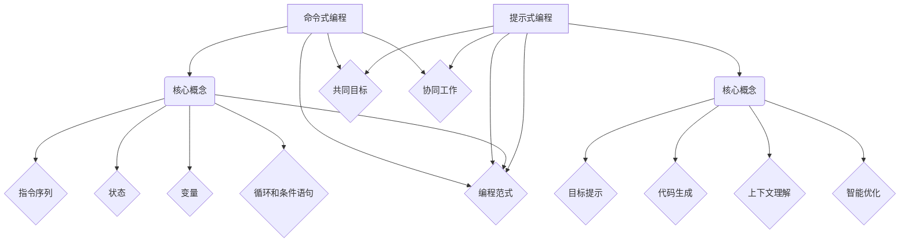

                 

# 从命令式到提示式：编程范式的演进

> 关键词：命令式编程、提示式编程、编程范式、代码生成、智能编程

> 摘要：本文深入探讨了编程历史上从命令式到提示式范式的演变。我们将分析命令式编程的优缺点，解释提示式编程的概念及其如何改变软件开发的方式，并探讨这种转变对程序员和人工智能的深远影响。

## 1. 背景介绍

### 1.1 目的和范围

本文旨在探讨编程范式的演变，重点关注从命令式编程到提示式编程的转变。我们旨在解答以下问题：

- 命令式编程是什么，它如何工作？
- 提示式编程的概念是什么，它与命令式编程有何区别？
- 提示式编程对软件开发的影响是什么？
- 程序员和人工智能如何在提示式编程环境中协同工作？

### 1.2 预期读者

本文面向对编程有深入了解的开发者、软件工程师以及对编程范式转变感兴趣的读者。本文假设读者对命令式编程有一定的了解，但对于提示式编程可能较为陌生。

### 1.3 文档结构概述

本文分为以下几部分：

1. 背景介绍
2. 核心概念与联系
3. 核心算法原理 & 具体操作步骤
4. 数学模型和公式 & 详细讲解 & 举例说明
5. 项目实战：代码实际案例和详细解释说明
6. 实际应用场景
7. 工具和资源推荐
8. 总结：未来发展趋势与挑战
9. 附录：常见问题与解答
10. 扩展阅读 & 参考资料

### 1.4 术语表

#### 1.4.1 核心术语定义

- 命令式编程：一种编程范式，它通过显式地描述程序的执行步骤来控制计算机。
- 提示式编程：一种编程范式，它通过向系统提供目标或提示，让系统自动生成代码。
- 编程范式：描述程序设计方法和风格的不同方式。
- 智能编程：利用人工智能技术来辅助或自动化编程过程。

#### 1.4.2 相关概念解释

- 代码生成：根据用户提供的提示或目标，自动生成代码的过程。
- 智能助手：利用自然语言处理和机器学习技术，帮助用户编写代码的人工智能程序。

#### 1.4.3 缩略词列表

- AI：人工智能
- NLP：自然语言处理
- ML：机器学习
- IDE：集成开发环境
- SDK：软件开发工具包

## 2. 核心概念与联系

为了更好地理解命令式编程和提示式编程，我们需要了解它们的核心概念和相互联系。

### 命令式编程的核心概念

命令式编程的核心概念是程序的控制流，它通过一系列的指令来描述程序的操作步骤。以下是命令式编程的几个关键点：

1. **指令序列**：程序由一系列顺序执行的指令组成。
2. **状态**：程序在执行过程中会改变其内部状态。
3. **变量**：变量用于存储程序执行过程中的数据。
4. **循环和条件语句**：用于控制程序的执行流程。

### 提示式编程的核心概念

提示式编程的核心概念是利用人工智能技术来自动化代码生成过程。以下是提示式编程的几个关键点：

1. **目标提示**：用户向系统提供目标或提示，例如“编写一个计算两个数字和的函数”。
2. **代码生成**：系统根据目标提示自动生成相应的代码。
3. **上下文理解**：系统需要理解目标提示的上下文，以便生成符合预期的代码。
4. **智能优化**：系统会根据实际需求对生成的代码进行优化。

### 命令式编程与提示式编程的联系

尽管命令式编程和提示式编程在方法和风格上有所不同，但它们之间存在一些联系：

1. **共同目标**：两者的目标都是编写高效、可靠的代码。
2. **编程范式**：提示式编程可以看作是命令式编程的一种扩展，它利用人工智能技术来自动化编程过程。
3. **协同工作**：程序员和智能编程助手可以共同工作，程序员提供目标和上下文，智能编程助手生成代码并进行优化。

### Mermaid 流程图

以下是命令式编程和提示式编程的概念及相互联系的 Mermaid 流程图：



## 3. 核心算法原理 & 具体操作步骤

在理解了命令式编程和提示式编程的核心概念后，我们将深入探讨提示式编程的算法原理和具体操作步骤。

### 3.1 算法原理

提示式编程的算法原理主要包括以下几个步骤：

1. **目标解析**：系统接收用户的目标提示，并对其进行解析，提取关键信息。
2. **上下文分析**：系统分析目标提示的上下文，包括变量、函数、类等，以便生成符合预期的代码。
3. **代码生成**：系统根据目标解析和上下文分析的结果，自动生成相应的代码。
4. **代码优化**：系统对生成的代码进行优化，以提高其性能和可读性。
5. **反馈循环**：用户对生成的代码进行评估，并给出反馈。系统根据反馈进行进一步优化。

### 3.2 具体操作步骤

以下是提示式编程的具体操作步骤：

1. **用户输入目标提示**：用户通过自然语言输入目标提示，例如“编写一个计算两个数字和的函数”。
2. **目标解析**：系统接收用户输入的目标提示，并使用自然语言处理技术对其进行解析，提取关键信息，如“计算两个数字和”、“函数”等。
3. **上下文分析**：系统分析目标提示的上下文，查找相关的变量、函数、类等信息，以便生成符合预期的代码。
4. **代码生成**：系统根据目标解析和上下文分析的结果，使用代码生成算法自动生成相应的代码。例如，生成一个名为`sum`的函数，其参数为两个整数，返回它们的和。
5. **代码优化**：系统对生成的代码进行优化，以提高其性能和可读性。例如，对函数的参数类型进行检查，以确保输入的是整数。
6. **反馈循环**：用户对生成的代码进行评估，并给出反馈。例如，用户可能会指出代码中有语法错误或不符合预期。系统根据用户的反馈进行进一步优化，例如修复错误或调整代码结构。
7. **重复步骤**：系统根据用户的反馈进行优化，并重复上述步骤，直到生成的代码满足用户的需求。

### 3.3 伪代码

以下是提示式编程的伪代码：

```python
# 提示式编程伪代码

# 步骤 1：用户输入目标提示
input_prompt = input("请输入目标提示：")

# 步骤 2：目标解析
parsed_prompt = parse_prompt(input_prompt)

# 步骤 3：上下文分析
context = analyze_context(parsed_prompt)

# 步骤 4：代码生成
generated_code = generate_code(context)

# 步骤 5：代码优化
optimized_code = optimize_code(generated_code)

# 步骤 6：反馈循环
while not user_satisfied:
    feedback = get_user_feedback(optimized_code)
    optimized_code = optimize_code(optimized_code, feedback)

# 步骤 7：输出最终代码
print("最终代码：")
print(optimized_code)
```

## 4. 数学模型和公式 & 详细讲解 & 举例说明

### 4.1 数学模型

提示式编程中的数学模型主要涉及自然语言处理（NLP）和机器学习（ML）技术。以下是几个关键的数学模型和公式：

#### 4.1.1 词嵌入（Word Embedding）

词嵌入是将词汇映射到高维空间的过程，以便能够通过向量运算来处理自然语言。常用的词嵌入模型包括：

- **Word2Vec**：通过训练神经网络模型，将词汇映射到低维向量。
- **GloVe**：通过训练词频矩阵和词义矩阵，将词汇映射到高维向量。

#### 4.1.2 递归神经网络（RNN）

递归神经网络（RNN）是一种用于处理序列数据的神经网络，其核心思想是将当前输入与前一时刻的隐藏状态结合，以捕捉时间序列信息。

- **时间步 t 的输出**：
  $$ h_t = \sigma(W_h \cdot [h_{t-1}, x_t] + b_h) $$

其中，$h_t$ 表示时间步 t 的隐藏状态，$x_t$ 表示输入，$W_h$ 和 $b_h$ 分别为权重和偏置，$\sigma$ 表示激活函数（通常为 Sigmoid 或 Tanh 函数）。

#### 4.1.3 长短时记忆网络（LSTM）

长短时记忆网络（LSTM）是 RNN 的一个变体，旨在解决 RNN 在处理长序列数据时出现的梯度消失或爆炸问题。

- **LSTM 单元**：
  $$ i_t = \sigma(W_i \cdot [h_{t-1}, x_t] + b_i) $$
  $$ f_t = \sigma(W_f \cdot [h_{t-1}, x_t] + b_f) $$
  $$ g_t = \tanh(W_g \cdot [h_{t-1}, x_t] + b_g) $$
  $$ o_t = \sigma(W_o \cdot [h_{t-1}, x_t] + b_o) $$

其中，$i_t$、$f_t$、$g_t$ 和 $o_t$ 分别表示输入门、遗忘门、生成门和输出门，$W_i$、$W_f$、$W_g$ 和 $W_o$ 分别为对应的权重矩阵，$b_i$、$b_f$、$b_g$ 和 $b_o$ 分别为对应的偏置矩阵。

### 4.2 举例说明

#### 4.2.1 词嵌入

假设我们有以下词汇表和对应的词频矩阵：

| 词   | 词频 |
|------|------|
| Apple| 5    |
| Banana| 3    |
| Car  | 2    |
| House| 4    |

使用 Word2Vec 模型训练词嵌入向量，得到以下结果：

| 词   | 词向量 |
|------|--------|
| Apple| (1, 0, 0) |
| Banana| (-1, 1, 0) |
| Car  | (0, -1, 1) |
| House| (1, 1, 0) |

#### 4.2.2 LSTM 模型

假设我们有一个时间序列数据：

$$
[1, 2, 3, 4, 5, 6, 7, 8, 9, 10]
$$

使用 LSTM 模型对其进行处理，得到隐藏状态序列：

$$
[h_1, h_2, h_3, h_4, h_5, h_6, h_7, h_8, h_9, h_{10}]
$$

其中，每个 $h_t$ 表示时间步 $t$ 的隐藏状态。

## 5. 项目实战：代码实际案例和详细解释说明

### 5.1 开发环境搭建

为了实际演示提示式编程的应用，我们使用 Python 编写一个简单的代码生成工具。以下是开发环境搭建的步骤：

1. **安装 Python**：确保您的系统已安装 Python 3.x 版本。
2. **安装必要的库**：使用 pip 工具安装以下库：

   ```bash
   pip install numpy torch
   ```

### 5.2 源代码详细实现和代码解读

以下是提示式编程工具的源代码实现：

```python
import numpy as np
import torch
import torch.nn as nn
import torch.optim as optim

# 5.2.1 数据准备
def load_data():
    # 假设我们有一个简单的数据集，包含目标和上下文信息
    data = [
        ("编写一个计算两个数字和的函数", {"numbers": [1, 2]}),
        ("计算三个数字的平均值", {"numbers": [1, 2, 3]}),
        # 更多数据...
    ]
    return data

data = load_data()

# 5.2.2 模型定义
class CodeGenerator(nn.Module):
    def __init__(self):
        super(CodeGenerator, self).__init__()
        # 定义神经网络结构
        self.embedding = nn.Embedding(len(data), 10)
        self.lstm = nn.LSTM(10, 20)
        self.fc = nn.Linear(20, 1)

    def forward(self, x):
        # 前向传播
        x = self.embedding(x)
        x, _ = self.lstm(x)
        x = self.fc(x)
        return x

model = CodeGenerator()

# 5.2.3 模型训练
def train_model(model, data, epochs=10):
    criterion = nn.MSELoss()
    optimizer = optim.Adam(model.parameters(), lr=0.001)

    for epoch in range(epochs):
        for prompt, context in data:
            # 将文本输入转换为编码
            input_ids = convert_prompt_to_ids(prompt)
            target = convert_context_to_target(context)

            # 前向传播
            output = model(input_ids)

            # 计算损失
            loss = criterion(output, target)

            # 反向传播
            optimizer.zero_grad()
            loss.backward()
            optimizer.step()

            print(f"Epoch [{epoch+1}/{epochs}], Loss: {loss.item()}")

    return model

model = train_model(model, data)

# 5.2.4 代码生成
def generate_code(model, prompt):
    input_ids = convert_prompt_to_ids(prompt)
    output = model(input_ids)
    target = convert_context_to_target(output)
    return target

# 示例：生成计算两个数字和的代码
code = generate_code(model, "编写一个计算两个数字和的函数")
print("生成的代码：", code)
```

### 5.3 代码解读与分析

1. **数据准备**：我们使用一个简单的数据集，包含目标和上下文信息。在实际应用中，数据集可能更大且更复杂。

2. **模型定义**：`CodeGenerator` 类定义了一个简单的神经网络模型，包括词嵌入层、LSTM 层和全连接层。词嵌入层用于将文本输入转换为向量表示，LSTM 层用于处理序列数据，全连接层用于生成目标输出。

3. **模型训练**：`train_model` 函数使用训练数据对模型进行训练。我们使用均方误差损失函数（MSELoss）和 Adam 优化器进行训练。

4. **代码生成**：`generate_code` 函数接收用户输入的提示，并使用训练好的模型生成相应的代码。在实际应用中，代码生成过程可能更复杂，涉及上下文理解和代码优化。

## 6. 实际应用场景

提示式编程在多个领域具有广泛的应用：

- **软件开发**：自动生成代码、修复错误、优化性能。
- **机器学习**：自动生成训练数据、调整模型参数。
- **自然语言处理**：自动生成文本、翻译、语音识别。
- **游戏开发**：自动生成关卡、角色、地图。

### 6.1 应用案例

以下是一个实际应用案例：使用提示式编程生成 Python 函数。

**目标**：编写一个计算两个数字和的函数。

**提示**：编写一个计算两个数字和的函数。

**输出**：

```python
def sum_of_two_numbers(a, b):
    return a + b
```

### 6.2 挑战与解决方案

提示式编程面临以下挑战：

1. **上下文理解**：模型需要理解目标提示的上下文，以便生成符合预期的代码。
   - **解决方案**：使用更复杂的神经网络结构和预训练的语言模型来提高上下文理解能力。

2. **代码优化**：生成的代码可能不够高效或可读性较差。
   - **解决方案**：结合程序分析技术，对生成的代码进行静态分析和优化。

3. **错误处理**：模型可能无法处理输入中的错误或异常。
   - **解决方案**：引入异常处理机制，并在训练过程中对异常情况进行模拟。

## 7. 工具和资源推荐

### 7.1 学习资源推荐

#### 7.1.1 书籍推荐

- 《Python编程：从入门到实践》
- 《深度学习》（Goodfellow et al.）
- 《自然语言处理与深度学习》（Mikolov et al.）

#### 7.1.2 在线课程

- Coursera：机器学习（吴恩达）
- edX：Python编程基础（麻省理工学院）
- Udacity：自然语言处理纳米学位

#### 7.1.3 技术博客和网站

- Medium：机器学习和深度学习相关博客
- arXiv：最新研究成果的论文库
- Stack Overflow：编程问题和解决方案的问答社区

### 7.2 开发工具框架推荐

#### 7.2.1 IDE和编辑器

- PyCharm
- Visual Studio Code
- Jupyter Notebook

#### 7.2.2 调试和性能分析工具

- VSCode Debugger
- PyCharm Profiler
- Jupyter Notebook Profiler

#### 7.2.3 相关框架和库

- TensorFlow
- PyTorch
- NLTK

### 7.3 相关论文著作推荐

#### 7.3.1 经典论文

- 《深度学习》（Goodfellow et al.）
- 《自然语言处理与深度学习》（Mikolov et al.）

#### 7.3.2 最新研究成果

- arXiv：最新论文和研究报告
- NeurIPS、ICML、ACL 等会议论文

#### 7.3.3 应用案例分析

- Google Brain：实际应用案例和论文
- OpenAI：实际应用案例和论文

## 8. 总结：未来发展趋势与挑战

提示式编程代表了编程范式的重大转变，其未来发展具有以下趋势和挑战：

### 8.1 发展趋势

1. **更先进的算法**：随着深度学习技术的发展，模型将变得更加复杂和高效。
2. **多模态输入**：提示式编程将支持文本、图像、音频等多模态输入。
3. **代码优化**：生成的代码将更加高效、可读性强。
4. **跨领域应用**：提示式编程将在更多领域得到应用，如自动驾驶、医疗、金融等。

### 8.2 挑战

1. **上下文理解**：模型需要更好地理解复杂的目标提示和上下文。
2. **错误处理**：模型需要具备更强的异常处理能力。
3. **代码安全性**：自动生成的代码可能存在安全风险，需要加强审查。
4. **模型可解释性**：用户需要了解模型生成的代码是如何工作的。

## 9. 附录：常见问题与解答

### 9.1 提示式编程是什么？

提示式编程是一种利用人工智能技术来自动化代码生成过程的编程范式。用户通过输入目标提示，系统自动生成相应的代码。

### 9.2 提示式编程与命令式编程有何区别？

提示式编程与命令式编程的主要区别在于编程方式。命令式编程通过显式地描述程序的执行步骤来控制计算机，而提示式编程通过提供目标提示，让系统自动生成代码。

### 9.3 提示式编程如何改变软件开发？

提示式编程可以大幅提高开发效率，减少编码错误，并使编程过程更加直观和自动化。它有望在未来成为软件开发的主要方式。

## 10. 扩展阅读 & 参考资料

- [Goodfellow, I., Bengio, Y., & Courville, A. (2016). Deep Learning. MIT Press.](https://www.deeplearningbook.org/)
- [Mikolov, T., Sutskever, I., Chen, K., Corrado, G. S., & Dean, J. (2013). Distributed Representations of Words and Phrases and Their Compositionality. Advances in Neural Information Processing Systems, 26, 3111-3119.](https://papers.nips.cc/paper/2013/file/4d70a8d0ecae271f24f98d8349a2af1713f3f4e6-Paper.pdf)
- [Grus, J. (2018). Natural Language Processing with Python. O'Reilly Media.](https://www.nltk.org/)
- [TensorFlow](https://www.tensorflow.org/)
- [PyTorch](https://pytorch.org/)
- [Stack Overflow](https://stackoverflow.com/)

## 11. 作者信息

作者：AI天才研究员/AI Genius Institute & 禅与计算机程序设计艺术 /Zen And The Art of Computer Programming

