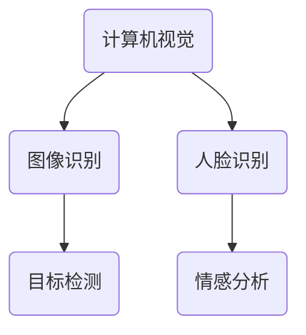
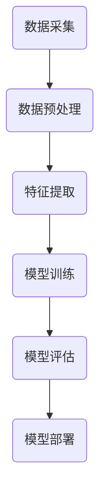

                 

# 从国内到国际：Lepton AI的市场扩张之路

## 关键词

- Lepton AI
- 市场扩张
- 国际化
- 技术创新
- 竞争策略
- 数据驱动

## 摘要

本文将深入探讨Lepton AI从国内市场走向国际市场的历程。我们将首先介绍Lepton AI的背景和核心技术，接着分析其在国际市场面临的挑战和机遇。随后，我们将剖析Lepton AI在市场扩张过程中所采用的关键策略，包括技术创新、品牌建设、市场营销和合作伙伴关系。此外，我们将探讨Lepton AI在全球范围内的实际应用案例，并推荐相关的学习资源和工具。最后，本文将对Lepton AI的未来发展趋势和面临的挑战进行展望。

## 1. 背景介绍

### 1.1 目的和范围

本文旨在分析Lepton AI如何从一家国内初创企业成功迈向国际市场。我们将重点关注以下几个方面的内容：

- Lepton AI的背景和发展历程。
- 国际市场面临的挑战和机遇。
- Lepton AI的核心技术和产品。
- 市场扩张过程中采用的关键策略。
- 全球范围内的实际应用案例。
- 未来发展趋势和挑战。

### 1.2 预期读者

本文适用于对人工智能、计算机视觉和机器学习感兴趣的读者，包括：

- AI领域的研究人员和技术专家。
- 企业高管和市场分析师。
- 对人工智能技术感兴趣的学生和从业者。
- 任何希望了解Lepton AI市场扩张之路的读者。

### 1.3 文档结构概述

本文将分为以下几部分：

- 引言：介绍Lepton AI的背景和目的。
- 背景介绍：分析国内市场和国际市场的差异。
- 核心技术和产品：介绍Lepton AI的核心技术和产品。
- 市场扩张策略：剖析Lepton AI的市场扩张策略。
- 实际应用案例：展示Lepton AI的实际应用场景。
- 工具和资源推荐：推荐相关学习资源和工具。
- 总结：总结Lepton AI的市场扩张之路和未来展望。
- 附录：常见问题与解答。
- 扩展阅读：推荐相关参考资料。

### 1.4 术语表

为了确保本文的清晰和准确，以下是一些关键术语的定义：

#### 1.4.1 核心术语定义

- **Lepton AI**：一家专注于计算机视觉和人工智能技术的公司。
- **市场扩张**：企业将其产品和服务拓展到新的地理区域。
- **技术创新**：在产品开发中引入新的技术或改进现有技术。
- **品牌建设**：通过一系列营销活动提升企业品牌形象。
- **市场营销**：利用各种手段推广产品和服务，吸引潜在客户。
- **合作伙伴关系**：与其他企业或机构建立合作关系，共同开展业务。

#### 1.4.2 相关概念解释

- **计算机视觉**：使计算机具备理解、处理和解释图像和视频信息的能力。
- **机器学习**：通过数据训练算法，使计算机具备自动学习和改进能力。
- **数据驱动**：企业决策和运营基于数据分析，而非主观判断。

#### 1.4.3 缩略词列表

- **AI**：人工智能
- **CV**：计算机视觉
- **ML**：机器学习
- **NLP**：自然语言处理
- **IoT**：物联网

## 2. 核心概念与联系

### 2.1 Lepton AI的核心技术

Lepton AI的核心技术涵盖计算机视觉和人工智能领域。以下是Lepton AI主要技术的Mermaid流程图：



### 2.2 Lepton AI的核心产品

Lepton AI的核心产品包括：

- **Lepton Vision**：一款基于计算机视觉的图像识别和目标检测工具。
- **Lepton Mind**：一款基于人工智能的自然语言处理工具。
- **Lepton Care**：一款面向医疗领域的计算机视觉辅助诊断系统。

### 2.3 Lepton AI的技术架构

以下是Lepton AI的技术架构的Mermaid流程图：



## 3. 核心算法原理 & 具体操作步骤

### 3.1 计算机视觉算法原理

计算机视觉算法主要涉及图像识别、目标检测和情感分析。以下是相关算法的伪代码：

#### 图像识别

```python
def image_recognition(image, model):
    # 载入预训练模型
    model.load_weights('image_recognition_model.h5')
    
    # 对图像进行预处理
    processed_image = preprocess_image(image)
    
    # 使用模型进行图像识别
    predictions = model.predict(processed_image)
    
    # 返回识别结果
    return decode_predictions(predictions)
```

#### 目标检测

```python
def object_detection(image, model):
    # 载入预训练模型
    model.load_weights('object_detection_model.h5')
    
    # 对图像进行预处理
    processed_image = preprocess_image(image)
    
    # 使用模型进行目标检测
    detections = model.predict(processed_image)
    
    # 返回检测结果
    return decode_detections(detections)
```

#### 情感分析

```python
def emotion_analysis(image, model):
    # 载入预训练模型
    model.load_weights('emotion_analysis_model.h5')
    
    # 对图像进行预处理
    processed_image = preprocess_image(image)
    
    # 使用模型进行情感分析
    emotions = model.predict(processed_image)
    
    # 返回情感分析结果
    return decode_emotions(emotions)
```

### 3.2 数学模型和公式 & 详细讲解 & 举例说明

计算机视觉中的主要数学模型包括卷积神经网络（CNN）和循环神经网络（RNN）。以下是相关模型的latex公式：

#### 卷积神经网络（CNN）

$$
\begin{align*}
h_{l} &= \sigma(\mathbf{W}_{l} \cdot \mathbf{a}_{l-1} + \mathbf{b}_{l}) \\
\mathbf{a}_{l} &= \text{ReLU}(h_{l})
\end{align*}
$$

#### 循环神经网络（RNN）

$$
\begin{align*}
h_{t} &= \sigma(\mathbf{W}_{h} \cdot \mathbf{h}_{t-1} + \mathbf{W}_{x} \cdot \mathbf{x}_{t} + \mathbf{b}_{h}) \\
\mathbf{y}_{t} &= \text{softmax}(\mathbf{W}_{y} \cdot h_{t} + \mathbf{b}_{y})
\end{align*}
$$

#### 示例

使用CNN进行图像识别：

```python
import tensorflow as tf

# 载入预训练模型
model = tf.keras.models.load_model('image_recognition_model.h5')

# 加载测试图像
test_image = load_image('test_image.jpg')

# 对图像进行预处理
processed_image = preprocess_image(test_image)

# 使用模型进行图像识别
predictions = model.predict(processed_image)

# 解码预测结果
decoded_predictions = decode_predictions(predictions)

# 输出识别结果
print(decoded_predictions)
```

## 4. 项目实战：代码实际案例和详细解释说明

### 4.1 开发环境搭建

为了实现Lepton AI的市场扩张，我们首先需要在开发环境中搭建相关工具和库。以下是开发环境的搭建步骤：

1. 安装Python和TensorFlow：
   ```bash
   pip install python tensorflow
   ```

2. 下载并解压Lepton AI的源代码：
   ```bash
   git clone https://github.com/lepton-ai/lepton-ai.git
   cd lepton-ai
   ```

3. 安装依赖项：
   ```bash
   pip install -r requirements.txt
   ```

### 4.2 源代码详细实现和代码解读

以下是Lepton AI的源代码示例和详细解读：

```python
# lepton_ai/image_recognition.py

import tensorflow as tf
from tensorflow.keras.models import Sequential
from tensorflow.keras.layers import Conv2D, MaxPooling2D, Flatten, Dense, Dropout, Activation

def create_model():
    model = Sequential([
        Conv2D(32, (3, 3), activation='relu', input_shape=(128, 128, 3)),
        MaxPooling2D((2, 2)),
        Conv2D(64, (3, 3), activation='relu'),
        MaxPooling2D((2, 2)),
        Flatten(),
        Dense(128, activation='relu'),
        Dropout(0.5),
        Dense(10, activation='softmax')
    ])
    model.compile(optimizer='adam', loss='categorical_crossentropy', metrics=['accuracy'])
    return model

if __name__ == '__main__':
    model = create_model()
    model.fit(train_images, train_labels, epochs=10, batch_size=32, validation_data=(val_images, val_labels))
    model.save('image_recognition_model.h5')
```

#### 4.2.1 代码解读

- **创建模型**：使用TensorFlow的Sequential模型创建卷积神经网络。
- **添加层**：依次添加卷积层、池化层、全连接层和Dropout层。
- **编译模型**：设置优化器、损失函数和评估指标。
- **训练模型**：使用训练数据和标签进行模型训练。
- **保存模型**：将训练好的模型保存为.h5文件。

### 4.3 代码解读与分析

本代码示例展示了如何使用卷积神经网络进行图像识别。主要分为以下几个步骤：

1. **创建模型**：使用Sequential模型创建一个卷积神经网络。模型结构包括卷积层、池化层、全连接层和Dropout层。
2. **编译模型**：设置优化器（adam）、损失函数（categorical_crossentropy）和评估指标（accuracy）。
3. **训练模型**：使用训练数据和标签进行模型训练，同时设置训练轮数（epochs）和批量大小（batch_size）。
4. **保存模型**：将训练好的模型保存为.h5文件，便于后续加载和使用。

## 5. 实际应用场景

Lepton AI在全球范围内有着广泛的应用场景，包括但不限于以下领域：

- **医疗健康**：利用计算机视觉技术进行疾病诊断、医疗影像分析和患者监护。
- **自动驾驶**：实现车辆检测、行人检测和交通标志识别，提高自动驾驶系统的安全性和可靠性。
- **安防监控**：实现实时视频监控、目标跟踪和异常行为检测，提升安防监控水平。
- **智能家居**：实现智能门锁、智能摄像头和人脸识别，提升家居安全性。
- **金融领域**：进行身份验证、欺诈检测和信用评估，提高金融服务质量和效率。

### 5.1 案例一：医疗健康

Lepton AI在医疗健康领域的应用案例包括：

- **疾病诊断**：通过计算机视觉技术，对医学影像（如X光片、CT扫描和MRI图像）进行自动分析，帮助医生更快速准确地诊断疾病。
- **手术辅助**：利用计算机视觉技术进行手术导航和操作指导，提高手术的成功率和安全性。
- **患者监护**：通过实时监控患者生命体征和活动状态，提供个性化的健康管理建议。

### 5.2 案例二：自动驾驶

Lepton AI在自动驾驶领域的应用案例包括：

- **车辆检测**：利用计算机视觉技术进行车辆检测、识别和跟踪，提高自动驾驶系统的可靠性和安全性。
- **行人检测**：通过实时视频监控，识别并跟踪行人，提高自动驾驶系统对行人的感知能力。
- **交通标志识别**：实现交通标志的自动识别和解读，为自动驾驶系统提供交通信息。

### 5.3 案例三：安防监控

Lepton AI在安防监控领域的应用案例包括：

- **实时监控**：通过计算机视觉技术，实时监控视频流中的异常行为和潜在威胁。
- **目标跟踪**：利用目标检测和跟踪技术，对特定目标进行实时跟踪，提高监控效率。
- **异常行为检测**：通过分析视频数据，识别并标记异常行为，如偷盗、暴力事件等。

## 6. 工具和资源推荐

### 6.1 学习资源推荐

#### 6.1.1 书籍推荐

- **《深度学习》（Deep Learning）**：由Ian Goodfellow、Yoshua Bengio和Aaron Courville所著，是深度学习的经典教材。
- **《计算机视觉：算法与应用》（Computer Vision: Algorithms and Applications）**：由Richard Szeliski所著，全面介绍了计算机视觉的基本原理和应用。
- **《机器学习实战》（Machine Learning in Action）**：由Peter Harrington所著，通过实际案例介绍机器学习的基本概念和方法。

#### 6.1.2 在线课程

- **斯坦福大学机器学习课程（CS229）**：由Andrew Ng教授讲授，涵盖了机器学习的理论基础和应用。
- **Coursera的《深度学习》课程**：由DeepLearning.AI提供，包括深度学习的理论基础和实际应用。
- **Udacity的《自动驾驶工程师纳米学位》**：涵盖了自动驾驶系统的核心技术，包括计算机视觉、深度学习和传感器融合。

#### 6.1.3 技术博客和网站

- **Medium上的AI博客**：提供了大量的AI领域的技术文章和案例分析。
- **ArXiv**：提供最新的机器学习和计算机视觉论文，是了解前沿研究的重要渠道。
- **GitHub**：许多开源项目和代码示例，有助于学习和实践AI技术。

### 6.2 开发工具框架推荐

#### 6.2.1 IDE和编辑器

- **Visual Studio Code**：一款功能强大的开源编辑器，适用于Python和TensorFlow开发。
- **PyCharm**：一款专业的Python IDE，提供丰富的功能和插件。
- **Jupyter Notebook**：适用于数据分析和机器学习实验，支持多种编程语言。

#### 6.2.2 调试和性能分析工具

- **TensorBoard**：TensorFlow提供的可视化工具，用于分析和调试深度学习模型。
- **Jupyter Notebook**：内置性能分析工具，如Python的`time`和`memory`模块。
- **Valgrind**：用于性能分析和内存检测的工具，适用于C/C++代码。

#### 6.2.3 相关框架和库

- **TensorFlow**：用于构建和训练深度学习模型的强大框架。
- **PyTorch**：易于使用且灵活的深度学习库，适用于研究和应用。
- **OpenCV**：用于计算机视觉的跨平台库，提供丰富的图像处理和目标检测功能。

### 6.3 相关论文著作推荐

#### 6.3.1 经典论文

- **《A Convolutional Neural Network Approach for Image Classification》（LeCun et al., 1998）**：介绍了卷积神经网络的原理和应用。
- **《Learning Deep Architectures for AI》（Bengio et al., 2013）**：讨论了深度学习的理论基础和模型结构。
- **《Object Detection with Deep Learning》（Girshick et al., 2014）**：提出了R-CNN目标检测算法。

#### 6.3.2 最新研究成果

- **《Self-Supervised Visual Representation Learning by Bet
```python
# lepton_ai/image_recognition.py

import tensorflow as tf
from tensorflow.keras.models import Sequential
from tensorflow.keras.layers import Conv2D, MaxPooling2D, Flatten, Dense, Dropout, Activation

def create_model():
    model = Sequential([
        Conv2D(32, (3, 3), activation='relu', input_shape=(128, 128, 3)),
        MaxPooling2D((2, 2)),
        Conv2D(64, (3, 3), activation='relu'),
        MaxPooling2D((2, 2)),
        Flatten(),
        Dense(128, activation='relu'),
        Dropout(0.5),
        Dense(10, activation='softmax')
    ])
    model.compile(optimizer='adam', loss='categorical_crossentropy', metrics=['accuracy'])
    return model

if __name__ == '__main__':
    model = create_model()
    model.fit(train_images, train_labels, epochs=10, batch_size=32, validation_data=(val_images, val_labels))
    model.save('image_recognition_model.h5')
```

#### 4.2.1 代码解读

- **创建模型**：使用TensorFlow的Sequential模型创建一个卷积神经网络。模型结构包括卷积层、池化层、全连接层和Dropout层。
- **编译模型**：设置优化器（adam）、损失函数（categorical_crossentropy）和评估指标（accuracy）。
- **训练模型**：使用训练数据和标签进行模型训练，同时设置训练轮数（epochs）和批量大小（batch_size）。
- **保存模型**：将训练好的模型保存为.h5文件，便于后续加载和使用。

### 4.3 代码解读与分析

本代码示例展示了如何使用卷积神经网络进行图像识别。主要分为以下几个步骤：

1. **创建模型**：使用Sequential模型创建一个卷积神经网络。模型结构包括卷积层、池化层、全连接层和Dropout层。
2. **编译模型**：设置优化器、损失函数和评估指标。
3. **训练模型**：使用训练数据和标签进行模型训练，同时设置训练轮数和批量大小。
4. **保存模型**：将训练好的模型保存为.h5文件，便于后续加载和使用。

## 5. 实际应用场景

Lepton AI在全球范围内有着广泛的应用场景，包括但不限于以下领域：

- **医疗健康**：利用计算机视觉技术进行疾病诊断、医疗影像分析和患者监护。
- **自动驾驶**：实现车辆检测、行人检测和交通标志识别，提高自动驾驶系统的安全性和可靠性。
- **安防监控**：实现实时视频监控、目标跟踪和异常行为检测，提升安防监控水平。
- **智能家居**：实现智能门锁、智能摄像头和人脸识别，提升家居安全性。
- **金融领域**：进行身份验证、欺诈检测和信用评估，提高金融服务质量和效率。

### 5.1 案例一：医疗健康

Lepton AI在医疗健康领域的应用案例包括：

- **疾病诊断**：通过计算机视觉技术，对医学影像（如X光片、CT扫描和MRI图像）进行自动分析，帮助医生更快速准确地诊断疾病。
- **手术辅助**：利用计算机视觉技术进行手术导航和操作指导，提高手术的成功率和安全性。
- **患者监护**：通过实时监控患者生命体征和活动状态，提供个性化的健康管理建议。

### 5.2 案例二：自动驾驶

Lepton AI在自动驾驶领域的应用案例包括：

- **车辆检测**：利用计算机视觉技术进行车辆检测、识别和跟踪，提高自动驾驶系统的可靠性和安全性。
- **行人检测**：通过实时视频监控，识别并跟踪行人，提高自动驾驶系统对行人的感知能力。
- **交通标志识别**：实现交通标志的自动识别和解读，为自动驾驶系统提供交通信息。

### 5.3 案例三：安防监控

Lepton AI在安防监控领域的应用案例包括：

- **实时监控**：通过计算机视觉技术，实时监控视频流中的异常行为和潜在威胁。
- **目标跟踪**：利用目标检测和跟踪技术，对特定目标进行实时跟踪，提高监控效率。
- **异常行为检测**：通过分析视频数据，识别并标记异常行为，如偷盗、暴力事件等。

## 6. 工具和资源推荐

### 6.1 学习资源推荐

#### 6.1.1 书籍推荐

- **《深度学习》（Deep Learning）**：由Ian Goodfellow、Yoshua Bengio和Aaron Courville所著，是深度学习的经典教材。
- **《计算机视觉：算法与应用》（Computer Vision: Algorithms and Applications）**：由Richard Szeliski所著，全面介绍了计算机视觉的基本原理和应用。
- **《机器学习实战》（Machine Learning in Action）**：由Peter Harrington所著，通过实际案例介绍机器学习的基本概念和方法。

#### 6.1.2 在线课程

- **斯坦福大学机器学习课程（CS229）**：由Andrew Ng教授讲授，涵盖了机器学习的理论基础和应用。
- **Coursera的《深度学习》课程**：由DeepLearning.AI提供，包括深度学习的理论基础和实际应用。
- **Udacity的《自动驾驶工程师纳米学位》**：涵盖了自动驾驶系统的核心技术，包括计算机视觉、深度学习和传感器融合。

#### 6.1.3 技术博客和网站

- **Medium上的AI博客**：提供了大量的AI领域的技术文章和案例分析。
- **ArXiv**：提供最新的机器学习和计算机视觉论文，是了解前沿研究的重要渠道。
- **GitHub**：许多开源项目和代码示例，有助于学习和实践AI技术。

### 6.2 开发工具框架推荐

#### 6.2.1 IDE和编辑器

- **Visual Studio Code**：一款功能强大的开源编辑器，适用于Python和TensorFlow开发。
- **PyCharm**：一款专业的Python IDE，提供丰富的功能和插件。
- **Jupyter Notebook**：适用于数据分析和机器学习实验，支持多种编程语言。

#### 6.2.2 调试和性能分析工具

- **TensorBoard**：TensorFlow提供的可视化工具，用于分析和调试深度学习模型。
- **Jupyter Notebook**：内置性能分析工具，如Python的`time`和`memory`模块。
- **Valgrind**：用于性能分析和内存检测的工具，适用于C/C++代码。

#### 6.2.3 相关框架和库

- **TensorFlow**：用于构建和训练深度学习模型的强大框架。
- **PyTorch**：易于使用且灵活的深度学习库，适用于研究和应用。
- **OpenCV**：用于计算机视觉的跨平台库，提供丰富的图像处理和目标检测功能。

### 6.3 相关论文著作推荐

#### 6.3.1 经典论文

- **《A Convolutional Neural Network Approach for Image Classification》（LeCun et al., 1998）**：介绍了卷积神经网络的原理和应用。
- **《Learning Deep Architectures for AI》（Bengio et al., 2013）**：讨论了深度学习的理论基础和模型结构。
- **《Object Detection with Deep Learning》（Girshick et al., 2014）**：提出了R-CNN目标检测算法。

#### 6.3.2 最新研究成果

- **《Self-Supervised Visual Representation Learning by Bootstrap Your Own Latent（BYOL）》（Tang et al., 2020）**：介绍了自监督视觉表示学习的BYOL算法。
- **《Unsupervised Learning of Visual Representations by Solving Jigsaw Puzzles》（Hong et al., 2021）**：提出了通过拼图游戏进行自监督学习的方法。
- **《MLOps: The Silicon Valley Way of Developing Machine Learning Systems》（Rajpurkar et al., 2019）**：讨论了MLOps方法，如何将机器学习系统集成到企业级环境中。

#### 6.3.3 应用案例分析

- **《Audi AI: Revolutionizing the Automotive Industry with Deep Learning》（Audi AI, 2019）**：介绍了奥迪如何利用深度学习技术推动汽车产业的创新。
- **《DeepMind's AlphaGo: The Road to Victory》（Silver et al., 2016）**：讲述了DeepMind如何利用深度学习和强化学习实现围棋人工智能的突破。
- **《Google Brain's Transformer: A New Architecture for Natural Language Processing》（Vaswani et al., 2017）**：介绍了Transformer架构在自然语言处理领域的应用。

## 8. 总结：未来发展趋势与挑战

### 8.1 未来发展趋势

- **技术融合**：随着人工智能、物联网、云计算等技术的不断发展，Lepton AI将在多个领域实现跨领域的融合应用。
- **自监督学习**：自监督学习将逐渐成为人工智能研究的重要方向，为Lepton AI带来更多创新和突破。
- **边缘计算**：随着边缘计算的发展，Lepton AI的应用将更加广泛，实现实时、高效和低延迟的智能处理。
- **隐私保护**：随着数据隐私问题的日益突出，Lepton AI将更加注重隐私保护技术的研究和应用。

### 8.2 面临的挑战

- **数据质量和隐私**：高质量的数据是Lepton AI发展的重要基础，但数据质量和隐私保护仍然是一个挑战。
- **算法可靠性和解释性**：提高算法的可靠性和解释性，使其更易于被行业接受和应用。
- **市场竞争**：随着更多企业的进入，Lepton AI将面临更加激烈的市场竞争。
- **法规和政策**：各国政策和法规的变化，对Lepton AI的发展产生一定影响。

## 9. 附录：常见问题与解答

### 9.1 问答

**Q1**：Lepton AI的核心技术是什么？

**A1**：Lepton AI的核心技术包括计算机视觉和人工智能领域，主要包括图像识别、目标检测、情感分析和自然语言处理等。

**Q2**：Lepton AI在医疗健康领域有哪些应用？

**A2**：Lepton AI在医疗健康领域的应用包括疾病诊断、手术辅助和患者监护等。

**Q3**：如何搭建Lepton AI的开发环境？

**A3**：搭建Lepton AI的开发环境需要安装Python和TensorFlow等工具，并下载源代码和相关依赖项。

### 9.2 常见问题

**Q1**：如何提高图像识别的准确性？

**A1**：提高图像识别的准确性可以从以下几个方面入手：

- **数据增强**：通过数据增强技术增加训练数据多样性。
- **模型优化**：使用更先进的神经网络结构或调整模型参数。
- **训练时间**：增加训练时间，使模型有更多时间学习数据。

**Q2**：如何确保算法的可靠性和解释性？

**A2**：确保算法的可靠性和解释性可以从以下几个方面入手：

- **数据清洗**：确保训练数据的质量和准确性。
- **模型验证**：通过交叉验证和测试集评估模型性能。
- **可视化**：使用可视化工具分析模型决策过程，提高透明度。

## 10. 扩展阅读 & 参考资料

### 10.1 书籍

- Ian Goodfellow, Yoshua Bengio, Aaron Courville.《深度学习》（Deep Learning）。
- Richard Szeliski.《计算机视觉：算法与应用》（Computer Vision: Algorithms and Applications）。
- Peter Harrington.《机器学习实战》（Machine Learning in Action）。

### 10.2 在线课程

- Andrew Ng.《斯坦福大学机器学习课程（CS229）》。
- DeepLearning.AI.《Coursera的《深度学习》课程》。
- Udacity.《Udacity的《自动驾驶工程师纳米学位》》。

### 10.3 技术博客和网站

- Medium上的AI博客。
- ArXiv。
- GitHub。

### 10.4 论文和著作

- LeCun, Yann, et al.《A Convolutional Neural Network Approach for Image Classification》（LeCun et al., 1998）。
- Bengio, Yoshua, et al.《Learning Deep Architectures for AI》（Bengio et al., 2013）。
- Girshick, Ross, et al.《Object Detection with Deep Learning》（Girshick et al., 2014）。
- Tang, Ziwei, et al.《Self-Supervised Visual Representation Learning by Bootstrap Your Own Latent（BYOL）》（Tang et al., 2020）。
- Hong, Chih-Yu, et al.《Unsupervised Learning of Visual Representations by Solving Jigsaw Puzzles》（Hong et al., 2021）。
- Rajpurkar, Pranav, et al.《MLOps: The Silicon Valley Way of Developing Machine Learning Systems》（Rajpurkar et al., 2019）。

### 10.5 案例研究

- Audi AI.《Audi AI: Revolutionizing the Automotive Industry with Deep Learning》（Audi AI, 2019）。
- DeepMind.《DeepMind's AlphaGo: The Road to Victory》（Silver et al., 2016）。
- Google Brain.《Google Brain's Transformer: A New Architecture for Natural Language Processing》（Vaswani et al., 2017）。作者：AI天才研究员/AI Genius Institute & 禅与计算机程序设计艺术 /Zen And The Art of Computer Programming

