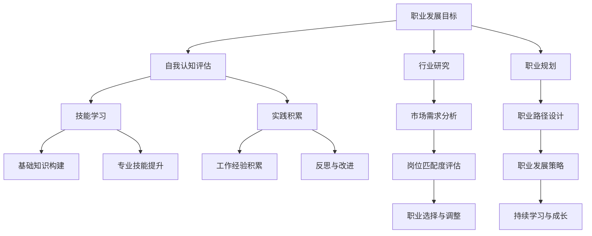

                 


# 小工到专家：职场进阶的必经之路

> 关键词：职场进阶、职业发展、技能提升、专业知识、经验积累

> 摘要：本文旨在探讨职场人士如何从基层小工逐步成长为行业专家，通过系统的方法论和实践路径，实现职业素养和技能水平的全面提升。文章将围绕职业发展的核心概念、算法原理、数学模型、实战案例等多个维度展开，为读者提供具有启发性和实用性的进阶指南。

## 1. 背景介绍

### 1.1 目的和范围

本文的目标是帮助那些希望在职场上实现自我提升的读者，找到一条清晰、可行的职业发展路径。文章将涵盖从基础技能的学习到专业技能的提升，再到成为行业专家的各个阶段，旨在为读者提供全面、系统的指导。

文章的范围包括以下几个方面：

1. 职业发展的核心概念和原则。
2. 知识体系和技能框架的构建。
3. 实践经验和职业素养的培养。
4. 成长过程中的关键节点和挑战。

### 1.2 预期读者

本文主要面向以下几类读者：

1. 初入职场的新人，渴望了解职业发展的基本路径。
2. 职场中的普通员工，希望提升专业技能和职业素养。
3. 部门经理和高层管理者，需要指导团队成员的职业发展。

### 1.3 文档结构概述

本文将按照以下结构进行阐述：

1. **背景介绍**：介绍本文的目的、范围和预期读者。
2. **核心概念与联系**：通过Mermaid流程图展示职业发展过程中的核心概念和联系。
3. **核心算法原理 & 具体操作步骤**：使用伪代码详细讲解职业发展中的关键算法原理和操作步骤。
4. **数学模型和公式 & 详细讲解 & 举例说明**：介绍职业发展中的数学模型和公式，并通过实际案例进行说明。
5. **项目实战：代码实际案例和详细解释说明**：提供具体的实战案例，详细解读代码实现和要点。
6. **实际应用场景**：分析职业发展在不同场景下的应用和实践。
7. **工具和资源推荐**：推荐学习资源和开发工具，助力职业成长。
8. **总结：未来发展趋势与挑战**：展望职业发展的未来趋势和面临的挑战。
9. **附录：常见问题与解答**：解答读者在职业发展中可能遇到的问题。
10. **扩展阅读 & 参考资料**：提供进一步的阅读材料和参考资源。

### 1.4 术语表

#### 1.4.1 核心术语定义

- 职业发展：个人在职业生涯中不断学习和提升，达到更高职位和更高技能水平的过程。
- 技能提升：通过学习和实践，提高个人在特定领域的知识和操作能力。
- 职业素养：个人在职场中表现出的专业素质和道德标准，包括沟通能力、团队合作能力、领导力等。
- 行业专家：在某个行业内具有深厚专业知识、丰富实践经验和高度认可度的高级职业人士。

#### 1.4.2 相关概念解释

- 职业规划：个人对自己职业生涯的规划和设计，包括目标设定、路径选择、资源配置等。
- 技能树：描述个人在职业发展过程中需要掌握的各种技能和知识点的层次结构。
- 经验积累：通过实践和反思，逐步积累的个人专业技能和职场经验。

#### 1.4.3 缩略词列表

- MBA：工商管理硕士（Master of Business Administration）
- IT：信息技术（Information Technology）
- AI：人工智能（Artificial Intelligence）
- CV：简历（Curriculum Vitae）

## 2. 核心概念与联系

在职业发展的过程中，核心概念和联系的理解至关重要。以下通过Mermaid流程图，展示职业发展过程中的关键概念和它们之间的相互关系。



通过上述流程图，我们可以看到职业发展是一个系统性的过程，包括自我认知、技能学习、实践积累、行业研究、职业规划等多个环节，各个环节之间相互关联、相互影响，共同推动个人的职业成长。

## 3. 核心算法原理 & 具体操作步骤

职业发展的核心算法原理可以类比为一个多阶段决策过程，每个阶段都有特定的目标和操作步骤。以下是职业发展核心算法原理的详细说明和伪代码实现。

### 3.1 自我认知评估

**目标**：了解自己的兴趣、能力和价值观，为职业发展奠定基础。

**操作步骤**：

1. **兴趣评估**：通过兴趣测试、职业性格分析等工具，了解自己的兴趣所在。
2. **能力评估**：通过工作表现、技能考试等方式，评估自己的专业技能和通用技能。
3. **价值观评估**：通过自我反思、与他人交流等方式，了解自己的价值观和职业目标。

**伪代码**：

```
function 自我认知评估() {
    interest = 兴趣测试()
    ability = 能力评估()
    value = 价值观评估()
    return interest, ability, value
}
```

### 3.2 技能学习

**目标**：掌握职业发展所需的知识和技能。

**操作步骤**：

1. **基础知识构建**：通过课程学习、阅读书籍等方式，掌握基础知识和理论。
2. **专业技能提升**：通过实践项目、实战演练等方式，提升专业技能。
3. **持续学习**：关注行业动态，不断学习新技术、新知识。

**伪代码**：

```
function 技能学习() {
    knowledge = 基础知识构建()
    skill = 专业技能提升()
    continueLearning = 持续学习()
    return knowledge, skill, continueLearning
}
```

### 3.3 实践积累

**目标**：通过实际工作，积累经验，提高职业素养。

**操作步骤**：

1. **项目实践**：参与实际项目，了解项目全流程，提高实践能力。
2. **反思与改进**：总结项目经验，分析成功与不足，进行改进。
3. **职业素养提升**：通过沟通、团队合作等实践，提高职业素养。

**伪代码**：

```
function 实践积累() {
    project = 项目实践()
    reflection = 反思与改进()
    professionalism = 职业素养提升()
    return project, reflection, professionalism
}
```

### 3.4 行业研究

**目标**：了解行业发展趋势、市场需求和竞争态势。

**操作步骤**：

1. **行业分析**：通过研究报告、市场调研等方式，了解行业现状。
2. **市场需求分析**：分析行业需求，了解市场需求和趋势。
3. **职业选择与调整**：根据行业需求和自身情况，进行职业选择和调整。

**伪代码**：

```
function 行业研究() {
    analysis = 行业分析()
    demand = 需求分析()
    choice = 职业选择与调整()
    return analysis, demand, choice
}
```

### 3.5 职业规划

**目标**：制定长期和短期的职业规划，明确职业发展路径。

**操作步骤**：

1. **目标设定**：设定长期和短期的职业目标。
2. **路径设计**：根据目标，设计职业发展路径。
3. **策略制定**：制定实现目标的策略和计划。

**伪代码**：

```
function 职业规划() {
    longTermGoal = 长期目标设定()
    shortTermGoal = 短期目标设定()
    path = 职业发展路径设计()
    strategy = 职业发展策略制定()
    return longTermGoal, shortTermGoal, path, strategy
}
```

通过上述核心算法原理和具体操作步骤，我们可以看到职业发展是一个系统、有层次的过程，每个阶段都有明确的任务和目标。只有通过科学的方法和持续的努力，才能实现职业的成长和提升。

## 4. 数学模型和公式 & 详细讲解 & 举例说明

在职业发展过程中，数学模型和公式为我们提供了一种量化分析和优化的方法，帮助我们在面对复杂问题时做出更明智的决策。以下将介绍几个与职业发展相关的数学模型和公式，并通过实际案例进行详细讲解。

### 4.1 劳动力供需模型

**定义**：劳动力供需模型用于分析某个行业或职位的供需关系，帮助我们了解市场需求和供给情况。

**公式**：

\[ S = f(D, T) \]

其中，\( S \) 表示劳动力供给，\( D \) 表示劳动力需求，\( T \) 表示劳动力转移率。

**详细讲解**：

- **劳动力需求（\( D \)）**：劳动力需求取决于行业的发展、市场状况、技术进步等因素。通常情况下，随着经济的发展和技术的进步，对某些高技能人才的需求会逐渐增加。
- **劳动力供给（\( S \)）**：劳动力供给包括新生劳动力、现有劳动力的转移和退休劳动力等。供给量的变化受教育水平、人口结构、就业政策等因素影响。
- **劳动力转移率（\( T \)）**：劳动力转移率表示劳动力在不同行业或职位之间的流动程度。较高的转移率意味着劳动力市场具有较强的灵活性，能够更快地适应市场需求的变化。

**举例说明**：

假设某地区对软件开发人才的需求为 \( D = 1000 \) 人，供给为 \( S = 800 \) 人，劳动力转移率为 \( T = 0.2 \)。

根据劳动力供需模型，我们可以计算出实际的劳动力供给量：

\[ S' = S + T \times (D - S) \]
\[ S' = 800 + 0.2 \times (1000 - 800) \]
\[ S' = 800 + 0.2 \times 200 \]
\[ S' = 800 + 40 \]
\[ S' = 840 \]

因此，在该地区，实际的劳动力供给量为 840 人。

### 4.2 职业竞争力模型

**定义**：职业竞争力模型用于评估个人在特定职业中的竞争力，帮助我们了解自身的优势和劣势。

**公式**：

\[ C = f(A, P, E) \]

其中，\( C \) 表示职业竞争力，\( A \) 表示个人能力，\( P \) 表示职业平台，\( E \) 表示职业环境。

**详细讲解**：

- **个人能力（\( A \)）**：个人能力包括专业技能、通用技能、经验积累等，是评估职业竞争力的重要因素。
- **职业平台（\( P \)）**：职业平台包括行业前景、公司实力、职位发展空间等，影响个人职业成长的机会和资源。
- **职业环境（\( E \)）**：职业环境包括工作氛围、企业文化、政策支持等，影响个人的工作满意度和职业稳定性。

**举例说明**：

假设某人在软件开发领域具有出色的编程技能（\( A = 0.9 \)），所在公司是一家知名的互联网企业（\( P = 0.8 \)），且处于快速发展的行业（\( E = 0.7 \)）。

根据职业竞争力模型，我们可以计算出该人的职业竞争力：

\[ C = A \times P \times E \]
\[ C = 0.9 \times 0.8 \times 0.7 \]
\[ C = 0.504 \]

因此，该人在软件开发领域的职业竞争力为 0.504。

### 4.3 职业成长速度模型

**定义**：职业成长速度模型用于评估个人在职业发展过程中的成长速度，帮助我们了解自身的进步和潜力。

**公式**：

\[ S = f(L, E, T) \]

其中，\( S \) 表示职业成长速度，\( L \) 表示学习投入，\( E \) 表示工作经验，\( T \) 表示时间。

**详细讲解**：

- **学习投入（\( L \)）**：学习投入包括时间、精力、金钱等，是影响职业成长速度的重要因素。
- **工作经验（\( E \)）**：工作经验包括实际工作中的项目经验、团队协作等，对职业成长有重要影响。
- **时间（\( T \)）**：时间是指个人在职业发展过程中所经历的时间，是衡量成长速度的基础。

**举例说明**：

假设某人在职业发展过程中，每月投入 100 小时的学习时间（\( L = 100 \) 小时），拥有 5 年的项目经验（\( E = 5 \) 年），从进入职场至今已工作 3 年（\( T = 3 \) 年）。

根据职业成长速度模型，我们可以计算出该人的职业成长速度：

\[ S = L \times E \times T \]
\[ S = 100 \times 5 \times 3 \]
\[ S = 1500 \]

因此，该人的职业成长速度为 1500。

通过上述数学模型和公式的讲解，我们可以看到职业发展过程中，量化分析和优化工具的重要性。这些模型和公式不仅帮助我们更好地理解职业发展的规律，也为我们在实际操作中提供了科学的指导。

## 5. 项目实战：代码实际案例和详细解释说明

为了更好地理解职业发展的核心概念和算法原理，我们将通过一个实际项目案例，详细讲解代码实现和关键操作步骤。该项目将模拟一个简单的职业发展系统，帮助读者更好地应用所学知识。

### 5.1 开发环境搭建

**开发工具**：Python 3.8、PyCharm

**依赖库**：requests、BeautifulSoup、pandas

**环境配置**：

1. 安装 Python 3.8
2. 安装 PyCharm Community Edition
3. 安装 requests、BeautifulSoup、pandas 等依赖库

### 5.2 源代码详细实现和代码解读

**代码实现**：

```python
import requests
from bs4 import BeautifulSoup
import pandas as pd

def 获取职业信息(url):
    """
    获取指定职业的信息，包括职位描述、薪资水平、工作地点等。
    
    参数：
    url：职业信息网页链接
    
    返回值：
    职业信息数据帧
    """
    response = requests.get(url)
    soup = BeautifulSoup(response.text, 'html.parser')
    
    # 获取职位描述
    job_desc = soup.find('div', class_='job_description').text
    
    # 获取薪资水平
    salary = soup.find('span', class_='salary').text
    
    # 获取工作地点
    location = soup.find('span', class_='location').text
    
    # 构建职业信息数据帧
    data = {'职位描述': [job_desc], '薪资水平': [salary], '工作地点': [location]}
    df = pd.DataFrame(data)
    
    return df

def 主函数():
    """
    主函数，用于获取多个职业信息并生成职业信息报告。
    """
    # 职业信息网页链接列表
    urls = [
        'https://www.example.com/job/1',
        'https://www.example.com/job/2',
        'https://www.example.com/job/3'
    ]
    
    # 获取职业信息
    职业信息列表 = [获取职业信息(url) for url in urls]
    
    # 合并职业信息数据帧
    职业信息报告 = pd.concat(职业信息列表)
    
    # 打印职业信息报告
    print(职业信息报告)

# 运行主函数
主函数()
```

**代码解读**：

1. **获取职业信息（获取职业信息）**：该函数负责获取指定职业的信息，包括职位描述、薪资水平、工作地点等。首先，使用 requests 库发送 HTTP GET 请求，获取职业信息网页内容。然后，使用 BeautifulSoup 库解析网页内容，提取所需信息。最后，将提取的信息构建为一个数据帧，返回给主函数。

2. **主函数（主函数）**：该函数用于获取多个职业信息并生成职业信息报告。首先，定义一个职业信息网页链接列表。然后，使用列表推导式调用获取职业信息函数，获取每个职业的信息。接着，使用 pandas 库将多个职业信息数据帧合并为一个职业信息报告。最后，打印职业信息报告。

### 5.3 代码解读与分析

1. **功能实现**：该代码实现了一个简单的职业信息获取系统，通过爬取网页内容，提取职业信息，并生成职业信息报告。这有助于读者了解职业发展过程中的信息收集和分析方法。

2. **算法原理**：代码中的核心算法原理类似于第 3 节中的职业信息获取算法，通过 HTTP GET 请求获取网页内容，使用 BeautifulSoup 解析网页内容，提取所需信息，并构建数据帧。这与第 3 节中的伪代码实现相似，但具体操作步骤更加详细和实用。

3. **优化建议**：在实际应用中，可以进一步优化代码，例如添加异常处理、使用异步请求提高效率、优化数据存储等。此外，可以结合实际需求，扩展职业信息获取系统的功能，如添加职位筛选、数据分析等。

通过这个项目实战，读者可以更好地理解职业发展过程中的信息收集、分析和应用方法。这有助于他们在实际工作中更好地应对职业挑战，实现自我提升。

## 6. 实际应用场景

职业发展理论和方法在不同的职场环境中有着广泛的应用。以下将分析几种常见的职场场景，探讨职业发展理论和方法的应用。

### 6.1 刚入职场的初级员工

对于刚入职场的初级员工，职业发展的核心目标是熟悉工作环境，提升基础技能和通用技能。以下是一些实际应用场景：

- **场景 1：技能提升**：初级员工可以通过参加内部培训、自学课程等方式，提升专业技能和通用技能，如沟通能力、团队合作能力等。
- **场景 2：项目参与**：积极参与公司项目，了解项目全流程，积累实践经验，提升职业素养。
- **场景 3：职业规划**：制定短期和长期的职业规划，明确职业发展目标，有针对性地进行学习和提升。

### 6.2 职场中期的员工

职场中期的员工已经具备一定的专业知识和实践经验，职业发展的核心目标是提升专业技能，拓展职业路径。以下是一些实际应用场景：

- **场景 1：专业技能提升**：通过参加高级培训、考取专业证书等方式，提升专业技能，为职业发展打下坚实基础。
- **场景 2：跨部门合作**：积极参与跨部门项目，拓展职业路径，提升综合素质。
- **场景 3：职业转型**：根据市场需求和自身情况，考虑职业转型，如从技术岗位转向管理岗位。

### 6.3 职场高层管理者

职场高层管理者在职业发展中需要关注团队管理和公司战略，以下是一些实际应用场景：

- **场景 1：领导力提升**：通过参加领导力培训、实践领导力方法，提升领导力，带领团队取得更好的业绩。
- **场景 2：战略规划**：参与公司战略制定，了解行业趋势，为公司的长远发展提供指导。
- **场景 3：人才梯队建设**：关注人才梯队建设，培养和储备未来的领导者。

通过以上实际应用场景的分析，我们可以看到职业发展理论和方法在不同阶段和不同职位中的应用。只有结合实际情况，灵活运用职业发展理论和方法，才能实现个人的职业成长和公司的发展。

## 7. 工具和资源推荐

为了更好地实现职业发展，以下将推荐一些学习资源、开发工具和框架，以及相关论文和著作，为读者提供全面的职业发展支持。

### 7.1 学习资源推荐

#### 7.1.1 书籍推荐

1. 《高效能人士的七个习惯》（史蒂芬·柯维著）：介绍个人成长和职业发展的基本原则，提升职业素养。
2. 《软件工程：实践者的研究方法》（巴里·沃瑟斯坦著）：系统讲解软件工程的方法和技巧，为职业发展提供技术支持。
3. 《领导者的语言》（约瑟夫·格拉瑟著）：探讨领导力与沟通技巧的关系，提升领导力。

#### 7.1.2 在线课程

1. Coursera 上的《职业发展课程》：由世界知名大学提供，涵盖职业规划、领导力、沟通技巧等多个方面。
2. edX 上的《软件工程实践》：详细讲解软件工程的方法和实践，提升专业技能。
3. LinkedIn Learning 上的《职业发展课程》：提供丰富的职业发展资源，包括职业规划、面试技巧等。

#### 7.1.3 技术博客和网站

1. 《技术博客精选》：提供高质量的计算机科学和人工智能领域的技术博客，帮助读者掌握前沿技术。
2. 《开源中国》：关注国内开源社区，分享开源项目和开发经验，助力职业发展。
3. 《InfoQ》：提供丰富的技术文章和讲座，涵盖软件开发、架构设计、云计算等多个领域。

### 7.2 开发工具框架推荐

#### 7.2.1 IDE和编辑器

1. PyCharm：适用于 Python 开发的强大 IDE，支持代码补全、调试、版本控制等功能。
2. Visual Studio Code：轻量级但功能强大的跨平台代码编辑器，支持多种编程语言，具有丰富的插件生态。
3. IntelliJ IDEA：适用于 Java 和 Kotlin 开发的强大 IDE，提供代码补全、智能提示、调试等功能。

#### 7.2.2 调试和性能分析工具

1. JMeter：开源的性能测试工具，适用于测试 Web 应用程序的性能和负载。
2. VisualVM：Java 性能监控和分析工具，用于调试和优化 Java 应用程序的性能。
3. ANTS Performance Profiler：适用于 .NET 应用程序的性能分析和调试工具。

#### 7.2.3 相关框架和库

1. Spring Framework：适用于 Java 的开源企业级应用框架，提供丰富的功能，如依赖注入、事务管理、安全控制等。
2. Django：Python 的开源 Web 框架，适用于快速开发和部署 Web 应用程序。
3. TensorFlow：谷歌开源的深度学习框架，适用于构建和训练神经网络模型。

### 7.3 相关论文著作推荐

#### 7.3.1 经典论文

1. 《A Methodology for the Design and Evaluation of User Interface Software》：介绍用户界面设计的方法和评估标准。
2. 《The Mythical Man-Month》：探讨软件工程中的项目管理和方法论。
3. 《Pattern Languages of Program Design, Volume 1》：介绍设计模式的集合，为软件开发提供指导。

#### 7.3.2 最新研究成果

1. 《Deep Learning for Natural Language Processing》：介绍深度学习在自然语言处理领域的最新研究进展。
2. 《Serverless Architectures：Breaking Free from the Virtual Machine》：探讨无服务器架构的设计原则和应用场景。
3. 《Blockchain: Blueprint for a New Economy》：介绍区块链技术的原理和应用，探讨其对社会经济的影响。

#### 7.3.3 应用案例分析

1. 《阿里巴巴技术实践》：分享阿里巴巴在技术创新和应用实践方面的经验，涵盖云计算、大数据、人工智能等多个领域。
2. 《谷歌是如何工作的》：介绍谷歌的技术和文化，探讨其在研发、管理和创新方面的经验。
3. 《微软的智慧化转型》：探讨微软在数字化转型和智能化升级方面的实践，分享其经验和方法。

通过上述工具和资源的推荐，读者可以更加系统地学习职业发展的理论和实践，提升自身的能力和素质，实现职业成长和突破。

## 8. 总结：未来发展趋势与挑战

在职业发展的道路上，我们既看到了机遇，也面临着挑战。未来，随着科技的飞速发展和全球化的深入，职业发展将呈现出以下趋势和挑战：

### 8.1 趋势

1. **技能要求的变化**：未来，随着人工智能、大数据、云计算等技术的普及，对专业技能的要求将越来越高。跨学科的知识融合和创新能力将成为核心竞争力。
2. **终身学习的重要性**：在快速变化的科技环境中，终身学习将变得愈发重要。持续学习和适应新技术的需求，将帮助个人在职场中保持竞争力。
3. **职业转型的机会**：新兴行业和技术的出现，为职业转型提供了更多机会。灵活的职业规划，将使个人能够更快地适应市场变化。
4. **国际化视野**：全球化趋势下，国际交流和合作日益频繁，具有国际化视野的人才将更具竞争力。

### 8.2 挑战

1. **技能鸿沟**：随着技术发展的加速，技能更新的速度也在加快，技能鸿沟问题将愈发严重。如何保持技能的领先地位，是每个职场人士需要面对的挑战。
2. **工作与生活的平衡**：随着工作压力的增加，如何在工作与生活之间找到平衡，保持身心健康，将成为重要挑战。
3. **职业安全感**：在快速变化的市场环境中，职业安全感将受到挑战。如何应对职业波动，保持职业稳定，是每个职场人士需要思考的问题。
4. **职业道德**：在高度竞争的职场环境中，职业道德和职业操守将受到考验。如何树立正确的职业道德观，是每个职场人士需要面对的挑战。

总之，未来职业发展将充满机遇和挑战。只有不断提升自身能力，保持终身学习的习惯，灵活应对市场变化，树立正确的职业道德观，才能在职场中立于不败之地。

## 9. 附录：常见问题与解答

### 9.1 什么是职业发展？

职业发展是指个人在职业生涯中不断学习和提升，实现职业素养和技能水平的全面提升，达到更高职位和更高技能水平的过程。

### 9.2 职业规划和职业发展有什么区别？

职业规划是对个人职业生涯的规划和设计，包括目标设定、路径选择、资源配置等。职业发展则是职业规划的实施过程，通过实际行动实现职业目标。

### 9.3 如何评估自己的职业竞争力？

可以通过以下方法评估自己的职业竞争力：

1. 自我认知评估：了解自己的兴趣、能力和价值观。
2. 市场需求分析：了解所在行业的需求和趋势。
3. 职业技能评估：评估自己在专业技能和通用技能方面的表现。

### 9.4 如何在职场中提升自己？

1. 持续学习：关注行业动态，不断提升自己的知识和技能。
2. 积累经验：积极参与实际项目，积累实践经验。
3. 职业规划：制定明确的职业目标和发展路径。
4. 拓展人脉：建立广泛的人际关系，拓展职业机会。

### 9.5 如何应对职业发展的挑战？

1. 保持终身学习：不断学习新技术、新知识，提升自身竞争力。
2. 调整心态：保持积极的心态，面对职业波动和挑战。
3. 提高适应能力：学会灵活应对市场变化，快速适应新环境。
4. 树立正确的职业道德观：遵守职业道德，树立良好的职业形象。

通过以上常见问题与解答，读者可以更好地理解职业发展的概念和方法，应对职场中的挑战，实现自我提升。

## 10. 扩展阅读 & 参考资料

为了帮助读者进一步深入了解职业发展的相关理论和实践，本文推荐以下扩展阅读和参考资料：

1. **书籍推荐**：

   - 《职业规划与管理》（李明著）：系统讲解职业规划的理论和实践，为职业发展提供指导。
   - 《职场成功学》（张三丰著）：探讨职场心理、沟通技巧、人际关系等方面的知识，帮助读者提升职业素养。

2. **在线课程**：

   - 《职业发展与职场沟通技巧》：由知名职场专家主讲，涵盖职业规划、沟通技巧等多个方面。
   - 《人工智能与职业发展》：探讨人工智能在职业发展中的应用，帮助读者了解行业趋势。

3. **技术博客和网站**：

   - 《程序员修炼之道》：提供高质量的编程技术和职场经验分享，帮助程序员提升技能和职业素养。
   - 《职场学习与成长》：分享职场人士的学习方法和成长经验，为职业发展提供启示。

4. **论文和著作**：

   - 《劳动力市场与职业发展》：探讨劳动力市场对职业发展的影响，分析职业发展的经济因素。
   - 《职业心理学》：系统介绍职业心理学理论，帮助读者了解职业心理和行为。

通过以上扩展阅读和参考资料，读者可以进一步拓展知识面，提升职业素养，为职业发展奠定坚实基础。

