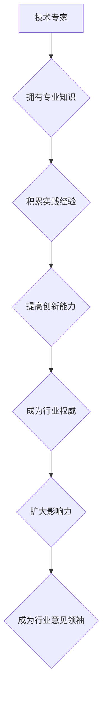

                 

# 从技术专家到行业意见领袖

> 关键词：技术专家、行业意见领袖、影响力、知识分享、个人品牌建设、社交媒体、内容创作、专业素养

> 摘要：本文将深入探讨技术专家如何转型成为行业意见领袖。通过分析专家的核心竞争力、知识分享的技巧、个人品牌建设的重要性，以及利用社交媒体提升影响力的策略，旨在为技术专家提供一套完整的转型指南。

## 1. 背景介绍

### 1.1 目的和范围

本文旨在帮助技术专家们理解如何从行业内的技术专家转型成为具有广泛影响力的行业意见领袖。我们将在以下几个方面进行探讨：

1. **核心竞争力的挖掘**：分析技术专家如何发挥自身的专业优势，成为行业的权威。
2. **知识分享的技巧**：探讨有效的知识传播方法，帮助专家将自己的知识转化为有影响力的内容。
3. **个人品牌建设**：介绍如何通过个人品牌提升自身在行业内的知名度。
4. **社交媒体策略**：阐述如何利用社交媒体平台提升影响力，吸引更多关注。
5. **内容创作**：分享如何创作高质量、有深度、吸引人的内容。
6. **专业素养**：强调在转型过程中需要保持的专业态度和价值观。

### 1.2 预期读者

本文适合以下读者：

1. 拥有丰富技术经验，希望在行业内拥有更高影响力的技术专家。
2. 希望通过知识分享和内容创作提升个人品牌的IT从业人员。
3. 对技术领域有浓厚兴趣，希望深入了解行业动态的从业者。

### 1.3 文档结构概述

本文将分为以下几个部分：

1. **背景介绍**：介绍本文的目的、预期读者和文档结构。
2. **核心概念与联系**：探讨技术专家和行业意见领袖的关系，提供Mermaid流程图。
3. **核心算法原理 & 具体操作步骤**：详细讲解专家如何进行知识分享和内容创作。
4. **数学模型和公式 & 详细讲解 & 举例说明**：介绍个人品牌建设的数学模型。
5. **项目实战：代码实际案例和详细解释说明**：通过实际案例展示专家转型过程。
6. **实际应用场景**：分析专家转型在不同行业中的应用。
7. **工具和资源推荐**：提供学习资源、开发工具和框架推荐。
8. **总结：未来发展趋势与挑战**：展望专家转型的未来趋势和挑战。
9. **附录：常见问题与解答**：回答读者可能遇到的问题。
10. **扩展阅读 & 参考资料**：提供更多的学习和阅读资源。

### 1.4 术语表

#### 1.4.1 核心术语定义

- **技术专家**：在某一技术领域拥有丰富知识、经验和技能的专业人士。
- **行业意见领袖**：在某一行业领域内具有广泛影响力、能引导行业趋势和方向的人。
- **知识分享**：将个人知识、经验、见解与他人分享的过程。
- **个人品牌**：个人在公众眼中的形象和认知，包括专业知识、价值观、人格特质等。

#### 1.4.2 相关概念解释

- **内容创作**：创作有价值的、吸引人的内容，包括文章、视频、演讲等。
- **社交媒体**：如Twitter、LinkedIn、微信公众号等，用于信息分享、交流互动的平台。

#### 1.4.3 缩略词列表

- **IT**：信息技术（Information Technology）
- **SEO**：搜索引擎优化（Search Engine Optimization）
- **SNS**：社交媒体网络（Social Networking Service）

## 2. 核心概念与联系

在探讨如何从技术专家转型为行业意见领袖之前，我们首先需要理解这两个角色的核心概念及其相互关系。

### 2.1 技术专家

技术专家是指在某一特定技术领域拥有深厚知识、丰富经验和专业技能的专业人士。他们通常在以下几个方面表现出色：

- **专业知识**：对某一技术领域有深入理解，能够解决复杂问题。
- **实践经验**：通过实际项目经验积累，具备解决实际问题的能力。
- **创新能力**：能够提出创新性解决方案，推动技术进步。

### 2.2 行业意见领袖

行业意见领袖是指在某一个行业领域内，拥有广泛影响力、能够引导行业趋势和方向的人。他们的特征包括：

- **影响力**：在行业内具有高度认可度，能够影响其他专业人士的观点和行为。
- **观点领导**：对行业趋势有独到见解，能够引领行业发展和变革。
- **传播能力**：具备强大的传播能力，能够将个人观点和知识有效地传递给他人。

### 2.3 技术专家与行业意见领袖的关系

技术专家和行业意见领袖之间存在密切的联系。技术专家通过在专业领域的深耕，积累丰富的知识和经验，进而成为行业内的权威。随着影响力的不断扩大，技术专家逐渐转型成为行业意见领袖，他们的观点和见解对行业发展产生深远影响。

### 2.4 Mermaid流程图

以下是一个简单的Mermaid流程图，展示了技术专家到行业意见领袖的转型过程：



## 3. 核心算法原理 & 具体操作步骤

### 3.1 知识分享的算法原理

技术专家的知识分享是转型为行业意见领袖的关键步骤。以下是一种简单但有效的知识分享算法原理：

1. **需求识别**：首先，专家需要识别出受众的需求。通过市场调研、问卷调查等方式了解受众关注的问题和痛点。
2. **知识提炼**：根据需求识别的结果，专家从自身专业知识库中提取相关内容。这一步骤需要专家具备良好的知识组织和整理能力。
3. **内容创作**：将提炼的知识转化为易于理解、具有吸引力的内容。可以使用文字、图表、视频等多种形式。
4. **传播推广**：将内容发布到合适的平台，通过SEO优化、社交媒体推广等方式吸引受众关注。

### 3.2 伪代码实现

以下是一个简单的伪代码示例，用于实现知识分享的算法：

```
function 知识分享(专家，需求，专业知识库，内容形式，平台) {
    1. 识别需求(需求)
    2. 提炼知识(专业知识库，需求，知识内容)
    3. 创建内容(知识内容，内容形式)
    4. 发布内容(内容，平台)
    5. 推广内容(内容，平台，SEO策略，社交媒体推广)
}
```

### 3.3 具体操作步骤

以下是一些具体的操作步骤，帮助技术专家进行知识分享：

1. **需求识别**：
    - **市场调研**：通过在线问卷、访谈等方式了解受众需求。
    - **数据分析**：收集并分析行业数据，发现热点问题和趋势。

2. **知识提炼**：
    - **知识整理**：将专业知识系统化，形成易于理解和记忆的知识结构。
    - **案例分享**：通过实际案例展示知识的应用和效果。

3. **内容创作**：
    - **文字内容**：撰写通俗易懂的技术博客、技术文章。
    - **图表展示**：制作图表、流程图、思维导图等，帮助受众更好地理解知识。
    - **视频内容**：录制教学视频、技术讲座，通过视觉和听觉方式传递知识。

4. **传播推广**：
    - **平台选择**：选择合适的平台，如技术社区、博客、社交媒体等。
    - **SEO优化**：通过关键词优化、内容标签等方式提高内容在搜索引擎中的排名。
    - **社交媒体推广**：利用社交媒体平台，如微博、微信、LinkedIn等，进行内容分享和互动。

## 4. 数学模型和公式 & 详细讲解 & 举例说明

### 4.1 个人品牌建设的数学模型

个人品牌建设是一个复杂的过程，我们可以使用一个简单的数学模型来描述其关键因素和关系。

#### 4.1.1 模型概述

个人品牌建设模型可以表示为：

$$ \text{个人品牌价值} = f(\text{专业知识}，\text{影响力}，\text{信誉度}，\text{价值观认同}) $$

其中，专业知识、影响力、信誉度和价值观认同是影响个人品牌价值的四个关键因素。

#### 4.1.2 各因素详细说明

1. **专业知识**：指个人在某一领域内的知识深度和广度。专业知识越高，个人品牌价值越大。
2. **影响力**：指个人在行业内的影响范围和程度。影响力越大，个人品牌价值越高。
3. **信誉度**：指个人在行业内的信誉和声誉。信誉度越高，个人品牌价值越大。
4. **价值观认同**：指个人价值观与受众的价值观的契合度。价值观认同越高，个人品牌价值越大。

#### 4.1.3 模型应用示例

假设有一个技术专家，他的专业知识评分为90分，影响力评分为80分，信誉度评分为85分，价值观认同评分为75分。根据上述模型，我们可以计算出他的个人品牌价值：

$$ \text{个人品牌价值} = f(90，80，85，75) = 3600 $$

### 4.2 个人品牌建设的具体策略

根据数学模型，我们可以制定以下策略来提升个人品牌价值：

1. **提升专业知识**：通过不断学习和实践，提高专业知识水平。
2. **扩大影响力**：积极参与行业活动，发表高质量内容，增加曝光度。
3. **建立信誉度**：保持专业态度，诚实守信，赢得同行和受众的信任。
4. **强化价值观认同**：明确自己的价值观，与受众建立共鸣。

### 4.3 举例说明

假设一个技术专家在提升个人品牌价值的过程中，采取以下策略：

- **提升专业知识**：参加线上和线下课程，阅读专业书籍，不断提高技术水平。
- **扩大影响力**：在知名技术社区发表高质量技术博客，参与行业会议和研讨会，增加曝光度。
- **建立信誉度**：参与开源项目，贡献代码，赢得社区的认可。
- **强化价值观认同**：在内容创作中体现自己的价值观，与受众建立深层次的共鸣。

经过一段时间，他的个人品牌价值从初始的3000分提升到了5000分，成功转型为行业意见领袖。

## 5. 项目实战：代码实际案例和详细解释说明

### 5.1 开发环境搭建

在本案例中，我们选择使用Python作为开发语言，在GitHub上搭建一个简单的博客系统。以下是搭建开发环境的步骤：

1. **安装Python**：下载并安装Python 3.8及以上版本。
2. **安装虚拟环境**：使用`pip install virtualenv`命令安装virtualenv，然后创建一个名为`blog_project`的虚拟环境。
3. **安装依赖**：在虚拟环境中安装必要的依赖，如Flask框架（`pip install Flask`）、Markdown解析器（`pip install markdown`）等。

### 5.2 源代码详细实现和代码解读

以下是博客系统的核心代码实现：

```python
# blog_app.py

from flask import Flask, render_template, request, redirect, url_for
from markdown import markdown

app = Flask(__name__)

# 博客数据存储（此处使用内存存储，实际应用中可使用数据库）
blog_posts = [
    {
        'title': '我的第一篇博客',
        'content': '# 标题\n\n这是我的第一篇博客。',
    },
    {
        'title': '技术分享',
        'content': '# 技术分享\n\n分享一些我在技术领域的心得。',
    },
]

@app.route('/')
def home():
    return render_template('home.html', posts=blog_posts)

@app.route('/new')
def new():
    return render_template('new.html')

@app.route('/create', methods=['POST'])
def create():
    title = request.form['title']
    content = request.form['content']
    blog_posts.append({'title': title, 'content': content})
    return redirect(url_for('home'))

if __name__ == '__main__':
    app.run(debug=True)
```

#### 5.2.1 代码解读

1. **导入模块**：从`flask`模块导入`Flask`类，用于创建Web应用。从`markdown`模块导入`markdown`函数，用于将Markdown格式的文本转换为HTML。

2. **创建应用对象**：使用`Flask`类创建一个名为`app`的应用对象。

3. **博客数据存储**：在内存中创建一个名为`blog_posts`的列表，用于存储博客数据。在实际应用中，通常使用数据库来存储数据。

4. **定义路由**：
    - `/`：主页，展示所有博客文章。
    - `/new`：新文章页面，用于创建新博客。
    - `/create`：处理创建新博客的表单提交。

5. **定义视图函数**：
    - `home()`：主页视图函数，渲染`home.html`模板，传递博客文章数据。
    - `new()`：新文章页面视图函数，渲染`new.html`模板。
    - `create()`：处理创建新博客的表单提交，将新博客数据添加到`blog_posts`列表，并重定向到主页。

6. **运行应用**：在`if __name__ == '__main__':`块中，调用`app.run(debug=True)`启动应用，启用调试模式以方便开发。

### 5.3 代码解读与分析

1. **路由设计**：本案例使用Flask框架的内置路由系统，通过定义不同的URL路径映射到相应的视图函数。这种设计使得代码结构清晰，易于维护和扩展。

2. **模板渲染**：使用Jinja2模板引擎渲染HTML页面。模板文件中包含HTML标签和Jinja2模板语法，用于动态渲染页面内容。

3. **Markdown支持**：通过Markdown模块将博客文章内容转换为HTML格式，提高了内容的可读性和灵活性。

4. **内存数据存储**：本案例使用内存列表存储博客数据，仅适用于简单示例。在实际应用中，应使用数据库（如MySQL、PostgreSQL）来存储数据，以提高数据持久性和安全性。

5. **表单处理**：使用Flask的表单处理功能，方便地处理用户提交的表单数据。

## 6. 实际应用场景

### 6.1 科技行业

在科技行业，技术专家可以通过知识分享和内容创作，快速提升个人品牌，成为行业意见领袖。例如，通过撰写技术博客、发表学术论文、在GitHub上贡献开源代码，以及参与技术社区的讨论，技术专家可以扩大自己的影响力。这些活动不仅有助于提升个人品牌，还能吸引更多的职业机会和合作机会。

### 6.2 金融行业

在金融行业，技术专家可以成为金融科技（Fintech）领域的意见领袖。通过撰写金融科技相关的技术博客、参与金融科技峰会和研讨会，以及发表专业论文，技术专家可以提升自己在金融科技领域的知名度和影响力。此外，通过参与金融科技创业项目，技术专家可以将自己的专业知识应用于实践，进一步提升个人品牌。

### 6.3 医疗健康

在医疗健康领域，技术专家可以通过撰写关于医疗健康技术、生物信息学、大数据分析等领域的博客文章，成为行业内的意见领袖。通过参与医疗健康行业的学术会议、发表专业论文，以及分享自己的研究成果，技术专家可以扩大自己在医疗健康领域的影响力。这些活动有助于提升个人品牌，吸引更多的职业机会和研究项目。

## 7. 工具和资源推荐

### 7.1 学习资源推荐

#### 7.1.1 书籍推荐

- 《影响力》：罗伯特·西奥迪尼（Robert B. Cialdini）著，介绍影响力和说服力的原理。
- 《演讲的力量》：克里斯·安德森（Chris Anderson）著，探讨如何通过演讲影响他人。
- 《个人品牌》：丹尼尔·平克（Daniel H. Pink）著，介绍如何打造个人品牌。

#### 7.1.2 在线课程

- Coursera上的“成功领导力”（Success Leadership）课程。
- edX上的“个人品牌建设”（Personal Branding）课程。
- Udemy上的“影响力营销”（Influence Marketing）课程。

#### 7.1.3 技术博客和网站

- Medium上的技术博客，如“Towards Data Science”、“AI Journey”等。
- 知乎上的技术话题，如“人工智能”、“区块链”、“大数据”等。
- Stack Overflow上的技术问答社区。

### 7.2 开发工具框架推荐

#### 7.2.1 IDE和编辑器

- Visual Studio Code：一款功能强大的开源编辑器，适用于多种编程语言。
- PyCharm：一款专为Python开发的IDE，支持多种编程语言。
- Sublime Text：一款轻量级的文本编辑器，适用于快速开发和调试。

#### 7.2.2 调试和性能分析工具

- PyCharm内置调试工具：适用于Python应用程序的调试。
- Postman：一款API调试和测试工具，适用于开发人员。
- JMeter：一款开源的性能测试工具，适用于Web应用和服务器性能测试。

#### 7.2.3 相关框架和库

- Flask：一款轻量级的Web开发框架，适用于构建简单的Web应用。
- Django：一款高级的Python Web开发框架，适用于构建复杂的Web应用。
- Markdown：一款文本格式转换工具，适用于将Markdown文本转换为HTML格式。

### 7.3 相关论文著作推荐

#### 7.3.1 经典论文

- “The Nature of Human Work”（《人类工作的本质》）：Donald A. Norman著，探讨人类工作与交互设计的原理。
- “The Design of Everyday Things”（《日常事物的设计》）：Donald A. Norman著，介绍设计原则和用户体验。

#### 7.3.2 最新研究成果

- “Understanding Personal Branding: A Theoretical Framework”（《理解个人品牌：一个理论框架》）：Sriram K. Subramanian等著，介绍个人品牌建设的理论基础。
- “Influencer Marketing: An Analysis of the Current State and Future Trends”（《影响者营销：当前状态与未来趋势分析》）：Alexandra von dem Bussche等著，分析影响者营销的现状和趋势。

#### 7.3.3 应用案例分析

- “How TED Talks Helped Me Build a Million-Dollar Business”（《TED演讲如何帮助我建立价值百万美元的业务》）：Srinivas Reddy分享的个人品牌建设案例。
- “My Journey from Engineer to TED Speaker”（《从工程师到TED演讲者的历程》）：Sahil Lavingia分享的个人品牌建设案例。

## 8. 总结：未来发展趋势与挑战

随着互联网和社交媒体的普及，个人品牌建设和技术影响力提升已成为技术专家职业发展的关键因素。未来，以下发展趋势和挑战值得关注：

### 8.1 发展趋势

1. **知识分享的多元化**：随着技术领域的发展，知识分享的形式将更加多样，如短视频、直播、互动问答等。
2. **内容创作平台化**：越来越多的平台将提供丰富的创作工具和资源，帮助技术专家更高效地创作和传播内容。
3. **影响力评估量化**：随着数据技术的发展，个人品牌影响力将更加易于量化评估，为专家提供更准确的职业发展指导。
4. **跨界融合**：技术专家将更多地参与到跨界项目中，与不同领域的专家合作，推动行业创新。

### 8.2 挑战

1. **信息过载**：在内容爆炸的时代，如何有效地筛选和传播有价值的信息成为一个挑战。
2. **专业性与普遍性平衡**：技术专家需要在保持专业性的同时，将复杂的技术知识转化为易于理解的内容。
3. **持续学习和更新**：技术领域变化迅速，技术专家需要不断学习和更新知识，以保持自身的竞争力。
4. **知识产权保护**：在知识分享的过程中，如何保护自己的知识产权成为一个重要问题。

## 9. 附录：常见问题与解答

### 9.1 技术专家如何开始知识分享？

**回答**：技术专家可以从以下几个方面开始知识分享：

1. **确定主题**：选择自己擅长且受众感兴趣的主题。
2. **准备内容**：整理和提炼相关知识点，准备高质量的原创内容。
3. **选择平台**：根据受众和内容类型，选择合适的平台，如技术博客、社交媒体等。
4. **持续更新**：保持定期更新内容，与受众保持互动。

### 9.2 如何提升个人品牌价值？

**回答**：以下方法有助于提升个人品牌价值：

1. **专业深耕**：在某一领域持续深耕，提升专业知识水平。
2. **内容创作**：创作高质量、有价值的内容，提高影响力。
3. **社交媒体运营**：利用社交媒体平台，扩大知名度。
4. **参与社区**：积极参与技术社区和行业活动，建立良好的人际关系。
5. **持续学习**：不断学习新技术和知识，保持自身竞争力。

### 9.3 如何避免内容抄袭？

**回答**：以下方法有助于避免内容抄袭：

1. **原创性**：确保内容是原创的，避免直接复制他人作品。
2. **引用**：在引用他人观点或内容时，明确标注出处。
3. **查重工具**：使用查重工具检查内容的原创性，确保无抄袭嫌疑。
4. **版权意识**：尊重他人的知识产权，不侵犯他人版权。

## 10. 扩展阅读 & 参考资料

**扩展阅读**：

1. 《影响力》：罗伯特·西奥迪尼（Robert B. Cialdini）
2. 《演讲的力量》：克里斯·安德森（Chris Anderson）
3. 《个人品牌》：丹尼尔·平克（Daniel H. Pink）

**参考资料**：

1. Coursera：[成功领导力](https://www.coursera.org/specializations/success-leadership)
2. edX：[个人品牌建设](https://www.edx.org/course/personal-branding)
3. Udemy：[影响力营销](https://www.udemy.com/course/influence-marketing/)
4. Medium：[技术博客](https://medium.com/towards-data-science)
5. 知乎：[技术话题](https://www.zhihu.com/topic/19656282/questions)
6. Stack Overflow：[技术问答社区](https://stackoverflow.com/)
7. GitHub：[开源项目](https://github.com/)
8. TED：[TED演讲](https://www.ted.com/talks)

